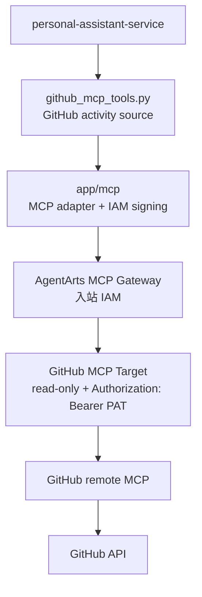

# Feature 17: GitHub MCP Activity Data Source

本 Feature 先落地 **AgentArts MCP Gateway + GitHub activity data source**。目标是跑通 Personal Assistant 通过 AgentArts MCP Gateway 访问 GitHub 官方 remote MCP 的平台接入、凭据边界、read-only Target 配置和 Service 内部 wrapper。

这里的“tool”不是用户视角的 root capability，也不是把 GitHub MCP 的全部原子工具直接暴露给 Agent。首期只提供面向后续 Report 使用的内部 GitHub activity source functions，用于查询 commits、pull requests、issues、reviews / comments 等工程活动。

Implementation Plan 见 [plan.md](./plan.md)。

## 背景

Personal Assistant 需要引入 AgentArts MCP Gateway 作为外部 MCP Server 的平台入口。当前最适合首个 MCP 场景的是 GitHub 工程活动数据：

- 现有 GitHub local tools 偏仓库浏览、文件读取、代码搜索和 star；
- 日报 / 周报 / 月报后续需要 GitHub activity timeline；
- 先独立验证 MCP Gateway，可把平台接入风险从 Report 产品能力中拆出来。

本 Feature 只解决“GitHub 工程活动数据源是否可稳定接入”。用户可见的 `generate_report` root tool 放到 Feature 18。

图类型：**Component Diagram（组件图）**。用于说明 GitHub MCP data source 的系统边界。



## 目标

- 在 AgentArts 控制台手动创建 `gateway-github-mcp` 与 `target-github-mcp`。
- GitHub Target 指向 GitHub remote MCP read-only endpoint：`https://api.githubcopilot.com/mcp/readonly`。
- Target 出站认证配置为 `Authorization: Bearer <GitHub PAT>`。
- Service 使用 WAT → AgentArts Identity STS provider → 临时 IAM 凭据，对 MCP Gateway 请求做 IAM 签名。
- Service 新增 GitHub activity source wrapper，输出统一 `GitHubActivityEvent`。
- 不让 GitHub PAT、WAT、STS、IAM 签名材料进入 LLM prompt、tool schema、SSE、日志或业务数据库。

## 范围

### 包含

- `app/mcp/` 轻量配置封装：
  - Gateway URL；
  - IAM signing；
  - timeout；
  - capability check；
  - 错误映射。
- `app/tools/github_mcp_tools.py` 内部 source functions：
  - `github_mcp_resolve_identity`；
  - `github_mcp_list_repositories`；
  - `github_mcp_search_activity`；
  - `github_mcp_get_detail`。
- `GitHubActivityEvent` 数据结构。
- typed settings：
  - `GITHUB_MCP_ENABLED`；
  - `GITHUB_MCP_GATEWAY_URL`；
  - `GITHUB_MCP_AUTH_MODE=iam`；
  - `GITHUB_MCP_STS_PROVIDER_NAME`；
  - `GITHUB_MCP_TIMEOUT_SECONDS`；
  - `GITHUB_MCP_TOOL_PREFIX`。
- 单元测试、集成测试和 staging smoke test 覆盖 Gateway / Target / credential boundary。

### 不包含

- 不新增 `generate_report`。
- 不实现日报 / 周报 / 月报生成。
- 不迁移 Email / Calendar tools。
- 不迁移现有 GitHub repository browsing tools。
- 不提供通用 raw MCP passthrough。
- 不实现 GitHub 写操作。
- 不代表 Web Chat 当前登录用户查询 GitHub。

## 身份与权限边界

GitHub MCP data source 使用 **personal assistant agent 平台身份**，不代表 Web Chat 当前登录用户。

- `target-github-mcp` 中的 GitHub PAT 是平台侧凭证；
- GitHub MCP Server 看到的 `me` 是 PAT 所属 GitHub 账号 / platform GitHub account；
- `actor = platform` 表示该平台账号；
- 如未来需要“当前用户自己的 GitHub 活动”，应作为单独的 user-delegated GitHub data source 设计。

Service 调 AgentArts MCP Gateway 的生产认证路径为：

```text
X-HW-AgentGateway-Workload-Access-Token
  -> AgentArtsRuntimeContext
  -> AgentArts Identity STS provider
  -> temporary IAM credentials
  -> HuaweiCloud API signing SDK
  -> AgentArts MCP Gateway
```

本地开发沿用已有 `.agent_identity.json` / customer-owned local workload fallback。长期 AK/SK 只允许用于本地 CLI / helper smoke test，不作为 Service 默认运行路径。

## 验收标准

### AC1：Gateway / Target 配置可执行

- [ ] `gateway-github-mcp` 入站认证使用 IAM。
- [ ] `target-github-mcp` 指向 `https://api.githubcopilot.com/mcp/readonly`。
- [ ] Target 出站 header 为 `Authorization: Bearer <GitHub PAT>`。
- [ ] PAT 使用 fine-grained read-only 权限，并限制到报表需要读取的 repository。

### AC2：Service 能调用 GitHub MCP data source

- [ ] `github_mcp_resolve_identity` 返回 platform GitHub account。
- [ ] `github_mcp_list_repositories` 返回平台账号可见仓库。
- [ ] `github_mcp_search_activity` 能按时间窗口、repository、`actor = platform` 和 event type 查询活动。
- [ ] `github_mcp_get_detail` 能展开 commit / PR / issue 详情。

### AC3：凭据边界安全

- [ ] MCP source public schema 不包含 `access_token`、`api_key`、`secret`、PAT、AK/SK 或 STS 字段。
- [ ] GitHub PAT 不进入 Service settings、tool result、SSE、日志、LLM-visible error 或业务数据库。
- [ ] WAT / STS / IAM signing header 不进入日志或 LLM-visible error。

### AC4：失败可诊断且可降级

- [ ] Gateway unavailable 映射为 GitHub source unavailable。
- [ ] WAT 缺失、STS provider 缺失、STS 兑换失败、IAM 401 / 403 均映射为 typed warning。
- [ ] Target 出站 401 优先指向 `Authorization` header name、`Bearer` prefix 和 PAT 值排查。
- [ ] Target 出站 403 优先指向 PAT repo 范围和只读权限排查。

### AC5：不扩大用户可见能力

- [ ] 不注册 `generate_report`。
- [ ] 不把 GitHub MCP 原子工具直接暴露为 root capability。
- [ ] GitHub repository browsing、文件读取、代码搜索、star 仍走现有 local tools。

## 依赖

- Feature 6：现有 GitHub repository browsing tools 与 User Federation 语义作为对照边界。
- Chore 5：Runtime 从 Gateway header 提取 `X-HW-AgentGateway-Workload-Access-Token`。
- AgentArts MCP Gateway 控制台能力：创建 Gateway / Target、配置 IAM 入站、配置 API Key 出站 header。
- AgentArts Identity STS provider：用于 Service 以临时 IAM 凭据签名调用 Gateway。

## 参考

- [plan.md](./plan.md)
- [backend_architecture.md §2.3 AgentArts Gateway Header 注入](../../../../architecture/backend_architecture.md#23-agentarts-gateway-header-注入)
- [cloud-service/huaweicloud/agent-identity.md](../../../../architecture/cloud-service/huaweicloud/agent-identity.md)
- [ADR-016: Secretless Credential Injection via AgentArts Identity](../../../../architecture/ADR/ADR-016-secretless-credential-injection.md)
