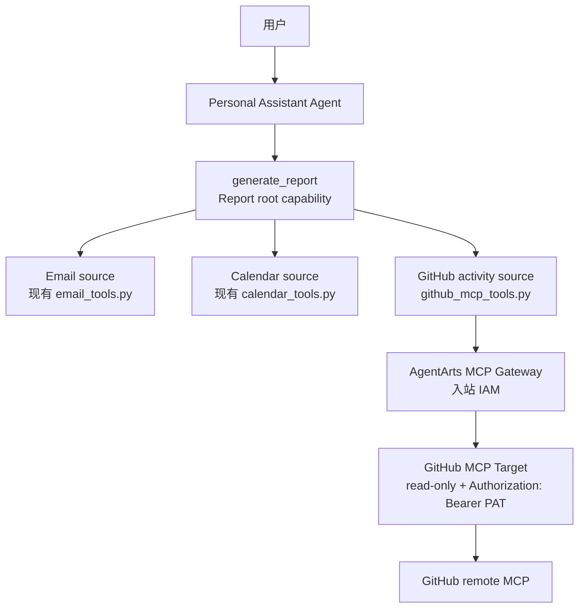

# Feature 17: Report Root Capability + AgentArts MCP Gateway GitHub Data Source

本 Feature 新增 **Report（报表）root capability**：用户可以通过自然语言生成日/周/月报、工作总结或研发进展总结。Report 能力统一编排多个 data source，包括现有 Email / Calendar tools，以及本次新增的 GitHub MCP data source。

本 Feature 同时验证 **AgentArts MCP Gateway** 在 Personal Assistant 中的首个正式数据源接入场景：通过 Gateway 接入 GitHub 官方 remote MCP，为报表补齐 commits、pull requests、issues、reviews / comments 等工程活动数据。

Implementation Plan 见 [plan.md](./plan.md)。

## 背景

当前 Personal Assistant 已具备 Microsoft 365 邮件 / Calendar 读取能力，也已有 GitHub repository browsing 类工具。但这些能力分散在多个低层 tool 中：

- 邮件和日历适合提供工作沟通、会议与日程证据；
- 现有 GitHub tools 更偏仓库浏览、文件读取、代码搜索和 star；
- 日报 / 周报 / 月报需要的是跨数据源的统一时间窗口、证据归一化、活动聚合和部分失败降级。

因此，报表不应由 Agent 临时串联多个低层 tool 完成，而应成为一个用户视角的 root capability，由 Service 内部稳定编排各类 data source。

同时，项目需要开始落地 AgentArts MCP Gateway。首个 MCP 场景不做 Email / Calendar / GitHub / Gitee 四源全迁移，而是聚焦当前最缺的 GitHub 工程活动数据源，降低重复工具和 tool selection 噪声。

图类型：**Component Diagram（组件图）**。用于说明 Report root capability 与各 data source 的边界。



## 目标

- 新增 Agent 可见的 `generate_report` high-level tool，作为日/周/月报、工作总结和研发进展总结的 root entry。
- `generate_report` 内部复用现有 Email / Calendar functions，并新增 GitHub MCP activity source。
- 通过 AgentArts MCP Gateway 连接 GitHub 官方 remote MCP，Service 只消费已配置好的 Gateway URL，不在代码中创建或维护 Gateway / Target。
- GitHub MCP source 只作为 Report 内部 data source，不直接暴露 GitHub 官方 MCP 的全部原子工具给 Agent。
- 输出统一的 `ReportEvidence` / `GitHubActivityEvent`，支持后续 Memory skill、Sandbox CLI 和 Report Agent 汇总。
- 保持 credential boundary：GitHub PAT、WAT、STS、IAM 签名材料不进入 LLM prompt、tool schema、SSE、日志或业务数据库。

## 范围

### 包含

- Service 新增 `report_tools.py`，注册 `generate_report`。
- Service 新增 GitHub MCP activity source wrapper，内部调用 AgentArts MCP Gateway。
- Service 新增 MCP Gateway 配置封装、IAM 签名注入、timeout、capability check 和错误映射。
- Gateway / Target 由华为云 AgentArts 控制台手动创建：
  - Gateway 入站认证使用 IAM；
  - GitHub Target 指向 `https://api.githubcopilot.com/mcp/readonly`；
  - Target 出站认证注入 `Authorization: Bearer <GitHub PAT>`。
- 单元测试、集成测试和 staging smoke test 覆盖 Report orchestration、GitHub source 降级、凭据边界和 Target 配置。
- Meta docs 更新：登记 Report root capability、GitHub MCP data source、相关类型与边界。

### 不包含

- 不迁移现有 Email / Calendar tools 到 MCP Gateway。
- 不迁移现有 GitHub repository browsing tools；仓库目录、文件读取、代码搜索和 star 继续走现有 local tools。
- 不接入 Gitee；Gitee 作为后续独立 data source 扩展。
- 不提供通用 raw MCP passthrough tool。
- 不实现 GitHub 写操作。
- 不让 GitHub MCP source 代表 Web Chat 当前登录用户。
- 不在 Service Runtime 环境变量中配置长期 AK/SK 或 GitHub PAT。

## 身份与权限边界

GitHub MCP source 使用 **personal assistant agent 平台身份**，不代表 Web Chat 当前登录用户。

- `target-github-mcp` 中的 GitHub PAT 是平台侧凭证；
- GitHub MCP Server 看到的 `me` 是该 PAT 所属 GitHub 账号 / platform GitHub account；
- 报表中的 GitHub source 只能表达平台账号可见范围内的工程活动；
- 如未来需要“当前用户自己的 GitHub 活动”，应作为单独的 user-delegated GitHub data source 设计，不能复用本 Feature 的平台身份语义。

Service 调 AgentArts MCP Gateway 的生产认证路径为：

```text
X-HW-AgentGateway-Workload-Access-Token
  -> AgentArtsRuntimeContext
  -> AgentArts Identity STS provider
  -> temporary IAM credentials
  -> HuaweiCloud API signing SDK
  -> AgentArts MCP Gateway
```

本地开发沿用已有 `.agent_identity.json` / customer-owned local workload fallback。长期 AK/SK 只允许用于本地 CLI / helper smoke test，不作为 Service 默认运行路径。

## Implementation Plan 要求

Implementation Plan 必须明确：

- Report root capability 与 GitHub MCP data source 的边界；
- `generate_report` 的 tool schema、source selection、时间窗口解析、部分失败降级和输出类型；
- Email / Calendar functions 的复用方式；
- GitHub MCP activity source wrapper 与官方 MCP 原子工具的映射；
- AgentArts MCP Gateway / Target 的手动配置步骤；
- IAM 入站签名凭据路径、STS provider 配置、本地 / 生产差异和失败模式；
- GitHub Target 出站 `Authorization: Bearer <GitHub PAT>` 的可执行配置；
- Service、Client、Infra、E2E 是否需要变更，以及各自验证命令；
- 不暴露 credential 的测试策略。

## 验收标准

### AC1：Report root capability 可用

- [ ] `build_tools()` 注册 `generate_report`。
- [ ] 用户请求“生成今天的日报 / 本周周报 / 本月月报”时，Agent 优先调用 `generate_report`。
- [ ] `generate_report` 能统一解析 report type、时间窗口、timezone 和 source selection。
- [ ] 输出包含结构化 `ReportEvidence`，并能生成面向用户的报表摘要。

### AC2：复用现有 Email / Calendar tools

- [ ] Report 直接复用现有 Email / Calendar functions。
- [ ] 本 Feature 不新增重复的 Email / Calendar MCP tools。
- [ ] 单个 source 失败时，`generate_report` 返回 warning，并继续使用其他 source 生成部分报表。

### AC3：GitHub MCP 作为 Report data source

- [ ] GitHub MCP source 只做工程活动数据：commits、pull requests、issues、reviews / comments。
- [ ] GitHub MCP source 不直接作为 root tool 暴露给 Agent。
- [ ] 不提供通用 raw MCP passthrough。
- [ ] `actor = platform` 语义稳定，不出现 `actor = me` 代表当前 Web Chat 用户的歧义。

### AC4：Gateway 与凭据边界正确

- [ ] AgentArts MCP Gateway 入站认证使用 IAM。
- [ ] Production Runtime 使用 WAT → STS provider → 临时 IAM 凭据完成 Gateway 调用签名。
- [ ] GitHub Target 使用 read-only endpoint 或等效 `X-MCP-Readonly: true`。
- [ ] GitHub Target 出站 header 为 `Authorization: Bearer <GitHub PAT>`。
- [ ] GitHub PAT 不进入 Service settings、tool schema、日志、SSE、LLM-visible error 或业务数据库。

### AC5：测试与 staging 验证完成

- [ ] 单元测试覆盖 report window、source selection、partial failure、credential schema guard。
- [ ] 集成测试覆盖 `GITHUB_MCP_ENABLED=true`、Gateway unavailable、IAM / STS 失败映射。
- [ ] Staging smoke test 验证 Gateway Target 可访问 GitHub remote MCP read-only endpoint。
- [ ] 401 / 403 / 429 等错误能映射为可诊断 warning，不泄露 credential。

## 依赖

- Feature 6：现有 GitHub repository browsing tools 与 User Federation 语义作为对照边界。
- Chore 5：Runtime 从 Gateway header 提取 `X-HW-AgentGateway-Workload-Access-Token`。
- AgentArts MCP Gateway 控制台能力：创建 Gateway / Target、配置 IAM 入站、配置 API Key 出站 header。
- AgentArts Identity STS provider：用于 Service 以临时 IAM 凭据签名调用 Gateway。

## 参考

- [plan.md](./plan.md)
- [backend_architecture.md §2.3 AgentArts Gateway Header 注入](../../../../architecture/backend_architecture.md#23-agentarts-gateway-header-注入)
- [cloud-service/huaweicloud/agent-identity.md](../../../../architecture/cloud-service/huaweicloud/agent-identity.md)
- [ADR-016: Secretless Credential Injection via AgentArts Identity](../../../../architecture/ADR/ADR-016-secretless-credential-injection.md)
