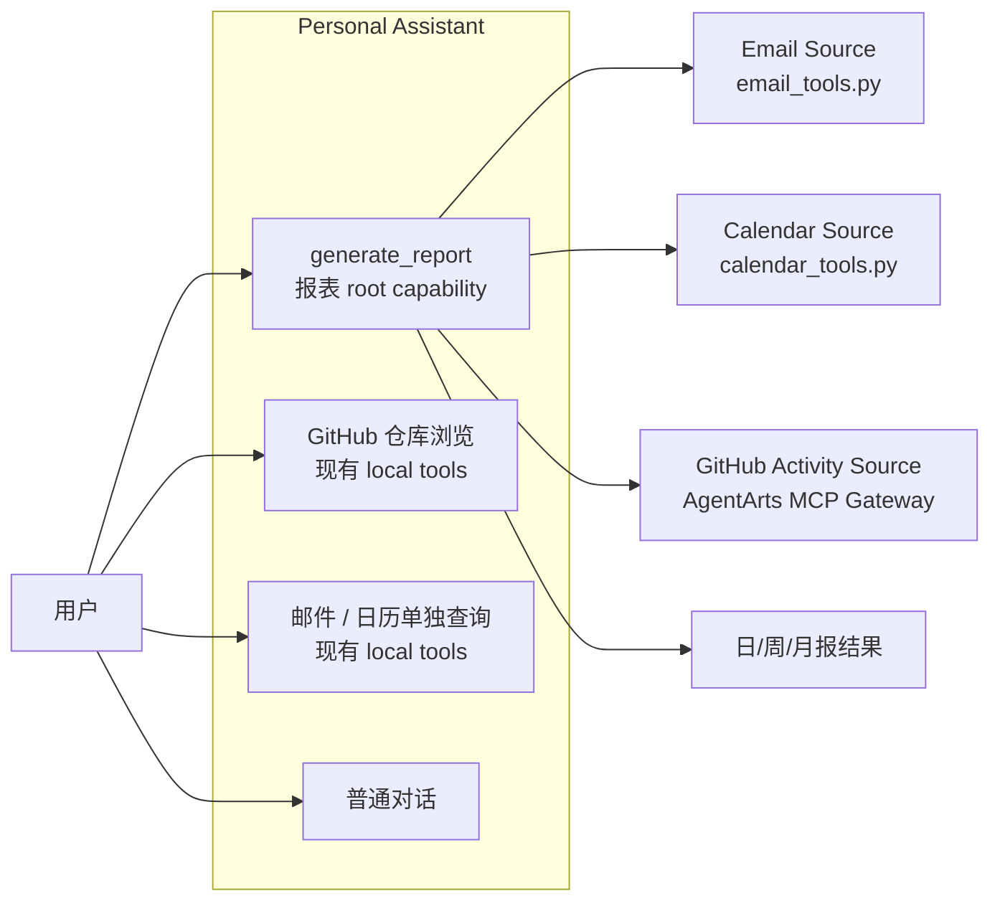
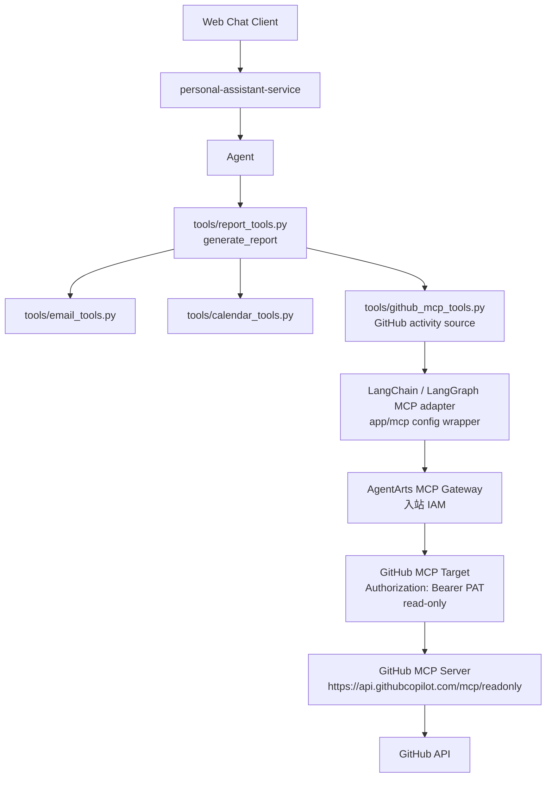
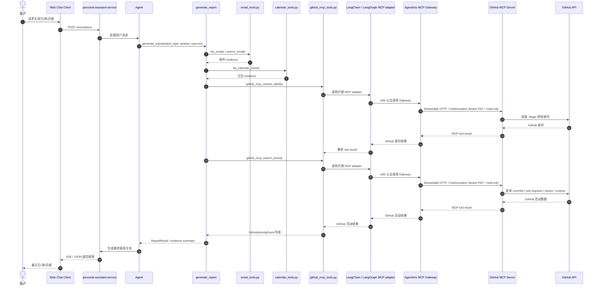

# Feature 17：Report Root Capability + AgentArts MCP Gateway GitHub Data Source

> 状态：Draft  
> 日期：2026-07-08  
> 范围：新增报表 root capability `generate_report`，复用现有 Email / Calendar tools，并通过首个 AgentArts MCP Gateway 数据源补齐 GitHub 工程活动；Gateway 入站认证选择 IAM，GitHub Target 出站认证选择 API Key（GitHub PAT）

## 1. 概要

本 Feature 的 root capability 是 **Report（报表）**：用户可以通过自然语言生成日/周/月报、工作总结或研发进展总结。Report 能力统一编排多个 data source，包括现有 Email / Calendar tools，以及本次新增的 GitHub MCP data source。

首个 AgentArts MCP Gateway 能力定位为 **GitHub 工程活动数据源**：通过 GitHub MCP 为报表补齐 commits、pull requests、issues、reviews / comments 等工程活动数据。

本 Feature 不迁移现有邮件和日历工具。`email_tools.py` 与 `calendar_tools.py` 已覆盖 Microsoft 365 邮件 / Calendar 读取能力，Report root tool 直接复用这些现有 Python functions；MCP Gateway 首期只补齐当前最缺的工程活动数据面。

设计目标：

- 新增 Agent 可见的 `generate_report` high-level tool，作为日/周/月报的唯一 root entry。
- `generate_report` 内部确定性编排 Email、Calendar、GitHub MCP 等 data source，而不是依赖 LLM 自行串联多个 low-level tools。
- 通过 AgentArts MCP Gateway 接入 GitHub MCP，并在 Service 内封装为报表专用 GitHub activity source。
- 输出统一的 `ReportEvidence` / `GitHubActivityEvent` 结构，供后续 Memory skill、Sandbox CLI 和 Report Agent 汇总使用。
- 保持 credential boundary：GitHub PAT 不进入 LLM prompt、tool schema、日志或业务数据库。

## 2. 关键设计

### 2.1 Report 是 root capability，GitHub MCP 是 data source

Report 能力不是 GitHub MCP 的附属功能。Report 是用户视角的 root capability，GitHub MCP 只是 Report 内部使用的一个 data source provider。

推荐调用边界：

```text
Agent 可见 tool:
  generate_report(...)

generate_report 内部复用:
  - email_tools.py: list_emails / search_emails / get_email
  - calendar_tools.py: list_calendar_events / search_calendar_events / get_calendar_event
  - github_mcp_tools.py: GitHub activity source via AgentArts MCP Gateway
```

设计原则：

- Agent 默认只需要选择 `generate_report`，不需要自己串联 Email / Calendar / GitHub MCP tools。
- `generate_report` 负责统一解析 report type、时间窗口、timezone、source selection、部分失败降级、数据归一化和去重。
- Skill 只负责报表意图识别、写作风格和数据可信边界说明；不承担数据采集和编排职责。
- GitHub MCP source 不替代现有 GitHub repository browsing tools；仓库目录、文件读取、代码搜索和 star 继续走现有 GitHub local tools。

### 2.2 第一个 MCP 不做四源全迁移

当前 Service 已有以下本地 Python tools：

| 数据源 | 当前能力 | 是否本次迁移到 MCP |
|---|---|---|
| Microsoft 365 Email | 邮件列表、详情、搜索、发送、回复 | 否，Report 直接复用现有函数 |
| Microsoft 365 Calendar | 日历列表、详情、搜索 | 否，Report 直接复用现有函数 |
| GitHub | 仓库列表、目录、文件、代码搜索、star | 不迁移既有能力，只新增 activity data source via MCP |
| Gitee | 仓库列表 | 否，后续单独扩展 |

原因：

- 邮件 / 日历已具备稳定的 AgentArts Identity + OAuth2 full flow，实现风险低且能直接服务报表。
- GitHub 现有能力偏仓库浏览，缺少日报/周报/月报所需的 activity timeline。
- 让 MCP 首期聚焦“工程活动源”，可以避免重复工具、降低 tool selection 噪声。
- Gitee 不纳入首个 MCP 能力，避免在 GitHub MCP Gateway 跑通前扩大 provider 差异和测试范围。

### 2.3 MCP Gateway 是平台工具入口，不直接替代 Report root tool

**MCP Gateway 是“平台侧工具接入口”**，负责把外部能力注册成 AgentArts 可调用的 MCP 工具，比如 GitHub MCP 里的 GitHub 活动查询工具。Service 会把 MCP 能力包装成 Report data source；Agent 面向用户调用的是 `generate_report` root tool。

实施方式：

- `gateway-github-mcp` 与 `target-github-mcp` 在华为云 AgentArts 控制台手动创建和维护，本 Feature 不通过代码创建 / 更新 Gateway 或 Target。
- AgentArts MCP Gateway 入站认证选择 IAM，Service 只消费已配置好的 Gateway URL，并以 IAM 认证方式调用 Gateway；
- GitHub MCP Target 指向 GitHub remote MCP 的 read-only endpoint：`https://api.githubcopilot.com/mcp/readonly`。如 AgentArts Target 支持自定义 header，同步设置 `X-MCP-Readonly: true`，并用 `X-MCP-Toolsets: repos,issues,pull_requests` 约束报表所需 toolsets。
- GitHub MCP Target 出站认证固定选择 API Key，凭证值使用 GitHub PAT，并由 Gateway 在出站请求中注入 `Authorization: Bearer <GitHub PAT>`；PAT 不作为 MCP tool 参数暴露，也不进入 Service 配置。
- Service 连接 AgentArts MCP Gateway 时使用 LangChain / LangGraph 生态的开源 MCP 集成（优先评估 `langchain-mcp-adapters`），由开源库负责远程 MCP tools 加载与调用；项目内 `app/mcp/` 只做配置封装、IAM 认证注入、超时控制、错误映射和结果解析，不自实现 MCP 协议。
- Service 工具层新增 `report_tools.py` 暴露 `generate_report`；新增 `github_mcp_tools.py` 作为 Report 内部的 GitHub activity source wrapper，而不是把 GitHub 的全部原子工具直接交给 Agent。
- 报表侧统一消费 `GitHubActivityEvent`，由 `github_mcp_tools.py` 完成 GitHub 原始返回到统一事件模型的归一化。

### 2.4 GitHub MCP Server 连接方案对比

GitHub 官方 remote MCP Server default endpoint 为 `https://api.githubcopilot.com/mcp/`，同时支持 read-only endpoint `https://api.githubcopilot.com/mcp/readonly` 和 `X-MCP-Readonly` / `X-MCP-Toolsets` headers。本 Feature 有两种连接方式：通过 AgentArts MCP Gateway 间接连接，或由 Service 直连 GitHub 官方 remote MCP。

| 对比项 | 方案 A：通过 AgentArts MCP Gateway | 方案 B：Service 直连 GitHub 官方 remote MCP |
|---|---|---|
| 连接路径 | Service → AgentArts MCP Gateway → GitHub MCP Target → `https://api.githubcopilot.com/mcp/readonly` | Service → `https://api.githubcopilot.com/mcp/readonly` |
| 入站认证 | Gateway 入站使用 IAM，Service 调 Gateway 时走华为云 IAM 认证 | 无 AgentArts Gateway 入站层；Service 直接向 GitHub MCP 发请求 |
| GitHub 出站认证 | Target 出站使用 API Key，凭证值为 GitHub PAT，由 Gateway 注入 `Authorization: Bearer <GitHub PAT>` | Service 直接持有或从凭证服务获取 GitHub PAT / access token，并写入 `Authorization: Bearer <token>` |
| 凭证边界 | GitHub PAT 留在 AgentArts Gateway Target / 凭证配置中，不进入 Agent tool schema | GitHub PAT 需要进入 Service 运行时配置或 Service 侧凭证读取逻辑 |
| 平台治理 | 复用 AgentArts MCP Gateway 的 target 管理、权限、网络和观测能力 | 绕过 AgentArts MCP Gateway，治理能力主要由 Service 自己实现 |
| 实现复杂度 | 需要配置 Gateway、Target、IAM 权限和出站 API Key；多一层平台依赖 | 链路更短，适合本地 POC；但 Service 需要自行处理 GitHub MCP headers、token、重试和审计 |
| 故障面 | 可能遇到 IAM、CSMS、Gateway quota、Target 配置等平台侧问题 | 主要故障集中在 GitHub token、GitHub MCP 协议兼容和 Service 出网 |

方案 A 的优势：

- **平台能力闭环**：真正落地“先用 AgentArts MCP Gateway 增加 MCP 工具能力”的阶段目标，而不是绕过 Gateway 只做普通远程 MCP client。
- **凭证隔离更清晰**：GitHub PAT 保存在 Gateway Target / 凭证配置中，由 Gateway 出站注入；Service 和 Agent tool schema 不需要直接持有 GitHub PAT。
- **治理与运维集中**：Gateway 统一管理 Target、入站 IAM、出站认证、网络模式和后续观测配置，后续接入更多 MCP Target 时可以沿用同一平台模式。
- **Service 逻辑更聚焦**：Service 只负责报表业务编排、GitHub activity source 封装、结果归一化和错误映射，不承担 GitHub MCP endpoint 凭证注入与 target 管理职责。
- **后续扩展更顺**：未来接入其他代码平台、企业内部 API 或更多 MCP Server 时，可以继续通过 Gateway 增加 Target，而不是在 Service 中堆多个直连实现。

结论：本 Feature 采用 **方案 A：通过 AgentArts MCP Gateway 连接 GitHub 官方 remote MCP**。方案 B 只作为本地验证或 Gateway 不可用时的诊断路径，不作为首期正式架构。

身份模型说明：

- GitHub MCP source 使用 **personal assistant agent 平台身份**，不代表 Web Chat 当前登录用户。
- `target-github-mcp` 中的 GitHub PAT 是平台侧凭证；GitHub MCP Server 看到的 `me` 是该 PAT 所属 GitHub 账号 / platform GitHub account。
- 因此 GitHub MCP source 适合汇总平台配置仓库、平台账号可见范围内的工程活动。它不回答“当前登录用户自己的 GitHub 活动”；如未来需要该语义，应作为单独的 user-delegated GitHub data source 设计。

### 2.5 触发场景

Report root tool 的触发条件是：用户请求日/周/月报、工作总结或研发进展总结。GitHub MCP source 的触发条件是：本次报表需要 GitHub 工程活动数据。

典型触发话术：

- “帮我生成今天的日报”
- “帮我生成本周周报”
- “帮我整理这个月的月报”
- “总结 personal-assistant 仓库今天的工程活动”
- “本周平台 GitHub 数据源有哪些 PR、commit、issue 进展”
- “帮我汇总 personal-assistant 仓库这周的开发进展”

触发后的工具调用链路：

1. Agent 判断用户请求需要报表，调用 `generate_report`。
2. `generate_report` 解析 report type、时间窗口、timezone 和用户指定 source。
3. `generate_report` 复用现有 Email / Calendar functions 拉取邮件和日历数据。
4. 当工程活动数据需要纳入报表时，调用 GitHub MCP source：
   - `github_mcp_resolve_identity` 确认 GitHub MCP Target 的平台授权身份。
   - 如用户未指定仓库，调用 `github_mcp_list_repositories` 获取候选仓库。
   - 调用 `github_mcp_search_activity` 按时间窗口拉取 commits、pull requests、issues、reviews / comments。
   - 对需要展开的关键活动，调用 `github_mcp_get_detail` 获取详情。
5. `generate_report` 将各 source 结果归一化为 `ReportEvidence` / `GitHubActivityEvent`，再合并生成日/周/月报。

不触发 Report / GitHub MCP 的场景：

- 纯聊天、问答或不需要生成报表的请求。
- 只是查看 GitHub 仓库文件、目录或代码搜索。
- 只是 star 仓库等非报表动作。
- 只是查询 / 发送邮件或查询日历，此时继续直接使用现有 Email / Calendar tools。

### 2.6 设计图

#### 2.6.1 用例图



#### 2.6.2 组件图



#### 2.6.3 时序图



## 3. Report root tool 与 GitHub MCP source 接口

### 3.1 `generate_report`

报表 root tool。Agent 面对日/周/月报、工作总结、研发进展总结等请求时优先调用该工具。该工具内部复用现有 Email / Calendar tools，并按需调用 GitHub MCP source。

输入：

```json
{
  "report_type": "weekly",
  "start_at": "2026-07-01T00:00:00+08:00",
  "end_at": "2026-07-08T23:59:59+08:00",
  "timezone": "Asia/Shanghai",
  "sources": ["email", "calendar", "github"],
  "repositories": ["git-malu/personal-assistant"]
}
```

输出：

```json
{
  "report_type": "weekly",
  "window": {
    "start_at": "2026-07-01T00:00:00+08:00",
    "end_at": "2026-07-08T23:59:59+08:00",
    "timezone": "Asia/Shanghai"
  },
  "sources": {
    "email": {"status": "ok", "count": 8},
    "calendar": {"status": "ok", "count": 5},
    "github": {"status": "ok", "count": 12}
  },
  "evidence": [],
  "warnings": []
}
```

### 3.2 `github_mcp_resolve_identity`

解析 GitHub MCP Target 的平台授权身份，用于筛选 GitHub activity source 中 platform account 参与或可见的活动。该身份来自 Gateway Target 中配置的 GitHub PAT，不映射 Web Chat 当前登录用户。

输入：

```json
{
  "provider": "github"
}
```

输出：

```json
{
  "identities": [
    {
      "provider": "github",
      "login": "octocat",
      "display_name": "Octocat",
      "profile_url": "https://github.com/octocat",
      "authorized": true
    }
  ]
}
```

### 3.3 `github_mcp_list_repositories`

获取可用于报表的 GitHub 仓库候选，支持关键词和更新时间过滤。

输入：

```json
{
  "provider": "github",
  "query": "personal-assistant",
  "updated_since": "2026-07-01T00:00:00+08:00",
  "limit": 50,
  "cursor": null
}
```

输出：

```json
{
  "repositories": [
    {
      "provider": "github",
      "full_name": "git-malu/personal-assistant",
      "default_branch": "main",
      "private": true,
      "html_url": "https://github.com/git-malu/personal-assistant",
      "updated_at": "2026-07-08T09:00:00Z"
    }
  ],
  "next_cursor": null
}
```

### 3.4 `github_mcp_search_activity`

核心工具：按时间窗口聚合工程活动。

输入：

```json
{
  "start_at": "2026-07-01T00:00:00+08:00",
  "end_at": "2026-07-08T23:59:59+08:00",
  "timezone": "Asia/Shanghai",
  "provider": "github",
  "repositories": ["git-malu/personal-assistant"],
  "actor": "platform",
  "event_types": ["commit", "pull_request", "issue", "review", "comment"],
  "limit": 100,
  "cursor": null
}
```

输出使用统一 `GitHubActivityEvent`：

```json
{
  "events": [
    {
      "provider": "github",
      "event_type": "pull_request",
      "repository": "git-malu/personal-assistant",
      "external_id": "123",
      "title": "Add calendar OAuth callback",
      "url": "https://github.com/git-malu/personal-assistant/pull/123",
      "actor": "octocat",
      "state": "merged",
      "created_at": "2026-07-03T10:00:00Z",
      "updated_at": "2026-07-04T12:00:00Z",
      "merged_at": "2026-07-04T12:00:00Z",
      "summary": "Implemented backend-owned OAuth2 callback flow.",
      "metrics": {
        "additions": 120,
        "deletions": 30,
        "changed_files": 5,
        "comment_count": 3
      }
    }
  ],
  "next_cursor": null
}
```

### 3.5 `github_mcp_get_detail`

对报表中需要展开的单条活动取详情。

输入：

```json
{
  "provider": "github",
  "event_type": "pull_request",
  "repository": "git-malu/personal-assistant",
  "external_id": "123",
  "include_comments": true,
  "include_files": true
}
```

输出：

```json
{
  "event": {},
  "timeline": [],
  "files_changed": [],
  "comments": [],
  "reviews": []
}
```

### 3.6 官方 MCP 原子工具到 GitHub activity source 的映射

GitHub 官方 MCP Server 暴露的是 GitHub API 级别的原子工具；本 Feature 不把这些原子工具全部直接交给 Agent。Service 通过 `github_mcp_tools.py` 封装 4 个面向报表的 GitHub activity source functions，并在内部调用官方 MCP tools 后归一化为 `GitHubActivityEvent`。

运行时能力发现：

- Service 启动或首次启用 GitHub MCP 时，通过 LangChain / LangGraph MCP adapter 获取远程 `tools/list`。
- `app/mcp/` 记录当前 Gateway 下可用的官方 GitHub MCP tools，用于启动检查和错误诊断。
- `github_mcp_tools.py` 不提供通用 raw MCP tool passthrough，只实现报表所需的 GitHub activity source functions。
- 如果报表所需的 GitHub MCP capability 缺失，当前 source function 返回结构化错误，并提示 Gateway / Target 配置不完整。
- 官方工具名称以运行时 `tools/list` 为准；若 GitHub MCP Server 后续发生工具重命名，Service 通过 source function 内部适配做兼容，不在 Agent prompt 中硬编码全部原子工具。

GitHub source 映射：

| GitHub activity source function | 调用的官方 GitHub MCP 原子工具 | 聚合职责 |
|---|---|---|
| `github_mcp_resolve_identity` | `get_me` | 获取 GitHub MCP Target 平台授权身份的 login、display name、profile URL，用于 `actor = platform` 和活动归因。 |
| `github_mcp_list_repositories` | `search_repositories`，以及 runtime `tools/list` 中可用的 repository listing 工具 | 根据关键词、更新时间和权限范围筛选候选仓库；隐藏不适合报表的归档仓库 / 不可访问仓库。 |
| `github_mcp_search_activity` | commits: `list_commits` / `get_commit`；pull requests: `list_pull_requests` / `search_pull_requests` / `pull_request_read`；issues: `list_issues` / `search_issues` / `issue_read`；actions 可选：`actions_list` / `actions_get` | 按时间窗口、仓库、actor、event type 聚合活动，拉取必要详情，归一化为 `GitHubActivityEvent` 列表。 |
| `github_mcp_get_detail` | `get_commit`、`pull_request_read`、`issue_read`，以及 runtime 中可用的 comments / reviews / files 相关只读工具 | 对单条 commit / PR / issue 拉取详情、评论、review、文件变更和统计信息，用于报表展开说明。 |

`github_mcp_search_activity` 聚合流程：

1. 将用户输入的 `start_at` / `end_at` 按 `timezone` 归一化为 GitHub 查询使用的 UTC 时间窗口。
2. 调用 `github_mcp_resolve_identity` 解析 GitHub MCP Target 平台授权身份；当 `actor = "platform"` 时，用该 login 过滤 commits、PR、issues、reviews 和 comments。
3. 如果用户没有指定 `repositories`，先调用 `github_mcp_list_repositories` 获取候选仓库，再按更新时间和 limit 选择扫描范围。
4. 按 `event_types` 分批调用官方 MCP 原子工具；每类数据独立分页，避免某一类事件过多阻塞整体报表。
5. 对列表结果先做轻量过滤；只有当报表需要统计或展开时，才调用 `get_commit` / `pull_request_read` / `issue_read` 补充详情。
6. 将不同原始对象映射为统一 `GitHubActivityEvent`：
   - commit：`external_id = sha`，`title = commit message first line`，`metrics` 来自 additions / deletions / changed_files。
   - pull request：`external_id = number`，`state = open / closed / merged`，`metrics` 来自 additions / deletions / changed_files / comment_count。
   - issue：`external_id = number`，`state = open / closed`，`metrics.comment_count` 来自 comments。
   - review / comment：挂靠到对应 PR / issue；如果需要单独呈现，则使用 comment / review id 作为 `external_id`。
7. 用 `(provider, event_type, repository, external_id)` 去重；同一 PR 同时出现在 search 和 list 结果中时只保留一条。
8. 按 `updated_at` 倒序排序，应用 `limit` / `cursor`，返回稳定分页结果。

工具选择边界：

- Agent 默认只看到 `generate_report` 这个报表 root tool；`github_mcp_*` 是 Report 内部的 GitHub activity source wrapper，不直接作为 root capability 暴露。
- 读取仓库文件、目录、代码搜索、star 等非报表场景继续使用现有 GitHub local tools。
- 生成日/周/月报、工作总结、研发进展总结时，Agent 优先调用 `generate_report`；`generate_report` 在需要工程活动数据时使用 `github_mcp_search_activity`。

## 4. 实现变更

### 4.1 AgentArts MCP Gateway配置

- 在华为云 AgentArts 控制台手动创建 `gateway-github-mcp`，协议类型为 MCP。Gateway 入站认证选择 IAM。
- 在该 Gateway 下手动创建 `target-github-mcp`，GitHub Target 指向官方 GitHub MCP Server read-only endpoint：`https://api.githubcopilot.com/mcp/readonly`，传输方式使用 Streamable HTTP。
- 若 AgentArts Target 支持自定义 header，额外配置 `X-MCP-Readonly: true`，并设置 `X-MCP-Toolsets: repos,issues,pull_requests`，让 Target 层只暴露报表所需的只读 GitHub capabilities。
- GitHub Target 出站认证选择 API Key，凭证值使用 GitHub PAT；Gateway 负责在出站请求中携带 `Authorization: Bearer <GitHub PAT>`，不把 PAT 作为 MCP tool 参数暴露。
- GitHub PAT 优先使用 fine-grained PAT，并限制到报表需要读取的 repository；权限只授予 Metadata read、Contents read、Issues read、Pull requests read 等只读权限。若只能使用 classic PAT，则必须在文档和 staging 配置中明确其权限范围和 demo 边界。
- 代码侧不使用 `MCPGatewayClient` 自动创建 / 更新 Gateway；Service 只通过配置读取已创建 Gateway 的访问地址。

### 4.2 Service 侧变更

- 新增 `app/tools/report_tools.py`，注册 `generate_report` high-level tool 进 `build_tools()`，作为报表 root capability。
- `generate_report` 内部直接复用现有 `email_tools.py` / `calendar_tools.py` 中的 async functions；无需迁移邮件或日历工具。
- 引入 LangChain / LangGraph 生态的开源 MCP 集成（优先评估 `langchain-mcp-adapters`），将 AgentArts MCP Gateway 暴露的远程 MCP tools 转成 Service 内部可调用的 GitHub activity source。
- 新增轻量 `app/mcp/` 配置封装层，只负责 Gateway URL、IAM 认证、timeout、source capability check 和错误映射；不手写 MCP protocol client。
- 新增 `app/tools/github_mcp_tools.py`，封装 GitHub MCP activity source functions，并归一化为 `GitHubActivityEvent`。
- 新增 typed settings：
  - `GITHUB_MCP_ENABLED`
  - `GITHUB_MCP_GATEWAY_URL`
  - `GITHUB_MCP_TIMEOUT_SECONDS`
  - `GITHUB_MCP_TOOL_PREFIX`
- `SYSTEM_PROMPT` 增加报表工具选择规则：
  - 日/周/月报、工作总结、研发进展总结优先使用 `generate_report`。
  - 邮件 / 日历单独查询继续使用现有 Microsoft 365 tools。
  - GitHub 仓库浏览、文件读取、代码搜索和 star 继续使用现有 GitHub local tools。
  - 写操作仍遵守 Guard。

### 4.3 公开接口与类型

新增统一报表类型 `ReportEvidence` / `ReportResult`，并新增 GitHub 工程活动类型 `GitHubActivityEvent`，用于后续 Memory skill 和 report aggregation。

`ReportEvidence`：

| 字段 | 说明 |
|---|---|
| `source` | `email`、`calendar`、`github` 等 |
| `source_id` | source 内部 ID / message ID / event ID / GitHub external ID |
| `title` | 证据标题 |
| `occurred_at` | 事件发生时间 |
| `summary` | 面向报表的短摘要 |
| `url` | 可选原始链接 |
| `metadata` | source-specific 扩展信息 |

`GitHubActivityEvent`：

| 字段 | 说明 |
|---|---|
| `provider` | 固定为 `github`，保留字段用于后续扩展其他代码平台 |
| `event_type` | `commit`、`pull_request`、`issue`、`review`、`comment` |
| `repository` | 仓库 full name |
| `external_id` | 第三方平台 ID / number / sha |
| `title` | 活动标题 |
| `url` | 原始平台链接 |
| `actor` | 活动发起人 |
| `state` | open / closed / merged 等 |
| `created_at` / `updated_at` | 时间戳 |
| `summary` | 面向报表的短摘要 |
| `metrics` | additions、deletions、changed_files、comment_count 等可选指标 |

## 5. 测试计划

### 5.1 单元测试

- `generate_report` 正确解析 daily / weekly / monthly / custom 时间窗口。
- `generate_report` 能复用 Email / Calendar functions，并在单个 source 失败时返回 `warnings` 而非整体失败。
- MCP tool schema 不包含 `access_token`、`api_key`、`secret` 等 credential 参数。
- `github_mcp_search_activity` 正确处理：
  - 时间窗口。
  - provider 固定为 `github`。
  - repository filter。
  - actor = `platform`。
  - event type filter。
  - limit / cursor。
- GitHub mock 覆盖 commits、pull requests、issues、reviews、comments、分页、401、403、429。

### 5.2 集成测试

- `build_tools()` 注册 `generate_report` root tool。
- `GITHUB_MCP_ENABLED=true` 时，`generate_report` 可以调用 GitHub MCP activity source。
- GitHub MCP source 启动检查确认 Gateway Target 使用 read-only endpoint 或 `X-MCP-Readonly: true`，且不提供通用 raw MCP tool passthrough。
- MCP Gateway 不可用时，GitHub activity source 降级为 unavailable，并记录 warning；`generate_report` 仍可使用邮件 / 日历 source 生成部分报表。
- Agent 请求“生成本周周报”时，优先调用 `generate_report`；`generate_report` 在需要工程活动时调用 `github_mcp_search_activity`。

### 5.3 E2E / Staging 验证

- 真实或 staging Gateway 按 IAM 入站、GitHub PAT 出站配置后：
  - Gateway Target 指向 `https://api.githubcopilot.com/mcp/readonly`，或等效配置 `X-MCP-Readonly: true`。
  - Gateway Target 注入 `Authorization: Bearer <GitHub PAT>`，PAT 使用只读最小权限。
  - 用户请求“生成本周周报”。
  - Agent 调用 `generate_report`。
  - `generate_report` 读取 Calendar / Email，并通过 GitHub MCP source 拉取工程活动。
  - 输出包含代码、会议、邮件三类信息来源。
- 验证 token 不进入 SSE、日志、tool result 或 LLM-visible error。

## 6. 假设

- Report 是 root capability；GitHub MCP Gateway 只是 Report 内部使用的数据源之一。
- 首个 MCP Gateway data source 只做 GitHub 工程活动源；Gitee 后续作为独立能力扩展。
- 邮件 / 日历在首期报表中复用现有 local tools，不通过 MCP Gateway 重新实现。
- GitHub MCP source 代表 personal assistant agent 平台身份，只汇总 PAT / platform GitHub account 可见范围内的工程活动；当前用户个人 GitHub 活动不属于该 MCP source 的语义。
- 后续“AgentArts Memory 的 skill 能力”负责沉淀用户报表偏好、常用仓库、常用收件人和摘要风格。
- 后续“AgentArts Sandbox 的 CLI 工具能力”负责可重复的报告渲染、diff 统计或本地仓库分析，不在本 Feature 中实现。

## 7. 预期项目文件目录

新增 Report root capability 与 GitHub MCP data source 后的预期项目目录如下：

```text
personal-assistant/
├── personal-assistant-meta/
│   ├── issues/features/backlog/feature-17-github-mcp/
│   │   ├── plan.md                    # 已新增：Report + MCP data source 设计文档
│   │   └── issue.md                   # 可选新增：正式 feature issue
│   ├── specs/
│   │   ├── overall_specifications.md   # 修改：登记 Report root capability
│   │   ├── dictionary.md               # 修改：补充 ReportEvidence / GitHubActivityEvent / GitHub MCP 术语
│   │   └── use-cases/
│   │       ├── reports.md               # 新增：Report use case
│   │       ├── github-mcp.md            # 新增：GitHub MCP data source use case
│   │       └── README.md               # 修改：加入索引
│   └── architecture/
│       ├── backend_architecture.md      # 修改：说明 generate_report + MCP adapter
│       └── cloud-service/huaweicloud/agentarts.md  # 修改：补充 MCP Gateway 落地说明
│
├── personal-assistant-service/
│   ├── app/
│   │   ├── settings.py                 # 修改：新增 MCP Gateway 配置项
│   │   ├── agent_handler.py            # 修改：system prompt 加 generate_report 选择规则
│   │   ├── mcp/
│   │   │   ├── __init__.py             # 新增
│   │   │   ├── langchain_client.py     # 新增：基于开源 MCP adapter 连接 Gateway
│   │   │   ├── auth.py                 # 新增：IAM 调用认证与 headers/session 封装
│   │   │   ├── adapters.py             # 新增：capability check / error mapping / result parsing
│   │   │   └── schemas.py              # 新增：GitHubActivityEvent 等 MCP 类型
│   │   └── tools/
│   │       ├── __init__.py             # 修改：注册 generate_report
│   │       ├── report_tools.py          # 新增：generate_report root tool
│   │       └── github_mcp_tools.py      # 新增：GitHub activity source wrapper
│   ├── tests/
│   │   ├── test_mcp_langchain_client.py # 新增
│   │   ├── test_report_tools.py         # 新增
│   │   ├── test_github_mcp_tools.py    # 新增
│   │   └── test_tools_init.py          # 修改：验证 generate_report 注册
│   ├── pyproject.toml                  # 修改：增加 LangChain / LangGraph MCP adapter 依赖
│   ├── .env.example                    # 修改：新增 MCP 配置说明
│   └── openapi.json                    # 仅当新增 Service OpenAPI endpoints 时修改
│
├── personal-assistant-e2e/
│   └── tests/features/feature-17-github-mcp/
│       └── test_github_mcp_report_flow.py # 新增：报表数据源联调
│
└── personal-assistant-infra/
    └── scripts/
        └── README.md                  # 可选修改：记录 AgentArts 控制台手动配置步骤
```
