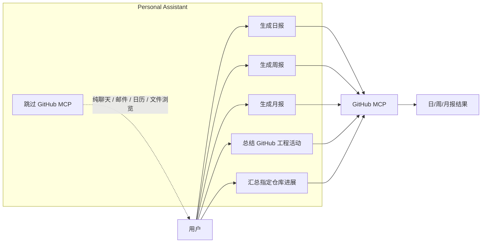
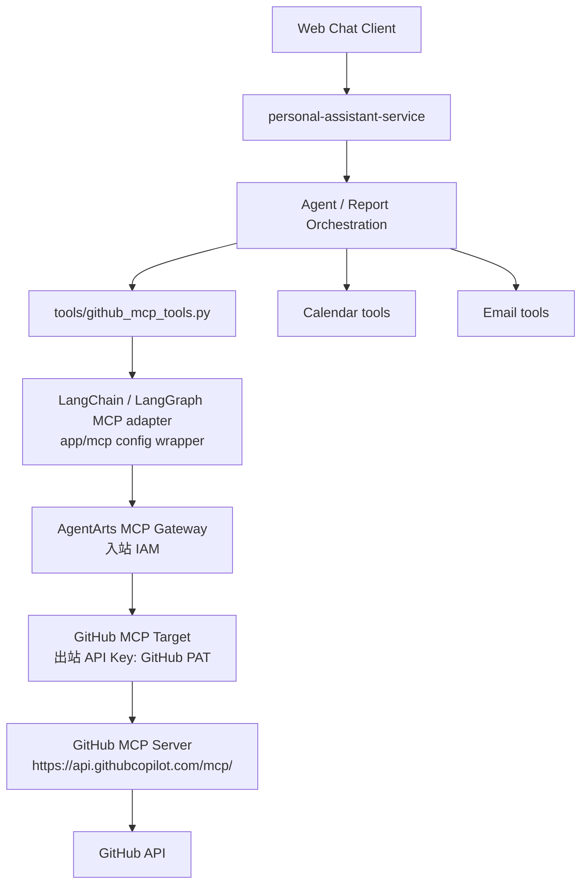
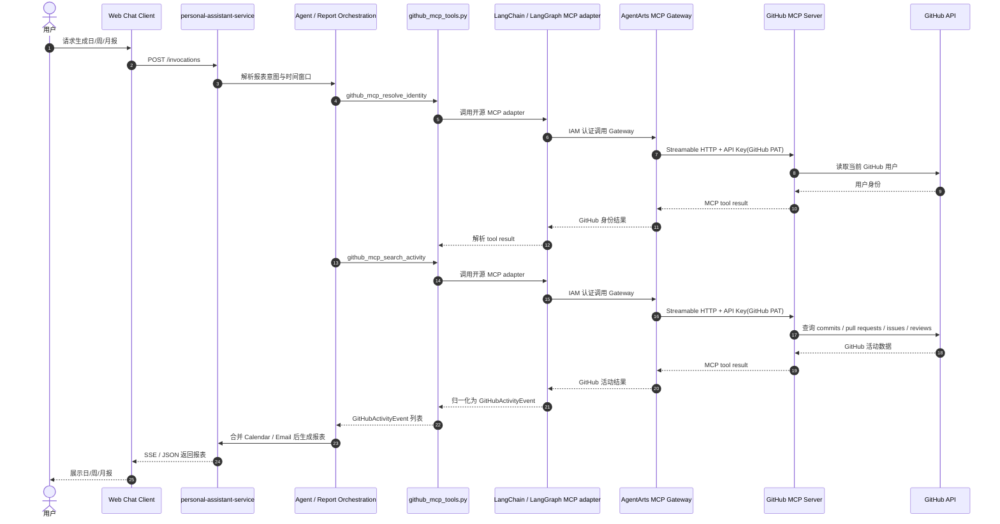

# Feature 17：AgentArts MCP Gateway——GitHub 

> 状态：Draft  
> 日期：2026-07-08  
> 范围：Demo首个 AgentArts MCP Gateway 能力，用于支撑日/周/月报的数据采集；Gateway 入站认证选择 IAM，GitHub Target 出站认证选择 API Key（GitHub PAT）

## 1. 概要

首个 MCP Gateway 能力定位为 **GitHub MCP**：为日/周/月报补齐 GitHub 工程活动数据采集。

本 Feature 不迁移现有邮件和日历工具。`email_tools.py` 与 `calendar_tools.py` 已覆盖 Microsoft 365 邮件 / Calendar 读取能力，后续报表整合阶段直接复用；MCP Gateway 首期只补齐当前最缺的工程活动数据面。

设计目标：

- 通过 AgentArts MCP Gateway 暴露一组面向报表的 curated MCP tools。
- 从 GitHub 拉取按时间窗口过滤的 commits、pull requests、issues、reviews / comments 等活动。
- 输出统一的 `GitHubActivityEvent` 结构，供后续 Memory skill、Sandbox CLI 和 Report Agent 汇总使用。
- 保持 credential boundary：GitHub PAT 不进入 LLM prompt、tool schema、日志或业务数据库。

## 2. 关键设计

### 2.1 第一个 MCP 不做四源全迁移

当前 Service 已有以下本地 Python tools：

| 数据源 | 当前能力 | 是否本次迁移到 MCP |
|---|---|---|
| Microsoft 365 Email | 邮件列表、详情、搜索、发送、回复 | 否 |
| Microsoft 365 Calendar | 日历列表、详情、搜索 | 否 |
| GitHub | 仓库列表、目录、文件、代码搜索、star | 不迁移既有能力，只新增活动采集 MCP |
| Gitee | 仓库列表 | 否，后续单独扩展 |

原因：

- 邮件 / 日历已具备稳定的 AgentArts Identity + OAuth2 full flow，实现风险低且能直接服务报表。
- GitHub 现有能力偏仓库浏览，缺少日报/周报/月报所需的 activity timeline。
- 让 MCP 首期聚焦“工程活动源”，可以避免重复工具、降低 tool selection 噪声。
- Gitee 不纳入首个 MCP 能力，避免在 GitHub MCP Gateway 跑通前扩大 provider 差异和测试范围。

### 2.2 MCP Gateway 是平台工具入口，不直接替代 Service 工具层

**MCP Gateway 是“平台侧工具接入口”**，负责把外部能力注册成 AgentArts 可调用的 MCP 工具，比如 GitHub MCP 里的 GitHub 活动查询工具。Service 会把 MCP 工具包装成自己的可用工具之一。

实施方式：

- `gateway-github-mcp` 与 `target-github-mcp` 在华为云 AgentArts 控制台手动创建和维护，本 Feature 不通过代码创建 / 更新 Gateway 或 Target。
- AgentArts MCP Gateway 入站认证选择 IAM，Service 只消费已配置好的 Gateway URL，并以 IAM 认证方式调用 Gateway；
- GitHub MCP Target 出站认证固定选择 API Key，凭证值使用 GitHub PAT，并由 Gateway 在出站请求中注入给 `https://api.githubcopilot.com/mcp/`；PAT 不作为 MCP tool 参数暴露，也不进入 Service 配置。
- Service 连接 AgentArts MCP Gateway 时使用 LangChain / LangGraph 生态的开源 MCP 集成（优先评估 `langchain-mcp-adapters`），由开源库负责远程 MCP tools 加载与调用；项目内 `app/mcp/` 只做配置封装、IAM 认证注入、超时控制、错误映射和结果解析，不自实现 MCP 协议。
- Service 工具层新增 `github_mcp_tools.py`，把 MCP 调用包装成现有 Agent 可使用的 `langchain_core.tools.tool`，只暴露面向报表的 curated tools，而不是把 GitHub 的全部原子工具直接交给 Agent。
- 报表侧统一消费 `GitHubActivityEvent`，由 `github_mcp_tools.py` 完成 GitHub 原始返回到统一事件模型的归一化。

### 2.3 GitHub MCP Server 连接方案对比

GitHub 官方 remote MCP Server endpoint 为 `https://api.githubcopilot.com/mcp/`。本 Feature 有两种连接方式：通过 AgentArts MCP Gateway 间接连接，或由 Service 直连 GitHub 官方 remote MCP。

| 对比项 | 方案 A：通过 AgentArts MCP Gateway | 方案 B：Service 直连 GitHub 官方 remote MCP |
|---|---|---|
| 连接路径 | Service → AgentArts MCP Gateway → GitHub MCP Target → `https://api.githubcopilot.com/mcp/` | Service → `https://api.githubcopilot.com/mcp/` |
| 入站认证 | Gateway 入站使用 IAM，Service 调 Gateway 时走华为云 IAM 认证 | 无 AgentArts Gateway 入站层；Service 直接向 GitHub MCP 发请求 |
| GitHub 出站认证 | Target 出站使用 API Key，凭证值为 GitHub PAT，由 Gateway 注入给 GitHub MCP | Service 直接持有或从凭证服务获取 GitHub PAT / access token，并写入 `Authorization: Bearer <token>` |
| 凭证边界 | GitHub PAT 留在 AgentArts Gateway Target / 凭证配置中，不进入 Agent tool schema | GitHub PAT 需要进入 Service 运行时配置或 Service 侧凭证读取逻辑 |
| 平台治理 | 复用 AgentArts MCP Gateway 的 target 管理、权限、网络和观测能力 | 绕过 AgentArts MCP Gateway，治理能力主要由 Service 自己实现 |
| 实现复杂度 | 需要配置 Gateway、Target、IAM 权限和出站 API Key；多一层平台依赖 | 链路更短，适合本地 POC；但 Service 需要自行处理 GitHub MCP headers、token、重试和审计 |
| 故障面 | 可能遇到 IAM、CSMS、Gateway quota、Target 配置等平台侧问题 | 主要故障集中在 GitHub token、GitHub MCP 协议兼容和 Service 出网 |

方案 A 的优势：

- **平台能力闭环**：真正落地“先用 AgentArts MCP Gateway 增加 MCP 工具能力”的阶段目标，而不是绕过 Gateway 只做普通远程 MCP client。
- **凭证隔离更清晰**：GitHub PAT 保存在 Gateway Target / 凭证配置中，由 Gateway 出站注入；Service 和 Agent tool schema 不需要直接持有 GitHub PAT。
- **治理与运维集中**：Gateway 统一管理 Target、入站 IAM、出站认证、网络模式和后续观测配置，后续接入更多 MCP Target 时可以沿用同一平台模式。
- **Service 逻辑更聚焦**：Service 只负责报表业务编排、tool filtering、结果归一化和错误映射，不承担 GitHub MCP endpoint 凭证注入与 target 管理职责。
- **后续扩展更顺**：未来接入其他代码平台、企业内部 API 或更多 MCP Server 时，可以继续通过 Gateway 增加 Target，而不是在 Service 中堆多个直连实现。

结论：本 Feature 采用 **方案 A：通过 AgentArts MCP Gateway 连接 GitHub 官方 remote MCP**。方案 B 只作为本地验证或 Gateway 不可用时的诊断路径，不作为首期正式架构。

### 2.4 触发场景

GitHub MCP 的触发条件是：用户请求日/周/月报、工作总结或研发进展总结，并且回答需要 GitHub 工程活动数据。

典型触发话术：

- “帮我生成今天的日报”
- “帮我生成本周周报”
- “帮我整理这个月的月报”
- “总结我今天在 GitHub 上做了什么”
- “本周我有哪些 PR、commit、issue 进展”
- “帮我汇总 personal-assistant 仓库这周的开发进展”

触发后的工具调用链路：

1. Agent 判断用户请求需要报表或工程活动总结。
2. 工程活动部分优先调用 `github_mcp_resolve_identity` 确认 GitHub 身份。
3. 如用户未指定仓库，调用 `github_mcp_list_repositories` 获取候选仓库。
4. 调用 `github_mcp_search_activity` 按时间窗口拉取 commits、pull requests、issues、reviews / comments。
5. 对需要展开的关键活动，调用 `github_mcp_get_detail` 获取详情。
6. Service 将结果归一化为 `GitHubActivityEvent`，再与 Calendar / Email 数据合并生成日/周/月报。

不触发 GitHub MCP 的场景：

- 只是查看 GitHub 仓库文件、目录或代码搜索。
- 只是 star 仓库等非报表动作。
- 只是查询 / 发送邮件或查询日历。
- 纯聊天、问答或不需要 GitHub 工程活动数据的请求。

### 2.5 设计图

#### 2.5.1 用例图



#### 2.5.2 组件图



#### 2.5.3 时序图



## 3. MCP 工具接口

### 3.1 `github_mcp_resolve_identity`

解析当前用户在 GitHub 的账号标识，用于筛选“我参与的”活动。

输入：

```json
{
  "provider": "github"
}
```

输出：

```json
{
  "identities": [
    {
      "provider": "github",
      "login": "octocat",
      "display_name": "Octocat",
      "profile_url": "https://github.com/octocat",
      "authorized": true
    }
  ]
}
```

### 3.2 `github_mcp_list_repositories`

获取可用于报表的 GitHub 仓库候选，支持关键词和更新时间过滤。

输入：

```json
{
  "provider": "github",
  "query": "personal-assistant",
  "updated_since": "2026-07-01T00:00:00+08:00",
  "limit": 50,
  "cursor": null
}
```

输出：

```json
{
  "repositories": [
    {
      "provider": "github",
      "full_name": "git-malu/personal-assistant",
      "default_branch": "main",
      "private": true,
      "html_url": "https://github.com/git-malu/personal-assistant",
      "updated_at": "2026-07-08T09:00:00Z"
    }
  ],
  "next_cursor": null
}
```

### 3.3 `github_mcp_search_activity`

核心工具：按时间窗口聚合工程活动。

输入：

```json
{
  "start_at": "2026-07-01T00:00:00+08:00",
  "end_at": "2026-07-08T23:59:59+08:00",
  "timezone": "Asia/Shanghai",
  "provider": "github",
  "repositories": ["git-malu/personal-assistant"],
  "actor": "me",
  "event_types": ["commit", "pull_request", "issue", "review", "comment"],
  "limit": 100,
  "cursor": null
}
```

输出使用统一 `GitHubActivityEvent`：

```json
{
  "events": [
    {
      "provider": "github",
      "event_type": "pull_request",
      "repository": "git-malu/personal-assistant",
      "external_id": "123",
      "title": "Add calendar OAuth callback",
      "url": "https://github.com/git-malu/personal-assistant/pull/123",
      "actor": "octocat",
      "state": "merged",
      "created_at": "2026-07-03T10:00:00Z",
      "updated_at": "2026-07-04T12:00:00Z",
      "merged_at": "2026-07-04T12:00:00Z",
      "summary": "Implemented backend-owned OAuth2 callback flow.",
      "metrics": {
        "additions": 120,
        "deletions": 30,
        "changed_files": 5,
        "comment_count": 3
      }
    }
  ],
  "next_cursor": null
}
```

### 3.4 `github_mcp_get_detail`

对报表中需要展开的单条活动取详情。

输入：

```json
{
  "provider": "github",
  "event_type": "pull_request",
  "repository": "git-malu/personal-assistant",
  "external_id": "123",
  "include_comments": true,
  "include_files": true
}
```

输出：

```json
{
  "event": {},
  "timeline": [],
  "files_changed": [],
  "comments": [],
  "reviews": []
}
```

### 3.5 官方 MCP 原子工具到报表聚合工具的映射

GitHub 官方 MCP Server 暴露的是 GitHub API 级别的原子工具；本 Feature 不把这些原子工具全部直接交给 Agent。Service 通过 `github_mcp_tools.py` 暴露 4 个面向报表的聚合工具，并在内部调用官方 MCP tools 后归一化为 `GitHubActivityEvent`。

运行时能力发现：

- Service 启动或首次启用 GitHub MCP 时，通过 LangChain / LangGraph MCP adapter 获取远程 `tools/list`。
- `app/mcp/` 维护一个 tool registry，记录当前 Gateway 下可用的官方 GitHub MCP tools。
- `github_mcp_tools.py` 只调用 registry 中通过 allow-list 的只读工具；如果关键工具缺失，当前 wrapper 返回结构化错误，并提示 Gateway / Target 配置不完整。
- 官方工具名称以运行时 `tools/list` 为准；若 GitHub MCP Server 后续发生工具重命名，Service 通过 registry alias 做兼容，不在 Agent prompt 中硬编码全部原子工具。

工具映射：

| 报表聚合工具 | 调用的官方 GitHub MCP 原子工具 | 聚合职责 |
|---|---|---|
| `github_mcp_resolve_identity` | `get_me` | 获取当前 GitHub 用户 login、display name、profile URL，用于 `actor = me` 和活动归因。 |
| `github_mcp_list_repositories` | `search_repositories`，以及 runtime `tools/list` 中可用的 repository listing 工具 | 根据关键词、更新时间和权限范围筛选候选仓库；隐藏不适合报表的归档仓库 / 不可访问仓库。 |
| `github_mcp_search_activity` | commits: `list_commits` / `get_commit`；pull requests: `list_pull_requests` / `search_pull_requests` / `pull_request_read`；issues: `list_issues` / `search_issues` / `issue_read`；actions 可选：`actions_list` / `actions_get` | 按时间窗口、仓库、actor、event type 聚合活动，拉取必要详情，归一化为 `GitHubActivityEvent` 列表。 |
| `github_mcp_get_detail` | `get_commit`、`pull_request_read`、`issue_read`，以及 runtime 中可用的 comments / reviews / files 相关只读工具 | 对单条 commit / PR / issue 拉取详情、评论、review、文件变更和统计信息，用于报表展开说明。 |

`github_mcp_search_activity` 聚合流程：

1. 将用户输入的 `start_at` / `end_at` 按 `timezone` 归一化为 GitHub 查询使用的 UTC 时间窗口。
2. 调用 `github_mcp_resolve_identity` 解析当前 GitHub 用户；当 `actor = "me"` 时，用该 login 过滤 commits、PR、issues、reviews 和 comments。
3. 如果用户没有指定 `repositories`，先调用 `github_mcp_list_repositories` 获取候选仓库，再按更新时间和 limit 选择扫描范围。
4. 按 `event_types` 分批调用官方 MCP 原子工具；每类数据独立分页，避免某一类事件过多阻塞整体报表。
5. 对列表结果先做轻量过滤；只有当报表需要统计或展开时，才调用 `get_commit` / `pull_request_read` / `issue_read` 补充详情。
6. 将不同原始对象映射为统一 `GitHubActivityEvent`：
   - commit：`external_id = sha`，`title = commit message first line`，`metrics` 来自 additions / deletions / changed_files。
   - pull request：`external_id = number`，`state = open / closed / merged`，`metrics` 来自 additions / deletions / changed_files / comment_count。
   - issue：`external_id = number`，`state = open / closed`，`metrics.comment_count` 来自 comments。
   - review / comment：挂靠到对应 PR / issue；如果需要单独呈现，则使用 comment / review id 作为 `external_id`。
7. 用 `(provider, event_type, repository, external_id)` 去重；同一 PR 同时出现在 search 和 list 结果中时只保留一条。
8. 按 `updated_at` 倒序排序，应用 `limit` / `cursor`，返回稳定分页结果。

工具选择边界：

- Agent 只看到 `github_mcp_*` 这组 curated tools，不直接看到官方 GitHub MCP 的全部原子工具。
- 读取仓库文件、目录、代码搜索、star 等非报表场景继续使用现有 GitHub local tools。
- 生成日/周/月报、工作总结、研发进展总结时，工程活动数据优先使用 `github_mcp_search_activity`。

## 4. 实现变更

### 4.1 AgentArts MCP Gateway配置

- 在华为云 AgentArts 控制台手动创建 `gateway-github-mcp`，协议类型为 MCP。Gateway 入站认证选择 IAM。
- 在该 Gateway 下手动创建 `target-github-mcp`，GitHub Target 指向官方 GitHub MCP Server：`https://api.githubcopilot.com/mcp/`，传输方式使用 Streamable HTTP。
- GitHub Target 出站认证选择 API Key，凭证值使用 GitHub PAT；Gateway 负责在出站请求中携带该凭证，不把 PAT 作为 MCP tool 参数暴露。
- 代码侧不使用 `MCPGatewayClient` 自动创建 / 更新 Gateway；Service 只通过配置读取已创建 Gateway 的访问地址。

### 4.2 Service 侧变更

- 引入 LangChain / LangGraph 生态的开源 MCP 集成（优先评估 `langchain-mcp-adapters`），将 AgentArts MCP Gateway 暴露的远程 MCP tools 转成现有 Agent 可调用的 tools，并注册进 `build_tools()`。
- 新增轻量 `app/mcp/` 配置封装层，只负责 Gateway URL、IAM 认证、timeout、tool filtering 和错误映射；不手写 MCP protocol client。
- 新增 typed settings：
  - `GITHUB_MCP_ENABLED`
  - `GITHUB_MCP_GATEWAY_URL`
  - `GITHUB_MCP_TIMEOUT_SECONDS`
  - `GITHUB_MCP_TOOL_PREFIX`
- `SYSTEM_PROMPT` 增加报表工具选择规则：
  - 工程活动优先使用 GitHub MCP。
  - 邮件 / 日历继续使用现有 Microsoft 365 tools。
  - 写操作仍遵守 Guard。

### 4.3 公开接口与类型

新增统一活动类型 `GitHubActivityEvent`，用于后续 Memory skill 和 report aggregation：

| 字段 | 说明 |
|---|---|
| `provider` | 固定为 `github`，保留字段用于后续扩展其他代码平台 |
| `event_type` | `commit`、`pull_request`、`issue`、`review`、`comment` |
| `repository` | 仓库 full name |
| `external_id` | 第三方平台 ID / number / sha |
| `title` | 活动标题 |
| `url` | 原始平台链接 |
| `actor` | 活动发起人 |
| `state` | open / closed / merged 等 |
| `created_at` / `updated_at` | 时间戳 |
| `summary` | 面向报表的短摘要 |
| `metrics` | additions、deletions、changed_files、comment_count 等可选指标 |

## 5. 测试计划

### 5.1 单元测试

- MCP tool schema 不包含 `access_token`、`api_key`、`secret` 等 credential 参数。
- `github_mcp_search_activity` 正确处理：
  - 时间窗口。
  - provider 固定为 `github`。
  - repository filter。
  - actor = `me`。
  - event type filter。
  - limit / cursor。
- GitHub mock 覆盖 commits、pull requests、issues、reviews、comments、分页、401、403、429。

### 5.2 集成测试

- `build_tools()` 在 `GITHUB_MCP_ENABLED=true` 时注册 MCP tools。
- MCP Gateway 不可用时，Service 降级为不注册 GitHub MCP tools，并记录 warning，不影响邮件 / 日历 / 现有 GitHub tools。
- Agent 请求“生成本周周报”时，优先调用 `github_mcp_search_activity` 获取工程活动。

### 5.3 E2E / Staging 验证

- 真实或 staging Gateway 按 IAM 入站、GitHub PAT 出站配置后：
  - 用户请求“生成本周周报”。
  - Agent 拉取 GitHub 工程活动。
  - Agent 再按需读取 Calendar / Email。
  - 输出包含代码、会议、邮件三类信息来源。
- 验证 token 不进入 SSE、日志、tool result 或 LLM-visible error。

## 6. 假设

- 首个 MCP Gateway 能力只做 GitHub 工程活动源；Gitee 后续作为独立能力扩展。
- 邮件 / 日历在首期报表中复用现有 local tools，不通过 MCP Gateway 重新实现。
- 后续“AgentArts Memory 的 skill 能力”负责沉淀用户报表偏好、常用仓库、常用收件人和摘要风格。
- 后续“AgentArts Sandbox 的 CLI 工具能力”负责可重复的报告渲染、diff 统计或本地仓库分析，不在本 Feature 中实现。

## 7. 预期项目文件目录

新增这个 MCP 能力后的预期项目目录如下：

```text
personal-assistant/
├── personal-assistant-meta/
│   ├── issues/features/backlog/feature-17-github-mcp/
│   │   ├── plan.md                    # 已新增：MCP 能力设计文档
│   │   └── issue.md                   # 可选新增：正式 feature issue
│   ├── specs/
│   │   ├── overall_specifications.md   # 修改：登记 GitHub MCP 能力
│   │   ├── dictionary.md               # 修改：补充 GitHubActivityEvent / GitHub MCP 术语
│   │   └── use-cases/
│   │       ├── github-mcp.md            # 新增：GitHub MCP use case
│   │       └── README.md               # 修改：加入索引
│   └── architecture/
│       ├── backend_architecture.md      # 修改：说明 MCP adapter + tool 注册
│       └── cloud-service/huaweicloud/agentarts.md  # 修改：补充 MCP Gateway 落地说明
│
├── personal-assistant-service/
│   ├── app/
│   │   ├── settings.py                 # 修改：新增 MCP Gateway 配置项
│   │   ├── agent_handler.py            # 修改：system prompt 加报表工具选择规则
│   │   ├── mcp/
│   │   │   ├── __init__.py             # 新增
│   │   │   ├── langchain_client.py     # 新增：基于开源 MCP adapter 连接 Gateway
│   │   │   ├── auth.py                 # 新增：IAM 调用认证与 headers/session 封装
│   │   │   ├── adapters.py             # 新增：tool filtering / error mapping / result parsing
│   │   │   └── schemas.py              # 新增：GitHubActivityEvent 等类型
│   │   └── tools/
│   │       ├── __init__.py             # 修改：注册 GitHub MCP tools
│   │       └── github_mcp_tools.py      # 新增：4 个 curated MCP tool wrapper
│   ├── tests/
│   │   ├── test_mcp_langchain_client.py # 新增
│   │   ├── test_github_mcp_tools.py    # 新增
│   │   └── test_tools_init.py          # 修改：验证 tool 注册
│   ├── pyproject.toml                  # 修改：增加 LangChain / LangGraph MCP adapter 依赖
│   ├── .env.example                    # 修改：新增 MCP 配置说明
│   └── openapi.json                    # 仅当新增 Service OpenAPI endpoints 时修改
│
├── personal-assistant-e2e/
│   └── tests/features/feature-17-github-mcp/
│       └── test_github_mcp_report_flow.py # 新增：报表数据源联调
│
└── personal-assistant-infra/
    └── scripts/
        └── README.md                  # 可选修改：记录 AgentArts 控制台手动配置步骤
```
