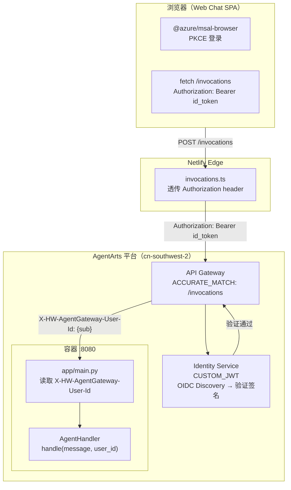
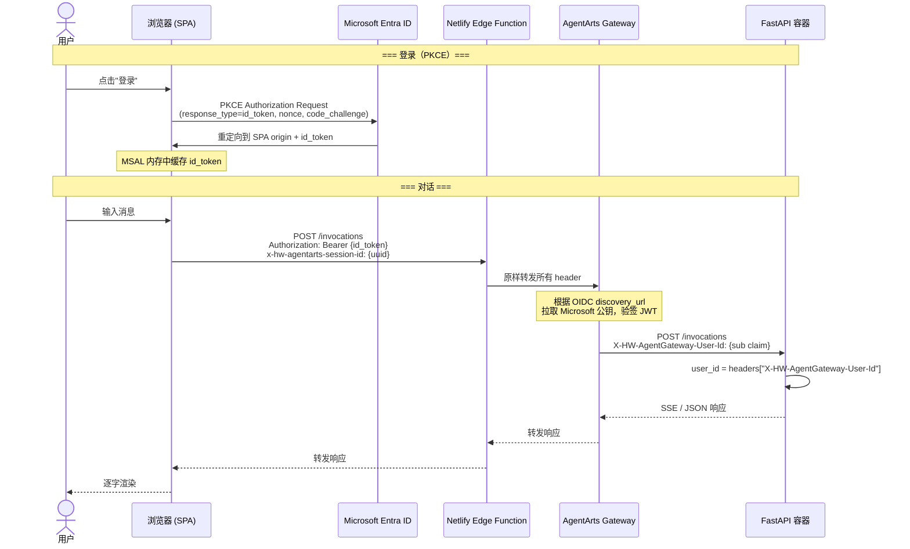
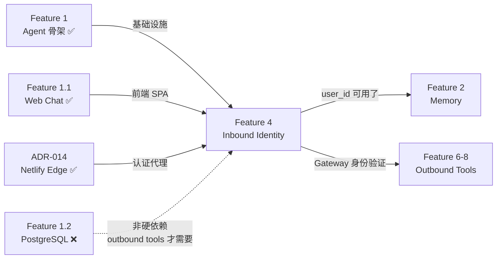

# Feature 4: Inbound Identity 认证

本 Feature 配置 AgentArts Identity 的 Inbound 认证（Microsoft Entra ID Custom JWT + API Key），使 AgentArts Gateway 在 Request Header 中自动注入已验证的用户身份。前端 SPA 通过 PKCE 登录 Microsoft Entra ID 获取 id_token，经 Netlify Edge Function 透传至 Gateway 完成 JWT 验证。

---

## 背景

飞书和 OfficeClaw 渠道自带用户身份（飞书 user_id）。但 Web Chat 需要用户通过 Microsoft Entra ID 登录，Agent 拿到用户身份后才能以用户身份调用外部 API（Feature 6-8）。本 Feature 搭建 Inbound 认证基础设施。

**v2 重大修订**（2026-06-12）：原设计假设后端可以通过 `GET /auth/callback` 处理 OAuth code exchange，但 AgentArts Gateway 仅支持 `ACCURATE_MATCH`（只转发 `/invocations` 精确路径），`/auth/callback` 路由在生产环境中完全不可达。本次修订将 OAuth 登录移至前端 SPA（PKCE），后端改为信任 Gateway 注入的已验证身份 header，彻底移除 `app/oauth.py` 和 `/auth/callback` 路由。

## 范围

### 包含

- **Platform 配置**：`.agentarts_config.yaml` 配置 `CUSTOM_JWT`（生产）+ 保留 `key_auth`（开发调试）
- **Microsoft Entra ID**：注册 SPA 类型应用（PKCE），配置 Redirect URI 指向前端域名
- **Frontend（personal-assistant-client）**：集成 `@azure/msal-browser`，浏览器侧 PKCE 登录获取 id_token
- **Frontend**：每次 `/invocations` 请求携带 `Authorization: Bearer <id_token>`
- **Netlify Edge Function**：确认并适配 `Authorization` header 透传至 AgentArts Gateway
- **Backend（personal-assistant-service）**：统一 `X-HW-AgentGateway-User-Id` header 读取逻辑（已基本完成）
- **Backend**：处理无身份 header 时的 fallback 策略

### 不涉及

- **Outbound 工具认证**：Feature 6-8 的 GitHub/M365 M2M OAuth 通过 AgentArts Identity SDK 管理，不在本 Feature 范围
- **SSE 流式对话**：已在 Feature 1 实现
- **飞书/OfficeClaw 渠道登录**：自有认证机制，无需 OAuth
- **PostgreSQL 数据库**：Inbound Identity 完全无状态——Gateway 验证 JWT 后注入 header，后端无需存储 token。Feature 1.2 不再作为本 Feature 的硬依赖

---

## 设计

### Architecture Overview



### Authentication Flow



### Component Responsibilities

| 组件 | 职责 | 变更类型 |
|------|------|----------|
| **Microsoft Entra ID** | SPA 应用注册、OIDC 端点、签发 id_token | 新增（手动操作） |
| **Frontend（personal-assistant-client）** | PKCE 登录、id_token 缓存（内存）、Authorization header 注入、token 过期静默刷新 | 新增 |
| **Netlify Edge Function** | 透传浏览器 `Authorization` header 至 Gateway | 适配（确认/更新） |
| **AgentArts Gateway** | JWT 签名验证（OIDC discovery）、注入 `X-HW-AgentGateway-User-Id` header | 只需 YAML 配置 |
| **FastAPI Backend** | 读取 Gateway 注入的 user_id header、组装 thread_id | 小幅调整（已基本完成） |
| **`.agentarts_config.yaml`** | `authorizer_type: CUSTOM_JWT` + OIDC 配置 + 保留 `key_auth` | 修改 |

### Header Contract

| Header | 来源 | 值 | 备注 |
|--------|------|-----|------|
| `Authorization` | 浏览器 → Netlify → Gateway | `Bearer {Microsoft id_token}` | Gateway 验签后剥离 |
| `X-HW-AgentGateway-User-Id` | Gateway → 容器 :8080 | `{JWT sub claim}` | **唯一可信身份来源** |
| `x-hw-agentarts-session-id` | 浏览器 → Netlify → Gateway → 容器 | `{随机 UUID}` | 当前每请求重新生成（待 feature-session-checkpoint 持久化） |

> **Header 命名**：AgentArts Gateway 注入的实际 header 名为 `X-HW-AgentGateway-User-Id`，不是 `X-AgentArts-User-Id`。以 AgentArts 官方注入行为为准。

---

## 依赖



| 依赖 | 状态 | 关系 |
|------|------|------|
| Feature 1（Agent 骨架） | ✅ resolved | 需要 `/invocations` 端点和 `AgentHandler` |
| Feature 1.1（Web Chat 前端） | ✅ resolved | 需要 SPA 前端承载 PKCE 登录 |
| ADR-014（Netlify Edge Function） | ✅ accepted | 需要 Edge 层透传 auth header |
| Feature 1.2（PostgreSQL） | ❌ 未完成 | **不再作为硬依赖**——Inbound Identity 完全无状态 |

---

## 任务拆解

### 4.1 Microsoft Entra ID 应用注册

> 手动操作，Azure Portal 完成。

- [ ] **SPA 应用注册**：选择 "Single-page application (SPA)" 平台类型，启用 PKCE
- [ ] **Redirect URI**：[生产] `https://agentarts-personal-assistant.netlify.app/`，[开发] `http://localhost:5173/`
- [ ] 记录 `tenant_id`、`client_id`（即 Application (client) ID）
- [ ] 确认 `id_token` 中 `sub` claim 可用作唯一用户标识
- [ ] **不需要 `client_secret`**（PKCE 不依赖机密客户端密钥）

### 4.2 `.agentarts_config.yaml` Identity 配置

> 文件：`personal-assistant-service/.agentarts_config.yaml`

- [ ] 更新 `runtime.identity_configuration`：
  ```yaml
  identity_configuration:
    authorizer_type: CUSTOM_JWT
    authorizer_configuration:
      custom_jwt:
        discovery_url: https://login.microsoftonline.com/{tenant_id}/v2.0/.well-known/openid-configuration
        allowed_audience:
          - "{client_id}"
        allowed_clients:
          - "{client_id}"
        allowed_scopes:
          - "openid"
          - "profile"
          - "email"
      key_auth:
        api_keys:
          - api_key: "pa-dev-api-key-2026"
            api_key_name: "dev-key"
  ```
- [ ] **保留 `key_auth`**：开发调试、CLI 测试、CI/CD 仍通过 API Key 调用
- [ ] 确认 `discovery_url` 字段名与 AgentArts SDK 配置 schema 一致

### 4.3 Frontend OAuth 集成（`personal-assistant-client/`）

> 新增前端代码。文件：`personal-assistant-client/src/lib/auth.ts`、`src/components/LoginButton.tsx`

- [ ] 安装依赖：`npm install @azure/msal-browser @azure/msal-react`
- [ ] `src/lib/auth.ts`：MSAL 配置
  - `auth.clientId`、`auth.authority`、`auth.redirectUri`
  - 启用 PKCE（默认）
  - id_token 缓存在内存（不在 localStorage，防 XSS 持久化泄露）
- [ ] `src/components/LoginButton.tsx`：登录/登出 UI
- [ ] **Authorization header 注入**：所有 `/invocations` 请求携带 `Authorization: Bearer {id_token}`
- [ ] **token 过期处理**：`acquireTokenSilent()` 静默刷新；失败时 `acquireTokenPopup()` 重新登录
- [ ] **401/403 响应处理**：catch HTTP 401 → 触发重新认证
- [ ] 开发模式：Vite dev server 代理下注入 mock user_id（跳过真实 OAuth）

### 4.4 Netlify Edge Function 适配（`personal-assistant-client/`）

> 验证/更新 Edge 层 header 透传。

- [ ] 确认当前 `netlify.toml` 的 `[[redirects]]` + `force = true` 配置可原样转发 `Authorization` header
- [ ] 如果 Edge Function（`netlify/edge-functions/invocations.ts`）已存在，确认它透传 `Authorization` 而非注入硬编码 API Key
- [ ] 如果 Edge Function 不存在，确认 `[[redirects]]` proxy 方案是否足够——如需要注入额外 header（如 `x-hw-agentarts-session-id`），则创建 Edge Function
- [ ] 验证：浏览器携带 `Authorization: Bearer <test_token>` → Gateway 收到同名 header

### 4.5 Backend 身份读取规范化（`personal-assistant-service/`）

> 当前 `app/main.py` 已基本完成，需小幅规范化。

- [ ] 统一 header 名称：`X-HW-AgentGateway-User-Id`（与 AgentArts Gateway 实际注入一致）
- [ ] 抽取 helper：`app/auth.py`（不是 `oauth.py`——不做 OAuth 流程）
  ```python
  def extract_gateway_user_id(request: Request) -> str:
      """从 Gateway 注入的 header 提取已验证的 user_id。
      
      生产环境：Gateway 保证此 header 存在且可信。
      开发环境：可通过 key_auth 或手动注入模拟。
      """
      user_id = request.headers.get("X-HW-AgentGateway-User-Id", "").strip()
      if not user_id:
          # 生产：缺失 header 应 fail closed
          # 开发：允许 anonymous fallback（本地无 Gateway）
          raise HTTPException(status_code=401, detail="Missing X-HW-AgentGateway-User-Id header")
      return user_id
  ```
- [ ] `app/main.py` 中统一使用 `extract_gateway_user_id(request)` 获取 user_id
- [ ] 移除对 `anonymous` 的硬编码 fallback（生产环境）

### 4.6 验证

- [ ] **API Key 方式**（dev）：`curl -X POST {gateway}/invocations -H "Authorization: Bearer pa-dev-api-key-2026"` → 正常响应
- [ ] **CUSTOM_JWT 方式**（prod）：
  1. 浏览器登录 Microsoft Entra ID → 获取 id_token
  2. 前端发起 `/invocations` 请求携带 `Authorization: Bearer {id_token}`
  3. Gateway 验证通过 → 注入 `X-HW-AgentGateway-User-Id`
  4. Backend 收到正确的 user_id
  5. 响应中 `thread_id` 格式为 `{user_id}:{session_id}`
- [ ] **Negative tests**：
  - 无 `Authorization` header → Gateway 返回 401
  - 过期 id_token → Gateway 返回 401
  - 错误 audience 的 id_token → Gateway 返回 403
- [ ] **飞书渠道不受影响**（飞书走独立认证，不依赖 CUSTOM_JWT）

---

## Four-Question Gate

| Question | Answer | Notes |
|----------|--------|-------|
| **Is it best practice?** | ✅ Yes | PKCE（RFC 7636）是 OAuth 2.0 当前推荐的 SPA 认证方式。Gateway 作为 PEP（Policy Enforcement Point）统一验证 JWT，后端作为 relying party 信任注入 header，遵循 Separation of Concerns 和 Defense in Depth 原则。不在浏览器中持有 `client_secret` 消除了静态凭据泄露风险。 |
| **Is it de facto standard?** | ✅ Yes | Microsoft 官方推荐 `@azure/msal-browser` + PKCE 用于 SPA。Auth0、Okta、AWS Cognito 均支持此模式。API Gateway 验证 JWT → 注入 identity header 的模式在云原生架构中普遍存在（Kong、Envoy、AWS API Gateway、华为云 APIG）。 |
| **Is it conventional?** | ✅ Yes | 前端负责 PKCE 登录和 token forwarding，Gateway 负责 JWT 验证，后端作为 relying party 读取已验证身份——这是 SPA + API Gateway 架构的标准范式。团队新成员可立即理解此模式。 |
| **Is it modern?** | ✅ Yes | PKCE 是现代 SPA OAuth 标准（OAuth 2.1 已废除 Implicit Flow）。`@azure/msal-browser` 由 Microsoft 积极维护。AgentArts CUSTOM_JWT 是 2025+ 平台能力。全链路无 Cookie、无 server-side session，符合现代无状态架构趋势。 |

---

## Affected Architecture Docs

| 文档 | 变更 |
|------|------|
| `architecture/frontend_architecture.md` §2.1 | OAuth 序列图需要从 Browser→FastAPI callback 更新为 Browser→Entra PKCE→Gateway JWT。§6.1 拓扑中移除 `/auth/callback` 引用 |
| `architecture/backend_architecture.md` §2.2 路由表 | 移除 `/auth/callback` 路由（注释原有：此路由通过 Gateway 不可达） |
| `architecture/overall_architecture.md` §4.1 | 补充说明：CUSTOM_JWT 模式下 Gateway 是 JWT 验证者，后端是 relying party |
| `architecture/ADR/ADR-014-netlify-edge-function-auth-proxy.md` | 补充 CUSTOM_JWT 模式下的 Edge Function 行为（透传而非注入硬编码 API Key） |

---

## Notes

- **为什么移除 `app/oauth.py` 和 `/auth/callback`？** AgentArts Gateway 仅 `ACCURATE_MATCH` 转发 `/invocations`，`/auth/callback` 在生产中不可达。同时 Gateway 自身已完成 JWT 验证，后端无需重复验证或交换 code。
- **为什么不需要 Feature 1.2（PostgreSQL）？** Inbound Identity 完全无状态——Gateway 验证 JWT 后注入 header，后端只读 header，不存 token。`oauth_tokens` 表是 Outbound Federation（Feature 6-8）的需求，届时由 AgentArts Identity SDK 管理。
- **`id_token` vs `access_token`？** 需确认 AgentArts Gateway `CUSTOM_JWT` 接受 `id_token` 还是 `access_token`。如果平台要求 `access_token`，前端 MSAL 配置需调整 `scopes` 以获取正确 token type。以 AgentArts 官方文档为准。
- **本地开发如何模拟身份？** 本地 `uvicorn` 无 Gateway，通过 `key_auth` + 手动注入 `X-HW-AgentGateway-User-Id` header 模拟。前端 Vite dev proxy 可注入 mock user_id。

## 参考

- `architecture/overall_architecture.md` §3 认证流、§4 Identity 设计
- `architecture/frontend_architecture.md` §2.1 Web Chat
- `architecture/backend_architecture.md` §2.1 Gateway 路由约束
- ADR-014: Netlify Edge Function auth proxy
- [Microsoft Entra ID SPA OAuth 2.0 PKCE Flow](https://learn.microsoft.com/en-us/entra/identity-platform/v2-oauth2-auth-code-flow)
- [@azure/msal-browser 文档](https://learn.microsoft.com/en-us/entra/identity-platform/msal-overview)
