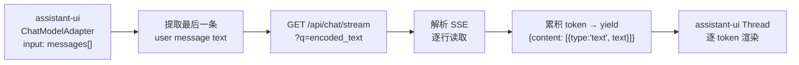
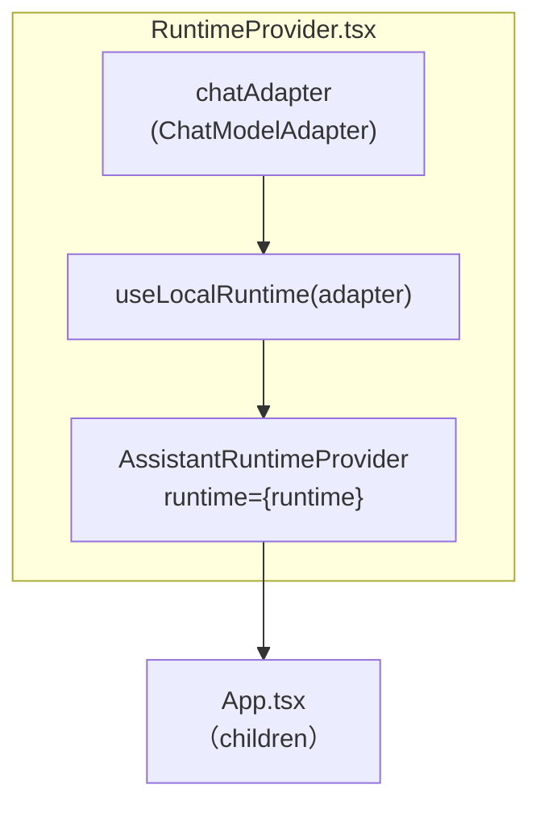
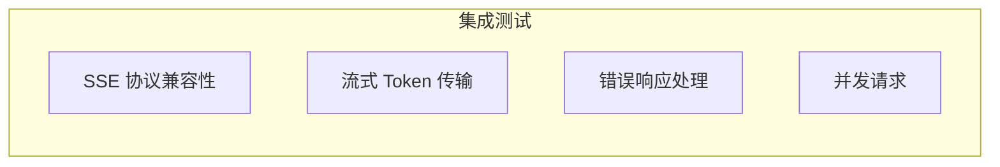
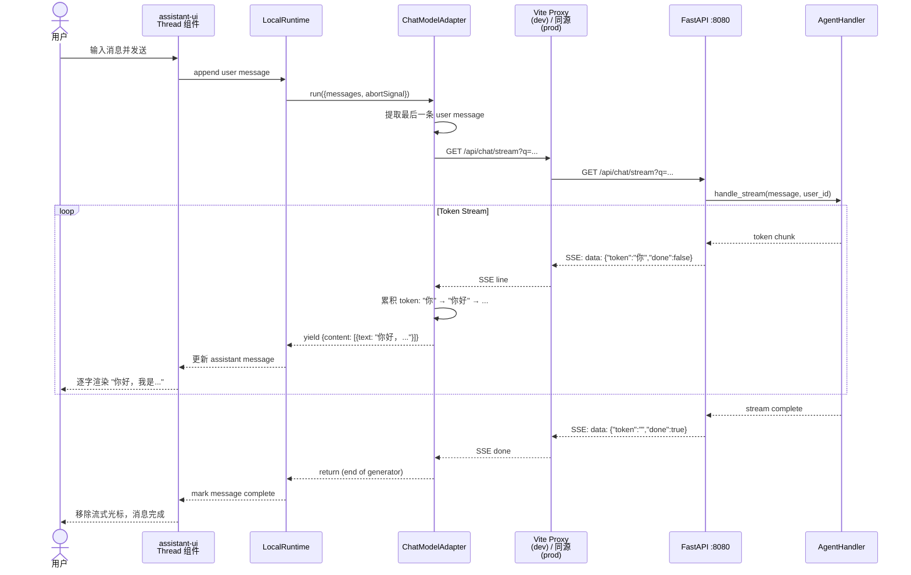
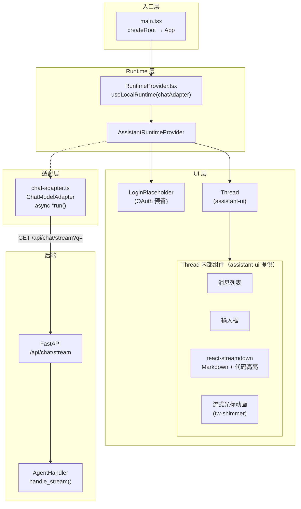
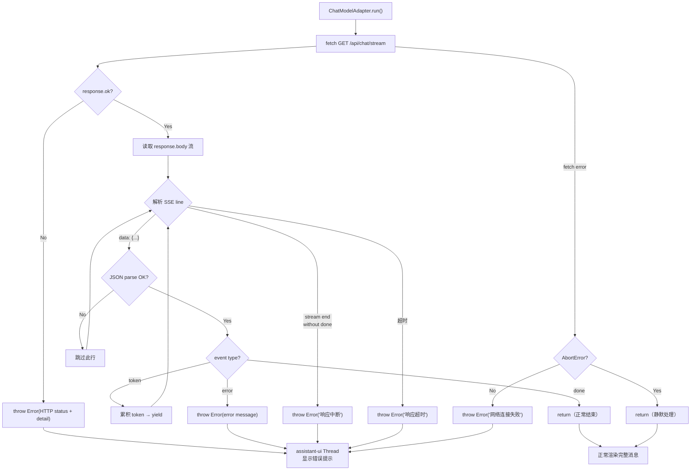
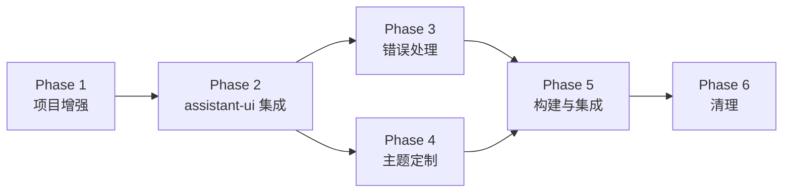

# Feature 1.1: Web Chat 前端工程化 — Implementation Plan

> 版本：v1.0 | 日期：2026-06-07

---

## 1. Issue Summary

| 维度 | 说明 |
|------|------|
| **类型** | Feature |
| **目标** | 将 `personal-assistant-client/` 现有自定义 Chat UI 升级为 assistant-ui 组件库驱动的工程化前端，替换手写的消息列表、流式渲染、Markdown 渲染逻辑 |
| **技术栈** | Vite + React 19 + TypeScript + Tailwind CSS 4 + assistant-ui (`@assistant-ui/react`) |
| **关联 ADR** | [ADR-008](../architecture/ADR/ADR-008-web-chat-frontend-framework.md)、[ADR-013](../architecture/ADR/ADR-013-assistant-ui-chat-library.md) |
| **关联架构** | [`frontend_architecture.md`](../architecture/frontend_architecture.md) §2.1、§6.2 |

### 当前状态

`personal-assistant-client/` 已完成项目脚手架：Vite + React + TypeScript + Tailwind CSS 已就位，拥有自定义 Chat UI 组件（`ChatContainer`、`ChatInput`、`MessageBubble`、`MessageList`、`StreamingText`）和基于 `EventSource` 的 SSE 流式 Hook（`useChat.ts`）。FastAPI 后端 `/api/chat/stream` 端点已正常工作，前端构建产物已通过 `StaticFiles` mount 到 `/` 路径。

本 Feature 的核心工作是**替换**这些自定义组件，用 assistant-ui 的 `Thread` 组件 + `LocalRuntime` + `ChatModelAdapter` 代之。

### 变更范围

- **新增**：assistant-ui 依赖、`ChatModelAdapter`、`AssistantRuntimeProvider`、assistant-ui Thread 组件文件
- **替换**：`App.tsx`（集成 assistant-ui runtime）、`index.css`（assistant-ui 主题 CSS 变量）
- **移除**：`ChatContainer`、`ChatInput`、`MessageBubble`、`MessageList`、`StreamingText`、`useChat` hook 及其测试文件
- **保留**：`LoginPlaceholder.tsx`（适配到 assistant-ui 布局中）、`vite.config.ts`（代理配置不变）、`src/types/chat.ts`（可能需要更新）

---

## 2. API 变更评估

### 结论：**不需要后端 API 变更**

### 评估详情

| 项目 | 现状 | 是否需要变更 | 说明 |
|------|------|:---:|------|
| `/api/chat/stream` 端点 | `GET /api/chat/stream?q=<message>` | ❌ 不变 | 协议在 `ChatModelAdapter` 内部桥接（见下方） |
| 请求格式 | query string `q`（单条消息） | ❌ 不变 | ChatModelAdapter 从 `messages[]` 中提取最后一条用户消息文本 |
| 响应格式 | SSE: `data: {"token":"...","done":false}` | ❌ 不变 | ChatModelAdapter 解析 SSE 流，累积 token，按 assistant-ui 格式 yield |
| 新端点 | — | ❌ 不需要 | 当前端点已满足需求 |
| Pydantic Schema | 无（GET query param） | ❌ 不变 | — |
| OpenAPI Spec | 现有 spec 无需修改 | ❌ 不变 | — |

### 协议桥接设计

assistant-ui 的 `ChatModelAdapter.run()` 接收 `{ messages, abortSignal }`，期望返回流式或非流式结果。后端 `GET /api/chat/stream?q=` 接受单条消息并返回 SSE token 流。桥接逻辑如下：



> **Note**：`messages[]` 中包含的完整对话历史在 ChatModelAdapter 中被提取为最后一条用户消息。多轮对话上下文记忆（conversation context）由后端的 Memory 模块（Feature 2）管理，不在本次前端 Feature 范围内。

### ADR-013 示例代码与实际实现的差异

> **Clarification**：ADR-013 中的 `ChatModelAdapter` 示例代码使用了 `POST` + JSON body `{messages}` 格式，但本项目实际后端端点 `GET /api/chat/stream?q=` 使用 query string 参数。这不是 ADR 错误——ADR-013 的示例是通用模板（适用于 OpenAI-compatible backend），而本项目的实际实现按 §2 协议桥接设计在 ChatModelAdapter 内部完成格式转换。ADR-013 的正确性不受影响：其核心决策（选用 assistant-ui + `ChatModelAdapter` 模式）仍然成立，只是 `run()` 内部的具体 fetch 调用需要适配本项目的 GET SSE 端点。

### Steps ③ ④ 是否需要运行？

**不需要**。由于无 API 变更，Meta 流水线中的 API 同步步骤（③ personal-assistant-meta-service-dev 更新 FastAPI/Pydantic schemas、④ personal-assistant-meta-client-dev 重新生成 TypeScript types）可跳过。

---

## 3. Phase 1 — 项目增强（Task 1.1.1）

### 概述

`personal-assistant-client/` 已有 Vite + React + TypeScript + Tailwind CSS 4 项目骨架。此阶段安装 assistant-ui 相关依赖，配置 assistant-ui 所需的 shadcn/ui 基础组件（`class-variance-authority`、`radix-ui` 等），并准备好 Thread 组件文件。

### 3.1 依赖安装

在 `personal-assistant-client/` 目录执行：

| 包名 | 版本约束 | 用途 |
|------|---------|------|
| `@assistant-ui/react` | latest | AI Chat UI 核心：`useLocalRuntime`、`ChatModelAdapter`、`AssistantRuntimeProvider`、`Thread` primitives |
| `@assistant-ui/react-markdown` | latest | assistant-ui 内置 Markdown 渲染（`react-streamdown` + `react-syntax-highlighter`） |
| `class-variance-authority` | ^0.7 | 组件 variant 管理（shadcn/ui 基座依赖） |
| `@radix-ui/react-tooltip` | latest | Tooltip 组件（assistant-ui 依赖） |
| `@radix-ui/react-slot` | latest | Slot 组件（shadcn/ui 基座依赖） |
| `tw-shimmer` | latest | 流式文本闪烁动画（assistant-ui 依赖） |
| `zustand` | latest | 状态管理（assistant-ui 可选依赖，ThreadList 使用） |
| `remark-gfm` | latest | GitHub Flavored Markdown 支持 |
| `react-streamdown` | latest | 流式 Markdown 解析（assistant-ui markdown 依赖） |
| `react-syntax-highlighter` | latest | 代码语法高亮（assistant-ui markdown 依赖） |

> **关于 `@assistant-ui/react-ai-sdk` 和 `@ai-sdk/react`**：这两个包是 Vercel AI SDK 集成层。由于本项目的后端是自定义 FastAPI SSE 端点（非 Vercel AI SDK protocol），集成方案使用 `LocalRuntime` + 自定义 `ChatModelAdapter`，**不依赖这两个包**。如果 issue.md 中列出的安装指令包含它们，可保留用于未来的 Vercel AI SDK 集成场景，但本次 Feature 实现不需要。

### 3.2 添加 assistant-ui Thread 组件文件

assistant-ui 采用 shadcn/ui 分发模型：组件源码复制到项目 `src/components/assistant-ui/` 目录，开发者可自由修改。

**方案 A（推荐）**：使用 CLI 命令添加

```bash
npx shadcn@latest add https://r.assistant-ui.com/thread.json
```

> 需要先初始化 shadcn/ui（如已有 `components.json` 则可直接运行）。如果项目中尚未集成 shadcn/ui CLI，需要先运行 `npx shadcn@latest init` 并配置 `src/` 为基础目录、TypeScript、Tailwind CSS 4。

**方案 B（备用）**：手动从 GitHub 复制源文件

从 [assistant-ui/packages/ui/src/components/assistant-ui/](https://github.com/assistant-ui/assistant-ui/tree/main/packages/ui/src/components/assistant-ui/) 复制以下文件到 `src/components/assistant-ui/`：

| 文件 | 用途 |
|------|------|
| `thread.tsx` | 主聊天界面组件（消息列表 + 输入框 + 流式渲染） |
| `thread-list.tsx` | 多线程列表（Phase 1 可选，单线程模式不需要） |
| `markdown-text.tsx` | Markdown 渲染组件（集成 `react-streamdown`） |
| `tooltip-icon-button.tsx` | 带 Tooltip 的图标按钮 primitive |
| `attachment.tsx` | 文件附件显示组件 |
| `reasoning.tsx` | 推理过程展示组件 |
| `tool-fallback.tsx` | Tool 调用回退 UI |
| `tool-group.tsx` | Tool 调用分组布局 |

### 3.3 目录结构目标

```
personal-assistant-client/
├── src/
│   ├── main.tsx                          # React 入口（替换为 RuntimeProvider 包裹）
│   ├── App.tsx                           # 应用根组件（替换为 Thread 渲染）
│   ├── index.css                         # 全局样式（更新：添加 assistant-ui 主题变量）
│   ├── vite-env.d.ts
│   ├── lib/
│   │   └── chat-adapter.ts              # 【新增】ChatModelAdapter 实现
│   ├── components/
│   │   ├── assistant-ui/                # 【新增】assistant-ui Thread 组件文件
│   │   │   ├── thread.tsx
│   │   │   ├── thread-list.tsx          # 可选
│   │   │   ├── markdown-text.tsx
│   │   │   ├── tooltip-icon-button.tsx
│   │   │   ├── attachment.tsx
│   │   │   ├── reasoning.tsx
│   │   │   ├── tool-fallback.tsx
│   │   │   └── tool-group.tsx
│   │   ├── LoginPlaceholder.tsx         # 【保留·修改】嵌入 assistant-ui 布局
│   │   └── RuntimeProvider.tsx           # 【新增】AssistantRuntimeProvider 封装
│   ├── types/
│   │   └── chat.ts                      # 【保留·可选更新】类型定义
│   └── test/
│       └── setup.ts                     # 【保留】Vitest setup
```

### 3.4 验证

- `npm ls @assistant-ui/react` 输出版本号
- `src/components/assistant-ui/thread.tsx` 文件存在
- `npm run dev` 不报 import 错误（Thread 组件暂未挂载，无运行时错误即可）

### 3.5 Tailwind CSS 4 兼容性前置验证（⚠️ Phase 2 阻塞项）

项目当前使用 Tailwind CSS v4.1.4（`@tailwindcss/vite` plugin）。assistant-ui 官方文档和 CLI 工具（`npx shadcn@latest add`）主要面向 Tailwind 3 的 `tailwind.config.ts` 工作流。在进入 Phase 2 集成之前，**必须**完成以下兼容性验证：

| 验证项 | 方法 | 通过标准 |
|--------|------|---------|
| assistant-ui Thread 组件在 Tailwind 4 下正常渲染 | 安装依赖后，在 App 中临时挂载 `<Thread />`（不接 runtime） | 无 CSS 报错，组件可见且样式正常 |
| shadcn/ui CLI 兼容 Tailwind 4 | 运行 `npx shadcn@latest add https://r.assistant-ui.com/thread.json` | 成功生成文件，无报错 |
| `@tailwindcss/vite` plugin 与 assistant-ui 的 Tailwind class 无冲突 | `npm run dev` 后检查浏览器 Console | 无 CSS-related warning/error |

**不兼容时的回退方案**：

如果 Tailwind CSS 4 与 assistant-ui 不兼容，降级到 Tailwind CSS 3：

1. 卸载 Tailwind 4 相关包：`npm uninstall tailwindcss @tailwindcss/vite`
2. 安装 Tailwind 3：`npm install -D tailwindcss@3 postcss autoprefixer`
3. 初始化配置：`npx tailwindcss init -p`（生成 `tailwind.config.ts` + `postcss.config.js`）
4. 更新 `vite.config.ts`：移除 `@tailwindcss/vite` plugin，改用 PostCSS
5. 更新 `src/index.css`：将 `@import "tailwindcss"` 替换为 Tailwind 3 标准指令（`@tailwind base; @tailwind components; @tailwind utilities;`）
6. 重新运行 `npm run dev` 验证

> **阻塞规则**：Phase 2 不得在未通过兼容性验证（或已完成降级）的情况下开始。

### 3.6 主题 CSS 变量探查（Phase 1 预研）

在 Phase 1 依赖安装完成后，立即探查 assistant-ui 的实际 CSS 变量名，为 Phase 4 主题定制提供精确变量名：

```bash
# 搜索 assistant-ui 定义的 CSS 变量
grep -r --include="*.css" "^\s*--aui-" node_modules/@assistant-ui/react/dist/
# 或检查 base styles 文件
ls node_modules/@assistant-ui/react/dist/*.css
```

将实际变量名记录下来，用于 Phase 4 的 `index.css` 变量覆盖。Phase 4 中 §6.2 的 Token 表是基于命名的**示意表**——实际变量名以此次探查结果为准。

---

## 4. Phase 2 — assistant-ui 集成（Task 1.1.2）

### 4.1 创建 ChatModelAdapter

**文件**：`src/lib/chat-adapter.ts`

**职责**：桥接 assistant-ui 和 FastAPI `/api/chat/stream` SSE 端点。

**核心逻辑**：

| 步骤 | 操作 | 说明 |
|------|------|------|
| 1 | 从 `messages[]` 提取最后一条 `role: 'user'` 的消息文本 | 助手消息、系统消息忽略 |
| 2 | 发起 `GET /api/chat/stream?q=<encoded_text>`，携带 `abortSignal` | 开发模式通过 Vite proxy → localhost:8080，生产模式同源 |
| 3 | 读取 response body 流，按行解析 SSE 格式 | SSE 格式：`data: {"token":"...","done":false}\n\n` |
| 4 | 累积 token → 按 `{content: [{type: "text", text: fullText}]}` 格式 yield | **必须 yield 累积全文**，非增量 delta（否则 UI 闪烁） |
| 5 | 收到 `done: true` → `return` | 结束流式响应 |
| 6 | 收到 `error` → `throw new Error(...)` | 将后端错误转化为 assistant-ui 可展示的错误 |

**函数签名**：

```typescript
import type { ChatModelAdapter } from "@assistant-ui/react";

export const chatAdapter: ChatModelAdapter = {
  async *run({ messages, abortSignal }) {
    // ... SSE 桥接逻辑
  },
};
```

**关键设计决策**：

- 使用 `async *run()`（generator）而非 `async run()`，以支持流式 token 逐字渲染
- 每次 yield 的内容是**当前累积的完整文本**（assistant-ui 要求：每次 yield 替换之前内容，如果 yield delta 则只显示最后一个 token）
- `abortSignal` 传递给 `fetch`，支持用户取消/中断响应
- 通过 Vite dev server 的 proxy（`/api/* → localhost:8080`）在开发环境转发请求；生产环境同源直连
- 错误处理逻辑见 Phase 3

### 4.2 创建 RuntimeProvider

**文件**：`src/components/RuntimeProvider.tsx`

**职责**：封装 `useLocalRuntime` + `AssistantRuntimeProvider`，将 `ChatModelAdapter` 注入到 assistant-ui 运行时。



**核心逻辑**：

1. 导入 `chatAdapter` from `../lib/chat-adapter`
2. 调用 `useLocalRuntime(chatAdapter)` 创建 runtime 实例
3. 用 `AssistantRuntimeProvider` 包裹 `children`

> **Note**：`useLocalRuntime` 内部管理聊天状态（消息列表、流式状态、分支/编辑），无需外部 `useState`。

### 4.3 更新 App.tsx

**文件**：`src/App.tsx`

**变更**：

| Before | After |
|--------|-------|
| `import { ChatContainer }` | `import { RuntimeProvider }` |
| 渲染 `<ChatContainer />` | 渲染 `<RuntimeProvider><Thread /></RuntimeProvider>` |
| 自定义布局在 `ChatContainer` 内部 | 布局交给 assistant-ui Thread 组件管理 |

**组件结构**：

```
App.tsx
└── RuntimeProvider (AssistantRuntimeProvider + useLocalRuntime)
    ├── LoginPlaceholder (OAuth 登录入口预留)
    └── Thread (assistant-ui 主聊天组件)
        ├── 消息列表（内置，替代 MessageList + MessageBubble）
        ├── Markdown 渲染（内置，替代 StreamingText）
        ├── 输入框（内置，替代 ChatInput）
        └── 流式渲染 + 光标动画（内置）
```

### 4.4 适配 LoginPlaceholder

**文件**：`src/components/LoginPlaceholder.tsx`

**变更**：当前 `LoginPlaceholder` 是独立 banner。在 assistant-ui 集成后，可以：
- **方案 A**：放在 Thread 组件上方，保持独立横幅
- **方案 B**：通过 assistant-ui 的 `ComposerPrimitive` 或 `ThreadPrimitive` 的 slot 机制注入

推荐方案 A（简单直接，不影响 assistant-ui 内部结构），将 `LoginPlaceholder` 放在 `Thread` 组件之前：

```tsx
<RuntimeProvider>
  <div className="flex flex-col h-screen">
    <LoginPlaceholder />
    <div className="flex-1">
      <Thread />
    </div>
  </div>
</RuntimeProvider>
```

### 4.5 验证

- `npm run dev` → 浏览器打开 → 看到 assistant-ui `Thread` 聊天界面（非自定义组件）
- 输入消息 → SSE 流式返回，逐 token 渲染 → 消息气泡正常
- Markdown 渲染正确（标题、列表、代码块 + 语法高亮 — 由 assistant-ui 内置的 `react-streamdown` + `react-syntax-highlighter` 提供）
- 多轮对话不串消息、不崩溃（assistant-ui runtime 内部管理消息列表）

---

## 5. Phase 3 — 错误处理（Task 1.1.3）

所有错误处理集中在 `ChatModelAdapter` (`src/lib/chat-adapter.ts`) 中实现。

### 5.1 连接中断处理

| 场景 | 检测方式 | 处理 |
|------|---------|------|
| 网络断开 | `fetch` 抛出 `TypeError`（`Failed to fetch`） | `throw new Error("网络连接失败，请检查网络后重试")` |
| 服务器宕机 | `fetch` 抛出 `TypeError` 或返回 5xx | 同网络断开处理 |
| SSE 流中断 | `response.body` 读取流提前结束 (stream done without `done: true`) | `throw new Error("响应中断，请重试")` |

### 5.2 HTTP 错误处理

| HTTP Status | 检测方式 | 处理 |
|-------------|---------|------|
| 400 Bad Request | `response.ok === false` | 解析 response body 提取 `detail`，抛出对应错误 |
| 500 Internal Server Error | `response.ok === false` | `throw new Error("服务器内部错误，请稍后重试")` |
| 其他 4xx/5xx | `response.ok === false` | `throw new Error(\`请求失败 (${response.status})\`)` |

> assistant-ui 的 Thread 组件内置错误展示 UI，当 `ChatModelAdapter.run()` 抛出异常时，会在消息气泡旁显示错误提示，不会白屏。

### 5.3 超时处理

| 策略 | 实现 |
|------|------|
| **请求超时** | 使用 `AbortSignal.timeout(60_000)`（60 秒）包装 `abortSignal`，超时自动中断 |
| **首 token 超时** | 在读取循环中设置 first-token timeout：如果 30 秒内未收到第一个 token，`throw new Error("响应超时，请稍后重试")` |
| **静默超时** | 如果连续 15 秒未收到新 token（非 done），`throw new Error("响应超时，请稍后重试")` |

### 5.4 AbortError 处理

用户主动取消（切换对话、停止生成）时，`abortSignal` 触发 `AbortError`。此类错误**不应展示**给用户：

```typescript
if (error instanceof DOMException && error.name === "AbortError") {
  return; // 静默处理，用户主动取消
}
```

### 5.5 SSE 解析容错

| 场景 | 处理 |
|------|------|
| JSON 解析失败（malformed SSE data） | `try/catch`，跳过当前行，继续读取后续 |
| `data:` 行格式异常（无冒号等） | 跳过非 `data:` 行（SSE 协议允许 comment 行） |
| 空 token（后端发送占位心跳） | 不 yield，继续等待下一个有效 token |

### 5.6 验证

- 断开网络 → 发送消息 → 界面显示"网络连接失败"错误提示（不白屏）
- 停止 FastAPI → 发送消息 → 界面显示连接错误
- 长时间无响应（模拟慢速 LLM）→ 超时后显示错误提示
- 发送消息后点"停止"按钮 → 不显示错误（AbortError 静默处理）

---

## 6. Phase 4 — 主题定制（跨 Task 1.1.2）

### 6.1 概述

assistant-ui 使用 Tailwind CSS + CSS 变量进行主题定制。通过覆盖其 CSS 变量（定义在 `@assistant-ui/react` 的 base styles 中），将默认主题切换为项目目标风格：**iOS 风格色板 + 暗色模式**。

### 6.2 CSS 变量覆盖

在 `src/index.css` 中添加 assistant-ui 主题变量覆盖块。核心色板参考：

| Token | Light Mode | Dark Mode | 说明 |
|-------|-----------|-----------|------|
| `--aui-primary` | `#007AFF` | `#0A84FF` | iOS 蓝色主色调 |
| `--aui-bg-primary` | `#FFFFFF` | `#1C1C1E` | 主背景色 |
| `--aui-bg-secondary` | `#F2F2F7` | `#2C2C2E` | 次级背景色 |
| `--aui-bg-user-bubble` | `#007AFF` | `#0A84FF` | 用户消息气泡背景 |
| `--aui-bg-assistant-bubble` | `#F2F2F7` | `#2C2C2E` | 助手消息气泡背景 |
| `--aui-text-primary` | `#1C1C1E` | `#F2F2F7` | 主文本色 |
| `--aui-text-secondary` | `#8E8E93` | `#98989D` | 次级文本色 |
| `--aui-border` | `#C6C6C8` | `#38383A` | 边框色 |
| `--aui-radius` | `1rem` | — | 圆角（iOS 风格大圆角） |

> 以上 Token 名为示意。实际 assistant-ui CSS 变量名以 `@assistant-ui/react` 源码中定义的为准，需要在安装后查看其 base CSS 或 theme 文档确定精确变量名。

### 6.3 暗色模式

- Tailwind CSS 4 通过 CSS `prefers-color-scheme` media query 或 `dark` class 支持暗色模式
- assistant-ui 组件继承 Tailwind 的暗色模式机制
- iOS 暗色模式色板使用较深灰度（`#1C1C1E`、`#2C2C2E`、`#3A3A3C`）

### 6.4 font-family

assistant-ui 默认使用系统字体栈，与 iOS 风格一致（San Francisco on macOS/iOS, Segoe UI on Windows），无需额外修改。

### 6.5 验证

- 浏览器 light mode → 界面呈现 iOS 蓝白风格
- 浏览器 dark mode → 界面呈现暗色 iOS 风格
- 用户气泡蓝色，助手气泡灰色
- 圆角柔和（非直角），间距舒适

---

## 7. Phase 5 — 构建与集成（Task 1.1.4）

### 7.1 构建配置

`vite.config.ts` 已配置完成：

- 构建输出目录：`dist/`
- Dev server proxy：`/api/* → localhost:8080`
- Sourcemap：关闭（生产构建）

**无需修改**。

### 7.2 FastAPI StaticFiles Mount 验证

`personal-assistant-service/app/main.py` 已实现：

```python
STATIC_DIR = _proj_root / "personal-assistant-client" / "dist"
if STATIC_DIR.is_dir():
    app.mount("/", StaticFiles(directory=str(STATIC_DIR), html=True), name="web")
```

**验证步骤**：

1. 在 `personal-assistant-client/` 执行 `npm run build`
2. 确认 `dist/` 目录生成，包含 `index.html` + 打包后的 JS/CSS assets
3. 启动 FastAPI：在 `personal-assistant-service/` 执行 `uvicorn app.main:app --port 8080`
4. 浏览器访问 `http://localhost:8080/` → 看到 assistant-ui Web Chat 界面
5. 输入消息 → 正常流式响应

### 7.3 与 /playground（Chainlit）共存验证

FastAPI 路由设计：
```
:8080/
  ├── /              → StaticFiles mount (Web Chat)
  ├── /playground    → Chainlit app（调试 UI）
  ├── /api/chat/stream → SSE 端点
  └── /api/ping      → 健康检查
```

- `app.mount("/", StaticFiles(...), ...)` 挂载在 `/`，不影响 `/playground` 和 `/api/*` 路由（FastAPI 路由优先级：显式路由 > mount）
- 验证：访问 `http://localhost:8080/playground` → Chainlit 正常工作
- 验证：访问 `http://localhost:8080/api/ping` → 返回 `{"status":"ok"}`

### 7.4 验证 Checklist

| 检查项 | 命令/方法 | 预期结果 |
|--------|----------|---------|
| Dev 模式正常 | `npm run dev` in client/, start FastAPI | 浏览器显示 assistant-ui 界面 |
| 流式对话 | 输入消息 | 逐 token 渲染 |
| Markdown 渲染 | 输入 `## 标题\n- 列表\n\`\`\`js\ncode\n\`\`\`` | 正确渲染 |
| 多轮对话 | 连续发送 3+ 条消息 | 不串消息、不崩溃 |
| Build 成功 | `npm run build` | 生成 `dist/` 目录 |
| Production 正常 | FastAPI serve `dist/` | 同 dev 模式功能 |
| /playground 共存 | 访问 `/playground` | Chainlit 正常 |
| /api/ping 正常 | 访问 `/api/ping` | `{"status":"ok"}` |

---

## 8. Phase 6 — 清理（Task 1.1.5）

### 8.1 移除文件

| 文件 | 原因 |
|------|------|
| `src/components/ChatContainer.tsx` | 被 assistant-ui `Thread` 替代 |
| `src/components/ChatInput.tsx` | 被 assistant-ui 内置输入框替代 |
| `src/components/ChatInput.test.tsx` | 对应组件已移除 |
| `src/components/MessageBubble.tsx` | 被 assistant-ui 内置消息气泡替代 |
| `src/components/MessageBubble.test.tsx` | 对应组件已移除 |
| `src/components/MessageList.tsx` | 被 assistant-ui 内置消息列表替代 |
| `src/components/MessageList.test.tsx` | 对应组件已移除 |
| `src/components/StreamingText.tsx` | 被 assistant-ui 内置 Markdown 渲染替代 |
| `src/hooks/useChat.ts` | 被 assistant-ui `useLocalRuntime` + `ChatModelAdapter` 替代 |
| `src/hooks/useChat.test.ts` | 对应 hook 已移除 |

**Service 端旧文件清理**：

| 路径 | 操作 | 说明 |
|------|------|------|
| `personal-assistant-service/web/index.html` | 检查是否存在 → 如存在则删除 | Issue 1.1.5 要求删除 Feature 1 的单文件前端。如果此文件已在前序工作中被清理，则标记为"已移除，无需操作"并记录验证结果 |

> 当前调查显示 `personal-assistant-service/web/` 目录可能已不存在（前端入口已迁移到 `personal-assistant-client/index.html`）。Phase 6 执行时需 `ls personal-assistant-service/web/` 确认，将验证结果记录在 commit message 或 PR description 中。

### 8.2 更新文件

| 文件 | 变更 |
|------|------|
| `src/App.tsx` | 替换为 RuntimeProvider + Thread 结构（Phase 2 已完成） |
| `src/index.css` | 移除 `.cursor-blink` 动画（assistant-ui 使用 `tw-shimmer` 替代），添加 assistant-ui 主题变量 |
| `src/types/chat.ts` | 保留（可能仍被某些 assistant-ui 集成代码引用），或移除 `SSEEvent`（移至 `chat-adapter.ts` 内部）、简化 `Message` 接口 |
| `src/components/LoginPlaceholder.tsx` | 保留（Phase 2 已适配） |

### 8.3 不需要移除的文件

| 文件 | 原因 |
|------|------|
| `vite.config.ts` | 代理配置、构建配置仍然需要 |
| `index.html` | Vite 入口 HTML，仍然需要 |
| `package.json` | 依赖管理 |
| `tsconfig.json` / `tsconfig.node.json` | TypeScript 配置 |
| `src/vite-env.d.ts` | Vite 类型声明 |
| `src/test/setup.ts` | Vitest 配置（新测试仍需使用） |
| `src/main.tsx` | React 入口（内容可能需要微调，但不移除） |

### 8.4 架构文档同步更新

本 Feature 实现完成后，以下架构文档存在已知不一致，需要在 Phase 6 中处理：

#### 8.4.1 `frontend_architecture.md` §2.1 — 技术栈引用更新

**问题**：`frontend_architecture.md` §2.1 第 69 行当前记录的技术栈包含 `@assistant-ui/react-ai-sdk`：
> `assistant-ui AI Chat 组件库（含 @assistant-ui/react-ai-sdk）。详见 ADR-013`

实际实现使用 `LocalRuntime` + 自定义 `ChatModelAdapter`（仅需 `@assistant-ui/react`），不依赖 `@assistant-ui/react-ai-sdk`。该引用具有误导性。

**处理方式**（二选一）：

| 方案 | 操作 | 推荐 |
|:---:|------|:---:|
| **A** | 在本 Feature 的 Phase 6 中直接更新 `frontend_architecture.md` §2.1，将技术栈引用修正为 `assistant-ui (@assistant-ui/react)`，移除 `@assistant-ui/react-ai-sdk` 引用 | ✅ 推荐（跟随 Feature 实现同步修正） |
| **B** | 创建独立的 Meta issue 跟踪此更新 | 适用于架构文档更新需要单独审核的情况 |

> 同时在文档中注明：当前集成模式使用 `LocalRuntime` + `ChatModelAdapter`，未使用 Vercel AI SDK 集成层。如未来切换到 `@assistant-ui/react-ai-sdk` transport，需另行更新。

#### 8.4.2 ADR-008 — 技术栈 block 更新

**问题**：ADR-008 底部"技术栈"代码块仍列出 `assistant-ui`、`@assistant-ui/react-ai-sdk`、`@ai-sdk/react` 三项。2026-06-07 的更新注释说明了 ADR-013 的决策，但未清理原有的 shadcn/ui 相关条目和 `@assistant-ui/react-ai-sdk` 引用。

**处理方式**：此更新涉及 ADR（Architecture Decision Record）的历史记录修改，建议创建独立 Meta issue。ADR-013 是本 Feature 实现技术栈的**权威文档**（authoritative doc），实现时以 ADR-013 为准。详见 §12。

#### 8.4.3 `overall_architecture.md` — 确认无需更新

`overall_architecture.md` §9 项目文件结构中的 `web/` 目录引用可能需要更新为 `personal-assistant-client/`。Phase 6 执行时验证，如路径已正确则无需操作。

---

## 9. Test Requirements

### 9.1 单元测试（Client）

| 测试对象 | 测试文件 | 测试用例 |
|---------|---------|---------|
| `ChatModelAdapter` | `src/lib/chat-adapter.test.ts` | — 正常流式响应：yield 累积 token<br/>— done 信号：正确结束流<br/>— error 信号：throw 对应错误<br/>— HTTP 错误（400/500）：正确 throw<br/>— 网络错误：正确 throw<br/>— AbortError：静默返回<br/>— 空消息：不发起请求<br/>— SSE 格式异常：跳过 malformed 行<br/>— 多轮 messages：只提取最后一条 user 消息 |
| `RuntimeProvider` | `src/components/RuntimeProvider.test.tsx` | — 渲染 children<br/>— 提供 AssistantRuntimeProvider context |
| `LoginPlaceholder` | 已存在 | 保留现有测试（确认 UI 渲染正确） |
| `App` | `src/App.test.tsx` | — 渲染 Thread 组件<br/>— 显示 LoginPlaceholder |

### 9.2 集成测试（Service + Client）



| 测试场景 | 方法 | 预期 |
|---------|------|------|
| ChatModelAdapter → `/api/chat/stream` 完整流 | 模拟 fetch → mock SSE response | token 正确累积，最终 done |
| 后端返回 error | SSE `{"error":"msg","done":true}` | ChatModelAdapter throw Error |
| 后端返回 500 | mock HTTP 500 | ChatModelAdapter throw Error |
| abortSignal 中断 | 在流中间触发 abort | AbortError 静默处理 |

### 9.3 E2E 测试（Client ↔ Service 联调）

| 场景 | 步骤 | 验证点 |
|------|------|--------|
| 完整对话流程 | 1. 打开 Web Chat<br/>2. 输入 "你好"<br/>3. 等待响应完成<br/>4. 输入 "再见" | — assistant-ui 界面正常显示<br/>— 消息气泡正确渲染<br/>— 流式 token 逐字显示<br/>— 多轮消息不混淆 |
| Markdown 渲染 | 发送含 Markdown 的消息："`## 测试标题`" | 正确渲染为 h2 |
| 代码高亮 | 发送含代码块的消息 | 语法高亮正确 |
| 错误处理 | 停止 FastAPI → 发送消息 | 显示错误提示（不白屏） |
| 超时处理 | 模拟慢速 LLM 响应 | 超时后显示错误提示 |

### 9.4 测试运行命令

| 层级 | 命令 | 目录 |
|------|------|------|
| Client unit tests | `npm test` | `personal-assistant-client/` |
| Client type check | `npx tsc --noEmit` | `personal-assistant-client/` |
| Client lint | `npm run lint` (if configured) | `personal-assistant-client/` |
| Client build check | `npm run build` | `personal-assistant-client/` |
| Service unit tests | `pytest` | `personal-assistant-service/` |
| E2E tests | `pytest` | `personal-assistant-e2e/` |

---

## 10. Mermaid Diagrams

### 10.1 核心交互流程：用户发送消息 → SSE 流式渲染



### 10.2 组件树与数据流



### 10.3 错误处理流程



---

## 11. 风险与注意事项

| 风险 | 影响 | 缓解措施 |
|------|------|---------|
| assistant-ui Thread 组件初次安装失败（shadcn/ui CLI 依赖） | 高 | 提供手动复制源文件的备用方案（Phase 1 §3.2 方案 B） |
| assistant-ui 版本 API 与文档不一致 | 中 | 锁定版本号在 `package.json` 中，升级前 review changelog |
| 主题 CSS 变量名不确定（需查看源码） | 低 | 安装后在 `node_modules/@assistant-ui/react/dist/` 中搜索 CSS 变量定义 |
| 现有测试（`useChat.test.ts` 等）的大量 mock 失效 | 中 | 移除旧测试文件，为新组件编写新测试 |
| Tailwind CSS 4 与 assistant-ui 的 Tailwind 版本兼容 | **中**（升级为正式阻塞项） | Phase 1 §3.5 中设置了前置兼容性验证步骤。验证未通过前 Phase 2 不得启动。降级到 Tailwind 3 的回退方案已详细记录 |

---

## 12. ADR 与架构文档一致性说明

### 12.1 已知不一致：ADR-008 技术栈 block

**问题**：ADR-008 底部"技术栈"代码块截至 2026-06-07 仍列出：

```
assistant-ui              — AI Chat UI 组件库（替代原计划的 shadcn/ui + 手写 SSE，详见 ADR-013）
@assistant-ui/react-ai-sdk — Vercel AI SDK 集成
@ai-sdk/react             — SSE 流式对话（useChat hook）
```

本 Feature 实际使用 `LocalRuntime` + 自定义 `ChatModelAdapter` 集成模式，**仅依赖 `@assistant-ui/react`**，不使用 `@assistant-ui/react-ai-sdk` 和 `@ai-sdk/react`。ADR-008 的 2026-06-07 更新注释引用了 ADR-013 的决策，但技术栈 block 未同步清理。

**影响**：如果开发者仅阅读 ADR-008，会误以为需要安装 `@assistant-ui/react-ai-sdk` 和 `@ai-sdk/react`。

**权威文档**：本 Feature 的技术栈以 **ADR-013**（assistant-ui 组件库选型）为最终权威。ADR-013 中的 `ChatModelAdapter` 示例代码（含 POST + JSON body）是通用模板，本项目的实际 `ChatModelAdapter` 实现细节以本 plan 的 §2 协议桥接设计和 §4.1 为准。

**后续动作**：

| 动作 | 负责人 | 优先级 |
|------|--------|:---:|
| 创建 Meta issue 更新 ADR-008 技术栈 block：移除 `@assistant-ui/react-ai-sdk` 和 `@ai-sdk/react`，或标注"可选 / 当前集成未使用" | personal-assistant-meta | 中（不阻塞本 Feature） |
| 确保 new implementers 首先阅读 ADR-013 + 本 plan，而非直接采信 ADR-008 的依赖列表 | Service-Dev / Client-Dev | 高 |

### 12.2 `frontend_architecture.md` §2.1

参见 §8.4.1。已在 Phase 6 中纳入更新任务。

### 12.3 一致性原则

1. **ADR-013 是 assistant-ui 集成方案的权威决策文档**，其中关于 `ChatModelAdapter` + `LocalRuntime` 的集成模式是正确且已接受的
2. **本 plan 是 Feature 1.1 的权威实现文档**，其中关于具体文件结构、依赖列表、API 桥接逻辑的描述覆盖所有关联文档的过时引用
3. **ADR 一旦 Accepted，不应直接修改正文**（保留决策历史），但可追加更新注释。对 ADR-008 技术栈 block 的修正应以注释/附录形式追加

---

## 13. 任务依赖与并行性



- Phase 3 和 Phase 4 可**并行执行**（互相独立）
- Phase 5 依赖 Phase 3 和 Phase 4 完成（需要完整功能才能验证）
- Phase 6 在 Phase 5 验证通过后执行

---

## 14. 参考文档

| 文档 | 路径 |
|------|------|
| Issue | `issues/features/feature-1.1-web-chat-frontend/issue.md` |
| 前端架构 | `architecture/frontend_architecture.md` |
| 总体架构 | `architecture/overall_architecture.md` |
| ADR-008 (前端框架选型) | `architecture/ADR/ADR-008-web-chat-frontend-framework.md` |
| ADR-013 (assistant-ui 选型) | `architecture/ADR/ADR-013-assistant-ui-chat-library.md` |
| assistant-ui Custom Backend | [assistant-ui.com/docs/runtimes/custom/local-runtime](https://www.assistant-ui.com/docs/runtimes/custom/local-runtime) |
| assistant-ui Installation | [assistant-ui.com/docs/installation](https://www.assistant-ui.com/docs/installation) |
