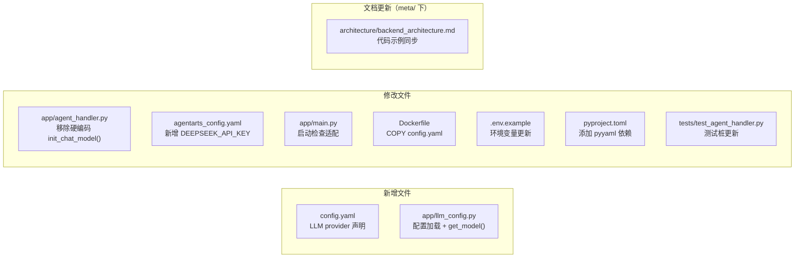
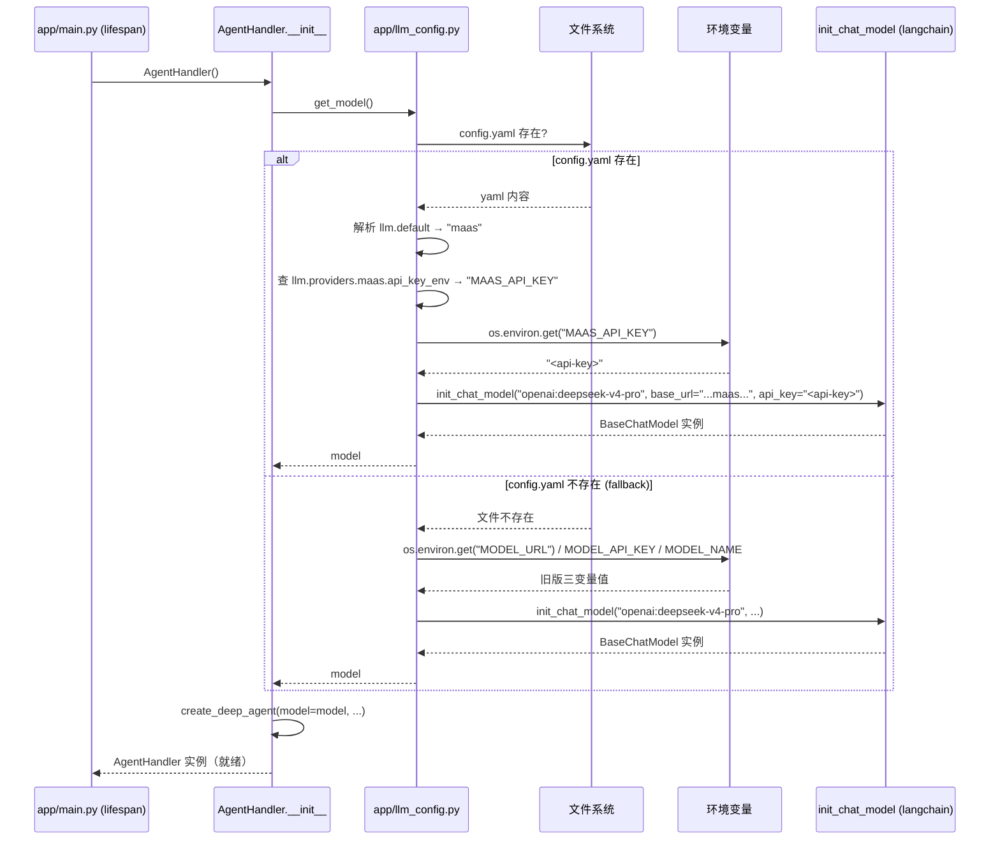
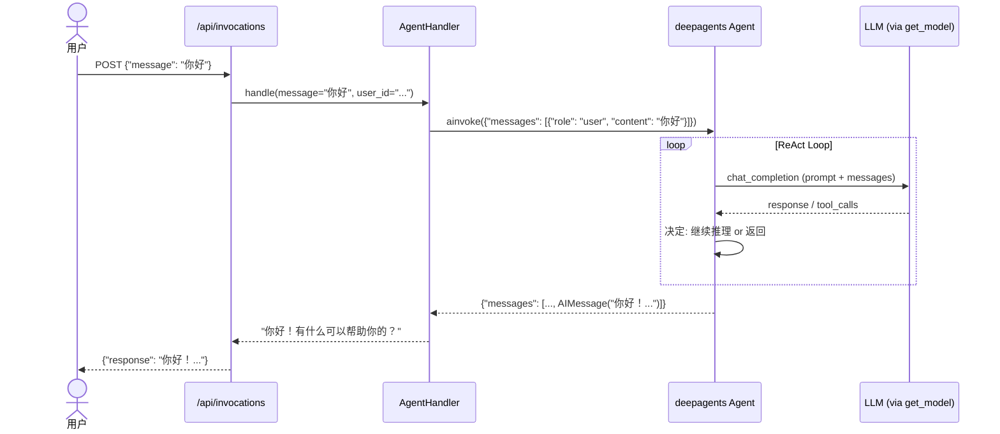
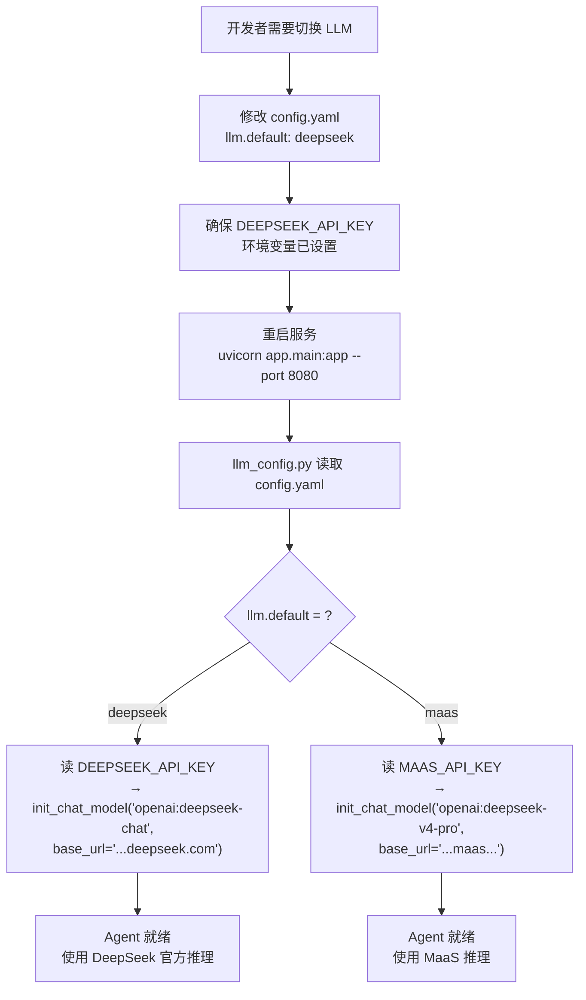
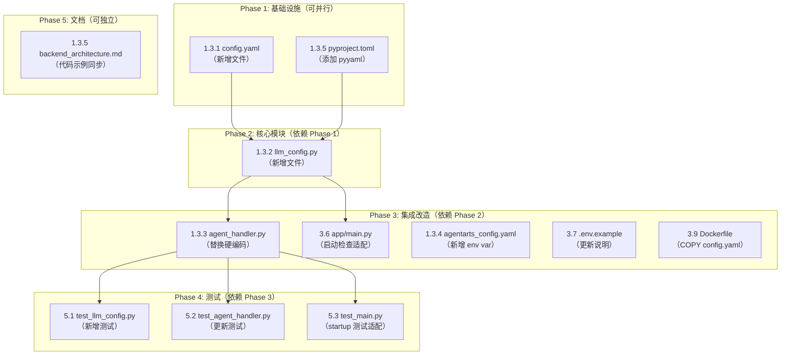

# Implementation Plan — Feature 1.3: 多 LLM Provider 可配置

> 状态：Ready for Implementation | 日期：2026-06-07

---

## 1. 变更概述

### 1.1 变更类型

**Feature** — 引入多 LLM Provider 声明式配置架构。Agent 从硬编码单 provider（仅 MaaS）升级为支持 MaaS 和 DeepSeek 官方两个 provider，通过 `config.yaml` 声明式配置，按需切换。

### 1.2 架构参考

| 文档 | 用途 |
|------|------|
| [ADR-011](../../../architecture/ADR/ADR-011-multi-llm-provider.md) | 架构决策（ACCEPTED）— 权威设计依据 |
| [overall_architecture.md](../../../architecture/overall_architecture.md) §6 | LLM Provider 配置规范（已更新完成） |
| [backend_architecture.md](../../../architecture/backend_architecture.md) §3 | Agent 处理逻辑代码约定（本次需同步更新） |

### 1.3 影响范围



### 1.4 不变更

- 无新增 API 端点，无请求/响应 schema 变更
- 无前端（Client）变更
- AgentArts 部署流程（`agentarts launch`）不变
- deepagents 编排逻辑不变

> **注意**：Dockerfile 需要新增一行 `COPY config.yaml`（见 §3.9），属于最小化改动。镜像构建流程和部署命令不变。

---

## 2. API 契约变更

**无变更。** 本 Feature 为内部 LLM 配置管理升级，不涉及任何 HTTP API 端点的增删改：

- 无新路由
- 无请求/响应 schema 变更
- 无 OpenAPI spec 变更
- 无 TypeScript 类型同步需求

因此 **personal-assistant-meta-service-dev** 和 **personal-assistant-meta-client-dev** 无需执行任何 API 同步操作。

---

## 3. Service 实现任务

> 所有路径均为 `personal-assistant-service/` 目录下的相对路径。

### 3.1 config.yaml 配置文件（任务 1.3.1）

**操作**：新建文件

**路径**：`personal-assistant-service/config.yaml`

**内容**：

```yaml
# Personal Assistant — LLM Provider 配置
# 详见 ADR-011: 多 LLM Provider 可配置架构
llm:
  default: maas  # 默认 provider。可选值：maas | deepseek
  providers:
    maas:
      base_url: https://api.modelarts-maas.com/openai/v1
      api_key_env: MAAS_API_KEY
      model: deepseek-v4-pro
    deepseek:
      base_url: https://api.deepseek.com
      api_key_env: DEEPSEEK_API_KEY
      model: deepseek-chat
```

**关键设计点**：

- `api_key_env` 存储**环境变量名**而非密钥明文，符合 12-Factor App 原则
- `llm.default` 明确指定默认 provider（`maas`），避免隐式 fallback
- `config.yaml` 放置在 service 根目录（与 `pyproject.toml`、`Dockerfile` 同级），`llm_config.py` 通过相对路径读取

---

### 3.2 llm_config.py 配置加载模块（任务 1.3.2）

**操作**：新建文件

**路径**：`personal-assistant-service/app/llm_config.py`

**内容**：

```python
"""LLM Provider 配置加载模块。

读取项目根目录的 config.yaml + 环境变量，
暴露统一的 get_model(provider: str = None) -> BaseChatModel 接口。

当 config.yaml 不存在时，fallback 到旧版环境变量：
  MODEL_URL / MODEL_API_KEY / MODEL_NAME
"""

import os
from pathlib import Path
from typing import Any

import yaml
from langchain.chat_models import BaseChatModel, init_chat_model

# 项目根目录 = app/llm_config.py 的上两级目录
_PROJECT_ROOT = Path(__file__).resolve().parent.parent
_CONFIG_PATH = _PROJECT_ROOT / "config.yaml"

# 缓存加载的配置，避免重复 I/O
_config: dict[str, Any] | None = None


def _load_config() -> dict[str, Any]:
    """加载 config.yaml。若文件不存在则返回空 dict（触发 fallback）。"""
    global _config
    if _config is None:
        if _CONFIG_PATH.exists():
            with open(_CONFIG_PATH, encoding="utf-8") as f:
                _config = yaml.safe_load(f)
        else:
            _config = {}  # 空配置 → 触发 fallback 逻辑
    return _config


def get_model(provider: str | None = None) -> BaseChatModel:
    """获取 LLM model 实例。

    Args:
        provider: provider 名称（对应 config.yaml 中 llm.providers 下的 key）。
                  为 None 时使用 llm.default 指定的默认 provider。
                  当 config.yaml 不存在或未配置对应 provider 时，
                  自动 fallback 到 MODEL_URL / MODEL_API_KEY / MODEL_NAME 环境变量。

    Returns:
        LangChain BaseChatModel 实例（OpenAI-compatible）。

    Raises:
        ValueError: 当必填的 api_key 环境变量未设置时。
    """
    cfg = _load_config()
    llm_cfg = cfg.get("llm", {})

    if llm_cfg and "providers" in llm_cfg:
        # ── 正常路径：config.yaml 已配置 ──
        provider = provider or llm_cfg.get("default", "maas")
        p = llm_cfg["providers"].get(provider)
        if not p:
            raise ValueError(
                f"LLM provider '{provider}' 未在 config.yaml 中配置。"
                f" 可用 providers: {list(llm_cfg['providers'].keys())}"
            )
        api_key = os.environ.get(p["api_key_env"])
        if not api_key:
            raise ValueError(
                f"环境变量 {p['api_key_env']} 未设置，provider={provider} 不可用。"
                f" 请设置 {p['api_key_env']} 环境变量后重试。"
            )
        return init_chat_model(
            model=f"openai:{p['model']}",
            base_url=p["base_url"],
            api_key=api_key,
        )
    else:
        # ── Fallback 路径：config.yaml 不存在或未配置 llm section ──
        model_url = os.environ.get(
            "MODEL_URL", "https://api.modelarts-maas.com/openai/v1"
        )
        model_api_key = os.environ.get("MODEL_API_KEY")
        model_name = os.environ.get("MODEL_NAME", "deepseek-v4-pro")

        if not model_api_key:
            raise ValueError(
                "config.yaml 未配置且 MODEL_API_KEY 环境变量未设置。"
                " 请创建 config.yaml 或设置 MODEL_API_KEY 环境变量。"
            )
        return init_chat_model(
            model=f"openai:{model_name}",
            base_url=model_url,
            api_key=model_api_key,
        )
```

**关键设计点**：

- **路径计算**：用 `Path(__file__).resolve().parent.parent` 定位项目根目录，不依赖 `cwd`，确保在任何工作目录下启动都正确
- **缓存**：`_config` 模块级变量缓存，避免每次 `get_model()` 调用都读文件
- **Fallback**：`config.yaml` 不存在时走旧版三环境变量路径，与当前 `agent_handler.py` 行为完全一致，向后兼容
- **错误信息**：`ValueError` 消息明确告知用户缺少哪个环境变量、当前配置了哪些 provider
- **与 `overall_architecture.md` §6.2 的关系**：`overall_architecture.md` 中的 `llm_config.py` 代码是**简化示意图**（无 fallback 分支、无缓存、无文件缺失处理）。本 §3.2 的代码为**生产实现版本**，包含完整的错误处理和向后兼容逻辑。以本节代码为准。

---

### 3.3 agent_handler.py 改造（任务 1.3.3）

**操作**：修改文件

**路径**：`personal-assistant-service/app/agent_handler.py`

**变更内容**：

1. **移除** `import os`（不再直接读环境变量）
2. **移除** `from langchain.chat_models import init_chat_model`（模型创建委托给 `llm_config.get_model()`）
3. **新增** `from app.llm_config import get_model`
4. **替换** `__init__` 中模型创建逻辑：删除 4 行环境变量读取 + 4 行 `init_chat_model()` 调用，替换为单行 `self.model = get_model()`

**修改前** (`__init__` 方法)：

```python
    def __init__(self):
        model_url = os.environ.get(
            "MODEL_URL", "https://api.modelarts-maas.com/openai/v1"
        )
        model_api_key = os.environ.get("MODEL_API_KEY")
        model_name = os.environ.get("MODEL_NAME", "deepseek-v4-pro")

        self.model = init_chat_model(
            f"openai:{model_name}",
            base_url=model_url,
            api_key=model_api_key,
        )
        self.agent = create_deep_agent(
            model=self.model,
            system_prompt=SYSTEM_PROMPT,
            tools=[],
        )
```

**修改后** (`__init__` 方法)：

```python
    def __init__(self):
        self.model = get_model()  # 默认使用 config.yaml 中 llm.default 指定的 provider
        self.agent = create_deep_agent(
            model=self.model,
            system_prompt=SYSTEM_PROMPT,
            tools=[],
        )
```

**修改后的完整 import 区域**：

```python
import json
from collections.abc import AsyncGenerator

from app.llm_config import get_model
from deepagents import create_deep_agent
```

**其余方法**（`handle`、`handle_stream`）——无需变更。

---

### 3.4 agentarts_config.yaml 更新（任务 1.3.4）

**操作**：修改文件

**路径**：`personal-assistant-service/.agentarts_config.yaml`

**变更内容**：在 `runtime.environment_variables` 列表中新增 `MAAS_API_KEY` 和 `DEEPSEEK_API_KEY`，保留旧版三个变量。

**修改前**：

```yaml
      environment_variables:
        - key: MODEL_API_KEY
          value: "<your-maas-api-key>"
        - key: MODEL_NAME
          value: "deepseek-v4-pro"
        - key: MODEL_URL
          value: "https://api.modelarts-maas.com/openai/v1"
```

**修改后**：

```yaml
      environment_variables:
        - key: MAAS_API_KEY
          value: "<MaaS API Key>"
        - key: DEEPSEEK_API_KEY
          value: "<DeepSeek 官方 API Key>"
        - key: MODEL_API_KEY
          value: "<your-maas-api-key>"
        - key: MODEL_NAME
          value: "deepseek-v4-pro"
        - key: MODEL_URL
          value: "https://api.modelarts-maas.com/openai/v1"
```

**说明**：
- `MAAS_API_KEY` — 新版 `config.yaml` 中 `maas` provider 的 `api_key_env` 引用
- `DEEPSEEK_API_KEY` — `deepseek` provider 的 `api_key_env` 引用
- `MODEL_API_KEY` / `MODEL_NAME` / `MODEL_URL` — 保留作为 `config.yaml` 缺失时的 fallback，后续版本逐步废弃

---

### 3.5 pyproject.toml — 添加 pyyaml 依赖（任务 1.3.2 前置依赖）

**操作**：修改文件

**路径**：`personal-assistant-service/pyproject.toml`

**变更内容**：在 `[project]` 的 `dependencies` 列表中新增 `pyyaml>=6.0`。

```toml
dependencies = [
    "fastapi>=0.115.0",
    "uvicorn[standard]>=0.34.0",
    "deepagents>=0.6.8",
    "langchain-openai>=0.3.0",
    "langchain-core>=0.3.0",
    "httpx>=0.28.0",
    "python-dotenv>=1.0.0",
    "pyyaml>=6.0",
]
```

**安装**：

```bash
cd personal-assistant-service
uv sync --frozen  # 更新 uv.lock
```

---

### 3.6 app/main.py — 启动检查适配（任务 1.3.3 连带变更）

**操作**：修改文件

**路径**：`personal-assistant-service/app/main.py`

**变更内容**：`lifespan` 中硬编码的 `MODEL_API_KEY` 检查替换为多 provider 兼容的逻辑。

**修改前** (`lifespan`, 第 19-20 行)：

```python
    # Check required environment variables
    if not os.environ.get("MODEL_API_KEY"):
        raise RuntimeError("MODEL_API_KEY environment variable is required but not set")

    # Initialize agent handler
    app.state.agent_handler = AgentHandler()
```

**修改后**：

```python
    # Validate LLM configuration per config.yaml, with fallback to legacy env vars.
    from app.llm_config import get_model
    try:
        get_model()  # validates provider config + api key availability
    except ValueError as e:
        raise RuntimeError(f"LLM 配置错误: {e}") from e

    # Initialize agent handler
    app.state.agent_handler = AgentHandler()
```

**设计说明**（选型理由）：

| 方案 | 优点 | 缺点 |
|------|------|------|
| ~~A: `try: AgentHandler(); app.state.agent_handler = AgentHandler()`~~ | 一处失败可定位 | **重复初始化** `AgentHandler`（含 `create_deep_agent`），启动耗时翻倍 |
| **B: `try: get_model(); app.state.agent_handler = AgentHandler()`** ✅ | 精准验证 LLM 配置，不重复创建 agent | `get_model()` 被调用两次（验证 + AgentHandler 内部），但 `init_chat_model` 开销可接受 |

选用 **方案 B**：`get_model()` 是 `llm_config` 模块中唯一需要验证的关键路径，仅检查 model 创建能力，不触发 `create_deep_agent` 等重量级操作。后续的 `AgentHandler()` 再完整初始化一次即可。

---

### 3.7 .env.example — 环境变量更新（任务 1.3.6 连带变更）

**操作**：修改文件

**路径**：`personal-assistant-service/.env.example`

**变更前**：

```
# ModelArts as a Service (MaaS) configuration
MODEL_API_KEY=<your-maas-api-key>
MODEL_NAME=deepseek-v4-pro
MODEL_URL=https://api.modelarts-maas.com/openai/v1
```

**变更后**：

```
# ── LLM Provider 配置 ──
# 通过 config.yaml 的 llm.default 选择默认 provider（maas 或 deepseek）
# 每个 provider 对应的 api_key_env 变量如下：

# MaaS Provider（默认，需华为内网）
MAAS_API_KEY=<your-maas-api-key>

# DeepSeek 官方 Provider（备选，公网可达，无 VPN 时使用）
DEEPSEEK_API_KEY=<your-deepseek-api-key>

# ── 以下为旧版兼容变量，config.yaml 不存在时自动 fallback ──
MODEL_API_KEY=<your-maas-api-key>
MODEL_NAME=deepseek-v4-pro
MODEL_URL=https://api.modelarts-maas.com/openai/v1
```

---

### 3.8 架构文档更新 — backend_architecture.md（任务 1.3.5）

**操作**：修改文件（仅此一个架构文件）

**路径**：`personal-assistant-meta/architecture/backend_architecture.md`

**变更内容**：更新 §3 Agent 处理逻辑中的代码示例，确保与实际实现一致。

**具体修改**：

1. **第 132 行** — 移除 `from langchain.chat_models import init_chat_model` 这行（line 132 的 import 在新代码中不再需要）
2. **第 139-145 行** — 确认代码示例已经使用 `from app.llm_config import get_model` + `self.model = get_model()`（当前已更新，无需改动）
3. **第 159 行** — 确认 `handle_stream` 代码示例与当前的 `astream_events` v2 实现风格一致（当前示例较简略，与正文前文 §3 的完整代码块保持一致即可）

**验证清单**：

| 文档 | 状态 | 操作 |
|------|------|------|
| `architecture/overall_architecture.md` §6 | ✅ 已完成 | 无需修改 |
| `architecture/backend_architecture.md` §3 | ⚠️ 需同步 | 移除多余的 `init_chat_model` import 行 |
| `specs/overall_specifications.md` §6 | ✅ 已完成 | 无需修改 |
| `specs/dictionary.md` §4 | ✅ 已完成 | 无需修改 |
| `architecture/devops/local-development.md` §4 | ✅ 已完成 | 环境变量表已含 MAAS_API_KEY + DEEPSEEK_API_KEY，无需修改 |

---

### 3.9 Dockerfile — 添加 config.yaml 到镜像（任务 1.3.1 连带变更）

**操作**：修改文件

**路径**：`personal-assistant-service/Dockerfile`

**变更内容**：现有 Dockerfile 使用显式 `COPY` 指令逐层构建镜像，不会自动包含 `config.yaml`。需新增一行 `COPY config.yaml ./`。

**当前 Dockerfile** (line 12-14)：

```dockerfile
# Copy application code
COPY app/ ./app/
COPY web/ ./web/
COPY .agentarts_config.yaml ./
```

**修改后**：

```dockerfile
# Copy application code
COPY app/ ./app/
COPY web/ ./web/
COPY .agentarts_config.yaml ./
COPY config.yaml ./
```

**说明**：
- `config.yaml` 与 `agentarts_config.yaml` 同为项目根目录配置文件，COPY 位置一致（`./` → 容器内 `/app/`）
- 放在 `app/` 之后、`CMD` 之前，不破坏 Docker layer caching 策略
- 如果 `config.yaml` 不存在于构建上下文，`docker build` 会报错，提醒开发者创建配置文件

---

## 4. Client 任务

**无 Client 变更。** 本 Feature 为后端内部 LLM 配置管理升级，不影响任何前端界面、状态管理或 API 客户端代码。

---

## 5. 测试要求

### 5.1 单元测试 — llm_config.py（新增）

**路径**：`personal-assistant-service/tests/test_llm_config.py`（新建）

**测试场景**：

| 测试用例 | 场景 | 断言 |
|----------|------|------|
| `test_get_model_with_valid_config_and_env` | mock `config.yaml` 存在 + `MAAS_API_KEY` 已设置 | `get_model()` 返回 `BaseChatModel`，`init_chat_model` 被调用且参数正确 |
| `test_get_model_uses_default_provider` | `get_model()` 不传 provider | 使用 `maas` provider 的配置 |
| `test_get_model_with_explicit_provider` | `get_model(provider="deepseek")` | 使用 `deepseek` provider 的配置，读取 `DEEPSEEK_API_KEY` |
| `test_get_model_missing_api_key_raises` | `MAAS_API_KEY` 未设置 | 抛出 `ValueError`，消息包含环境变量名 |
| `test_get_model_unknown_provider_raises` | `get_model(provider="unknown")` | 抛出 `ValueError`，消息包含可用 provider 列表 |
| `test_fallback_when_config_absent` | mock `config.yaml` 不存在 | 回退到 `MODEL_URL` / `MODEL_API_KEY` / `MODEL_NAME` |
| `test_fallback_missing_api_key_raises` | mock `config.yaml` 不存在 + `MODEL_API_KEY` 未设置 | 抛出 `ValueError` |
| `test_config_cached` | 两次调用 `get_model()` | `yaml.safe_load` 只被调用一次 |

**Mock 策略**：
- 使用 [`pyfakefs`](https://pypi.org/project/pyfakefs/) 或 `unittest.mock.patch` mock `config.yaml` 的存在性和内容
- Mock `os.environ` 设置/清除环境变量
- Mock `init_chat_model` 避免真实 API 调用

### 5.2 单元测试 — test_agent_handler.py（修改）

**路径**：`personal-assistant-service/tests/test_agent_handler.py`

**变更内容**：

1. **fixture `mock_deps`**：将 `patch("app.agent_handler.init_chat_model")` 替换为 `patch("app.agent_handler.get_model")`（`from app.llm_config import get_model` 在 agent_handler 模块中绑定为 `get_model`）
2. **移除** `os.environ["MODEL_API_KEY"] = "test-key"` 顶部设置（不再由 agent_handler 直接读取）
3. **类 `TestAgentHandlerInit`** 中三个测试的断言更新：
   - `test_initializes_with_correct_model_config`：验证 `get_model()` 被调用，不再验证 `init_chat_model` 的参数细节
   - `test_uses_custom_model_name_from_env`：删除（不再由 agent_handler 直接读环境变量）
   - `test_uses_custom_model_url_from_env`：删除（不再由 agent_handler 直接读环境变量）
4. **新增测试**：`test_agent_handler_uses_get_model` — 验证 `AgentHandler.__init__` 调用 `get_model()` 且返回的 model 传给 `create_deep_agent`
5. **`TestHandle` / `TestHandleStream`**：无需变更（测试的是 agent 交互逻辑，与 model 创建无关）

### 5.3 单元测试 — test_main.py（修改）

**路径**：`personal-assistant-service/tests/test_main.py`

**变更内容**：

#### 5.3.1 修复 `test_missing_model_api_key_causes_startup_error`（第 138-152 行）

**问题**：该测试通过 `monkeypatch.delenv("MODEL_API_KEY")` 模拟缺失 API Key，然后用 `pytest.raises(RuntimeError, match="MODEL_API_KEY")` 断言。但新的 lifespan 逻辑会先检查 `config.yaml` 是否存在：

- `config.yaml` **不存在** → fallback 路径，错误消息包含 `"MODEL_API_KEY"` → `match` 通过 ✅
- `config.yaml` **存在**（如开发者本地有、CI 环境中误放）→ 走 `maas` provider 路径，错误消息包含 `"MAAS_API_KEY"` → `match` **失败** ❌

**修复**：在测试中显式 mock `app.llm_config._CONFIG_PATH.exists()` 返回 `False`，确保测试在任何环境下都走 fallback 路径：

```python
@pytest.mark.asyncio
async def test_missing_model_api_key_causes_startup_error(monkeypatch):
    """App lifespan should raise RuntimeError when MODEL_API_KEY is missing."""
    monkeypatch.delenv("MODEL_API_KEY", raising=False)

    # Ensure config.yaml absence is simulated (avoid picking up real config.yaml)
    with patch("app.llm_config._CONFIG_PATH.exists", return_value=False):
        from fastapi import FastAPI
        from app.main import lifespan

        test_app = FastAPI()
        with pytest.raises(RuntimeError, match="MODEL_API_KEY"):
            async with lifespan(test_app):
                pass
```

#### 5.3.2 顶部环境变量设置（第 10-11 行）

```python
# Must be set BEFORE importing app.main (the lifespan checks this)
os.environ["MODEL_API_KEY"] = "test-key"
```

**保留不变**。该变量确保其余测试（`FakeAgentHandler` fixture 覆盖了 `AgentHandler`）不会因 lifespan 校验而崩溃。虽然新 lifespan 不再直接读取 `MODEL_API_KEY`，但 `lifespan` 中 `get_model()` 在 `config.yaml` 存在且 `MAAS_API_KEY` 未设置的情况下仍会失败——因此 `FakeAgentHandler` fixture 的 `patch("app.main.AgentHandler", ...)` 必须在 lifespan 之前生效。当前 fixture 依赖 `MODEL_API_KEY` 使其通过检查，随后 patch 生效。一个更健壮的方案是：

```python
# 方案 A（推荐）：在 fixture 中同时 mock config.yaml 不存在 + 设置 MODEL_API_KEY
# 方案 B（当前兼容）：保持 MODEL_API_KEY + 确保 CI 无 config.yaml

# 当前 fixture 已工作（CI 无 config.yaml + MODEL_API_KEY 已设置），无需改动。
# 若环境中有 config.yaml，建议方案 A。
```

**建议**：conftest.py 级别 fixture 确保测试环境无 `config.yaml`，避免环境差异导致测试不稳定。但此为可选改进，不阻塞本 Feature 交付。

### 5.4 集成 / E2E 验证

| 验证项 | 方法 | 预期结果 |
|--------|------|----------|
| 默认 provider（MaaS）对话正常 | 本地启动，`curl` 调 `/api/invocations` | 返回有效回复 |
| 切换到 DeepSeek 对话正常 | 修改 `llm.default: deepseek`，重启 | 返回有效回复（内容可能不同） |
| `config.yaml` 不存在时的 fallback | 删除 `config.yaml`，设置 `MODEL_API_KEY`，启动 | 对话正常，使用 fallback 逻辑 |
| 缺少 API Key 时启动报错 | 清除 `MAAS_API_KEY`、`DEEPSEEK_API_KEY`、`MODEL_API_KEY`，启动 | 启动失败，报清晰错误 |
| 未知 provider 名称报错 | `config.yaml` 写 `llm.default: unknown`，启动 | 启动失败，提示可用 provider 列表 |

### 5.5 回归验证

- 运行全部现有测试：`pytest tests/` — 所有已有测试通过
- Ruff lint 检查：`ruff check app/` — 无新增 lint 错误
- Ruff format 检查：`ruff format --check app/` — 格式合规

---

## 6. 数据流与交互图

### 6.1 AgentHandler 初始化数据流（关键变更）



### 6.2 运行时对话（无变更，供参考）



### 6.3 Provider 切换流程



---

## 7. 文件变更清单

| # | 路径 | 操作 | 所属目录 |
|---|------|------|----------|
| 1 | `config.yaml` | **新建** | `personal-assistant-service/` |
| 2 | `app/llm_config.py` | **新建** | `personal-assistant-service/` |
| 3 | `app/agent_handler.py` | 修改（import + __init__） | `personal-assistant-service/` |
| 4 | `app/main.py` | 修改（lifespan 检查逻辑） | `personal-assistant-service/` |
| 5 | `Dockerfile` | 修改（新增 `COPY config.yaml`） | `personal-assistant-service/` |
| 6 | `.agentarts_config.yaml` | 修改（env var 列表） | `personal-assistant-service/` |
| 7 | `.env.example` | 修改（env var 说明） | `personal-assistant-service/` |
| 8 | `pyproject.toml` | 修改（添加 pyyaml） | `personal-assistant-service/` |
| 9 | `tests/test_llm_config.py` | **新建** | `personal-assistant-service/` |
| 10 | `tests/test_agent_handler.py` | 修改（测试桩更新） | `personal-assistant-service/` |
| 11 | `tests/test_main.py` | 修改（startup 测试适配） | `personal-assistant-service/` |
| 12 | `architecture/backend_architecture.md` | 修改（代码示例同步） | `personal-assistant-meta/` |

---

## 8. 实现顺序与依赖



---

## 9. 风险与注意事项

| 风险 | 缓解措施 |
|------|----------|
| `config.yaml` 缺失导致启动失败 | Fallback 到旧版环境变量，向后兼容 |
| `config.yaml` 未打包进 Docker 镜像 | Dockerfile 新增 `COPY config.yaml ./`（见 §3.9），确保镜像包含配置文件 |
| `pyyaml` 未安装 | 已在 `pyproject.toml` 添加依赖，`uv sync` 后自动安装 |
| 测试 mock 路径变更导致现有测试断裂 | 仅修改 mock 目标（`init_chat_model` → `get_model`），其余测试逻辑不变 |
| `config.yaml` 意外存在于测试工作目录 | `test_main.py` 中显式 mock `_CONFIG_PATH.exists()` 返回 `False`（见 §5.3.1） |
| Python 3.12 已内置 `pathlib` | 无额外依赖问题 |
| `yaml` 模块与 `PyYAML` 包名不一致 | `pyproject.toml` 中写 `pyyaml`，代码中 `import yaml`，注意区分 |
| `config.yaml` 格式错误（非法 YAML）导致 `yaml.YAMLError` | 当前 `llm_config.py` 未捕获 `YAMLError`，会以 traceback 形式暴露。低风险——`config.yaml` 为新文件，内容固定，且启动即报错（fail-fast）。后续可考虑添加 `try/except yaml.YAMLError` + 友好提示，但不阻塞本 Feature 交付 |

---

## 10. 验证检查清单

部署前确认：

- [ ] `config.yaml` 存在且格式正确（可用 `python -c "import yaml; yaml.safe_load(open('config.yaml'))"` 验证）
- [ ] 对应的 API Key 环境变量已设置（`echo $MAAS_API_KEY` 有输出）
- [ ] `pyyaml` 已安装（`uv pip list | grep pyyaml`）
- [ ] `pytest` 全部通过（`pytest tests/ -v`）
- [ ] `ruff check app/` 无新增错误
- [ ] 本地启动验证：`uvicorn app.main:app --port 8080` 不报 LLM 配置错误
- [ ] `curl http://localhost:8080/api/ping` 返回 `{"status":"ok"}`
- [ ] `curl -X POST http://localhost:8080/api/invocations -H "Content-Type: application/json" -H "X-AgentArts-User-Id: dev-user" -d '{"message":"你好"}'` 返回有效回复

---

## 11. 参考

- [ADR-011: 多 LLM Provider 可配置架构](../../../architecture/ADR/ADR-011-multi-llm-provider.md)
- [overall_architecture.md §6: LLM Provider 配置](../../../architecture/overall_architecture.md#6-llm-provider-配置)
- [local-development.md: 开发环境](../../../architecture/devops/local-development.md)
- [LangChain `init_chat_model()` 文档](https://python.langchain.com/docs/integrations/chat/)
- [12-Factor App: Config](https://12factor.net/config)
