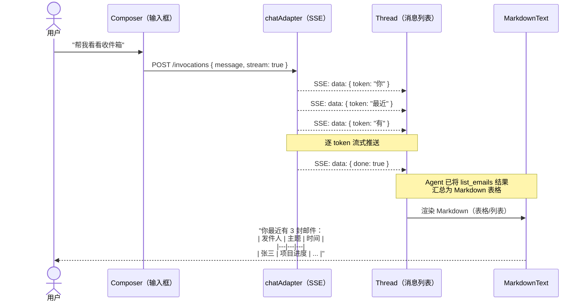
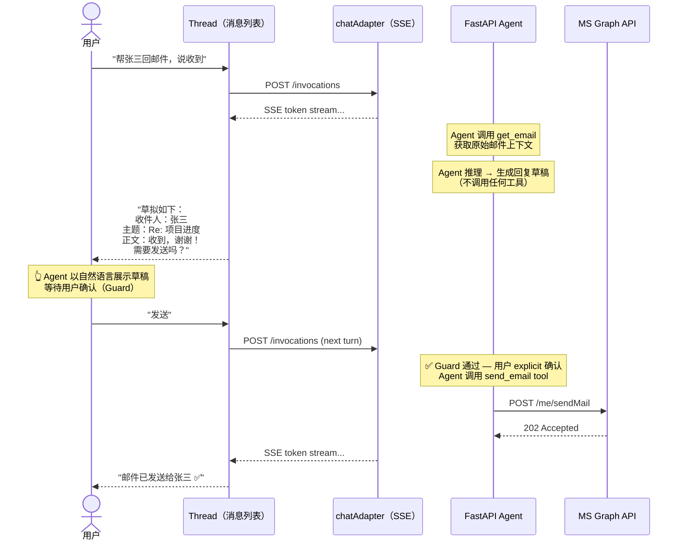
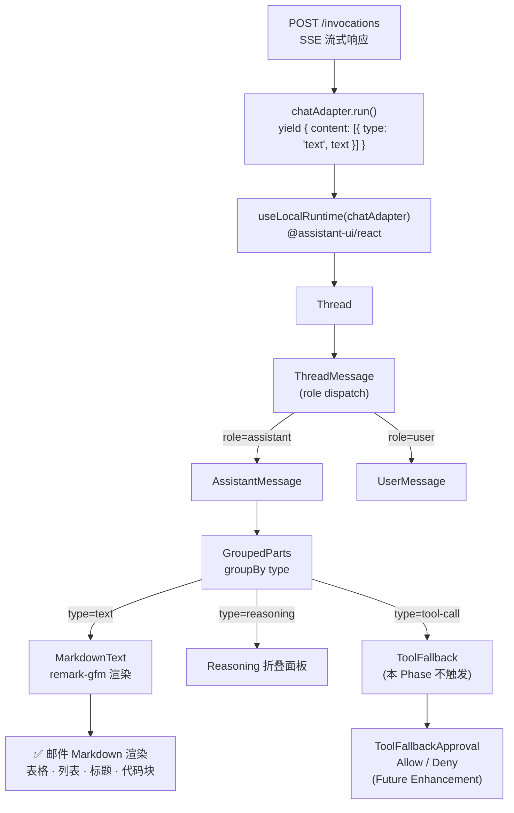
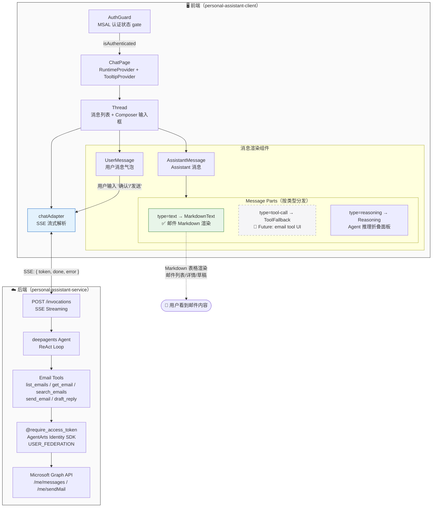

# Client Implementation Plan — Feature 10a: Outbound Email（Microsoft 365 邮件处理）

> 状态：Draft | 目标分支：`feat/feature-10-outbound-email-obs`
>
> 关联架构：`frontend_architecture.md` §2.1 | 关联 service plan：`service-plan.md` §2.5 Guard Mechanism

---

## 变更概述

本 Feature 10a 的邮件工具（`list_emails`、`get_email`、`search_emails`、`send_email`、`draft_reply`）全部在后端 Agent 层实现。前端作为纯消息通道，**不需要任何代码变更**。

核心原因：
- **Guard（二次确认）** 由 Agent system prompt 驱动，以自然语言对话形式实现 —— Agent 先展示邮件预览，等待用户回复"确认"/"发送"后再调用 `send_email`
- **邮件内容渲染** 通过 LLM 生成的 Markdown 文本完成，现有 `MarkdownText` 组件已支持表格、列表、标题等所有需要的格式
- **渠道适配** 明确不涉及（issue 原文："OfficeClaw / 飞书渠道适配（渠道无关，Agent 层复用）"）

本 plan 聚焦于**验证现有前端能力对邮件场景的覆盖度**，并记录 future enhancement 方向。

---

## 1. Client Tasks

### 1.1 新增/修改组件 — 无

**无需新增或修改任何 React 组件。** 现有组件链已验证完整覆盖邮件场景：

| 场景 | 覆盖组件 | 路径 |
|------|---------|------|
| 邮件列表/详情渲染 | `MarkdownText`（Markdown → 表格/列表/标题） | `personal-assistant-client/src/components/assistant-ui/markdown-text.tsx` |
| 邮件草稿预览 | `MarkdownText`（Markdown 纯文本渲染） | 同上 |
| 发送确认（文本对话） | `ChatPage` → `Thread` → `ThreadMessage` → `AssistantMessage` → `MarkdownText` | `personal-assistant-client/src/components/chat/ChatPage.tsx` → `thread.tsx` |
| 用户文本确认输入 | `Thread` → `Composer`（assistant-ui 内建） | assistant-ui 库内建 |
| 写操作 Guard（tool-level interrupt） | `ToolFallback` → `ToolFallbackApproval`（已存在但当前 SSE adapter 不触发） | `personal-assistant-client/src/components/assistant-ui/tool-fallback.tsx` |

**Future Enhancement 预留**（不在本 Phase scope）：
- 若后续版本将 Guard 升级为 tool-level interrupt（`status.type === "requires-action"`），需要扩展 `chat-adapter.ts` 的 SSE 协议以支持 tool-call 事件类型。现有 `ToolFallbackApproval` 组件无需修改即可对接。

### 1.2 状态管理变更 — 无

Zustand `auth-store.ts` 无变更。所有对话状态由 `@assistant-ui/react` 库内管理，无新增状态需求。

### 1.3 路由变更 — 无

无新增路由。邮件对话全部通过现有 `POST /invocations` SSE 流式路由完成。

### 1.4 构建配置变更 — 无

Vite (`vite.config.ts`)、Tailwind CSS、环境变量（`.env`）均无变更。邮件功能不引入新依赖、新资源类型或新环境变量。

---

## 2. API Adaptations

### 2.1 TypeScript Type Sync — 无变更

根据 `service-plan.md` §1.2（OpenAPI Spec 影响）：

> `openapi.json` **无需手动修改** — 本 Feature 不涉及路由层变更。工具函数的 Pydantic schema 由 LangChain `@tool` 装饰器自动生成（argument schema），不暴露在 FastAPI OpenAPI 路径中。

因此 **无需运行 API Type Sync**（`personal-assistant-meta-client-dev` 无任务），现有 TypeScript 类型定义无需更新。

### 2.2 API Client（`chat-adapter.ts`） — 无变更

**文件**：`personal-assistant-client/src/lib/chat-adapter.ts`

当前 SSE 协议（`SSEEvent` with `token` / `done` / `error`）足以支持 Feature 10a 的邮件对话流程：

```
sse-event → adapter → assistant-ui → MarkdownText rendering
  { token: "..." }  → content: [{ type: "text", text: "..." }]  →  Markdown 渲染
```

**不需要**新增 `tool_call` / `tool_result` / `interrupt` SSE event types。原因：

1. **Guard 是 text-based**：Agent 在调用 `send_email` 前，通过在对话中输出自然语言预览来请求确认，用户以文本方式回复"确认"/"发送"
2. **邮件工具结果由 LLM 汇总**：`list_emails` / `get_email` / `search_emails` 返回的 JSON 结果由 Agent（LLM）转换为自然语言回复后流式输出
3. **SSE 流仅承载文本 token**：整个过程不产生 tool-call 类型的 `ChatModelContentPart`

**Future Enhancement 方向**（记录于 §5）：

如果将来需要 tool-level interrupt（`status.type === "requires-action"` 的 `ToolFallbackApproval` 交互），需要在 SSE 协议中扩展以下 event types：

| SSE Event Type | 前端对应处理 |
|---------------|-------------|
| `{ tool_call_start: { id, name, args } }` | `yield { content: [{ type: "tool-call", toolCallId, toolName, args }] }` |
| `{ tool_call_end: { id, result } }` | 对应 tool-call part 的 status 更新 |
| `{ interrupt: { toolCallId, reason } }` | tool-call part status → `"requires-action"`，触发 `ToolFallbackApproval` |

当前 `ToolFallback` 的 `respondToApproval({ approved })` 回调需要后端提供对应的 resume endpoint 或通过现有 SSE 连接回传。此改造涉及前后端协议对齐，不在 Feature 10a scope。

### 2.3 Auth 层 — 无变更

Microsoft Entra ID OAuth（Feature 4）已完成的认证体系无需修改：

- 前端 `chat-adapter.ts` 已在请求 header 中注入 `Authorization: Bearer {idToken}` 和 `X-HW-AgentGateway-User-Id`
- 后端 `@require_access_token` 装饰器通过 `USER_FEDERATION` 模式从 Identity Service 获取 Microsoft Graph access_token
- 前端对 Outbound auth 链路无感知

---

## 3. UI Flow

### 3.1 邮件查询流程（list_emails / search_emails / get_email）



**说明**：
- 用户仅看到 LLM 汇总的 Markdown 文本（含表格、列表等）
- 后端 `list_emails` tool 的原始 JSON 结果不直接暴露给前端
- `MarkdownText` 组件通过 `remark-gfm` 正确渲染 Markdown 表格

### 3.2 邮件发送 + Guard 确认流程（send_email）



**Guard 关键设计**：
- Agent 在 system prompt 中被指示：调用 `send_email` 前必须先展示预览并等待确认
- 确认以**自然对话文本**形式完成（用户输入"发送"/"确认"）
- `send_email` 工具函数本身无 `interrupt()` —— 工具调用发生在用户确认**之后**
- 前端无需额外的 UI popup/dialog 组件

### 3.3 组件层级（邮件场景下的消息渲染路径）



### 3.4 Feature 10b 预留（OBS 文件查询）

Feature 10b（OBS 文件查询）同样采用 text-based 模式，前端无需额外适配。OBS 工具结果由 Agent 汇总为自然语言后以 Markdown 文本输出。

---

## 4. Frontend Test Cases

虽然无需代码变更，但以下 **验证性测试场景** 确保现有前端能力正确覆盖邮件场景。这些测试由 `personal-assistant-e2e-tester` 在 Phase 5（E2E 验证）中执行。

### 4.1 Markdown 渲染验证

| # | 测试场景 | 预期行为 | 验证方式 |
|---|---------|---------|---------|
| TC-MD-01 | Agent 返回含 GFM 表格的邮件列表 | `MarkdownText` 正确渲染 `<table>`，列对齐 | E2E：模拟 SSE 推送含表格 Markdown 的 token 流 |
| TC-MD-02 | Agent 返回含嵌套列表的邮件详情 | `<ul>`/`<ol>` 正确渲染并保留层级 | E2E |
| TC-MD-03 | Agent 返回含 bold/italic 的邮件正文 | `<strong>`/`<em>` 正确渲染 | E2E |
| TC-MD-04 | Agent 返回含 inline code 的邮件内容 | `` <code> `` 正确渲染（`bg-muted/50 rounded-md`） | E2E |

### 4.2 对话流验证

| # | 测试场景 | 预期行为 | 验证方式 |
|---|---------|---------|---------|
| TC-FLOW-01 | 用户输入"帮我看看收件箱" | Agent 返回邮件列表（Markdown 表格），`Composer` 可继续输入 | E2E |
| TC-FLOW-02 | 用户输入"搜索关于项目的邮件" | Agent 返回搜索结果列表 | E2E |
| TC-FLOW-03 | 用户请求回复邮件 → Agent 展示草稿 → 用户输入"发送" | Agent 先展示草稿预览（文本），用户确认后 Agent 执行发送并返回结果 | E2E |
| TC-FLOW-04 | 用户请求回复邮件 → Agent 展示草稿 → 用户输入"取消" | Agent 不执行发送，确认取消 | E2E |
| TC-FLOW-05 | 用户直接说"帮我给 zhangsan@example.com 发邮件说你好" | Agent 先展示预览（收件人、主题、正文），等待确认后才发送 | E2E |
| TC-FLOW-06 | 跨 Session 邮件查询 | 第二次对话无需重新授权，直接查邮件 | E2E |

### 4.3 Auth 验证（无退化）

| # | 测试场景 | 预期行为 | 验证方式 |
|---|---------|---------|---------|
| TC-AUTH-01 | 已认证用户查邮件 | `Authorization: Bearer` header 正确携带 idToken | unit test: `chat-adapter.test.ts` 检查 header |
| TC-AUTH-02 | Token 即将过期时查邮件 | `chat-adapter.ts` 静默刷新 token 后重试 | unit test: mock `isTokenExpiringSoon` |
| TC-AUTH-03 | 未认证用户尝试对话 | 跳转 `LandingPage`（auth guard 拦截） | unit test: `AuthGuard.test.tsx` / E2E |

### 4.4 组件渲染验证（现有组件无退化）

| # | 测试场景 | 组件 | 验证方式 |
|---|---------|------|---------|
| TC-COMP-01 | `AssistantMessage` 渲染带 Markdown 表格的回复 | `thread.tsx` → `MarkdownText` | unit test |
| TC-COMP-02 | `ToolFallback` 在有 tool-call part 时正常渲染（手动注入 mock part） | `tool-fallback.tsx` | unit test（现有测试） |
| TC-COMP-03 | `ToolFallbackApproval` Allow/Deny 按钮交互正常 | `tool-fallback.tsx` | unit test（现有测试） |

### 4.5 现有测试回归

| # | 验证内容 | 命令 |
|---|---------|------|
| TC-REG-01 | 所有现有单元测试继续通过 | `cd personal-assistant-client && npm test` |
| TC-REG-02 | TypeScript 类型检查无新增错误 | `npx tsc --noEmit` |
| TC-REG-03 | Vite build 成功（无新增 chunk 错误） | `npm run build` |
| TC-REG-04 | ESLint 无新增警告 | `npm run lint` |

---

## 5. Mermaid Diagram — 整体邮件对话 UI 流程



**图例**：
- 🟢 绿色 = 当前已覆盖（无变更）
- ⬜ 灰色虚线 = Future Enhancement（不在本 Phase scope）

---

## 6. Implementation Order（如需要）

本 Phase 前端无实现任务。推荐验证顺序（由 `personal-assistant-client-tester` 执行）：

| Step | 操作 | 说明 |
|------|------|------|
| 1 | `npm test` | 确认所有现有测试通过 |
| 2 | `npx tsc --noEmit` | 确认 TypeScript 类型无新增错误 |
| 3 | `npm run build` | 确认 Vite build 无退化 |
| 4 | 启动 dev server + 后端 | 手动验证邮件对话流程（或等 E2E 测试覆盖） |

---

## 7. Risks and Mitigations

| Risk | Impact | Mitigation |
|------|--------|------------|
| Agent 未按 system prompt 展示预览就直接调用 `send_email` | 邮件未经用户确认即发送 | 后端 system prompt 优化 + E2E 严格验证 Guard 行为 |
| Markdown 表格渲染在移动端宽度不足时显示异常 | 邮件列表可读性下降 | `MarkdownText` 的 `aui-md-table` CSS 需确认 overflow-x:auto 生效（已在 thread.tsx `wrap-break-word` 容器内） |
| 长邮件正文（>2000 字符）在 Markdown 中显示不完整 | 用户看不到完整邮件内容 | 后端 Agent 应在 system prompt 中被指导对长邮件做合理截断或分段展示 |
| `ToolFallback` 组件在未来 tool-level interrupt 场景中缺少 resume endpoint | Allow/Deny 按钮点击后无法回传后端 | Future Enhancement 需要前后端协议对齐（见 §2.2） |

---

## 8. 文件变更清单

```
personal-assistant-client/
└── （无变更文件）
```

**文件数量**：新建 0 个，修改 0 个，删除 0 个。
