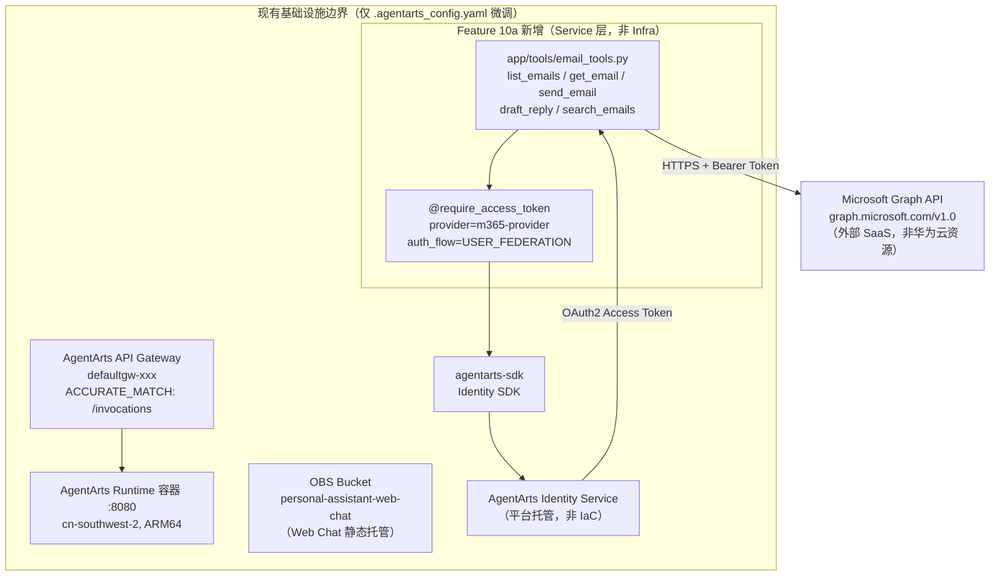

# Infra Plan: Feature 10a — Outbound Email (Microsoft 365)

> 版本：v1.1 | 状态：Final（Panel-Chair 修订） | 关联文档：[issue.md](./issue.md), [overall_architecture.md](../../../architecture/overall_architecture.md), [backend_architecture.md](../../../architecture/backend_architecture.md)

---

## 1. 结论：最小基础设施变更（仅 AgentArts 平台配置层）

**Feature 10a 不涉及任何华为云基础资源变更（OpenTofu/HCL）。`personal-assistant-infra/` 目录无需修改。**

**唯一的变更**：`personal-assistant-service/.agentarts_config.yaml` 中新增 3 个环境变量（`M365_CLIENT_ID`、`M365_CLIENT_SECRET`、`M365_TENANT_ID`），使部署后的 Runtime 容器能够读取 Microsoft 365 OAuth2 凭据。该文件属于 **AgentArts 平台配置层**，不由 OpenTofu/HCL 管理。

---

## 2. 逐资源分析

以下按 `personal-assistant-infra/` 当前管理的资源类型及 IaC 触发场景逐一论证：

| 资源类别 | 是否需要变更 | 理由 |
|----------|:-----------:|------|
| **OBS Bucket** | ❌ | 邮件工具不涉及文件存储。OBS 用于 Web Chat 静态托管（`personal-assistant-web-chat`），已存在且功能不变。邮件附件上传/下载不在 Feature 10a 范围内。 |
| **RDS (PostgreSQL)** | ❌ | 邮件工具使用 Microsoft Graph API 实时查询，无本地持久化需求。`tool_configs` 表如有则可复用，无则本 Phase 不依赖。 |
| **IAM (Agency / Role / Policy)** | ❌ | STS Provider（`require_sts_token`）在 Feature 8 实现，不在 Feature 10a scope 内。 |
| **VPC / Subnet / Security Group** | ❌ | AgentArts Runtime 使用 `PUBLIC` 网络模式，无需 VPC 变更。 |
| **EIP** | ❌ | 无新增公网入口需求。AgentArts Gateway（`defaultgw-xxx`）已提供 `/invocations` 入口。 |
| **CDN** | ❌ | 无静态资源加速需求。 |
| **DNS (Zone / Recordset)** | ❌ | `chat.resource-governance.cloud` CNAME → OBS website endpoint 无变更。 |
| **SWR (组织 / 仓库)** | ❌ | `personal-assistant-org/agent_personal_assistant` 仓库已通过 `agentarts_config.yaml` 管理，不归 IaC 管。 |
| **SSL / TLS 证书** | ❌ | AgentArts Gateway 侧 TLS 由平台自动管理。 |

---

## 3. OAuth2 Credential Provider 说明

`m365-provider` OAuth2 Credential Provider 通过 **AgentArts Identity SDK 程序化创建**（Python 代码），不属于 IaC 管理范畴：

```python
# 该代码在 personal-assistant-service/ 中执行，非 personal-assistant-infra/
from agentarts.sdk import IdentityClient
from agentarts.sdk.identity import OAuth2Vendor

client = IdentityClient(region="cn-southwest-2")
client.create_oauth2_credential_provider(
    name="m365-provider",
    vendor=OAuth2Vendor.MICROSOFTOAUTH2,
    client_id="<azure-app-client-id>",
    client_secret="<azure-app-client-secret>",
    tenant_id="<azure-tenant-id>",
)
```

这属于 **Service 层实现**（`personal-assistant-service/`），由 `personal-assistant-meta-service-planner` 在其 `service-plan.md` 中规划，不由 IaC 管理。

Identity SDK 本身是 `agentarts-sdk` Python 包的一部分，依赖声明在 `pyproject.toml` 中（Service 层变更）。

---

## 4. 基础设施拓扑图

Feature 10a 的邮件工具在现有基础设施边界内运行，仅 `.agentarts_config.yaml` 有微小变更（3 个环境变量），不创建新的华为云资源：



**关键要点**：
- 所有 Feature 10a 新增内容（蓝色区域）位于 **Service 层**，在 AgentArts Runtime 容器内运行
- 虚线外的 `Microsoft Graph API` 是外部 SaaS，无需 IaC
- `AgentArts Identity Service` 是平台托管服务，通过 SDK 调用，不由 IaC 管理
- 图中所有华为云资源（Gateway、OBS）均为存量资源，无需变更

---

## 5. Infrastructure 测试用例

华为云资源层（OpenTofu/HCL）无变更，测试用例聚焦于**验证 IaC 零变更**和**确认 `.agentarts_config.yaml` 环境变量正确注入**：

| ID | 测试项 | 命令 | 预期结果 |
|----|--------|------|----------|
| INFRA-10a-01 | IaC 语法验证（无变更） | `cd personal-assistant-infra && tofu validate` | `Success! The configuration is valid.` |
| INFRA-10a-02 | IaC Plan 零变更 | `cd personal-assistant-infra && tofu plan` | `No changes. Your infrastructure matches the configuration.` |
| INFRA-10a-03 | 资源依赖图无变化 | `cd personal-assistant-infra && tofu graph` | 输出与 main 分支一致 |
| INFRA-10a-04 | HCL 格式化检查 | `cd personal-assistant-infra && tofu fmt -check` | 无格式问题（所有文件 already formatted） |
| INFRA-10a-05 | `.agentarts_config.yaml` 环境变量审核 | 人工审查 | 确认 `runtime.environment_variables` 包含 `M365_CLIENT_ID`、`M365_CLIENT_SECRET`、`M365_TENANT_ID` 三项（值来自 CI/CD secrets，无硬编码明文） |
| INFRA-10a-06 | 容器环境变量注入验证（部署后） | `agentarts invoke '{"message":"check email"}'` | Agent 能成功获取 access token（OAuth2 flow 走通），日志中无 `M365_CLIENT_ID` 等未设置错误 |

> **注意**：`INFRA-10a-02` 若检测到 drift（实际资源与 state 不一致），需先排查是否为 Feature 10a 引入，原则是 IaC state 必须与 Feature 10a 无关。

---

## 6. `.agentarts_config.yaml` 变更

`personal-assistant-service/.agentarts_config.yaml` 属于 AgentArts 平台配置层，由 `agentarts-sdk` / `agentarts` CLI 管理，不属于 `personal-assistant-infra/` IaC 范围。但作为 Infra Planner，仍对以下配置项进行审核：

### 6.1 逐项审核

| 配置项 | 是否需要变更 | 说明 |
|--------|:-----------:|------|
| `runtime.identity_configuration` | ❌ | Inbound JWT + API Key 认证，与 Feature 10a 的 Outbound OAuth2 无关。Outbound Credential Provider 由 SDK 运行时创建，不在此声明。 |
| `runtime.network_config` | ❌ | `PUBLIC` 网络模式，无需变更。 |
| `runtime.environment_variables` | ✅ **需要变更** | 新增 3 个 M365 凭据环境变量（见 §6.2）。 |
| `agents.personal-assistant.swr_config` | ❌ | SWR 仓库无变更。 |
| `agents.personal-assistant.base` | ❌ | 基础镜像、平台架构无变更。 |

### 6.2 新增环境变量

`m365-provider` OAuth2 Credential Provider 在服务启动时通过 AgentArts Identity SDK 程序化创建，需要 `client_id`、`client_secret`、`tenant_id` 三个参数。这些参数**不能硬编码**在代码中，必须通过环境变量注入到 Runtime 容器：

```yaml
runtime:
  environment_variables:
    # ... 现有变量 MAAS_API_KEY, DEEPSEEK_API_KEY, MEMORY_SPACE_ID 保留不变 ...
    - key: M365_CLIENT_ID
      value: "${M365_CLIENT_ID}"
    - key: M365_CLIENT_SECRET
      value: "${M365_CLIENT_SECRET}"
    - key: M365_TENANT_ID
      value: "${M365_TENANT_ID}"
```

> **⚠️ 安全约束**：
> - `${M365_CLIENT_ID}` 等占位符表示该值从 CI/CD secrets 系统或手动 `agentarts config set` 注入，**禁止**将明文 secret 直接写入 `agentarts_config.yaml`。
> - `M365_CLIENT_SECRET` 为高敏感凭据，只应存在于 CI/CD secret store（如 GitHub Secrets、华为云 Secret Manager）中。
> - 生产部署时，通过 `agentarts launch --set-env M365_CLIENT_ID=...` 或 CI 中的环境变量注入。
> - 本地开发时，通过 `agentarts config set runtime.environment_variables.M365_CLIENT_ID <value>` 设置。

### 6.3 Service 层消费方式

容器运行时读取环境变量，在 `app/tools/email_tools.py` 或初始化模块中用于创建 `m365-provider`：

```python
import os
from agentarts.sdk import IdentityClient
from agentarts.sdk.identity import OAuth2Vendor

client = IdentityClient(region="cn-southwest-2")
client.create_oauth2_credential_provider(
    name="m365-provider",
    vendor=OAuth2Vendor.MICROSOFTOAUTH2,
    client_id=os.environ["M365_CLIENT_ID"],
    client_secret=os.environ["M365_CLIENT_SECRET"],
    tenant_id=os.environ["M365_TENANT_ID"],
)
```

> 该初始化逻辑的具体位置由 `service-plan.md` 指定，infra-plan 仅负责确保环境变量注入通道正确。**环境变量为空时服务不应静默失败** —— 需在启动时做 `env` 存在性检查并 fail-fast。

---

## 7. 检查清单

- [x] OBS Bucket — 无需变更
- [x] RDS — 无需变更
- [x] IAM — 无需变更
- [x] VPC — 无需变更
- [x] EIP — 无需变更
- [x] CDN — 无需变更
- [x] DNS — 无需变更
- [x] SWR — 无需变更
- [x] SSL/TLS — 无需变更
- [ ] `.agentarts_config.yaml` — **需要变更**：新增 `M365_CLIENT_ID`、`M365_CLIENT_SECRET`、`M365_TENANT_ID` 三个环境变量（值来自 CI/CD secrets）
- [x] `m365-provider` OAuth2 Provider — Service 层（SDK 创建，非 IaC）
- [x] `agentarts-sdk` 依赖 — Service 层（`pyproject.toml`，非 IaC）

---

## 8. 总结

Feature 10a 是一个**以 Service 层为主、AgentArts 平台配置层微调**的变更。所有邮件处理逻辑在 AgentArts Runtime 容器内实现，通过 `agentarts-sdk` 的 Identity SDK 与外部 Microsoft Graph API 交互。

**基础设施变更范围**：

| 层 | 有变更？ | 具体内容 |
|----|:-------:|----------|
| **华为云资源层**（OpenTofu/HCL → `personal-assistant-infra/`） | ❌ 无 | 无新增 OBS/RDS/IAM/VPC/EIP/CDN/DNS/SWR/SSL 资源 |
| **AgentArts 平台配置层**（`.agentarts_config.yaml`） | ✅ 有 | 新增 3 个环境变量：`M365_CLIENT_ID`、`M365_CLIENT_SECRET`、`M365_TENANT_ID`，值来自 CI/CD secrets |
| **Service 代码层**（`personal-assistant-service/`） | ✅ 有 | 由 `service-plan.md` 规划，infra-plan 不覆盖 |

`personal-assistant-infra-dev` 在本 Phase 的职责：
1. 验证 `tofu plan` 报告零变更（确认华为云资源层无 drift）
2. 审核 `.agentarts_config.yaml` 中环境变量配置的正确性和安全性（无硬编码明文 secret）
3. 确认环境变量注入通道（CI/CD secrets → `agentarts launch` → Runtime 容器）可正常工作
