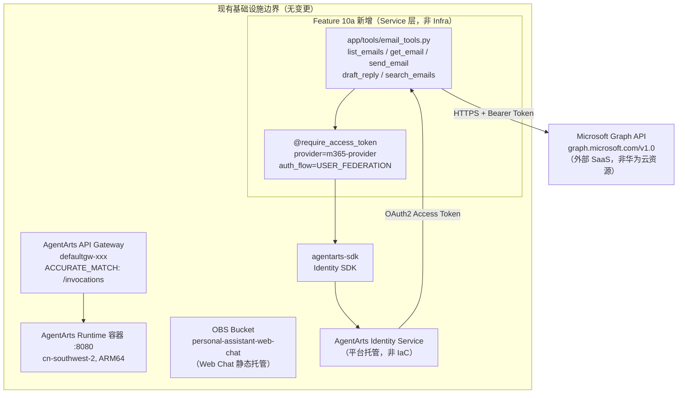

# Infra Plan: Feature 10a — Outbound Email (Microsoft 365)

> 版本：v1.0 | 状态：Final | 关联文档：[issue.md](./issue.md), [overall_architecture.md](../../../architecture/overall_architecture.md), [backend_architecture.md](../../../architecture/backend_architecture.md)

---

## 1. 结论：无需基础设施变更

**Feature 10a 不涉及任何华为云基础资源变更。`personal-assistant-infra/` 目录无需任何修改。**

---

## 2. 逐资源分析

以下按 `personal-assistant-infra/` 当前管理的资源类型及 IaC 触发场景逐一论证：

| 资源类别 | 是否需要变更 | 理由 |
|----------|:-----------:|------|
| **OBS Bucket** | ❌ | 邮件工具不涉及文件存储。OBS 用于 Web Chat 静态托管（`personal-assistant-web-chat`），已存在且功能不变。邮件附件上传/下载不在 Feature 10a 范围内。 |
| **RDS (PostgreSQL)** | ❌ | 邮件工具使用 Microsoft Graph API 实时查询，无本地持久化需求。`tool_configs` 表如有则可复用，无则本 Phase 不依赖。 |
| **IAM (Agency / Role / Policy)** | ❌ | STS Provider（`require_sts_token`）在 Feature 8 实现，不在 Feature 10a scope 内。 |
| **VPC / Subnet / Security Group** | ❌ | AgentArts Runtime 使用 `PUBLIC` 网络模式，无需 VPC 变更。 |
| **EIP** | ❌ | 无新增公网入口需求。AgentArts Gateway（`defaultgw-xxx`）已提供 `/invocations` 入口。 |
| **CDN** | ❌ | 无静态资源加速需求。 |
| **DNS (Zone / Recordset)** | ❌ | `chat.resource-governance.cloud` CNAME → OBS website endpoint 无变更。 |
| **SWR (组织 / 仓库)** | ❌ | `personal-assistant-org/agent_personal_assistant` 仓库已通过 `agentarts_config.yaml` 管理，不归 IaC 管。 |
| **SSL / TLS 证书** | ❌ | AgentArts Gateway 侧 TLS 由平台自动管理。 |

---

## 3. OAuth2 Credential Provider 说明

`m365-provider` OAuth2 Credential Provider 通过 **AgentArts Identity SDK 程序化创建**（Python 代码），不属于 IaC 管理范畴：

```python
# 该代码在 personal-assistant-service/ 中执行，非 personal-assistant-infra/
from agentarts.sdk import IdentityClient
from agentarts.sdk.identity import OAuth2Vendor

client = IdentityClient(region="cn-southwest-2")
client.create_oauth2_credential_provider(
    name="m365-provider",
    vendor=OAuth2Vendor.MICROSOFTOAUTH2,
    client_id="<azure-app-client-id>",
    client_secret="<azure-app-client-secret>",
    tenant_id="<azure-tenant-id>",
)
```

这属于 **Service 层实现**（`personal-assistant-service/`），由 `personal-assistant-meta-service-planner` 在其 `service-plan.md` 中规划，不由 IaC 管理。

Identity SDK 本身是 `agentarts-sdk` Python 包的一部分，依赖声明在 `pyproject.toml` 中（Service 层变更）。

---

## 4. 基础设施拓扑图

Feature 10a 的邮件工具完全在现有基础设施边界内运行，不创建新资源：



**关键要点**：
- 所有 Feature 10a 新增内容（蓝色区域）位于 **Service 层**，在 AgentArts Runtime 容器内运行
- 虚线外的 `Microsoft Graph API` 是外部 SaaS，无需 IaC
- `AgentArts Identity Service` 是平台托管服务，通过 SDK 调用，不由 IaC 管理
- 图中所有华为云资源（Gateway、OBS）均为存量资源，无需变更

---

## 5. Infrastructure 测试用例

由于无 IaC 变更，测试用例聚焦于**验证无变更**和**确认现有资源不受影响**：

| ID | 测试项 | 命令 | 预期结果 |
|----|--------|------|----------|
| INFRA-10a-01 | IaC 语法验证（无变更） | `cd personal-assistant-infra && tofu validate` | `Success! The configuration is valid.` |
| INFRA-10a-02 | IaC Plan 零变更 | `cd personal-assistant-infra && tofu plan` | `No changes. Your infrastructure matches the configuration.` |
| INFRA-10a-03 | 资源依赖图无变化 | `cd personal-assistant-infra && tofu graph` | 输出与 main 分支一致 |
| INFRA-10a-04 | HCL 格式化检查 | `cd personal-assistant-infra && tofu fmt -check` | 无格式问题（所有文件 already formatted） |
| INFRA-10a-05 | `.agentarts_config.yaml` 审核 | 人工审查 | `m365-provider` 不在配置中声明（由 SDK 运行时创建），其他配置无变更 |

> **注意**：`INFRA-10a-02` 若检测到 drift（实际资源与 state 不一致），需先排查是否为 Feature 10a 引入，原则是 IaC state 必须与 Feature 10a 无关。

---

## 6. `.agentarts_config.yaml` 审核

`personal-assistant-service/.agentarts_config.yaml` 属于 AgentArts 层配置，由 `agentarts-sdk` / `agentarts` CLI 管理，不属于 `personal-assistant-infra/` IaC 范围。但作为 Infra Planner，仍对以下配置项进行审核：

| 配置项 | 是否需要变更 | 说明 |
|--------|:-----------:|------|
| `runtime.identity_configuration` | ❌ | Inbound JWT + API Key 认证，与 Feature 10a 的 Outbound OAuth2 无关。Outbound Credential Provider 由 SDK 运行时创建，不在此声明。 |
| `runtime.network_config` | ❌ | `PUBLIC` 网络模式，无需变更。 |
| `runtime.environment_variables` | ❌ | `MAAS_API_KEY`、`DEEPSEEK_API_KEY`、`MEMORY_SPACE_ID` 均无变更。`m365-provider` 的 `client_id` / `client_secret` / `tenant_id` 通过 SDK 调用传入，不适合写入环境变量（Secret 应由 Azure Portal 生成后在初始化脚本中使用）。 |
| `agents.personal-assistant.swr_config` | ❌ | SWR 仓库无变更。 |
| `agents.personal-assistant.base` | ❌ | 基础镜像、平台架构无变更。 |

---

## 7. 检查清单

- [x] OBS Bucket — 无需变更
- [x] RDS — 无需变更
- [x] IAM — 无需变更
- [x] VPC — 无需变更
- [x] EIP — 无需变更
- [x] CDN — 无需变更
- [x] DNS — 无需变更
- [x] SWR — 无需变更
- [x] SSL/TLS — 无需变更
- [x] `.agentarts_config.yaml` — 无需变更
- [x] `m365-provider` OAuth2 Provider — Service 层（SDK 创建，非 IaC）
- [x] `agentarts-sdk` 依赖 — Service 层（`pyproject.toml`，非 IaC）

---

## 8. 总结

Feature 10a 是一个**纯 Service 层**的变更。所有邮件处理逻辑在 AgentArts Runtime 容器内实现，通过 `agentarts-sdk` 的 Identity SDK 与外部 Microsoft Graph API 交互。整个功能边界完全落在现有基础设施之内，无需申请新的华为云资源配额、无需修改任何 OpenTofu/HCL 文件、无需变更网络拓扑或安全策略。

`personal-assistant-infra-dev` 在本 Phase 无需执行任何操作。验证通过 `tofu plan` 确认零变更即可。
