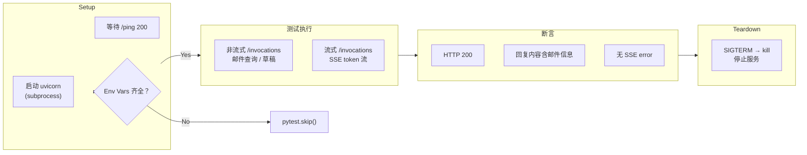
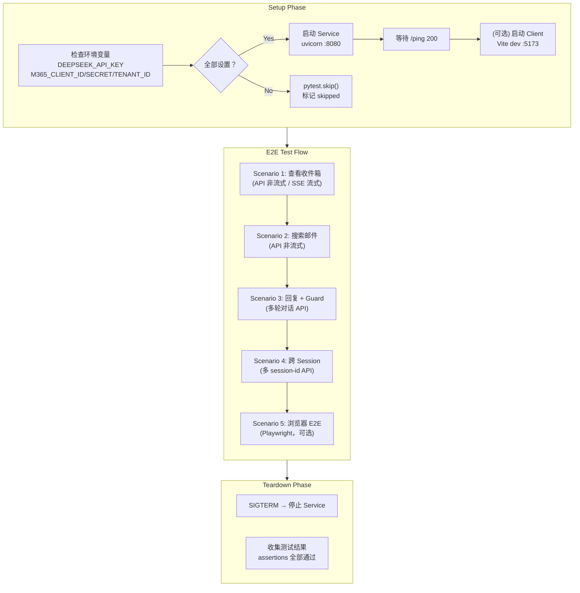
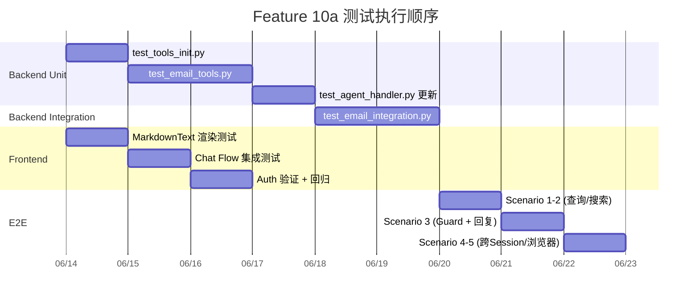

# Test Plan — Feature 10a: Outbound Email（Microsoft 365 邮件处理）

> 状态：Draft | 目标分支：`feat/feature-10-outbound-email-obs`
>
> 关联文档：`service-plan.md` §2.6, `client-plan.md` §4, `issue.md` §10a.5

---

## 变更概述

本 Test Plan 覆盖 Feature 10a 的三层测试：

| 层级 | 范围 | 测试文件位置 | 计数 |
|------|------|-------------|------|
| **Backend Unit** | 5 个邮件工具函数 + `build_tools()` 工厂 + `AgentHandler` 集成 | `personal-assistant-service/tests/` | ~23 |
| **Backend Integration** | `/invocations` 端点调用流程、Guard 确认流 | `personal-assistant-service/tests/` | ~8 |
| **Client** | Markdown 渲染验证、对话流验证、Auth 无退化验证 | `personal-assistant-client/src/` | ~12 |
| **E2E** | 端到端对话、Guard 确认、跨 Session 验证 | `personal-assistant-e2e/tests/features/` | ~10 |
| **回归** | 确保现有功能无退化 | 现有测试套件 | — |

---

## 1. Backend Unit Tests

> 基于 `service-plan.md` §2.6 设计。Mock `httpx.AsyncClient`、`@require_access_token` 装饰器、`IdentityClient`。

### 1.1 新增文件：`tests/test_tools_init.py`

测试 `app/tools/__init__.py` 中的 `build_tools()` 工厂函数。

| # | 测试函数 | 场景 | 预期行为 | Mock 策略 |
|---|---------|------|---------|----------|
| UT-TI-01 | `test_build_tools_returns_list` | 调用 `build_tools()` | 返回 `list` 类型 | 确保 `email_tools` 可正常 import |
| UT-TI-02 | `test_build_tools_includes_email_tools` | 验证 EMAIL_TOOLS 中的 5 个函数都在返回列表中 | 列表包含 `list_emails`, `get_email`, `search_emails`, `send_email`, `reply_to_email` | patch `_ensure_provider` 避免真实 IdentityClient 调用 |
| UT-TI-03 | `test_build_tools_graceful_import_error` | 模拟 `email_tools` 模块 import 失败 | `build_tools()` 不抛异常，返回空列表或仅含其他模块工具 | 使用 `patch.dict(sys.modules, {"app.tools.email_tools": None})` 模拟导入失败 |
| UT-TI-04 | `test_build_tools_deduplicates` | 同一工具模块被多次 import 不会导致工具重复 | 每个函数只在列表中出现一次 | 正常 import 路径 |

### 1.2 新增文件：`tests/test_email_tools.py`

测试 `app/tools/email_tools.py` 中的 5 个工具函数 + Provider 初始化逻辑。

#### 1.2.1 Mock 策略

```python
# 共享 fixture：passthrough require_access_token 装饰器
@pytest.fixture(autouse=True)
def mock_require_access_token():
    """将 @require_access_token 替换为 passthrough — 原样返回被装饰函数。
    access_token 参数由测试显式传入。"""
    with patch("app.tools.email_tools.require_access_token",
               lambda **kw: lambda fn: fn):
        yield

# 共享 fixture：mock IdentityClient（避免真实 AgentArts 调用）
@pytest.fixture(autouse=True)
def mock_identity_client():
    with patch("app.tools.email_tools.IdentityClient") as mock:
        yield mock
```

**`httpx.AsyncClient` mock**：每个测试独立 `patch("httpx.AsyncClient")`，返回 `AsyncMock`，预定义 Graph API JSON 响应。

#### 1.2.2 `list_emails` 测试

| # | 测试函数 | 场景 | 输入 | Mock Graph API 响应 | 预期输出 |
|---|---------|------|------|---------------------|---------|
| UT-LE-01 | `test_list_emails_returns_formatted_list` | 正常返回收件箱邮件列表 | `folder="inbox", limit=10, access_token="mock_token"` | `200 OK: {"value": [{"id": "msg-1", "subject": "Hello", "from": {"emailAddress": {"name": "Alice"}}, "receivedDateTime": "2026-06-14T10:00:00Z", "isRead": false, "importance": "normal", "bodyPreview": "Hi there"}]}` | `{"emails": [{...}], "count": 1, "folder": "inbox"}` |
| UT-LE-02 | `test_list_emails_default_folder_inbox` | 不传 folder 参数 | `access_token="mock_token"` 或仅 `limit` | 同上，URL 路径含 `mailFolders/inbox/messages` | URL 路径默认使用 `inbox` |
| UT-LE-03 | `test_list_emails_custom_folder` | 传入 `folder="sentitems"` | `folder="sentitems"` | mock 响应，验证 URL | URL 路径含 `mailFolders/sentitems/messages` |
| UT-LE-04 | `test_list_emails_limit_parameter` | `limit=5` | `limit=5` | 验证 `$top` 查询参数 | Graph API 请求 `params["$top"] == 5` |
| UT-LE-05 | `test_list_emails_empty_inbox` | 空收件箱 | 同 UT-LE-01 | `200 OK: {"value": []}` | `{"emails": [], "count": 0, "folder": "inbox"}` |
| UT-LE-06 | `test_list_emails_http_error` | Graph API 返回 500 | 同上 | 模拟 `httpx.HTTPStatusError` (500) | 异常 propagate，不捕获 |

#### 1.2.3 `get_email` 测试

| # | 测试函数 | 场景 | 输入 | Mock Graph API 响应 | 预期输出 |
|---|---------|------|------|---------------------|---------|
| UT-GE-01 | `test_get_email_returns_full_detail` | 获取邮件完整详情 | `email_id="msg-1", access_token="mock_token"` | `200 OK: {"id": "msg-1", "subject": "Hello", "body": {"content": "Hi there"}, "from": {"emailAddress": {"name": "Alice", "address": "alice@example.com"}}, "toRecipients": [{"emailAddress": {"name": "Bob", "address": "bob@example.com"}}], "ccRecipients": [], "receivedDateTime": "2026-06-14T10:00:00Z", "hasAttachments": false}` | `{"id": "msg-1", "subject": "Hello", "body": "Hi there", "from": {...}, "toRecipients": [...], "ccRecipients": [], "receivedDateTime": "...", "attachments": []}` |
| UT-GE-02 | `test_get_email_with_attachments` | 邮件包含附件 | 同上 | `hasAttachments: true, attachments: [{"name": "report.pdf", "size": 1024, "contentType": "application/pdf"}]` | `attachments` 非空列表，含 name/size/contentType |
| UT-GE-03 | `test_get_email_without_attachments` | 邮件无附件 | 同上 | `hasAttachments: false, attachments: []` | `attachments` 为空列表 `[]` |
| UT-GE-04 | `test_get_email_not_found` | 邮件 ID 不存在 | `email_id="invalid-id"` | 模拟 `httpx.HTTPStatusError` (404) | 异常 propagate |

#### 1.2.4 `search_emails` 测试

| # | 测试函数 | 场景 | 输入 | Mock Graph API 响应 | 预期输出 |
|---|---------|------|------|---------------------|---------|
| UT-SE-01 | `test_search_emails_returns_results` | 正常搜索返回结果 | `query="project", access_token="mock_token"` | `200 OK: {"value": [{"id": "msg-2", "subject": "Project Update", "from": {...}, "receivedDateTime": "...", "isRead": false, "bodyPreview": "..."}]}` | `{"results": [{...}], "count": 1, "query": "project"}` |
| UT-SE-02 | `test_search_emails_empty_results` | 无匹配结果 | `query="nonexistent"` | `200 OK: {"value": []}` | `{"results": [], "count": 0, "query": "nonexistent"}` |
| UT-SE-03 | `test_search_emails_uses_search_param` | 验证 `$search` 参数正确传递 | `query="hello world"` | mock 请求捕获 | Graph API 请求 `params["$search"] == '"hello world"'` |
| UT-SE-04 | `test_search_emails_limit_parameter` | `limit=20` | `limit=20` | mock 请求捕获 | Graph API 请求 `params["$top"] == 20` |
| UT-SE-05 | `test_search_emails_http_error` | Graph API 返回 4xx | 同上 | 模拟 `httpx.HTTPStatusError` (400) | 异常 propagate |

#### 1.2.5 `send_email` 测试

| # | 测试函数 | 场景 | 输入 | Mock Graph API 响应 | 预期输出 |
|---|---------|------|------|---------------------|---------|
| UT-SND-01 | `test_send_email_success` | 发送成功 | `to=["bob@example.com"], subject="Hello", body="Hi"` | `202 Accepted` | `{"sent": True, "message_id": None, "error": None}` |
| UT-SND-02 | `test_send_email_with_cc` | 含 cc 收件人 | `to=["bob@example.com"], subject="Hello", body="Hi", cc=["cc@example.com"]` | `202 Accepted`，验证 request body 含 `ccRecipients` | `{"sent": True, ...}`，request body `ccRecipients: [{"emailAddress": {"address": "cc@example.com"}}]` |
| UT-SND-03 | `test_send_email_failure` | 发送失败（如权限不足） | 同上 | `403 Forbidden`，非 202 | `{"sent": False, "message_id": None, "error": ...}` |
| UT-SND-04 | `test_send_email_formats_recipients` | 验证 `to` 数组格式化为 `emailAddress` 结构 | `to=["a@x.com", "b@x.com"], cc=["c@x.com"]` | `202 Accepted`，验证 request body | `toRecipients: [{emailAddress: {address: "a@x.com"}}, {emailAddress: {address: "b@x.com"}}]`, `ccRecipients` 同理 |
| UT-SND-05 | `test_send_email_save_to_sent_items` | 验证 `saveToSentItems: true` | 基本参数 | `202 Accepted` | request body `"saveToSentItems": true` |
| UT-SND-06 | `test_send_email_content_type_text` | 验证邮件正文 contentType 为 Text | `body="plain text"` | `202 Accepted` | request body `"body": {"contentType": "Text", "content": "plain text"}` |

#### 1.2.6 `reply_to_email` 测试

> **注意**：`reply_to_email` 使用 `POST /me/messages/{id}/reply` 直接发送回复（不再创建草稿），调用前必须经过 Guard 确认。返回 `{sent: True}` on 202。

| # | 测试函数 | 场景 | 输入 | Mock Graph API 响应 | 预期输出 |
|---|---------|------|------|---------------------|---------|
| UT-RE-01 | `test_reply_to_email_success` | 回复发送成功 | `email_id="msg-1", body="Thanks", access_token="mock_token"` | `202 Accepted` | `{"sent": True, "error": None}` |
| UT-RE-02 | `test_reply_to_email_failure` | 回复发送失败（如权限不足） | 同上 | `403 Forbidden`，非 202 | `{"sent": False, "error": "..."}` |
| UT-RE-03 | `test_reply_to_email_calls_reply_endpoint` | 验证调用 `POST /messages/{id}/reply` 端点，request body 含 `message.body` 富文本结构 | `email_id="msg-1", body="Thanks"` | `202 Accepted`，验证 request body | URL 为 `/me/messages/msg-1/reply`，request body `{"message": {"body": {"contentType": "Text", "content": "Thanks"}}}` |
| UT-RE-04 | `test_reply_to_email_no_access_token` | access_token 为 None | `access_token=None` | 预期 Bearer header 为 `Bearer None`（装饰器 passthrough 后显式传入） | 可调用（Bearer None），由 Graph API 返回 401 |
| UT-RE-05 | `test_reply_to_email_formats_body` | 验证 `body` 参数被正确包装为 `message.body` 富文本结构 | `body="Hello world"` | `202 Accepted`，验证 request body | `json={"message": {"body": {"contentType": "Text", "content": "Hello world"}}}`，`contentType` 固定为 `"Text"` |

#### 1.2.7 Provider 初始化测试（惰性 `_ensure_provider()`）

> **注意**：`_ensure_provider()` 在首个工具函数被调用时惰性执行，非模块 import 时。Provider 创建依赖 AgentArts Identity Service，测试中必须 mock `IdentityClient`。`_PROVIDER_INITIALIZED` flag 确保全进程生命周期只初始化一次。

| # | 测试函数 | 场景 | 环境变量 | Mock | 预期行为 |
|---|---------|------|---------|------|---------|
| UT-PI-01 | `test_provider_init_skips_if_env_vars_missing` | M365_CLIENT_ID 未设置 | 清空 M365_CLIENT_ID, M365_CLIENT_SECRET, M365_TENANT_ID | mock `IdentityClient`，验证 **不** 调用 `create_oauth2_credential_provider` | 不抛异常，仅 `logger.warning` |
| UT-PI-02 | `test_provider_init_with_valid_env` | 环境变量齐全 | 设置全部三个 env var | mock `IdentityClient`，验证调用 `create_oauth2_credential_provider` | 调用 `create_oauth2_credential_provider(name="m365-provider", vendor=OAuth2Vendor.MICROSOFTOAUTH2, ...)` |
| UT-PI-03 | `test_provider_only_initialized_once` | 多次调用 `_ensure_provider()` 只创建一次 provider | 设置 env var | mock IdentityClient，`_ensure_provider()` 两次调用 | `create_oauth2_credential_provider` 仅调用一次 |
| UT-PI-04 | `test_provider_init_handles_identity_client_error` | IdentityClient 抛出异常 | 设置 env var | mock `IdentityClient` 侧抛 `Exception("connection refused")` | 捕获异常，`logger.error`，`_PROVIDER_INITIALIZED = True` |

### 1.3 修改文件：`tests/test_agent_handler.py`

在现有测试文件中新增 3 个测试用例（标记 Feature 10a）。

| # | 测试函数 | 场景 | 预期行为 | 备注 |
|---|---------|------|---------|------|
| UT-AH-01 | `test_agent_created_with_tools_from_build_tools` | Agent 初始化时 tools 不为空 | `create_deep_agent` 的 `tools` kwarg 通过 `build_tools()` 构建，不为空列表 | 需 mock `build_tools()` 返回包含工具函数的列表 |
| UT-AH-02 | `test_system_prompt_mentions_email_capabilities` | SYSTEM_PROMPT 包含邮件能力描述 | `SYSTEM_PROMPT` 字符串包含 `list_emails`, `send_email`, `reply_to_email`, `search_emails`, `get_email` 关键词 | 静态字符串断言 |
| UT-AH-03 | `test_system_prompt_contains_guard_instruction` | SYSTEM_PROMPT 包含 Guard 安全说明 | `SYSTEM_PROMPT` 包含 "explicit 确认"、"展示预览"、"必须先确认" 等 Guard 相关措辞 | 确保 Agent 知道发送邮件需二次确认 |

**同时修改现有测试**：`test_initializes_with_correct_model_config`（`test_agent_handler.py:36`）当前断言 `tools == []`，需更新为验证 `tools` 调用了 `build_tools()` 的结果。

---

## 2. Backend Integration Tests

> 集成测试通过真实 HTTP 请求调用 `/invocations` 端点，验证邮件工具在 Agent ReAct loop 中的端到端行为。需真实 LLM API Key（`DEEPSEEK_API_KEY` 或 `MAAS_API_KEY`），无则跳过。

### 2.1 新增文件：`tests/test_email_integration.py`

| # | 测试函数 | 场景 | 请求 | 预期行为 | Marker |
|---|---------|------|------|---------|--------|
| IT-01 | `test_invocation_list_inbox` | 用户查询收件箱 → Agent 调用 `list_emails` | `POST /invocations {"message": "帮我看看收件箱", "stream": false}` | 返回自然语言回复，提及收件箱中的邮件（发件人、主题），响应 status 200 | `@pytest.mark.slow` |
| IT-02 | `test_invocation_search_emails` | 用户搜索邮件 → Agent 调用 `search_emails` | `POST /invocations {"message": "搜索关于项目的邮件", "stream": false}` | 返回搜索结果汇总，提及匹配的邮件 | `@pytest.mark.slow` |
| IT-03 | `test_invocation_get_email_detail` | 用户查看某封邮件详情 → Agent 调用 `get_email` | `POST /invocations {"message": "帮我看一下最近一封邮件的详细内容", "stream": false}` | 返回邮件正文内容、发件人等详情 | `@pytest.mark.slow` |
| IT-04 | `test_invocation_reply_to_email_flow` | 用户请求回复邮件 → Agent 调用 `get_email` 获取上下文 → 生成回复预览 | `POST /invocations {"message": "帮我回张三的邮件说收到", "stream": false}` | Agent 先返回回复预览（含收件人、主题、正文），不直接调用 `reply_to_email` | `@pytest.mark.slow` |
| IT-05 | `test_invocation_guard_confirm_send` | 回复预览展示后用户确认发送 → Agent 调用 `reply_to_email` | 第一轮：请求回复 → 获取预览。第二轮：`"发送"` | 第二轮返回 "邮件已回复" 或类似确认消息 | `@pytest.mark.slow` |
| IT-06 | `test_invocation_guard_cancel` | 回复预览展示后用户取消 → Agent 不调用 `reply_to_email` | 第一轮：请求回复 → 获取预览。第二轮：`"取消"` | Agent 确认取消，不调用 `reply_to_email` | `@pytest.mark.slow` |
| IT-07 | `test_invocation_direct_send_with_preview` | 用户直接说 "帮 zhangsan@example.com 发邮件说你好" | `POST /invocations {"message": "帮zhangsan@example.com发邮件说你好"}` | Agent 先展示预览（收件人、主题、正文），等待确认 | `@pytest.mark.slow` |
| IT-08 | `test_invocation_unauthorized_no_token` | 未设置 M365 env var 时调用邮件功能 | `POST /invocations {"message": "帮我看看收件箱"}` | Agent 坦诚回复无法访问邮件，不抛 500 | `@pytest.mark.slow` |

### 2.2 集成测试环境要求

| 变量 | 用途 | 必填 |
|------|------|------|
| `DEEPSEEK_API_KEY` 或 `MAAS_API_KEY` | LLM API Key | ✅ |
| `M365_CLIENT_ID` | Microsoft Entra ID Client ID（集成测试真实场景） | 集成测试 ✅ / 单元测试 ❌ |
| `M365_CLIENT_SECRET` | Microsoft Entra ID Client Secret | 集成测试 ✅ |
| `M365_TENANT_ID` | Azure AD Tenant ID | 集成测试 ✅ |
| `POSTGRES_DSN` 或 `SQLITE_DB_PATH` | Checkpointer 后端（可选，默认 MemorySaver） | ❌ |

### 2.3 集成测试流程



---

## 3. Client Tests

> 基于 `client-plan.md` §4 设计。前端无代码变更，本节为**验证性测试** — 确保现有组件能力正确覆盖邮件场景。

### 3.1 Markdown 渲染验证

> 文件位置：`personal-assistant-client/src/components/assistant-ui/__tests__/markdown-text.test.tsx`（如已存在则追加；否则新建）

| # | 测试函数 | 场景 | 输入 Markdown | 预期渲染 |
|---|---------|------|--------------|---------|
| CT-MD-01 | `test_renders_gfm_table` | Agent 返回含 GFM 表格的邮件列表 | `\n\| 发件人 \| 主题 \| 时间 \|\n\|------\|------\|------\|\n\| 张三 \| 项目进度 \| 2026-06-14 \|\n` | 渲染为 `<table>` 元素，含 `<thead>` 和 `<tbody>`，列对齐 |
| CT-MD-02 | `test_renders_nested_list` | Agent 返回含嵌套列表的邮件详情 | `- 邮件详情\n  - 发件人: 张三\n  - 正文摘要\n` | 渲染为 `<ul>` → `<li>` → 嵌套 `<ul>` |
| CT-MD-03 | `test_renders_bold_and_italic` | Agent 返回含强调格式的邮件正文 | `**重要** 和 *注意*` | 渲染 `<strong>重要</strong>` 和 `<em>注意</em>` |
| CT-MD-04 | `test_renders_inline_code` | Agent 返回含 inline code 的邮件内容 | `` 订单号 `ORD-12345` `` | `` <code>ORD-12345</code> `` 带 `bg-muted/50 rounded-md` 样式 |
| CT-MD-05 | `test_renders_long_email_body` | 长邮件正文（>2000 字符） | `"正文内容".repeat(500)` | 完整渲染，不截断，不溢出容器（`overflow-x:auto` / `wrap-break-word`） |

### 3.2 对话流验证（组件集成）

> 文件位置：`personal-assistant-client/src/components/chat/__tests__/chat-flow.test.tsx`（或追加到现有 ChatPage 测试）

| # | 测试函数 | 场景 | 模拟行为 | 预期结果 |
|---|---------|------|---------|---------|
| CT-FLOW-01 | `test_user_message_appears_in_thread` | 用户输入文本消息 | 输入 "帮我看看收件箱" → 提交 | `UserMessage` 气泡显示 "帮我看看收件箱" |
| CT-FLOW-02 | `test_assistant_markdown_response_renders` | Assistant 返回 Markdown 格式邮件列表 | mock SSE adapter 推送含表格 Markdown 的 token 流 | `AssistantMessage` → `MarkdownText` 正确渲染表格 |
| CT-FLOW-03 | `test_message_sequence_preserves_order` | 用户 → Assistant → 用户 → Assistant 多轮对话 | 两轮对话 | 消息按时间顺序排列，角色正确切换 |
| CT-FLOW-04 | `test_composer_enabled_after_response` | Agent 回复完成后输入框可用 | mock 完整 SSE 流（含 `done: true`） | `Composer` 输入框 enabled，可继续输入 |
| CT-FLOW-05 | `test_sse_error_handling` | SSE 流返回 error 事件 | mock SSE `{"error": "Graph API unavailable"}` | `AssistantMessage` 显示错误信息，不 crash |

### 3.3 Auth 验证（无退化）

> 追加到现有 `personal-assistant-client/src/lib/__tests__/chat-adapter.test.ts` 和 auth guard 测试

| # | 测试函数 | 场景 | 预期行为 |
|---|---------|------|---------|
| CT-AUTH-01 | `test_email_query_includes_auth_header` | 已认证用户查邮件 | `Authorization: Bearer {idToken}` header 正确携带 |
| CT-AUTH-02 | `test_token_refresh_on_expiry` | Token 即将过期时查邮件 | `chat-adapter.ts` 静默刷新 token 后重试请求 |
| CT-AUTH-03 | `test_unauthenticated_user_redirected` | 未认证用户尝试对话 | 跳转 `LandingPage`（AuthGuard 拦截） |

### 3.4 组件回归（现有测试）

| # | 验证内容 | 命令 |
|---|---------|------|
| CT-REG-01 | 所有现有单元测试继续通过 | `cd personal-assistant-client && npm test` |
| CT-REG-02 | TypeScript 类型检查无新增错误 | `npx tsc --noEmit` |
| CT-REG-03 | Vite build 成功 | `npm run build` |
| CT-REG-04 | ESLint 无新增警告 | `npm run lint` |

---

## 4. E2E Test Scenarios

> 基于 `issue.md` §10a.5 E2E 验证列表 + `service-plan.md` §4 Sequence Diagram + `client-plan.md` §3 UI Flow 设计。
>
> 文件：`personal-assistant-e2e/tests/features/test_feature_10a_outbound_email.py`
>
> 框架：pytest + `httpx`（API 调用）/ Playwright（浏览器交互）
>
> 标记：`@pytest.mark.feature`, `@pytest.mark.slow`, `@pytest.mark.e2e`

### 4.1 环境要求

| 依赖 | 说明 |
|------|------|
| `personal-assistant-service/` 启动在 `localhost:8080` | `uv run uvicorn app.main:app --port 8080` |
| `personal-assistant-client/` dev server 启动在 `localhost:5173` | `npm run dev`（如使用 Playwright 测试浏览器） |
| `DEEPSEEK_API_KEY` 或 `MAAS_API_KEY` | LLM 调用必需 |
| `M365_CLIENT_ID`, `M365_CLIENT_SECRET`, `M365_TENANT_ID` | Microsoft Graph API 调用必需 |
| AgentArts Identity Service 可达 | `@require_access_token` 需要在 AgentArts 平台环境运行（或 mock） |

> **注意**：由于 `@require_access_token` 依赖 AgentArts Identity Service，在本地非 AgentArts 环境下该装饰器的行为需确认。如无法在本地完成完整 E2E，以下用例标记为 AgentArts 部署后执行。

### 4.2 测试用例

#### Scenario 1: 查看收件箱（API 级）

| # | 测试函数 | 场景 | 步骤 | 预期结果 |
|---|---------|------|------|---------|
| E2E-01 | `test_list_inbox_via_invocations` | 用户通过 `/invocations` API 查询收件箱 | 1. `POST /invocations {"message": "帮我看看收件箱", "stream": false}`, header 含 `X-HW-AgentGateway-User-Id` 和 session-id<br/>2. 解析 JSON 响应 | 状态码 200；`response` 字段为自然语言邮件列表（含发件人、主题等）；不出现 error |
| E2E-02 | `test_list_inbox_sse_stream` | 用户通过 SSE 流式查询收件箱 | 1. `POST /invocations {"message": "帮我看看收件箱", "stream": true}`<br/>2. 解析 SSE text/event-stream | Content-Type 为 `text/event-stream`；逐 token 推送；以 `{"done": true}` 结束；累计文本含邮件相关信息 |

#### Scenario 2: 搜索邮件（API 级）

| # | 测试函数 | 场景 | 步骤 | 预期结果 |
|---|---------|------|------|---------|
| E2E-03 | `test_search_emails_via_invocations` | 用户搜索邮件 | `POST /invocations {"message": "搜索关于项目进度的邮件", "stream": false}` | 状态码 200；`response` 包含搜索结果汇总 |

#### Scenario 3: 回复邮件 + Guard 确认（API 级，多轮对话）

| # | 测试函数 | 场景 | 步骤 | 预期结果 |
|---|---------|------|------|---------|
| E2E-04 | `test_reply_to_email_guard_flow` | 用户请求回复 → Agent 展示回复预览 → 用户确认 → 回复成功 | **Round 1**: `POST /invocations {"message": "帮我回张三最近那封邮件，说收到"}`<br/>→ 验证 Agent 返回回复预览且**未**调用 `reply_to_email`<br/>**Round 2** (同 session): `POST /invocations {"message": "发送"}`<br/>→ 验证 Agent 确认回复成功 | Round 1: `response` 含收件人/主题/正文预览，不含 "已回复"/"已发送"<br/>Round 2: `response` 含 "已回复"/"回复成功" |
| E2E-05 | `test_reply_to_email_cancel_flow` | 用户请求回复 → Agent 展示预览 → 用户取消 | **Round 1**: 同上<br/>**Round 2**: `POST /invocations {"message": "取消"}` | Round 2: `response` 含 "已取消"/"不发送"，不应含 "已回复" |
| E2E-06 | `test_direct_send_shows_preview_first` | 用户直接指定收件人和内容 → Agent 先展示预览 | `POST /invocations {"message": "帮zhangsan@example.com发邮件说你好"}` | `response` 先展示预览（收件人、主题、正文），含 "需要发送吗？"/"确认" 等确认请求，不含 "已发送" |

#### Scenario 4: 跨 Session 无需重新授权

| # | 测试函数 | 场景 | 步骤 | 预期结果 |
|---|---------|------|------|---------|
| E2E-07 | `test_cross_session_no_reauth` | 第一次对话查邮件成功后，新 session 再次查邮件 | **Session 1** (session-id-A): `POST /invocations {"message": "帮我看看收件箱"}` → 成功<br/>**Session 2** (session-id-B, 相同 user-id): `POST /invocations {"message": "再帮我看看收件箱"}` | Session 2 同样返回邮件列表，不出现 "请先授权"/"需要登录 Microsoft 365" 等重新授权提示 |
| E2E-08 | `test_cross_session_with_canceled_reply` | Session 1 中取消回复的邮件不影响 Session 2 | 同 session-id-A 内完成回复预览→取消流程后，新 session 查询 | 新 session 正常查邮件，不受前 session 取消操作影响 |

#### Scenario 5: 浏览器级 E2E（Playwright，可选增强）

| # | 测试函数 | 场景 | 步骤 | 预期结果 |
|---|---------|------|------|---------|
| E2E-09 | `test_web_chat_email_table_rendered` | 浏览器中邮件列表 Markdown 表格正确渲染 | 1. 打开 Web Chat (`localhost:5173`)<br/>2. 输入 "帮我看看收件箱"<br/>3. 等待 AssistantMessage 出现 | 页面中出现 `<table>` 元素，列头正确，数据行完整 |
| E2E-10 | `test_web_chat_confirm_button_or_text` | 浏览器中 Guard 确认流程 | 1. 请求回复邮件<br/>2. 等待草稿预览<br/>3. 输入 "发送" | 确认消息后 Agent 回复 "邮件已发送" |

### 4.3 E2E Test Flow Diagram



---

## 5. Coverage Targets

| 层级 | 目标覆盖率 | 度量方式 | 备注 |
|------|-----------|---------|------|
| `app/tools/__init__.py` | ≥ 90% | `pytest --cov=app.tools --cov-report=term` | `build_tools()` 所有分支 |
| `app/tools/email_tools.py` | ≥ 90% | 同上 | 5 个工具函数 + `_ensure_provider()` |
| `app/agent_handler.py` (新增部分) | ≥ 85% | `pytest --cov=app.agent_handler` | tools 集成 + SYSTEM_PROMPT 验证 |
| **Backend 整体** | 无退化 | 对比 Feature 10a 合并前后 coverage | 不允许整体覆盖率下降 |
| **Frontend 整体** | 无退化 | `npm test -- --coverage` | 不允许覆盖率下降 |
| **E2E 关键路径** | 100% 场景覆盖 | 5 个 Scenario 共 10 条用例 | 按 issue.md §10a.5 逐条对账 |

---

## 6. Mermaid Diagram — Test Coverage Map

```mermaid
flowchart TB
    subgraph Backend["🔧 后端测试 (personal-assistant-service/tests/)"]
        direction TB

        subgraph Unit["Unit Tests"]
            TI["test_tools_init.py<br/>4 tests:<br/>• build_tools() 返回类型<br/>• email tools 包含<br/>• import error 优雅降级<br/>• 去重"]
            ET["test_email_tools.py<br/>~25 tests:<br/>• list_emails (6)<br/>• get_email (4)<br/>• search_emails (5)<br/>• send_email (6)<br/>• reply_to_email (5)<br/>• Provider init (4)"]
            AH["test_agent_handler.py<br/>+3 tests:<br/>• tools 注入验证<br/>• SYSTEM_PROMPT 邮件能力<br/>• SYSTEM_PROMPT Guard 措辞"]
        end

        subgraph Integration["Integration Tests"]
            INT["test_email_integration.py<br/>8 tests:<br/>• 查看收件箱<br/>• 搜索邮件<br/>• 获取详情<br/>• 回复邮件预览<br/>• Guard 确认/取消<br/>• 直接发送预览<br/>• 未授权处理"]
        end
    end

    subgraph Frontend["🎨 前端测试 (personal-assistant-client/)"]
        direction TB

        MD["MarkdownText 渲染<br/>5 tests:<br/>• GFM 表格<br/>• 嵌套列表<br/>• Bold/Italic<br/>• Inline Code<br/>• 长文本"]

        Flow["Chat Flow 集成<br/>5 tests:<br/>• 用户消息气泡<br/>• Markdown 响应渲染<br/>• 消息顺序<br/>• Composer 可用性<br/>• SSE Error"]

        AuthCT["Auth 验证<br/>3 tests:<br/>• Auth Header<br/>• Token Refresh<br/>• Unauthenticated Redirect"]

        RegCT["组件回归<br/>4 checks:<br/>• npm test<br/>• tsc --noEmit<br/>• npm run build<br/>• npm run lint"]
    end

    subgraph E2E["🌐 E2E 测试 (personal-assistant-e2e/tests/features/)"]
        direction TB

        S1["Scenario 1: 查看收件箱<br/>2 tests (非流式 + SSE)"]
        S2["Scenario 2: 搜索邮件<br/>1 test"]
        S3["Scenario 3: 回复 + Guard<br/>3 tests (确认/取消/直接)"]
        S4["Scenario 4: 跨 Session<br/>2 tests"]
        S5["Scenario 5: 浏览器 E2E<br/>2 tests (可选 Playwright)"]
    end

    subgraph Modules["📦 被测模块"]
        direction LR
        M1["app/tools/__init__.py"]
        M2["app/tools/email_tools.py"]
        M3["app/agent_handler.py"]
        M4["MarkdownText.tsx"]
        M5["chat-adapter.ts"]
        M6["/invocations API"]
    end

    TI --> M1
    ET --> M2
    AH --> M3
    INT --> M6

    MD --> M4
    Flow --> M5
    S1 & S2 & S3 & S4 & S5 --> M6

    style Backend fill:#e3f2fd,stroke:#1565c0
    style Frontend fill:#e8f5e9,stroke:#2e7d32
    style E2E fill:#fff3e0,stroke:#e65100
    style Modules fill:#f5f5f7,stroke:#999
```



---

## 7. Test Execution Order



---

## 8. Risk-based Test Prioritization

| 优先级 | 测试范围 | 理由 |
|--------|---------|------|
| **P0 (Blocker)** | UT-LE-01~06, UT-GE-01~04, UT-SE-01~05, UT-SND-01~06, UT-RE-01~05 | 核心邮件工具函数单元测试 — 5 个工具函数的正确性是整个 Feature 的基石 |
| **P0 (Blocker)** | UT-AH-01, UT-AH-02, UT-AH-03 | AgentHandler 集成 — tools 注入 + System Prompt 必须正确 |
| **P0 (Blocker)** | E2E-04, E2E-05 | Guard 确认/取消流程 — 防止误发邮件的安全关键路径 |
| **P1 (Critical)** | UT-TI-01~04, UT-PI-01~04 | `build_tools()` 工厂 + Provider 初始化 — 工具注册框架的可靠性 |
| **P1 (Critical)** | E2E-01, E2E-03, E2E-07 | 邮件查询 + 搜索 + 跨 Session — 核心用户体验路径 |
| **P2 (Important)** | IT-01~08 | 集成测试 — 验证 Agent ReAct loop 正确调用工具 |
| **P2 (Important)** | CT-MD-01~05 | Markdown 渲染验证 — 邮件内容前端可读性 |
| **P3 (Nice-to-have)** | E2E-09, E2E-10 | 浏览器级 E2E — Playwright 测试需完整前后端环境 |
| **P3 (Nice-to-have)** | CT-FLOW-01~05, CT-AUTH-01~03 | 前端组件/Auth 回归 — 现有能力确认无退化 |

---

## 9. 文件变更清单

```
personal-assistant-service/tests/
├── test_tools_init.py              # NEW — build_tools() 测试（4 tests）
├── test_email_tools.py             # NEW — email tools 测试（~25 tests）
├── test_agent_handler.py           # MODIFIED — +3 tests, 更新 tools=[] 断言
└── test_email_integration.py       # NEW — API 集成测试（8 tests）

personal-assistant-client/src/
├── components/assistant-ui/__tests__/
│   └── markdown-text.test.tsx      # NEW（或追加）— Markdown 渲染测试（5 tests）
└── lib/__tests__/
    └── chat-adapter.test.ts        # MODIFIED（追加）— Auth header 测试

personal-assistant-e2e/tests/features/
└── test_feature_10a_outbound_email.py  # NEW — E2E 场景测试（10 tests）
```

**总计**：
- 新建后端测试文件：3 个（~37 tests）
- 修改后端测试文件：1 个（+3 tests）
- 新建/追加前端测试文件：2 个（~8 tests）
- 新建 E2E 测试文件：1 个（10 tests）
- **合计新增/修改测试函数：~58**

---

## 10. Appendix: Mock Response Fixtures

以下为 `test_email_tools.py` 中使用的 Graph API mock 响应 fixtures 参考：

### 10.1 `list_emails` Mock Response

```python
MOCK_LIST_EMAILS_RESPONSE = {
    "@odata.context": "https://graph.microsoft.com/v1.0/$metadata#users('me')/mailFolders('inbox')/messages",
    "value": [
        {
            "id": "AAMkAGI2T...",
            "subject": "项目进度更新",
            "from": {"emailAddress": {"name": "张三", "address": "zhangsan@example.com"}},
            "receivedDateTime": "2026-06-14T09:30:00Z",
            "isRead": False,
            "importance": "normal",
            "bodyPreview": "本周项目进度如下..."
        },
        {
            "id": "AAMkAGI2U...",
            "subject": "会议纪要 - 2026-06-13",
            "from": {"emailAddress": {"name": "李四", "address": "lisi@example.com"}},
            "receivedDateTime": "2026-06-13T15:00:00Z",
            "isRead": True,
            "importance": "high",
            "bodyPreview": "请查看附件中的会议纪要..."
        }
    ]
}
```

### 10.2 `send_email` Mock Request Body Validation

```python
EXPECTED_SEND_MAIL_PAYLOAD = {
    "message": {
        "subject": "Hello",
        "body": {"contentType": "Text", "content": "Hi there"},
        "toRecipients": [
            {"emailAddress": {"address": "bob@example.com"}}
        ],
    },
    "saveToSentItems": True,
}
```

---

> **下一步**：本 test plan 交付后，由 `personal-assistant-service-tester`、`personal-assistant-client-tester`、`personal-assistant-e2e-tester` 在 Implementation Phase 中按本 plan 实现测试代码。
