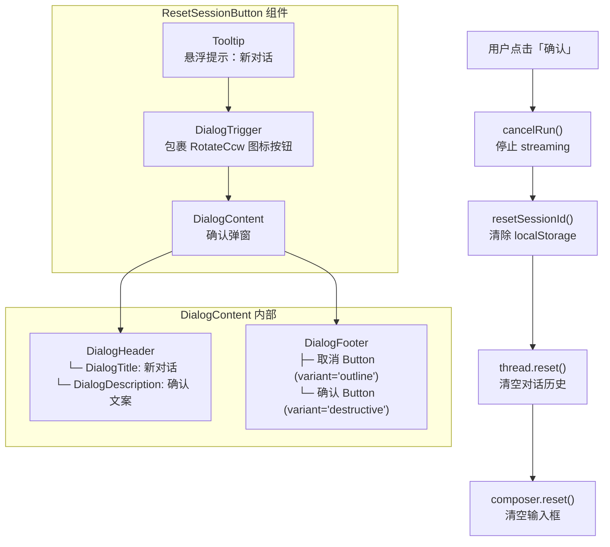
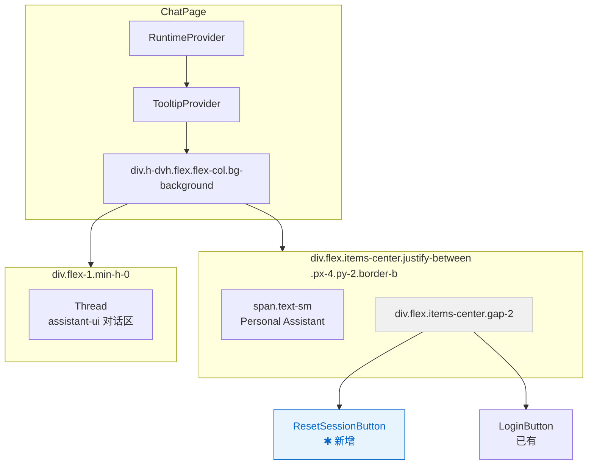
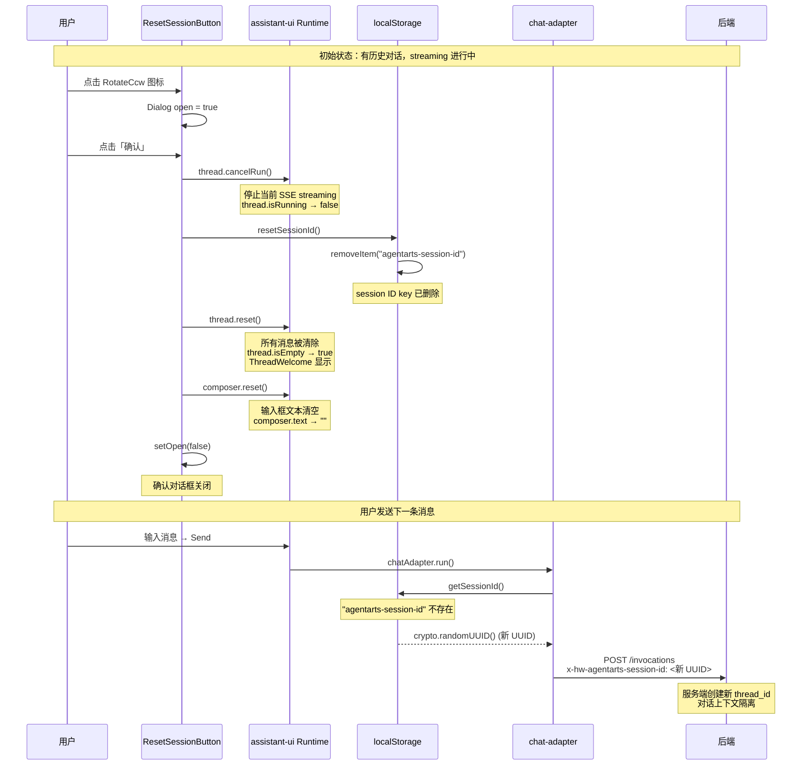
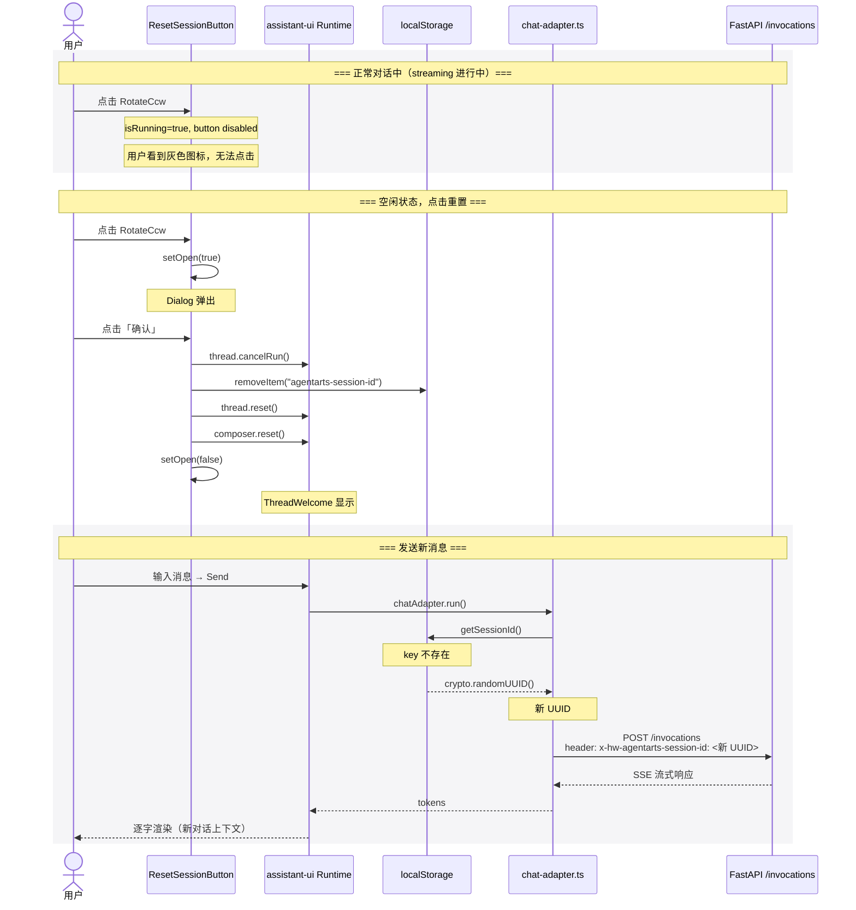
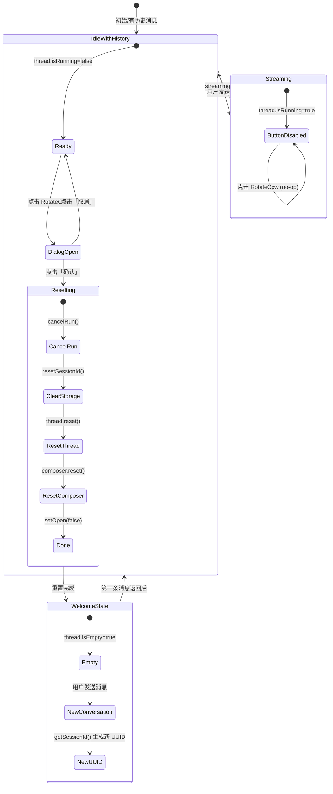

# feature-13-reset-session — Frontend Client 实现计划

> **版本**：v1.0 | **状态**：Draft | **关联文档**：`issue.md`、`frontend_architecture.md`、`DESIGN.md`

---

## 1. 概述

### 1.1 功能描述

为 Web Chat 界面的 header 区域新增「新对话」按钮，用户点击后弹窗确认，确认后：

1. 停止当前 streaming（如有）
2. 删除 `localStorage` 中的 `agentarts-session-id` key
3. 清空 assistant-ui Thread 中的所有历史消息，界面回到 welcome 状态
4. 清空 Composer 输入框内容
5. 下一轮对话自动生成全新 UUID 作为 Session ID → 后端创建新 `thread_id`

### 1.2 影响范围

| 层级 | 变更类型 |
|------|----------|
| `personal-assistant-client` | 修改 2 个文件 + 新增 1 个组件文件 |
| `personal-assistant-service` | **无需修改** |
| `personal-assistant-infra` | **无需修改** |

### 1.3 设计原则

- **纯客户端操作**：不调用任何后端 API，仅操作 `localStorage` + assistant-ui runtime 状态
- **Apple 风格设计语言**：ghost 按钮，无视觉重量，tooltip 提示，dialog 确认
- **防御性编程**：所有 `localStorage` 操作包裹 `try/catch`，隐私模式/存储不可用时静默降级

---

## 2. 文件变更清单

| # | 文件路径 | 操作 | 说明 |
|---|---------|------|------|
| 1 | `personal-assistant-client/src/lib/chat-adapter.ts` | **修改** | 新增 `resetSessionId()` export function |
| 2 | `personal-assistant-client/src/components/chat/ResetSessionButton.tsx` | **新建** | 新对话按钮组件（含确认 Dialog） |
| 3 | `personal-assistant-client/src/components/chat/ChatPage.tsx` | **修改** | 在 header 中挂载 `ResetSessionButton` |

---

## 3. 逐文件实现细节

### 3.1 `chat-adapter.ts` — 新增 `resetSessionId()` 函数

**文件**：`personal-assistant-client/src/lib/chat-adapter.ts`

**变更内容**：在 `getSessionId()` 函数之后，`chatAdapter` 常量之前，新增导出函数：

```typescript
/**
 * Remove the persisted session ID from localStorage to trigger a new
 * conversation on the next chat-adapter run.
 *
 * Safe to call when localStorage is unavailable (privacy mode, storage
 * quota exceeded, etc.) — errors are silently swallowed.
 */
export function resetSessionId(): void {
  try {
    localStorage.removeItem("agentarts-session-id");
  } catch {
    // privacy mode / localStorage unavailable — silent no-op
  }
}
```

**为什么放在 `chat-adapter.ts`**：
- `agentarts-session-id` 的读写逻辑集中在此文件（`getSessionId()` 函数）
- 遵循 Co-location 原则：key 的定义者和清除者放在一起，避免 key 名称分散导致不一致
- 不引入新的 module 依赖

**设计决策**：
- 只 `removeItem`，不主动 `setItem` — 下一次 `getSessionId()` 调用时自动生成新 UUID（lazy 创建）
- `try/catch` 静默吞错：隐私模式下 `localStorage` 不可访问不抛异常，`getSessionId()` 本身也有同样的 fallback 逻辑（catch 分支返回 `crypto.randomUUID()`），行为一致

---

### 3.2 `ResetSessionButton.tsx` — 新建组件 (CREATE)

**文件**：`personal-assistant-client/src/components/chat/ResetSessionButton.tsx`

#### 3.2.1 组件结构概览



#### 3.2.2 完整实现规格

```typescript
// 文件：personal-assistant-client/src/components/chat/ResetSessionButton.tsx

import { useAui, useAuiState } from "@assistant-ui/react";
import { RotateCcw } from "lucide-react";
import { Button } from "@/components/ui/button";
import {
  Dialog,
  DialogTrigger,
  DialogContent,
  DialogHeader,
  DialogTitle,
  DialogDescription,
  DialogFooter,
  DialogClose,
} from "@/components/ui/dialog";
import {
  Tooltip,
  TooltipTrigger,
  TooltipContent,
} from "@/components/ui/tooltip";
import { resetSessionId } from "@/lib/chat-adapter";
import { useState } from "react";

export function ResetSessionButton() {
  const aui = useAui();
  const isRunning = useAuiState((s) => s.thread.isRunning);
  const [open, setOpen] = useState(false);

  const handleConfirm = async () => {
    // 1. 停止当前 streaming（cancelRun 是同步的，安全多次调用）
    aui.thread.cancelRun();

    // 2. 清除 localStorage 中的 session ID
    resetSessionId();

    // 3. 清空 thread 中所有消息，界面回到 welcome 状态
    aui.thread.reset();

    // 4. 清空输入框（异步操作）
    await aui.composer.reset();

    // 5. 关闭弹窗
    setOpen(false);
  };

  return (
    <Dialog open={open} onOpenChange={setOpen}>
      <Tooltip>
        <TooltipTrigger
          render={
            <DialogTrigger
              render={
                <Button
                  variant="ghost"
                  size="icon-sm"
                  disabled={isRunning}
                  aria-label="新对话"
                />
              }
            />
          }
        >
          <RotateCcw className="size-4" />
        </TooltipTrigger>
        <TooltipContent>
          <p>新对话</p>
        </TooltipContent>
      </Tooltip>

      <DialogContent>
        <DialogHeader>
          <DialogTitle>新对话</DialogTitle>
          <DialogDescription>
            开始全新对话，当前会话记录将被清除。此操作无法撤销。
          </DialogDescription>
        </DialogHeader>
        <DialogFooter>
          <DialogClose render={<Button variant="outline" />}>
            取消
          </DialogClose>
          <Button
            variant="destructive"
            onClick={handleConfirm}
          >
            确认
          </Button>
        </DialogFooter>
      </DialogContent>
    </Dialog>
  );
}
```

#### 3.2.3 组件设计要点

| 关注点 | 实现 |
|--------|------|
| **图标** | `RotateCcw` from `lucide-react` — 通用「重置/刷新」语义，业界共识 |
| **按钮 variant** | `ghost` — 无背景色，hover 时浅色背景，最小化视觉重量 |
| **按钮 size** | `icon-sm` — 28×28px 点击区域（`size-7`），与 header 区域协调 |
| **disabled 条件** | `useAuiState((s) => s.thread.isRunning)` — streaming 进行中禁用按钮，防止运行时重置导致状态不一致 |
| **Tooltip** | 悬浮显示「新对话」中文提示，符合 Apple 风格"UI chrome recedes"原则 |
| **Dialog title / description** | 中文文案，语气简洁直接，告知用户操作后果 |
| **Dialog 确认按钮** | `variant="destructive"` — 红色调提示用户这是破坏性操作，符合 shadcn 语义约定 |
| **Dialog 取消按钮** | `variant="outline"` — 中性视觉，用 `DialogClose` 包裹自动关闭 |
| **DialogFooter** | 自带 `border-t` 分隔线和 `bg-muted/50` 背景，按钮右对齐（`sm:justify-end`） |
| **受控 Dialog** | 使用 `open` + `onOpenChange` 受控模式，`handleConfirm` 完成后主动 `setOpen(false)` |

#### 3.2.4 运行时依赖关系

`ResetSessionButton` 依赖以下 context providers（由 `ChatPage` 提供）：

```
ResetSessionButton
  ├── useAui()            → 需要 RuntimeProvider（ChatPage :: RuntimeProvider）
  ├── useAuiState()       → 需要 RuntimeProvider（同上）
  ├── Tooltip             → 需要 TooltipProvider（ChatPage :: TooltipProvider）
  └── Dialog              → 无额外 provider 依赖（base-ui Dialog 自管理 portal）
```

**关键约束**：`ResetSessionButton` 必须挂载在 `ChatPage` 的 `<RuntimeProvider>` + `<TooltipProvider>` 作用域内。当前架构已满足此约束。

---

### 3.3 `ChatPage.tsx` — 挂载 `ResetSessionButton`

**文件**：`personal-assistant-client/src/components/chat/ChatPage.tsx`

**变更内容**：

1. 新增 import：
   ```typescript
   import { ResetSessionButton } from "./ResetSessionButton";
   ```

2. 修改 header 区域的 JSX（第 11–16 行）：

   **修改前**：
   ```tsx
   <div className="flex items-center justify-between px-4 py-2 border-b">
     <span className="text-sm text-muted-foreground">
       Personal Assistant
     </span>
     <LoginButton />
   </div>
   ```

   **修改后**：
   ```tsx
   <div className="flex items-center justify-between px-4 py-2 border-b">
     <span className="text-sm text-muted-foreground">
       Personal Assistant
     </span>
     <div className="flex items-center gap-2">
       <ResetSessionButton />
       <LoginButton />
     </div>
   </div>
   ```

**布局说明**：
- 左侧「Personal Assistant」文字保持不动
- 右侧用 `flex items-center gap-2` 容器包裹两个按钮，`gap-2`（8px）提供间距
- `ResetSessionButton` 位于 `LoginButton` 左侧（按阅读顺序，重置按钮先于登录按钮）
- 两个按钮在垂直方向居中对齐（`items-center`）
- 不改变 header 的高度（无 padding 变化，按钮为 `icon-sm` 28px → 与文字行高协调）

---

## 4. 组件树变更

### 4.1 ChatPage 组件层级（变更后）



### 4.2 页面效果示意

```
┌─────────────────────────────────────────────────┐
│ Personal Assistant        [↻] [User Avatar ▼]   │  ← header (border-b)
├─────────────────────────────────────────────────┤
│                                                   │
│           Hello there!                            │  ← ThreadWelcome
│      How can I help you today?                   │
│                                                   │
│  ┌─────────────────────────────────┐  ┌───────┐  │
│  │ Schedule a meeting...           │  │  ⇡  ↩  │  │
│  └─────────────────────────────────┘  └───────┘  │
│                                                   │
├─────────────────────────────────────────────────┤
│  [📎]  Send a message...                       [↑]│  ← Composer
└─────────────────────────────────────────────────┘
```

> `[↻]` = RotateCcw 图标，悬浮显示 "新对话" tooltip

---

## 5. 状态管理

### 5.1 状态变更序列

用户点击「确认」后，按以下顺序执行：



### 5.2 涉及的状态

| 状态来源 | 变更方式 | 变更后值 |
|----------|---------|---------|
| `localStorage["agentarts-session-id"]` | `resetSessionId()` → `removeItem` | key 不存在 |
| `thread.isRunning` (assistant-ui) | `cancelRun()` | `false` |
| `thread.messages` (assistant-ui) | `thread.reset()` | `[]`（空数组） |
| `thread.isEmpty` (assistant-ui) | `thread.reset()` | `true` |
| `composer.text` (assistant-ui) | `composer.reset()` | `""`（空字符串） |
| `composer.attachments` (assistant-ui) | `composer.reset()` | `[]` |
| Dialog `open` state (React local) | `setOpen(false)` | `false` |

### 5.3 下次对话时的级联效应

1. `chatAdapter.run()` 第 106 行调用 `getSessionId()`
2. `localStorage.getItem("agentarts-session-id")` 返回 `null`
3. 执行 `crypto.randomUUID()` 生成新 UUID
4. `localStorage.setItem("agentarts-session-id", newId)` 持久化新 UUID
5. 请求 header `x-hw-agentarts-session-id` 携带全新 UUID
6. 后端 `agent_handler.py` 的 `get_or_create_thread_id()` 发现新 session ID → 创建新 LangGraph `thread_id`
7. 对话上下文完全隔离，不受历史对话影响

---

## 6. Edge Cases

### 6.1 Streaming 进行中点击重置

**场景**：AI 正在生成回复（`thread.isRunning === true`），用户点击重置按钮

**处理**：
- `useAuiState((s) => s.thread.isRunning)` 返回 `true`
- Button `disabled` prop 为 `true` → 按钮灰显（`disabled:opacity-50` + `disabled:pointer-events-none`）
- 用户无法触发 Dialog（因为 TooltipTrigger 内的 Button disabled）

**原因**：
- 如果允许在 streaming 中途 `thread.reset()`，可能导致：
  - SSE 连接未正确关闭（`cancelRun` 需要先发信号）
  - assistant-ui 内部状态不一致
  - 已取消的 SSE token 继续涌入被重置的 thread
- 因此必须在确认前先 `cancelRun()`，而确认流程仅通过 Dialog 触发

### 6.2 隐私模式 / localStorage 不可用

**场景**：
- 浏览器隐私模式限制 `localStorage` 写入
- 存储配额已满（`QuotaExceededError`）
- 用户手动禁用了 `localStorage`

**处理**：
- `resetSessionId()` 内部的 `try/catch` 静默吞错
- 不影响后续 `thread.reset()` 和 `composer.reset()` 执行
- `getSessionId()` 自身在 catch 分支也返回 `crypto.randomUUID()`（不持久化），行为一致
- 用户体验：每次刷新页面都会得到新 session ID（与隐私模式下首次访问行为一致）

### 6.3 未登录状态

**场景**：用户未通过 MSAL 登录（`isAuthenticated === false`），当前 ChatPage 仍然渲染

**处理**：
- `ResetSessionButton` 不依赖任何认证状态
- `cancelRun()`、`thread.reset()`、`composer.reset()` 均不检查登录状态
- 未登录时的对话（dev mode proxy auth）同样有效
- 按钮正常渲染，功能正常可用

### 6.4 Dialog 打开时切换登录状态

**场景**：Dialog 打开时，用户点击 Login/Logout 按钮

**处理**：
- Dialog 和 LoginButton 是两个独立组件，不同 state
- Dialog 保持打开（`open` state 独立）
- 切换登录状态后 thread/composer 状态可能变化（如 logout 后 thread 可能被 reset），但不影响 Dialog 生命周期
- 用户仍可点击「取消」关闭 Dialog

### 6.5 连续快速点击确认

**场景**：用户连续快速点击「确认」按钮多次

**处理**：
- 第一次点击后 `handleConfirm` 执行，最后 `setOpen(false)` 关闭 Dialog
- Dialog 关闭后，第二次点击事件因目标元素已卸载而被忽略
- `cancelRun()` 幂等（多次调用安全）
- `thread.reset()` 幂等（空 thread 再次 reset 无副作用）
- `localStorage.removeItem` 幂等（key 不存在时静默成功）

### 6.6 空 thread 时重置

**场景**：当前已经是 welcome 状态（无历史消息），用户点击重置

**处理**：
- `thread.reset()` 在空 thread 上调用是安全的（no-op 逻辑）
- `composer.reset()` 在空 composer 上调用也是安全的
- `resetSessionId()` 即使 key 不存在也不抛异常
- 整体行为：无任何 visible change，用户体验一致

---

## 7. 设计合规性检查

基于 `personal-assistant-client/DESIGN.md` 的 Apple 风格设计语言，逐项检查：

| 设计原则 | 合规方式 | 状态 |
|----------|---------|:----:|
| **Action Blue `#0066cc`** 为唯一交互色 | 使用 shadcn Button 默认 theme（`bg-primary` = `#0066cc`）；ghost 按钮 hover 时不使用额外颜色 | ✅ |
| **扁平化，无阴影** | `variant="ghost"` 无背景无阴影；Dialog overlay 使用 `bg-black/10` 轻微遮罩（非阴影） | ✅ |
| **Rounded pill** | Dialog footer 按钮为 shadcn 默认 `rounded-lg`（8px）；整体符合 Apple 圆角体系 | ✅ |
| **最小 visual weight** | ghost button + tooltip = UI chrome recedes，交互元素不抢夺注意力 | ✅ |
| **SF Pro 字体** | 不覆写全局字体设置，继承 Tailwind CSS 中定义的 `font-sans` token | ✅ |
| **17px body** | Dialog description 使用 `text-sm`（14px），匹配 dialog 组件设计；ChatPage 正文不受影响 | ✅ |
| **`transform: scale(0.95)` active** | Button 组件 `active:not-aria-[haspopup]:translate-y-px` 提供微交互反馈 | ✅ |
| **44px 最小触控区域** | `size="icon-sm"` 提供 28px 触控区域；桌面端可接受（移动端 header 按钮通常在 44px） | ⚠️ 见注释 |
| **不要引入第二主题色** | 不引入任何新的颜色 token | ✅ |

> **注释 (44px 触控区域)**：桌面端优先场景下，header 工具栏按钮 28×28px 是可接受的（参考 DESIGN.md 中 Global Nav 的 utility links 也小于 44px）。移动端响应式适配留待 future issue。

---

## 8. Mermaid 图示

### 8.1 组件交互流程图



### 8.2 状态转换图



---

## 9. 测试用例概要

### 9.1 单元测试（`ResetSessionButton.test.tsx`）

| ID | 场景 | 预期行为 |
|----|------|---------|
| UT-1 | 初始渲染 | 渲染一个 ghost icon-sm Button，内含 RotateCcw 图标 |
| UT-2 | Tooltip 显示 | 悬浮图标时显示 "新对话" tooltip |
| UT-3 | 点击图标 | Dialog 打开，显示标题「新对话」和确认文案 |
| UT-4 | 点击「取消」| Dialog 关闭，thread 状态未变 |
| UT-5 | 点击「确认」| 依次调用 `cancelRun()` → `resetSessionId()` → `thread.reset()` → `composer.reset()` |
| UT-6 | streaming 进行中 | `thread.isRunning === true` 时按钮 `disabled` |
| UT-7 | localStorage 不可用 | `resetSessionId()` 不抛异常，其余 reset 流程正常执行 |
| UT-8 | composer.reset 失败 | `composer.reset()` reject 时异常应被捕获，不影响 Dialog 关闭 |

### 9.2 集成测试（`chat-adapter.test.ts`）

| ID | 场景 | 预期行为 |
|----|------|---------|
| IT-1 | 调用 `resetSessionId()` | `localStorage` 中的 `agentarts-session-id` key 被删除 |
| IT-2 | 删除后调用 `getSessionId()` | 返回全新 UUID，不同于删除前的值 |
| IT-3 | 隐私模式下调用 | `removeItem` 抛异常被静默捕获，函数正常返回 |

### 9.3 E2E 测试（`personal-assistant-e2e/`）

> 详见 `test-plan.md`

| ID | 场景 |
|----|------|
| E2E-1 | 完整重置 → 发送新消息 → 验证新 session ID |
| E2E-2 | streaming 中重置按钮 disabled → streaming 完成后可点击 |
| E2E-3 | 重置后界面回到 welcome 状态 |
| E2E-4 | 重置后输入框为空 |
| E2E-5 | 未登录状态下重置功能正常 |

---

## 10. 构建与部署影响

### 10.1 Vite 构建

- **无新增依赖**：所有 import 来自已有依赖（`@assistant-ui/react`、`lucide-react`、`@/components/ui/*`、`@/lib/chat-adapter`）
- **无配置变更**：`vite.config.ts`、`tailwind.config.ts`、环境变量均无需修改
- **Bundle size 影响**：仅新增约 1–2 KB（一个组件文件），无 tree-shaking 副作用

### 10.2 环境变量

- **无需新增环境变量**：重置功能纯客户端实现，不调用外部 API

### 10.3 部署

- `npm run build` 正常产出后，通过 obsutil 上传至 OBS（同现有流程）
- 无需后端同步部署（纯前端变更）

---

## 11. 潜在风险与缓解

| 风险 | 影响 | 缓解措施 |
|------|------|---------|
| `useAui()` API 在未来版本中 breaking change | 组件编译失败 | `@assistant-ui/react` locked at `^0.14.14`，升级时需验证 |
| `thread.reset()` 后 assistant-ui 状态残留 | 界面显示异常 | 在 `handleConfirm` 中按严格顺序执行：cancelRun → resetThread → resetComposer |
| Dialog 在移动端显示过大 | 小屏设备体验差 | shadcn Dialog `max-w-[calc(100%-2rem)]` 已做响应式适配 |
| 用户误操作不可逆 | 对话历史丢失 | Dialog 明确告知"此操作无法撤销"，需要二次确认 |

---

## 12. 实现检查项（Dev Checklist）

- [ ] `chat-adapter.ts` 新增 `resetSessionId()` 导出函数
- [ ] `ResetSessionButton.tsx` 创建完成，包含 Tooltip + Dialog
- [ ] `ChatPage.tsx` 导入并挂载 `ResetSessionButton`（LoginButton 左侧）
- [ ] streaming 进行中按钮 disabled
- [ ] localStorage 操作带 try/catch
- [ ] `npm run build` 无 TypeScript 错误
- [ ] `npm run test` 全部通过
- [ ] 手动验证：重置 → welcome 状态 → 发送新消息 → 验证新 session ID
