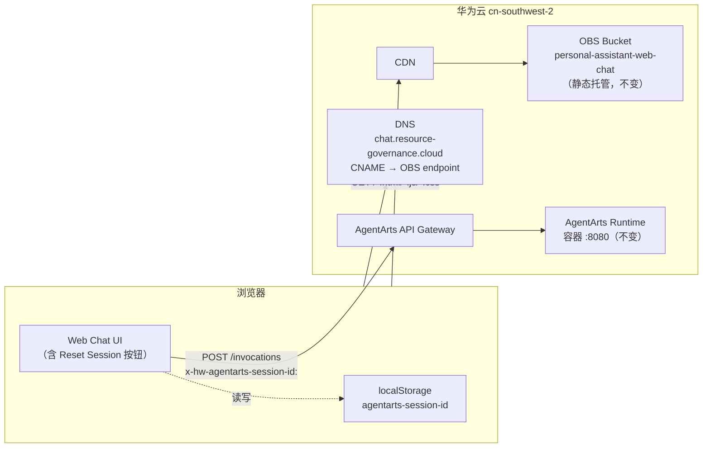

# Infra Plan — feature-13-reset-session

> 状态：Complete（无需实施） | 版本：v1.0

---

## 1. 结论：无 Infrastructure 变更

本 feature 为 **纯 client-side UX 增强**，**不涉及任何 infrastructure 变更**。

## 2. 原因分析

"Reset Session ID" 功能的全部逻辑运行在浏览器沙箱内：

| 操作 | 作用域 | 涉及组件 |
|------|--------|----------|
| 生成新 UUID | 浏览器（`crypto.randomUUID()`） | React 组件 |
| 删除旧 session ID | `localStorage`（`agentarts-session-id` key） | `chat-adapter.ts` |
| 清空输入框 | React state | `ChatPage.tsx` |
| 显示确认对话框 | React 组件 | `ResetSessionButton.tsx`（新增） |
| 下一条消息携带新 header | HTTP 请求头（`x-hw-agentarts-session-id`） | `chat-adapter.ts` |

以上所有操作均发生在用户浏览器内，**不经过** AgentArts Runtime、OBS、CDN 或任何华为云资源。

## 3. 无需变更的资源

| 资源类别 | 是否需要变更 | 说明 |
|----------|-------------|------|
| **OBS Bucket**（`personal-assistant-web-chat`） | ❌ 否 | 静态文件托管策略不变；构建产物重新上传属于 CI/CD 部署流程，非 IaC 变更 |
| **CDN / DNS**（`chat.resource-governance.cloud`） | ❌ 否 | CNAME 记录与 OBS website endpoint 映射不变 |
| **IAM Policy / Role** | ❌ 否 | 无新增权限需求 |
| **VPC / EIP** | ❌ 否 | 网络边界不变 |
| **SWR Repository**（`agent_personal_assistant`） | ❌ 否 | 后端镜像不受影响 |
| **RDS** | ❌ 否 | 无数据持久化需求 |
| **OpenTofu / HCL** | ❌ 否 | 无 `.tf` 文件需修改 |
| **Terraform State** | ❌ 否 | 无 resource 需 create/update/destroy |
| **`.agentarts_config.yaml`** | ❌ 否 | AgentArts Runtime 配置不变 |

## 4. Infrastructure Topology（无变更）

现有部署拓扑保持不变：

> 虚线表示 Reset 功能新增的 browser-local 交互，不经过任何云资源。

## 5. 验证检查清单

| 检查项 | 状态 | 说明 |
|--------|------|------|
| `tofu validate` 通过 | ✅ 无需执行 | 无 `.tf` 变更 |
| `tofu plan` 无 diff | ✅ 无需执行 | 无资源变更 |
| OBS bucket policy 无变化 | ✅ 确认 | 静态托管配置不变 |
| CDN cache 策略无变化 | ✅ 确认 | 前端资源 URL 结构不变 |
| IAM 权限无变化 | ✅ 确认 | 无新增 API 调用 |
| 前端构建产物可正常上传至 OBS | ✅ 确认 | CI/CD 流程不变，仅 JS/CSS 内容更新 |

---

## 6. 对 `personal-assistant-infra-dev` 的指示

**本 feature 无需任何 IaC 实施工作。** `infra-plan.md` 即最终交付物，直接标记为 Complete。
