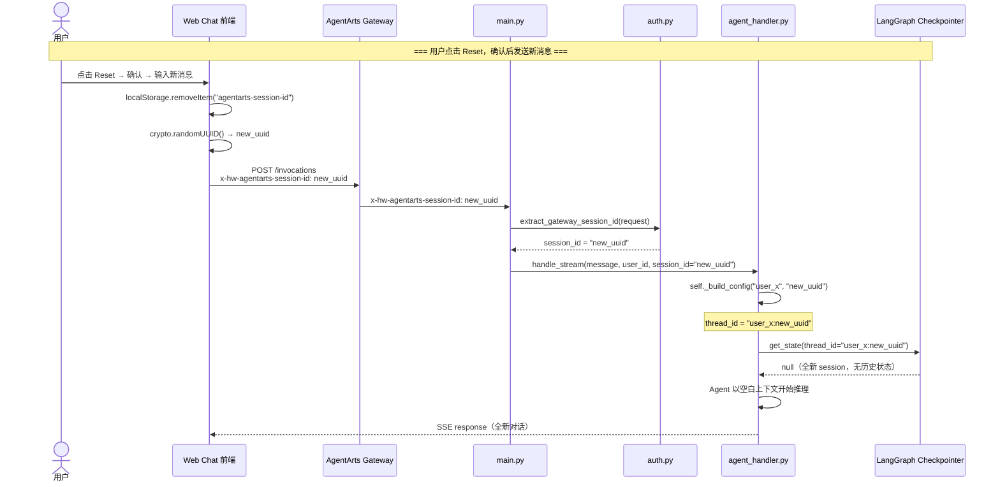
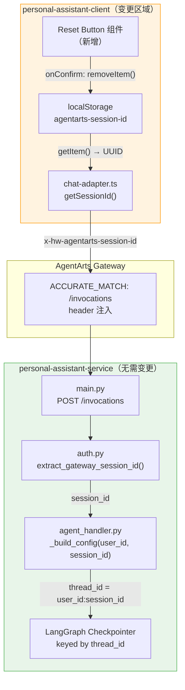

# Service Implementation Plan — feature-13-reset-session

> 版本：v1.0 | 状态：Plan | 关联 client-plan: `client-plan.md`

---

## 1. 结论：无需 Service 端修改

**personal-assistant-service 无需任何代码变更。** 本 Feature 为纯客户端改动，服务端现有架构已原生支持 `session_id` 轮换，无需新增 API、Schema 或数据库迁移。

---

## 2. 为什么无需修改：现有架构分析

### 2.1 核心流程

客户端删除 `localStorage` 中的 `agentarts-session-id` 后，下一轮请求将携带全新 `UUID`。服务端对此变化的处理链路如下：



### 2.2 关键代码路径（无需修改）

整个链路在服务端已完全就绪，每一环都正确处理了 `session_id` 轮换：

| 文件 | 行号 | 代码 | 说明 |
|------|------|------|------|
| `app/auth.py` | 32-45 | `extract_gateway_session_id(request)` | 从 `x-hw-agentarts-session-id` header 提取，缺失时返回 400（**已强校验**） |
| `app/main.py` | 121 | `session_id = extract_gateway_session_id(request)` | 在 `/invocations` 入口提取 session_id |
| `app/main.py` | 135-139 | `handler.handle_stream(message, user_id, session_id)` | 流式路径传递 session_id |
| `app/main.py` | 156-159 | `handler.handle(message, user_id, session_id)` | 同步路径传递 session_id |
| `app/agent_handler.py` | 114-120 | `self._build_config(user_id, session_id)` | **核心**：`{user_id}:{session_id}` → `thread_id` |
| `app/agent_handler.py` | 126 | `config = self._build_config(user_id, session_id)` | `handle()` 中构造 config |
| `app/agent_handler.py` | 141 | `config = self._build_config(user_id, session_id)` | `handle_stream()` 中构造 config |

### 2.3 `_build_config` 的精妙之处

```python
# personal-assistant-service/app/agent_handler.py, line 114-120
@staticmethod
def _build_config(user_id: str, session_id: str | None = None) -> dict:
    """构造 LangGraph config，thread_id = {user_id}:{session_id}。

    user-scoped thread_id 从源头防止跨用户 session 泄露。
    """
    sid = session_id or "default"
    return {"configurable": {"thread_id": f"{user_id}:{sid}"}}
```

`_build_config` 是纯函数（static method），不给 `session_id` 附加任何语义。它的职责极为简单：**将 `(user_id, session_id)` 映射为 LangGraph `thread_id`**。当 `session_id` 变化时，`thread_id` 随之变化，LangGraph Checkpointer 按新的 `thread_id` 查找状态——因为是全新值，查不到任何历史，自动从零开始。

这一设计确保了：

- **客户端驱动重置**：后端不需要知道"重置"的概念。前端换一个 UUID，后端自动获得新 thread。
- **无状态 HTTP**：`/invocations` 路由本身是无状态的，每次调用独立提取 header，不做任何 session 生命周期管理。
- **安全性不变**：`thread_id = user_id:session_id` 的拼接规则保持不变。用户 B 不能通过伪造 header 访问用户 A 的 checkpoint。

---

## 3. 无 API Schema 变更

| 项目 | 是否需要变更 |
|------|:------------:|
| 新增 FastAPI 路由 | ❌ 不需要 |
| 新增 Pydantic Schema | ❌ 不需要 |
| 修改已有 Schema | ❌ 不需要 |
| 新增/修改 Header | ❌ 不需要（`x-hw-agentarts-session-id` 已有，行为不变） |
| OpenAPI spec 更新 | ❌ 不需要 |

`POST /invocations` 的请求 body schema 保持不变（`message` + 可选 `stream`），`x-hw-agentarts-session-id` header 的行为也完全不变——仍然是必选、由客户端生成、按 UUID 格式传递。

---

## 4. 无数据库变更

| 项目 | 是否需要变更 |
|------|:------------:|
| 新增数据库表 | ❌ 不需要 |
| 修改已有表结构 | ❌ 不需要 |
| 数据迁移 | ❌ 不需要 |
| Checkpointer 后端 | ❌ 不需要（InMemorySaver / SqliteSaver / PostgresSaver 行为不变） |

LangGraph Checkpointer 的 key 始终是 `thread_id`，Checkpointer 后端只看这个 key，不感知 `session_id` 的语义。新的 `thread_id` 产生新的 checkpoint slot，旧 session 的 checkpoint 继续保留（由 Checkpointer 后端的存储 TTL 自然清理），无需后端干预。

---

## 5. 边界情况确认

以下边界情况在现有架构中已经妥善处理，无需额外适配：

| 边界情况 | 服务端行为 | 状态 |
|----------|-----------|:----:|
| `x-hw-agentarts-session-id` 缺失 | `auth.py:38-43` → `HTTPException(400)` | ✅ 已有 |
| header 值变更（如 `sess_abc` → `sess_xyz`） | `_build_config` 产生新 `thread_id`，checkpoint 自动隔离 | ✅ 已有 |
| 并发请求（同一新 session 的并发初始化） | Checkpointer 乐观锁处理，当前低并发可接受 | ✅ 已有 |
| `localStorage` 降级（每次新 UUID） | 同上——`_build_config` 每次产生新 thread_id，无累积风险 | ✅ 已有 |

---

## 6. Mermaid 架构总览



> 绿色区域：无需变更。橙色区域：客户端变更范围。

---

## 7. 小结

| 维度 | 结论 |
|------|------|
| **是否需要 Service 代码变更** | ❌ 否 |
| **是否需要新增 API** | ❌ 否 |
| **是否需要修改 Pydantic Schema** | ❌ 否 |
| **是否需要数据库迁移** | ❌ 否 |
| **现有架构是否已支持 session 重置** | ✅ 是——`_build_config(user_id, new_session_id)` 天然产生新的 `thread_id` |
| **Service Plan 复杂度** | 最低——纯确认型文档，零实施任务 |

**实施建议**：Service 端开发者无需介入此 Feature。实际工作集中在 `personal-assistant-client`（见 `client-plan.md`）和 `personal-assistant-e2e`（见 `test-plan.md`）。
