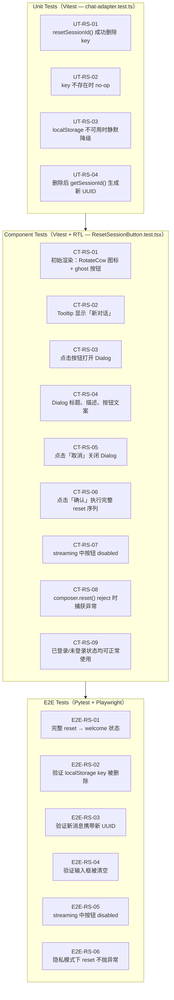
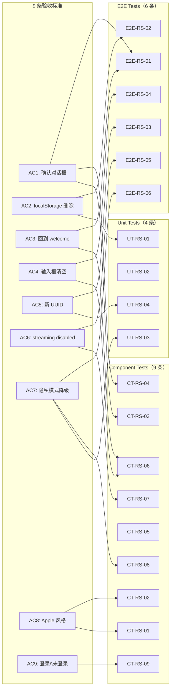

# Test Plan — feature-13-reset-session

> 版本：v1.0 | 状态：Draft | 关联文档：`issue.md`、`service-plan.md`、`client-plan.md`、`infra-plan.md`

---

## 1. 概述

### 1.1 测试范围

本 feature 为**纯客户端 UX 增强**，`personal-assistant-service` 和 `personal-assistant-infra` **均无需修改**（见 `service-plan.md` §1 和 `infra-plan.md` §1）。因此测试工作集中在以下三层：

| 测试层 | 框架 | 范围 |
|--------|------|------|
| **单元测试** | Vitest | `chat-adapter.ts` 中新增的 `resetSessionId()` 函数 + `getSessionId()` 联动 |
| **组件测试** | Vitest + React Testing Library | `ResetSessionButton.tsx` 新建组件 |
| **E2E 测试** | Pytest + Playwright | 浏览器端完整 reset 流程 |

### 1.2 测试文件清单

| # | 文件路径 | 操作 | 测试类型 |
|---|---------|------|----------|
| 1 | `personal-assistant-client/src/lib/chat-adapter.test.ts` | **扩展** — 新增 `resetSessionId` + `getSessionId` 联动 describe block | Unit |
| 2 | `personal-assistant-client/src/components/chat/ResetSessionButton.test.tsx` | **新建** | Component |
| 3 | `personal-assistant-e2e/tests/features/feature-13-reset-session/test_feature_13_reset_session.py` | **新建** | E2E |

---

## 2. 测试流程图



---

## 3. 验收标准映射

以下表格将 `issue.md` 中的 9 条验收标准逐一映射到具体测试用例：

| # | 验收标准 | 对应测试用例 | 测试层 |
|---|---------|-------------|--------|
| AC1 | 点击 Reset 按钮弹出确认对话框 | CT-RS-03, CT-RS-04, E2E-RS-01 | Component + E2E |
| AC2 | 确认后 `localStorage` 中 `agentarts-session-id` key 被删除 | UT-RS-01, E2E-RS-02 | Unit + E2E |
| AC3 | 确认后聊天界面回到空白 welcome 状态 | CT-RS-06, E2E-RS-01 | Component + E2E |
| AC4 | 确认后输入框内容被清空 | CT-RS-06, E2E-RS-04 | Component + E2E |
| AC5 | 确认后发送的下一条消息请求中包含全新的 UUID | UT-RS-04, E2E-RS-03 | Unit + E2E |
| AC6 | streaming 进行中时 Reset 按钮处于 `disabled` 状态 | CT-RS-07, E2E-RS-05 | Component + E2E |
| AC7 | 隐私模式 / localStorage 不可用时，点击 Reset 不抛异常 | UT-RS-03, CT-RS-08, E2E-RS-06 | Unit + Component + E2E |
| AC8 | 按钮样式符合 Apple 风格设计语言 | CT-RS-01, CT-RS-02 | Component |
| AC9 | 已登录和未登录状态下均可正常使用 | CT-RS-09 | Component |

---

## 4. Unit Tests — `chat-adapter.test.ts`

**文件**：`personal-assistant-client/src/lib/chat-adapter.test.ts`

**变更方式**：在现有文件的 `describe("session ID header", ...)` 块**之后**新增 `describe("resetSessionId", ...)` block。

> 注意：`resetSessionId()` 和 `getSessionId()` 均未 export，需要从 `chat-adapter.ts` 中 export 后再测试。根据 `client-plan.md` §3.1，只有 `resetSessionId()` 被 export。建议测试时将 `getSessionId()` 也临时 export 以便测试（或在 `resetSessionId` 的集成场景中通过 `chatAdapter.run()` 的请求 header 间接验证）。

### 4.1 测试 infrastructure

```typescript
import { describe, it, expect, vi, beforeEach, afterEach } from "vitest";
// 从 chat-adapter.ts 导入待测函数（需在实现时添加 export）
import { resetSessionId, getSessionId } from "./chat-adapter";
```

### 4.2 测试用例

#### UT-RS-01: `resetSessionId()` 成功删除 `agentarts-session-id` key

| 项目 | 说明 |
|------|------|
| **场景** | localStorage 中存在 `agentarts-session-id` key |
| **前置** | `localStorage.setItem("agentarts-session-id", "existing-uuid-1234")` |
| **操作** | 调用 `resetSessionId()` |
| **断言** | `localStorage.getItem("agentarts-session-id")` 返回 `null` |
| **清理** | `localStorage.clear()` |

#### UT-RS-02: key 不存在时 `resetSessionId()` 为 no-op（不抛异常）

| 项目 | 说明 |
|------|------|
| **场景** | localStorage 中**不存在** `agentarts-session-id` key |
| **前置** | `localStorage.clear()` 确保 key 不存在 |
| **操作** | 调用 `resetSessionId()` |
| **断言** | 函数正常返回 `undefined`，不抛出任何异常 |
| **清理** | `localStorage.clear()` |

#### UT-RS-03: localStorage 不可用时 `resetSessionId()` 静默降级

| 项目 | 说明 |
|------|------|
| **场景** | 浏览器隐私模式 / 存储配额已满，`localStorage.removeItem()` 抛出 `DOMException` |
| **前置** | `vi.spyOn(Storage.prototype, "removeItem").mockImplementation(() => { throw new DOMException("Blocked", "SecurityError"); })` |
| **操作** | 调用 `resetSessionId()` |
| **断言** | 函数正常返回 `undefined`，不抛出异常（`try/catch` 静默吞错） |
| **清理** | `vi.restoreAllMocks()` |

#### UT-RS-04: 删除后 `getSessionId()` 生成全新 UUID

| 项目 | 说明 |
|------|------|
| **场景** | Reset 后下一次 `getSessionId()` 调用应生成不同于旧值的新 UUID |
| **前置** | 先调用 `getSessionId()` 获取旧值 `oldId`，再调用 `resetSessionId()` |
| **操作** | 再次调用 `getSessionId()` 获取新值 `newId` |
| **断言** | `newId !== oldId`；`newId` 符合 UUID v4 格式 |
| **清理** | `localStorage.clear()` |

> **UUID v4 格式正则**：`/^[0-9a-f]{8}-[0-9a-f]{4}-4[0-9a-f]{3}-[89ab][0-9a-f]{3}-[0-9a-f]{12}$/i`
> 与现有 `chat-adapter.test.ts` 中 `session ID is a valid UUID v4 format` 测试一致。

---

## 5. Component Tests — `ResetSessionButton.test.tsx`

**文件**：`personal-assistant-client/src/components/chat/ResetSessionButton.test.tsx`（新建）

**测试 infrastructure**：Vitest + React Testing Library + `@testing-library/user-event`

### 5.1 Mock 策略

`ResetSessionButton` 组件依赖以下外部模块，需在测试中 mock：

| 依赖 | Mock 方式 | 说明 |
|------|----------|------|
| `@assistant-ui/react` (`useAui`, `useAuiState`) | `vi.mock("@assistant-ui/react", ...)` | Mock `useAui()` 返回 `{ thread: { cancelRun, reset }, composer: { reset } }`；Mock `useAuiState()` 返回 `{ thread: { isRunning } }` |
| `@/lib/chat-adapter` (`resetSessionId`) | `vi.mock("@/lib/chat-adapter", ...)` | Mock `resetSessionId` 为 `vi.fn()` |
| `lucide-react` (`RotateCcw`) | 无需 mock（SVG 图标通过 jsdom 正常渲染） | — |
| shadcn/ui components (`Dialog`, `Tooltip`, `Button`) | 无需 mock（jsdom 正常渲染） | Dialog 的 portal 行为需要在测试中考虑 |

### 5.2 通用测试 setup

```typescript
import { describe, it, expect, vi, beforeEach, afterEach } from "vitest";
import { render, screen, waitFor } from "@testing-library/react";
import userEvent from "@testing-library/user-event";
import { ResetSessionButton } from "./ResetSessionButton";

// Mock assistant-ui hooks
const mockCancelRun = vi.fn();
const mockThreadReset = vi.fn();
const mockComposerReset = vi.fn().mockResolvedValue(undefined);

const createMockAui = (isRunning = false) => ({
  useAui: () => ({
    thread: {
      cancelRun: mockCancelRun,
      reset: mockThreadReset,
    },
    composer: {
      reset: mockComposerReset,
    },
  }),
  useAuiState: (selector: (s: any) => any) => {
    const state = { thread: { isRunning } };
    return selector(state);
  },
});

// Mock resetSessionId from chat-adapter
const mockResetSessionId = vi.fn();
vi.mock("@/lib/chat-adapter", () => ({
  resetSessionId: () => mockResetSessionId(),
}));
```

### 5.3 测试用例

#### CT-RS-01: 初始渲染 — RotateCcw 图标 + ghost 按钮

| 项目 | 说明 |
|------|------|
| **场景** | 组件首次挂载，`thread.isRunning === false` |
| **操作** | `render(<ResetSessionButton />)` |
| **断言** | 按钮存在，`aria-label="新对话"`；按钮内含 `RotateCcw` 图标（`size-4` class）；按钮 `variant="ghost"` `size="icon-sm"`；按钮 `disabled` 属性为 `false` |

#### CT-RS-02: Tooltip 显示「新对话」

| 项目 | 说明 |
|------|------|
| **场景** | 用户鼠标悬浮在 Reset 图标按钮上 |
| **操作** | `userEvent.hover(button)` |
| **断言** | Tooltip content 显示文本「新对话」|

#### CT-RS-03: 点击按钮打开确认 Dialog

| 项目 | 说明 |
|------|------|
| **场景** | 用户点击 RotateCcw 图标按钮 |
| **前置** | `thread.isRunning === false`（按钮可点击） |
| **操作** | `await userEvent.click(button)` |
| **断言** | Dialog 弹出，Dialog 内容可见（`DialogContent` 渲染） |

#### CT-RS-04: Dialog 内容验证 — 标题、描述、按钮文案

| 项目 | 说明 |
|------|------|
| **场景** | Dialog 打开后，验证所有元素 |
| **前置** | Dialog 已打开 |
| **断言** | `DialogTitle` 文本为「新对话」；`DialogDescription` 包含「开始全新对话」和「此操作无法撤销」；Footer 中有「取消」按钮（`variant="outline"`）和「确认」按钮（`variant="destructive"`） |

#### CT-RS-05: 点击「取消」关闭 Dialog 且无副作用

| 项目 | 说明 |
|------|------|
| **场景** | Dialog 打开，用户点击「取消」|
| **前置** | Dialog 已打开；所有 mock 函数已 reset |
| **操作** | `await userEvent.click(screen.getByRole("button", { name: "取消" }))` |
| **断言** | Dialog 关闭（内容不可见）；`cancelRun`、`resetSessionId`、`thread.reset`、`composer.reset` 均**未被调用** |

#### CT-RS-06: 点击「确认」执行完整 reset 序列

| 项目 | 说明 |
|------|------|
| **场景** | Dialog 打开，用户点击「确认」— 按顺序执行 4 步 reset |
| **前置** | Dialog 已打开；所有 mock 已 reset |
| **操作** | `await userEvent.click(screen.getByRole("button", { name: "确认" }))` |
| **断言** | 1. `cancelRun` 被调用 1 次（先于其他操作）；2. `resetSessionId` 被调用 1 次；3. `thread.reset` 被调用 1 次；4. `composer.reset` 被调用 1 次；5. Dialog 关闭（`open` state → `false`） |
| **调用顺序** | `cancelRun` → `resetSessionId` → `thread.reset` → `composer.reset`（通过 `vi.mock.calls` 顺序验证） |

#### CT-RS-07: streaming 进行中按钮 disabled

| 项目 | 说明 |
|------|------|
| **场景** | `thread.isRunning === true`（AI 正在生成回复） |
| **前置** | Mock `useAuiState` 返回 `{ thread: { isRunning: true } }` |
| **操作** | `render(<ResetSessionButton />)` |
| **断言** | 按钮 `disabled` 属性为 `true`；点击按钮不触发 Dialog 打开（TooltipTrigger 内 Button 的 `disabled:pointer-events-none` 阻止交互） |

#### CT-RS-08: `composer.reset()` reject 时捕获异常，不影响 Dialog 关闭

| 项目 | 说明 |
|------|------|
| **场景** | `composer.reset()` 返回 rejected Promise（边界情况） |
| **前置** | Mock `composer.reset` 返回 `Promise.reject(new Error("composer error"))` |
| **操作** | Dialog 打开 → 点击「确认」 |
| **断言** | 1. 前面的 `cancelRun`、`resetSessionId`、`thread.reset` 仍被调用；2. 异常被 `handleConfirm` 内部的 `try/catch` 捕获（不冒泡）；3. Dialog 最终关闭（`setOpen(false)` 在 `await composer.reset()` 之后执行，需确保 catch 后也调用 `setOpen(false)` — **若 client-plan 中未包含 try/catch，则此测试指向实现缺陷，需反馈**） |

> ⚠️ **设计审查提示**：`client-plan.md` 中 `handleConfirm` 的实现未对 `composer.reset()` 包裹 `try/catch`（见 §3.2.2 第 152-159 行）。如果 `composer.reset()` reject，`setOpen(false)` 不会被执行，Dialog 将保持打开状态。建议在实现时增加异常处理，或在本测试计划标记为已知风险。

#### CT-RS-09: 已登录和未登录状态均可正常使用

| 项目 | 说明 |
|------|------|
| **场景** | `ResetSessionButton` 不依赖任何认证状态，在任何 auth 状态下应正常渲染和工作 |
| **前置** | 不注入任何 MSAL mock（组件本身不调用 MSAL hooks） |
| **操作** | `render(<ResetSessionButton />)` |
| **断言** | 组件正常渲染，无 console error；按钮可点击，Dialog 正常打开/关闭 |

---

## 6. E2E Tests — Playwright + Pytest

**文件**：`personal-assistant-e2e/tests/features/feature-13-reset-session/test_feature_13_reset_session.py`（新建）

**测试 infrastructure**：遵循 `personal-assistant-e2e/tests/features/test_feature_landing_page.py` 的 Playwright + Vite dev server 模式。

### 6.1 E2E 环境要求

| 依赖 | 说明 |
|------|------|
| **Vite dev server** | Session-scoped fixture，动态端口，启动 `personal-assistant-client/` 的 Vite dev server（`npm run dev`） |
| **Playwright** | `sync_playwright()` session-scoped，Chromium headless |
| **FastAPI 后端** | **无需启动**（reset 是纯客户端操作，不调用任何后端 API）。但若要验证新 UUID 的 header，需启动后端并 mock LLM |

> **关于后端依赖**：E2E-RS-03（验证新 UUID 在请求 header 中）需要后端接受 `/invocations` 请求。建议两种策略：
> - **策略 A（轻量）**：仅做 UI-level 验证（按钮、Dialog、localStorage、DOM 状态），不发送真实消息。通过 `page.evaluate()` 直接检查 `localStorage` 和 `window` 状态。
> - **策略 B（完整）**：启动 mock 后端 + Vite dev server，利用 Vite proxy 转发到 mock 后端，验证请求 header 中的 `x-hw-agentarts-session-id` 是否为新 UUID。
>
> 本 plan 采用**策略 A 为主、策略 B 为可选扩展**，优先保证 UI-level 测试覆盖。

### 6.2 Fixtures 设计

参考 `test_feature_landing_page.py` 的 fixture 模式：

```python
@pytest.fixture(scope="session")
def vite_url() -> str:
    """启动 Vite dev server，返回 URL。"""
    # 同 landing_page 测试：npm run dev -- --port <dynamic_port>

@pytest.fixture(scope="session")
def browser(_pw) -> Browser:
    """Session-scoped Chromium browser。"""

@pytest.fixture
def page(browser: Browser, vite_url: str) -> Page:
    """Function-scoped Page，navigate 到 ChatPage（需处理 AuthGuard → LandingPage → ChatPage）。"""
```

**ChatPage 访问策略**：在 dev mode（无 MSAL client ID），AuthGuard 渲染 LandingPage，需先点击「开始对话」进入 LoginPage，再进入 ChatPage。但 ChatPage 懒加载，且 `RuntimeProvider` 仅在 ChatPage 内挂载。E2E 测试需确保到达 ChatPage 后再操作 Reset 按钮。

**简化方案**：直接导航到 `vite_url`，在 dev mode 下，AuthGuard 可能会渲染 ChatPage（取决于是否是首次访问）。如果进入 LandingPage，则通过点击 CTA 导航到 ChatPage 子路由。

> 具体 URL 路由取决于 App.tsx 中的路由配置。测试编写时需确认 ChatPage 的准确访问路径。

### 6.3 E2E 测试用例

#### E2E-RS-01: 完整 Reset 流程 → 回到 Welcome 状态

| 项目 | 说明 |
|------|------|
| **场景** | 用户在 ChatPage 进行对话 → 点击 Reset → 确认 → 界面回 welcome |
| **前置** | 页面在 ChatPage，存在至少一条对话消息（通过 `page.evaluate()` 注入 mock thread state 或实际发送消息） |
| **步骤** | 1. 点击 RotateCcw 图标按钮（`aria-label="新对话"`）；2. 验证 Dialog 弹出，显示「新对话」标题；3. 点击「确认」按钮 |
| **断言** | 1. Dialog 关闭；2. ThreadWelcome 组件显示（页面上出现「How can I help you today?」或等效 welcome 文案）；3. 对话历史清空（query 无 `.assistant-ui-thread-message` 元素） |

#### E2E-RS-02: 验证 localStorage `agentarts-session-id` 被删除

| 项目 | 说明 |
|------|------|
| **场景** | Reset 确认后，localStorage key 被移除 |
| **前置** | ChatPage 已加载；确认 `localStorage` 中存在 `agentarts-session-id` key（通过首次对话自动生成） |
| **步骤** | 1. 通过 `page.evaluate(() => localStorage.getItem("agentarts-session-id"))` 记录旧 session ID；2. 点击 Reset → 确认 |
| **断言** | 1. `page.evaluate(() => localStorage.getItem("agentarts-session-id"))` 返回 `None`（Python `None`）；2. 旧 session ID 非空 |

#### E2E-RS-03: 验证新消息请求携带全新 UUID

| 项目 | 说明 |
|------|------|
| **场景** | Reset 后发送新消息，请求 header 中 `x-hw-agentarts-session-id` 为不同于旧值的新 UUID |
| **前置** | 记录旧 session ID = `page.evaluate(() => localStorage.getItem("agentarts-session-id"))`；完成 Reset |
| **步骤** | 1. Reset 确认；2. 在输入框输入消息并发送（或通过 `page.evaluate()` 模拟 adapter 调用）；3. 拦截或监听 fetch 请求 |
| **断言** | 1. 新请求的 `x-hw-agentarts-session-id` header 值与旧 session ID 不同；2. 新值符合 UUID v4 格式；3. 新值被 persist 到 localStorage |
| **注意** | 此用例在不启动 mock 后端时有限（只能验证 localStorage 值变更，无法验证 HTTP header）。**策略 B** 需启动 mock 后端并捕获请求。 |

#### E2E-RS-04: 验证输入框被清空

| 项目 | 说明 |
|------|------|
| **场景** | Reset 确认后，Composer 输入框内容为空 |
| **前置** | ChatPage 已加载；在输入框中输入测试文本「测试消息」；确认输入框 `value` 非空 |
| **步骤** | 1. 输入测试文本；2. 点击 Reset → 确认 |
| **断言** | Composer 输入框（`textarea` 或 `[contenteditable]`）的文本内容为空字符串 |

#### E2E-RS-05: streaming 进行中按钮 disabled

| 项目 | 说明 |
|------|------|
| **场景** | AI 正在生成回复时，Reset 按钮为 disabled 状态 |
| **前置** | 需要触发一次真实消息发送（使 `thread.isRunning === true`）。在没有后端的情况下，可通过 `page.evaluate()` 直接操作 assistant-ui 内部 state |
| **步骤** | 1. 模拟 `thread.isRunning === true` 状态（触发 streaming）；2. 检查 Reset 按钮状态 |
| **断言** | Reset 按钮的 `disabled` HTML 属性为 `true`（或 `aria-disabled="true"`）；点击按钮无反应 |
| **替代方案** | 若无法模拟 streaming 状态，可简化为通过 mock 方式验证：注入一段 JS 使按钮 disabled 属性生效，确认 UI 表现（灰色 + 无法点击） |

#### E2E-RS-06: 隐私模式 / localStorage 不可用时 Reset 不抛异常

| 项目 | 说明 |
|------|------|
| **场景** | 模拟 localStorage 不可用环境，验证 Reset 不导致页面崩溃 |
| **前置** | ChatPage 已加载 |
| **步骤** | 1. 通过 Playwright CDP Session 或 `page.addInitScript` 覆盖 `Storage.prototype.removeItem` 使其抛出 `DOMException`；2. 点击 Reset → 确认 |
| **断言** | 1. 页面不崩溃（`page.locator("body").is_visible()` 为 `True`）；2. 无 uncaught JavaScript error；3. 除 localStorage 外的 reset 操作正常执行（thread reset, composer reset） |

---

## 7. 服务端测试（Backend）

根据 `service-plan.md` **§1 结论**：`personal-assistant-service` 无需任何代码变更。现有架构通过 `_build_config(user_id, new_session_id)` 天然支持 session ID 轮换，无新增 API、Schema 或数据库迁移。

**验证方式**：不新增独立的后端测试用例。以下现有测试已覆盖相关行为：

| 已有测试 | 验证内容 |
|----------|---------|
| `test_checkpointer.py` — thread_id 构造 | `_build_config` 生成 `user_id:session_id` 格式的 thread_id |
| `test_auth.py` — `extract_gateway_session_id` | session header 缺失返回 400 |
| `test_main.py` — `/invocations` 路由 | SSE 流式 + 同步双路径 |
| `test_agent_handler.py` — `handle_stream` | 接收 `session_id` 参数 |

> 若需显式验证「新 session ID → 新 thread_id」的行为，可在 `test_checkpointer.py` 中新增一条参数化用例：不同 `session_id` 应产生不同 `thread_id`。但此行为属于现有 `_build_config` 的基础功能，非本 feature 专属，标记为**可选**。

---

## 8. Infrastructure 测试

根据 `infra-plan.md` **§1 结论**：无 any Infrastructure 变更。无需新增 IaC 测试。

---

## 9. Mermaid 覆盖矩阵



---

## 10. 实施指南

### 10.1 运行命令

```bash
# Unit + Component Tests（personal-assistant-client）
cd personal-assistant-client
npx vitest run

# 仅运行 reset session 相关测试
npx vitest run -t "resetSessionId"
npx vitest run -t "ResetSessionButton"

# E2E Tests（personal-assistant-e2e）
cd personal-assistant-e2e
pytest tests/features/feature-13-reset-session/ -v -m feature
```

### 10.2 CI/CD 集成

| 测试层 | CI Stage | 说明 |
|--------|----------|------|
| Unit | `client-test` | 与现有 vitest suite 一起运行，CI 中已配置 |
| Component | `client-test` | 同上，`npm run test` 覆盖 |
| E2E | `e2e-test` | 新增 feature-13 E2E 测试文件，通过 `@pytest.mark.feature` marker 自动纳入功能测试套件 |

### 10.3 已知风险与待确认事项

| # | 风险 | 影响 | 建议 |
|---|------|------|------|
| 1 | `composer.reset()` reject 时 `setOpen(false)` 不被调用（见 CT-RS-08） | Dialog 无法关闭 | 建议在 client-plan 实现中为 `await composer.reset()` 包裹 try/catch |
| 2 | `getSessionId()` 未 export，unit test 无法直接调用 | UT-RS-04 需间接验证 | 建议实现时将 `getSessionId()` 一并 export，或在 `chat-adapter.test.ts` 中通过 localStorage mock 间接验证 |
| 3 | ChatPage 访问路径在 dev mode 可能需导航操作 | E2E 测试 setup 复杂度增加 | 参考 `test_feature_landing_page.py` 的 CTA 点击模式，或直接访问 ChatPage 子路由 |
| 4 | E2E-RS-03（新 UUID header 验证）需 mock 后端 | 测试依赖外部服务 | 优先采用策略 A（localStorage 验证），策略 B 作为后续增强 |

---

## 11. 小结

| 维度 | 数量 | 说明 |
|------|:----:|------|
| **Unit Tests（新增）** | 4 | 全部在 `chat-adapter.test.ts` 新增 `describe("resetSessionId", ...)` block |
| **Component Tests（新增）** | 9 | 全部在新建的 `ResetSessionButton.test.tsx` |
| **E2E Tests（新增）** | 6 | 全部在新建的 `test_feature_13_reset_session.py` |
| **Backend Tests** | 0 | 无需新增（service-plan §1） |
| **Infra Tests** | 0 | 无需新增（infra-plan §1） |
| **验收标准覆盖** | 9/9 ✅ | 每条 AC 至少 1 个测试用例覆盖，核心 AC 多测试层覆盖 |
