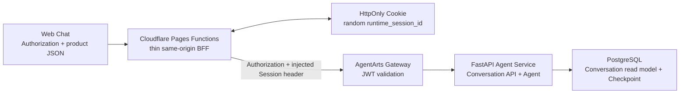
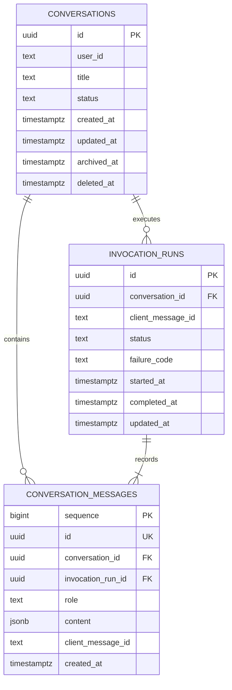

# Feature 14: Web Chat 多 Conversation 与 Runtime 提前唤醒

## 动机

当前 Web Chat 把浏览器 `localStorage` 中的 `agentarts-session-id` 同时用于：

- AgentArts Runtime 路由；
- LangGraph `thread_id`；
- 用户点击 Reset 后的新对话标识。

这三个概念的生命周期并不相同。Conversation 是用户可长期查看的产品数据；
LangGraph `thread_id` 是 durable Agent state 的 key；Runtime Session ID 只是 AgentArts
用来路由临时 execution instance 的键。继续共用一个 ID，会让“新建对话”“恢复历史”
和“Runtime 被平台回收”互相影响。

用户目前也无法：

- 查看、切换、重命名、归档或删除多个 Conversation；
- 刷新页面后恢复当前 Conversation 的可见消息；
- 在发送第一条消息前，通过本来就需要的页面初始化请求提前触发 Runtime 创建。

Feature 14 将这些身份拆开，并把进入 Chat 时的 Conversation 列表请求作为
**application-level warm-up**。它不假定 AgentArts 提供了一个有 readiness、TTL 或
延迟保证的官方“预热 API”。

## 已知平台事实

以下事实来自 AgentArts API PDF 和项目现网验证，设计可以依赖：

1. `POST /runtimes/{runtime_name}/invocations` 要求
   `X-Hw-Agentarts-Session-Id`，该值最长 64 字符。
2. 应用可以把合法的自生成 ID 直接放入该 header。首次 Invocation 会隐式创建
   Runtime execution instance。
3. 底层 instance 被平台自动回收后，再次使用同一个 ID 调用 Invocation，平台会重新
   创建 instance；应用不需要生成 replacement ID。
4. `POST /runtimes/{runtime_name}/sessions-start` 不接收 Session ID，也没有 request
   body；它由 AgentArts 生成并返回 `data.session_id`。
5. 官方 API 文档没有把 `sessions-start` 称为 pre-warm/warm-up API，也没有承诺它
   返回后 Runtime 已 ready、首条消息更快，或说明 Session TTL。

因此，`sessions-start` 是显式 lifecycle API，不是本 Feature 的正确性依赖。若未来
实测证明它有额外收益，可以在独立变更中重新评估。

## 核心决策

本 Feature 固定以下 invariant：

1. **Conversation 与 LangGraph `thread_id` 永久 1:1。**
2. **`thread_id = f"{user_id}:{conversation_id}"`，不得从 Runtime Session ID
   派生。**
3. **Runtime Session ID 是 browser-session-scoped opaque routing key，不是用户身份、
   Conversation ID、授权凭据或物理 instance ID。**
4. **Cloudflare Pages Function BFF 生成随机 Runtime Session ID，并放入 HttpOnly
   Cookie；浏览器 JavaScript 不读取、不生成、不提交该 ID。**
5. **BFF 不校验 JWT、不访问数据库、不执行业务 ownership；AgentArts Gateway 校验
   JWT，Gateway 后的 FastAPI Service 执行业务授权。**
6. **Runtime Session ID 不写 PostgreSQL，不建立 `runtime_session_leases`。**
7. **进入 Chat 时的 `GET /api/conversations` 同时完成有用的数据读取和 Runtime
   implicit start；不增加单独的 readiness/no-op API。**
8. **Sandbox 不在 Feature 14 实现，因此不提前创建 `sandbox_session_leases`。**

这意味着 Runtime cardinality 从旧方案的“每 User 一个数据库 lease”改为：

```text
一个已建立的浏览器 Cookie jar -> 一个 runtime_session_id
```

同一浏览器 profile 的多个 Tab 通常共享 Cookie，因此复用同一个 ID；同一用户在不同
浏览器、不同 profile 或不同设备上可以有多个 ID。这不影响 Conversation 正确性，因为
durable state 由 `user_id + conversation_id` 决定。

## 目标架构

图类型：**Container / Deployment Diagram（容器 / 部署图）**。用于说明 Browser、
Cloudflare BFF、AgentArts Gateway、FastAPI Runtime 和 PostgreSQL 的部署与依赖关系。



系统中不新增名为 Control Plane 的部署单元。Conversation API 就是 FastAPI Service 的
业务 API，经 AgentArts Gateway custom path 访问。BFF 只处理 HTTP 边界能力。

## 概念基础

### Conversation

Conversation 是用户界面中的一条长期聊天记录，包含标题、状态、时间和可见消息。
`conversation_id` 是 server-generated UUID，与 Runtime 的创建、回收和轮换无关。

### LangGraph `thread_id`

`thread_id` 是 LangGraph Checkpointer 的 durable state key。Service 在验证
Conversation ownership 后构造：

```python
thread_id = f"{user_id}:{conversation_id}"
```

同一 Conversation 永远使用同一个 `thread_id`。这使它可以跨 Tab、跨设备、跨 Runtime
instance 恢复。

### Runtime Session ID 与 Runtime instance

两者不是同一个东西：

| 概念 | 含义 | 生命周期 |
|------|------|----------|
| `runtime_session_id` | AgentArts 的逻辑路由键 | Cookie 存在期间复用；底层回收后仍可继续使用 |
| Runtime execution instance | AgentArts 实际启动的容器执行实例 | 可由平台启动、扩缩、回收和重建 |

同一个 `runtime_session_id` 在不同时间可能路由到不同 instance。因此它不能保存产品
身份，也不能表示“这个物理 Runtime 一直活着”。

### Runtime 与 Sandbox

| 维度 | Runtime Session | Code Interpreter Sandbox Session |
|------|-----------------|----------------------------------|
| 用途 | 让 AgentArts 路由并执行 FastAPI Agent | 隔离运行代码、命令和临时文件 |
| 普通聊天是否需要 | 需要 | 不需要 |
| 推荐作用域 | browser session routing | Conversation |
| 是否保存聊天历史 | 否 | 否 |
| 是否决定 `thread_id` | 否 | 否 |
| Feature 14 是否持久化 | 否 | 否，后续 Tool Feature 再设计 |

## Runtime Cookie Contract

BFF 使用 Web Crypto 生成 UUID v4 或等价的至少 122-bit 随机、base64url-safe ID。推荐
Cookie contract：

| 属性 | 值 | 原因 |
|------|----|------|
| Name | `pa_runtime_session` | 项目私有、语义明确 |
| Value | 随机 UUID v4 | 满足 AgentArts 字符集和 64 字符限制 |
| `HttpOnly` | 是 | JavaScript 无法读取或覆盖 |
| `Secure` | production 是 | 只经 HTTPS 发送 |
| `SameSite` | `Lax` | same-origin API 可用，并支持 OAuth 顶层回跳 |
| `Path` | `/` | Conversation、Invocation 和 callback 路径复用 |
| `Domain` | 不设置 | 保持 host-only |
| `Expires` / `Max-Age` | 不设置 | 作为 browser session cookie，不伪造平台 TTL |

BFF 对每个需要进入 AgentArts Gateway 的请求执行同一个 resolver：

1. 读取 `pa_runtime_session`；
2. 若格式合法则复用；
3. 若缺失或非法则使用 Web Crypto 生成新 ID，并在 response 写 `Set-Cookie`；
4. 删除调用方提供的 `x-hw-agentarts-session-id`；
5. 用 resolver 的 ID 覆盖 upstream header。

一旦本次请求生成了新 ID，BFF 必须在所有返回路径附加 `Set-Cookie`，包括 upstream
4xx/5xx、timeout 和 BFF 生成的 502。否则 warm-up 失败后紧接着发送的 Invocation 会再
生成一个 ID。原始 browser `Cookie` header 不转发给 Gateway；BFF 只转译出受控的
Runtime Session header。

Cookie 不是认证凭据。知道或控制该值都不能替代每次请求的 JWT。账号登出或切换时，
Client 调用显式 same-origin logout route，由 BFF 用相同 Path 和属性写
`Max-Age=0` expire Cookie；下次请求生成新 ID。

同一 Cookie 首次建立前，如果两个 Tab 完全并发发出请求，可能短暂生成两个 ID，最后一个
`Set-Cookie` 成为后续稳定值。多出的 Runtime 由平台自动回收。这是可接受的资源优化 race，
不影响数据隔离；为消除这一小段 race 引入数据库 lease 或 distributed lock 不符合成本收益。

## 为什么不持久化 Runtime lease

### Lease 是什么

Lease（租约）表示“某个主体在一段时间内占用或负责某个资源”。旧方案中的
`runtime_session_leases` 原本计划保存：

| 字段 | 原计划含义 |
|------|------------|
| `id` | lease 记录主键 |
| `user_id` | 资源属于哪个用户 |
| `runtime_session_id` | AgentArts Runtime Session ID |
| `status` | warming / ready / degraded / expired / stopping / stopped / stop_failed |
| `started_at` / `ready_at` | 启动与就绪时间 |
| `last_used_at` / `ended_at` | 最近使用与结束时间 |
| `failure_reason` | lifecycle 失败原因 |

把 lease 写入数据库通常是为了让多个应用实例协调独占、续约、接管、清理和审计。仅仅查询
AgentArts 并不能恢复应用自己定义的 ownership 和并发决策，所以在需要严格
user-scoped resource coordination 时，数据库 lease 确实可能合理。

### 为什么本 Feature 不需要

本方案没有上述协调需求：

- ID 已由共享 Cookie 自然复用；
- Runtime 被平台回收后，相同 ID 可隐式重建；
- 平台未提供可供我们可靠同步的 ready/TTL contract；
- Feature 14 不需要后台 service credential 调用 `sessions-stop`；
- Runtime ID 不参与 Conversation ownership；
- 首次多 Tab race 只浪费一个临时 instance，不破坏正确性。

若仍建立 lease 表，我们就必须维护一个无法与平台真实状态严格同步的状态机、stale owner
接管、retry worker、idle scheduler 和 stop credential。这些成本没有对应的正确性收益。

**结论：持久化 lease 的根本目的不是“才能复用 Runtime”；它只在应用必须协调 Runtime
lifecycle 时有价值。当前复用由 Cookie 完成，所以不持久化。**

## 身份与信任边界

图类型：**Data Flow / Trust Boundary Diagram（数据流 / 信任边界图）**。用于说明 JWT、
Runtime Cookie 和业务 `user_id` 分别在哪一层被信任。

```mermaid
flowchart LR
    Browser["Untrusted Browser"]
    BFF["Cloudflare BFF<br/>does not validate JWT"]
    Gateway["AgentArts Gateway<br/>validates signature/issuer/audience/expiry"]
    Service["FastAPI Service<br/>derives user_id from validated token claim"]
    DB["PostgreSQL<br/>ownership by user_id"]

    Browser -->|"Authorization: Bearer JWT"| BFF
    Browser -.->|"caller Session/User headers are untrusted"| BFF
    BFF -->|"Authorization + BFF Session header"| Gateway
    Gateway -->|"validated request"| Service
    Service -->|"user_id + conversation_id"| DB
```



生产规则：

- BFF 只转发 `Authorization`，不根据 JWT claim 做业务决策；
- Gateway 是 JWT signature、issuer、audience 和 expiry 的唯一验证者；
- FastAPI 只在请求确定来自 Gateway 后解析 Gateway 已验证的 token，使用 `sub` 作为
  canonical `user_id`；它不得信任 request body 或浏览器提供的 user header；
- FastAPI baseline 不重复做 signature verification，但必须先验证 Gateway 会转发原始
  Authorization，且 Runtime 没有绕过 Gateway 的 production public ingress；
- 如果上述任一前提不成立，Feature 14 必须停在 readiness gate，不能退回“信任浏览器
  `X-HW-AgentGateway-User-Id`”；
- local direct mode 使用显式 development auth fixture，不得在 production 启用。

## Application-level warm-up

### 为什么不用 `sessions-start`

`sessions-start` 的调用模型是“调用者不传 ID，平台返回一个 ID”。本方案的调用模型是
“BFF 先生成 Cookie ID，再用它调用业务 API”。二者可以二选一，但不能把 BFF 生成的 ID
传给 `sessions-start`。

理论上可以调用 `sessions-start` 后把平台返回值写入 Cookie，但当前文档没有证明它比
直接 Invocation 更早 ready 或更快，而且会新增 lifecycle auth、错误处理和两套 ID
生成路径。因此 baseline 不使用它。

### Warm-up 请求

进入 Chat 后，UI 本来就必须请求 Conversation 列表：

```http
GET /api/conversations
Authorization: Bearer <id_token>
Cookie: pa_runtime_session=<opaque>
```

BFF 将 Cookie 值注入 AgentArts Session header，该请求经 Gateway 进入 FastAPI。若底层
Runtime 已被回收，AgentArts 在该请求上隐式创建 instance。Conversation 数据返回后，
随后使用同一 Cookie 的 `/invocations` 通常可以复用已启动的 instance。

这是一种 useful-work warm-up，不需要 `POST /api/chat/readiness`、warming/ready 状态机或
Runtime status UI。是否真正改善首条消息 latency 必须由 spike 测量，不能从 API 名称推断。

## API Contract

所有 Personal Assistant 自定义的跨边界 JSON 字段使用 `snake_case`。BFF 为每个
production public route 提供显式 Pages Function，不暴露 catch-all contract。

| Method + Frontend path | FastAPI path | 作用 |
|------------------------|--------------|------|
| `POST /invocations` | `POST /invocations` | 发送消息，body 包含 `conversation_id` |
| `GET /api/conversations` | `GET /api/conversations` | 列表；也是 warm-up 请求 |
| `POST /api/conversations` | `POST /api/conversations` | 新建 Conversation |
| `GET /api/conversations/{conversation_id}` | 同路径 | 读取 Conversation |
| `PATCH /api/conversations/{conversation_id}` | 同路径 | 重命名或归档 |
| `DELETE /api/conversations/{conversation_id}` | 同路径 | 删除 Conversation |
| `GET /api/conversations/{conversation_id}/messages` | 同路径 | 分页读取可见历史 |
| `POST /api/conversation-imports` | 同路径 | 一次性迁移 legacy local session |
| `POST /auth/logout` | BFF-only | expire Runtime Cookie；不调用 `sessions-stop` |

不存在 BFF 专用 `/internal/chat/invocation-contexts` API，也不存在独立 Control Plane API。
所有 Conversation ownership 由 Gateway 后的 FastAPI 执行。

Invocation request：

```json
{
  "conversation_id": "6f5d2d9a-1478-4c4a-8a65-4ebd7c2e7610",
  "client_message_id": "client-generated-idempotency-key",
  "message": "你好",
  "stream": true
}
```

Runtime Session ID 不出现在 request/response JSON 或浏览器可读状态中。

## 数据模型

图类型：**ER Diagram（实体关系图）**。用于说明 Feature 14 新增业务表的关系；
LangGraph Checkpoint 表由其 library 自己管理，不在图中展开。



Feature 14 只新增：

- `conversations`；
- `conversation_messages`；
- `invocation_runs`；
- application schema migration metadata（由 migration tool 管理）。

不新增：

- `runtime_session_leases`；
- `sandbox_session_leases`；
- 为 BFF 服务的 ownership/session mapping 表。

## Message persistence contract

FastAPI Service 是 Message write model 的唯一 owner。BFF 不 tee/解析 SSE，也不写 DB。

为避免“浏览器已经收到完整答案，但 Service 尚未写入历史”的永久缺口，流式调用遵循：

1. 验证 `(user_id, conversation_id)` ownership；
2. 在发送任何 assistant token 前，原子写入 user message 和 `invocation_runs(running)`；
3. Service 流式发送 token，同时在内存累积可见 assistant content；
4. Agent 成功后，在同一 transaction 写 assistant message 并把 run 标记为
   `completed`；
5. **DB commit 成功后才发送 terminal SSE `done=true` event**；
6. 若在 commit 前失败，run 标记 `failed`；浏览器只把已看到的 partial output 视为
   interrupted，不把它当 durable history；
7. 若进程崩溃留下 `running` row，下一次取得该 Conversation execution lock 的请求将
   stale run 标记为 `interrupted`。

这样，客户端只要看到了 `done=true`，对应 assistant message 就已经 durable。若 commit
成功但 terminal event 丢失，刷新 history 仍能恢复完整答案。

## 交互流程

### 进入 Chat 与 warm-up

图类型：**Sequence Diagram（时序图）**。用于说明 Cookie 建立、Gateway JWT 验证、
Conversation 列表读取和 Runtime implicit start 的顺序。

```mermaid
sequenceDiagram
    actor User as 用户
    participant UI as Web Chat
    participant BFF as Cloudflare BFF
    participant GW as AgentArts Gateway
    participant API as FastAPI Service
    participant DB as PostgreSQL

    User->>UI: 登录并进入 Chat
    UI->>BFF: GET /api/conversations + Authorization
    BFF->>BFF: resolve or create HttpOnly Runtime Cookie
    BFF->>GW: GET custom path + Authorization + Session header
    GW->>GW: validate JWT; implicitly start Runtime if needed
    GW->>API: validated request
    API->>API: derive user_id from validated token
    API->>DB: list Conversations by user_id
    DB-->>API: page
    API-->>BFF: ConversationResponse[]
    BFF-->>UI: page + optional Set-Cookie
```

Conversation list 失败不能禁用消息输入。用户重试列表或直接发送消息时，BFF 继续使用
同一个 Cookie；Invocation 自身仍可触发 implicit start。

### 发送消息

图类型：**Sequence Diagram（时序图）**。用于说明 ownership、Checkpoint、Message
commit 与 terminal SSE event 的先后关系。

```mermaid
sequenceDiagram
    actor User as 用户
    participant UI as Web Chat
    participant BFF as Cloudflare BFF
    participant GW as AgentArts Gateway
    participant API as FastAPI Service
    participant DB as PostgreSQL
    participant LG as LangGraph

    User->>UI: 发送消息
    UI->>BFF: POST /invocations {conversation_id, client_message_id, message}
    BFF->>GW: forward + Cookie-derived Session header
    GW->>API: validated request
    API->>DB: validate ownership; insert user message + running run
    API->>LG: invoke thread_id = user_id:conversation_id
    loop token stream
        LG-->>API: token
        API-->>UI: SSE token
    end
    API->>DB: insert assistant message + complete run
    DB-->>API: commit
    API-->>UI: SSE done=true
```

### OAuth callback compatibility

发起 OAuth 时，callback helper 必须使用 BFF resolver 得到的 Runtime ID，而不是读取
浏览器 request 中已被移除的 Session header。现有短时
`pa_oauth2_callback_session` 可以保存该 ID 的 snapshot；即使主 Runtime Cookie 在授权
期间轮换，callback 仍使用发起授权时的 context。业务用户仍由 Gateway 验证的 JWT 和
signed OAuth state 决定，callback user cookie 不是授权依据。

## 范围

### 包含

- 多 Conversation sidebar、创建、切换、重命名、归档和删除；
- Conversation message read model 与页面刷新 hydration；
- `conversation_id`、`thread_id`、Runtime Session ID 的职责拆分；
- BFF 随机 HttpOnly Runtime Cookie 与 header overwrite；
- Conversation APIs 经 Gateway custom path 进入 FastAPI；
- `invocation_runs` 一致性 contract；
- versioned PostgreSQL schema migration；
- legacy `localStorage` session 的一次性 Conversation import；
- warm-up latency baseline/measurement；
- OAuth callback Runtime context 回归测试。

### 不包含

- `sessions-start` / `sessions-stop` production integration；
- Runtime lease state machine、idle scheduler、stop retry worker；
- 独立 Control Plane 服务或 BFF-to-Control-Plane internal API；
- Cloudflare Hyperdrive / BFF 直连 PostgreSQL；
- Sandbox Tool 和 `sandbox_session_leases`；
- 跨 Conversation semantic Memory；
- 把 partial SSE token 持久化为可恢复草稿。

## 数据库 migration 原则

- 使用成熟的 versioned migration tool；Implementation Plan 固定采用 Alembic，但业务
  store 继续直接使用 async psycopg，不引入 ORM；
- LangGraph Checkpointer 自有表继续由 `AsyncPostgresSaver.setup()` 管理；
- 已存在的 `oauth2_callback_states` 先纳入兼容 baseline，不破坏线上数据；
- Conversation schema 采用 additive migration，先部署 DB，再部署兼容 Service，最后
  部署 Client；
- rollback 回旧应用版本时不执行 destructive downgrade，新表由旧版本忽略；
- production migration 由现有 Service deploy GitHub Actions workflow 在
  `agentarts launch` 前执行；当前 Demo RDS 有 EIP，runner 使用 GitHub Secret
  `POSTGRES_DSN` 和 `pa_app` owner 账号连接；
- workflow 使用不取消进行中任务的 production concurrency group，保证同一时刻只有一个
  migration/deploy；迁移前确认 RDS 自动备份或 snapshot 可用；
- 若后续移除 RDS 公网 EIP，migration runner 必须迁入 VPC-connected runner/job，不得退化
  为每个 Runtime instance startup 自动抢跑 schema migration。

## 验收标准

### AC1 多 Conversation

- [ ] 用户可以创建、列出、切换、重命名、归档和删除自己的 Conversation；
- [ ] 页面刷新后从 Service 恢复列表、当前 Conversation 和可见消息；
- [ ] 用户不能读取或修改其他用户的 Conversation。

### AC2 ID invariant

- [ ] Conversation 与 `thread_id` 1:1；
- [ ] `thread_id = user_id:conversation_id`；
- [ ] Runtime Cookie ID 不进入 `thread_id`、Conversation row 或 message row；
- [ ] Runtime 被平台回收后，相同 Cookie ID 可继续调用并恢复同一 Conversation。

### AC3 Cookie 与 BFF

- [ ] 首个 Gateway-bound request 生成随机、合法的 HttpOnly Cookie；
- [ ] Cookie 使用 `Secure`、`SameSite=Lax`、`Path=/`、host-only production 属性；
- [ ] BFF 忽略并覆盖浏览器提供的 Runtime Session header；
- [ ] 同一 Cookie jar 后续请求复用同一 ID；不同 Cookie jar 使用不同 ID；
- [ ] logout/account switch expire Cookie；
- [ ] BFF 不访问 PostgreSQL、不解析 SSE、不执行 Conversation ownership。

### AC4 身份安全

- [ ] Gateway 对 root Invocation 和 Conversation custom paths 执行相同 JWT 验证；
- [ ] FastAPI 从 Gateway 已验证的 token 派生 `user_id`；
- [ ] 伪造 `X-HW-AgentGateway-User-Id` 不能跨用户读取数据；
- [ ] production Runtime 不存在绕过 Gateway 的 public ingress；
- [ ] local development auth bypass 无法在 production 配置中启用。

### AC5 Warm-up

- [ ] 进入 Chat 自动请求 Conversation list，不新增 readiness/no-op route；
- [ ] 列表请求与首条 Invocation 使用同一 Cookie ID；
- [ ] 记录 fresh-cookie 首次列表请求和首条消息 latency；
- [ ] 对比“直接发首条消息”与“先加载列表”的 p50/p95；
- [ ] 文档和 UI 不把 `sessions-start` 宣称为官方预热保证；
- [ ] warm-up 失败不阻断直接 Invocation fallback。

### AC6 Message consistency

- [ ] user message 与 running run 在首个 assistant token 前 durable；
- [ ] assistant message commit 在 terminal `done=true` 前完成；
- [ ] `client_message_id` retry 不重复写 user message或启动第二次已完成 run；
- [ ] crash/stale `running` run 可被标记为 `interrupted`；
- [ ] BFF 不写 message read model。

### AC7 Migration

- [ ] Alembic 从空库和包含现有 `oauth2_callback_states` 的库均可升级到 head；
- [ ] migration 不创建 Runtime/Sandbox lease 表；
- [ ] 旧 Service 可在新 schema 上继续运行以支持应用 rollback；
- [ ] `openapi.json` 与新增 FastAPI routes/schema 同步。

### AC8 Client 与 E2E

- [ ] E2E 覆盖创建、发送、切换、刷新恢复和删除；
- [ ] E2E 覆盖 Cookie 建立、复用、非法值轮换和 logout；
- [ ] E2E 覆盖 forged user header、跨用户 ownership 和不同设备 Cookie；
- [ ] E2E 覆盖 OAuth 发起后 Runtime Cookie 轮换的 callback context；
- [ ] history hydration 完成前不闪现错误的空白 welcome state。

## 风险与缓解

| 风险 | 等级 | 缓解 |
|------|------|------|
| Gateway 不转发原始 Authorization，Service 无法派生用户 | High | 作为 blocking spike；不得信任浏览器 user header 兜底 |
| Gateway custom path 的 auth/method 行为与 root 不一致 | High | 部署前用 GET/POST/PATCH/DELETE 和伪造 JWT 做 contract test |
| Conversation list 并未降低首条消息 latency | Medium | 把它视为必要数据请求；如实记录测量，不展示“ready”承诺 |
| 首次两个 Tab 同时生成不同 Cookie ID | Low | 接受临时重复 instance；后续以最后写入 Cookie 为准，平台自动回收孤儿 |
| Cookie 在 account switch 后复用 | High | auth lifecycle 必须调用 BFF logout/rotate route；测试 account switch |
| SSE 已发送 partial token但 DB commit 失败 | Medium | partial UI 标记 interrupted；只有 commit 后才发送 `done=true` |
| Alembic 与既有 startup DDL 冲突 | Medium | baseline 兼容现有表；分阶段删除 startup DDL；空库/旧库双路径测试 |

## Four-Question Gate

| 问题 | 结论 | 说明 |
|------|------|------|
| Is it best practice? | **Yes** | 使用 opaque HttpOnly Cookie 做非身份路由、Gateway 统一认证、Service ownership、durable business state 与 ephemeral Runtime 分离。 |
| Is it industry standard? | **Yes** | Thin BFF session cookie、API Gateway auth、REST resource API、PostgreSQL read model 和 Alembic migration 都是常见模式。 |
| Is it conventional? | **Yes** | 新成员只需理解 Browser → BFF → Gateway → FastAPI → DB；没有虚构 Control Plane、双写 BFF 或自定义 lease 状态机。 |
| Is it modern? | **Yes** | HttpOnly/SameSite cookie、zero-trust caller headers、stream commit boundary、versioned migration 与 measured optimization 符合当前实践。 |

四问均为 Yes。需要明确的 trade-off 是：同一用户跨设备不会共享 Runtime ID，首次并发 Tab
可能短暂创建两个 Runtime。由于 Runtime 是可回收的优化资源，而 Conversation state 是
durable 且 user-scoped，这两个 trade-off 不影响正确性，成本低于引入 distributed lease。

## 依赖与受影响文档

- AgentArts Gateway CUSTOM_JWT 与 PREFIX_MATCH custom path；
- PostgreSQL RDS；
- LangGraph PostgreSQL Checkpointer；
- assistant-ui remote thread integration；
- `personal-assistant-meta/architecture/api.md`；
- `personal-assistant-meta/architecture/session-state-management.md`；
- `personal-assistant-meta/architecture/auth/feature-15-calendar-oauth2-architecture.md`；
- `personal-assistant-meta/architecture/cloud-service/cloudflare/pages.md`；
- `personal-assistant-meta/architecture/cloud-service/huaweicloud/agentarts.md`。

## 参考

- AgentArts API PDF：§4.7.1.1 `StartRuntimeSession`、§4.7.1.2
  `ExecuteRuntimeWithPrefix`、§4.7.1.3 `ExecuteRuntime`、§4.7.1.7
  `StopRuntimeSession`；
- [`spike.md`](./spike.md)；
- [`plan.md`](./plan.md)；
- [`architecture/api.md`](../../../architecture/api.md)。
