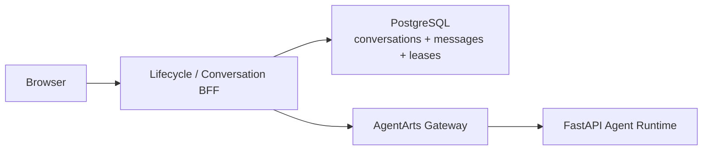
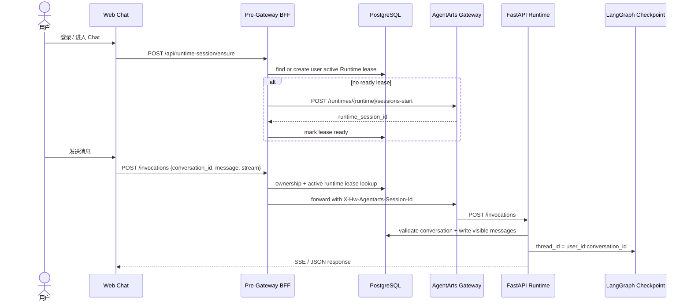
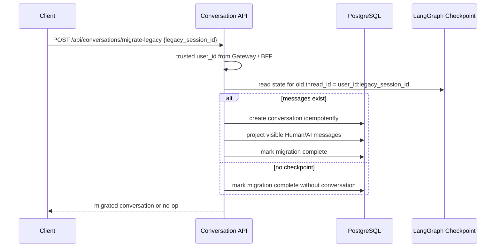
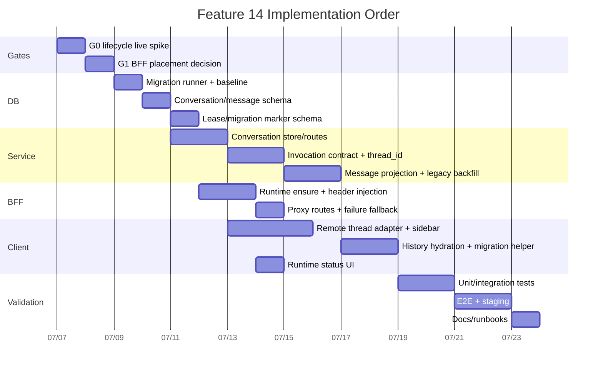

# Feature 14 Implementation Plan: 多 Conversation 与 Runtime Pre-warm

> 版本：v0.1 | 状态：Meta Draft | 日期：2026-07-07  
> Issue: [`issue.md`](./issue.md) | Spike: [`spike.md`](./spike.md)

## Executive Summary

本 Feature 将当前“一个 `agentarts-session-id` 同时代表 Runtime Session 与
LangGraph `thread_id`”的设计拆开，升级为：

- `conversation_id`：产品层 Conversation 主键；
- `thread_id = user_id:conversation_id`：LangGraph Checkpoint key；
- `runtime_session_id`：user-scoped、可替换、可预热的 AgentArts execution resource；
- `sandbox_session_id`：conversation-scoped、按需创建的代码/文件执行环境。

实现上必须先解决两个边界问题：

1. Runtime Session header resolution 必须发生在 AgentArts Gateway 前，不能只在
   FastAPI 内部做 `ensureUserRuntimeSession()`。
2. 多 Conversation UI 的 history 不能依赖 Checkpoint 自动 hydrate，必须新增
   PostgreSQL-backed Conversation metadata 与 `conversation_messages` read model。

因此本计划采用 staged implementation：先建立 DB schema migration 能力与
Conversation read/write model，再实现 Service contract 与 Client remote thread UI，
最后接入 pre-Gateway BFF 的 Runtime lifecycle/pre-warm。

## 0. Readiness Gates

Implementation 开始前必须通过以下 gate。未通过时只能继续 spike 或 prototype，不能进入
Feature 14 final implementation。

| Gate | 判定 | 要求 |
|------|------|------|
| G0 AgentArts lifecycle auth | Blocking | 用有效 CUSTOM_JWT 或目标 Runtime 支持的认证方式完成 `sessions-start` / `sessions-stop` live probe |
| G1 BFF placement | Blocking | 决定 pre-Gateway lifecycle BFF 的部署位置及 server-side lease store |
| G2 DB migration baseline | Blocking | 引入 application schema migration 机制，停止新增分散的启动时 DDL |
| G3 API compatibility | Required | 明确 `/invocations` 从旧 body 到含 `conversation_id` body 的兼容窗口 |
| G4 E2E fixtures | Required | 准备可 mock `sessions-start` failure/success 的 E2E harness |

### G1 推荐决策

目标架构是独立 pre-Gateway BFF，直接访问 PostgreSQL 并调用 AgentArts Gateway：



若当前迭代不新增独立 BFF deployable，可接受一个明确标注的 intermediate：

- Cloudflare Pages Function 继续作为 `/invocations` proxy 与 lifecycle BFF；
- Runtime active lease 使用 Cloudflare-side server-side coordination；
- Conversation API 暂时通过 Gateway custom route 进入 FastAPI，再访问 PostgreSQL；
- 该方案保留“metadata API 仍依赖 Runtime path”的 trade-off，不作为最终架构终点。

禁止方案：

- 浏览器 localStorage 作为 Runtime lease source of truth；
- FastAPI-only `ensureUserRuntimeSession()`；
- 从 `runtime_session_id` 派生 `thread_id`；
- 为每个 Conversation 创建独立 Runtime Session。

## 1. Target Runtime Flow



## 2. Database Schema Migration Plan

### 2.1 Current State

当前 Service 已使用 PostgreSQL：

- `AsyncPostgresSaver.setup()` 负责 LangGraph 内部 checkpoint tables；
- `OAuth2CallbackStore.startup()` 通过 `CREATE TABLE IF NOT EXISTS` 创建
  `oauth2_callback_states`；
- 仓库尚无统一 application schema migration 目录或 migration runner。

Feature 14 会新增多张应用业务表，不能继续把 DDL 分散在各 store 的 startup 中。

### 2.2 Migration 机制

新增 raw SQL migration runner，贴合当前 `psycopg`/SQL-first 代码风格：

| 文件 | 操作 | 说明 |
|------|------|------|
| `personal-assistant-service/app/db/__init__.py` | 新建 | DB package |
| `personal-assistant-service/app/db/migrator.py` | 新建 | 读取、校验、应用 SQL migrations |
| `personal-assistant-service/app/db/migrations/` | 新建 | versioned SQL migrations |
| `personal-assistant-service/scripts/migrate_db.py` | 新建 | 部署前显式执行 migration |
| `personal-assistant-service/tests/test_db_migrations.py` | 新建 | runner 与 schema smoke tests |

Migration runner 规则：

- 使用 `schema_migrations(version TEXT PRIMARY KEY, checksum TEXT, applied_at TIMESTAMPTZ)`；
- 每个 migration 文件命名为 `YYYYMMDDHHMM_<slug>.sql`；
- production 采用 forward-only migration，不要求自动 down migration；
- 每个 migration 在 transaction 内执行；
- 使用 PostgreSQL advisory lock 防止多实例同时 apply：
  `pg_advisory_lock(hashtext('personal_assistant_schema_migrations'))`；
- checksum 变化时 fail closed，禁止静默修改已应用 migration；
- local/test 可通过 `PA_DB_AUTO_MIGRATE=true` 在 startup 自动 apply；
- production 默认由 deploy pipeline 先执行
  `uv run python scripts/migrate_db.py up`，Service startup 只检查 schema 已就绪。

`AsyncPostgresSaver.setup()` 仍由 LangGraph 管理，不纳入本应用 migration runner。
`oauth2_callback_states` 应迁入 baseline migration；`OAuth2CallbackStore.startup()` 后续只做
schema readiness check 或调用 shared migrator，不再拥有独立 DDL。

### 2.3 Migration 文件规划

| Migration | 内容 |
|-----------|------|
| `202607070001_baseline_oauth2_callback_states.sql` | 以 `CREATE TABLE IF NOT EXISTS` 纳管现有 `oauth2_callback_states` 与 index |
| `202607070002_conversations_and_messages.sql` | 新增 `conversations`、`conversation_messages`、message indexes |
| `202607070003_runtime_and_sandbox_leases.sql` | 新增 `runtime_session_leases`、`sandbox_session_leases` 与 partial unique indexes |
| `202607070004_legacy_checkpoint_migrations.sql` | 新增 legacy checkpoint migration marker |
| `202607070005_idempotency_records.sql` | 可选，若 API create/start 需要通用 idempotency cache |

下面 SQL 示例使用 `gen_random_uuid()`。实现时必须先验证 RDS `pa_app` 角色能否使用该
函数；若需要 extension，则 migration 显式执行 `CREATE EXTENSION IF NOT EXISTS pgcrypto`。
如果目标环境不允许应用账号创建 extension，则改为 Service 生成 UUID，并移除 DB default。

### 2.4 Target Tables

#### `conversations`

```sql
CREATE TABLE conversations (
    id UUID PRIMARY KEY DEFAULT gen_random_uuid(),
    user_id TEXT NOT NULL,
    title TEXT NOT NULL DEFAULT 'New Chat',
    status TEXT NOT NULL DEFAULT 'active'
        CHECK (status IN ('active', 'archived', 'deleted')),
    created_at TIMESTAMPTZ NOT NULL DEFAULT now(),
    updated_at TIMESTAMPTZ NOT NULL DEFAULT now(),
    archived_at TIMESTAMPTZ,
    deleted_at TIMESTAMPTZ
);

CREATE INDEX idx_conversations_user_status_updated
    ON conversations (user_id, status, updated_at DESC, id DESC);
```

Ownership query 一律使用 `(user_id, id)`。不允许只凭 `conversation_id` 读写。

#### `conversation_messages`

```sql
CREATE TABLE conversation_messages (
    id UUID PRIMARY KEY DEFAULT gen_random_uuid(),
    conversation_id UUID NOT NULL REFERENCES conversations(id) ON DELETE CASCADE,
    user_id TEXT NOT NULL,
    role TEXT NOT NULL CHECK (role IN ('user', 'assistant', 'system', 'tool')),
    content JSONB NOT NULL,
    content_version INTEGER NOT NULL DEFAULT 1,
    sequence BIGINT NOT NULL,
    client_message_id TEXT,
    run_id UUID,
    status TEXT NOT NULL DEFAULT 'complete'
        CHECK (status IN ('pending', 'complete', 'failed')),
    created_at TIMESTAMPTZ NOT NULL DEFAULT now(),
    updated_at TIMESTAMPTZ NOT NULL DEFAULT now(),
    UNIQUE (conversation_id, sequence),
    UNIQUE (conversation_id, client_message_id)
        DEFERRABLE INITIALLY IMMEDIATE
);

CREATE INDEX idx_conversation_messages_conversation_sequence
    ON conversation_messages (conversation_id, sequence);
CREATE INDEX idx_conversation_messages_user_created
    ON conversation_messages (user_id, created_at DESC, id DESC);
```

`content` 保存 versioned normalized UI DTO，不保存 raw Checkpoint blob。MVP 只暴露
`user` 与 `assistant` 消息；`tool` / `system` 默认不进入普通 history response，除非后续
DTO 明确支持。

`sequence` 由 Service 在同一 transaction 内对 Conversation row 加锁后分配，避免跨 Tab
并发乱序。

#### `runtime_session_leases`

```sql
CREATE TABLE runtime_session_leases (
    id UUID PRIMARY KEY DEFAULT gen_random_uuid(),
    user_id TEXT NOT NULL,
    runtime_session_id TEXT NOT NULL UNIQUE,
    status TEXT NOT NULL
        CHECK (status IN (
            'warming', 'ready', 'degraded', 'expired',
            'stopping', 'stopped', 'stop_failed'
        )),
    started_at TIMESTAMPTZ NOT NULL DEFAULT now(),
    ready_at TIMESTAMPTZ,
    last_used_at TIMESTAMPTZ,
    ended_at TIMESTAMPTZ,
    failure_reason TEXT,
    metadata JSONB NOT NULL DEFAULT '{}'::jsonb,
    created_at TIMESTAMPTZ NOT NULL DEFAULT now(),
    updated_at TIMESTAMPTZ NOT NULL DEFAULT now()
);

CREATE UNIQUE INDEX uq_runtime_session_leases_active_user
    ON runtime_session_leases (user_id)
    WHERE status IN ('warming', 'ready', 'degraded');
CREATE INDEX idx_runtime_session_leases_user_updated
    ON runtime_session_leases (user_id, updated_at DESC);
```

Phase 1 只依赖 `user_id -> active runtime_session_id`。`started_at`、`ready_at`、
`last_used_at`、`failure_reason` 同时写入，作为 Phase 2 cleanup/observability 的基础。

#### `sandbox_session_leases`

```sql
CREATE TABLE sandbox_session_leases (
    id UUID PRIMARY KEY DEFAULT gen_random_uuid(),
    conversation_id UUID NOT NULL REFERENCES conversations(id) ON DELETE CASCADE,
    sandbox_session_id TEXT NOT NULL UNIQUE,
    status TEXT NOT NULL
        CHECK (status IN (
            'warming', 'ready', 'degraded', 'expired',
            'stopping', 'stopped', 'stop_failed'
        )),
    started_at TIMESTAMPTZ NOT NULL DEFAULT now(),
    ready_at TIMESTAMPTZ,
    last_used_at TIMESTAMPTZ,
    ended_at TIMESTAMPTZ,
    failure_reason TEXT,
    metadata JSONB NOT NULL DEFAULT '{}'::jsonb,
    created_at TIMESTAMPTZ NOT NULL DEFAULT now(),
    updated_at TIMESTAMPTZ NOT NULL DEFAULT now()
);

CREATE UNIQUE INDEX uq_sandbox_session_leases_active_conversation
    ON sandbox_session_leases (conversation_id)
    WHERE status IN ('warming', 'ready', 'degraded');
```

Sandbox 不是 Feature 14 的实现主体，但 schema 预留 cardinality，避免后续把 Sandbox ID
塞回 Conversation 主表。

#### `legacy_checkpoint_migrations`

```sql
CREATE TABLE legacy_checkpoint_migrations (
    id UUID PRIMARY KEY DEFAULT gen_random_uuid(),
    user_id TEXT NOT NULL,
    legacy_session_id_hash TEXT NOT NULL,
    conversation_id UUID REFERENCES conversations(id),
    status TEXT NOT NULL CHECK (status IN ('pending', 'complete', 'failed')),
    failure_reason TEXT,
    created_at TIMESTAMPTZ NOT NULL DEFAULT now(),
    completed_at TIMESTAMPTZ,
    UNIQUE (user_id, legacy_session_id_hash)
);
```

用于记录从旧 `agentarts-session-id` / Checkpoint 到 Conversation read model 的幂等
backfill 状态。默认存 hash，不长期保存 raw legacy session id。

### 2.5 Schema Rollout Strategy

1. Deploy migration runner and baseline migration without changing runtime behavior.
2. Apply Conversation/message/lease migrations in staging.
3. Run schema smoke test:
   - create two users；
   - create multiple conversations；
   - verify active runtime partial unique；
   - verify message sequence uniqueness；
   - verify ownership queries cannot cross users。
4. Deploy Service code that can read/write new tables but keeps old invocation body compatible.
5. Deploy Client remote thread UI.
6. After E2E and production bake time, make `conversation_id` required for new client requests.

Rollback policy:

- Schema migrations are forward-only；
- if Service rollout fails, rollback Service/Client while leaving additive tables in place；
- do not drop new tables during emergency rollback；
- data backfill is idempotent and may be retried。

## 3. Legacy Checkpoint Backfill

Feature 14 must not make existing user history disappear.

Lazy migration flow:



Important rule for current legacy UUIDs:

- Current Client generates UUID v4 `agentarts-session-id` values.
- When the legacy id is a valid UUID and belongs to the authenticated user's old
  checkpoint key, create `conversations.id = legacy_session_uuid`.
- Then the new `thread_id = user_id:conversation_id` equals the old
  `thread_id = user_id:legacy_session_id`, so no checkpoint copy is required.

If a legacy id is not a UUID, create a new `conversation_id`, backfill visible messages, and mark
Agent execution state migration as best effort. Do not delete the old checkpoint.

## 4. Service Implementation Plan

### 4.1 New Modules

| File | 操作 | 说明 |
|------|------|------|
| `app/db/migrator.py` | 新建 | migration runner |
| `app/conversations/models.py` | 新建 | DTO/Pydantic models |
| `app/conversations/store.py` | 新建 | psycopg-backed Conversation/message store |
| `app/conversations/routes.py` | 新建 | FastAPI routes under `/invocations/conversations` |
| `app/runtime_leases/store.py` | 新建 | PostgreSQL Runtime/Sandbox lease store |
| `app/runtime_leases/policy.py` | 新建 | status machine, active lease rules |
| `app/invocation_write_model.py` | 新建 | message insert + assistant completion projection |

### 4.2 Invocation Contract

Transitional request body:

```json
{
  "conversation_id": "018f0000-0000-7000-8000-000000000000",
  "message": "你好",
  "stream": true,
  "client_message_id": "optional-idempotency-key"
}
```

Implementation steps:

1. Extend `InvocationRequest` with optional `conversation_id` and `client_message_id`.
2. During compatibility window, if `conversation_id` is missing:
   - use legacy migration/default Conversation fallback；
   - log deprecation；
   - do not derive new `thread_id` from `runtime_session_id` for new clients。
3. After Client rollout, make `conversation_id` required and regenerate `openapi.json`.
4. Rename internal parameters from `session_id` to `runtime_session_id` where they refer to
   AgentArts Runtime, and pass `conversation_id` to `AgentHandler._build_config()`.
5. Change `_build_config()` to:

```python
thread_id = f"{user_id}:{conversation_id}"
```

6. Keep `AgentArtsRuntimeContext.set_session_id(runtime_session_id)` for AgentArts SDK and
   OAuth2 identity flows.

### 4.3 Message Write Model

For each invocation:

1. Validate `(user_id, conversation_id)` ownership and status.
2. Acquire per-conversation serialization:
   - MVP: transaction locks the Conversation row while assigning message sequence；
   - streaming Agent execution may use an additional run status/advisory lock to avoid
     concurrent writes to the same `thread_id`。
3. Insert user message with `client_message_id` if provided.
4. Invoke Agent with `thread_id = user_id:conversation_id`.
5. Accumulate assistant visible response during streaming.
6. On completion, insert assistant message from trusted Service output.
7. On error after partial stream, insert failed assistant message only if UI needs replay/debug;
   otherwise leave user message complete and surface error state.

The browser is never allowed to POST assistant messages directly.

### 4.4 Conversation API

Service routes, if implemented inside Runtime path:

```text
POST   /invocations/conversations
GET    /invocations/conversations
GET    /invocations/conversations/{conversation_id}
PATCH  /invocations/conversations/{conversation_id}
DELETE /invocations/conversations/{conversation_id}
GET    /invocations/conversations/{conversation_id}/messages
POST   /invocations/conversations/migrate-legacy
```

Public BFF routes may expose cleaner same-origin aliases:

```text
POST   /api/conversations
GET    /api/conversations
PATCH  /api/conversations/{conversation_id}
DELETE /api/conversations/{conversation_id}
GET    /api/conversations/{conversation_id}/messages
POST   /api/conversations/migrate-legacy
```

DTO rules:

- list uses cursor pagination；
- messages use stable ascending `sequence` order；
- message response includes `message_id`, `role`, `content`, `created_at`, `next_cursor`；
- raw Checkpoint payload is never returned；
- deleted/archived status is enforced server-side；
- all routes derive `user_id` from trusted Gateway/BFF identity, never from request body。

### 4.5 Runtime Lease Store

If the selected BFF can access PostgreSQL, implement active Runtime lease in
`runtime_session_leases`.

`ensureUserRuntimeSession(user_id)` algorithm:

1. Query active lease by `user_id`.
2. If status is `ready` and not stale, return it.
3. If no active lease, insert `warming` lease placeholder under partial unique constraint.
4. Call `sessions-start` with short timeout outside long DB transaction.
5. On success, update `runtime_session_id`, `status=ready`, `ready_at`, `last_used_at`.
6. On timeout/error, set `status=degraded`, `failure_reason`; invocation can still use
   implicit creation fallback.
7. Concurrent callers that lose the insert race poll/read the existing active lease.

If the selected BFF cannot access PostgreSQL, implement this algorithm in its server-side store
and write PostgreSQL lease history later through a trusted Service endpoint. That is an
intermediate trade-off and must be documented in the PR.

### 4.6 OpenAPI

Because request/response schemas change, implementation must run:

```bash
cd personal-assistant-service
uv run python scripts/generate_openapi.py
```

Commit expected `openapi.json` diff with Service changes.

## 5. BFF / Cloudflare Pages Function Plan

### 5.1 Responsibilities

The pre-Gateway BFF owns:

- `POST /api/runtime-session/ensure`；
- runtime session lookup / creation / degraded fallback；
- injecting `X-Hw-Agentarts-Session-Id` before forwarding `/invocations`；
- forwarding `Authorization` and trusted user headers；
- preventing browser access to AgentArts management credentials；
- mapping public `/api/conversations/*` to selected backend route。

### 5.2 Required Environment

| Env / Secret | 用途 |
|--------------|------|
| `AGENTARTS_INVOCATIONS_URL` | Existing Gateway invocation URL |
| `AGENTARTS_RUNTIME_NAME` | Runtime name for lifecycle paths |
| `AGENTARTS_BEARER_TOKEN` or equivalent token source | `sessions-start` / `sessions-stop` auth |
| `RUNTIME_PREWARM_TIMEOUT_MS` | bounded pre-warm timeout |
| `RUNTIME_IDLE_TIMEOUT_SECONDS` | idle cleanup policy |
| BFF store binding | PostgreSQL access, Durable Object, or selected server-side store |

### 5.3 Proxy Changes

Current `functions/invocations/[[path]].js` forwards caller-provided
`x-hw-agentarts-session-id`. Feature 14 changes this:

1. Client stops sending Runtime Session header.
2. BFF resolves active user Runtime Session server-side.
3. BFF overwrites `x-hw-agentarts-session-id` on forwarded Gateway request.
4. BFF refuses unsupported lifecycle/custom proxy paths.
5. BFF preserves SSE streaming behavior and response headers.

Tests must cover:

- forwarded header is BFF-owned；
- stale client-provided runtime session header is ignored；
- pre-warm degraded still forwards with fallback session id；
- upstream errors are not retried after Agent may have received the invocation。

## 6. Client Implementation Plan

### 6.1 Runtime Integration

Replace `useLocalRuntime(chatAdapter)` with assistant-ui remote thread integration:

- `useRemoteThreadListRuntime` or equivalent remote thread runtime；
- `remoteId = conversation_id`；
- `ThreadHistoryAdapter` loads `conversation_messages`；
- localStorage no longer stores `agentarts-session-id` as Conversation truth。

`src/lib/chat/session.ts` becomes legacy migration helper only:

- read old `agentarts-session-id` once；
- call `POST /api/conversations/migrate-legacy`；
- clear or mark migrated after server success；
- never use it as new Runtime Session source of truth。

### 6.2 UI Work

| Area | Changes |
|------|---------|
| Sidebar | Conversation list, active item, archive/delete affordances |
| New Chat | creates server Conversation, does not reset Runtime Session |
| Rename | PATCH title |
| Delete/Archive | updates status and removes from active list |
| History hydration | skeleton/loading state; no false empty welcome state |
| Runtime status | warming / ready / degraded indicator, non-blocking |
| Error states | retryable history load error, pre-warm degraded fallback |

Design constraints:

- Use existing assistant-ui/shadcn/Radix/Lucide patterns；
- no feature-explainer text inside the app；
- text must fit on mobile and desktop；
- do not make local Zustand a duplicate Conversation database。

### 6.3 Client API Modules

| File | 操作 |
|------|------|
| `src/lib/conversations/api.ts` | 新建 Conversation API client |
| `src/lib/conversations/adapter.ts` | 新建 assistant-ui remote adapter |
| `src/lib/runtime-session/api.ts` | 新建 pre-warm ensure client |
| `src/components/chat/ConversationSidebar.tsx` | 新建/改造 |
| `src/components/RuntimeProvider.tsx` | 改为 remote thread runtime |
| `src/lib/chat/chat-api-client.ts` | body 增加 `conversation_id`，删除 client Runtime Session header |
| `src/lib/chat/session.ts` | 降级为 legacy migration helper |
| `src/components/chat/ResetSessionButton.tsx` | 替换为 New Chat / Archive semantics |

## 7. Infra / Deployment Plan

No new HuaweiCloud RDS resource is required if Feature 1.2 RDS is already live.

Required deployment changes:

- Add Service DB migration command to deployment/runbook before Runtime deploy；
- ensure production `POSTGRES_DSN` points to `pa_app` with `sslmode=require`；
- configure BFF lifecycle secrets and runtime name；
- if choosing independent BFF, add its deploy target and network/security runbook；
- if choosing Cloudflare-side server-side store, document binding creation and cleanup；
- do not place `.agentarts_config.yaml` in Infra ownership。

Validation commands:

```bash
cd personal-assistant-infra
tofu fmt -check -recursive
tofu validate
tofu plan
```

Only needed if HCL changes are introduced. Schema migrations are Service deployment work, not
OpenTofu RDS resource changes.

## 8. E2E Plan

Add feature tests under:

```text
personal-assistant-e2e/tests/features/test_feature_14_multi_session_runtime_prewarm.py
```

Required scenarios:

| Scenario | Verifies |
|----------|----------|
| create two Conversations and switch | message/context isolation |
| send message, refresh, hydrate history | `conversation_messages` read model |
| pre-warm success before first message | ready status and reused Runtime Session |
| pre-warm failure | degraded status and implicit fallback |
| multi-tab ensure | max one active Runtime lease per user |
| two users | no Conversation/message/Runtime lease leakage |
| delete/archive | UI removal, Runtime not stopped |
| legacy migration | old localStorage session becomes Conversation |
| concurrent same Conversation sends | serialization/rejection behavior |

Mocking strategy:

- Service unit tests mock Agent and DB store；
- Client tests mock Conversation/BFF APIs；
- E2E can mock AgentArts lifecycle endpoint at BFF boundary for CI；
- staging manual run uses real AgentArts `sessions-start` / `sessions-stop` after G0 passes。

## 9. Implementation Order



## 10. Task Breakdown

### Service

- [ ] Add DB migrator and `scripts/migrate_db.py`.
- [ ] Move `oauth2_callback_states` DDL into baseline migration.
- [ ] Add `conversations` and `conversation_messages` schema.
- [ ] Add `runtime_session_leases`, `sandbox_session_leases`, migration marker schema.
- [ ] Implement Conversation store and routes.
- [ ] Extend `/invocations` request schema with `conversation_id`.
- [ ] Change LangGraph config to `thread_id = user_id:conversation_id`.
- [ ] Keep Runtime Session ID only as AgentArts routing/session context.
- [ ] Project user/assistant visible messages into `conversation_messages`.
- [ ] Implement legacy checkpoint migration/backfill.
- [ ] Generate and commit `openapi.json`.
- [ ] Add unit/integration tests for ownership, messages, leases and migrations.

### BFF / Client Functions

- [ ] Implement `POST /api/runtime-session/ensure`.
- [ ] Implement server-side active Runtime lease coordination.
- [ ] Inject `x-hw-agentarts-session-id`; ignore stale client-provided values.
- [ ] Add lifecycle start/stop API client and timeout handling.
- [ ] Preserve SSE streaming behavior in proxy.
- [ ] Add tests for success, degraded fallback, unsupported paths and auth forwarding.

### Client

- [ ] Replace local runtime with assistant-ui remote thread runtime.
- [ ] Add Conversation sidebar/list/create/switch/rename/archive/delete.
- [ ] Add `ThreadHistoryAdapter` or equivalent message hydration.
- [ ] Stop using `agentarts-session-id` as active Conversation identity.
- [ ] Add legacy migration helper for old localStorage session.
- [ ] Add runtime pre-warm status UI.
- [ ] Update/reset Feature 13 UI semantics to New Chat.
- [ ] Add Vitest coverage for adapters, history hydration races and migration helper.

### E2E / Docs

- [ ] Add Feature 14 E2E suite.
- [ ] Update specs and architecture docs listed in `issue.md`.
- [ ] Update Service/Client README for new env and migration commands.
- [ ] Update deployment runbook with DB migration step and BFF lifecycle secrets.

## 11. Verification Commands

Service:

```bash
cd personal-assistant-service
uv sync
uv run python scripts/migrate_db.py up --dry-run
uv run ruff check .
uv run ruff format --check .
uv run pytest tests/
uv run python scripts/generate_openapi.py
```

Client:

```bash
cd personal-assistant-client
npm ci
npm run test
npm run build
```

E2E:

```bash
cd personal-assistant-e2e
uv sync
uv run ruff check .
uv run ruff format --check .
uv run pytest -m feature
```

Infra, only if HCL changes:

```bash
cd personal-assistant-infra
tofu fmt -check -recursive
tofu validate
tofu plan
```

Manual staging:

- Run valid `sessions-start` / `sessions-stop` probe.
- Confirm one user has at most one active Runtime lease.
- Confirm two users never share Runtime Session IDs.
- Measure first message latency with and without pre-warm.
- Verify rollback leaves additive schema intact and old invocation path still works during
  compatibility window.

## 12. Risks and Mitigations

| Risk | Severity | Mitigation |
|------|:------:|------------|
| BFF cannot access chosen server-side lease store | High | G1 blocks implementation; choose independent BFF or Cloudflare-side durable store before coding |
| Runtime lifecycle API auth remains blocked | High | G0 live spike with valid CUSTOM_JWT before freezing parser and status semantics |
| DB migrations run concurrently from multiple Runtime instances | High | advisory lock + schema_migrations checksum |
| Message read model drifts from Checkpoint | High | Service-only assistant writes + reconciliation/backfill tests |
| Streaming response fails after user message persisted | Medium | mark run status and expose retry/error state; do not replay non-idempotent invocation automatically |
| Same Conversation receives concurrent sends | High | per-conversation serialization or explicit 409 busy response |
| Legacy checkpoint copy is hard | Medium | for UUID legacy sessions, reuse old UUID as `conversation_id` so thread key remains unchanged |
| Metadata route through Runtime causes unwanted Runtime usage | Medium | document intermediate trade-off; target independent BFF |
| Partial unique active lease blocks replacement after stop failure | Medium | active statuses limited to `warming`, `ready`, `degraded`; terminal/retry statuses do not block replacement |
| Client shows empty state before history loads | Medium | explicit hydration skeleton/error state and race cancellation |

## 13. Acceptance Criteria Mapping

| AC | Covered By |
|----|------------|
| AC1 多 Conversation 列表与切换 | §4.4, §6, §8 |
| AC2 ID 与 cardinality invariant | §1, §2.4, §4.2, §5 |
| AC3 User Runtime pre-warm | §5, §8 |
| AC4 失败降级 | §5.3, §8, §12 |
| AC5 幂等与并发 | §2.4, §4.3, §4.5 |
| AC6 删除与资源回收 | §4.4, §5, §10 |
| AC7 安全与数据隔离 | §4.4, §5.3, §8 |
| AC8 E2E | §8, §11 |
| AC9 Message history 与 Checkpoint | §2.4, §3, §4.3, §6.1 |
| AC10 Pre-warm 资源策略 | §4.5, §5 |

## 14. Four-Question Gate

| Question | Answer | 说明 |
|----------|:------:|------|
| Is it best practice? | Yes | 将 durable Conversation、Agent Checkpoint、Runtime lease 与 Sandbox lease 分层，避免把临时 execution resource 当业务状态。 |
| Is it industry standard? | Yes | BFF 注入平台 header、PostgreSQL read model、server-side lease coordination、versioned DB migration 都是主流 production 模式。 |
| Is it conventional? | Yes | 新成员可以按 Conversation API、message table、migration runner、runtime lease state machine 理解系统职责。 |
| Is it modern? | Yes | durable checkpoint + UI read model + async pre-warm + resource lease + remote thread runtime 符合现代 Agent app 架构。 |
