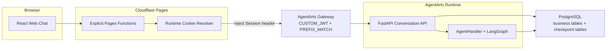
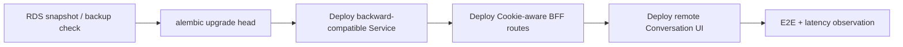
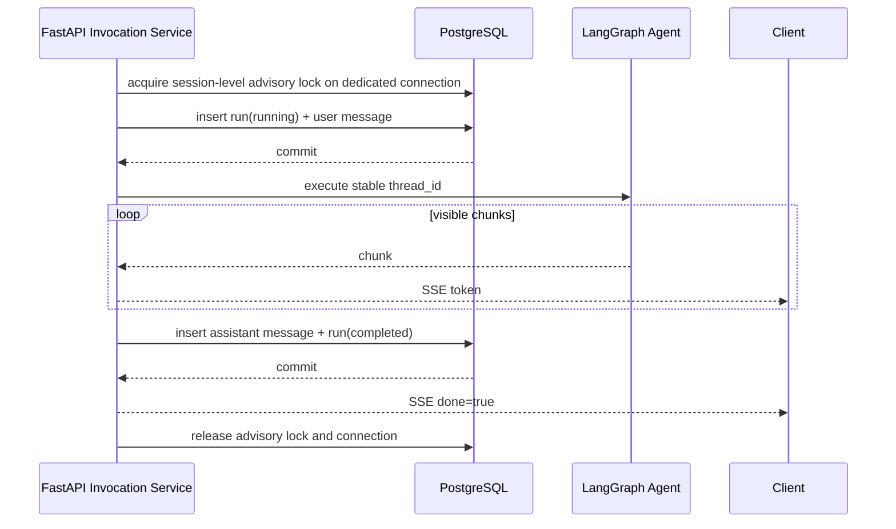

# Feature 14 Implementation Plan: 多 Conversation 与 Runtime 提前唤醒

> 版本：v0.2 | 状态：Meta Draft | 日期：2026-07-13
> Issue: [`issue.md`](./issue.md) | Spike: [`spike.md`](./spike.md)

## Executive Summary

本计划把当前一个 browser-generated `agentarts-session-id` 同时承担 Conversation、
LangGraph state 和 Runtime routing 的实现拆成三层：

| ID | Owner | 作用域 | 持久化位置 |
|----|-------|--------|------------|
| `conversation_id` | FastAPI Service | User + Conversation | PostgreSQL |
| `thread_id = user_id:conversation_id` | FastAPI Service | Conversation | LangGraph Checkpoint |
| `runtime_session_id` | Cloudflare BFF | Browser session | HttpOnly Cookie |

目标路径只有现有组件：

```text
Browser -> Cloudflare Pages Function -> AgentArts Gateway -> FastAPI -> PostgreSQL
```

不新增独立 Control Plane，不新增 BFF internal API，不建立 Runtime/Sandbox lease 表，
不把 `sessions-start` 接入 production。进入 Chat 时本来就需要的
`GET /api/conversations` 使用 Cookie Session ID 经 Gateway 进入 Runtime，从而把可能的
cold start 移到用户发送第一条消息之前。这是 application-level warm-up，效果以实测为准。

## 0. Readiness Gates

### Blocking gates

| Gate | 必须证明的事实 | 失败处理 |
|------|----------------|----------|
| G0 Gateway identity | CUSTOM_JWT 对 root 和 custom path 都校验 signature、issuer、audience、expiry；原始 Authorization 可在 FastAPI 读取；production Runtime 没有绕过 Gateway 的 public ingress | 停止实现，不得信任浏览器 user header 兜底 |
| G1 Gateway routing | PREFIX_MATCH 能把 Feature 14 所需 GET/POST/PATCH/DELETE route 转到 FastAPI，且 Session header 在所有 route 上生效 | 停止 API 实现，先修正 Gateway access configuration |
| G2 DB migration | Alembic 能从空库和当前 production-like schema 升级；现有 OAuth callback rows 保留 | 不部署 Service/Client |

### Required compatibility gates

| Gate | 要求 |
|------|------|
| G3 Invocation compatibility | 先允许 legacy body 缺少 `conversation_id`，完成 Client rollout 后再改为 required |
| G4 OAuth callback | callback Session context 来自 BFF Cookie resolver，不再读取 browser-provided Runtime header |
| G5 Local development | Vite direct proxy 为 FastAPI 注入 local-only Session/User fixture；Pages preview 验证真实 Cookie path |

### Optimization gate

| Gate | 要求 |
|------|------|
| G6 Warm-up measurement | 用 fresh Cookie 对比“直接首条 Invocation”和“先 GET Conversation list 再 Invocation”的 p50/p95；无收益时如实记录，不增加伪 ready 状态 |

`sessions-start` live probe 不再是 Feature 14 blocking gate。它只可作为 G6 的可选第三个
实验组，不改变 production design。

## 1. Target Architecture

图类型：**Component Diagram（组件图）**。用于说明各现有组件在 Feature 14 中新增的
职责与禁止职责。



### Responsibility table

| Component | Owns | Must not own |
|-----------|------|--------------|
| React Client | UI state, selected Conversation, JWT acquisition, API adapters | Runtime ID, ownership decisions, durable history truth |
| Cloudflare BFF | same-origin routing, opaque Cookie lifecycle, Session header overwrite, auth forwarding, SSE pass-through | JWT validation, DB access, Conversation CRUD logic, SSE parsing |
| AgentArts Gateway | production JWT validation, Runtime routing, platform instance lifecycle | Conversation ownership or message persistence |
| FastAPI Service | trusted `user_id` derivation after Gateway, CRUD, ownership, Agent invocation, Message write model | generating/persisting browser Runtime ID |
| PostgreSQL | Conversation metadata/messages/runs and LangGraph checkpoint | Runtime readiness/TTL mirror |

## 2. Runtime Cookie And Warm-up Flow

### 2.1 Cookie resolver

Create `functions/_shared/runtime-session.js` with pure helpers and one request resolver.

Target constant values:

```js
const RUNTIME_SESSION_COOKIE = "pa_runtime_session";
const RUNTIME_SESSION_HEADER = "x-hw-agentarts-session-id";
const RUNTIME_SESSION_PATTERN = /^[A-Za-z0-9_-]{1,64}$/;
```

Resolver algorithm:

1. Parse the named Cookie using a cookie parser, not substring matching.
2. Reuse only a value matching the platform pattern and project length policy.
3. Otherwise call `crypto.randomUUID()`; do not use `Math.random()`.
4. Delete any inbound Runtime Session header before creating upstream headers.
5. Set the resolved value as the only upstream Runtime Session header.
6. When a new value was generated, append a host-only session Cookie on every response path,
   including upstream 4xx/5xx, timeout and a BFF-generated 502:

```http
Set-Cookie: pa_runtime_session=<uuid>; Path=/; HttpOnly; Secure; SameSite=Lax
```

7. Do not set `Domain`, `Expires` or `Max-Age`.
8. Do not forward the browser's raw `Cookie` header to Gateway; translate only the resolved value
   into the controlled Runtime Session header.
9. Never include the value in JSON, DOM state, analytics or normal logs. For correlation, log a
   one-way short hash only.

Local Pages preview may omit `Secure` only under an explicit local environment flag. Production
must fail closed if secure Cookie configuration is disabled.

### 2.2 Route behavior

Every Gateway-bound Pages Function uses the same resolver. The public API remains explicit;
there is no catch-all `/api/*` function.

| Capability | Frontend path | Pages Function | Gateway full Runtime path | FastAPI path |
|------------|---------------|----------------|---------------------------|--------------|
| Invoke | `POST /invocations` | `functions/invocations.js` | `/runtimes/personal-assistant/invocations` | `POST /invocations` |
| Conversation collection | `GET/POST /api/conversations` | `functions/api/conversations.js` | `/runtimes/personal-assistant/invocations/api/conversations` | `GET/POST /api/conversations` |
| Conversation item | `GET/PATCH/DELETE /api/conversations/{conversation_id}` | `functions/api/conversations/[conversation_id].js` | `/runtimes/personal-assistant/invocations/api/conversations/{conversation_id}` | same suffix |
| Messages | `GET /api/conversations/{conversation_id}/messages` | `functions/api/conversations/[conversation_id]/messages.js` | `/runtimes/personal-assistant/invocations/api/conversations/{conversation_id}/messages` | same suffix |
| Legacy import | `POST /api/conversation-imports` | `functions/api/conversation-imports.js` | `/runtimes/personal-assistant/invocations/api/conversation-imports` | `POST /api/conversation-imports` |
| Logout | `POST /auth/logout` | `functions/auth/logout.js` | N/A | N/A |

`POST /auth/logout` writes the same Cookie attributes with `Max-Age=0` and returns `204`. It does
not call `sessions-stop`; MSAL logout remains Client-owned. Account switch must execute this route
before the next authenticated product request.

### 2.3 Warm-up sequence

图类型：**Sequence Diagram（时序图）**。用于说明初次加载如何同时完成业务读取与
Runtime implicit start。

```mermaid
sequenceDiagram
    actor User as 用户
    participant UI as React Client
    participant BFF as Pages Function
    participant GW as AgentArts Gateway
    participant API as FastAPI
    participant DB as PostgreSQL

    User->>UI: 进入 Chat
    UI->>BFF: GET /api/conversations + Authorization
    BFF->>BFF: Cookie missing -> crypto.randomUUID()
    BFF->>GW: custom path + JWT + Session header
    GW->>GW: validate JWT; implicit Runtime start if needed
    GW->>API: GET /api/conversations
    API->>DB: list by trusted user_id
    DB-->>API: page
    API-->>BFF: response
    BFF-->>UI: response + Set-Cookie

    User->>UI: 发送第一条消息
    UI->>BFF: POST /invocations
    BFF->>GW: same Cookie-derived Session header
    GW->>API: reuse or recreate Runtime
```

There is no `/api/chat/readiness`, no `runtime_status`, and no warming/ready/degraded UI. A
Conversation list failure is displayed as a retryable list error but does not disable direct chat
Invocation.

### 2.4 Multi-Tab and account rules

- Established Cookie jars are shared across tabs by the browser.
- A simultaneous first request from two tabs can generate two transient IDs; last Cookie write wins.
- This race is not solved with a database lock because it cannot affect ownership or durable state.
- Different browsers/devices intentionally receive different IDs for the same user.
- Logout/account switch expires the Cookie. Closing the browser follows browser session Cookie
  behavior; the app does not claim a platform TTL.

## 3. Identity And Authorization

### 3.1 Production trust chain

1. Client obtains an Entra ID token and sends `Authorization: Bearer <token>`.
2. BFF forwards Authorization unchanged. It does not validate or decode for authorization.
3. BFF strips caller-provided Runtime Session header and target-state user header.
4. AgentArts Gateway validates JWT signature, issuer, audience and expiry.
5. FastAPI receives the request only after Gateway validation and parses the validated JWT payload.
6. FastAPI uses required `sub` as canonical `user_id`, sets `AgentArtsRuntimeContext.user_id`, and
   applies all Conversation queries with that ID.

FastAPI does not perform a second signature verification in the baseline because Gateway is the
authentication boundary. This is valid only if G0 proves the original Authorization is forwarded and
there is no public bypass. Optional defense-in-depth validation can be a separate change.

### 3.2 Header migration

Current Client derives `X-HW-AgentGateway-User-Id` without signature validation. Migration order:

1. Add Service identity extraction from Gateway-validated Authorization.
2. Add mismatch tests proving a forged user header is ignored/rejected.
3. Stop using `extract_gateway_user_id()` as the production ownership source.
4. Remove Client emission and BFF forwarding of the user header.
5. Keep explicit local fixture support behind development-only settings.

Do not combine step 4 before step 1 is deployed.

### 3.3 OAuth callback integration

`applyCallbackContextCookies()` currently reads the Session header from the browser request. After
Feature 14 the browser no longer sends it. Change the helper contract to accept the BFF-resolved
`runtime_session_id` explicitly.

The callback-only snapshot remains useful:

```text
pa_runtime_session             current browser routing key
pa_oauth2_callback_session     routing key captured when authorization started
```

The callback uses the snapshot so a logout/account switch during the provider redirect does not
silently attach callback processing to a new Runtime context. Signed state and the Gateway-validated
Authorization token remain the ownership checks; `pa_oauth2_callback_user` is not authoritative and
can be removed after Feature 15 compatibility tests pass.

## 4. Database Schema Migration Plan

### 4.1 Migration tool decision

Use **Alembic** for application-owned schema versioning. The Service continues to use async psycopg
for queries; Alembic is not an ORM adoption.

Why Alembic instead of a custom SQL runner:

- standard revision graph and `current`/`heads` inspection;
- established PostgreSQL/psycopg support;
- repeatable empty-DB and existing-DB upgrades;
- lower maintenance than custom checksum, locking and failure recovery code.

Add:

| File | Purpose |
|------|---------|
| `personal-assistant-service/alembic.ini` | Alembic configuration |
| `personal-assistant-service/migrations/env.py` | load `POSTGRES_DSN`, offline/online runner |
| `personal-assistant-service/migrations/script.py.mako` | revision template |
| `personal-assistant-service/migrations/versions/*` | immutable revisions |
| `personal-assistant-service/tests/test_migrations.py` | empty/existing schema tests |

Add `alembic` and `sqlalchemy` as deployment dependencies. No SQLAlchemy model layer is introduced.

### 4.2 Existing database state

Application-owned state currently includes `oauth2_callback_states`, created by startup DDL.
LangGraph Checkpointer tables are library-owned and remain outside Alembic.

Revision sequence:

| Revision | Contents |
|----------|----------|
| `20260713_01_app_schema_baseline` | Adopt/create `oauth2_callback_states` compatibly; no data rewrite |
| `20260713_02_conversations` | Create `conversations`, `invocation_runs`, `conversation_messages`, indexes and constraints |

The baseline must work both when `oauth2_callback_states` already exists and when starting from an
empty database. If an existing table has incompatible columns or constraints, migration fails with a
diagnostic instead of silently stamping it as compatible. After all environments reach the baseline,
remove startup ownership of its DDL in a later compatible commit; startup may check schema readiness
but must not mutate production schema.

### 4.3 Target tables

#### `conversations`

```sql
CREATE TABLE conversations (
    id UUID PRIMARY KEY,
    user_id TEXT NOT NULL,
    title TEXT NOT NULL,
    status TEXT NOT NULL DEFAULT 'active'
        CHECK (status IN ('active', 'archived', 'deleted')),
    created_at TIMESTAMPTZ NOT NULL DEFAULT now(),
    updated_at TIMESTAMPTZ NOT NULL DEFAULT now(),
    archived_at TIMESTAMPTZ,
    deleted_at TIMESTAMPTZ
);

CREATE INDEX conversations_user_updated_idx
    ON conversations (user_id, status, updated_at DESC, id DESC);
```

All item reads and mutations use both `id` and trusted `user_id`. `DELETE` is a soft delete in the
request path; physical cleanup and Checkpoint retention are separate jobs/features.

#### `invocation_runs`

```sql
CREATE TABLE invocation_runs (
    id UUID PRIMARY KEY,
    conversation_id UUID NOT NULL REFERENCES conversations(id),
    client_message_id TEXT NOT NULL,
    status TEXT NOT NULL
        CHECK (status IN ('running', 'completed', 'failed', 'interrupted')),
    failure_code TEXT,
    started_at TIMESTAMPTZ NOT NULL DEFAULT now(),
    completed_at TIMESTAMPTZ,
    updated_at TIMESTAMPTZ NOT NULL DEFAULT now(),
    UNIQUE (conversation_id, client_message_id)
);

CREATE INDEX invocation_runs_stale_idx
    ON invocation_runs (status, updated_at)
    WHERE status = 'running';
```

The unique key makes an invocation retry idempotent. A completed retry reads the existing assistant
message; a running retry reports/reconnects according to the API contract rather than starting a
second Agent run.

#### `conversation_messages`

```sql
CREATE TABLE conversation_messages (
    sequence BIGINT GENERATED ALWAYS AS IDENTITY PRIMARY KEY,
    id UUID NOT NULL UNIQUE,
    conversation_id UUID NOT NULL REFERENCES conversations(id),
    invocation_run_id UUID REFERENCES invocation_runs(id),
    role TEXT NOT NULL CHECK (role IN ('user', 'assistant', 'system', 'tool')),
    content JSONB NOT NULL,
    client_message_id TEXT,
    created_at TIMESTAMPTZ NOT NULL DEFAULT now()
);

CREATE INDEX conversation_messages_page_idx
    ON conversation_messages (conversation_id, sequence);

CREATE UNIQUE INDEX conversation_messages_client_user_idx
    ON conversation_messages (conversation_id, client_message_id)
    WHERE role = 'user' AND client_message_id IS NOT NULL;

CREATE UNIQUE INDEX conversation_messages_run_role_idx
    ON conversation_messages (invocation_run_id, role)
    WHERE invocation_run_id IS NOT NULL AND role IN ('user', 'assistant');
```

`sequence` provides a stable cursor and ordering. `content JSONB` preserves structured message parts
without exposing LangGraph's internal checkpoint format.

### 4.4 Deliberately absent tables

The migration must not create:

- `runtime_session_leases`;
- `sandbox_session_leases`;
- `idempotency_records` separate from `invocation_runs`;
- a BFF user/session mapping table;
- a legacy Checkpoint copy table unless the implementation spike proves it is necessary.

### 4.5 Rollout and rollback

图类型：**Deployment Diagram（部署顺序图）**。用于说明 schema、Service 和 Client 的
兼容发布顺序。



Rules:

- add a non-cancelling production `concurrency` group to
  `.github/workflows/deploy-service-to-agentarts.yml` so two main pushes cannot migrate/deploy in
  parallel;
- in that workflow, install the locked Service environment and run `uv run alembic upgrade head`
  after image build/push but before `agentarts launch`;
- the current Demo RDS has an EIP, and the workflow already receives GitHub Secret
  `POSTGRES_DSN`; run migration from the GitHub-hosted runner with the non-admin database owner
  `pa_app` and `sslmode=require`;
- if RDS public access is removed, move this exact one-shot step to a VPC-connected runner/job;
  never replace it with every Runtime instance racing migration during startup;
- revisions are immutable after any shared environment applies them;
- migrations are additive and transactional where PostgreSQL permits;
- application rollback does not run `alembic downgrade`; the old Service ignores new tables;
- destructive column/table cleanup requires a later expand/contract migration;
- deployment fails if `alembic current` is not the expected head;
- test both empty DB and a fixture matching current production schema.

## 5. Service Implementation Plan

### 5.1 Module layout

| File | Operation | Purpose |
|------|-----------|---------|
| `app/auth.py` | modify | derive production `user_id` from Gateway-validated Authorization; retain local fixture path |
| `app/conversations/models.py` | add | Pydantic Request/Response/Event models |
| `app/conversations/store.py` | add | async psycopg CRUD, ownership and message pagination |
| `app/conversations/service.py` | add | business rules, import and status transitions |
| `app/conversations/routes.py` | add | `/api/conversations*` routes |
| `app/invocations/service.py` | add/refactor | run ledger, idempotency, stream commit boundary |
| `app/main.py` | modify | include routers and keep transport concerns thin |
| `app/agent_handler.py` | modify | accept `conversation_id`; build stable `thread_id` |

Before implementation, run GitNexus impact analysis for every modified function/class as required by
the repository instructions.

### 5.2 Pydantic and JSON naming

Follow `architecture/api.md`:

- Pydantic classes use PascalCase plus `Request`, `Response`, `Event`, `Error`;
- Personal Assistant-owned wire fields use `snake_case`;
- do not add a global camelCase `alias_generator`;
- external AgentArts/OAuth fields retain platform names;
- regenerate `openapi.json` after route/schema changes.

Target models include:

- `ConversationCreateRequest` / `ConversationUpdateRequest`;
- `ConversationResponse` / `ConversationListResponse`;
- `ConversationMessageResponse` / `ConversationMessageListResponse`;
- `ConversationImportRequest` / `ConversationImportResponse`;
- extended `InvocationRequest` with `conversation_id` and `client_message_id`;
- terminal SSE payload retaining current fields plus stable run/message identifiers if needed.

### 5.3 Conversation API rules

| Method | Behavior |
|--------|----------|
| `GET /api/conversations` | cursor pagination ordered by `updated_at DESC, id DESC`; exclude deleted by default |
| `POST /api/conversations` | server UUID, initial title, idempotent only when explicit request key is later added |
| `GET /api/conversations/{id}` | return 404 for absent or foreign-owned ID to avoid enumeration |
| `PATCH /api/conversations/{id}` | allow title and active/archive transition; validate max length |
| `DELETE /api/conversations/{id}` | idempotent soft delete; no Runtime Cookie change |
| `GET .../messages` | ascending stable `sequence` page; never return raw Checkpoint rows |
| `POST /api/conversation-imports` | create/adopt one Conversation for legacy local Session ID under authenticated user |

Every store query takes `user_id` explicitly. Do not write a generic `get_by_id(id)` method that can
be accidentally used without ownership.

### 5.4 Invocation compatibility and `thread_id`

Transitional request:

```json
{
  "conversation_id": "6f5d2d9a-1478-4c4a-8a65-4ebd7c2e7610",
  "client_message_id": "01J...",
  "message": "你好",
  "stream": true
}
```

Rollout stages:

1. Service temporarily accepts optional `conversation_id` and `client_message_id` for the legacy
   Client.
2. Missing `conversation_id` resolves through a user-owned imported/default Conversation; a missing
   `client_message_id` receives a server-generated value and has no retry idempotency guarantee. Log
   deprecation counters without logging Session ID.
3. New Client always sends both IDs.
4. After compatibility telemetry reaches zero, make `conversation_id` and
   `client_message_id` required in a follow-up contract change.

Change Agent config construction from Runtime Session to Conversation:

```python
thread_id = f"{user_id}:{conversation_id}"
```

Keep the Cookie-derived Gateway Session ID only in `AgentArtsRuntimeContext.set_session_id()` for
platform/OAuth SDK context. Never use it to query Conversation data.

### 5.5 Streaming Message write model

图类型：**Sequence Diagram（时序图）**。用于说明 durable writes 与 SSE completion 的
ordering contract。



Implementation rules:

- acquire a PostgreSQL session-level advisory lock on a dedicated pooled connection and hold that
  connection, but no open transaction, for the Agent run; the lock releases automatically if the
  connection/process dies and serializes one active run per Conversation;
- write run + user message before any assistant token;
- accumulate trusted visible assistant output in Service, not BFF;
- write assistant message and complete run atomically;
- emit terminal `done=true` only after commit;
- on handled error mark run `failed`; on the next lock acquisition mark older orphan `running` rows
  as `interrupted` before starting another run;
- a duplicate completed `client_message_id` must not call the Agent again; return/replay durable
  output according to selected transport;
- do not persist every token in Feature 14.

This gives the client a clear rule: token chunks before `done=true` are provisional; terminal done
means the answer is durable.

### 5.6 Legacy import

Current Checkpoint key is generally `user_id:legacy_session_id`. If the legacy ID is a valid UUID,
the import endpoint may adopt it as `conversation_id`, making the new thread key identical and avoiding
Checkpoint copy. The operation must:

1. derive `user_id` from trusted identity;
2. validate the legacy ID format and ownership namespace;
3. insert Conversation idempotently;
4. backfill visible messages only through supported Checkpointer APIs;
5. never delete the old checkpoint during rollout;
6. return a new server UUID with an explicit best-effort warning if direct adoption is impossible.

Do not parse raw LangGraph database tables from browser-facing code.

## 6. BFF / Client Functions Plan

### 6.1 Shared proxy changes

Modify `_shared/agentarts-proxy.js` so callers pass explicit public/upstream path configuration and the
helper:

- resolves Runtime Cookie;
- builds a fresh allowlisted upstream header set;
- forwards Authorization, Accept and Content-Type;
- drops caller Runtime Session and user identity headers;
- injects the resolved Runtime Session header;
- streams upstream body without buffering/teeing;
- preserves relevant response headers and appends `Set-Cookie` when generated;
- passes the resolved ID explicitly to OAuth callback context helpers;
- never retries an Invocation after the upstream may have received it.

### 6.2 Function tests

Add unit/contract coverage for:

- absent Cookie -> cryptographically random ID + secure Set-Cookie;
- valid Cookie -> exact reuse and no redundant Set-Cookie;
- invalid/oversized Cookie -> rotation;
- caller Session header -> ignored/overwritten;
- generated Cookie survives upstream 4xx/5xx, timeout and BFF 502 response paths;
- raw browser Cookie is not forwarded upstream;
- caller user header -> not treated as identity;
- each explicit API path -> correct Gateway suffix and method;
- SSE response -> body identity/stream preserved without parsing;
- upstream error -> no unsafe retry;
- logout -> expired Cookie, `204`, no `sessions-stop` call;
- OAuth callback snapshot -> BFF-resolved ID even when request lacks Session header.

### 6.3 Environment

No new Control Plane, Hyperdrive, DB or lifecycle credential is required.

| Variable | Purpose |
|----------|---------|
| `AGENTARTS_INVOCATIONS_URL` | existing Gateway Runtime root |
| local-only secure Cookie flag | permit HTTP Pages preview; forbidden in production |

Remove old plan references to `CONTROL_PLANE_URL`, `CONTROL_PLANE_BFF_SECRET`,
`RUNTIME_PREWARM_TIMEOUT_MS` and lifecycle service credentials.

## 7. React Client Plan

### 7.1 API adapter

Client stops importing `getSessionId()` for production requests and stops sending both Gateway
Session and user identity headers. `buildHeaders()` retains Authorization, Accept and Content-Type.

Add:

| File | Purpose |
|------|---------|
| `src/lib/conversations/api.ts` | snake_case wire DTOs and fetch operations |
| `src/lib/conversations/adapter.ts` | assistant-ui remote thread/history adapter |
| `src/components/chat/ConversationSidebar.tsx` | list and actions |
| auth lifecycle module | call `/auth/logout` before local account state is cleared/switched |

Frontend internal object/prop names may use camelCase; wire JSON stays snake_case and conversion is
localized in the API adapter.

### 7.2 UI behavior

- after authentication, immediately load `GET /api/conversations`;
- show list/history skeletons until hydration resolves; do not flash an empty welcome state for a
  Conversation that has history;
- New Chat creates a Conversation and does not rotate Runtime Cookie;
- switch/rename/archive/delete never manipulates Runtime state;
- remove Reset Session semantics that regenerate a Runtime ID;
- do not show warming/ready/degraded badges because the platform exposes no such contract;
- a failed list request is retryable and does not prevent a selected/new Conversation from invoking;
- token output remains provisional until terminal SSE done.

### 7.3 Local development

For `npm run dev`, extend Vite proxy rules:

- proxy explicit `/api/conversations*` paths to FastAPI;
- inject fixed local-only `x-hw-agentarts-session-id: dev-session` and development user context;
- never copy this bypass into Pages production code.

Use `npm run pages:dev:local` for Cookie, OAuth callback and full BFF contract testing.

## 8. Infra And Deployment Plan

No new HuaweiCloud component is introduced. In particular:

- no Control Plane deployment;
- no Cloudflare Hyperdrive binding;
- no scheduler/worker for `sessions-stop`;
- no lifecycle service credential;
- no new RDS instance if current PostgreSQL is available.

Required changes:

1. Ensure AgentArts Runtime access uses `PREFIX_MATCH` for explicit Conversation custom paths.
2. Update the existing Service deploy workflow to install the locked Service dependencies and run
   `uv run alembic upgrade head` with `POSTGRES_DSN` before `agentarts launch`.
3. Add a non-cancelling production concurrency group and verify `alembic current` equals head.
4. Preserve `POSTGRES_DSN` secret ownership in Service/Infra deployment.
5. Add Cloudflare functions/routes without adding secrets beyond existing Gateway URL.
6. Verify production cookies are Secure and host-only.
7. Update `architecture/api.md` production mapping only when routes are implemented.

## 9. E2E And Performance Plan

### 9.1 Functional E2E

| Scenario | Assertion |
|----------|-----------|
| Create -> invoke -> refresh | Conversation and committed messages restore |
| Two Conversations | stable independent `thread_id`; context does not cross |
| Rename/archive/delete | ownership/status enforced and list updated |
| Cross-user ID probe | returns 404/forbidden without data disclosure |
| Forged user header | cannot change Service-derived user identity |
| Runtime auto recycle | same Cookie ID can restore durable Conversation |
| Different browser contexts | same user may have different Runtime IDs but same Conversations |
| Multi-Tab established Cookie | requests use same Runtime ID |
| Initial multi-Tab race | no data corruption; later requests converge on stored Cookie |
| Account switch/logout | Cookie expires and next account gets a new ID |
| OAuth callback | captured Runtime context survives main Cookie rotation |

### 9.2 Failure and consistency E2E

- Conversation list timeout followed by direct successful Invocation;
- upstream 401/403 clears auth state but does not expose Cookie;
- duplicate `client_message_id` after network retry does not execute twice;
- process failure before assistant commit yields no terminal done and a stale/interrupted run;
- commit succeeds but terminal event is dropped; history reload contains assistant answer;
- SSE proxy does not buffer or alter token ordering;
- migration from existing OAuth table preserves rows.

### 9.3 Warm-up measurement

Use a repeatable test harness with fresh random Session IDs and identical model prompt:

| Cohort | Steps |
|--------|-------|
| Baseline | fresh Cookie -> immediately `POST /invocations` |
| Application warm-up | fresh Cookie -> `GET /api/conversations` -> `POST /invocations` |
| Optional lifecycle comparison | valid auth -> `sessions-start` -> use returned ID -> Invocation |

Capture at least:

- Conversation list end-to-end latency;
- Invocation time to first SSE byte;
- Invocation time to first model token if observable separately;
- total completion latency;
- HTTP/Gateway failure rate;
- p50/p95 across enough fresh-session repetitions to avoid one-off conclusions.

Do not define a numeric success threshold before baseline variance is known. Record raw sample count,
region, Runtime version, timestamp and whether the platform reused an instance when observable.

## 10. Implementation Order

1. **Spike security/routing gates**: G0 and G1.
2. **Introduce Alembic**: baseline current application table, then Conversation schema; pass G2.
3. **Service identity**: derive user from Gateway-validated Authorization; forged-header tests.
4. **Conversation read/write API**: CRUD, messages, ownership and OpenAPI.
5. **Invocation run ledger**: stable thread ID, idempotency and commit-before-done.
6. **BFF Cookie resolver**: `/invocations`, explicit `/api/*` functions, callback integration, logout.
7. **Compatibility deploy**: Service first, then BFF.
8. **Client remote Conversation UI**: import legacy Session, stop sending Runtime/User headers.
9. **E2E and performance**: functional, failure, OAuth and G6 measurement.
10. **Documentation sync**: API mapping, session state, Cloudflare, AgentArts and deployment runbook.

No phase depends on `sessions-start`, `sessions-stop`, Runtime lease schema or a new deployable service.

## 11. Task Breakdown

### Meta / Spike

- [ ] Verify G0 identity trust assumptions in deployed Runtime.
- [ ] Verify G1 custom path methods and Session behavior.
- [ ] Record G6 benchmark evidence in `spike.md`.
- [ ] Keep `sessions-start` labeled lifecycle API, not guaranteed pre-warm API.

### Service / DB

- [ ] Add Alembic and baseline migration.
- [ ] Add Conversation schema migration; assert lease tables absent.
- [ ] Migrate OAuth startup DDL ownership safely.
- [ ] Add production identity derivation and local-only fixture mode.
- [ ] Add Conversation models/store/service/routes.
- [ ] Add run ledger and message persistence ordering.
- [ ] Change `AgentHandler` config to `user_id:conversation_id`.
- [ ] Add legacy import path.
- [ ] Regenerate and review `openapi.json`.

### BFF

- [ ] Add runtime Cookie parser/generator/resolver.
- [ ] Overwrite Session header on all Gateway routes.
- [ ] Stop treating browser user header as authoritative.
- [ ] Add explicit Conversation Pages Functions.
- [ ] Add BFF-only logout route.
- [ ] Pass resolved Session ID into callback context helper.
- [ ] Add unit tests for Cookie, routing, SSE and OAuth regression.

### Client

- [ ] Add Conversation API and assistant-ui remote adapters.
- [ ] Build sidebar/actions/hydration states.
- [ ] Send `conversation_id` and `client_message_id`.
- [ ] Remove production Session/User header generation.
- [ ] Convert old local Session into one-time import input.
- [ ] Integrate BFF logout/account-switch Cookie expiry.
- [ ] Update Vite local proxy fixtures.

### Infra / E2E / Docs

- [ ] Verify PREFIX_MATCH and Gateway auth for all methods.
- [ ] Add serialized Alembic release step and schema-head check.
- [ ] Add multi-user/multi-device/Cookie/consistency E2E.
- [ ] Run warm-up benchmark and publish results.
- [ ] Update active architecture docs after implementation lands.

## 12. Verification Commands

### Service

```bash
cd personal-assistant-service
uv sync
uv run alembic upgrade head
uv run alembic current
uv run ruff check .
uv run ruff format --check .
uv run pytest tests/
uv run python scripts/generate_openapi.py
```

Migration tests must use disposable PostgreSQL databases for both empty and existing-schema fixtures;
SQLite is not sufficient for JSONB, partial indexes, identity columns or PostgreSQL semantics.

### Client / BFF

```bash
cd personal-assistant-client
npm ci
npm run test
npm run build
npm run pages:dev:local
```

### Infra

```bash
cd personal-assistant-infra
tofu fmt -check -recursive
tofu validate
tofu plan
```

### E2E

```bash
cd personal-assistant-e2e
uv sync
uv run ruff check .
uv run pytest
```

Before any implementation commit, run `gitnexus_detect_changes()` as required by root instructions.

## 13. Risk Register

| Risk | Severity | Mitigation |
|------|----------|------------|
| Gateway does not forward Authorization | High | G0 blocking; do not trust caller user header |
| Runtime has a public bypass around Gateway | Critical | G0 blocking; close ingress or add Service JWT verification before release |
| Custom route methods differ from API docs/assumptions | High | G1 deployed contract probe |
| Cookie remains across account switch | High | BFF logout integration and E2E |
| OAuth callback loses Runtime context | High | explicit resolved-ID helper parameter and rotation regression |
| Assistant answer visible before durable commit | High | terminal done only after transaction commit |
| Migration conflicts with startup DDL | High | compatible baseline, old-schema fixture, staged DDL ownership removal |
| Initial multi-Tab creates transient duplicate Runtime | Low | accept optimization race; platform recycle; no correctness state in Runtime |
| Conversation list does not improve first-token latency | Medium | measurement, no readiness claim, no extra lifecycle machinery |
| Same user has multiple Runtime IDs across devices | Low | intentional; durable state is Conversation-scoped |

## 14. Acceptance Mapping

| Issue acceptance area | Plan sections |
|-----------------------|---------------|
| Multi Conversation | §5.3, §7, §9.1 |
| ID invariant | §1, §5.4 |
| Cookie/BFF | §2, §6 |
| Identity security | §0, §3, §9.1 |
| Warm-up | §2.3, §9.3 |
| Message consistency | §4.3, §5.5, §9.2 |
| Migration | §4, §8 |
| Client/E2E | §7, §9 |

## 15. Four-Question Gate

| Question | Answer | Evidence |
|----------|--------|----------|
| Is it best practice? | **Yes** | Opaque HttpOnly routing Cookie, Gateway authentication, Service authorization, commit-before-terminal-event and versioned migration separate security, business and optimization state. |
| Is it industry standard? | **Yes** | Thin BFF, API Gateway, REST resources, PostgreSQL read model and Alembic are familiar production patterns. |
| Is it conventional? | **Yes** | Only existing deployables participate; no unexplained Control Plane, BFF DB access or custom distributed lease state machine. |
| Is it modern? | **Yes** | Web Crypto, SameSite/Secure Cookie, caller-header distrust, measured warm-up and structured streaming consistency reflect current practice. |

The design intentionally gives up a strict “one Runtime ID per user across all devices” invariant.
That invariant would require durable user/session coordination before Gateway and would recreate the
Control Plane/lease complexity. Since Runtime is ephemeral and every business read is authorized by
`user_id`, browser-session scope is the smaller and safer contract.
