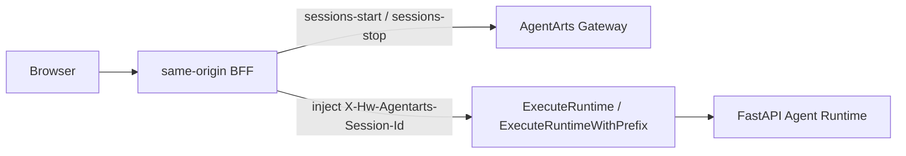

# Feature 14 Spike: Runtime Session Pre-warm 与 Conversation API 边界

> 日期：2026-07-07  
> 状态：部分完成；live lifecycle 行为仍需有效 CUSTOM_JWT 后复测

## 结论摘要

1. **Runtime Session header resolution 必须发生在 AgentArts Gateway 之前。**
   `X-Hw-Agentarts-Session-Id` 是调用 `ExecuteRuntime` /
   `ExecuteRuntimeWithPrefix` 的必选 header，Gateway 在进入 FastAPI 容器前已经使用它完成 Runtime Session routing。因此 FastAPI 不能为当前这一次
   `/invocations` 请求“补注入” Runtime Session ID。
2. **将 Conversation 管理 API 放在 Agent Runtime 内是可实现但有代价的。**
   AgentArts `ExecuteRuntimeWithPrefix` 文档明确要求 custom route 也携带
   `X-Hw-Agentarts-Session-Id`。因此 `/conversations`、`/messages` 这类
   metadata API 如果通过 Gateway 访问，也会被建模为 Runtime execution call。
   若目标是不让 metadata API 本身触发或依赖 Runtime execution instance，应把
   Conversation API 放到独立 stateless BFF，而不是 Runtime 容器内。
3. **当前 Cloudflare Pages Function 是 pre-Gateway BFF 的唯一现成位置，但它没有
   server-side lease store。**
   它可以调用 `sessions-start`、注入 Runtime Session header、代理 SSE；但若要满足
   “多 Tab 对同一 user single-flight / 最多一个 active Runtime Session”的 invariant，
   需要新增 Cloudflare-side durable coordination（例如 Durable Object/KV/其他
   server-side store），或引入独立 BFF 服务访问 PostgreSQL。
4. **本环境无法完成 live `sessions-start` 成功路径验证。**
   仓库中配置的 dev API key 对当前 Gateway 返回 `401 Authentication failed!`；
   环境中没有 Microsoft ID token / `AGENTARTS_BEARER_TOKEN`。需要用有效
   CUSTOM_JWT 重新执行 live spike。

## 本地环境检查

- 当前 worktree 没有安装 `agentarts` CLI。
- `wrangler.toml` 包含 production Gateway URL：
  `defaultgw-ha3wenzqga.cn-southwest-2.huaweicloud-agentarts.com`。
- `.agentarts_config.yaml` 的 runtime name 是 `personal-assistant`。
- `.agentarts_config.yaml` 配置 `authorizer_type: CUSTOM_JWT`，并带有
  `key_auth` dev key；但 live Gateway 对该 key 的所有 header 形式均返回 401。
- 当前 shell 有 HuaweiCloud AK/SK 环境变量，但 Runtime invocation/lifecycle API 的认证取决于 Runtime inbound auth。该 AK/SK 不能替代 CUSTOM_JWT 调用当前
  Gateway。
- GitNexus 当前 worktree 未注册；本次只使用 sibling worktree index 做导航，并以本地文件为准。

## AgentArts PDF 验证结果

PDF：`personal-assistant-meta/architecture/cloud-service/huaweicloud/agentarts-api-pdf.pdf`

### `StartRuntimeSession`

- Section：4.7.1.1
- URI：`POST /runtimes/{runtime_name}/sessions-start`
- Request header：
  - `Authorization` required
  - `X-Sdk-Content-Sha256` optional for IAM auth
- Documented 200 response body：
  - `code`
  - `message`
  - `data.session_id`
- `data.session_id` constraints：
  - English letters, digits, `-`, `_`
  - max length 64
- PDF oddity：request example text says `sessions-stop` under the
  `sessions-start` section. Treat the URI/table as source of truth and keep a
  live API spike before implementation freeze.

### `ExecuteRuntimeWithPrefix`

- Section：4.7.1.2
- URI：`POST /runtimes/{runtime_name}/invocations/{custom_path}`
- Requires Runtime `url_match_type=PREFIX_MATCH`.
- `custom_path` must not start with `/`.
- Request header:
  - `X-Hw-Agentarts-Session-Id` required
  - `X-Hw-Agentgateway-User-Id` optional by platform docs, required by this app
  - `Authorization` required
  - `X-Sdk-Content-Sha256` optional for IAM auth
- Design consequence：Conversation metadata routes behind this API still require a Runtime Session ID.

### `ExecuteRuntime`

- Section：4.7.1.3
- URI：`POST /runtimes/{runtime_name}/invocations`
- Request header:
  - `X-Hw-Agentarts-Session-Id` required
  - `X-Hw-Agentgateway-User-Id` optional by platform docs, required by this app
  - `Authorization` required
- Current app already uses this path for chat.

### `StopRuntimeSession`

- Section：4.7.1.7
- URI：`POST /runtimes/{runtime_name}/sessions-stop`
- Request header:
  - `X-Hw-Agentarts-Session-Id` required
  - `Authorization` required
- Purpose：destroy the instance corresponding to the session.

## Live Probe Attempt

Target Gateway:

```text
https://defaultgw-ha3wenzqga.cn-southwest-2.huaweicloud-agentarts.com
```

Probes attempted:

| Probe | Result |
|-------|--------|
| `GET /runtimes/personal-assistant/invocations/openapi.json` without session | `401 Authentication failed!` |
| `POST /runtimes/personal-assistant/sessions-start` with configured dev key | `401 Authentication failed!` |
| Same with raw Authorization, `X-Api-Key`, `Api-Key`, and key name variants | `401 Authentication failed!` |
| `POST /runtimes/personal-assistant/invocations` with generated session id and dev key | `401 Authentication failed!` |

No Runtime Session was successfully created in this run. Cleanup `sessions-stop`
also returned 401 because no valid Runtime auth was available.

## Blocked Live Questions

These remain open until a valid Microsoft ID token or a KEY_AUTH-enabled Runtime
endpoint is available:

- Does `sessions-start` accept no body in the real environment?
- Does it return a platform-generated `data.session_id` as documented?
- Does it accept a client-specified Session ID via header or body?
- Is repeated start idempotent for the same desired Session ID?
- Does start completion mean the execution instance is ready for immediate
  invocation?
- What is measured start latency and first invocation latency after start?
- What happens if the same Session ID is used after `sessions-stop`?
- Does a custom metadata route with a valid auth token but no session header fail
  specifically for missing `X-Hw-Agentarts-Session-Id`, as the docs imply?

## Design Consequences

### Recommended Boundary

Use a **pre-Gateway lifecycle BFF** for Runtime Session lifecycle:



FastAPI should still own:

- Conversation ownership checks;
- `conversation_id -> thread_id` derivation;
- `conversation_messages` read model;
- LangGraph checkpoint execution state.

BFF should own:

- user-scoped active Runtime Session lease lookup;
- `sessions-start` / `sessions-stop` calls;
- injection of `X-Hw-Agentarts-Session-Id`;
- fallback behavior when pre-warm is degraded.

### BFF Storage Options

| Option | Fit | Trade-off |
|--------|-----|-----------|
| Cloudflare Durable Object / KV lease store | Good for pre-Gateway user single-flight | New Cloudflare stateful dependency; runtime leases separate from PostgreSQL unless synchronized |
| Separate stateless BFF service with PostgreSQL access | Best target architecture | New deployable service and network/security work |
| Keep lifecycle in Pages Function and use browser/localStorage | Fastest prototype | Violates server-side multi-Tab invariant; not acceptable as final Feature 14 |
| FastAPI-only lease lookup | Not sufficient | Too late to inject the header for the current Gateway request |

### Route Placement Recommendation

Target long-term:

```text
Browser /api/conversations/* -> stateless BFF -> PostgreSQL
Browser /invocations          -> BFF ensure lease -> AgentArts Gateway -> FastAPI
```

Pragmatic intermediate, if a separate BFF is out of scope:

```text
Browser /api/conversations/* -> Pages Function ensure lease -> Gateway custom route -> FastAPI /conversations/*
Browser /invocations          -> Pages Function ensure lease -> Gateway invoke       -> FastAPI /invocations
```

The intermediate keeps one deployable backend but accepts that metadata APIs are
served through the Agent Runtime path and require a Runtime Session header. This
should be explicitly marked as an implementation trade-off, not the clean target.

## Implementation Plan Updates Suggested

1. Add a mandatory `runtime-lifecycle-bff` decision before Service/Client implementation starts.
2. Do not implement `ensureUserRuntimeSession()` only inside FastAPI.
3. If using Cloudflare Pages Function as lifecycle BFF, add a server-side
   coordination mechanism for user-scoped leases; do not rely on Tab-local
   storage.
4. Keep Service `POST /invocations` responsible for `conversation_id` ownership
   and `thread_id = user_id:conversation_id`, never `runtime_session_id`.
5. Add a live-spike prerequisite requiring a valid CUSTOM_JWT token:

```bash
export AGENTARTS_BEARER_TOKEN="<valid Microsoft ID token or accepted Runtime token>"
```

Then rerun start/stop/idempotency probes before freezing request/response parsing.

