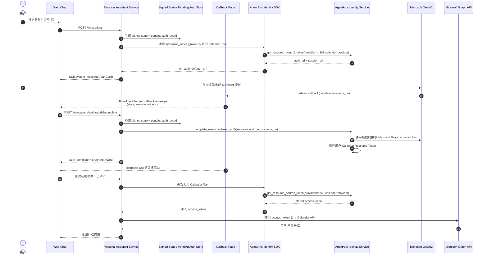

# Feature 15: Calendar Tool 使用 AgentArts 完整 OAuth2 流程

## 动机

当前 Microsoft 365 Email Tools 已经使用 AgentArts Identity SDK 的
`@require_access_token` / `require_access_token` 和 `on_auth_url` callback 完成
User Federation 授权：

- 当用户未授权时，SDK 生成 Microsoft OAuth2 授权 URL；
- `email_tools.handle_auth_url()` 通过 LangGraph `stream_writer` 将授权卡片直接推给
  Web Chat；
- 用户完成授权后，后续工具调用可由 SDK 注入 Microsoft Graph access token。

但按照 AgentArts SDK 文档中的 OAuth2 USER_FEDERATION 完整流程，用户在浏览器完成
授权并回调后，Agent 应用可以显式调用 `complete_resource_token_auth`，用
`user_id + session_uri` 完成 Resource Token Auth 会话绑定，再由 Identity Service
换取并保存第三方 OAuth2 access token。这个步骤在平台流程中是可选的：如果不调用，
SDK 仍可通过内置 polling / callback 机制完成授权；但项目目前所有工具都没有覆盖
这个完整路径，缺少一个可运行、可观察、可测试的示范实现。

**生产校正**：这份 issue 早期曾尝试让 callback popup 自己调用
`complete_resource_token_auth`。但生产环境里，AuthCard 通过
`target="_blank" rel="noopener noreferrer"` 打开授权页，popup 既拿不到稳定的
`window.opener`，也不共享主聊天窗口的 MSAL `sessionStorage`。本地 dev proxy 又会注入
`X-HW-AgentGateway-User-Id: dev-user`，很容易掩盖这个差异；线上则会表现为浏览器页已关闭，
后台 Identity 仍持续 polling。最终设计必须让主聊天窗口完成
`/invocations/auth/oauth2/complete`，popup 只负责把 callback envelope 送到主窗口。

本 Feature 不修改既有 Email Tool，而是新增 Microsoft 365 Calendar Tool，专门用于
展示 AgentArts OAuth2 完整流程。Calendar Tool 读取用户 Microsoft 账号中的日历与
日程内容，例如“今天有哪些会议”“下周的日程安排”“查看某个会议详情”。它只读取日历，
不创建、修改或删除事件，因此可作为低风险、可验证的 OAuth2 full-flow 示例。

> 命名说明：用户口语中可能写作 “calender tool”，代码与文档统一使用正确拼写
> `calendar`。

## 目标



## Callback URL 约定

本 Feature 采用“双 URL”模型，区分 OAuth2 浏览器 redirect 与后端 session binding。
浏览器 redirect page 只负责承接 Microsoft / AgentArts callback，真正的
`complete_resource_token_auth` 由主聊天窗口 coordinator 发起：

```text
# 用户浏览器可见，配置到 Microsoft Entra App 与 AgentArts Allowed Resource OAuth2 Return URL
GET https://<frontend-domain>/auth/callback/m365-calendar

# 主聊天窗口 coordinator 调用，实际完成 AgentArts Resource Token Auth session binding
POST https://<frontend-domain>/invocations/auth/oauth2/complete
```

生产环境逐层映射：

```text
Browser:
  POST /invocations/auth/oauth2/complete

Cloudflare Pages Function:
  /invocations/auth/oauth2/complete
  → https://defaultgw-...huaweicloud-agentarts.com/runtimes/personal-assistant/invocations/auth/oauth2/complete

AgentArts Gateway:
  /runtimes/personal-assistant/invocations/auth/oauth2/complete
  → container :8080 /invocations/auth/oauth2/complete

FastAPI:
  @app.post("/invocations/auth/oauth2/complete")
```

当前 AgentArts SDK 的 `on_auth_url` callback 签名是 `Callable[[str], Any]`，只向
应用层传递 `auth_url`，不会把 SDK 内部从 Identity Service 收到的 `session_uri`
一起传给 callback。因此本 Feature 不依赖 AuthCard 或 SSE event 携带 `session_uri`。
`session_uri` 的可信来源是用户完成 Microsoft 授权后，AgentArts / OAuth2 redirect
回前端 callback URL 时附带的 query parameter：

```text
GET /auth/callback/m365-calendar?code=...&state=...&session_uri=...
```

前端 callback page 只负责读取浏览器 callback 参数，并通过同源
`BroadcastChannel` 将 callback envelope 投递给主聊天窗口；如果浏览器仍保留
`window.opener`，也可以额外发送 `postMessage` 作为兼容，但它们都不参与授权判定。
真正调用后端 complete API 的是主聊天窗口 coordinator，授权判断的信任锚始终在服务端
保存的 signed state + pending auth record。

`AgentArtsRuntimeContext.set_oauth2_callback_url(...)` 必须设置为前端 callback URL：

```python
AgentArtsRuntimeContext.set_oauth2_callback_url(
    "https://<frontend-domain>/auth/callback/m365-calendar"
)
```

不能设置为 `/invocations/auth/oauth2/complete`，因为该 endpoint 是浏览器拿到
callback 参数后主动调用的后端 complete API；第三方 OAuth2 provider 的 redirect
目标应是用户可见、可展示授权结果并可读取前端登录态的 callback page。

本地开发与生产环境必须分别配置完整 absolute URL：

| 环境 | `oauth2_callback_url` 示例 |
|------|-----------------------------|
| Vite + local backend | `http://localhost:5173/auth/callback/m365-calendar` |
| Cloudflare Pages production | `https://<frontend-domain>/auth/callback/m365-calendar` |

上述 URL 需要同时加入：

- Microsoft Entra App 的 redirect URI allowlist；
- AgentArts 工作负载身份的 Allowed Resource OAuth2 Return URL allowlist；
- Calendar OAuth2 Credential Provider 的 callback/return URL 配置（如平台要求 provider
  级配置）。

## 范围

### 包含

- **Service**
  - 新增 `app/tools/calendar_tools.py`；
  - 新增只读 Calendar Tool，例如：
    - `list_calendar_events(start_time, end_time, calendar_id="primary")`；
    - `get_calendar_event(event_id, calendar_id="primary")`；
    - `search_calendar_events(query, start_time=None, end_time=None)`；
  - 使用 Microsoft Graph Calendar API 读取用户日历事件；
  - 使用 AgentArts Identity SDK `require_access_token`，provider 建议为
    `m365-calendar-provider` 或经 Implementation Plan 确认后的统一 provider；
  - 在每次 `/invocations` 请求进入 Agent / Tool 执行前设置
    `AgentArtsRuntimeContext.set_user_id(...)`、
    `AgentArtsRuntimeContext.set_oauth2_callback_url(...)`、
    `AgentArtsRuntimeContext.set_oauth2_custom_state(...)` 和 Workload Access Token；
  - 为 Calendar OAuth2 增加 callback / complete endpoint；
  - 在 callback 路径中解析并校验 `session_uri`、`state` 和可信 `user_id`；
  - 使用 AgentArts Identity SDK / client 调用 `complete_resource_token_auth`；
  - 对授权完成、失败、重复 callback、session 过期等场景输出结构化日志。
- **Client**
  - AuthCard / callback 页面支持 Calendar 授权完成状态；
  - callback page 只做 callback envelope relay，不直接持有或提交可用登录态；
  - 主聊天窗口接收 callback envelope 后，使用自己的登录态完成
    `/invocations/auth/oauth2/complete`，并在成功后更新 AuthCard；
  - 不在浏览器中保存 Microsoft access token、Workload Access Token 或平台管理凭据。
- **Meta / Architecture**
  - 更新 AgentArts OAuth2 架构说明，明确 `complete_resource_token_auth` 在本项目中
    是 optional step，但 Calendar Tool 会作为完整流程示范实现；
  - 标清 `require_access_token`、`on_auth_url`、callback endpoint、
    `complete_resource_token_auth` 与 token injection 的职责边界；
  - 更新 Microsoft 365 Tools 规格，将 Email 与 Calendar 分开描述。
- **Tests / E2E**
  - 单元测试覆盖 Calendar Tool 的 Graph API request formatting、response parsing
    和 error handling；
  - 单元测试覆盖 callback 参数校验、SDK client 调用和错误处理；
  - Service integration test 覆盖未授权 → auth URL → complete → retry 成功；
  - E2E 覆盖 Web Chat 中 Calendar 授权卡片、授权完成状态和后续日历工具可用。

### 不包含

- 修改既有 Email Tool 的 OAuth2 行为；
- 创建、修改、删除或回复 Calendar 事件；
- 引入非 Microsoft 的 Calendar Provider；
- 将 GitHub、Gitee、OBS、STS 或 M2M Tool 全部迁移到 complete flow；
- 在前端直接调用 AgentArts Identity Service；
- 把 third-party access token 暴露给 LLM、浏览器或日志。

## Calendar Tool 初始能力

| Tool | 用途 | Microsoft Graph API 候选 |
|------|------|--------------------------|
| `list_calendar_events` | 列出指定时间范围内的日程 | `GET /me/calendarView?startDateTime=...&endDateTime=...` |
| `get_calendar_event` | 查看单个日程详情 | `GET /me/events/{event_id}` |
| `search_calendar_events` | 按关键词搜索日程 | `GET /me/events?$search="..."` 或 Implementation Plan 确认的 Graph 查询方式 |

默认使用只读 scope：

```text
https://graph.microsoft.com/Calendars.Read
```

如 Implementation Plan 发现 Microsoft Graph 对搜索、会议正文或附件读取有额外 scope
要求，必须记录原因与最小权限选择。

## 关键设计约束

### 1. `complete_resource_token_auth` 是 Calendar Tool 的完整流程示范

AgentArts OAuth2 流程允许应用不显式调用 complete step，而依赖 SDK 的默认机制。
本 Feature 只要求新增 Calendar Tool 走完整流程，用于验证平台能力、沉淀最佳实践和
作为后续 User Federation Tool 的参考模板。既有 Email Tool 暂不改动。

### 2. Callback 必须在可信服务端完成

`complete_resource_token_auth` 需要可信的服务端上下文。`user_id` 不应由浏览器 body
提供，必须来自服务端保存的 pending auth record 与 signed state；浏览器只能携带
callback 参数并展示状态，不能持有或直接调用平台级 Identity client。

### 3. Session binding 与日历业务调用解耦

callback endpoint 只负责完成 OAuth2 session binding，不直接读取日历。日历读取仍由
用户的后续 `/invocations` 和 Calendar Tool 调用触发。

### 4. 授权状态不得通过 LLM 转述

授权 URL、授权完成和授权失败均应通过 `system_message` / AuthCard / callback page
等带外 UI 呈现，不要求 LLM 复述 URL，也不把 token 或 callback 参数写入 prompt。

### 5. Calendar 是 read-only MVP

Calendar Tool 首版只读，避免“误改会议”这类高影响风险。后续如需创建/修改事件，应另起
feature issue，并引入 Guard / confirmation 机制。

### 6. 浏览器通信只做中继与 UI 同步

popup / callback page 与主聊天窗口之间的通信用于 callback envelope 传递与 UI 同步，
不参与授权判定。生产主路径应采用同源 `BroadcastChannel`；`window.opener.postMessage`
仅作为兼容性补充，不应成为授权成功的唯一依赖。

## 验收标准

### AC1：新增 Calendar Tool

- [ ] Service 新增 `calendar_tools.py`，并接入 Agent tool registry；
- [ ] Agent system prompt 能说明 Calendar Tool 的只读能力；
- [ ] 用户可询问今天、本周、指定日期范围内的日程；
- [ ] 用户可查看单个日程详情；
- [ ] 用户可按关键词搜索日历事件；
- [ ] Calendar Tool 使用 Microsoft Graph API 和 `Calendars.Read` 最小权限 scope。

### AC2：完整 OAuth2 callback 与 complete

- [ ] Calendar Tool 触发未授权时，通过 AuthCard 展示 Microsoft 授权 URL；
- [ ] `on_auth_url` 只通过 AuthCard 展示 Microsoft 授权 URL，不要求 AuthCard 携带
  `session_uri`；
- [ ] 用户完成 Microsoft 授权后，前端 callback page 可从 redirect query parameter
  读取 `session_uri`、`state` 等必要参数；
- [ ] callback page 通过同源 BroadcastChannel 向主聊天窗口投递 callback envelope，
  并可选通过 `postMessage` 做兼容性同步；
- [ ] 主聊天窗口可从 callback envelope 中提取 `session_uri`，并基于 `state` /
  pending auth record 触发 complete request；
- [ ] Service 使用服务端保存的 user binding 调用
  `complete_resource_token_auth(session_uri=...)`；
- [ ] complete 成功后，AgentArts Identity Service 保存 Calendar Resource Token；
- [ ] 后续同一用户调用 Calendar Tool 时，`require_access_token` 可注入 access token。

### AC3：安全与隔离

- [ ] callback endpoint 不接受客户端伪造的 `user_id` 作为授权依据；
- [ ] `user_id` 仅可来自服务端保存的 pending auth record，不能由浏览器 body 伪造；
- [ ] `state` / `session_uri` 做 CSRF 与 replay 防护；
- [ ] 不在日志、SSE、浏览器 storage 或 LLM-visible tool result 中输出 access token；
- [ ] 不同用户的 Calendar OAuth2 session 不可交叉 complete；
- [ ] complete 失败、session 过期或重复 callback 时返回安全、可理解的错误状态；
- [ ] Calendar Tool 首版不能创建、修改或删除事件。

### AC4：用户体验

- [ ] AuthCard 能区分 `auth_required`、`auth_complete`、`auth_failed`；
- [ ] popup / callback 页面授权完成后能通知主聊天窗口，主窗口完成服务端 binding 后
  更新绿卡；
- [ ] 用户无需复制粘贴 callback 参数；
- [ ] 授权完成后可自动或半自动重试原日历请求；
- [ ] 授权失败时用户可重新发起日历请求并获得新的授权入口。

### AC5：回归保护

- [ ] 既有 Email Tool 行为不改变；
- [ ] `send_email` / `reply_to_email` 仍保持现有 Guard 二次确认要求；
- [ ] 本地开发未配置真实 Microsoft OAuth2 时，单元测试仍可通过 mock 覆盖 complete
  路径；
- [ ] `uv run ruff check .` 和 `uv run pytest tests/` 通过；
- [ ] E2E Calendar 授权与读取流程在 staging 或等价环境完成验证。

## 风险与缓解

| 风险 | 严重度 | 缓解 |
|------|:------:|------|
| AgentArts SDK 当前版本的 `complete_resource_token_auth` 参数名或 client 入口与文档不一致 | High | Implementation Plan 阶段先用官方 SDK / API 文档 spike，锁定真实方法签名后再编码 |
| Microsoft OAuth callback 与 AgentArts callback URL 白名单不匹配 | High | 在 AgentArts Credential Provider 与 Microsoft Entra App 中同步配置 return URL，并纳入部署 runbook |
| Calendar provider 是否应复用现有 `m365-provider-common` 不明确 | Medium | Implementation Plan 阶段比较独立 provider 与统一 provider 的 scope、consent UX、token cache 影响 |
| popup 直连 complete 会因 `noopener` / `sessionStorage` / 缺少主窗口登录态而在生产失败 | High | 让主聊天窗口完成 `/invocations/auth/oauth2/complete`，popup 只投递 callback envelope |
| callback 与原聊天请求之间状态关联不稳 | Medium | 使用 signed `state`、短 TTL server-side pending auth record；BroadcastChannel 只做传递，不承担授权判定 |
| 重复 callback 导致用户看到失败 | Medium | complete endpoint 做幂等处理：已完成视为成功或返回可恢复状态 |
| 日历内容包含敏感隐私 | High | 只读最小权限、日志脱敏、LLM prompt 不包含 token 或 callback 参数；按用户请求范围读取 |

## Four-Question Gate

| Question | Answer | 说明 |
|----------|:------:|------|
| Is it best practice? | **Yes** | OAuth callback page 只做 relay，真正的 token binding 在可信主窗口与服务端完成；signed state + pending auth record + least privilege 符合 Separation of Concerns 与 Defense in Depth。 |
| Is it industry standard? | **Yes** | Popup OAuth + same-origin callback relay + server-side authorization code / session binding 是主流生产模式；BroadcastChannel 属于现代浏览器推荐的同源跨窗通信手段。 |
| Is it conventional? | **Yes** | 新成员会自然预期“主应用完成授权、popup 只做回调载体”；这种 BFF 式授权收口比让 popup 直连后端更常见。 |
| Is it modern? | **Yes** | BroadcastChannel、typed settings、structured logging、server-side replay guard 和 E2E/staging OAuth 验证都属于当前 web / agent 应用的现代实践。 |

## 依赖

- Feature on-auth-url：授权 URL 带外呈现；
- Feature 4：Inbound Identity，提供可信 `user_id`；
- Feature 10a：已有 Microsoft 365 / Graph API 接入经验与 AuthCard UX；
- AgentArts Identity SDK 支持或可访问 `complete_resource_token_auth`；
- Microsoft Entra App 与 AgentArts Credential Provider 的 callback URL 配置。

## 受影响文档

Implementation 完成后至少更新：

- `personal-assistant-meta/specs/overall_specifications.md`；
- `personal-assistant-meta/specs/dictionary.md`；
- `personal-assistant-meta/architecture/backend_architecture.md`；
- `personal-assistant-meta/architecture/cloud-service/huaweicloud/` 下 AgentArts 相关文档；
- `personal-assistant-service/README.md`；
- `personal-assistant-client/README.md`（若 AuthCard / callback UX 有变化）。

## 参考

- Huawei Cloud AgentArts SDK:
  `https://github.com/huaweicloud/agentarts-sdk-python/blob/main/docs/cn/sdk_user_guide/agent_identity_guide.md`
- `personal-assistant-service/app/tools/email_tools.py`
- `personal-assistant-meta/issues/features/resolved/feature-10-outbound-email-obs/issue.md`
- `personal-assistant-meta/issues/features/resolved/feature-on-auth-url/issue.md`
- `personal-assistant-meta/architecture/backend_architecture.md#521-oauth2-鉴权-url-呈现out-of-band-消息投递`
