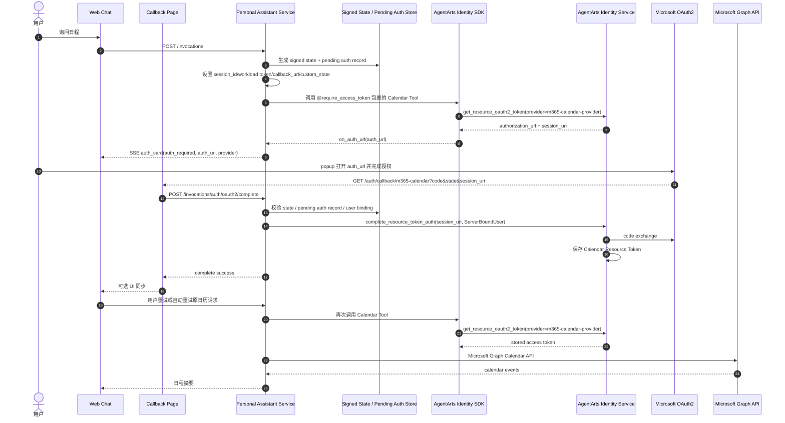
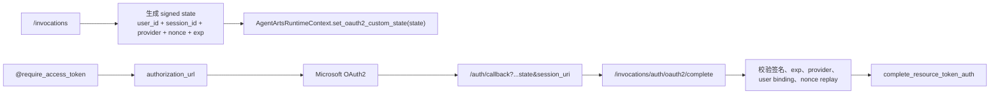
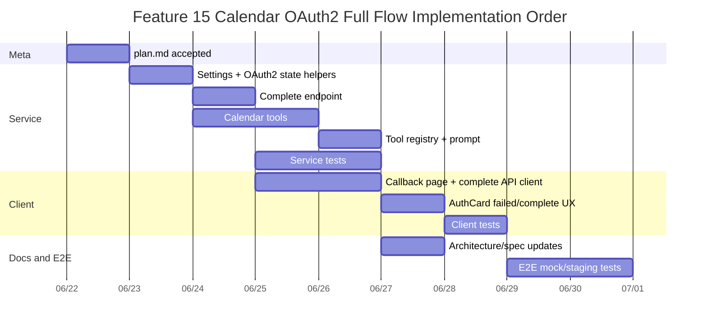

# Feature 15 Implementation Plan: Calendar Tool 使用 AgentArts 完整 OAuth2 流程

> 版本：v1.0 | 状态：Meta-Synthesized | Issue: [`issue.md`](./issue.md)
>
> 目标：新增 Microsoft 365 Calendar read-only Tool，并将它作为 AgentArts
> `complete_resource_token_auth` 完整 OAuth2 USER_FEDERATION 流程的示范实现。

---

## Executive Summary

本 Feature 在不修改既有 Email Tool 行为的前提下，为 Personal Assistant 增加只读
Microsoft 365 Calendar 能力：用户可以询问“今天有哪些会议”“下周日程”“查看某个会议详情”
和“搜索日历事件”。Calendar Tool 通过 AgentArts Identity SDK
`@require_access_token` 获取 Microsoft Graph `Calendars.Read` access token；当用户首次未授权时，
Web Chat 展示 AuthCard，用户在 popup 中完成 Microsoft 授权后跳回前端 callback page，
前端仅把 callback 参数转发给后端；真正的 Resource Token Auth session binding 与
`complete_resource_token_auth` 只在可信后端完成，授权信任锚由服务端保存的 signed state
+ pending auth record 提供。

**核心结论**：本 Feature 是 Service + Client + Meta + E2E 联合变更。Service 新增
Calendar Tool 和 OAuth2 complete endpoint；Client 新增 callback page 与 AuthCard 状态扩展；
Infra 不新增 OpenTofu/HCL 资源，但需要部署配置与外部平台 allowlist 更新。Calendar 首版严格只读，
不创建、修改、删除或回复事件。

**SDK 实证约束**：本地 `agentarts-sdk-python` 源码已确认当前 SDK 的 `on_auth_url`
callback 签名为 `Callable[[str], Any]`，只传 `auth_url`，不会传 `session_uri`。因此
AuthCard / SSE event 不携带 `session_uri`；`session_uri` 的来源是用户完成授权后的浏览器
redirect callback query parameter。

---

## 1. 架构总览



### 1.1 URL 与职责边界

| URL | 所在层 | 调用者 | 职责 |
|-----|--------|--------|------|
| `/auth/callback/m365-calendar` | Client | Microsoft / browser redirect | 展示授权结果，读取 `session_uri` / `state` / error query params，调用后端 complete API；UI 同步可选 |
| `/invocations/auth/oauth2/complete` | Service via Cloudflare Pages Function proxy | 前端 callback page | 在可信服务端完成 `complete_resource_token_auth` |
| `/invocations` | Service via Gateway | Web Chat | 正常 Agent 对话与 Calendar Tool 调用 |

`AgentArtsRuntimeContext.set_oauth2_callback_url(...)` 必须设置为前端 absolute callback URL，
例如本地 `http://localhost:5173/auth/callback/m365-calendar`，生产
`https://<frontend-domain>/auth/callback/m365-calendar`。

---

## 2. 文件变更矩阵

| 子系统 | 文件 | 操作 | 说明 |
|--------|------|------|------|
| Service | `app/settings.py` | 修改 | 增加 Calendar OAuth2 provider/callback/state TTL 等 typed settings |
| Service | `app/auth.py` | 修改 | 复用/扩展可信 user/session/workload token 提取逻辑；新增 callback complete 辅助校验 |
| Service | `app/main.py` | 修改 | `/invocations` 设置 OAuth2 callback/custom_state；新增 `/invocations/auth/oauth2/complete` endpoint |
| Service | `app/tools/calendar_tools.py` | 新建 | 3 个只读 Calendar tools + Graph API formatting/parsing/error handling |
| Service | `app/tools/__init__.py` | 修改 | 注册 `CALENDAR_TOOLS` |
| Service | `app/agent_handler.py` | 修改 | system prompt 增加 Calendar read-only 能力和隐私/只读边界 |
| Service Tests | `tests/test_calendar_tools.py` | 新建 | Calendar Tool 单元测试 |
| Service Tests | `tests/test_oauth2_complete.py` | 新建 | complete endpoint / state / replay / server-side auth context 测试 |
| Client | `src/App.tsx` | 修改 | 无 router 前提下按 pathname 分流 callback page |
| Client | `src/components/auth/M365CalendarCallbackPage.tsx` | 新建 | OAuth2 callback page |
| Client | `src/lib/auth/oauth2-complete.ts` | 新建 | 调用后端 complete API |
| Client | `src/lib/chat/chat-event-handler.ts` | 修改 | 支持 `auth_failed` 和 callback `postMessage` 后的 AuthCard transition |
| Client | `src/types/chat.ts` | 修改 | 扩展 AuthCard/SSE event 类型 |
| Client | `src/stores/auth-card-store.ts` | 修改 | 增加 failed / provider-scoped complete 状态 |
| Client Tests | `src/components/auth/M365CalendarCallbackPage.test.tsx` | 新建 | callback page 成功/失败/缺参测试 |
| Client Tests | `src/lib/chat-adapter.test.ts` 或相关测试 | 修改 | AuthCard failed/complete 状态回归 |
| Meta | specs / architecture docs | 修改 | Email 与 Calendar 分开描述；AgentArts OAuth2 complete flow 文档化 |
| E2E | `personal-assistant-e2e/tests/features/feature-15-calendar-agentarts-full-oauth2/` | 新建 | 授权卡片、callback complete、Calendar read flow E2E |
| Infra | `.agentarts_config.yaml` / deployment runbook | 修改配置说明 | 不新增 HCL；同步 callback URL allowlist 与 provider 配置 |

---

## 3. Service Implementation Plan

### 3.1 Settings

在 `app/settings.py` 中新增 typed settings，避免 OAuth2 配置散落在代码里：

| Setting | 默认值 | 说明 |
|---------|--------|------|
| `m365_calendar_provider_name` | `m365-calendar-provider` | Calendar 独立 provider；若后续决定复用 common provider，需在 plan 修订中说明 |
| `m365_calendar_scopes` | `["https://graph.microsoft.com/Calendars.Read"]` | 最小权限 read-only scope |
| `oauth2_calendar_callback_url` | 无默认，生产必填 | absolute frontend callback URL |
| `oauth2_state_secret` | 无默认，生产必填 | signed state HMAC secret |
| `oauth2_pending_auth_ttl_seconds` | `600` | pending auth / replay window TTL |
| `graph_request_timeout_seconds` | `30` | Microsoft Graph request timeout |
| `graph_timezone` | `Asia/Shanghai` | `Prefer: outlook.timezone` 默认值，可配置 |

本地开发允许通过 `.env` 设置 `oauth2_calendar_callback_url=http://localhost:5173/auth/callback/m365-calendar`。
生产环境若缺失 callback URL 或 state secret，应在 startup validation 或首次 Calendar 调用时返回明确配置错误。

### 3.2 OAuth2 State 与 Pending Auth

MVP 推荐使用 signed state + 短 TTL server-side pending auth record：



实现要点：

- `state` 必须绑定服务端可恢复的 user binding、`session_id`、provider、nonce、expiry。
- complete endpoint 不信任浏览器 body 中的 `user_id`，而是从 signed state + pending auth record
  恢复授权上下文。
- pending auth record 负责 replay 防护与完成态追踪；重复 callback 若已 complete，可返回
  idempotent success。
- 若未来 AgentArts Runtime 多副本部署，pending auth record 需要迁移到共享 store；
  本 Feature 将该点记录为 known limitation。

### 3.3 `/invocations` Context 设置

`main.py::invocations()` 当前已设置：

- `extract_gateway_user_id(request)`
- `extract_gateway_session_id(request)`
- `extract_workload_access_token(request)`

本 Feature 需在调用 handler 前追加：

- `AgentArtsRuntimeContext.set_oauth2_callback_url(settings.oauth2_calendar_callback_url)`
- `AgentArtsRuntimeContext.set_oauth2_custom_state(signed_state)`

注意：Email Tool 也会看到同一 request context 的 callback URL/custom_state。由于本 Feature 不改变 Email 行为，需验证这不会破坏现有 `m365-provider-common` 授权。若 SDK 对所有 provider 共用 callback URL，则 Email 未授权时也可能使用 Calendar callback URL；Implementation 阶段必须通过测试确认。若存在冲突，Calendar Tool 应改为 decorator 参数级 `callback_url` / `custom_state`，而不是 request-wide context。

### 3.4 Complete Endpoint

新增：

```text
POST /invocations/auth/oauth2/complete
```

Request body：

```json
{
  "provider": "m365-calendar-provider",
  "session_uri": "urn:uuid:...",
  "state": "...",
  "error": null,
  "error_description": null
}
```

Response：

```json
{
  "status": "complete",
  "provider": "m365-calendar-provider",
  "message": "Calendar authorization completed."
}
```

安全规则：

- 不接受 body 中的 `user_id` 作为授权依据。
- 完整授权上下文必须来自服务端保存的 signed state + pending auth record。
- 缺少 `session_uri` / `state` 返回 400。
- `state` 签名不合法、过期、provider 不匹配、user mismatch 返回 403。
- Identity SDK complete 失败返回 502/400 的安全错误，不回显 token、code、完整 `session_uri`。
- 重复 callback：若 nonce 已完成，返回 idempotent success 或 `already_complete`，不报惊吓式错误。

SDK 调用：

```python
from agentarts.sdk import IdentityClient

client = IdentityClient(region=get_region())
client.complete_resource_token_auth(
    session_uri=session_uri,
    user_identifier=server_bound_user,
)
```

### 3.5 Calendar Tool

新增 `app/tools/calendar_tools.py`：

| Tool | Graph endpoint | 关键参数 |
|------|----------------|----------|
| `list_calendar_events(start_time, end_time, calendar_id="primary")` | `GET /me/calendarView` 或 `/me/calendars/{id}/calendarView` | `startDateTime`, `endDateTime`, `$orderby=start/dateTime`, `$top` |
| `get_calendar_event(event_id, calendar_id="primary")` | `GET /me/events/{event_id}` 或 calendar-scoped event endpoint | `$select` 精简字段 |
| `search_calendar_events(query, start_time=None, end_time=None)` | Plan 阶段先验证 Graph `$search`；MVP 可回退为时间范围内拉取后本地过滤 | 避免因 Graph search 限制阻塞首版 |

统一 Graph response 结构：

```json
{
  "events": [
    {
      "id": "...",
      "subject": "...",
      "start": {"dateTime": "...", "timeZone": "..."},
      "end": {"dateTime": "...", "timeZone": "..."},
      "location": "...",
      "organizer": "...",
      "attendees": [],
      "isOnlineMeeting": true,
      "onlineMeetingUrl": "..."
    }
  ],
  "count": 1,
  "timezone": "Asia/Shanghai"
}
```

Tool 约束：

- 只读，禁止 `POST` / `PATCH` / `DELETE` Graph events。
- 不将 access token 写入 logs、tool result、LLM-visible error。
- Graph error 使用与 Email Tool 类似的 `_extract_graph_error` / `_format_tool_error` 模式，但返回用户友好中文。
- 使用 shared `httpx.AsyncClient` 或 module-level lazy client，避免每次调用建立连接。
- 设置 `Prefer: outlook.timezone="<configured timezone>"`。
- 支持分页 MVP：`limit` 默认 20，上限 50；如返回 `@odata.nextLink`，首版可返回 `has_more=True`。

### 3.6 Tool Registry 与 Prompt

`app/tools/__init__.py` 新增：

```python
try:
    from app.tools.calendar_tools import CALENDAR_TOOLS
    tools.extend(CALENDAR_TOOLS)
except ImportError as e:
    logger.warning("Calendar tools not available ...", exc_info=True)
```

`agent_handler.py` system prompt 增加：

- Calendar Tool 可读取用户日历和会议详情。
- Calendar Tool 首版 read-only，不能创建、修改、删除事件。
- 日历内容可能敏感；仅按用户请求范围读取和总结。
- 授权状态由 AuthCard / callback page 带外呈现，不要要求用户复制 token/code/session_uri。

---

## 4. Client Implementation Plan

### 4.1 Callback Page Routing

当前 `src/App.tsx` 没有 React Router。MVP 采用 pathname 分流：

```tsx
if (window.location.pathname === "/auth/callback/m365-calendar") {
  return <M365CalendarCallbackPage />;
}
```

该 callback page 仍包在 `MsalProvider` / `AuthGuard` 外层语境中时需谨慎：callback complete
需要可信的服务端 auth context。若 `AuthGuard` 会拦截 callback page，应让 callback page
在 App 顶层优先渲染，并在 page 内等待 auth hydration 后调用 complete API。

### 4.2 `M365CalendarCallbackPage`

职责：

- 读取 `window.location.search` 中的 `session_uri`、`state`、`error`、`error_description`。
- 如果 `error` 存在，展示授权失败并 `postMessage({ type: "m365-calendar-auth", status: "failed" })`。
- 如果缺少 `session_uri` 或 `state`，展示可理解错误，不调用后端。
- 调用 `/invocations/auth/oauth2/complete`。
- complete 成功后展示“授权完成，可以关闭窗口”，并可发出 UI 同步消息；
- 如果浏览器环境支持跨窗通信，可选实现 `postMessage`，但不作为授权依赖。

- 不写入 localStorage/sessionStorage access token。
- 不展示 raw token/code/session_uri；debug 信息只在开发日志中脱敏输出。

### 4.3 Complete API Client

新增 `src/lib/auth/oauth2-complete.ts`：

- 发送 `POST /invocations/auth/oauth2/complete`。
- 复用现有 auth token 发送机制。如果现有 `invokeChat` 的 header 构造只封装在 chat API client 中，应提取 shared `buildAuthHeaders()`，让 callback complete 具备同样的登录态上下文。
- 响应非 2xx 时解析 `detail`，返回用户友好错误。

### 4.4 AuthCard 状态扩展

现有 AuthCard 已支持 provider-scoped `auth_required` 和 `auth_complete`。本 Feature 增加：

- `auth_failed` 状态；
- popup callback `postMessage` 后更新匹配 provider 的 AuthCard；
- 授权完成后提供“重试刚才的问题”提示或自动重试 hook。

MVP 建议先做半自动重试：AuthCard 显示“授权已完成，请重新发送刚才的日历请求”。自动重试需要可靠保存原始 user message 与 run lifecycle，复杂度较高，可作为 P2。

---

## 5. Test Plan

### 5.1 Service Unit Tests

`tests/test_calendar_tools.py`：

- `list_calendar_events` 构造正确 endpoint、query params、headers。
- `list_calendar_events` 解析 subject/start/end/location/organizer/attendees。
- `list_calendar_events` 支持 timezone `Prefer` header。
- `get_calendar_event` 解析单事件详情。
- `search_calendar_events` 验证 Graph `$search` 或 fallback 本地过滤策略。
- Graph 401/429/503/error JSON 转为安全错误。
- access token 不出现在 result/log message。
- Tool 函数不调用写操作 endpoint。

`tests/test_oauth2_complete.py`：

- 缺少 `session_uri` → 400。
- 缺少/非法/过期 `state` → 403。
- body 伪造 `user_id` 不影响可信 user 校验。
- user mismatch → 403。
- valid request 调用 `IdentityClient.complete_resource_token_auth`，参数为服务端恢复的 auth context。
- duplicate callback idempotent。
- SDK complete 失败返回安全错误。

### 5.2 Service Integration Tests

- 未授权 Calendar Tool 触发 SSE `auth_card`，只包含 `auth_url`，不包含 `session_uri`。
- complete success 后同一 user 再次调用 Calendar Tool 可获得 injected token（mock SDK）。
- Email Tool 授权行为不回归。

### 5.3 Client Tests

- callback page success：query params → POST complete → success UI → 可选 UI 同步消息。
- callback page error query：不 POST complete → failed UI → `postMessage(auth_failed)`。
- missing `session_uri/state`：failed UI。
- complete API 401/403/500：展示可理解错误。
- AuthCard `auth_failed` 状态渲染。
- `postMessage` provider mismatch 不更新 unrelated card。

### 5.4 E2E Tests

目录：`personal-assistant-e2e/tests/features/feature-15-calendar-agentarts-full-oauth2/`

场景：

1. 用户询问日程，未授权时 Web Chat 显示 Calendar AuthCard。
2. AuthCard 打开 popup 到 Microsoft/模拟 OAuth URL。
3. callback page 带 `session_uri/state` 调用 complete endpoint。
4. complete 成功后主窗口 AuthCard 变为 complete。
5. 用户重试日历请求，看到日程摘要。
6. callback failed / expired session 显示安全错误，可重新发起授权。

真实 Microsoft OAuth2 不适合在 CI 中跑；CI 使用 mock/staging identity fixture，人工 staging 验证覆盖真实 Entra App allowlist。

---

## 6. Meta / Architecture 文档更新

Implementation 完成时至少更新：

| 文档 | 更新内容 |
|------|----------|
| `specs/overall_specifications.md` | 增加 Calendar read-only 用户能力 |
| `specs/dictionary.md` | 增加 Calendar Tool、Resource Token Auth complete flow、OAuth2 callback page 术语 |
| `architecture/backend_architecture.md` | 增加 Calendar Tool、OAuth2 complete endpoint、state/session binding diagram |
| `architecture/frontend_architecture.md` | 增加 AuthCard callback page / postMessage flow |
| `architecture/overall_architecture.md` | 更新 Microsoft 365 Tools 总览 |
| `architecture/cloud-service/huaweicloud/` | AgentArts OAuth2 complete flow、Allowed Resource OAuth2 Return URL、Gateway proxy path |
| `personal-assistant-service/README.md` | 本地 env 与 Calendar OAuth2 调试说明 |
| `personal-assistant-client/README.md` | callback URL 与 Cloudflare Pages Function proxy 说明 |

---

## 7. Deployment / Configuration

### 7.1 外部平台配置

以下 URL 必须一致：

```text
https://<frontend-domain>/auth/callback/m365-calendar
```

配置位置：

- Microsoft Entra App redirect URI allowlist；
- AgentArts workload identity Allowed Resource OAuth2 Return URL allowlist；
- Calendar OAuth2 Credential Provider callback/return URL 配置（如平台要求 provider 级配置）。

### 7.2 Cloudflare Pages Function Proxy

需要确认生产 proxy 覆盖：

```text
POST /invocations/auth/oauth2/complete
→ AgentArts Gateway /runtimes/personal-assistant/invocations/auth/oauth2/complete
```

如果现有 Pages Function 只 proxy `/invocations` exact path，需要扩展为 `/invocations/*`。

### 7.3 Provider 策略

首选独立 provider：

```text
m365-calendar-provider
scope: https://graph.microsoft.com/Calendars.Read
```

理由：

- Calendar 首版只读，独立 consent 更符合 least privilege。
- 不改变 Email `m365-provider-common` token cache 与 consent UX。
- complete flow 示例边界清晰。

若 Implementation 发现 AgentArts / Microsoft provider 管理要求复用 common provider，必须在 plan 修订中记录 scope、consent UX、token cache 的 trade-off。

---

## 8. 风险与缓解

| 风险 | 严重度 | 缓解 |
|------|:------:|------|
| SDK `on_auth_url` 不传 `session_uri`，实现误以为 AuthCard 可拿到 | High | 已写入 issue 与本 plan：`session_uri` 仅来自 redirect callback query parameter |
| request-wide `set_oauth2_callback_url/custom_state` 影响 Email Tool | High | Implementation 必须测试 Email 未授权路径；若冲突，Calendar decorator 使用参数级 callback/custom_state |
| callback complete 缺少可信 user header | High | complete endpoint 必须走 same-origin proxy/Gateway auth；Client complete API 复用登录 Authorization header |
| state/replay 防护不足 | High | signed state + TTL + nonce replay guard；不信任 body user_id |
| AgentArts Runtime 多副本导致 in-memory nonce 不共享 | Medium | MVP 记录 known limitation；生产多副本前迁移 external store |
| Cloudflare Pages Function 没有 proxy complete path | High | 部署前验证 `/invocations/auth/oauth2/complete` path |
| Graph search 行为受限 | Medium | Plan 阶段验证；必要时采用时间范围拉取 + 本地过滤 |
| 日历内容敏感 | High | 只读 scope、日志脱敏、按用户请求范围读取、不暴露 token/session_uri |
| 重复 callback 用户看到失败 | Medium | complete endpoint 做 idempotent success / already_complete |
| 真实 OAuth2 E2E 难以自动化 | Medium | CI mock + staging 人工验证真实 Entra/AgentArts allowlist |

---

## 9. Implementation Order



执行顺序：

1. Service：先实现 settings + signed state helpers + complete endpoint。
2. Service：实现 Calendar Tool，并注册到 `build_tools()`。
3. Service：补 system prompt 和 unit/integration tests。
4. Client：实现 callback page 和 complete API client。
5. Client：扩展 AuthCard failed/complete 状态与 tests。
6. Meta：同步 specs/architecture/README/runbook。
7. E2E：先 mock flow，再 staging 验证真实 Microsoft/AgentArts allowlist。
8. 全量验证：`uv run ruff check .`、`uv run pytest tests/`、`npm run test`、`npm run build`、E2E。

---

## 10. Verification Commands

Service：

```bash
cd personal-assistant-service
uv run ruff check .
uv run pytest tests/test_calendar_tools.py tests/test_oauth2_complete.py -v
uv run pytest tests/ -v
```

Client：

```bash
cd personal-assistant-client
npm run test
npm run build
```

E2E：

```bash
cd personal-assistant-e2e
pytest tests/features/feature-15-calendar-agentarts-full-oauth2/ -v
```

Manual staging：

- 配置 Microsoft Entra redirect URI。
- 配置 AgentArts Allowed Resource OAuth2 Return URL。
- 配置 Calendar OAuth2 Credential Provider。
- 通过 Web Chat 触发 Calendar 授权。
- 完成 callback 后重试日历读取。
- 确认 Email Tool 授权/发送 guard 不回归。

---

## 11. Acceptance Criteria Mapping

| AC | Plan 覆盖 |
|----|-----------|
| AC1 Calendar Tool | §3.5, §3.6, §5.1 |
| AC2 OAuth2 callback + complete | §1, §3.2, §3.4, §4.1-4.3, §5.2 |
| AC3 安全与隔离 | §3.2, §3.4, §8 |
| AC4 用户体验 | §4.2, §4.4, §5.3 |
| AC5 回归保护 | §5.2, §9, §10 |

---

## 12. Four-Question Gate

| Question | Answer | 说明 |
|----------|:------:|------|
| Is it best practice? | Yes | OAuth callback 与 token binding 在可信后端完成；signed state + replay guard；Calendar MVP 只读，符合 least privilege。 |
| Is it industry standard? | Yes | OAuth2 authorization code redirect、state 校验、server-side session binding、Microsoft Graph Calendar API 均为标准生产模式。 |
| Is it conventional? | Yes | Calendar read-only Tool 是 Personal Assistant 的常见核心能力；AuthCard + popup callback 是用户授权的常规 UX。 |
| Is it modern? | Yes | 使用 AgentArts Identity SDK、带外 AuthCard、typed settings、structured logging、E2E/staging OAuth 验证，符合现代 Agent application 实践。 |

---

## 13. Implementation Checklist

### Service

- [ ] 新增 Calendar OAuth2 settings。
- [ ] 新增 signed state helper 与 replay guard。
- [ ] `/invocations` 设置 calendar callback URL/custom state。
- [ ] 新增 `/invocations/auth/oauth2/complete`。
- [ ] 新增 `calendar_tools.py` 三个只读工具。
- [ ] 注册 `CALENDAR_TOOLS`。
- [ ] 更新 system prompt。
- [ ] Service unit/integration tests 通过。

### Client

- [ ] 新增 callback page 分流。
- [ ] 新增 complete API client。
- [ ] callback page success/failed/missing param UX。
- [ ] AuthCard 支持 `auth_failed`。
- [ ] popup `postMessage` 更新主窗口 AuthCard。
- [ ] Client tests/build 通过。

### Meta / E2E / Deploy

- [ ] specs / architecture / README / runbook 同步。
- [ ] Cloudflare Pages Function proxy complete path。
- [ ] Microsoft Entra + AgentArts allowlist 同步。
- [ ] E2E mock flow 通过。
- [ ] Staging 真实 OAuth2 验证通过。
- [ ] Email Tool 行为回归验证通过。
