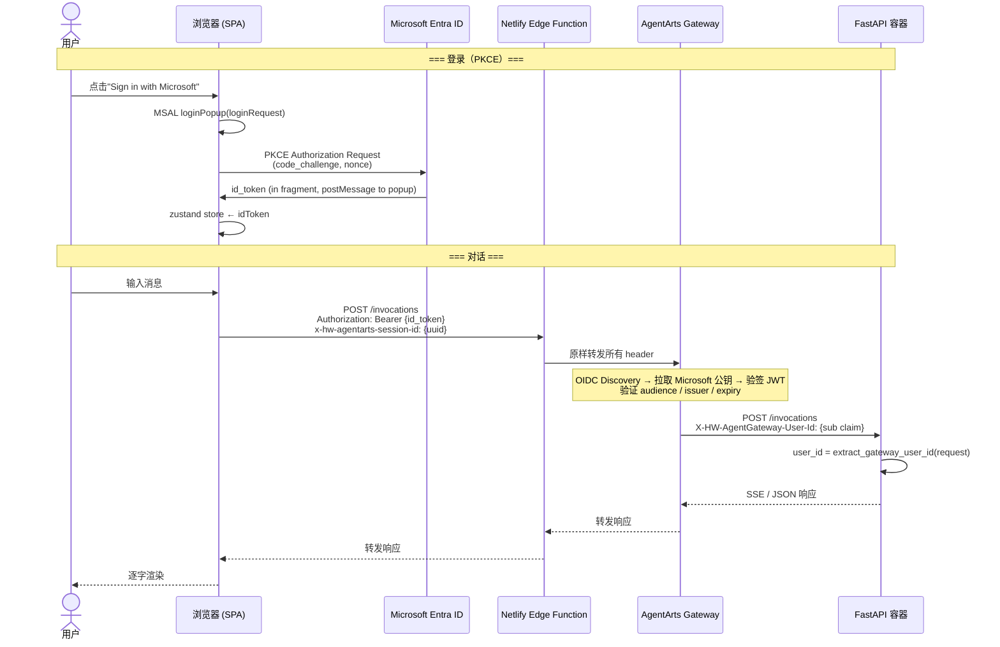
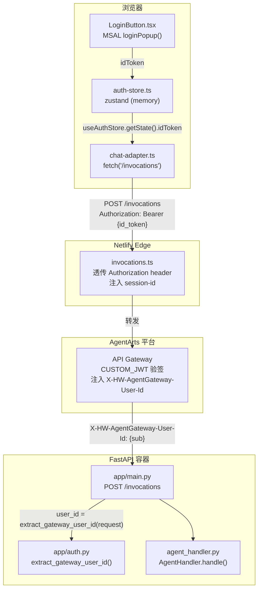
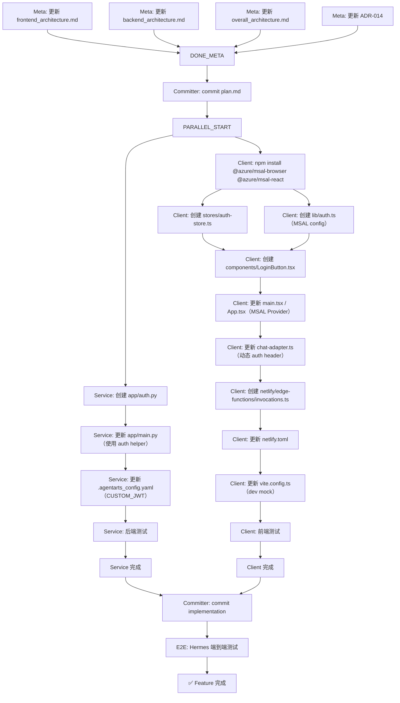

# Feature 4: Inbound Identity — Implementation Plan

> 版本：v1.2（second-round review fixes） | 状态：ACCEPTED | 日期：2026-06-12
>
> 关联 issue：`personal-assistant-meta/issues/features/feature-4-inbound-identity/issue.md`

---

## 0. Issue Evaluation

| 维度 | 结果 | 说明 |
|------|------|------|
| Staleness | ✅ | Issue v2 revision（2026-06-12）是最新的。所有引用的架构文档均存在且可访问。当前代码库状态与 issue 的前置条件一致：`app/main.py` 已使用 `X-HW-AgentGateway-User-Id`，`app/oauth.py` 不存在（此前已清理或从未创建）。 |
| Feasibility | ✅ | 技术路径清晰：MSAL PKCE → Netlify Edge Function 透传 → AgentArts Gateway CUSTOM_JWT 验签 → Backend 读 header。所有平台约束（ACCURATE_MATCH 仅 /invocations、ARM64）已理解。 |
| ADR Conflict | ✅ | 无冲突。ADR-007 推荐 Microsoft Entra ID（本 feature 采纳），ADR-014 的 Netlify Edge Function 设计是本 feature 的基础。 |
| Completeness | ✅ | Issue 包含完整的范围、架构图、认证流、header contract、组件职责矩阵和验证标准。 |
| Impact Scope | ✅ | Service 侧：3 个文件（`.agentarts_config.yaml`、`app/main.py`、新建 `app/auth.py`）。Client 侧：4 个新文件 + 1 个修改文件（新建 `auth.ts`、`LoginButton.tsx`、`auth-store.ts`、Edge Function `invocations.ts`；修改 `chat-adapter.ts`、`netlify.toml`）。Architecture docs：4 个文件更新。无未预见的跨领域耦合。 |

**判定：ACCEPT → 继续编写 Implementation Plan。**

### 代码现状对照

| Issue 描述 | 实际代码状态 | Plan 处理方式 |
|-----------|-------------|-------------|
| 移除 `app/oauth.py` | 文件不存在（已清理或从未创建） | 验证不存在即可，无需操作 |
| 移除 `/auth/callback` 路由 | 路由不存在于 `main.py` | 仅更新 architecture docs 中的引用 |
| 统一 `X-HW-AgentGateway-User-Id` header | `main.py` 第 101 行已使用正确的 header 名称 | 规范化：抽取 `app/auth.py` helper |
| Netlify Edge Function | `netlify/edge-functions/invocations.ts` 不存在 | 新建 |
| `netlify.toml` redirect | 已配置 `[[redirects]]` 转发到 Gateway（commit `a1985af` 方案） | 替换为 Edge Function（按 ADR-014） |
| `Authorization` header 注入 | `chat-adapter.ts` 第 52 行硬编码 `Bearer pa-dev-api-key-2026` | 改为从 auth store 获取 id_token |

---

## 1. Issue Summary

**Feature 4: Inbound Identity 认证** — 配置 AgentArts Identity 的 Inbound 认证（Microsoft Entra ID Custom JWT + API Key），使 AgentArts Gateway 自动注入已验证的用户身份（`X-HW-AgentGateway-User-Id`）到请求 header。前端 SPA 通过 PKCE 登录 Microsoft Entra ID 获取 id_token，经 Netlify Edge Function 透传至 Gateway 完成 JWT 验证。

**v2 修订**：OAuth 登录从后端 callback 迁移到前端 PKCE（因为 AgentArts Gateway ACCURATE_MATCH 仅转发 `/invocations`，后端 `/auth/callback` 路由在生产不可达）。

**参考架构文档**：
- `personal-assistant-meta/architecture/overall_architecture.md` §3-4
- `personal-assistant-meta/architecture/frontend_architecture.md` §2.1
- `personal-assistant-meta/architecture/backend_architecture.md` §2.1-2.2
- `personal-assistant-meta/architecture/ADR/ADR-014-netlify-edge-function-auth-proxy.md`
- `personal-assistant-meta/architecture/ADR/ADR-007-identity-provider.md`

---

## 2. API Contract Changes

### 2.1 无新增路由

本 Feature **不引入新的 API 端点**。所有生产调用仍收敛到 `POST /invocations` 单一路径（AgentArts Gateway ACCURATE_MATCH 约束）。

### 2.2 Modified Headers（Backend → 读取）

| Header | 变更 | 说明 |
|--------|------|------|
| `X-HW-AgentGateway-User-Id` | 行为规范化 | 已在使用，本 feature 抽取 `app/auth.py` helper，统一读取 + fail-closed（生产无此 header 时返回 401） |
| `x-hw-agentarts-session-id` | 无变更 | 已在使用，继续从 request header 读取 |

### 2.3 Modified Headers（Client → 发送）

| Header | 变更前 | 变更后 |
|--------|--------|--------|
| `Authorization` | `Bearer pa-dev-api-key-2026`（硬编码 dev key） | `Bearer {Microsoft id_token}`（PKCE 登录后获取） |

### 2.4 No Shared Type Changes

所有变更发生在请求 header 层，不涉及 JSON body schema 变更。不需要更新 OpenAPI spec 或 TypeScript 共享类型。

---

## 3. Phase 1: Meta Changes（Architecture Doc Updates）

> **执行 agent**：`personal-assistant-meta-dev`（即当前 agent）

### 3.1 `frontend_architecture.md` §2.1 — OAuth 流程更新

**文件**：`personal-assistant-meta/architecture/frontend_architecture.md`

**变更**：

- **§2.1 序列图**（line 39-60）：将当前的 Browser → FastAPI `/auth/callback` OAuth 流程替换为 Browser → Entra PKCE → Gateway JWT 流程（与 issue.md 中的 Authentication Flow 序列图一致）。
- **§2.1 OAuth 前后端职责分离说明**（line 71-82）：更新为"前端负责 PKCE 登录（无需 client_secret），Gateway 负责 JWT 验证，后端作为 relying party 读取 Gateway-injected header"。移除 `client_secret` 相关描述。
- **§6.1 部署拓扑**（line 227-239）：在 Netlify 部署描述中补充 CUSTOM_JWT 模式下 Edge Function 的行为——透传 `Authorization: Bearer {id_token}` 而非注入硬编码 API Key。

### 3.2 `backend_architecture.md` §2.2 — 路由表更新

**文件**：`personal-assistant-meta/architecture/backend_architecture.md`

**变更**：

- **§2.2 路由表**（line 137-155）：移除 `/auth/callback` 路由声明行（line 138-144）。在路由表注释中添加说明：`/auth/callback` 因 AgentArts Gateway ACCURATE_MATCH 约束在生产不可达，已废弃。
- **§2.2 路由表格**（line 150-155）：移除 `/auth/callback` 行。
- **§2.1**（line 63-79）：Gateway 约束说明中补充：CUSTOM_JWT 模式下 Gateway 是 JWT 验证者，注入 `X-HW-AgentGateway-User-Id` header 后转发至容器。后端作为 relying party，信任此 header。

### 3.3 `overall_architecture.md` §4.1 — Identity 设计补充

**文件**：`personal-assistant-meta/architecture/overall_architecture.md`

**变更**：

- **§4.1 Inbound 认证**（line 148-181）：在 CUSTOM_JWT 配置说明后补充架构关系——Gateway 作为 Policy Enforcement Point 验证 JWT 签名，注入 `X-HW-AgentGateway-User-Id` header；后端作为 relying party 读取注入的 header，不自行验证 JWT。
- **§5.2 FastAPI 入口代码**（line 341-361）：将 `X-AgentArts-User-Id` 更新为 `X-HW-AgentGateway-User-Id`（与 Gateway 实际注入 header 名一致）。
- **§8.1 agentarts_config.yaml**（line 566-641）：将 `authorizer_type: CUSTOM_JWT` 配置示例中的占位符改为与 issue 设计一致的字段：补充 `discovery_url`、`allowed_audience`、`allowed_clients`、`allowed_scopes`，保留 `key_auth`（dev）。`api_key` 值使用 `pa-dev-api-key-2026`。
- **§1.1 整体架构图**：图中 `WebChat -->|"/invocations"| APIGW` 的流量路径在 CUSTOM_JWT 模式下途经 Netlify Edge Function（同源代理 + 透传 Authorization header）。作为顶层简化图，不要求展示 Netlify 节点——详细认证流见 `frontend_architecture.md` §2.1 或本 issue 的 Architecture Overview 图。

### 3.4 `ADR-014` — CUSTOM_JWT 模式补充

**文件**：`personal-assistant-meta/architecture/ADR/ADR-014-netlify-edge-function-auth-proxy.md`

**变更**：

- 在决策段（line 26-31）之后新增一段"**CUSTOM_JWT 模式下的 Edge Function 行为**"：
  - 当 `.agentarts_config.yaml` 中 `authorizer_type` 从 `API_KEY` 改为 `CUSTOM_JWT` 后，Edge Function 的角色从"服务端注入 API Key"变为"透明透传浏览器携带的 `Authorization: Bearer {id_token}`"。
  - Edge Function 仍需存在（负责同源代理和 session ID 注入），但不再硬编码 API Key。
  - 保留 dev/CI 场景：可通过环境变量控制是否注入 fallback API Key（`API_KEY` 模式下的兼容）。

---

## 4. Phase 2: Service Changes

> **执行 agent**：`personal-assistant-service-dev`

### 4.1 创建 `app/auth.py` — 身份提取 helper

**文件**：`personal-assistant-service/app/auth.py`（新建）

```python
from fastapi import HTTPException, Request


def extract_gateway_user_id(request: Request) -> str:
    """从 AgentArts Gateway 注入的 header 提取已验证的 user_id。

    生产环境（CUSTOM_JWT）：Gateway 验证 JWT 后注入此 header，保证存在且可信。
    开发环境（key_auth 或无 Gateway）：可通过手动注入此 header 模拟身份。

    Raises:
        HTTPException(401): 生产环境缺失此 header 时 fail-closed。
    """
    user_id = request.headers.get("X-HW-AgentGateway-User-Id", "").strip()
    if not user_id:
        raise HTTPException(
            status_code=401,
            detail="Missing X-HW-AgentGateway-User-Id header",
        )
    return user_id
```

**设计决策**：
- Fail-closed：生产环境缺失 header 返回 401（而非 fallback `anonymous`）。
- 本地开发通过 key_auth + 手动注入 header 或 curl `-H "X-HW-AgentGateway-User-Id: dev-user"` 模拟。
- 不在此 helper 中做 JWT 解析或签名验证——那是 Gateway 的职责。

### 4.2 更新 `app/main.py` — 使用 auth helper

**文件**：`personal-assistant-service/app/main.py`

**变更**：

1. **添加 import**（在现有 import 块后）：
   ```python
   from app.auth import extract_gateway_user_id
   ```

2. **替换 user_id 读取逻辑**（line 101）：
   ```python
   # 变更前：
   user_id = request.headers.get("X-HW-AgentGateway-User-Id", "anonymous")

   # 变更后：
   user_id = extract_gateway_user_id(request)
   ```

> **注意**：`session_id` 的读取（line 102-107）保持不变——`x-hw-agentarts-session-id` 仍从 header 读取并校验非空。

### 4.3 更新 `.agentarts_config.yaml` — CUSTOM_JWT 配置

**文件**：`personal-assistant-service/.agentarts_config.yaml`

**变更**：`runtime.identity_configuration` 节点（line 34-45）

```yaml
# 变更前：
identity_configuration:
  authorizer_type: API_KEY
  authorizer_configuration:
    custom_jwt:
      discovery_url: null
      allowed_audience: []
      allowed_clients: []
      allowed_scopes: []
    key_auth:
      api_keys:
      - api_key: pa-dev-api-key-2026
        api_key_name: dev-key

# 变更后：
identity_configuration:
  authorizer_type: CUSTOM_JWT
  authorizer_configuration:
    custom_jwt:
      discovery_url: https://login.microsoftonline.com/{TENANT_ID}/v2.0/.well-known/openid-configuration
      allowed_audience:
      - "{CLIENT_ID}"
      allowed_clients:
      - "{CLIENT_ID}"
      allowed_scopes:
      - openid
      - profile
      - email
    key_auth:
      api_keys:
      - api_key: pa-dev-api-key-2026
        api_key_name: dev-key
```

**说明**：
- `{TENANT_ID}` 和 `{CLIENT_ID}` 为占位符，需在部署前替换为实际值。
- `authorizer_type` 从 `API_KEY` 改为 `CUSTOM_JWT`。AgentArts Gateway 会同时接受 CUSTOM_JWT 和 key_auth 两种方式（当两者都配置时）。
- `key_auth` 保留——本地 dev、CI/CD、CLI 测试仍通过 API Key 调用。
- **🔗 Cross-reference**：`{TENANT_ID}` 和 `{CLIENT_ID}` 与 §5.3 前端 MSAL 配置中的 `VITE_ENTRA_TENANT_ID` / `VITE_ENTRA_CLIENT_ID` 是**同一组值**——均来自 Microsoft Entra ID 应用注册（Azure Portal → App Registration → Overview）。部署时确保两处使用相同值。完整部署检查清单见 §10。

### 4.4 验证 `app/oauth.py` 不存在

**操作**：确认 `personal-assistant-service/app/oauth.py` 文件不存在。当前代码检查确认该文件不存在，无需删除操作。如果后续代码变更中意外重新创建，需再次移除。

### 4.5 后端测试

**文件**：`personal-assistant-service/tests/`（新建或扩展）

**新增测试用例**：

1. **`test_auth_extract_gateway_user_id`**（新建 `tests/test_auth.py`）：
   - 正常：header 中有 `X-HW-AgentGateway-User-Id: test-user-123` → 返回 `"test-user-123"`
   - 缺失：header 中无此字段 → 抛出 `HTTPException(401)`
   - 空值：header 值为空字符串或仅空格 → 抛出 `HTTPException(401)`

2. **`test_invocations_with_gateway_user_id`**（扩展 `tests/test_main.py`）：
   - 请求携带 `X-HW-AgentGateway-User-Id: test-user` → 响应正常，`user_id` 正确传入 `AgentHandler.handle()`
   - 请求不携带 header → 返回 HTTP 401（**新行为**：fail-closed）

3. **`test_key_auth_still_works`**（本地 dev 冒烟）：
   - `curl -X POST localhost:8080/invocations -H "Authorization: Bearer pa-dev-api-key-2026" -H "X-HW-AgentGateway-User-Id: dev-user" -H "x-hw-agentarts-session-id: test-123" -d '{"message":"ping"}'` → 返回有效响应

**需要修改的现有测试**（breaking change — anonymous fallback → fail-closed）：

| 测试 | 文件 | 行号 | 变更 |
|------|------|------|------|
| `test_user_id_anonymous_default` | `tests/test_main.py` | 156-163 | `assert fake_handler.handle_calls[0][1] == "anonymous"` → `assert response.status_code == 401`。无 `X-HW-AgentGateway-User-Id` header 时返回 401 而非 fallback `"anonymous"` |
| `test_session_id_from_official_header` | `tests/test_main.py` | 123-131 | 当前该测试请求**未携带** `X-HW-AgentGateway-User-Id` header。在新行为下会先触发 401，不会到达 handler。需在 headers 中**添加** `"X-HW-AgentGateway-User-Id": "test-user"` |
| `TestHeaderHandling` class docstring | `tests/test_main.py` | 114-119 | 更新注释：`"or 'anonymous' default"` → `"fail-closed (401 if missing)"` |

> **不受影响的测试**：`test_checkpointer.py` 中的 `test_build_config_default_session_same_for_anonymous`（line 54-59）测试的是 `AgentHandler._build_config()` 的 `user_id` 参数默认值 `"anonymous"`，与 header 解析行为无关——无需修改。

---

## 5. Phase 3: Client Changes

> **执行 agent**：`personal-assistant-client-dev`

### 5.1 Install Dependencies

```bash
cd personal-assistant-client
npm install @azure/msal-browser @azure/msal-react
```

| Package | 用途 |
|---------|------|
| `@azure/msal-browser` | PKCE 登录、id_token 缓存（内存）、token 静默刷新 |
| `@azure/msal-react` | React context/hooks：`MsalProvider`、`useMsal`、`useIsAuthenticated` |

### 5.2 Create `src/stores/auth-store.ts` — Auth Token Cache

**文件**：`personal-assistant-client/src/stores/auth-store.ts`（新建）

使用已安装的 `zustand` 作为 MSAL id_token 的内存缓存（**不作为独立的 auth state source of truth**——MSAL 的 `useIsAuthenticated()` 是 UI 渲染的唯一依据，zustand 仅缓存 raw `idToken` 值供 `chat-adapter.ts` 读取）：

```typescript
import { create } from "zustand";

interface AuthState {
  idToken: string | null;
  setIdToken: (token: string | null) => void;
  clearToken: () => void;
}

export const useAuthStore = create<AuthState>((set) => ({
  idToken: null,
  setIdToken: (token) => set({ idToken: token }),
  clearToken: () => set({ idToken: null }),
}));
```

**设计决策**：
- **Single source of truth**：`useIsAuthenticated()`（MSAL）控制 UI（LoginButton、条件渲染），zustand 仅缓存 `idToken` 值供 non-React context（`chat-adapter.ts` plain object）读取。
- `idToken` 仅存于内存，不写 `localStorage`——防止 XSS 持久化泄露。
- **同步机制**：MSAL event handler（在 `main.tsx` 初始化时注册）监听 `LOGIN_SUCCESS` / `LOGOUT_SUCCESS` 事件，自动 sync zustand（见 §5.6）。
- 页面刷新后 token 丢失 → MSAL 的 `acquireTokenSilent()` 利用 Entra ID session cookie 静默刷新 → MSAL 触发 `LOGIN_SUCCESS` 事件 → zustand 自动更新。

### 5.3 Create `src/lib/auth.ts` — MSAL Configuration

**文件**：`personal-assistant-client/src/lib/auth.ts`（新建）

```typescript
import { PublicClientApplication, type Configuration } from "@azure/msal-browser";

const msalConfig: Configuration = {
  auth: {
    clientId: import.meta.env.VITE_ENTRA_CLIENT_ID ?? "",
    authority: `https://login.microsoftonline.com/${import.meta.env.VITE_ENTRA_TENANT_ID ?? "common"}`,
    redirectUri: typeof window !== "undefined" ? window.location.origin : "",
  },
  cache: {
    cacheLocation: "memoryStorage", // 不写 localStorage，防 XSS
    storeAuthStateInCookie: false,
  },
};

export const msalInstance = new PublicClientApplication(msalConfig);

export const loginRequest = {
  scopes: ["openid", "profile", "email"],
};

/**
 * 从 MSAL 缓存静默获取 id_token。
 *
 * - 成功：返回 fresh id_token（Token Validator + zustand store 更新）。
 * - 失败（无 cached session、token 过期且 MSAL 不可刷新）：
 *   返回 null，调用方应触发重新登录。
 */
export async function acquireIdTokenSilently(): Promise<string | null> {
  try {
    const accounts = msalInstance.getAllAccounts();
    if (accounts.length === 0) return null;

    const response = await msalInstance.acquireTokenSilent({
      ...loginRequest,
      account: accounts[0],
    });
    return response.idToken;
  } catch (e) {
    console.warn("acquireIdTokenSilently failed:", e);
    return null;
  }
}
```

**环境变量**（`.env` / `.env.production` / Netlify 环境变量）：

| 变量 | 说明 | 示例 |
|------|------|------|
| `VITE_ENTRA_CLIENT_ID` | Microsoft Entra ID Application (client) ID | `a1b2c3d4-...` |
| `VITE_ENTRA_TENANT_ID` | Microsoft Entra ID tenant ID | `e5f6g7h8-...` |

> **本地开发**：`VITE_ENTRA_CLIENT_ID` 和 `VITE_ENTRA_TENANT_ID` 未设置时，msal 实例初始化为空 clientId——MSAL 方法会在调用时抛错。开发模式下可使用 Vite proxy + mock user_id 绕过真实 OAuth（见 §5.7）。
>
> **🔗 Cross-reference**：`VITE_ENTRA_CLIENT_ID` 和 `VITE_ENTRA_TENANT_ID` 与 §4.3 `.agentarts_config.yaml` 中的 `{CLIENT_ID}` 和 `{TENANT_ID}` 是**同一组值**——均来自 Microsoft Entra ID 应用注册（Azure Portal → App Registration → Overview）。部署时确保两处使用相同值。

### 5.4 Create `src/components/LoginButton.tsx`

**文件**：`personal-assistant-client/src/components/LoginButton.tsx`（新建）

```typescript
import { useMsal, useIsAuthenticated } from "@azure/msal-react";
import { loginRequest } from "@/lib/auth";
import { Button } from "@/components/ui/button";
import { LogIn, LogOut } from "lucide-react";

export function LoginButton() {
  const { instance } = useMsal();
  const isAuthenticated = useIsAuthenticated();

  // Dev mode: MSAL not configured → skip OAuth
  if (!import.meta.env.VITE_ENTRA_CLIENT_ID) {
    return (
      <span className="text-xs text-muted-foreground">
        Dev Mode — Auto-authenticated (see vite.config.ts proxy)
      </span>
    );
  }

  const handleLogin = async () => {
    try {
      await instance.loginPopup(loginRequest);
      // MSAL LOGIN_SUCCESS event → zustand idToken auto-synced（见 §5.6）
    } catch (e) {
      console.error("Login failed:", e);
    }
  };

  const handleLogout = async () => {
    await instance.logoutPopup();
    // MSAL LOGOUT_SUCCESS event → zustand cleared（见 §5.6）
  };

  if (isAuthenticated) {
    return (
      <Button variant="outline" size="sm" onClick={handleLogout}>
        <LogOut className="mr-2 h-4 w-4" />
        Logout
      </Button>
    );
  }

  return (
    <Button variant="default" size="sm" onClick={handleLogin}>
      <LogIn className="mr-2 h-4 w-4" />
      Sign in with Microsoft
    </Button>
  );
}
```

**交互细节**：
- 使用 `loginPopup()`（弹窗登录），优于 `loginRedirect()`（页面跳转中断 SSE 流）。
- 登录/登出**不直接操作 zustand**——MSAL event handler（在 `main.tsx` 注册）监听 `LOGIN_SUCCESS` / `LOGOUT_SUCCESS` 事件，自动 sync zustand `idToken`（见 §5.6 步骤 4）。这确保 `useIsAuthenticated()`（MSAL）和 zustand `idToken` 始终保持一致——单一事实来源。
- 用 `useIsAuthenticated()` 判断登录状态，替换当前的 `LoginPlaceholder.tsx`（静态占位）。
- **Dev mode**：当 `VITE_ENTRA_CLIENT_ID` 未设置时，MSAL 处于未配置状态，`LoginButton` 直接渲染 "Dev Mode" 指示器——不尝试发起 OAuth 流程。开发模式下身份由 Vite proxy mock header 注入（见 §5.7）。

### 5.5 Update `src/lib/chat-adapter.ts` — Dynamic Auth Header + Token Refresh

**文件**：`personal-assistant-client/src/lib/chat-adapter.ts`

**变更**（约 20 行改动）：

1. **移除硬编码 API Key**（line 52）：
   ```typescript
   // 删除这行：
   "Authorization": "Bearer pa-dev-api-key-2026",
   ```

2. **从 auth store 获取 idToken，并添加 token 刷新逻辑**：
   ```typescript
   import { useAuthStore } from "@/stores/auth-store";
   import { acquireIdTokenSilently } from "@/lib/auth";

   // 在 run() 方法内，构造 headers 之前：
   let idToken = useAuthStore.getState().idToken;

   // 构造 headers
   const headers: Record<string, string> = {
     Accept: "text/event-stream",
     "Content-Type": "application/json",
     "x-hw-agentarts-session-id": getSessionId(),
   };
   if (idToken) {
     headers["Authorization"] = `Bearer ${idToken}`;
   }

   // ... fetch() 调用 ...

   // 401/403 响应处理（在 `!response.ok` 分支扩展）：
   if (response.status === 401 || response.status === 403) {
     const freshToken = await acquireIdTokenSilently();
     if (freshToken) {
       // 刷新成功 → 更新 zustand，RuntimeProvider 自动重试请求
       useAuthStore.getState().setIdToken(freshToken);
     } else {
       // 刷新失败 → 清除 stale token，防止下次 run() 陷入无限重试循环
       // 用户将在 UI 上看到"Sign in with Microsoft"按钮，点击后重走 PKCE 登录
       useAuthStore.getState().clearToken();
     }
     throw new Error("Authentication required. Please sign in.");
   }
   ```

> **重要**：`chatAdapter` 是 plain object（非 React hook），不能直接使用 `useAuthStore()` hook。应使用 `useAuthStore.getState()` 获取当前 snapshot。token 刷新后的自动重试由 `@assistant-ui/react` 的 `RuntimeProvider` 层处理——adapter 抛出错误后，RuntimeProvider 会重新调用 `run()`，此时 zustand 中已是 fresh token。

3. **Import path style**：使用 `@/stores/auth-store` 和 `@/lib/auth`（Vite path alias），而非相对路径 `../stores/auth-store`——与项目现有 code style 一致。

### 5.6 Update `src/main.tsx` / `src/App.tsx` — MSAL Provider Wrapping + Event Sync

**变更**：

1. **`main.tsx`**：用 `MsalProvider` 包裹 `<App />`：
   ```typescript
   import { MsalProvider } from "@azure/msal-react";
   import { EventType } from "@azure/msal-browser";
   import { msalInstance } from "@/lib/auth";
   import { useAuthStore } from "@/stores/auth-store";

   msalInstance.initialize().then(() => {
     // 4. 注册 MSAL event handler — 自动 sync zustand idToken
     msalInstance.addEventCallback((event) => {
       if (event.eventType === EventType.LOGIN_SUCCESS && event.payload) {
         const idToken = (event.payload as any).idToken as string;
         useAuthStore.getState().setIdToken(idToken);
       }
       if (event.eventType === EventType.LOGOUT_SUCCESS) {
         useAuthStore.getState().clearToken();
       }
     });

      // 安全网：处理任何残留的 redirect response（popup 流程下通常为 null）；
      // 实际静默恢复由 chat-adapter.ts 中的 acquireIdTokenSilently() 负责
     msalInstance.handleRedirectPromise().then((response) => {
       if (response?.idToken) {
         useAuthStore.getState().setIdToken(response.idToken);
       }
     });

     createRoot(document.getElementById("root")!).render(
       <MsalProvider instance={msalInstance}>
         <App />
       </MsalProvider>
     );
   });
   ```

2. **`App.tsx`**：替换静态 `LoginPlaceholder` 为条件渲染：
   ```typescript
   import { useIsAuthenticated } from "@azure/msal-react";
   import { LoginButton } from "@/components/LoginButton";

   // 在组件中：
   const isAuthenticated = useIsAuthenticated();

   // Header 中放置 LoginButton
   // 未登录时显示提示（替代 LoginPlaceholder）
   ```

3. **`LoginPlaceholder.tsx`**：保留文件但简化——未登录状态下显示"请登录以开始对话"，含 `<LoginButton />`。

**关键设计**：MSAL event handler（步骤 4）是 **zustand 与 MSAL 之间的唯一同步桥梁**：
- `LOGIN_SUCCESS` → zustand `setIdToken(idToken)` — UI 通过 MSAL `useIsAuthenticated()` 自动更新，zustand 仅更新 `idToken` 缓存
- `LOGOUT_SUCCESS` → zustand `clearToken()` — 两处同时归零，无不一致窗口
- `handleRedirectPromise()` — 安全网：处理残留 redirect response（popup 模式下常为 null）；静默 token 恢复由 `acquireIdTokenSilently()` 负责

### 5.7 Dev Mode — Mock User Identity

**本地开发时**，无 AgentArts Gateway，需模拟身份注入。

**方案**：Vite dev proxy 中注入 mock header。

在 `vite.config.ts` 的 `/invocations` proxy 规则中添加自定义 header：

```typescript
server: {
  proxy: {
    "/invocations": {
      target: "http://localhost:8080",
      changeOrigin: true,
      configure: (proxy) => {
        proxy.on("proxyReq", (proxyReq) => {
          // 本地开发模拟 Gateway 身份注入
          proxyReq.setHeader("X-HW-AgentGateway-User-Id", "dev-user");
        });
      },
    },
    // ... 其他 proxy 规则
  },
},
```

**关联**：开发模式下 MSAL 不可用（无 `VITE_ENTRA_CLIENT_ID`）。`LoginButton` 组件检测到此条件后直接渲染 "Dev Mode — Auto-authenticated" 指示器（见 §5.4），不发起 OAuth 流程。后端身份由 Vite dev proxy 注入的 mock header `X-HW-AgentGateway-User-Id: dev-user` 提供。

**`/api` proxy 清理**：当前 `vite.config.ts` 中 `/api` proxy 规则（line 25-28）是早期残留——`chat-adapter.ts` 始终使用 `/invocations` 路径（非 `/api/invocations`），且本项目无任何代码通过 `/api/*` 访问后端。**建议移除**该 proxy 规则以减少 dev server 配置噪音。`/invocations` 和 `/invocations/playground` 两条规则保留，仅添加 §5.7 所述 mock header 注入。

### 5.8 Create Netlify Edge Function `invocations.ts`

**文件**：`personal-assistant-client/netlify/edge-functions/invocations.ts`（新建）

**职责**：
- **CUSTOM_JWT 模式（生产）**：透明透传浏览器的 `Authorization: Bearer {id_token}` 到 AgentArts Gateway。
- **API_KEY 兼容（dev/fallback）**：如果浏览器未携带 `Authorization` header（dev 场景），注入环境变量中的 API Key。
- **Session ID**：如果浏览器未携带 `x-hw-agentarts-session-id`，生成 UUID 注入。

```typescript
import type { Context } from "@netlify/edge-functions";

export default async function handler(
  request: Request,
  context: Context
): Promise<Response> {
  // Only proxy POST /invocations
  if (request.method !== "POST") {
    return new Response("Method Not Allowed", { status: 405 });
  }

  const targetUrl = Deno.env.get("AGENTARTS_RUNTIME_URL") ??
    "https://defaultgw-ha3wenzqga.cn-southwest-2.huaweicloud-agentarts.com/runtimes/personal-assistant/invocations";

  const headers = new Headers(request.headers);

  // Inject session ID if not present
  if (!headers.has("x-hw-agentarts-session-id")) {
    headers.set("x-hw-agentarts-session-id", crypto.randomUUID());
  }

  // CUSTOM_JWT mode: browser passes Authorization header — passthrough
  // API_KEY fallback: inject dev key when browser doesn't send auth
  if (!headers.has("Authorization")) {
    const fallbackApiKey = Deno.env.get("AGENTARTS_API_KEY") ?? "pa-dev-api-key-2026";
    headers.set("Authorization", `Bearer ${fallbackApiKey}`);
  }

  // Remove host/origin headers that might confuse upstream
  headers.delete("host");

  const proxyRequest = new Request(targetUrl, {
    method: "POST",
    headers,
    body: request.body,
  });

  return fetch(proxyRequest);
}

export const config = { path: "/invocations" };
```

**环境变量（Netlify 控制台）**：

| 变量 | 说明 | 场景 |
|------|------|------|
| `AGENTARTS_RUNTIME_URL` | AgentArts Gateway URL | 生产 |
| `AGENTARTS_API_KEY` | 生产 API Key（仅在 no-Authorization 时作为 fallback） | dev/兼容 |

### 5.9 Update `netlify.toml` — Replace Redirect with Edge Function

**文件**：`personal-assistant-client/netlify.toml`

**变更**：

```toml
# 变更前（[[redirects]] 代理——无法注入 header）：
[[redirects]]
  from = "/invocations"
  to = "https://defaultgw-ha3wenzqga.cn-southwest-2.huaweicloud-agentarts.com/runtimes/personal-assistant/invocations"
  status = 200
  force = true

# 变更后（Edge Function 接管）：
[[redirects]]
  from = "/invocations"
  to = "/__netlify/edge-functions/invocations"
  status = 200
  force = true
```

**说明**：`/invocations` 请求先经 Netlify redirect 转发到 Edge Function，Edge Function 再实际转发到 AgentArts Gateway。SPA fallback redirect（`/*` → `/index.html`）保持不变。

### 5.10 Client Tests

**测试文件**：`personal-assistant-client/src/`

1. **`chat-adapter.test.ts` 扩展**：
   - `auth header with idToken`：store 中有 `idToken` → fetch 请求携带 `Authorization: Bearer {token}` → SSE 正常返回
   - `auth header without idToken`：store 中 `idToken` 为 null → fetch 请求不携带 `Authorization` header → 收到 401 → adapter 调用 `acquireIdTokenSilently()` → 失败时抛出错误
   - `auth header 401 + silent refresh success`：后端返回 401 → adapter 调用 `acquireIdTokenSilently()` → 成功获取 fresh token → zustand 更新 → RuntimeProvider 自动重试

2. **`auth-store.test.ts`**（新建）：
   - `setIdToken("token-abc")` → `useAuthStore.getState().idToken === "token-abc"`
   - `clearToken()` → `useAuthStore.getState().idToken === null`
   - 验证 store 中无 `isAuthenticated` 字段——auth state 由 MSAL 独有

3. **`LoginButton.test.tsx`**（新建）：
   - 未登录：渲染 "Sign in with Microsoft" 按钮
   - 已登录：渲染 "Logout" 按钮
   - Dev mode（MSAL 未配置）：渲染 "Dev Mode" 指示

---

## 6. Phase 4: Verification

### 6.1 测试矩阵

| # | 测试场景 | 环境 | 预期结果 |
|---|---------|------|---------|
| 1 | **API Key（dev）**：`curl -X POST localhost:8080/invocations -H "Authorization: Bearer pa-dev-api-key-2026" -H "X-HW-AgentGateway-User-Id: dev-user" -H "x-hw-agentarts-session-id: test-123" -d '{"message":"ping"}'` | 本地 | 200, 有效响应 |
| 2 | **无 Gateway header**：同上但缺 `X-HW-AgentGateway-User-Id` | 本地 | 401, `"Missing X-HW-AgentGateway-User-Id header"` |
| 3 | **CUSTOM_JWT（prod）**：浏览器登录 → 获取 id_token → 前端发送请求 | 生产 | Gateway 验证通过 → 注入 `X-HW-AgentGateway-User-Id` → 后端正常响应 |
| 4 | **无 Authorization**：浏览器未登录 → 发送请求（无 `Authorization` header） | 生产 | Gateway 返回 401（CUSTOM_JWT 验签失败）；前端显示登录按钮 |
| 5 | **过期 id_token** | 生产 | Gateway 返回 401；前端 MSAL `acquireTokenSilent()` 静默刷新；失败则弹出重新登录 |
| 6 | **错误 audience**：用另一个 client_id 签发的 id_token | 生产 | Gateway 返回 403（audience 校验失败） |
| 7 | **飞书渠道不受影响**：飞书 webhook 请求仍正常（走独立认证） | 生产 | 飞书对话正常，不依赖 CUSTOM_JWT |
| 8 | **SSE 流式正常**：登录后发送流式请求 | 生产 | SSE 事件流正常推送，`done: true` 结束，`user_id` 正确 |
| 9 | **Netlify Edge Function 透传**：curl Netlify URL 携带自定义 `Authorization: Bearer test-token` | 生产 | Gateway 收到同名 header（验证：Gateway 观测 trace 中可查） |

### 6.2 Negative Tests

| # | 场景 | 预期 |
|---|------|------|
| N1 | `Authorization: Bearer` 格式错误（无 token） | Gateway 401 |
| N2 | `Authorization: Basic` 而非 `Bearer` | Gateway 401 |
| N3 | `X-HW-AgentGateway-User-Id` 被篡改（攻击者直接 curl 容器） | 无法发生——Gateway 是唯一入口，且后端在容器内（AgentArts 网络隔离） |
| N4 | id_token 注入 XSS（localStorage 泄露） | 不可行——token 仅存于内存 zustand store，页面刷新后失效 |

### 6.3 E2E 验证（`personal-assistant-e2e/`）

> 由 `personal-assistant-e2e-manager` 在 Implementation 完成后执行。

**E2E 测试场景**：

1. **`test_inbound_identity_login_flow.py`**（新建）：
   - 打开 Netlify 部署的前端页面
   - 点击 "Sign in with Microsoft"
   - 验证登录成功后 UI 变化（LoginButton → Logout）
   - 发送对话消息
   - 验证收到 AI 流式回复
   - 验证响应正常（无 401/403 错误）

2. **`test_inbound_identity_unauthorized.py`**（新建）：
   - 未登录状态下发送消息
   - 验证收到 401 错误
   - 验证 UI 提示"请登录"

---

## 7. Mermaid Diagrams

### 7.1 Full Auth Flow（重现 issue.md 中的序列图）



### 7.2 Code-Level Data Flow



---

## 8. Task Dependency Graph



---

## 9. Risk Register

| Risk | Probability | Impact | Mitigation |
|------|:---:|:---:|------|
| `id_token` vs `access_token`：AgentArts Gateway CUSTOM_JWT 只接受 `id_token` | Medium | High | 已确认 MSAL 配置 `scopes: ["openid","profile","email"]` 仅请求 `id_token`。部署前在 staging 环境验证 Gateway 接受此 token type |
| MSAL `loginPopup()` 被浏览器弹窗拦截 | Low | Medium | 引导用户允许弹窗；fallback 到 `loginRedirect()`（需处理页面跳转后的 SSE 重连——`RuntimeProvider` 已支持 reconnection） |
| Netlify Edge Function 对 SSE 流式请求的 body streaming 支持 | Low | High | Edge Function `fetch(request)` of `ReadableStream` body → `fetch(proxyRequest)` 已验证兼容（ADR-014 已测试） |
| `X-HW-AgentGateway-User-Id` header 名称变更（平台升级） | Low | Medium | 统一通过 `app/auth.py` helper 读取——单一修改点 |
| 生产 CUSTOM_JWT 配置错误（discovery_url / audience 不匹配）→ Gateway 拒绝所有请求 | Medium | High | Staging 环境先行部署验证；生产 rollout 时保留 `key_auth` 作为紧急回退通道 |

---

## 10. Deployment Checklist

本 Feature 涉及多个平台的环境变量/配置，部署前需逐项确认。

### 10.1 Microsoft Entra ID 应用注册（Azure Portal）

| # | 项 | 值 | 说明 |
|---|-----|-----|------|
| D1 | Application (client) ID | `{CLIENT_ID}` | 填入 `VITE_ENTRA_CLIENT_ID` 和 `.agentarts_config.yaml` 的 `allowed_audience`/`allowed_clients` |
| D2 | Directory (tenant) ID | `{TENANT_ID}` | 填入 `VITE_ENTRA_TENANT_ID` 和 `.agentarts_config.yaml` 的 `discovery_url` |
| D3 | Redirect URI（生产） | `https://agentarts-personal-assistant.netlify.app/` | SPA 类型，PKCE enabled |
| D4 | Redirect URI（本地） | `http://localhost:5173/` | 开发调试 |
| D5 | 不需要 `client_secret` | — | PKCE 不依赖机密客户端凭据 |

### 10.2 前端环境变量（Netlify 控制台 + `.env.production`）

| 变量 | 值来源 | 场景 |
|------|--------|------|
| `VITE_ENTRA_CLIENT_ID` | Azure Portal → D1 | 生产 + 本地 |
| `VITE_ENTRA_TENANT_ID` | Azure Portal → D2 | 生产 + 本地 |
| `VITE_API_BASE_URL` | （现有，不变）AgentArts Runtime 域名 | 生产 |

### 10.3 Netlify Edge Function 环境变量（Netlify 控制台）

| 变量 | 值 | 场景 |
|------|-----|------|
| `AGENTARTS_RUNTIME_URL` | `https://defaultgw-xxx.cn-southwest-2.huaweicloud-agentarts.com/runtimes/personal-assistant/invocations` | 生产 |
| `AGENTARTS_API_KEY` | （可选）CUSTOM_JWT 模式下一般不需要——仅 dev fallback | dev/兼容 |

### 10.4 AgentArts 配置（`.agentarts_config.yaml`）

| 字段 | 值示例 | 说明 |
|------|--------|------|
| `identity_configuration.authorizer_type` | `CUSTOM_JWT` | 从 `API_KEY` 改为 `CUSTOM_JWT` |
| `custom_jwt.discovery_url` | `https://login.microsoftonline.com/{TENANT_ID}/v2.0/.well-known/openid-configuration` | `{TENANT_ID}` = D2 |
| `custom_jwt.allowed_audience` | `["{CLIENT_ID}"]` | `{CLIENT_ID}` = D1 |
| `custom_jwt.allowed_clients` | `["{CLIENT_ID}"]` | `{CLIENT_ID}` = D1 |
| `key_auth.api_keys` | `[{api_key: "pa-dev-api-key-2026"}]` | 保留不变——dev/CI |

### 10.5 部署顺序

1. **Azure Portal** — 注册 SPA 应用，记录 CLIENT_ID / TENANT_ID
2. **更新 `.agentarts_config.yaml`** — 填入实际值，`authorizer_type: CUSTOM_JWT`
3. **Netlify 控制台** — 配置 `VITE_ENTRA_CLIENT_ID` / `VITE_ENTRA_TENANT_ID` / `AGENTARTS_RUNTIME_URL`
4. **`docker build` + `agentarts launch`** — 部署后端（参考 `chore-1-agentarts-deploy/plan.md`）
5. **`npm run build` + Netlify deploy** — 部署前端
6. **冒烟验证** — 按 §6.1 测试矩阵逐项验证
