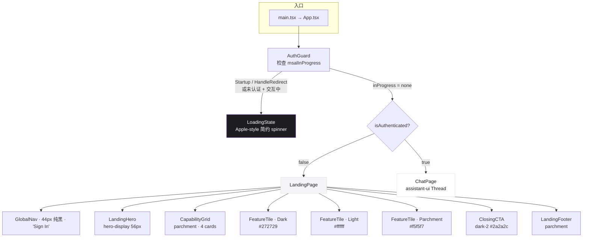
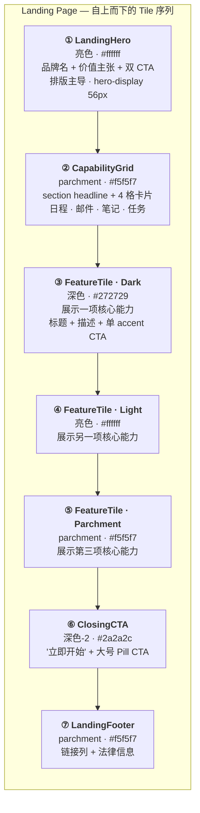
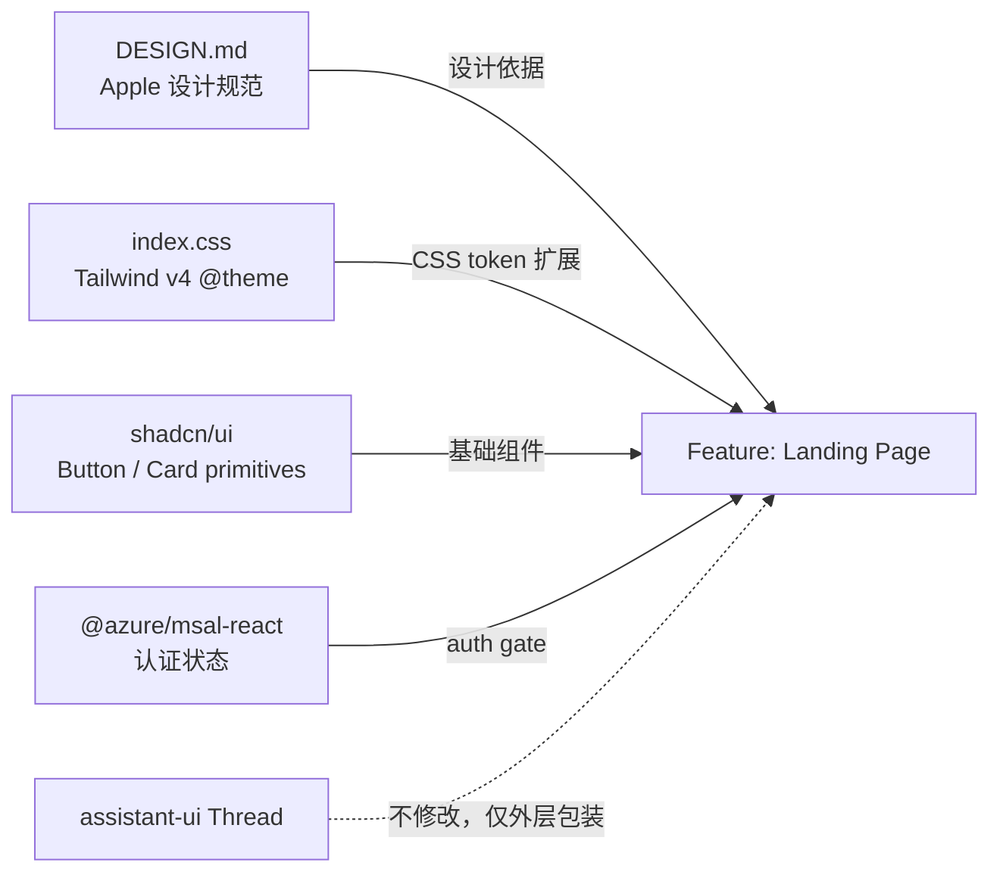
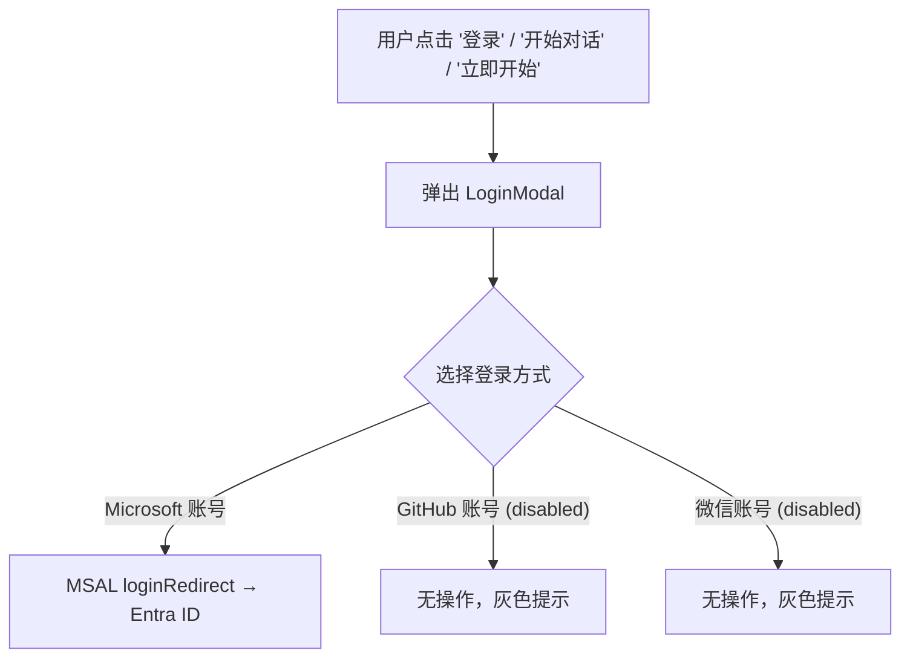

# Landing Page — Apple Design Language 前端首页

## Motivation

当前 `personal-assistant-client` 没有 Landing Page。`App.tsx` 直接渲染 `RuntimeProvider → Thread`，未登录用户仅看到一行 "请登录以开始对话" 的提示。这缺失了：

- **产品介绍**：用户无法在登录前了解 Assistant 能做什么
- **品牌建立**：无视觉 identity，无价值主张展示
- **转化引导**：无清晰的 CTA 引导用户完成首次登录/对话

本项目已有一份完整的 Apple 设计语言分析文档 [`personal-assistant-client/DESIGN.md`](../../personal-assistant-client/DESIGN.md)，定义了色彩、排版、间距、组件规范和设计哲学。本次变更基于该设计系统，构建一个**遵循 Apple 设计语言的 Landing Page**。

## 问题澄清

**问题不是"怎么区分登录/未登录页面"**——`useIsAuthenticated()` 已经提供了这个能力，`App.tsx` 里加个条件渲染就行。具体用不用 react-router 是 implementation plan 阶段根据实际情况决定的细节，不属于 issue 层面的设计问题。

**这个 issue 要解决的是：Landing Page 本身长什么样。**

## Scope

### In Scope

| 项目 | 说明 |
|------|------|
| Landing Page 页面结构 | Hero → Feature Tile × N → Capability Grid → Footer 的纵向 tile 序列 |
| AuthGuard | MSAL redirect 回调期间的 loading 状态 guard，防止 Landing Page 闪现 |
| 设计 token 落地 | 将 DESIGN.md 的色彩、排版、间距 token 转化为 Tailwind CSS v4 `@theme` 变量 |
| 组件设计 | LandingHero、FeatureTile、CapabilityCard、CapabilityGrid、LandingFooter 等组件 |
| Apple Pill Button | 新增 `apple-primary` / `apple-secondary` 变体（`rounded-full`、`active:scale-95`、padding 11px×22px） |
| 响应式布局 | 遵循 DESIGN.md 断点（1440/1068/833/734/640/480px） |
| e-commerce → AI 设计翻译 | 将 Apple 的"产品 tile"概念映射为 AI Assistant 的"能力展示 tile" |

### Out of Scope

| 项目 | 说明 |
|------|------|
| 页面路由机制 | 用 react-router 还是条件渲染，属于 implementation plan 阶段的决策 |
| assistant-ui 样式重写 | 仅做外层 layout 包装，不修改 Thread 内部 |
| 插图/摄影资产产出 | 使用 typography-first 策略，资产待 Meta 阶段定稿 |
| 暗色模式 | 本次仅实现亮色主题（DESIGN.md 的 Apple 默认白天模式） |
| 飞书/OfficeClaw 渠道 | 仅 Web Chat |

## 设计

### Architecture

> `App.tsx` 通过 `AuthGuard` 分流三种状态：MSAL 处理中（loading）→ 未登录（LandingPage）→ 已登录（ChatPage）。



**为什么需要 AuthGuard？** 用户从 Microsoft 登录页跳回应用时，MSAL 需要短暂处理 URL 中的 `#code=xxx`（`inProgress === "handleRedirect"`）。此时 `isAuthenticated` 还是 `false`，不加 guard 会短暂闪现 LandingPage 再切换到 Chat——体验很差。AuthGuard 在这个间隙渲染一个简约 loading 状态，等 MSAL 处理完再决定显示哪个页面。

### Tile Sequence（页面纵向节奏）

> 遵循 Apple 的亮暗交替节奏——颜色变化即为分割线。全出血（full-bleed）tile，`rounded.none`，tile 之间 `gap: 0`。每个 tile 上下内边距 `{spacing.section}`（80px）。



### Dependencies



### Design Translation：e-commerce → AI Assistant

Apple 设计语言原生于电商场景（产品摄影 → 产品 tile）。向 AI Assistant 的映射：

| Apple 电商原语 | AI Landing 翻译 | 视觉策略 |
|---|---|---|
| 产品摄影（iPhone 渲染图） | 品牌排版 + 可选 UI mockup | typography-first hero；若产出 mockup，置于 hero 底部带系统唯一 drop-shadow |
| Product Tile（全出血亮暗交替） | Feature Tile：每块 tile 展示一项核心能力 | 标题（display-lg 40px）+ 描述（body 17px）+ 可选示意图 + CTA |
| Store Utility Card Grid（18px 圆角产品卡） | Capability Grid：4 格能力卡片 | `{rounded.lg}` 18px、hairline 边框、icon + 标题 + 描述 |
| Buy / Learn More 双 CTA | 开始对话 / 了解更多 | Apple Pill Button（`rounded-full`、`#0066cc`、`active:scale-95`） |
| 产品规格对比表格 | 集成与安全说明 | parchment tile 上的 2–3 列 grid 展示 Microsoft 365 集成、Entra ID 认证 |

### 组件规格

以下组件直接映射到 DESIGN.md 的 component token，颜色/字号/间距全部引用 token 值。

#### `AuthGuard` — 认证状态分流

MSAL 初始化/登录回调期间渲染 loading 状态，防止 LandingPage 闪现或未认证状态的页面抖动。

```tsx
import { InteractionStatus } from "@azure/msal-browser";
import { useIsAuthenticated, useMsal } from "@azure/msal-react";

function AuthGuard({ children }: { children: ReactNode }) {
  const { inProgress } = useMsal();
  const isAuthenticated = useIsAuthenticated();

  const isAuthTransition =
    inProgress === InteractionStatus.Startup ||       // MSAL 初始化
    inProgress === InteractionStatus.HandleRedirect || // 登录回调处理中
    (!isAuthenticated && inProgress !== InteractionStatus.None); // 未认证 + 任何交互中

  if (isAuthTransition) {
    return <LoadingState />;
  }

  return <>{children}</>;
}
```

| 状态 | 行为 |
|------|------|
| `Startup` | MSAL 正在初始化 → 显示 LoadingState |
| `HandleRedirect` | 处理 Microsoft 登录回调 → 显示 LoadingState |
| `None` + `isAuthenticated = false` | 空闲且未认证 → 渲染 LandingPage |
| `None` + `isAuthenticated = true` | 空闲且已认证 → 渲染 ChatPage |
| `acquireToken` + 已认证 | 静默刷新 token → **不**拦截，正常渲染 ChatPage |

**关键设计决策**（Gemini & GPT 双审通过）：
- 使用 `InteractionStatus` 枚举，不用裸字符串，避免 MSAL 版本升级后断裂
- 显式排除 `acquireToken`——静默 token 刷新是后台操作，不应触发全屏 loading
- `!isAuthenticated && inProgress !== None` 作为兜底，覆盖 `Login`、`Logout` 等状态，防止任何未认证期间的闪现

#### `LandingPage` — 顶层容器

无 props，纯布局组件。纵向排列所有 tile，全出血，tile 之间 0 gap。

#### `LandingHero`

| Prop | Type | 说明 |
|------|------|------|
| `headline` | `string` | 品牌名，如 "Personal Assistant" |
| `tagline` | `string` | 价值主张 |
| `primaryCta` | `{ label: string; onClick: () => void }` | 主 CTA（Apple Pill） |
| `secondaryCta?` | `{ label: string; onClick: () => void }` | 次 CTA（Ghost Pill） |

**映射**：`product-tile-light`（白色背景），`typography.hero-display`（56px/600/-0.28px），`typography.lead`（28px/400/0.196px）。

#### `FeatureTile`

可复用的全出血 tile 组件。通过 `variant` 切换表面颜色。

| Prop | Type | 说明 |
|------|------|------|
| `variant` | `"light" \| "parchment" \| "dark" \| "dark-2"` | 表面颜色 |
| `headline` | `string` | 能力标题 |
| `description` | `string` | 能力描述 |
| `cta?` | `{ label: string; onClick: () => void }` | 可选 CTA |
| `children?` | `ReactNode` | 视觉元素（示意图、mockup 等） |

**映射**：`product-tile-light`（`#ffffff`）| `product-tile-parchment`（`#f5f5f7`）| `product-tile-dark`（`#272729`）| `product-tile-dark-2`（`#2a2a2c`）。标题 `typography.display-lg`（40px/600），描述 `typography.body`（17px/400）。

#### `CapabilityGrid`

| Prop | Type | 说明 |
|------|------|------|
| `headline` | `string` | Section 标题，如 "核心能力" |
| `cards` | `CapabilityCardProps[]` | 卡片列表 |

**映射**：`product-tile-parchment` 背景上的响应式 grid。≤833px 单列，834–1068px 双列，≥1069px 4 列。卡片间距 ~24px。

#### `CapabilityCard`

| Prop | Type | 说明 |
|------|------|------|
| `icon` | `LucideIcon` | 能力图标 |
| `title` | `string` | 能力名称 |
| `description` | `string` | 一句话描述 |

**映射**：`store-utility-card`。白色背景，1px solid `colors.hairline` 边框，`rounded.lg`（18px），padding `spacing.lg`（24px）。标题 `typography.body-strong`（17px/600），描述 `typography.body`（17px/400）。**无 shadow**。

#### `LandingFooter`

无 props。品牌名、链接列（可选）、法律信息。

**映射**：`footer`。背景 `colors.canvas-parchment`（`#f5f5f7`），文字 `colors.ink-muted-48`（`#7a7a7a`），`typography.fine-print`（12px/400），纵向 padding 64px。

### CSS Theme 演进

基于现有 `index.css` 做增量修改，不重写。

**① `--primary` 更新为 Action Blue**：

```css
:root {
  --primary: 210 100% 40%;       /* #0066cc → HSL，兼容 shadcn */
  --primary-foreground: 0 0% 100%;
}
```

**② 新增 Apple 表面颜色 token**：

```css
@theme {
  --color-canvas-parchment: #f5f5f7;
  --color-surface-tile-1: #272729;
  --color-surface-tile-2: #2a2a2c;
  --color-surface-tile-3: #252527;
  --color-surface-black: #000000;
}
```

新增后即可在 Tailwind 中使用 `bg-canvas-parchment`、`text-surface-tile-1` 等 utility class。

**③ 排版覆写**：

```css
@theme {
  --font-weight-medium: 600;  /* weight 500 → 600 重映射（Apple 不用 500） */
}
@layer base {
  html, body {
    font-size: 17px;           /* Apple body 基准，非 16px */
    line-height: 1.47;
    letter-spacing: -0.374px;
  }
}
```

**④ Apple Pill Button 变体**（shadcn Button 扩展）：

```tsx
// src/components/ui/button.tsx 新增 variant
"apple-primary": "bg-[#0066cc] text-white rounded-full px-[22px] py-[11px] 
                    text-[17px] leading-[1.47] tracking-[-0.374px] 
                    active:scale-95 transition-transform",
"apple-secondary": "bg-transparent text-[#0066cc] border border-[#0066cc] 
                      rounded-full px-[22px] py-[11px] 
                      text-[17px] leading-[1.47] tracking-[-0.374px] 
                      active:scale-95 transition-transform",
```

## Acceptance Criteria

- [ ] 未登录用户访问应用时展示完整的 Landing Page
- [ ] Landing Page 包含以下 tile（自上而下）：LandingHero → CapabilityGrid → FeatureTile（Dark）→ FeatureTile（Light）→ FeatureTile（Parchment）→ ClosingCTA → LandingFooter
- [ ] CapabilityGrid 包含 4 张 CapabilityCard：日程、邮件、笔记、任务（或等价的 4 项核心能力）
- [ ] MSAL redirect 回调期间显示简约 loading 状态（非 LandingPage 闪现），处理完成后自动切换到 Chat
- [ ] **"开始对话" CTA** 点击 → 弹出 LoginModal（多 provider 选择），非直接跳转微软登录
- [ ] **"了解更多" CTA** 点击 → 平滑滚动至下方内容介绍区域（`#capabilities`），不触发登录流程
- [ ] LandingHero 高度适当，不过度留白（`min-h-[60vh]` 或类似），内容垂直居中
- [ ] Tailwind v4 `@theme` 包含 DESIGN.md 定义的表面颜色 token
- [ ] `--primary` CSS variable 值为 `#0066cc`
- [ ] Body 基础字号为 17px，headline 带负字间距（限制在 `.landing-page` scope 内）
- [ ] 全出血 tile 无圆角（`rounded-none`）、无阴影、无装饰性渐变
- [ ] LoginModal 包含：Microsoft 账号登录（可用）、GitHub 账号登录（disabled + "即将支持"）、微信账号登录（disabled + "即将支持"）
- [ ] 页面在 480px–1440px 范围内响应式正常，导航栏在 ≤833px 折叠
- [ ] 现有 Chat 功能不受影响，登录后对话正常工作
- [ ] TypeScript 编译无错误，`npm run build` 成功
- [ ] 现有测试全部通过

---

## Iteration 2 — 设计改进（2026-06-14）

基于首次实现的 Feedback，对 Landing Page 进行以下三项设计改进：

### 改进 ①：Hero 留白缩减

**问题**：当前 `LandingHero` 使用 `min-h-[85vh]`，导致首屏上半段空白面积过大。

**方案**：将 `min-h-[85vh]` 缩减为 `min-h-[60vh]`，并将内部内容垂直居中。`py-[80px]` 保持不变作为上下呼吸空间。60vh 既保留了 Hero 的视觉分量（不显得局促），又消除了过度的空白区域。

```diff
- <section className="rounded-none min-h-[85vh] bg-white">
+ <section className="rounded-none min-h-[60vh] bg-white flex items-center">
```

### 改进 ②："了解更多" 平滑滚动

**问题**：当前所有 CTA 按钮（包括 "了解更多"）均直接触发 MSAL 登录跳转，用户点击 "了解更多" 时期望的是向下翻看页面介绍，而非直接跳到聊天窗口。

**方案**：

1. 给 `CapabilityGrid` 的 section 添加 `id="capabilities"`
2. `LandingHero` 的 `secondaryCta`（"了解更多"）→ `onClick` 改为 `scrollTo('#capabilities')`
3. `FeatureTile` 的 "了解更多" CTA → 同样改为滚动到下一个 tile
4. 只有 `primaryCta`（"开始对话"）和 `ClosingCTA`（"立即开始"）才触发登录流程

```tsx
// LandingPage.tsx
const handleScrollToCapabilities = () => {
  document.getElementById("capabilities")?.scrollIntoView({ behavior: "smooth" });
};
```

### 改进 ③：登录方式选择中间页

**问题**：当前点击 "登录" 或 "开始对话" 直接跳转到 Microsoft Entra ID 登录页。未来需要支持 GitHub、微信等多种登录方式，用户应在登录前看到一个 provider 选择界面。

**方案**：新增 `LoginModal` 组件 —— Apple 风格的底部 Sheet / 居中 Dialog，列出可用的登录方式：

| Provider | 状态 | 图标 | 行为 |
|----------|------|------|------|
| Microsoft 账号 | ✅ 可用 | `Microsoft` 图标 | `instance.loginRedirect(loginRequest)` |
| GitHub 账号 | 🔒 即将支持 | `GitHub` 图标 + 灰色 | 不触发任何操作，显示 "即将支持" badge |
| 微信账号 | 🔒 即将支持 | `MessageCircle` 图标 + 灰色 | 不触发任何操作，显示 "即将支持" badge |

**交互流程变更**：



**受影响的入口点**：
- `GlobalNav` "登录" 按钮 → `onLogin` 改为打开 LoginModal
- `LandingHero` `primaryCta` "开始对话" → 打开 LoginModal
- `ClosingCTA` "立即开始" → 打开 LoginModal
- `LandingHero` `secondaryCta` "了解更多" → 平滑滚动（不受影响，见改进②）

**LoginModal 组件规格**：

| Prop | Type | 说明 |
|------|------|------|
| `open` | `boolean` | 是否显示 |
| `onClose` | `() => void` | 关闭回调 |
| `onMicrosoftLogin` | `() => void` | Microsoft 登录回调 |

- 底部 Sheet 样式（移动端）或居中 Dialog（桌面端）
- Apple 风格：白色背景、圆角 20px、subtle backdrop blur
- 每个 provider 一行：图标 + 名称 + 状态标签
- 可用的 provider：可点击，hover 高亮
- 不可用的 provider：`opacity-50`、`cursor-not-allowed`、右侧灰色 "即将支持" badge
- 底部 "取消" 按钮关闭 Modal

### 受影响的文件

| 文件 | 变更 |
|------|------|
| `LandingHero.tsx` | `min-h-[85vh]` → `min-h-[60vh]` + `flex items-center` |
| `LandingPage.tsx` | 新增 `handleOpenLogin` / `handleScrollToCapabilities`；CTA 分流 |
| `LoginModal.tsx`（新） | provider 选择 Modal |
| `GlobalNav.tsx` | "登录" 按钮 `onClick` 打开 LoginModal（非直跳 MSAL） |
| `CapabilityGrid.tsx` | 外层 section 加 `id="capabilities"` |
| `FeatureTile.tsx` | "了解更多" CTA onClick 改为 scroll（由 LandingPage 传入） |

## Four-Question Gate

| Question | Answer | Notes |
|----------|--------|-------|
| **Is it best practice?** | **Yes** | 组件化拆分（独立 Page 组件）、设计 token 化（CSS variable + Tailwind @theme）、DESIGN.md 驱动的组件规格——均符合前端工程最佳实践。Feature Tile/Capability Card 等可复用组件遵循单一职责。 |
| **Is it de facto standard?** | **Yes** | Apple 设计语言是全球顶级消费界面的标准参考。Hero → Features Grid → CTA → Footer 的 Landing Page 结构被 OpenAI ChatGPT、Anthropic Claude、Notion AI 等主流产品采用。单 accent 色、pill CTA、亮暗交替 tile 均源自 apple.com 生产系统。 |
| **Is it conventional?** | **Yes** | 内容结构（Hero → Features → CTA → Footer）是最经典的 Landing Page 模式。DESIGN.md 的 token 引用方式（`{colors.primary}`、`{typography.body}`）使新成员可直接对照设计文档理解组件样式。 |
| **Is it modern?** | **Yes** | React 19 + Tailwind CSS v4 + shadcn/ui 是 React 前端领先技术栈。Apple 2024–2025 Web 设计语言（56px hero-display 负字间距、单一 Action Blue、全出血 tile、`active:scale-95` 微交互）代表界面设计前沿方向。 |

## Affected Architecture Docs

- `personal-assistant-meta/architecture/frontend_architecture.md` — 需新增 §2.1.3 Landing Page 小节

## Risks & Mitigations

| 风险 | 缓解 |
|------|------|
| **两种蓝色并存**（旧 `#007AFF` vs 新 `#0066cc`） | 统一为 `#0066cc`。shadcn 组件通过 `--primary` CSS variable 自动继承，无需逐一修改 |
| **Typography 覆写影响 assistant-ui** | Apple 排版规则限制在 `.landing-page` wrapper 作用域内，不污染 Thread 内部样式 |
| **无产品摄影资产** | typography-first hero + 可选 UI mockup。不依赖外部摄影素材，排版本身即可撑起视觉分量 |
| **非 Apple 平台字体回退** | Geist Variable 已安装，font stack：`"SF Pro Display", "SF Pro Text", "Geist Variable", system-ui, sans-serif` |
| **首屏加载体积** | `React.lazy()` + `<Suspense>` 实现 Landing Page 和 Chat Page 的 code splitting |

## Advisor Reports（supporting data）

<details>
<summary>DeepSeek Report</summary>

### Key Findings
- 目前没有 Landing Page，App.tsx 直接渲染 Thread。未登录体验缺失。
- Apple 设计语言需要从 e-commerce 映射到 AI 领域：产品→能力，产品摄影→排版/UI mockup。
- assistant-ui Thread 组件实例化成本高，应在 auth 后才挂载 RuntimeProvider。
- 现有 shadcn Button 不支持 Apple pill 语法，需新增变体。

### Component Breakdown
- `LandingPage.tsx` — 顶层容器
- `LandingHero.tsx` — Hero tile（typography-first，hero-display 56px）
- `FeatureTile.tsx` — 可复用 tile（variant: light/parchment/dark/dark-2）
- `FeatureGrid.tsx` — parchment tile 上的能力网格
- `CapabilityCard.tsx` — 网格中的单张卡片（store-utility-card 样式）
- `LandingFooter.tsx` — footer

### Tile Sequence
1. Hero（亮色）→ 2. Capability Grid（parchment）→ 3. Feature Tile（深色）→ 4. Feature Tile（亮色）→ 5. Closing CTA（深色-2）→ 6. Footer（parchment）

### Four-Question Gate: All Yes

</details>

<details>
<summary>Gemini Report</summary>

### Key Findings
- AI 场景下用高精度 UI Mockup、卡片化交互过程替代实体硬件摄影。
- 严格执行色彩交替（Light ↔ Dark）代替显式分割线。
- 整页仅一种彩色：Action Blue `#0066cc`；深色 tile 上升级为 Sky Link Blue `#2997ff`。
- 所有 Button 强制使用 `transform: scale(0.95)` 点击微交互。

### Component Breakdown
- `GlobalNav`（44px 纯黑）
- `SubNavFrosted`（52px 粘性毛玻璃）
- `HeroTile`（min-h-[85vh]，大视口 AI Workspace Mockup 配合系统 drop-shadow）
- `CapabilityTile`（Props: theme, title, tagline, imageSrc, reverse, ctaText）
- `IntegrationGrid`（18px 圆角卡片）
- `Footer`（高密度链接网格，leading-[2.41]）

### Four-Question Gate: All Yes

</details>

<details>
<summary>GPT Report</summary>

### Key Findings
- 最佳方案：创建独立的未登录 Landing Page，登录后进入现有 Thread chat。
- 不要深度重写 assistant-ui，仅用 Apple 风格 layout/navigation 包装。
- Landing Page 应为 typography-first + 一个高质量 chat/product mockup。
- CTA 单一明确："开始对话"/"登录后开始"。

### Component Structure
- `src/components/layout/` — AppChrome, GlobalNav, Footer
- `src/components/landing/` — LandingPage, HeroSection, CapabilityTile, CapabilityTiles, AssistantPreview, TrustPrivacySection, ChannelSection, FinalCTA
- `src/components/chat/` — ChatApp, ChatHeader

### Four-Question Gate: All Yes

</details>

<details>
<summary>Hermes Report</summary>

### Key Findings
- Core Insight：电商的"产品"是物理对象，AI Assistant 的"产品"是用户的 augmented life。
- Hero 替代方案：Ambient Day-at-a-Glance Widget、Active Drafting Canvas、Pulse Ring。
- Tile 替换：Command Center / Inbox Outpost / Knowledge Vault / Delegation Core（亮暗交替）。
- 无产品摄影时的 material realism 策略：文字/代码/日历块作为带系统 shadow 的物理对象、纹理背景、氛围摄影。

### Component Breakdown（11 个组件）
1. LandingPage, 2. GlobalNav, 3. LandingHero, 4. FeatureTile, 5. CapabilityCard, 6. CapabilityGrid, 7. ChatSimulator, 8. PrimaryCTA, 9. SecondaryCTA, 10. LandingFooter, 11. ChatPage

### Theme Integration
```css
:root { --primary: 210 100% 40%; }  /* #0066cc */
@theme {
  --color-canvas-parchment: #f5f5f7;
  --color-surface-tile-1: #272729;
  --font-weight-medium: 600;
}
```

### Four-Question Gate: All Yes（设计层面）

</details>
