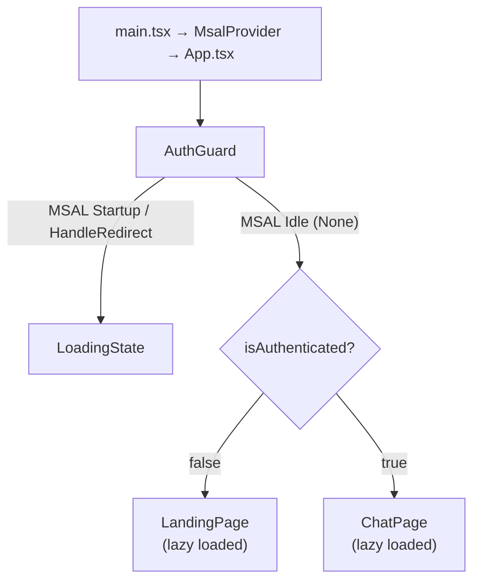
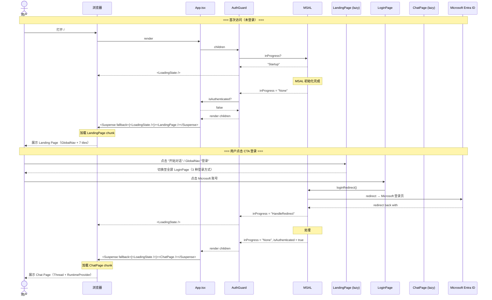

# Implementation Plan — Landing Page（Apple Design Language 前端首页）

> **Issue**: `personal-assistant-meta/issues/features/feature-landing-page/issue.md`  
> **Feature Branch**: `feat/feature-landing-page`  
> **Plan Author**: personal-assistant-meta-dev  
> **Date**: 2026-06-13

---

## 0. Issue Evaluation

| 维度 | 结果 | 说明 |
|------|------|------|
| Staleness | ✅ | 全新 feature，引用的 `frontend_architecture.md`、`DESIGN.md` 均存在且内容匹配 |
| Feasibility | ✅ | 技术路径明确：AuthGuard（MSAL InteractionStatus）→ CSS theme 扩展 → 组件分层实现。所有依赖已就绪（MSAL、Tailwind CSS v4、shadcn Button、辅助 UI Thread） |
| Completeness | ✅ | Issue 包含完整的组件规格、TypeScript prop 类型、CSS 变更、12 条验收标准 |
| Impact Scope | ✅ | 纯 Client 侧变更。Service 侧零改动。影响范围：13 个新文件 + 5 个修改文件 + 1 个架构文档更新 |
| ADR 冲突 | ✅ | 与 ADR-008（Vite+React+Tailwind）、ADR-013（assistant-ui）、ADR-007（MSAL Entra ID）均无冲突。不修改 Thread 内部，不引入新路由框架 |

**判定：ACCEPT** → 继续编写 Implementation Plan。

---

## 1. Summary

当前 `App.tsx` 直接渲染 `RuntimeProvider → Thread`，未登录用户仅看到"请登录以开始对话"一行提示。本次变更为 Web Chat 添加遵循 Apple Design Language（[`DESIGN.md`](../../../personal-assistant-client/DESIGN.md)）的 Landing Page：

- **7-tile 序列**：LandingHero → CapabilityGrid → FeatureTile (Dark) → FeatureTile (Light) → FeatureTile (Parchment) → ClosingCTA → LandingFooter
- **LoginPage**：全屏登录方式选择页（3 枚品牌 SVG 图标内联），主 CTA 点击切换至 LoginPage，次 CTA 平滑滚动至 CapabilityGrid
- **AuthGuard**：基于 MSAL `InteractionStatus` 防止 redirect 回调期间 Landing Page 闪现
- **Code Splitting**：`React.lazy()` + `<Suspense>` 分离 Landing Page 和 Chat Page 代码块
- **RuntimeProvider 延迟挂载**：仅在 ChatPage 中挂载，避免未登录用户加载 assistant-ui 依赖
- **CSS Theme 演进**：`--primary → #0066cc` + Apple 表面颜色 token + 17px body 基准
- **Apple Pill Button**：shadcn Button 新增 `apple-primary` / `apple-secondary` 变体

纯前端改动，无 API 变更。

---

## 2. Files Changed

### New Files（12 个，`personal-assistant-client/src/`）

| # | File Path | Type | Description |
|---|-----------|------|-------------|
| 1 | `components/landing/AuthGuard.tsx` | New | MSAL `InteractionStatus` 认证状态 gate；transition 期间渲染 LoadingState |
| 2 | `components/landing/LoadingState.tsx` | New | Apple-style 简约 spinner（含 `role="status"` accessibility），供 AuthGuard / Suspense / hydration guard 使用 |
| 3 | `components/landing/ChunkErrorBoundary.tsx` | New | React class-component Error Boundary：捕获 `React.lazy()` chunk 加载失败，降级 UI 提示刷新 |
| 4 | `components/landing/GlobalNav.tsx` | New | 44px 纯黑全局导航栏（含 dev-mode guard），右侧 "登录" 按钮打开 LoginPage；≤833px 仅保留登录按钮 |
| 5 | `components/landing/LandingPage.tsx` | New | Landing Page 顶层容器，编排 GlobalNav + 7-tile 序列 + LoginPage 条件渲染，注入 login CTA routing |
| 6 | `components/landing/LandingHero.tsx` | New | 首屏 Hero tile（typography-first，56px hero-display，60vh min-height，双 CTA Pill Button） |
| 7 | `components/landing/FeatureTile.tsx` | New | 可复用全出血 tile（variant: `light` / `parchment` / `dark` / `dark-2`） |
| 8 | `components/landing/CapabilityCard.tsx` | New | 单张能力卡片（store-utility-card 样式，18px 圆角，hairline 边框） |
| 9 | `components/landing/CapabilityGrid.tsx` | New | 响应式能力卡片网格（1/2/4 列自适应），带 `id="capabilities"` 锚点 |
| 10 | `components/landing/ClosingCTA.tsx` | New | 薄包装组件：复用 `<FeatureTile variant="dark-2">` 渲染最后的 CTA tile |
| 11 | `components/landing/LoginPage.tsx` | New | 全屏登录方式选择页（3 枚品牌 SVG 图标内联，Microsoft 活跃 + GitHub/微信 disabled "即将支持"），通过 LandingPage 条件渲染切换 |
| 12 | `components/landing/LandingFooter.tsx` | New | 页脚（parchment 背景，WCAG AA 合规颜色，链接列 + 法律信息） |

### New File（1 个，`personal-assistant-client/src/`）

| # | File Path | Type | Description |
|---|-----------|------|-------------|
| 13 | `components/chat/ChatPage.tsx` | New | 从 `App.tsx` 提取的 Chat 页面（RuntimeProvider + TooltipProvider + Thread + 顶栏），用于 lazy loading |

### Modified Files（5 个，`personal-assistant-client/src/`）

| # | File Path | Type | Description |
|---|-----------|------|-------------|
| 14 | `main.tsx` | Modified | 在 `handleRedirectPromise().then()` 末尾新增一行 `useAuthStore.getState().setHydrated(true)` |
| 15 | `App.tsx` | Modified | 重构为 AuthGuard + ChunkErrorBoundary + Suspense + hydrated guard + 条件渲染 |
| 16 | `index.css` | Modified | `--primary → #0066cc`；新增 Apple 表面颜色 `@theme` token；新增 `.landing-page` scoped 排版规则 |
| 17 | `components/ui/button.tsx` | Modified | CVA 变体新增 `apple-primary`（`bg-primary h-auto rounded-full`）和 `apple-secondary` |
| 18 | `stores/auth-store.ts` | Modified | 新增 `hydrated: boolean` 状态和 `setHydrated` 方法 |

### Modified Meta File（1 个）

| # | File Path | Type | Description |
|---|-----------|------|-------------|
| 19 | `personal-assistant-meta/architecture/frontend_architecture.md` | Modified | 新增 §2.1.3 Landing Page 小节 |

### Files NOT Changed

| File | Reason |
|------|--------|
| `lib/auth.ts` | MSAL 配置不变 |
| `components/LoginButton.tsx` | 登录按钮逻辑不变（移至 ChatPage 内使用） |
| `components/RuntimeProvider.tsx` | 组件不变，仅调用位置从 App 移到 ChatPage |
| `components/assistant-ui/thread.tsx` | 不修改 assistant-ui Thread 内部 |

---

## 3. Implementation Steps

> 步骤顺序已按依赖关系排列：CSS 主题和 Button 变体是所有视觉组件的基础，AuthGuard + LoadingState 是 App 重构的基础，组件从叶子到容器逐层构建。

### Step 1 — CSS Theme：更新 `--primary` 并新增 Apple 表面颜色 token

**File**: `personal-assistant-client/src/index.css`

**Actions**:

1. 将 `:root` 中的 `--primary` 从 `#007AFF` 改为 `#0066cc`（hex 格式，与现有 `index.css` 风格一致，被 `@theme inline { --color-primary: var(--primary) }` 直接消费无需 `hsl()` 包裹），同步更新：
   ```css
   :root {
     --primary: #0066cc;
     --primary-foreground: #ffffff;
     --ring: #0066cc;
     --chart-1: #0066cc;
     --sidebar-primary: #0066cc;
     --sidebar-ring: #0066cc;
   }
   ```
2. 在现有 `@theme inline { ... }` 块之后新增一个 `@theme { ... }` 块，定义 Apple 表面颜色 token：
   ```css
   @theme {
     --color-canvas-parchment: #f5f5f7;
     --color-surface-tile-1: #272729;
     --color-surface-tile-2: #2a2a2c;
     --color-surface-tile-3: #252527;
     --color-surface-black: #000000;
   }
   ```
   注意：**不**再覆写 `--font-weight-medium`——所有需要 weight 600 的地方使用 `font-semibold`（原生映射 600），不污染全局 `font-medium`（500→600 会影响所有 shadcn 组件）。
3. **不**做全局 `html, body` 排版覆写。改为在文件中新增一个 scoped `.landing-page` 规则（见下方）。
4. 在文件末尾新增 `.landing-page` scoped 排版规则：
   ```css
   .landing-page {
     font-size: 17px;
     line-height: 1.47;
     letter-spacing: -0.374px;
   }
   ```
   Apple 排版仅作用于 Landing Page 内部，不污染 assistant-ui Thread 或 shadcn 组件的 rem 基准。

**Verification**: `grep --color=always "#0066cc" index.css` 确认 primary 值为 `#0066cc`；`grep "canvas-parchment" index.css` 确认新 surface token 存在；`grep "landing-page" index.css` 确认 scoped 规则存在；`npm run dev` 启动无 CSS 编译错误。

---

### Step 2 — Button Variants：添加 `apple-primary` 和 `apple-secondary`

**File**: `personal-assistant-client/src/components/ui/button.tsx`

**Actions**:

在 `buttonVariants` 的 `variant` 对象中新增两个条目：

```ts
apple-primary:
  "bg-primary text-primary-foreground rounded-full h-auto px-[22px] py-[11px] text-[17px] leading-[1.47] tracking-[-0.374px] active:scale-95 transition-transform hover:bg-primary/80",
apple-secondary:
  "bg-transparent text-primary border border-primary rounded-full h-auto px-[22px] py-[11px] text-[17px] leading-[1.47] tracking-[-0.374px] active:scale-95 transition-transform hover:bg-primary/10",
```

注意：
- `rounded-full` 覆盖基类 `rounded-lg`；`text-[17px]` 覆盖基类 `text-sm`
- `h-auto` 覆盖基类 `size="default"` 的 `h-8`（32px）固定高度约束——让 `py-[11px]`（22px 垂直内边距）自然定义按钮高度，避免文字被截断
- `bg-primary`、`text-primary`、`border-primary` 全部引用 `--primary` CSS variable（现为 `#0066cc`），自动跟踪未来 primary 色变更，无需维护硬编码 hex
- `transition-transform` 有意覆盖基类 `transition-all`——Apple pill button 的 micro-interaction 仅需 scale transform 动画，不应有 color/background 的过渡

**Verification**: TypeScript 编译通过 — `variant="apple-primary"` 类型应在 `VariantProps<typeof buttonVariants>` 推断范围之内。

---

### Step 3 — `LoadingState` 组件

**File**: `personal-assistant-client/src/components/landing/LoadingState.tsx` (New)

**Spec**:
- 全屏居中布局（`h-dvh`），白色背景
- 一个简约的居中 spinner：Apple 风格用小号 `animate-spin` 圆环、颜色 `text-[#0066cc]/60`、尺寸 24×24px
- 无文字，无额外 chrome
- 无 props，纯展示组件
- **Accessibility**：外层容器添加 `role="status"` + `aria-live="polite"` 使屏幕阅读器感知 loading 状态

```tsx
export function LoadingState() {
  return (
    <div className="flex h-dvh items-center justify-center bg-white"
         role="status" aria-live="polite">
      <div className="h-6 w-6 animate-spin rounded-full border-2 border-[#0066cc]/20 border-t-[#0066cc]/60" />
    </div>
  );
}
```

**Verification**: 目视检查 spinner 居中、旋转平滑。

---

### Step 4 — `AuthGuard` 组件

**File**: `personal-assistant-client/src/components/landing/AuthGuard.tsx` (New)

**Spec**: 照搬 issue 中的 AuthGuard 代码，一字不差：

```tsx
import { type ReactNode } from "react";
import { InteractionStatus } from "@azure/msal-browser";
import { useIsAuthenticated, useMsal } from "@azure/msal-react";
import { LoadingState } from "./LoadingState";

export function AuthGuard({ children }: { children: ReactNode }) {
  const { inProgress } = useMsal();
  const isAuthenticated = useIsAuthenticated();

  const isAuthTransition =
    inProgress === InteractionStatus.Startup ||
    inProgress === InteractionStatus.HandleRedirect ||
    (!isAuthenticated && inProgress !== InteractionStatus.None);

  if (isAuthTransition) {
    return <LoadingState />;
  }

  return <>{children}</>;
}
```

**关键设计点**（已在 issue 中通过 Gemini & GPT 双审）：
- 使用 `InteractionStatus` 枚举，不裸字符串
- 显式排除 `acquireToken`（静默刷新不触发全屏 loading）
- `!isAuthenticated && inProgress !== None` 作为兜底，覆盖 `Login`、`Logout` 等状态

**Verification**: 登录回调期间不闪现 LandingPage，LoadingState 平滑过渡到 ChatPage。

---

### Step 5 — `ChunkErrorBoundary` 组件

**File**: `personal-assistant-client/src/components/landing/ChunkErrorBoundary.tsx` (New)

**目的**：`React.lazy()` 在 chunk 加载失败时（网络错误、CDN 故障）会 throw，若无 Error Boundary 整个 React tree 卸载为白屏。此组件捕获 chunk 加载错误并提供友好的降级 UI。

**Spec**：

```tsx
import { Component, type ReactNode, type ErrorInfo } from "react";

interface Props { children: ReactNode; }
interface State { hasError: boolean; }

export class ChunkErrorBoundary extends Component<Props, State> {
  state: State = { hasError: false };

  static getDerivedStateFromError(): State {
    return { hasError: true };
  }

  componentDidCatch(error: Error, info: ErrorInfo) {
    console.error("Chunk load failed:", error, info.componentStack);
  }

  render() {
    if (this.state.hasError) {
      return (
        <div className="flex h-dvh items-center justify-center bg-white">
          <p className="text-[#333333]">加载失败，请刷新页面重试</p>
        </div>
      );
    }
    return this.props.children;
  }
}
```

**机制**：class component 的 `getDerivedStateFromError` 在子组件（即 `React.lazy()` 组件）throw 时触发，设置 `hasError = true`，render 降级 UI。用户刷新页面后重新尝试加载 chunk。

**Verification**: 模拟 chunk 加载失败（e.g., 在 DevTools 中 block 对应的 JS 文件），验证降级 UI 渲染而非白屏。

---

### Step 6 — `GlobalNav` 全局导航栏

**File**: `personal-assistant-client/src/components/landing/GlobalNav.tsx` (New)

**Props**:

| Prop | Type | Required | Description |
|------|------|----------|-------------|
| `onLogin` | `() => void` | No | 点击 "登录" 按钮时触发，打开 LoginPage（全屏登录选择页，不再直接调用 MSAL redirect）。dev mode 下不传，组件自行处理 |

**实现要点**:

1. **映射 `global-nav`**（DESIGN.md）：
   - 高度：`h-[44px]`（固定 44px）
   - 背景：`bg-surface-black`（`#000000`）
   - 文字：`text-white` + `text-[12px]`（`nav-link`）
   - 全宽：`w-full`，sticky 置顶

2. 内部布局（`flex items-center justify-between`，水平内边距 ~20px）：
   - 左侧：品牌名 "Personal Assistant"（可选，白色文字，小号）
   - 右侧："登录" 按钮 — 使用 shadcn `Button` 的 `variant="ghost"` + `size="sm"`（白色文字），`onClick` 触发 `onLogin`

3. 响应式折叠（≤833px）：简化处理——使用 `hidden lg:inline`（Tailwind `lg` 断点为 1024px，是满足 ≤833px 要求的最接近标准断点，无需自定义 CSS）隐藏左侧品牌名，右侧仅保留 "登录" 按钮

4. 无阴影、无边框（Apple nav 是纯黑条，无底部阴影）

5. **Dev-mode guard**：与 `LoginButton.tsx` 一致，检查 `import.meta.env.VITE_ENTRA_CLIENT_ID`。dev mode 下渲染 "Dev Mode" 文字指示器替代登录按钮

```tsx
import { Button } from "@/components/ui/button";

interface GlobalNavProps {
  onLogin?: () => void;
}

export function GlobalNav({ onLogin }: GlobalNavProps) {
  const isDev = !import.meta.env.VITE_ENTRA_CLIENT_ID;

  return (
    <nav className="sticky top-0 z-50 flex h-[44px] w-full items-center justify-between bg-surface-black px-5">
      <span className="text-[12px] font-normal text-white/90 hidden lg:inline">
        Personal Assistant
      </span>
      <div className="ml-auto">
        {isDev ? (
          <span className="text-[12px] text-white/60">Dev Mode</span>
        ) : (
          <Button variant="ghost" size="sm" onClick={onLogin}
            className="text-[12px] text-white hover:text-white/80">
            登录
          </Button>
        )}
      </div>
    </nav>
  );
}
```

**Verification**: 导航栏 44px 纯黑，右侧 "登录" 按钮点击打开 LoginPage（而非直接跳转 MSAL）；缩小窗口至 ≤1024px 时品牌名隐藏，登录按钮保留。

---

### Step 7 — `FeatureTile` 可复用组件

**File**: `personal-assistant-client/src/components/landing/FeatureTile.tsx` (New)

**Props**:

| Prop | Type | Required | Default | Description |
|------|------|----------|---------|-------------|
| `variant` | `"light" \| "parchment" \| "dark" \| "dark-2"` | Yes | — | 表面颜色 |
| `headline` | `string` | Yes | — | 能力标题 |
| `description` | `string` | Yes | — | 能力描述 |
| `cta` | `{ label: string; onClick: () => void }` | No | — | 可选 CTA |
| `children` | `ReactNode` | No | — | 视觉元素插槽 |

**实现要点**:

1. 使用 variant → 背景色映射：
   ```ts
   const surfaceMap = {
     light: "bg-white text-[#1d1d1f]",
     parchment: "bg-canvas-parchment text-[#1d1d1f]",
     dark: "bg-surface-tile-1 text-white",
     "dark-2": "bg-surface-tile-2 text-white",
   };
   ```

2. 全出血 tile：
   - `rounded-none` — 零圆角
   - 无 `shadow` — 零阴影
    - `py-[80px]`（映射 `spacing.section` 80px）— 上下内边距。使用 px 绝对值以保证与 DESIGN.md `spacing.section`（80px）精确一致，不受 root font-size 影响
   - 无 gap 与相邻 tile（颜色变化即为分割线）

3. 内部布局：居中内容区，最大宽度参照 Apple 规范（~980px），左右自动居中。内容纵向排列：
   - 标题：`text-[40px] font-semibold leading-[1.1] tracking-[0]`（`display-lg`）
   - 描述：`text-[17px] font-normal leading-[1.47] tracking-[-0.374px] mt-6`
   - 可选 CTA：`mt-8`，使用 `apple-primary` Button
   - 可选 children：`mt-12`

**Verification**: 4 个 variant 均渲染正确的背景色；`rounded-none` 生效；无阴影。

---

### Step 8 — `LandingHero` 组件

**File**: `personal-assistant-client/src/components/landing/LandingHero.tsx` (New)

**Props**:

| Prop | Type | Required | Description |
|------|------|----------|-------------|
| `headline` | `string` | Yes | 品牌名（e.g., "Personal Assistant"） |
| `tagline` | `string` | Yes | 价值主张 |
| `primaryCta` | `{ label: string; onClick: () => void }` | Yes | 主 CTA |
| `secondaryCta` | `{ label: string; onClick: () => void }` | No | 次 CTA |

**实现要点**:

1. 白色背景全出血 tile（同 FeatureTile `light` variant 布局模式），`rounded-none`，`min-h-[60vh]` + `flex items-center` 实现内容垂直居中，降低首屏高度以减少留白。`py-[80px]` 作为呼吸空间保持不变
2. 内容居中，纵向排列：
   - 品牌名 headline：`text-[56px] font-semibold leading-[1.07] tracking-[-0.28px]`（`hero-display`）
   - 价值主张 tagline：`text-[28px] font-normal leading-[1.14] tracking-[0.196px] mt-6`（`lead`）
   - 双 CTA 按钮组：`mt-12`，横排 `flex gap-4`，主 CTA 用 `apple-primary`，次 CTA 用 `apple-secondary`（**仅当 `secondaryCta` prop 存在时渲染**——使用 `{secondaryCta && <Button variant="apple-secondary" ...>}` 条件守卫）
3. Typography-first：无产品摄影、无 mockup 资产

**Verification**: 56px headline 渲染正确，双 CTA 按钮间距适当，60vh minimum height with content vertically centered，`active:scale-95` 点击缩放效果生效。

---

### Step 9 — `CapabilityCard` 组件

**File**: `personal-assistant-client/src/components/landing/CapabilityCard.tsx` (New)

**Props**:

| Prop | Type | Required | Description |
|------|------|----------|-------------|
| `icon` | `LucideIcon` | Yes | 能力图标（来自 lucide-react） |
| `title` | `string` | Yes | 能力名称 |
| `description` | `string` | Yes | 一句话描述 |

**实现要点**:

1. **映射 `store-utility-card`**：白色背景 + `rounded-[18px]` + 1px solid `border-[#e0e0e0]`（hairline）+ `p-6`（24px）+ **无 shadow**
2. 内部纵向排列：
    - 图标：`24×24px`，颜色 `text-primary`（引用 `--primary` CSS variable，现为 `#0066cc`）
   - 标题：`text-[17px] font-semibold leading-[1.24] tracking-[-0.374px] mt-4`（`body-strong`）
    - 描述：`text-[17px] font-normal leading-[1.47] tracking-[-0.374px] mt-2 text-[#333333]`（`ink-muted-80`，对比度 12.6:1 通过 WCAG AAA）

**Verification**: 4 张能力卡渲染一致，圆角 18px，hairline 边框可见，无阴影。

---

### Step 10 — `CapabilityGrid` 组件

**File**: `personal-assistant-client/src/components/landing/CapabilityGrid.tsx` (New)

**Props**:

| Prop | Type | Required | Description |
|------|------|----------|-------------|
| `headline` | `string` | Yes | Section 标题（e.g., "核心能力"） |
| `cards` | `{ icon: LucideIcon; title: string; description: string }[]` | Yes | 卡片列表 |

**实现要点**:

1. 全出血 parchment tile（`id="capabilities"`，`bg-canvas-parchment`，`rounded-none`，`py-[80px]`）
2. Section 标题：`text-[40px] font-semibold leading-[1.1] text-center`，居中
3. 响应式卡片网格：
   - `≤833px`：单列（`grid-cols-1`）
   - `834–1068px`：双列（`grid-cols-2`）
   - `≥1069px`：4 列（`grid-cols-4`）
   - 卡片间距：`gap-6`（~24px）
4. 网格居中容器：`max-w-[980px] mx-auto`

**Verification**: 在不同视口宽度下调整浏览器窗口，验证列数切换。

---

### Step 11 — `ClosingCTA` 组件

**File**: `personal-assistant-client/src/components/landing/ClosingCTA.tsx` (New)

**Props**:

| Prop | Type | Required | Description |
|------|------|----------|-------------|
| `cta` | `{ label: string; onClick: () => void }` | Yes | 大号 Pill CTA |

**实现要点**:

1. 内部直接复用 `<FeatureTile variant="dark-2">`，将 CTA 渲染在 tile 内容区
2. ClosingCTA 自身是一个薄包装，不引入新布局逻辑
3. CTA 按钮使用 `apple-primary`，配合大号文本（`text-[18px]`）以突出"立即开始"

**Verification**: 渲染深色 tile（#2a2a2c），CTA 按钮居中显示。

---

### Step 12 — `LoginPage` 组件

**File**: `personal-assistant-client/src/components/landing/LoginPage.tsx` (New, replaces former `LoginModal.tsx`)

**目的**：用户点击主 CTA（"开始对话"、"立即开始"、GlobalNav "登录"）时，切换至全屏登录方式选择页。当前仅 Microsoft 可用，GitHub 和微信显示 "即将支持" disabled 状态。

**Props**:

| Prop | Type | Required | Description |
|------|------|----------|-------------|
| `onBack` | `() => void` | Yes | 返回 LandingPage 回调 |

不再是 modal（无 `open`/`onClose`/`onMicrosoftLogin` props）。通过 LandingPage 的条件渲染切换页面。

**实现要点**:

1. 全屏布局（`min-h-dvh`），白色背景，纵向 flex 三区：
   - **Top bar**（44px）：左侧 "← 返回" 按钮（`ArrowLeft` 图标，`text-[#0066cc]`），点击触发 `onBack`
   - **Centered content**（`flex-1 flex items-center justify-center`）：max-w-[420px] 居中内容区，包含标题 "登录 Personal Assistant"（28px/600）+ 副标题 + 三行 provider card
   - **Bottom branding**（`pb-8 text-center`）："Personal Assistant" 12px 灰色水印

2. 三行 provider card（每行 `w-full flex items-center gap-4 p-5 rounded-xl border border-[#e0e0e0]`）：
   - **Microsoft**（活跃）：无 `opacity` 限制，`hover:bg-[#f5f5f7] transition-colors cursor-pointer`，`onClick` 直接调用 MSAL `loginRedirect`。左侧 MicrosoftIcon SVG；中间标题 "Microsoft 账号" + 副标题 "使用 Entra ID 或 Microsoft 365 账号"
   - **GitHub**（disabled）：`opacity-50 cursor-not-allowed`，右侧 `rounded-full` badge "即将支持"，标题 "GitHub 账号" + 副标题 "使用 GitHub 账号登录"
   - **WeChat**（disabled）：`opacity-50 cursor-not-allowed`，右侧 badge，标题 "微信账号" + 副标题 "使用微信扫码登录"

3. 三枚内联品牌 SVG 图标（24×24px，`shrink-0`），定义在同一文件中：

**MicrosoftIcon** — 四色方块 2×2 网格：
```tsx
function MicrosoftIcon() {
  return (
    <svg viewBox="0 0 24 24" width="24" height="24" className="shrink-0">
      <rect x="1" y="1" width="10" height="10" fill="#f25022" rx="1.5" />
      <rect x="13" y="1" width="10" height="10" fill="#7fba00" rx="1.5" />
      <rect x="1" y="13" width="10" height="10" fill="#00a4ef" rx="1.5" />
      <rect x="13" y="13" width="10" height="10" fill="#ffb900" rx="1.5" />
    </svg>
  );
}
```

**GitHubIcon** — Octocat mark，fill `#1d1d1f`：
```tsx
function GitHubIcon() {
  return (
    <svg viewBox="0 0 24 24" width="24" height="24" className="shrink-0" fill="#1d1d1f">
      <path d="M12 0C5.37 0 0 5.37 0 12c0 5.31 3.435 9.795 8.205 11.385.6.105.825-.255.825-.57 0-.285-.015-1.23-.015-2.235-3.015.555-3.795-.735-4.035-1.41-.135-.345-.72-1.41-1.23-1.695-.42-.225-1.02-.78-.015-.795.945-.015 1.62.87 1.845 1.23 1.08 1.815 2.805 1.305 3.495.99.105-.78.42-1.305.765-1.605-2.67-.3-5.46-1.335-5.46-5.925 0-1.305.465-2.385 1.23-3.225-.12-.3-.54-1.53.12-3.18 0 0 1.005-.315 3.3 1.23.96-.27 1.98-.405 3-.405s2.04.135 3 .405c2.295-1.56 3.3-1.23 3.3-1.23.66 1.65.24 2.88.12 3.18.765.84 1.23 1.905 1.23 3.225 0 4.605-2.805 5.625-5.475 5.925.435.375.81 1.095.81 2.22 0 1.605-.015 2.895-.015 3.3 0 .315.225.69.825.57A12.02 12.02 0 0024 12c0-6.63-5.37-12-12-12z"/>
    </svg>
  );
}
```

**WeChatIcon** — 两个重叠聊天气泡，fill `#00c800`：
```tsx
function WeChatIcon() {
  return (
    <svg viewBox="0 0 24 24" width="24" height="24" className="shrink-0" fill="#00c800">
      <path d="M8.691 2.188C3.891 2.188 0 5.476 0 9.53c0 2.212 1.17 4.203 3.002 5.55a.59.59 0 01.213.665l-.39 1.48c-.019.07-.048.141-.048.213 0 .163.13.295.29.295a.326.326 0 00.167-.054l1.903-1.114a.864.864 0 01.717-.098 10.16 10.16 0 002.837.403c.276 0 .543-.027.811-.05-.857-2.578.157-4.972 1.932-6.446 1.703-1.415 3.882-1.98 5.853-1.838-.576-3.583-4.196-6.348-8.596-6.348zM5.785 5.991c.642 0 1.162.529 1.162 1.18a1.17 1.17 0 01-1.162 1.178A1.17 1.17 0 014.623 7.17c0-.651.52-1.18 1.162-1.18zm5.813 0c.642 0 1.162.529 1.162 1.18a1.17 1.17 0 01-1.162 1.178 1.17 1.17 0 01-1.162-1.178c0-.651.52-1.18 1.162-1.18zm3.91 3.508c-2.476 0-4.492 2.053-4.492 4.576 0 1.442.67 2.777 1.816 3.654a.44.44 0 01.155.497l-.286 1.1a.222.222 0 00.338.236l1.414-.828a.655.655 0 01.542-.073c.985.326 1.99.327 2.498.327 2.476 0 4.492-2.053 4.492-4.577 0-2.523-2.016-4.576-4.492-4.576-.646 0-1.098.05-1.643.17a4.861 4.861 0 00-.898.005zm-2.162 2.359c.486 0 .88.4.88.892a.886.886 0 01-.88.891.886.886 0 01-.88-.891c0-.492.394-.892.88-.892zm4.326 0c.487 0 .88.4.88.892a.886.886 0 01-.88.891.886.886 0 01-.88-.891c0-.492.394-.892.88-.892z"/>
    </svg>
  );
}
```

4. **完整 TSX 骨架**：

```tsx
import { useMsal } from "@azure/msal-react";
import { loginRequest } from "@/lib/auth";
import { ArrowLeft } from "lucide-react";

function MicrosoftIcon() { /* SVG as above */ }
function GitHubIcon() { /* SVG as above */ }
function WeChatIcon() { /* SVG as above */ }

interface LoginPageProps {
  onBack: () => void;
}

export function LoginPage({ onBack }: LoginPageProps) {
  const { instance } = useMsal();

  const handleMicrosoftLogin = () => {
    instance.loginRedirect(loginRequest);
  };

  return (
    <div className="min-h-dvh bg-white flex flex-col">
      {/* Top bar */}
      <div className="h-[44px] flex items-center px-5">
        <button onClick={onBack} className="flex items-center gap-1 text-[#0066cc] text-[15px] hover:opacity-80">
          <ArrowLeft className="w-4 h-4" />
          返回
        </button>
      </div>

      {/* Centered content */}
      <div className="flex-1 flex items-center justify-center px-8">
        <div className="max-w-[420px] w-full">
          <h2 className="text-[28px] font-semibold text-center mb-2">登录 Personal Assistant</h2>
          <p className="text-[15px] text-[#7a7a7a] text-center mb-10">选择一种方式登录您的账号</p>

          {/* Microsoft — active */}
          <button
            onClick={handleMicrosoftLogin}
            className="w-full flex items-center gap-4 p-5 rounded-xl border border-[#e0e0e0] hover:bg-[#f5f5f7] transition-colors mb-3"
          >
            <MicrosoftIcon />
            <div className="text-left flex-1">
              <span className="text-[17px] font-medium text-[#1d1d1f]">Microsoft 账号</span>
              <p className="text-[13px] text-[#7a7a7a]">使用 Entra ID 或 Microsoft 365 账号</p>
            </div>
          </button>

          {/* GitHub — disabled */}
          <div className="w-full flex items-center gap-4 p-5 rounded-xl border border-[#e0e0e0] opacity-50 cursor-not-allowed mb-3">
            <GitHubIcon />
            <div className="text-left flex-1">
              <span className="text-[17px] font-medium text-[#1d1d1f]">GitHub 账号</span>
              <p className="text-[13px] text-[#7a7a7a]">使用 GitHub 账号登录</p>
            </div>
            <span className="text-[12px] text-[#7a7a7a] bg-[#f5f5f7] px-2 py-0.5 rounded-full whitespace-nowrap">即将支持</span>
          </div>

          {/* WeChat — disabled */}
          <div className="w-full flex items-center gap-4 p-5 rounded-xl border border-[#e0e0e0] opacity-50 cursor-not-allowed">
            <WeChatIcon />
            <div className="text-left flex-1">
              <span className="text-[17px] font-medium text-[#1d1d1f]">微信账号</span>
              <p className="text-[13px] text-[#7a7a7a]">使用微信扫码登录</p>
            </div>
            <span className="text-[12px] text-[#7a7a7a] bg-[#f5f5f7] px-2 py-0.5 rounded-full whitespace-nowrap">即将支持</span>
          </div>
        </div>
      </div>

      {/* Bottom branding */}
      <div className="text-center pb-8">
        <p className="text-[12px] text-[#7a7a7a]">Personal Assistant</p>
      </div>
    </div>
  );
}
```

**关键设计决策**：
- LoginPage 是一个**全屏页面**而非 modal overlay。通过 LandingPage 的条件渲染切换（`showLogin` state），无需 `z-index` 层级管理
- MSAL `loginRedirect` 直接在 LoginPage 内调用（拒绝通过回调 props 传递——LoginPage 直接 `useMsal`）
- 品牌 SVG 图标内联在同一文件（零外部依赖），设计精度高于 lucide-react 通用图标
- "即将支持" badge 使用 Apple 风格 `rounded-full` + `bg-[#f5f5f7]`（parchment 底色）
- `onBack` 仅负责返回 LandingPage，不承载 MSAL 调用

**Verification**: 点击 "开始对话" CTA → 切换至 LoginPage 全屏视图；三枚品牌 SVG 图标渲染正确色彩；Microsoft 行点击触发 MSAL `loginRedirect`；GitHub/微信行 opacity-50 且不可点击；点击 "返回" 恢复 LandingPage。

---

### Step 13 — `LandingFooter` 组件

**File**: `personal-assistant-client/src/components/landing/LandingFooter.tsx` (New)

**无 props**。纯静态内容。

**实现要点**:

1. `bg-canvas-parchment` 背景，`rounded-none`，`py-[64px]`（64px 纵向内边距，使用 px 绝对值以保证与 DESIGN.md 精确一致）
2. 内容居中，`max-w-[980px] mx-auto`
3. 文字：`text-[12px]`（`fine-print`），颜色 `text-[#333333]`（`ink-muted-80`，对比度 12.6:1 通过 WCAG AAA。注意：DESIGN.md 的 `ink-muted-48`（#7a7a7a）在 parchment 背景上对比度仅 2.97:1，不满足 WCAG AA 4.5:1 最低要求，此处使用更深的 `ink-muted-80` 替代以满足无障碍合规）
4. 结构：
   - 品牌名 + 简要说明
   - 可选链接行（文档、隐私、条款）
   - 版权声明

**Verification**: 页脚文字排版正确，颜色符合 `ink-muted-48`（#7a7a7a）。

---

### Step 14 — `LandingPage` 容器组件

**File**: `personal-assistant-client/src/components/landing/LandingPage.tsx` (New)

**无 props**。内部硬编码 Landing Page 的文案内容和 CTA routing。

**实现要点**:

1. CTA routing 分为三类：
   - **切换到 LoginPage**（主 CTA）：GlobalNav "登录"、LandingHero "开始对话"、ClosingCTA "立即开始"
   - **平滑滚动到 CapabilityGrid**（次 CTA）：LandingHero "了解更多"、FeatureTile Dark/Light "了解更多"
   - **无 CTA**：FeatureTile Parchment（纯展示）

2. 完整代码：

```tsx
import { useState } from "react";
import { Calendar, Mail, StickyNote, CheckSquare } from "lucide-react";
import { GlobalNav } from "./GlobalNav";
import { LandingHero } from "./LandingHero";
import { FeatureTile } from "./FeatureTile";
import { CapabilityGrid } from "./CapabilityGrid";
import { ClosingCTA } from "./ClosingCTA";
import { LandingFooter } from "./LandingFooter";
import { LoginPage } from "./LoginPage";

export default function LandingPage() {
  const [showLogin, setShowLogin] = useState(false);

  const handleOpenLogin = () => setShowLogin(true);
  const handleScrollToCapabilities = () => {
    document.getElementById("capabilities")?.scrollIntoView({ behavior: "smooth" });
  };

  // When showLogin is true, render LoginPage instead of the landing content
  if (showLogin) {
    return <LoginPage onBack={() => setShowLogin(false)} />;
  }

  return (
    <div className="landing-page">
      <GlobalNav onLogin={handleOpenLogin} />
      <LandingHero
        headline="Personal Assistant"
        tagline="您的 AI 助手，用自然语言管理日程、邮件、笔记和任务"
        primaryCta={{ label: "开始对话", onClick: handleOpenLogin }}
        secondaryCta={{ label: "了解更多", onClick: handleScrollToCapabilities }}
      />
      <CapabilityGrid
        headline="核心能力"
        cards={[
          { icon: Calendar, title: "日程管理", description: "..." },
          { icon: Mail, title: "邮件处理", description: "..." },
          { icon: StickyNote, title: "笔记整理", description: "..." },
          { icon: CheckSquare, title: "任务跟踪", description: "..." },
        ]}
      />
      <FeatureTile variant="dark" headline="..." description="..."
        cta={{ label: "了解更多", onClick: handleScrollToCapabilities }} />
      <FeatureTile variant="light" headline="..." description="..."
        cta={{ label: "了解更多", onClick: handleScrollToCapabilities }} />
      <FeatureTile variant="parchment" headline="..." description="..." />
      <ClosingCTA
        cta={{ label: "立即开始", onClick: handleOpenLogin }}
      />
      <LandingFooter />
    </div>
  );
}
```

**Key changes from LoginModal approach**:
- Removed `useMsal()` from LandingPage — MSAL is now called inside LoginPage directly
- Removed `loginRequest` import — no longer needed here
- `loginModalOpen` → `showLogin`
- `<LoginModal open={...} onClose={...} onMicrosoftLogin={...} />` → conditional render: `if (showLogin) return <LoginPage onBack={...} />`
- Removed LoginModal import, added LoginPage import

3. **CTA routing 行为总结**：

| CTA | Label | Action |
|-----|-------|--------|
| GlobalNav "登录" | 登录 | `handleOpenLogin` → opens LoginPage (full-page view) |
| LandingHero `primaryCta` | "开始对话" | `handleOpenLogin` → opens LoginPage (full-page view) |
| LandingHero `secondaryCta` | "了解更多" | `handleScrollToCapabilities` → smooth scroll to `#capabilities` |
| FeatureTile Dark CTA | "了解更多" | `handleScrollToCapabilities` |
| FeatureTile Light CTA | "了解更多" | `handleScrollToCapabilities` |
| FeatureTile Parchment | (无 CTA) | — |
| ClosingCTA | "立即开始" | `handleOpenLogin` → opens LoginPage (full-page view) |

4. 顶层 `className="landing-page"` wrapper div 作为 Apple 排版 scope（仅 Landing Page 内部生效 17px body 基准）

**Verification**: 主 CTA 点击切换到全屏 LoginPage；次 CTA "了解更多" 平滑滚动至 CapabilityGrid；FeatureTile Parchment 无 CTA 按钮；LoginPage 中点击 Microsoft 触发 `loginRedirect`；点击 "返回" 恢复 LandingPage。

---

### Step 15 — 提取 `ChatPage` 组件

**File**: `personal-assistant-client/src/components/chat/ChatPage.tsx` (New)

**目的**：将当前 `App.tsx` 中的 Chat UI 提取为独立组件，交给 `React.lazy()` 做 code splitting。`RuntimeProvider` 只在 ChatPage 内挂载，未登录用户永不加载 assistant-ui 依赖。

**实现**：将 `App.tsx` 的现有 return 内容原样搬入 ChatPage：

```tsx
import { Thread } from "@/components/assistant-ui/thread";
import { TooltipProvider } from "@/components/ui/tooltip";
import { RuntimeProvider } from "@/components/RuntimeProvider";
import { LoginButton } from "@/components/LoginButton";

function ChatPage() {
  return (
    <RuntimeProvider>
      <TooltipProvider>
        <div className="flex h-dvh flex-col bg-background">
          <div className="flex items-center justify-between px-4 py-2 border-b">
            <span className="text-sm text-muted-foreground">
              Personal Assistant
            </span>
            <LoginButton />
          </div>
          <div className="flex-1 min-h-0">
            <Thread />
          </div>
        </div>
      </TooltipProvider>
    </RuntimeProvider>
  );
}

export default ChatPage;
```

**注意**：
- 移除了原来的 `{isAuthenticated ? "已登录" : "请登录以开始对话"}` 三元——AuthGuard 已确保认证通过才渲染 ChatPage，这是 dead code
- 替换为静态 "Personal Assistant" 品牌文字
- 移除了 `useIsAuthenticated()` import（不再需要）

**Verification**: `import()` 语句可正常解析；default export 存在。

---

### Step 16 — 重构 `App.tsx` 并更新 `main.tsx`（hydration guard）

**File A**: `personal-assistant-client/src/App.tsx` (Modify)  
**File B**: `personal-assistant-client/src/stores/auth-store.ts` (Minor modify — 新增 `hydrated` flag)  
**File C**: `personal-assistant-client/src/main.tsx` (Minor modify — 新增一行 `setHydrated(true)`)

**背景**：`useIsAuthenticated() === true` 可能在 zustand `idToken` 完成 hydration 之前返回，导致 ChatPage 挂载时 `idToken: null`，首次 API 调用缺少 Authorization header。需要引入 hydration guard。

**Actions — File A (`App.tsx`)**:

1. 移除现有所有 import 和 return 内容
2. 新 `App.tsx` 结构：

```tsx
import { useIsAuthenticated } from "@azure/msal-react";
import React, { Suspense } from "react";
import { useAuthStore } from "@/stores/auth-store";
import { AuthGuard } from "@/components/landing/AuthGuard";
import { LoadingState } from "@/components/landing/LoadingState";
import { ChunkErrorBoundary } from "@/components/landing/ChunkErrorBoundary";

const ChatPage = React.lazy(() => import("./components/chat/ChatPage"));
const LandingPage = React.lazy(() => import("./components/landing/LandingPage"));

function App() {
  const isAuthenticated = useIsAuthenticated();
  const hydrated = useAuthStore((s) => s.hydrated);

  return (
    <AuthGuard>
      <ChunkErrorBoundary>
        <Suspense fallback={<LoadingState />}>
          {!hydrated ? <LoadingState /> :
           isAuthenticated ? <ChatPage /> : <LandingPage />}
        </Suspense>
      </ChunkErrorBoundary>
    </AuthGuard>
  );
}

export default App;
```

**Actions — File B (`stores/auth-store.ts` — Minor modify)**:

在 `AuthState` interface 中新增 `hydrated` flag：

```ts
interface AuthState {
  idToken: string | null;
  hydrated: boolean;
  setIdToken: (token: string | null) => void;
  setHydrated: (value: boolean) => void;
  clearToken: () => void;
}
```

`create()` 调用中新增默认值和方法：

```ts
export const useAuthStore = create<AuthState>((set) => ({
  idToken: null,
  hydrated: false,
  setIdToken: (token) => set({ idToken: token }),
  setHydrated: (value) => set({ hydrated: value }),
  clearToken: () => set({ idToken: null, hydrated: false }),
}));
```

**Actions — File C (`main.tsx` — Minor modify)**:

在 `handleRedirectPromise().then(async (response) => { ... })` 链的末尾（`.then()` 回调的最后一个语句处），增加 hydration 标记：

```ts
// 在 handleRedirectPromise().then(...) 回调的最后：
useAuthStore.getState().setHydrated(true);
```

即在 `createRoot(...)` 调用之前的 `.then()` 回调中，token sync 逻辑完成后，标记 store 已 hydration 完毕。

**关键设计决策**：

| 决策 | 理由 |
|------|------|
| `RuntimeProvider` 不放 App 层 | 避免未登录用户加载 assistant-ui 依赖（code splitting 的核心收益） |
| `AuthGuard` 包裹 `ChunkErrorBoundary` | MSAL transition LoadingState 优先级最高；chunk 加载错误被 ErrorBoundary 捕获 |
| `ChunkErrorBoundary` 包裹 `Suspense` | `React.lazy()` throw 时降级 UI 而非白屏 |
| `!hydrated` → LoadingState | 防止 ChatPage 在 token 就绪前挂载，首次 API 调用不带 Authorization header |
| `LoadingState` 复用为 Suspense fallback | 减少组件碎片；AuthGuard 和 `!hydrated` / Suspense 不会同时触发 |
| 不引入 react-router | Issue scope 明确排除路由框架；条件渲染已足够 |

**Verification**:
- `npm run dev` 启动，未登录时展示 LoadingState → LandingPage
- 点击 CTA 登录 → MSAL redirect → 回调时展示 LoadingState → 自动切换 ChatPage
- 已登录用户刷新页面 → 短暂 LoadingState（hydration guard）→ ChatPage（含 Thread、RuntimeProvider 正常运行，idToken 已就绪）
- `npm run build` 成功，bundle 分析确认 ChatPage 和 LandingPage 为独立 chunk

---

### Step 17 — 架构文档更新

**File**: `personal-assistant-meta/architecture/frontend_architecture.md` (Modify)

**Action**: 在 §2.1.2（本地开发与网关模拟）之后新增 §2.1.3 Landing Page 小节。

详见下方 §5 Architecture Update。

---

## 4. API Changes

**No API changes are needed.** This is a pure frontend feature. The Service side requires zero modifications.

> 因此，personal-assistant-meta-service-dev 和 personal-assistant-meta-client-dev 的 API sync 步骤应跳过。

---

## 5. Architecture Update

### §2.1.3 Landing Page — 待新增内容

在 `frontend_architecture.md` 的 §2.1.2（本地开发与网关模拟）和 §2.2（飞书直连）之间插入以下 Markdown：

```markdown
#### 2.1.3 Landing Page

未登录用户访问 Web Chat 时展示遵循 Apple Design Language 的 Landing Page，替代原有的"请登录以开始对话"占位文本。

**架构**：

App.tsx 通过 AuthGuard 将 MSAL 认证流程中的三种状态分流：



**AuthGuard 逻辑**：

- 检查 MSAL `InteractionStatus` 枚举：`Startup`、`HandleRedirect` 或未认证期间任何非 `None` 状态 → 渲染 LoadingState
- 排除 `acquireToken`（静默 token 刷新不触发 loading）
- MSAL idle 后交由 `isAuthenticated` 决定渲染 LandingPage 或 ChatPage

**Landing Page Tile 序列**（自上而下，全出血，tile 间 0 gap，颜色变化即为分割线）：

| Order | Tile | 背景色 | 内容 |
|-------|------|--------|------|
| — | GlobalNav | `#000000` (surface-black) | 44px 纯黑导航栏，右侧 "登录" 按钮；≤833px 时仅保留登录按钮 |
| 1 | LandingHero | `#ffffff` | 品牌名 + 价值主张（hero-display 56px）+ 双 CTA Pill Button |
| 2 | CapabilityGrid | `#f5f5f7` (parchment) | Section headline + 4 格能力卡片（日程/邮件/笔记/任务） |
| 3 | FeatureTile (Dark) | `#272729` (tile-1) | 核心能力展示（display-lg 40px headline + body 17px 描述 + CTA） |
| 4 | FeatureTile (Light) | `#ffffff` | 核心能力展示 |
| 5 | FeatureTile (Parchment) | `#f5f5f7` | 核心能力展示 |
| 6 | ClosingCTA | `#2a2a2c` (tile-2) | "立即开始" + 大号 Pill CTA |
| 7 | LandingFooter | `#f5f5f7` | 链接列 + 法律信息 |

**CTA 路由**：

主 CTA（"开始对话"、"立即开始"、GlobalNav "登录"）点击后切换到全屏 `LoginPage`，用户选择 Microsoft 登录后触发 MSAL `loginRedirect`。次 CTA（"了解更多"）通过 `handleScrollToCapabilities` 平滑滚动到 CapabilityGrid（`id="capabilities"` 锚点）。

**Code Splitting 策略**：

- `ChatPage` 和 `LandingPage` 均通过 `React.lazy()` + `<Suspense>` 实现按需加载
- `RuntimeProvider`（含 assistant-ui 依赖）仅在 ChatPage 内挂载，未登录用户永不加载
- `LoadingState` 组件同时作为 AuthGuard transition 和 Suspense fallback 的 loading 指示器

**组件清单**：

| 组件 | 职责 |
|------|------|
| `AuthGuard` | MSAL InteractionStatus 认证状态 gate |
| `LoadingState` | Apple-style 简约 spinner（含 `role="status"` accessibility） |
| `ChunkErrorBoundary` | React.lazy() chunk 加载失败降级 UI（Error Boundary） |
| `GlobalNav` | 44px 纯黑全局导航栏，右侧 "登录" 按钮 |
| `LandingPage` | 顶层容器，编排 GlobalNav + tile 序列，注入 login CTA handler |
| `LandingHero` | 首屏 typography-first hero（hero-display 56px + 双 CTA） |
| `FeatureTile` | 可复用全出血 tile（variant: light/parchment/dark/dark-2） |
| `CapabilityCard` | 单张能力卡片（store-utility-card 样式，18px 圆角，hairline 边框） |
| `CapabilityGrid` | 响应式能力卡片网格（1/2/4 列） |
| `ClosingCTA` | FeatureTile dark-2 变体包装 |
| `LoginPage` | 全屏登录方式选择页（3 枚品牌 SVG 图标内联，Microsoft 活跃 + GitHub/微信 disabled），通过 LandingPage 条件渲染切换 |
| `LandingFooter` | parchment 背景页脚 |
| `ChatPage` | RuntimeProvider + Thread（从 App.tsx 提取） |

**设计 Token**：

- `--primary: #0066cc`（Action Blue，hex 格式）
- 新增 Tailwind CSS v4 `@theme` 表面颜色 token：`canvas-parchment`、`surface-tile-1`、`surface-tile-2`、`surface-tile-3`、`surface-black`
- Apple 排版通过 `.landing-page` scope 限制，不污染全局（不覆写 `html, body` 或 `font-weight-medium`）
- Body 基准字号 17px（仅 `.landing-page` 作用域内）
- 全出血 tile：`rounded-none`，无阴影，无渐变
- shadcn Button 新增 `apple-primary` / `apple-secondary` pill 变体（`rounded-full`、`h-auto`、`active:scale-95`，使用 `bg-primary` CSS variable 引用）

**设计系统依据**：[`DESIGN.md`](../../../personal-assistant-client/DESIGN.md)

> **注意**：本节 §2.1 描述的 OAuth callback / JWT Cookie 认证模式反映的是早期后端驱动的 auth 流程，与当前 MSAL-based SPA 认证（`@azure/msal-react` redirect + zustand token store）不一致。应在 follow-up issue 中更新 §2.1 以反映当前的 MSAL + zustand 架构。
```

---

## 6. Sequence Diagram: 首次访问流程



---

## 7. Risks & Mitigations

| 风险 | 等级 | 缓解措施 |
|------|------|---------|
| **两种蓝色并存（#007AFF → #0066cc）** | Low | `--primary` CSS variable 统一为 `#0066cc`。所有 shadcn 组件通过 `bg-primary` / `text-primary` 引用该变量，自动继承。唯一显式引用旧颜色的地方（如 LoginButton 的 `variant="default"` 使用 `bg-primary`）也会自动切换 |
| **MSAL 状态机边缘情况** | Low | AuthGuard 使用 `InteractionStatus` 枚举 + `!isAuthenticated && inProgress !== None` 兜底逻辑，覆盖 `Login`、`Logout` 等状态。`acquireToken` 被显式排除 |
| **Token hydration race** | Medium | `useIsAuthenticated()` 可能在 zustand `idToken` 就绪前返回 `true`。通过 `hydrated` flag + `!hydrated → LoadingState` guard 解决；`main.tsx` 在 `handleRedirectPromise` 完成后设置 `setHydrated(true)` |
| **Chunk 加载失败导致白屏** | Low | `ChunkErrorBoundary`（class component Error Boundary）捕获 `React.lazy()` throw，渲染降级 UI "加载失败，请刷新页面重试" |
| **Code splitting 导致首次 ChatPage 加载闪烁** | Low | ChatPage chunk 较小（仅 Thread + RuntimeProvider），且浏览器缓存后不再触发加载。`LoadingState` 简约设计不产生明显闪烁感 |
| **非 Apple 平台字体回退** | Low | `Geist Variable` 已安装在 `@fontsource-variable/geist`，font stack 包含 `system-ui, -apple-system`。非 Apple 平台上 Geist 作为 SF Pro 的近似替代 |
| **无产品摄影资产** | Low | typography-first hero 策略。56px headline + 28px tagline + 双 Pill CTA 已足以撑起视觉分量。若后续产出 UI mockup，可作为 hero 底部视觉元素加入 |

---

## 8. Test Requirements

### Client Unit Tests（Vitest）

| Test Scope | What to Test |
|------------|-------------|
| `AuthGuard` | `InteractionStatus.Startup` → renders LoadingState；`InteractionStatus.HandleRedirect` → renders LoadingState；`InteractionStatus.None` + `isAuthenticated=false` → renders children；`InteractionStatus.None` + `isAuthenticated=true` → renders children；`InteractionStatus.AcquireToken` + authenticated → renders children（不触发 loading） |
| `FeatureTile` | 4 个 variant 均渲染正确背景色 class；`rounded-none` 存在；children slot 正确渲染 |
| `CapabilityCard` | icon/title/description 渲染；`rounded-[18px]` class 存在；hairline border class 存在；无 shadow；描述颜色 `text-[#333333]`（WCAG AA 合规） |
| `LandingHero` | headline 56px class 存在；双 CTA 按钮存在；secondaryCta 为 undefined 时不渲染 |
| `CapabilityGrid` | cards 数组正确映射为 CapabilityCard；响应式 grid class 存在 |
| `Button` variants | `apple-primary` render output 包含 `rounded-full`、`bg-primary`、`h-auto`、`active:scale-95`；`apple-secondary` render output 包含 `border-primary`、`text-primary`、`rounded-full`、`h-auto` |
| `LoginPage` | `onBack` 触发返回 LandingPage；Microsoft 行点击触发 `loginRedirect`；GitHub/微信行 `opacity-50 cursor-not-allowed`；3 枚品牌 SVG 图标渲染（MicrosoftIcon 四色方块、GitHubIcon octocat、WeChatIcon 聊天气泡+绿色） |
| `LandingPage` integration | `primaryCta` onClick 切换到 LoginPage（`showLogin=true`）；`secondaryCta` onClick 平滑滚动到 `#capabilities`；LoginPage `onBack` 恢复 LandingPage |
| `App` integration | isAuthenticated=false → LandingPage lazy chunk；isAuthenticated=true → ChatPage lazy chunk |

### Build Checks

- `npm run build` 成功（零 error）
- `npx tsc --noEmit` 通过
- Bundle 分析确认 `ChatPage` 和 `LandingPage` 为独立 chunk

### E2E Tests（personal-assistant-e2e）

| Scenario | Verification |
|----------|-------------|
| 未登录用户首次访问 | 展示 Landing Page（GlobalNav + 7 tiles 自上而下渲染） |
| 点击 LandingHero CTA "开始对话" | 切换至全屏 LoginPage（非 modal 弹窗） |
| 在 LoginPage 中点击 Microsoft 账号 | 触发 MSAL login redirect |
| 在 LoginPage 中点击 "返回" | 恢复 LandingPage |
| CapabilityGrid "了解更多" CTA | 平滑滚动到 CapabilityGrid（`#capabilities`）区域 |
| MSAL 回调期间 | 展示 LoadingState（非 LandingPage 闪现） |
| 回调完成后 | 自动切换到 ChatPage（含 Thread UI） |
| 已登录用户刷新页面 | 直接展示 ChatPage（无 LandingPage 闪现） |
| Landing Page 响应式 | 480px / 640px / 833px / 1068px / 1440px 断点下布局正确 |
| 现有 Chat 功能不受影响 | 登录后对话正常，SSE 流式渲染正常 |
```

