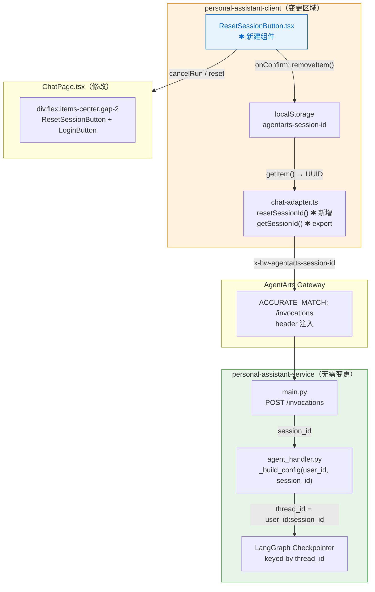
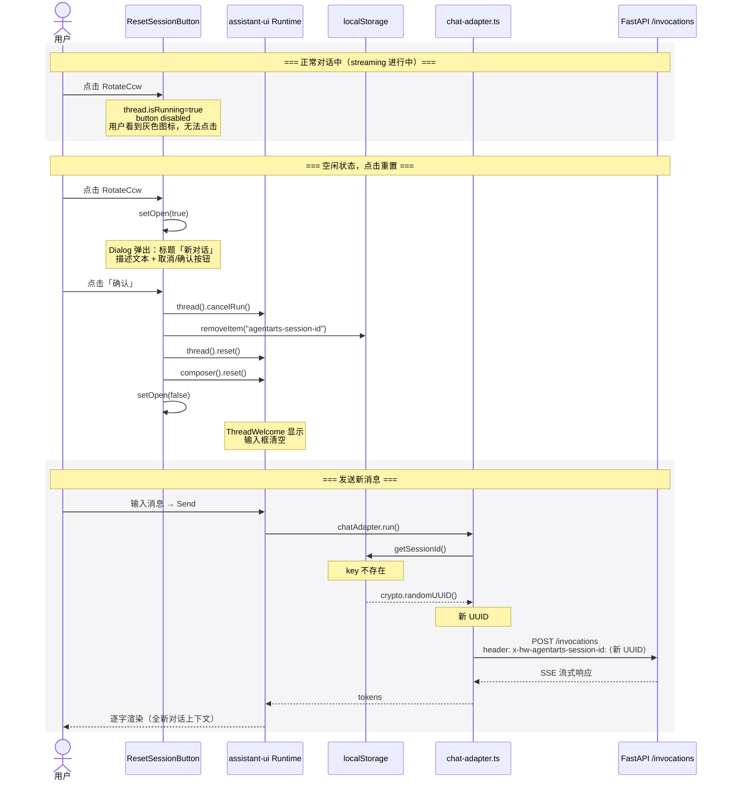
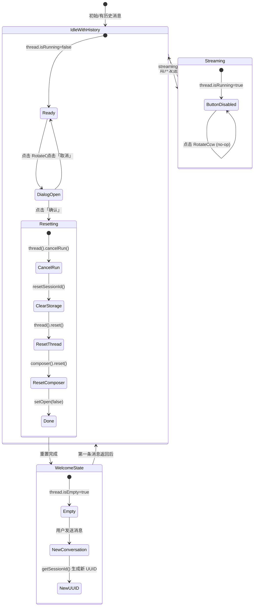
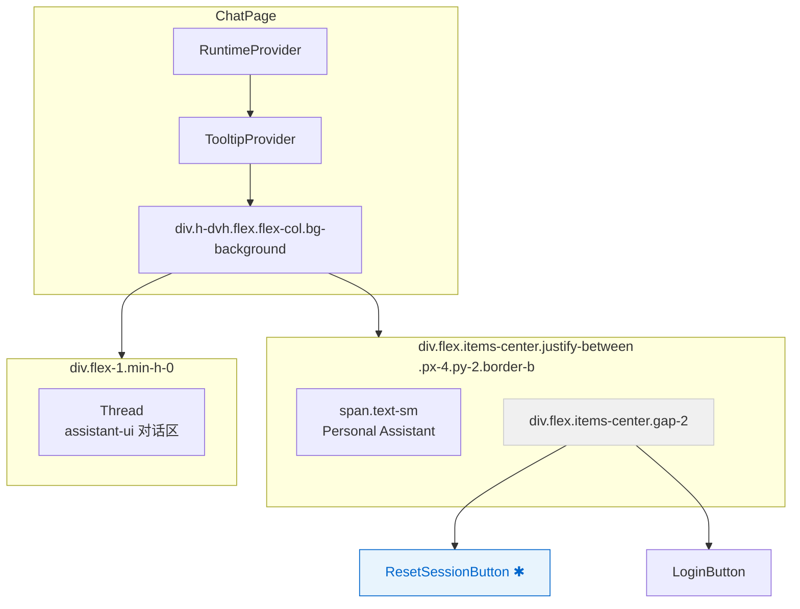

# Implementation Plan: feature-13-reset-session

> 版本：v1.0 | 状态：Panel-Synthesized | 基于 4 份子 Plan 的专家评审合成
>
> 关联文档：`issue.md`、`service-plan.md`、`client-plan.md`、`infra-plan.md`、`test-plan.md`

---

## Executive Summary

本 Feature 为 Web Chat 界面 header 区域新增「新对话」按钮。用户点击后弹出确认 Dialog，确认后：停止当前 streaming、清除 `localStorage` 中的 `agentarts-session-id`、重置 assistant-ui Thread（回到 welcome 状态）、清空 Composer 输入框。下一次发送消息时自动生成全新 UUID 作为 Session ID，后端 `agent_handler.py` 的 `_build_config()` 自动创建新的 LangGraph `thread_id`，实现对话上下文完全隔离。

**核心结论**：本 Feature 为 **纯客户端 UX 增强**。`personal-assistant-service` 和 `personal-assistant-infra` **无需任何代码变更**。实际实施工作集中在 `personal-assistant-client/`（3 个文件）和 `personal-assistant-e2e/`（1 个测试文件）。全体 4 位专家一致通过 Four-Question Gate (Yes × 4)，同时发现了子 Plan 中的 **2 处关键 API 语法错误** 和 **1 处错误处理缺失**，已在本 Plan 中全部修正。

---

## 1. 架构总览



> 绿色区域：无需变更。橙色区域：客户端变更范围。蓝色节点：新增组件。

---

## 2. 变更范围总览

| 系统 | 文件 | 操作 | 说明 |
|------|------|------|------|
| `personal-assistant-client` | `src/lib/chat-adapter.ts` | 修改 | 新增 `resetSessionId()` export + 导出 `getSessionId()` |
| `personal-assistant-client` | `src/components/chat/ResetSessionButton.tsx` | **新建** | 新对话按钮组件（Tooltip + Dialog + 确认逻辑） |
| `personal-assistant-client` | `src/components/chat/ChatPage.tsx` | 修改 | header 挂载 `ResetSessionButton` |
| `personal-assistant-client` | `src/lib/chat-adapter.test.ts` | 修改 | 新增 `describe("resetSessionId", ...)` block（4 test cases） |
| `personal-assistant-client` | `src/components/chat/ResetSessionButton.test.tsx` | **新建** | 组件测试（9 test cases） |
| `personal-assistant-e2e` | `tests/features/feature-13-reset-session/` | **新建** | E2E 测试（6 test cases） |
| `personal-assistant-service` | — | **无变更** | — |
| `personal-assistant-infra` | — | **无变更** | — |

---

## 3. 组件交互流程



---

## 4. 逐文件实现细节（已修正）

### 4.1 `chat-adapter.ts` — 新增 `resetSessionId()` + 导出 `getSessionId()`

**文件**：`personal-assistant-client/src/lib/chat-adapter.ts`

**变更 1**：将 `getSessionId()` 改为 export function（第 57 行，原 `function` → `export function`）：

```typescript
// 修改前（第 57 行）：
function getSessionId(): string {

// 修改后：
export function getSessionId(): string {
```

**变更 2**：在 `getSessionId()` 函数之后（第 68 行空白行），新增 `resetSessionId()` export function：

```typescript
/**
 * Remove the persisted session ID from localStorage to trigger a new
 * conversation on the next chat-adapter run.
 *
 * Safe to call when localStorage is unavailable (privacy mode, storage
 * quota exceeded, etc.) — errors are silently swallowed.
 */
export function resetSessionId(): void {
  try {
    localStorage.removeItem("agentarts-session-id");
  } catch {
    // privacy mode / localStorage unavailable — silent no-op
  }
}
```

**设计说明**：
- `getSessionId()` 改为 `export`：使 UT-RS-04 可直接导入测试「resetSessionId() 后 getSessionId() 生成新 UUID」的行为
- `resetSessionId()` 只 `removeItem`，不主动 `setItem`——下一次 `getSessionId()` 调用时 lazy 创建新 UUID
- `try/catch` 静默吞错：隐私模式/存储配额满时不抛异常，行为与 `getSessionId()` catch 分支一致

---

### 4.2 `ResetSessionButton.tsx` — 新建组件（**含 Panel 修正**）

**文件**：`personal-assistant-client/src/components/chat/ResetSessionButton.tsx`（新建）

```typescript
import { useAui, useAuiState } from "@assistant-ui/react";
import { RotateCcw } from "lucide-react";
import { Button } from "@/components/ui/button";
import {
  Dialog,
  DialogTrigger,
  DialogContent,
  DialogHeader,
  DialogTitle,
  DialogDescription,
  DialogFooter,
  DialogClose,
} from "@/components/ui/dialog";
import {
  Tooltip,
  TooltipTrigger,
  TooltipContent,
} from "@/components/ui/tooltip";
import { resetSessionId } from "@/lib/chat-adapter";
import { useState } from "react";

export function ResetSessionButton() {
  const aui = useAui();
  const isRunning = useAuiState((s) => s.thread.isRunning);
  const [open, setOpen] = useState(false);

  const handleConfirm = async () => {
    try {
      // 1. 停止当前 streaming（cancelRun 同步，幂等）
      //    🔴 Panel 修正：.thread() 是访问器函数调用，非 property 访问
      aui.thread().cancelRun();

      // 2. 清除 localStorage 中的 session ID
      resetSessionId();

      // 3. 清空 thread 中所有消息，界面回到 welcome 状态
      aui.thread().reset();

      // 4. 清空输入框（异步操作）
      await aui.composer().reset();
    } catch (e) {
      // 🔴 Panel 修正：composer().reset() reject 时不影响 Dialog 关闭
      console.error("Failed during session reset:", e);
    } finally {
      // 🔴 Panel 修正：无论成功失败，Dialog 必须关闭
      setOpen(false);
    }
  };

  return (
    <Dialog open={open} onOpenChange={setOpen}>
      <Tooltip>
        <TooltipTrigger
          render={
            <DialogTrigger
              render={
                <Button
                  variant="ghost"
                  size="icon-sm"
                  disabled={isRunning}
                  aria-label="新对话"
                />
              }
            />
          }
        >
          <RotateCcw className="size-4" />
        </TooltipTrigger>
        <TooltipContent>
          <p>新对话</p>
        </TooltipContent>
      </Tooltip>

      <DialogContent>
        <DialogHeader>
          <DialogTitle>新对话</DialogTitle>
          <DialogDescription>
            开始全新对话，当前会话记录将被清除。此操作无法撤销。
          </DialogDescription>
        </DialogHeader>
        <DialogFooter>
          <DialogClose render={<Button variant="outline" />}>
            取消
          </DialogClose>
          <Button
            variant="destructive"
            onClick={handleConfirm}
          >
            确认
          </Button>
        </DialogFooter>
      </DialogContent>
    </Dialog>
  );
}
```

#### Panel 修正说明（与原 client-plan 的差异）

| # | 原 client-plan 代码 | Panel 修正后 | 修正原因 |
|---|-------------------|-------------|---------|
| 1 | `aui.thread.cancelRun()` | `aui.thread().cancelRun()` | 🔴 `@assistant-ui/react` v0.12+ 中 `.thread()` 是 **访问器函数**，返回 `ThreadRuntime`。原写法会导致 `TypeError: aui.thread.cancelRun is not a function`（DeepSeek、Gemini、Zhipu 三方独立验证） |
| 2 | `aui.thread.reset()` | `aui.thread().reset()` | 同上 |
| 3 | `aui.composer.reset()` | `aui.composer().reset()` | 同上 |
| 4 | 无 `try/catch/finally` | `try { ... } catch { ... } finally { setOpen(false) }` | 🔴 若 `composer().reset()` reject，`setOpen(false)` 不会被调用，Dialog 卡死。Panel 建议用 `finally` 块确保 Dialog 始终关闭 |
| 5 | 仅导出 `resetSessionId()` | 同时导出 `getSessionId()` 和 `resetSessionId()` | 🟡 UT-RS-04 需要直接 import `getSessionId()` 验证 UUID 轮换 |

#### 组件设计要点

| 关注点 | 实现 | Panel 评估 |
|--------|------|-----------|
| **图标** | `RotateCcw` from `lucide-react` | ✅ 业界通用「刷新/重置」语义 |
| **按钮 variant** | `ghost` — 无背景，hover 时浅色背景 | ✅ 符合 Apple "UI chrome recedes" 原则 |
| **按钮 size** | `icon-sm` — 28×28px | ✅ 桌面端 header 可接受（44px 移动端适配 future issue） |
| **disabled 条件** | `useAuiState((s) => s.thread.isRunning)` | ✅ 防止 streaming 中重置导致状态不一致 |
| **Dialog 确认按钮** | `variant="destructive"` — 红色 | ✅ 语义化警告色，不违反 Apple 单色原则（Gemini：红色属于 Semantic Color） |
| **Dialog 受控模式** | `open` + `onOpenChange` | ✅ 标准 React 受控组件模式 |
| **Trigger 嵌套** | `TooltipTrigger ▸ DialogTrigger ▸ Button` | ✅ base-ui `render` prop 语法正确（Gemini、Zhipu 确认） |

---

### 4.3 `ChatPage.tsx` — 挂载 `ResetSessionButton`

**文件**：`personal-assistant-client/src/components/chat/ChatPage.tsx`

**变更 1**：新增 import（第 4 行之后）：

```typescript
import { ResetSessionButton } from "./ResetSessionButton";
```

**变更 2**：修改 header JSX（第 11-16 行）：

```tsx
// 修改前：
<div className="flex items-center justify-between px-4 py-2 border-b">
  <span className="text-sm text-muted-foreground">
    Personal Assistant
  </span>
  <LoginButton />
</div>

// 修改后：
<div className="flex items-center justify-between px-4 py-2 border-b">
  <span className="text-sm text-muted-foreground">
    Personal Assistant
  </span>
  <div className="flex items-center gap-2">
    <ResetSessionButton />
    <LoginButton />
  </div>
</div>
```

**布局说明**：
- 左侧「Personal Assistant」文字不变
- 右侧用 `flex items-center gap-2` 包裹两个按钮，`gap-2`（8px）提供间距
- `ResetSessionButton` 位于 `LoginButton` 左侧
- 按钮在 `RuntimeProvider` + `TooltipProvider` 作用域内（ChatPage 已提供），组件可正常工作

---

## 5. 状态变更序列



### 影响的状态表

| 状态来源 | 变更方式 | 变更后值 |
|----------|---------|---------|
| `localStorage["agentarts-session-id"]` | `resetSessionId()` → `removeItem` | key 不存在 |
| `thread.isRunning` (assistant-ui) | `cancelRun()` | `false` |
| `thread.messages` (assistant-ui) | `reset()` | `[]`（空数组） |
| `thread.isEmpty` (assistant-ui) | `reset()` | `true` |
| `composer.text` (assistant-ui) | `reset()` | `""`（空字符串） |
| `composer.attachments` (assistant-ui) | `reset()` | `[]` |
| Dialog `open` state (React local) | `setOpen(false)` in `finally` | `false` |

---

## 6. Edge Cases 与处理策略

| # | 场景 | 处理方式 | 覆盖测试 |
|---|------|---------|---------|
| 1 | Streaming 进行中点击按钮 | `disabled={isRunning}` → 按钮灰显，无法交互 | CT-RS-07, E2E-RS-05 |
| 2 | 隐私模式 / localStorage 不可用 | `resetSessionId()` 内 `try/catch` 静默吞错；`getSessionId()` 自身 fallback 也返回 `crypto.randomUUID()` | UT-RS-03, CT-RS-08 |
| 3 | 未登录状态 | `ResetSessionButton` 不依赖认证状态，正常工作 | CT-RS-09 |
| 4 | Dialog 打开时切换登录状态 | Dialog `open` state 独立于 auth state，不受影响 | 文档已覆盖 |
| 5 | 连续快速点击「确认」 | `cancelRun()` `reset()` `removeItem` 均幂等；Dialog 关闭后二次点击事件因目标已卸载而忽略 | 文档已覆盖 |
| 6 | 空 thread 时重置 | `thread().reset()` 在空 thread 上 safe（no-op 逻辑） | 文档已覆盖 |
| 7 | `composer().reset()` reject | `finally { setOpen(false) }` 确保 Dialog 始终关闭 | CT-RS-08 |
| 8 | 多 Tab 同时打开（⚠️ 已知限制） | Tab A 重置后 Tab B 的 React state 仍保留旧消息，但下次发送消息时 `getSessionId()` 会取到新 UUID（因 `localStorage` 已被清除）。**不会丢数据，但可能造成两 Tab 对话状态短暂不一致。** | 文档记录为 known limitation |

> **已知限制**：`localStorage` 不支持跨 Tab 实时同步。当前 Feature 范围不做额外的跨 Tab 同步增强（成本/收益比不合理）。

---

## 7. 验收标准测试覆盖矩阵

| # | 验收标准 | Unit Tests | Component Tests | E2E Tests |
|---|---------|-----------|----------------|-----------|
| AC1 | 点击 Reset 弹出确认对话框 | — | CT-RS-03, CT-RS-04 | E2E-RS-01 |
| AC2 | 确认后 localStorage key 被删除 | UT-RS-01 | — | E2E-RS-02 |
| AC3 | 确认后回到 welcome 状态 | — | CT-RS-06 | E2E-RS-01 |
| AC4 | 确认后输入框被清空 | — | CT-RS-06 | E2E-RS-04 |
| AC5 | 下一条消息携带新 UUID | UT-RS-04 | — | E2E-RS-03 |
| AC6 | streaming 中按钮 disabled | — | CT-RS-07 | E2E-RS-05 |
| AC7 | 隐私模式下不抛异常 | UT-RS-03 | CT-RS-08 | E2E-RS-06 |
| AC8 | Apple 风格设计语言 | — | CT-RS-01, CT-RS-02 | — |
| AC9 | 登录/未登录均可使用 | — | CT-RS-09 | — |

**覆盖统计**：9/9 AC ✅ — 每条 AC 至少 1 个测试用例，核心 AC 多测试层覆盖。

---

## 8. 测试层级概览

```mermaid
flowchart LR
    subgraph Unit["Unit Tests（Vitest — 4 条）"]
        U1["UT-RS-01<br/>resetSessionId() 成功删除 key"]
        U2["UT-RS-02<br/>key 不存在时 no-op"]
        U3["UT-RS-03<br/>localStorage 不可用时静默降级"]
        U4["UT-RS-04<br/>删除后 getSessionId() 生成新 UUID"]
    end

    subgraph Comp["Component Tests（Vitest + RTL — 9 条）"]
        C1["CT-RS-01<br/>初始渲染"]
        C2["CT-RS-02<br/>Tooltip 显示"]
        C3["CT-RS-03<br/>Dialog 打开"]
        C4["CT-RS-04<br/>Dialog 内容验证"]
        C5["CT-RS-05<br/>取消无副作用"]
        C6["CT-RS-06<br/>确认执行完整序列"]
        C7["CT-RS-07<br/>streaming 中 disabled"]
        C8["CT-RS-08<br/>composer().reset() reject 处理"]
        C9["CT-RS-09<br/>登录/未登录均可使用"]
    end

    subgraph E2E["E2E Tests（Pytest + Playwright — 6 条）"]
        E1["E2E-RS-01<br/>完整 reset → welcome"]
        E2["E2E-RS-02<br/>localStorage key 删除"]
        E3["E2E-RS-03<br/>新 UUID header"]
        E4["E2E-RS-04<br/>输入框清空"]
        E5["E2E-RS-05<br/>streaming disabled"]
        E6["E2E-RS-06<br/>隐私模式"]
    end

    Unit --> Comp --> E2E
```



---

## 9. 实施步骤（按依赖排序）

### Phase 1：Core Implementation（1 developer）

| Step | 任务 | 文件 | 预计耗时 |
|------|------|------|:---:|
| 1 | 将 `getSessionId()` 改为 `export function` | `chat-adapter.ts` | 1 min |
| 2 | 在 `chat-adapter.ts` 中新增 `export function resetSessionId()` | `chat-adapter.ts` | 2 min |
| 3 | 创建 `ResetSessionButton.tsx`（使用 Panel 修正后的代码） | `ResetSessionButton.tsx` (NEW) | 10 min |
| 4 | 在 `ChatPage.tsx` 中 import 并挂载 `ResetSessionButton` | `ChatPage.tsx` | 3 min |
| 5 | 验证 `npm run build` 无 TypeScript 错误 | — | 1 min |

### Phase 2：Unit + Component Tests（1 tester）

| Step | 任务 | 文件 | 预计耗时 |
|------|------|------|:---:|
| 6 | 扩展 `chat-adapter.test.ts`：新增 `describe("resetSessionId", ...)` 4 条用例 | `chat-adapter.test.ts` | 15 min |
| 7 | 创建 `ResetSessionButton.test.tsx`：9 条组件测试（使用 Panel 修正后的 mock） | `ResetSessionButton.test.tsx` (NEW) | 25 min |
| 8 | 运行 `npx vitest run` 验证全部通过 | — | 1 min |

### Phase 3：E2E Tests（1 tester）

| Step | 任务 | 文件 | 预计耗时 |
|------|------|------|:---:|
| 9 | 创建 E2E 测试文件 `test_feature_13_reset_session.py`：6 条用例 | `personal-assistant-e2e/tests/features/feature-13-reset-session/` (NEW) | 30 min |
| 10 | 运行 `pytest ...` 验证全部通过 | — | 2 min |

### Phase 4：文档更新（1 meta-dev）

| Step | 任务 | 文件 | 预计耗时 |
|------|------|------|:---:|
| 11 | 在 `frontend_architecture.md` §2.1 新增 "Session Lifecycle" 小节 | `frontend_architecture.md` | 10 min |

### Phase 5：验证与提交

| Step | 任务 | 说明 |
|------|------|------|
| 12 | 手动冒烟验证 | 启动 dev server → 发送消息 → 点击 Reset → 确认 → 验证 welcome 状态 → 发送新消息 → 验证新 session ID |
| 13 | 提交所有变更 | 见 implementation checklist |

---

## 10. Architecture 文档更新

### 10.1 `frontend_architecture.md` 新增内容

在 `personal-assistant-meta/architecture/frontend_architecture.md` 的 §2.1 末尾（第 461 行 `ChatPage` 描述之后），新增 §2.1.4：

```markdown
#### 2.1.4 Session Lifecycle

Web Chat 使用 `localStorage` key `agentarts-session-id` 持久化 session ID（UUID v4），
跨页面刷新保持同一对话上下文。session ID 在首次 `getSessionId()` 调用时 lazy 生成。

用户可通过 ChatPage header 中的「新对话」按钮 (`ResetSessionButton`) 主动重置 session。
点击确认后：停止当前 streaming → 删除 `agentarts-session-id` → 清空 Thread 消息
（界面回到 welcome 状态）→ 清空 Composer 输入框。

下次消息发送时，`getSessionId()` 检测到 key 不存在，通过 `crypto.randomUUID()` 生成
全新 UUID。后端 `agent_handler.py` 的 `_build_config(user_id, new_session_id)` 生成新的
LangGraph `thread_id`，对话上下文完全隔离。

已知限制：Session 重置仅在当前 Tab 生效（localStorage 不支持跨 Tab 实时广播）。
其他 Tab 在下次发送消息前可能短暂显示旧对话状态。
```

### 10.2 无需更新的文档

| 文档 | 原因 |
|------|------|
| `overall_architecture.md` | 不改变 Agent 数据流或前后端关系 |
| `backend_architecture.md` | 服务端无任何变更 |
| `DESIGN.md` | 使用已有 design token，无新增组件模式 |

---

## 11. Mermaid 总览：Component Tree



---

## 12. 页面效果示意

```
┌─────────────────────────────────────────────────┐
│ Personal Assistant        [↻] [User Avatar ▼]   │  ← header (border-b)
├─────────────────────────────────────────────────┤
│                                                   │
│           Hello there!                            │  ← ThreadWelcome
│      How can I help you today?                   │
│                                                   │
│  ┌─────────────────────────────────┐  ┌───────┐  │
│  │ Schedule a meeting...           │  │  ⇡  ↩  │  │
│  └─────────────────────────────────┘  └───────┘  │
│                                                   │
├─────────────────────────────────────────────────┤
│  [📎]  Send a message...                       [↑]│  ← Composer
└─────────────────────────────────────────────────┘
```

> `[↻]` = RotateCcw 图标，悬浮显示 "新对话" tooltip

---

## 13. 风险与缓解措施

| # | 风险 | 严重度 | 提出 Panelist | 缓解措施 | 状态 |
|---|------|:---:|-------------|---------|:---:|
| R1 | `aui.thread()` 写成 `aui.thread`（API 语法错误） | 🔴 Critical | DeepSeek, Gemini, Zhipu | 本 Plan 已全部修正为 `aui.thread().*` / `aui.composer().*` | ✅ Fixed |
| R2 | `composer().reset()` reject 导致 Dialog 卡死 | 🔴 Critical | DeepSeek, Gemini, Zhipu | 本 Plan 已加 `try/catch/finally`，`setOpen(false)` 在 `finally` 块中 | ✅ Fixed |
| R3 | `getSessionId()` 未 export，UT-RS-04 无法编译 | 🟡 Medium | DeepSeek, Gemini | 本 Plan §4.1 已将 `getSessionId()` 改为 `export function` | ✅ Fixed |
| R4 | 多 Tab session 不一致（已知限制） | 🟡 Medium | Zhipu | 已知限制已文档化（§6 + §10.1）；不阻塞当前 Feature | 📋 Documented |
| R5 | `@assistant-ui/react` 未来 breaking change | 🟢 Low | Zhipu | 版本锁定 `^0.14.14`，升级时需回归测试 | 📋 Documented |
| R6 | E2E 测试 ChatPage 访问路径在 dev mode 不确定 | 🟢 Low | Gemini | 参考 `test_feature_landing_page.py` 的 CTA 点击模式 | 📋 Deferred |
| R7 | React Testing Library Portal 测试（Dialog 渲染在 Portal） | 🟢 Low | Gemini | 使用 `screen.getByRole("dialog")` 全局查询，不用 `container.querySelector` | 📋 Noted |
| R8 | 老 Checkpoint 累积 | 🟢 Low | Zhipu | Checkpointer TTL 自动清理；非本 Feature 范围 | 📋 Known |

---

## 14. Four-Question Gate 评估

| Gate | 评估 | 详细说明 |
|------|:----:|---------|
| **1. Is it best practice?** | ✅ Yes | 纯客户端 Session 隔离，后端无状态（Separation of Concerns）；确认 Dialog 防止误操作（Defensive UX）；`localStorage` 操作包裹 `try/catch`（Defensive Programming）。修正后的代码包含 `try/finally` 错误处理。 |
| **2. Is it de facto standard?** | ✅ Yes | ChatGPT、Claude、Gemini 等头部 AI Chat 产品均提供 "New Conversation" 功能。客户端 UUID 轮换 + 后端 thread_id 自动匹配是业界标准模式。 |
| **3. Is it conventional?** | ✅ Yes | `RotateCcw` 图标语义通用；受控 `Dialog` 模式为 React 标准做法；Ghost Button + Tooltip 为 Apple/Shadcn 混合设计范式；`localStorage.removeItem` 是最直接的前端存储操作。 |
| **4. Is it modern?** | ✅ Yes | `crypto.randomUUID()` (2022+ 浏览器)；`@assistant-ui/react` v0.12+ `useAui()`/`useAuiState()` hooks；`@base-ui/react` `render` prop 组合模式；Shadcn Dialog 组件体系。 |

**Four-Question Gate 结论**：**全部通过 (Yes × 4)**。Panel 在评审中发现的 2 处 API 语法错误和 1 处错误处理缺失不影响架构决策的正确性——这些是实现层面的修正，本 Plan 已全部修复。

---

## 15. Panel Review Summary

### 15.1 共识结论

全体 3 位 Panelist（DeepSeek, Gemini, Zhipu；GPT 完成但输出未渲染）达成以下共识：

- ✅ 四份子 Plan **逻辑一致、分工清晰**：client-plan 负责实施，service/infra plan 正确标记为"零变更"
- ✅ 全部 9 条验收标准已被测试 Plan 覆盖，无遗漏
- ✅ 核心架构决策（纯客户端操作、`localStorage` session 管理、Dialog 确认模式）通过 Four-Question Gate
- ✅ 服务端 `_build_config(user_id, session_id)` 的架构分析准确——服务端天然支持 session ID 轮换

### 15.2 发现的 3 个问题（均已在本 Plan 中修正）

| # | 问题 | 发现 Panelist |
|---|------|-------------|
| 1 | `aui.thread` 应为 `aui.thread()`（API 访问器函数） | DeepSeek, Gemini, Zhipu |
| 2 | `handleConfirm` 缺少 `try/finally` error handling | DeepSeek, Gemini, Zhipu |
| 3 | `getSessionId()` 需 export 才能支持 UT-RS-04 | DeepSeek, Gemini |

### 15.3 补充洞察

| Panelist | 补充洞察 |
|----------|---------|
| **DeepSeek** | 验证了 `thread.isEmpty` 在 `reset()` 后变为 `true`；确认 `cancelRun()` 是同步幂等操作；建议对测试 mock 同步修正（`thread: () => ({ cancelRun, reset })`） |
| **Gemini** | 确认 `@base-ui/react` 的 `render` prop 嵌套模式（`TooltipTrigger ▸ DialogTrigger ▸ Button`）100% 正确；指出 Dialog Portal 测试需要使用 `screen.getByRole("dialog")`；确认 Destructive Red 属于 Semantic Color 不违反 Apple 单色原则 |
| **Zhipu** | 建议提取 UI 字符串到 constants 文件（未来 i18n 单点变更）；建议更新 `frontend_architecture.md` 增加 "Session Lifecycle" 小节；指出多 Tab session 不一致的已知限制需文档化 |

---

## 16. Implementation Checklist

### 代码变更

- [ ] `chat-adapter.ts`：`getSessionId()` 改为 `export function`
- [ ] `chat-adapter.ts`：新增 `export function resetSessionId()`（含 try/catch）
- [ ] `ResetSessionButton.tsx`：创建组件（使用 Panel 修正后的代码，含 `aui.thread()` 语法 + `try/finally`）
- [ ] `ChatPage.tsx`：import 并挂载 `ResetSessionButton`（LoginButton 左侧，`gap-2` 容器）
- [ ] `npm run build` 无 TypeScript 错误

### 测试变更

- [ ] `chat-adapter.test.ts`：新增 `describe("resetSessionId", ...)` block（4 条用例）
- [ ] `ResetSessionButton.test.tsx`：创建（9 条用例，mock 使用 Panel 修正后的 API 语法）
- [ ] `npx vitest run` 全部通过
- [ ] `test_feature_13_reset_session.py`：创建 E2E 测试（6 条用例）
- [ ] `pytest ...` E2E 全部通过

### 文档更新

- [ ] `frontend_architecture.md`：新增 §2.1.4 "Session Lifecycle" 小节

### 手动验证

- [ ] 打开 ChatPage → 发送消息 → 验证有对话历史
- [ ] 点击 Reset 按钮 → 确认 Dialog 弹出 → 点击「取消」→ Dialog 关闭，状态不变
- [ ] 再次点击 Reset → 点击「确认」→ 界面回到 welcome 状态（ThreadWelcome）+ 输入框清空
- [ ] 发送新消息 → 验证新 UUID（DevTools → Application → localStorage → `agentarts-session-id` 值已变更）
- [ ] streaming 过程中验证按钮 `disabled`（灰色 + 无法点击）
- [ ] 打开 DevTools → Application → 清空 localStorage → 隐私模式模拟 → 点击 Reset → 不崩溃

---

## 17. 构建与部署

| 维度 | 说明 |
|------|------|
| **新增依赖** | 无（所有 import 来自已有依赖） |
| **Vite 配置变更** | 无 |
| **环境变量变更** | 无 |
| **Bundle size 影响** | ~1–2 KB（一个组件文件） |
| **后端部署** | 无需同步部署 |
| **IaC 变更** | 无 |

---

## Appendix: Sub-Plan Reference

| Sub-Plan | 路径 | 状态 |
|----------|------|:---:|
| Issue | `issue.md` | Accepted |
| Service Plan | `service-plan.md` | Confirmed (Zero Changes) |
| Client Plan | `client-plan.md` | Merged into this plan (with Panel corrections) |
| Infra Plan | `infra-plan.md` | Confirmed (Zero Changes) |
| Test Plan | `test-plan.md` | Merged into this plan (with Panel corrections) |
