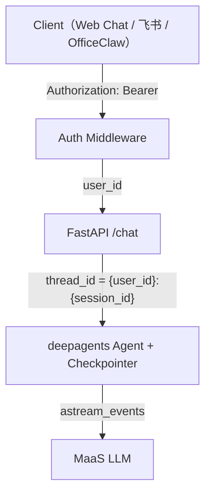

# Session 管理方案分析

> 日期：2026-06-11 | 状态：待决策

---

## 1. 当前状况

### 1.1 两层 Session 架构

项目当前依赖 AgentArts 平台，Session 分两层：

```
AgentArts Gateway（平台层）
  │
  │  X-AgentArts-User-Id      ← 身份
  │  X-AgentArts-Session-Id   ← 会话 ID
  │
  ▼
FastAPI /invocations
  │
  │  session_id 从 header 取出
  │  但 handle() / handle_stream() 完全没有使用它
  │
  ▼
deepagents Agent
  └── agent.ainvoke({"messages": [单条用户消息]})
      每次调用都是 stateless，无多轮上下文
```

### 1.2 关键事实

- `session_id` 已从 `X-AgentArts-Session-Id` header 获取（`app/main.py:97`）
- `AgentHandler.handle()` 接受 `session_id` 参数但**完全不用**（`app/agent_handler.py:57-63`）
- `AgentHandler.handle_stream()` 甚至**不接受** `session_id` 参数
- `deepagents` 底层是 LangGraph `CompiledGraph`，天然支持 Checkpointer
- `ainvoke` / `astream_events` 调用时没有传 `config`，不利用 Checkpoint
- 跨 Session Memory（Feature 2）尚未实现，AgentArts Memory SDK 集成待落地

---

## 2. 脱离 AgentArts 后的三种通用方案

### 2.1 方案 A：客户端驱动（Stateless）

```python
# 客户端：把完整对话历史带在请求里
POST /chat
{
    "session_id": "abc123",
    "messages": [
        {"role": "user", "content": "我叫小明"},
        {"role": "assistant", "content": "你好小明！"},
        {"role": "user", "content": "我叫什么？"}
    ]
}
```

| 优点 | 缺点 |
|------|------|
| 服务端完全无状态，水平扩展 trivial | 长对话请求体膨胀 |
| 零基础设施依赖 | 每次重传历史，token 浪费 |
| 最简单 | 不支持跨 Session 记忆 |

**适合**：原型、短对话、不需要记忆的场景。

---

### 2.2 方案 B：服务端 Session Store（Stateful）

```python
@app.post("/chat")
async def chat(request: ChatRequest):
    # 1. 读历史
    history = await store.get_messages(request.session_id)
    
    # 2. 拼上下文
    messages = history + [{"role": "user", "content": request.message}]
    
    # 3. 调 LLM
    response = await llm.ainvoke(messages)
    
    # 4. 存回去
    await store.append_messages(request.session_id, [
        {"role": "user", "content": request.message},
        {"role": "assistant", "content": response}
    ])
```

存储选型：

| 存储 | 场景 | 特点 |
|------|------|------|
| Redis | 高并发、临时会话 | TTL 自动过期，内存成本高 |
| PostgreSQL | 需要持久化、审计 | 结构化查询，运维成本高 |
| SQLite | 本地/嵌入式 | 零运维，不适合多副本 |

**这就是 Feature 2 的规划**——只是把自建存储换成 AgentArts Memory SDK。

**适合**：需要持久化、中等并发、自建基础设施。

---

### 2.3 方案 C：LangGraph Checkpoint（框架原生）

```python
from langgraph.checkpoint.memory import MemorySaver  # 或 SqliteSaver / PostgresSaver

# 创建 agent 时注入 checkpointer
agent = create_deep_agent(
    model=model,
    system_prompt=SYSTEM_PROMPT,
    tools=[],
    checkpointer=MemorySaver(),  # ← 加这一行
)

# 每次调用传 thread_id
result = await agent.ainvoke(
    {"messages": [{"role": "user", "content": message}]},
    config={"configurable": {"thread_id": session_id}}  # ← 加这一行
)
# LangGraph 自动存/取 AgentState，多轮上下文零代码
```

`thread_id` 就是 `session_id`——**不需要两套 ID**。

Checkpointer 后端：

| 后端 | 场景 |
|------|------|
| `MemorySaver` | 开发/调试，进程重启即丢 |
| `SqliteSaver` | 本地持久化，单进程 |
| `PostgresSaver` | 生产环境，多副本共享 |
| 自定义 | Redis、Mongo 等任意存储 |

**优点**：
- 零代码管理对话状态（框架自动存/取）
- 存的不仅是 messages，还有 graph node 位置（中断恢复）
- deepagents 已在用，改动量极小

**适合**：基于 LangGraph/DeepAgents 的 Agent 应用。

---

## 3. Checkpoint 能否替代 Gateway Session？

### 3.1 能替代的

| 能力 | 说明 |
|------|------|
| Session ID 机制 | `thread_id` = `session_id`，不需要两套 |
| 对话状态存储 | 不需要自建 Redis/PG messages 表 |

### 3.2 替代不了的

| 能力 | 说明 | 解决方案 |
|------|------|---------|
| **身份 → Session 归属校验** | Checkpoint 不验证谁拥有 thread_id。A 猜到 B 的 thread_id 就能读 B 的对话。 | 在 API 中间件做 auth，`thread_id` 做成 user-scoped 格式（如 `{user_id}:{session_id}`），从源头杜绝跨用户泄露 |
| **Session 生命周期** | 过期、超时清理、显式结束——Checkpoint 只管存不管清 | 需自建管理逻辑或在 checkpointer 上层包装 |
| **多渠道路由** | 飞书 / Web Chat / OfficeClaw 到 Session 的映射 | 需自建渠道映射表 |
| **审计/用量/限流** | 平台级能力 | 需自建或依赖 API Gateway |

### 3.3 推荐模式（脱离 AgentArts 后）



- 身份：auth middleware 管
- 状态：LangGraph Checkpoint 管
- ID 共享一根：`thread_id` = user-scoped session identifier
- 渠道映射：自建轻量映射表

---

## 4. 方案对比矩阵

| 维度 | A: 客户端驱动 | B: 服务端 Store | C: LangGraph Checkpoint |
|------|:---:|:---:|:---:|
| 代码量 | 最少 | 中 | 最小（框架已就绪） |
| 基础设施 | 无 | Redis/PG | MemorySaver→SqliteSaver→PostgresSaver 渐进 |
| 多轮上下文 | ✅ | ✅ | ✅ |
| 跨 Session 记忆 | ❌ | 需叠加 Memory 层 | 需叠加 Memory 层 |
| 中断恢复 | ❌ | ❌ | ✅（graph node 位置） |
| 并发扩展 | ✅ Trivial | 中等（存储瓶颈） | 取决于 checkpointer 后端 |
| 与现有 deepagents 集成 | — | — | 一行 config 改动 |

---

## 5. 建议路径

### 短期（立即可做）

给 `ainvoke` / `astream_events` 传 `config={"configurable": {"thread_id": session_id}}`，注入 `MemorySaver` 或 `SqliteSaver`。**一行代码改动**解决当前完全无状态的问题。

### 中期（Feature 2）

叠加 AgentArts Memory 层（或自建 Memory）。Checkpoint 管短期对话上下文，Memory 管跨 Session 语义记忆——两者互补不互斥：

```
Checkpoint: "这一轮对话进行到哪了？上次 tool call 返回了什么？"
Memory:     "用户偏好简洁回答（从 3 周前的对话中学到的）"
```

### 长期（脱离 AgentArts 时）

Checkpoint 接管 Session State，自建 auth middleware 接管身份，渠道映射接管路由——三层解耦，每层可独立替换。

---

## 参考

- [ADR-009: deepagents 替代裸 LangGraph](./ADR/ADR-009-deepagents.md)
- [Feature 2: Memory 集成](../issues/features/feature-2-memory.md)（如已创建）
- [LangGraph Persistence Docs](https://langchain-ai.github.io/langgraph/how-tos/persistence/)
- [当前 `agent_handler.py`](../../personal-assistant-service/app/agent_handler.py)
