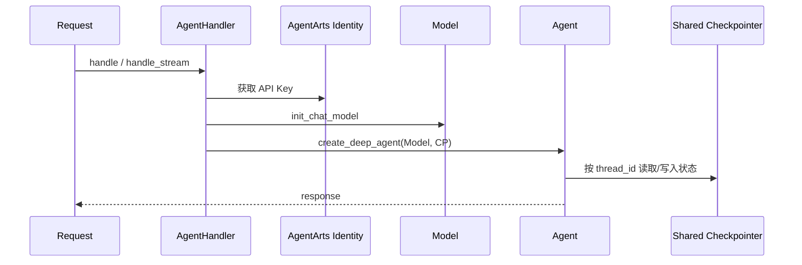
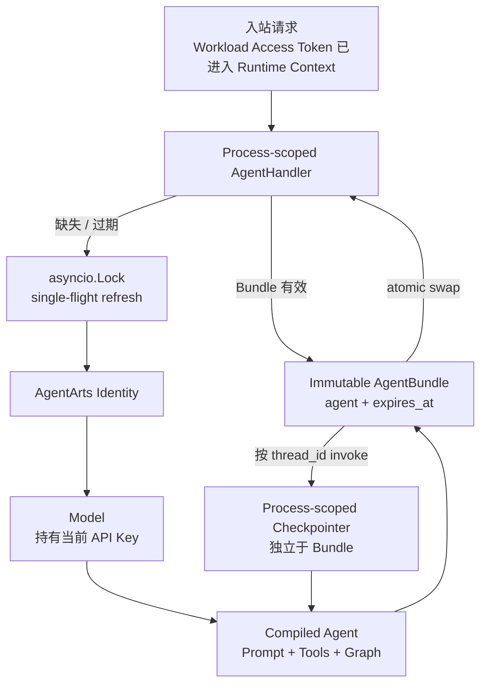

# Refactor 8: 复用并安全轮转 LLM Agent Bundle

当前 Service 在每个入站请求中重新获取 LLM API Key、创建 Model，并通过
`create_deep_agent()` 重新组装 Agent。聊天上下文之所以仍能恢复，是因为所有
Agent 共用同一个 Checkpointer；但 Model、Agent 和 credential 的生命周期没有被
正确建模，造成重复 Identity API 调用和重复 Agent 构建。

本 issue 引入进程级、可轮转的 **Agent Bundle**。Bundle 将使用同一 credential 的
Model 和 compiled Agent 作为一个不可变单元管理；Checkpointer 独立于 Bundle，
因此 Bundle 刷新不会丢失 Session 状态。

> 关联 ADR：
> [ADR-016：Secretless Credential Injection via AgentArts Identity](../../../../architecture/ADR/ADR-016-secretless-credential-injection.md)
>
> 历史实现参考：commit `57312f64875d088dea84f4123bf79df6058ab655`。
> 该实现将 Key 写入模块字典和 `os.environ`，随后由 commit
> `64107194ea7868fd86b3d1ef7ebbd20c455c76dc` 回退。本 issue 不恢复该方案。

## 当前问题



`AgentHandler` 本身是进程级 singleton，`tools` 和 `checkpointer` 也只初始化一次；
但 `handle()`、`handle_stream()` 和 Playground 每次请求都会调用
`create_agent()`。AgentArts SDK 0.1.3 的 `@require_api_key` 会在每次调用时创建
`IdentityClient` 并请求 Identity Service，没有 API Key cache。

当前实现不是 Session Memory 丢失 bug，因为新 Agent 继续使用同一 Checkpointer
和同一 `thread_id`。它是生命周期和资源复用缺陷：

1. 每个请求重复访问 Identity Service
2. 每个请求重复创建 Model 和 compiled Agent
3. API Key rotation、失效和并发 cold start 没有显式语义
4. `self.model` / `self.agent` 被重复覆盖，但请求实际使用局部变量，生命周期表达混乱
5. 现有测试只验证相同 `thread_id` 被传入，没有验证跨 Agent 实例的真实状态恢复

## 目标设计



### Agent Bundle

Bundle 是应用内部定义的不可变生命周期单元：

```python
@dataclass(frozen=True, slots=True)
class AgentBundle:
    agent: CompiledStateGraph
    expires_at: float
```

Model 被 Agent 引用，不再作为独立可变状态保存。Bundle 不直接公开 API Key，也不
将 Key 写入 `os.environ`。

### 生命周期

1. FastAPI lifespan 创建一次 `AgentHandler`
2. Handler 创建并长期持有 `tools`、`checkpointer` 和 refresh lock
3. 首个业务请求在 Workload Access Token 已写入 `AgentArtsRuntimeContext` 后，
   lazy 创建 Bundle
4. TTL 有效期内，普通请求、SSE 和 Playground 共用同一 compiled Agent
5. TTL 到期后，第一个请求在 lock 内获取最新 Key 并构建新 Bundle；等待者复用结果
6. 新 Bundle 构建成功后原子替换旧 Bundle；构建失败不得污染当前状态
7. 已经取得旧 Bundle 的 in-flight 请求继续执行，不被中途切换
8. Checkpointer 不随 Bundle 重建，因此 Session 状态连续

TTL 使用 `time.monotonic()`，默认 300 秒，通过
`LLM_AGENT_BUNDLE_TTL_SECONDS` 配置。每个 worker 维护独立 Bundle，不引入
Redis 或分布式锁。

### Rotation 与异常

- Bundle 到期后，新请求必须刷新，不继续无限期使用旧 credential
- Identity fetch、空 Key 或 Agent 构建失败时，不发布半成品 Bundle
- LLM 明确返回 authentication failure 时，可使当前 Bundle 失效，使下一请求刷新
- 不自动重放整个 Agent invocation；此前可能已经执行有副作用的 Tool，整轮重试可能
  造成重复操作
- 第一阶段不新增公开 cache-invalidation HTTP API

## 范围

### Service

- [ ] `AgentHandler` 增加不可变 `AgentBundle`
- [ ] lazy 创建并在 TTL 内复用 compiled Agent
- [ ] 使用 `asyncio.Lock` 实现 per-process single-flight refresh
- [ ] Bundle 原子替换，Checkpointer 生命周期保持独立
- [ ] `llm_config.py` 保持单一职责：解析配置、获取 Key、创建 Model
- [ ] Settings 增加 positive `LLM_AGENT_BUNDLE_TTL_SECONDS`
- [ ] 普通请求、SSE 和 Playground 使用同一个异步 Bundle 入口
- [ ] 不将 API Key 写入 `os.environ`、Settings、日志或 metric label

### Tests

- [ ] 首次请求获取 credential 并创建一个 Bundle
- [ ] TTL 内连续请求复用同一个 Agent，不再次调用 Identity
- [ ] TTL 到期后重建 Bundle
- [ ] 并发 cold start / refresh 只执行一次构建
- [ ] refresh 失败不发布错误 Bundle，后续请求可再次尝试
- [ ] Bundle 刷新前后复用同一个 Checkpointer
- [ ] 两个不同 Agent 实例通过共享 Checkpointer 和相同 `thread_id` 恢复真实多轮状态
- [ ] 不同 `user_id + session_id` 状态隔离
- [ ] 普通请求、SSE 和 Playground 回归通过

### Documentation

- [ ] ADR-016 删除 `os.environ` cache 和未验证的 SDK cache 描述
- [ ] backend/overall architecture 与实际 Bundle 生命周期一致
- [ ] 修正文档中的“IPC”表述为 Identity Service API call

## 不涉及

- OAuth2 Access Token 或 STS Token cache
- 修改 AgentArts SDK
- 跨 worker 共享 Agent/Model
- 本 issue 内引入新的生产 Checkpointer backend
- 自动重放失败的 Agent invocation

生产跨 container / 多 worker Session persistence 仍应使用 PostgreSQL 等持久化
Checkpointer；默认 `InMemorySaver` 只保证单进程生命周期。

## 影响范围

GitNexus 对核心 symbol 的评估为 HIGH：

| Symbol | Direct callers | 影响流程 |
|--------|---------------:|----------|
| `get_model()` | 5 | 普通 `/invocations`、SSE、Playground |
| `AgentHandler.create_agent()` | 5 | `handle()`、`handle_stream()`、Playground |

预计修改：

| 文件 | 改动 |
|------|------|
| `personal-assistant-service/app/agent_handler.py` | Bundle 生命周期、single-flight、Agent 复用 |
| `personal-assistant-service/app/llm_config.py` | 保持无 cache 的 Model factory；必要的类型/docstring 调整 |
| `personal-assistant-service/app/settings.py` | Bundle TTL Setting |
| `personal-assistant-service/.env.example` | TTL 配置说明 |
| `personal-assistant-service/app/playground.py` | 使用共享异步 Agent 获取入口 |
| `personal-assistant-service/tests/` | 生命周期、并发、状态恢复测试 |
| `personal-assistant-e2e/tests/` | 生命周期相关静态/回归验证 |
| `personal-assistant-meta/architecture/` | ADR 和 current architecture 同步 |

## 验收条件

- [ ] TTL 内任意数量的请求每个 worker 只创建一次 Model/Agent Bundle
- [ ] 并发 cold start 不产生重复 Identity fetch
- [ ] API Key 只存在于 AgentArts Identity、SDK 返回值和 Model object 必要范围
- [ ] Bundle refresh 不替换或清空 Checkpointer
- [ ] Bundle refresh 失败不污染已发布状态
- [ ] 不自动重放可能包含 Tool side effects 的 invocation
- [ ] 真实多轮状态恢复和 Session 隔离测试通过
- [ ] Unit、Integration、相关 E2E、Ruff 全部通过
- [ ] ADR-016 与 backend/overall architecture 和实现一致
- [ ] `gitnexus detect-changes` 仅报告预期流程

## 依赖

- ADR-009：DeepAgents / LangGraph Agent 架构
- ADR-016：Secretless Credential Injection
- Refactor 10：typed Settings + internal Provider catalog

## 参考

- [ADR-009：DeepAgents](../../../../architecture/ADR/ADR-009-deepagents.md)
- [ADR-016：Secretless Credential Injection](../../../../architecture/ADR/ADR-016-secretless-credential-injection.md)
- [ADR-011：多 LLM Provider](../../../../architecture/ADR/ADR-011-multi-llm-provider.md)
