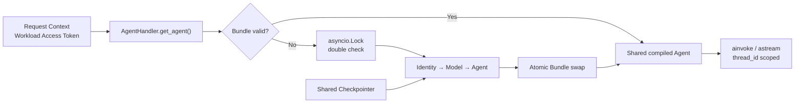

# Refactor 8 Implementation Plan

## 结论

采用 **process-scoped renewable Agent Bundle**，不采用 API Key dict cache、
`os.environ` write-back 或永久 Agent singleton。



Agent graph 是无 Session 身份的可复用执行结构；每个调用通过 `configurable.thread_id`
访问 Checkpointer 中对应的状态。Checkpointer 不属于 Bundle，不参与 credential
rotation。

## GitNexus Risk

| Symbol | Risk | Blast radius |
|--------|------|--------------|
| `get_model()` | HIGH | 21 symbols；3 个 execution flows |
| `AgentHandler.create_agent()` | HIGH | 18 symbols；普通请求、SSE、Playground |

在修改其余 symbol 前逐个执行 upstream impact。实现完成后执行
`gitnexus detect-changes`。

## Service Design

### Settings

新增：

| Variable | Type | Default | Constraint |
|----------|------|---------|------------|
| `LLM_AGENT_BUNDLE_TTL_SECONDS` | float | `300` | `gt=0` |

TTL 使用 monotonic clock，不使用 wall clock。Setting 表示 refresh 上界，不是
credential 自身的 cryptographic expiration。

### Agent Bundle

在 `agent_handler.py` 定义：

```python
@dataclass(frozen=True, slots=True)
class AgentBundle:
    agent: Any
    expires_at: float
```

首轮实现不把 model 和 API Key 暴露为 Bundle 字段。Agent 已持有 Model；减少可访问的
Secret reference 和重复状态。

`AgentHandler` process-scoped fields：

- `settings`
- `checkpointer`
- `tools`
- `_bundle: AgentBundle | None`
- `_bundle_lock: asyncio.Lock`

### Build and refresh

新增两个职责明确的入口：

```python
def _build_agent(self):
    model = get_model(settings=self.settings)
    return create_deep_agent(
        model=model,
        system_prompt=SYSTEM_PROMPT,
        tools=self.tools,
        checkpointer=self.checkpointer,
    )

async def get_agent(self):
    # fast path → lock → double check → build → atomic publish
```

`get_agent()` 的行为：

1. 读取 `time.monotonic()`
2. Bundle 存在且 `now < expires_at` 时直接返回 Agent
3. 否则进入 `_bundle_lock`
4. 在 lock 内重新检查，避免等待者重复 refresh
5. 创建完整 Agent 后才构造并赋值新 Bundle
6. 创建失败时保留旧 `_bundle` reference，但过期 Bundle 不对新请求返回
7. TTL 从成功构建完成时开始计算

AgentArts SDK 0.1.3 的 credential API 是同步网络调用。若直接在 async request path
执行会阻塞 event loop，因此通过 `asyncio.to_thread(self._build_agent)` 执行。
Python 3.12 `to_thread` 会复制当前 `contextvars.Context`，保证请求中的 Workload
Access Token 对 SDK 可见；增加测试验证这个边界。

### Invocation

- `handle()`：`agent = await self.get_agent()`
- `handle_stream()`：在进入 streaming loop 前 `agent = await self.get_agent()`
- Playground：`agent = await handler.get_agent()`
- 删除公开 `create_agent()`；保留 `_build_agent()` 作为同步内部 factory
- `self.model` 和 `self.agent` 删除，避免把过时对象表达为 authoritative state

### Invalidation

本次提供内部异步方法：

```python
async def invalidate_agent_bundle(self) -> None:
    async with self._bundle_lock:
        self._bundle = None
```

第一阶段用于测试和未来 authentication-error adapter，不新增 HTTP endpoint。当前
LLM exception 类型没有稳定的 provider-neutral authentication contract，因此不在
本 issue 中做脆弱的字符串匹配或全 invocation 自动 retry。

## Test Plan

### Unit

`tests/test_agent_handler.py`：

- Handler 初始化不获取 Key、不创建 Agent
- 首次 `get_agent()` 创建并发布 Bundle
- TTL 内返回同一个 Agent
- TTL 到期创建新 Agent
- 并发 `get_agent()` 只调用一次 `_build_agent`
- build failure 后 Bundle 不被错误替换，下一次可重试
- invalidation 后下一次调用刷新
- refresh 前后 Checkpointer identity 不变
- `handle()` 和 `handle_stream()` 使用 `get_agent()`

`tests/test_settings.py`：

- TTL default
- positive override
- zero / negative rejected

`tests/test_checkpointer.py`：

- 使用真实轻量 LangGraph graph 或 DeepAgents-compatible test graph
- 两个独立 compiled graph 实例共用同一 `InMemorySaver`
- 同一 `thread_id` 恢复上一轮状态
- 不同 `thread_id` 隔离

若真实 DeepAgents 测试需要外部 LLM，改用 LangGraph 最小 StateGraph 验证
Checkpointer invariant，不引入网络依赖。

### Integration / E2E

- 保留现有 `/invocations` JSON 与 SSE contract tests
- Playground 静态检查必须调用异步共享入口
- 新增 Refactor 8 E2E static test，确保：
  - production path 不写 LLM API Key 到 `os.environ`
  - `handle()` / `handle_stream()` 不直接构建 Agent
  - TTL Setting 在 `.env.example` 可发现

真实 Identity 调用次数通过 Unit mock 验证；E2E 不依赖真实 credential provider，
避免 flaky 和 Secret requirement。

## Documentation

更新：

- ADR-016：以 Agent Bundle lifecycle 取代 `os.environ` cache
- `architecture/backend_architecture.md`：共享 Agent + 独立 Checkpointer
- `architecture/overall_architecture.md`：同一 current-fact 示例
- 必要时更新 `session-state-management.md`，明确 Agent replacement 不影响 checkpoint

所有 architecture diagram 使用 Mermaid。

## Verification

```bash
cd personal-assistant-service
uv run ruff check .
uv run ruff format --check .
uv run pytest tests/test_agent_handler.py tests/test_llm_config.py \
  tests/test_settings.py tests/test_checkpointer.py -v
uv run pytest tests/

cd ../personal-assistant-e2e
uv run ruff check .
uv run pytest tests/features/test_refactor_8_agent_bundle.py -v

cd ..
npx gitnexus detect-changes \
  --repo /Users/malu/Projects/github/personal-assistant
```

## Four-Question Gate

| Gate | Result | Reason |
|------|:------:|--------|
| Best practice | Yes | 生命周期单一所有权、immutable bundle、atomic publication、single-flight |
| Industry standard | Yes | 长生命周期 client/graph 复用、bounded refresh、per-process cache |
| Conventional | Yes | lazy initialization + double-checked async lock + monotonic TTL |
| Modern | Yes | async-safe、ContextVar-aware、Secret 最小暴露、无全局 env mutation |
