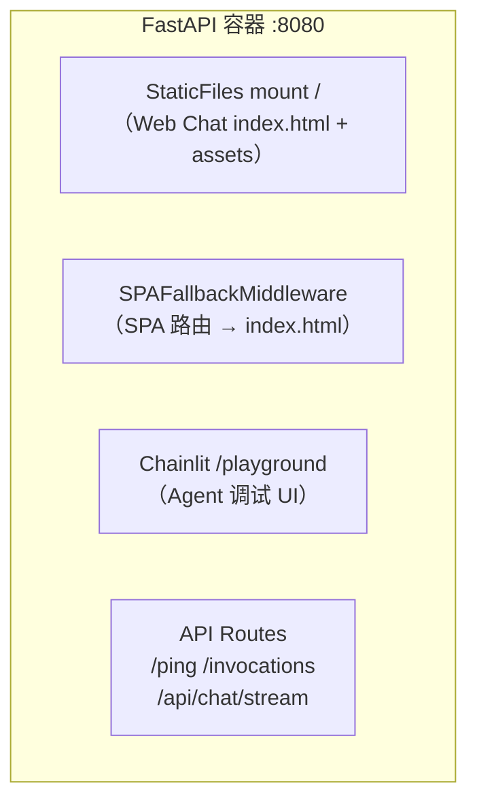
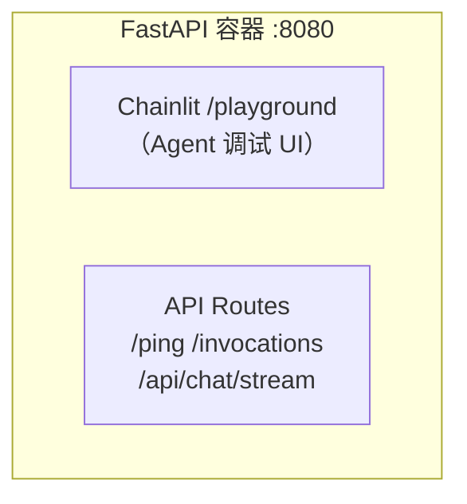
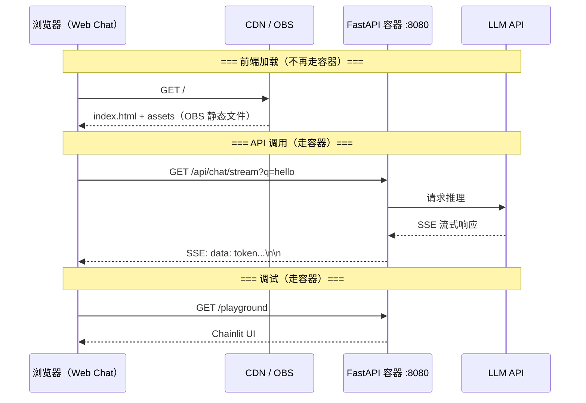
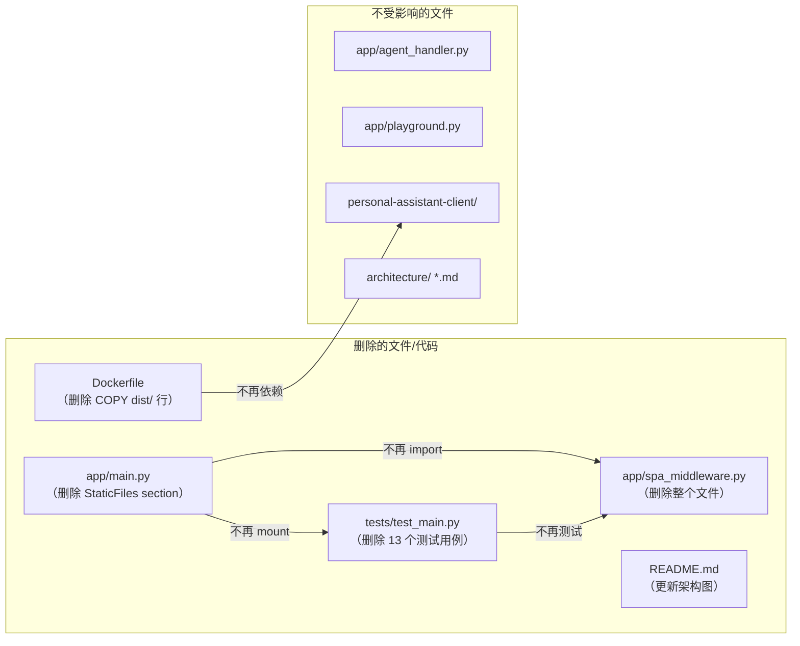

# Refactor 2: 移除 Web Chat 同容器静态文件 serve — Implementation Plan

> 状态：Draft | 关联 Issue：`issue.md`

---

## 0. Issue Evaluation

| 维度 | 结果 | 说明 |
|------|------|------|
| Staleness | ✅ | 引用的代码（`main.py` StaticFiles mount + SPAFallbackMiddleware，`Dockerfile` COPY 指令，`test_main.py` 测试类）全部存在于当前代码库中 |
| Feasibility | ✅ | 纯删除操作，无新功能引入。ADR-008 (line 61) 提到 StaticFiles mount 是"本地开发时"的一个选项，不构成强制性约束；frontend_architecture.md §6.2 已描述 OBS 独立部署为目标状态，与本 refactor 方向一致 |
| Completeness | ✅ | Issue 明确列出了 in-scope 文件（main.py / Dockerfile / test_main.py / 3 个 architecture 文档）和 out-of-scope（Chainlit / API routes / Web Chat 前端代码） |
| Impact Scope | ✅ | 影响范围：Service 侧 4 个文件（main.py、Dockerfile、spa_middleware.py、test_main.py）+ 1 个 README + Meta 侧 3 个 architecture 文档（更新/验证），Client 侧零改动。无跨领域耦合 |

**判定：ACCEPT** → 继续编写 Implementation Plan。

---

## 1. Issue Summary

移除 FastAPI 容器中 Web Chat 前端构建产物的 `StaticFiles` mount 和 `SPAFallbackMiddleware`，使后端回归纯 API + Chainlit Playground 职责。Web Chat 前端（`personal-assistant-client/`）继续独立构建，走 OBS + CDN 部署路径。后端容器不再感知前端构建产物。

**核心动机**：
- 消除后端与前端 `dist/` 目录的耦合（Dockerfile 不再需要 COPY，测试不再依赖 dist/ 存在）
- 减小 Docker 镜像体积（不再包含 Vite build 产物）
- Container 路由简化为 API + Chainlit，职责单一

**关联架构文档**：
- `personal-assistant-meta/architecture/backend_architecture.md`
- `personal-assistant-meta/architecture/frontend_architecture.md`
- `personal-assistant-meta/architecture/overall_architecture.md`

---

## 2. API Change Assessment

| 项目 | 结论 |
|------|------|
| **API 端点变更** | **无**。`/ping`、`/invocations`、`/api/chat/stream`、`/playground` 保持不变 |
| **API Schema 变更** | **无**。不新增/不修改任何 Pydantic/FastAPI Schema |
| **TypeScript 类型变更** | **无**。OpenAPI spec 不受影响（静态文件 mount 不生成 API schema） |
| **路由表变化** | 移除 `GET /` 和所有非 API 路径的静态文件响应。`GET /` 原返回 `index.html`，移除后返回 404 或由 Starlette 默认处理。**这不是 API 变更**——`/` 从未作为 API 端点定义 |

**结论：零 API 影响。** 这是纯部署/容器变更，不改变任何 API 契约。

---

## 3. Files to Change

### 3.1 Service 侧 — 删除

#### `personal-assistant-service/app/spa_middleware.py` — **删除整个文件**

| 原因 | 说明 |
|------|------|
| 唯一使用者 | 仅 `app/main.py` 导入并使用 `SPAFallbackMiddleware` |
| 去留判断 | Middleware 的唯一职责是为 SPA 路由（如 `/chat`）提供 `index.html` fallback。移除 StaticFiles mount 后，无意义 |

操作：`rm personal-assistant-service/app/spa_middleware.py`

#### `personal-assistant-service/app/main.py` — 删除指定代码块

| 行号范围 | 内容 | 操作 |
|----------|------|------|
| 14 | `from fastapi.staticfiles import StaticFiles` | **删除** |
| 17 | `from app.spa_middleware import SPAFallbackMiddleware` | **删除** |
| 94-95 | 注释 `# Mount 在 API routes 之后、StaticFiles 之前，确保路径优先级正确` | **更新**：移除 "StaticFiles 之前" 表述（Chainlit 之后不再有 mount 需要优先级保证） |
| 106-136 | 整个 `# Static file serving for the Web Chat UI` section（含注释、`_proj_root`、`STATIC_DIR` 双路径发现逻辑、`if STATIC_DIR.is_dir()` 条件 mount + middleware） | **全部删除** |

**删除后的 `main.py` 路由结构**：

```python
# 保留的路由顺序（从上到下）：
# 1. /ping              (GET)
# 2. /invocations       (POST)
# 3. /api/chat/stream   (GET)
# 4. /playground        (GET) redirect → /playground/
# 5. mount_chainlit()   (/playground mount)
# ── 以上全部保留 ──
```

**注释更新细节**：第 94-95 行当前为：
```python
# === Chainlit Playground（Agent 调试 UI）===
# Mount 在 API routes 之后、StaticFiles 之前，确保路径优先级正确
```
改为：
```python
# === Chainlit Playground（Agent 调试 UI）===
```
理由：不再有 StaticFiles，无需说明优先级。

#### `personal-assistant-service/Dockerfile` — 删除第 13 行

| 行号 | 内容 | 操作 |
|------|------|------|
| 13 | `COPY personal-assistant-client/dist/ ./dist/` | **删除** |

理由：容器不再需要前端构建产物。`/app/dist/` 目录不再存在，也不需要。

#### `personal-assistant-service/tests/test_main.py` — 删除相关测试

| 行号范围 | 测试名称/内容 | 操作 | 理由 |
|----------|-------------|------|------|
| 242-245 | `# GET / (Static files)` section heading + 分隔线 `---` | **删除** | 该 section 下唯一的测试 (`test_static_index_returns_html`) 被删除，section 成为孤立标题 |
| 248-254 | `test_static_index_returns_html` | **删除** | 依赖 StaticFiles mount 返回 index.html |
| 256-258 | `# StaticFiles dual-path discovery` section heading + 注释 | **删除** | 该 section 下的 `TestStaticFileDualPathDiscovery` 类被删除，section 成为孤立标题 |
| 262-423 | `class TestStaticFileDualPathDiscovery`（7 个方法） | **删除整个类** | 所有方法依赖 STATIC_DIR / StaticFiles mount |
| 459-476 | `TestChainlitPlaygroundMount.test_playground_mount_precedes_static_mount` | **删除** | 比较对象 `web-chat` mount 不存在，测试失效 |
| 571-612 | `class TestSPAFallbackMiddleware`（4 个方法） | **删除整个类** | SPAFallbackMiddleware 已删除 |

**`TestChainlitPlaygroundMount` 的保留测试**（不受影响）：
- `test_playground_mount_exists` ✅ — 验证 `/playground` mount 存在，不与 StaticFiles 交互
- `test_playground_mount_is_chainlit_app` ✅
- `test_ping_works_with_chainlit_mount` ✅
- `test_playground_redirect_trailing_slash` ✅

**总计删除测试数**：1 (test_static_index) + 7 (TestStaticFileDualPathDiscovery) + 1 (test_playground_mount_precedes_static_mount) + 4 (TestSPAFallbackMiddleware) = **13 个测试用例**。另需删除 **2 个孤立 section heading**（`# GET / (Static files)` 和 `# StaticFiles dual-path discovery`）以避免空 section 残留。

> Issue 原文提到"8 个依赖 dist/ 的用例"，经核查实际需要移除 13 个测试 + 2 个 section heading（含 SPAFallback 和 playground/static 排序测试）才能保证测试文件完整可运行。

#### `personal-assistant-service/README.md` — 三处更新

| 行号 | 当前内容 | 操作 | 理由 |
|------|---------|------|------|
| 64 | `访问 http://localhost:8080 进入 Web Chat 对话界面。` | **改为**：`访问 http://localhost:8080/playground 进入 Chainlit 调试界面。API 端点见下方。` | 容器不再 serve 前端静态文件，`GET /` 返回 404。指引用户使用 Chainlit Playground 作为同容器对话 UI |
| 73 | `\| GET \| / \| Web Chat 静态页面 \|` | **删除**该行 | API 端点表不再包含静态页面路由（`GET /` 已不是有效端点） |
| 141 | `Browser ──GET /──→ StaticFiles (web/index.html)` | **删除**该行及后续箭头分支 | 架构图不再包含同容器静态文件 serve 路径 |

**架构图更新（lines 138-152）**，改为：
```
Browser ──GET /api/chat/stream?q=...──→ StreamingResponse
  │
  │  SSE 响应
  │
  │  AgentHandler.handle_stream()
  │
  │  deepagents agent.astream_events(v2)
  │
  │  MaaS LLM (DeepSeek-V4-Pro)
  │
  └── POST /invocations ──→ AgentHandler.handle() → agent.ainvoke()
```

**API 端点表更新后（lines 68-73）**：
| 方法 | 路径 | 说明 |
|------|------|------|
| `GET` | `/ping` | 健康检查，返回 `{"status":"ok"}` |
| `POST` | `/invocations` | 非流式对话，供 AgentArts / OfficeClaw 调用 |
| `GET` | `/api/chat/stream?q=...` | SSE 流式对话，供 Web Chat 前端使用 |

> 移除的 `GET /` 行不再存在。Chainlit Playground (`/playground`) 可作为容器内对话 UI。Web Chat 前端通过 CDN/OBS 独立部署后在浏览器中打开 `https://chat.personal-assistant.cn/`。

---

### 3.2 Meta 侧 — Architecture 文档验证/更新

#### `personal-assistant-meta/architecture/backend_architecture.md`

| 当前状态 | 需要改动 |
|----------|---------|
| §1 Container 路由图 (lines 14-21) 列出 `/ping`、`/chat/stream`、`/playground`、`/invocations`、`/feishu/webhook`、`/auth/callback` | **无 StaticFiles 引用**，当前已正确。无需改动。 |
| §2 路由设计表 (lines 118-124) 仅列出 API 路由 | **无 StaticFiles 引用**，无需改动。 |

**结论：backend_architecture.md 无需修改。** 但建议在 §6 技术栈表中增加一行说明（可选）：

| 静态资源 | 无 | Web Chat 前端独立部署于 OBS + CDN，容器仅提供 API + Chainlit Playground |

> ⚠️ 或者不做此行修改——由 Service-Dev 自行判断是否需要显式说明。

#### `personal-assistant-meta/architecture/frontend_architecture.md`

| 当前状态 | 需要改动 |
|----------|---------|
| §2.1.1 (line 97) 已写明："Web Chat 前端（Vite + React）不再打包进容器，直接走 OBS 独立部署（见 §6.2 Phase 2）" | **已符合目标状态**，无需改动 |
| §6.1 整体拓扑图 (line 244) 中 FastAPI 容器标签已只列出 API 路由 | **已符合目标状态**，无需改动 |
| §6.2 (lines 260-265) 描述当前阶段为"OBS 静态托管"，无同容器 serve 描述 | **已符合目标状态**，无需改动 |

**结论：frontend_architecture.md 已完全反映目标架构，无需修改。** 如果发现任何残留的"Phase 1 同容器 serve"描述（已核查不存在），标记为需要删除。

#### `personal-assistant-meta/architecture/overall_architecture.md`

| 当前状态 | 需要改动 |
|----------|---------|
| §1.1 路由层标签 (line 22) 列出 `/ping /invocations /feishu/webhook /auth/callback /chat/stream` | 无 StaticFiles 引用，无需改动 |
| §9 项目结构 (line 683)："前端不再作为 adapters/ 目录放在同一仓库。Web Chat 前端为独立项目" | 已符合目标状态，无需改动 |

**结论：overall_architecture.md 无需修改。**

---

### 3.3 不作改动的文件（明确排除）

| 文件/目录 | 原因 |
|-----------|------|
| `personal-assistant-client/` 全部 | Web Chat 前端代码不受影响，继续独立构建部署 |
| `app/agent_handler.py` | 不受影响 |
| `app/playground.py` | Chainlit Playground 保持不变 |
| `app/llm_config.py` | 不受影响 |
| `app/oauth.py` | 不受影响 |
| `app/feishu_adapter.py` | 不受影响 |
| `app/tools/` | 不受影响 |
| `personal-assistant-service/.agentarts_config.yaml` | 不受影响 |
| `personal-assistant-service/config.yaml` | 不受影响 |
| `personal-assistant-infra/` | 不受影响（前端部署的 OBS + CDN 资源配置不属于本 refactor 范围） |

---

## 4. Step-by-Step Implementation Order

### Step 1: 删除 `spa_middleware.py`

```
rm personal-assistant-service/app/spa_middleware.py
```

**验证**：确认文件已删除，且 `grep -r "spa_middleware" personal-assistant-service/app/` 无结果（main.py 的 import 将在 Step 2 移除）。

### Step 2: 修改 `app/main.py`

顺序操作：

1. 删除第 14 行：`from fastapi.staticfiles import StaticFiles  # noqa: E402`
2. 删除第 17 行：`from app.spa_middleware import SPAFallbackMiddleware  # noqa: E402`
3. 删除第 106-136 行：整个 `# Static file serving for the Web Chat UI` section
4. 更新第 94-95 行注释（删除 "StaticFiles 之前" 表述）

**验证**：
```bash
cd personal-assistant-service
python -c "from app.main import app; print('Import OK')"
# 应无 ImportError，不再尝试导入 StaticFiles 或 SPAFallbackMiddleware
```

### Step 3: 修改 `Dockerfile`

删除第 13 行：`COPY personal-assistant-client/dist/ ./dist/`

**验证**：确认 Dockerfile 中不再包含 `personal-assistant-client/dist/` 路径。

### Step 4: 修改 `tests/test_main.py`

在文件中删除以下代码块（按行号顺序，避免位移错乱——建议**从后往前删除**）：

1. 删除 `class TestSPAFallbackMiddleware`（lines 571-612）
2. 删除 `TestChainlitPlaygroundMount.test_playground_mount_precedes_static_mount`（lines 459-476）
3. 删除 `class TestStaticFileDualPathDiscovery`（lines 262-423）
4. 删除 `# StaticFiles dual-path discovery` section heading + 注释（lines 256-258）
5. 删除 `test_static_index_returns_html`（lines 248-254）
6. 删除 `# GET / (Static files)` section heading + 分隔线 `---`（lines 242-245）

**验证**：
```bash
cd personal-assistant-service
pytest tests/test_main.py -v
# 所有保留的测试通过，无 import error，无测试因依赖已删除代码而失败
```

### Step 5: 修改 `README.md`

三处修改（详细内容见 §3.1）：

1. **Line 64**：更新快速开始说明——`http://localhost:8080/playground` 替代 `http://localhost:8080`
2. **Line 73**：删除 API 端点表中 `GET /` 行
3. **Lines 138-152**：更新架构图，移除 `Browser ──GET /──→ StaticFiles` 路径

**验证**：
```bash
# 确认无残留引用
grep -n "StaticFiles\|Web Chat 静态页面\|进入 Web Chat 对话界面" personal-assistant-service/README.md
# 期望：无匹配
```

### Step 6: 验证 Architecture 文档

逐一检查以下文档，确认无残留的"同容器静态文件 serve"描述：

- [x] `backend_architecture.md` — 无需修改（已只描述 API routes + Chainlit）
- [x] `frontend_architecture.md` — 无需修改（§2.1.1 和 §6.2 已描述 OBS 独立部署）
- [x] `overall_architecture.md` — 无需修改（路由图已排除静态文件）

> 如果发现任何遗漏的引用，创建补充 issue 追踪。Blocking 判定：当前核查结论是无需修改，不应成为实施阻塞。

### Step 7: 全量验证

```bash
# Service 侧完整验证
cd personal-assistant-service

# 1. 导入检查
python -c "from app.main import app; print('✓ Import OK')"

# 2. 路由表检查
python -c "
from app.main import app
routes = [(r.path, getattr(r, 'name', ''), type(r).__name__) for r in app.routes]
for r in routes:
    # 不应出现 'web-chat' 或 'StaticFiles'
    assert 'web-chat' not in r, f'Unexpected web-chat route: {r}'
print('✓ No web-chat route')
print('Routes:', routes)
"

# 3. 测试运行
pytest tests/test_main.py -v

# 4. Docker 构建（可选，如果环境允许）
docker build -t personal-assistant:refactor-test .
```

---

## 5. Acceptance Criteria

| # | 验收项 | 验证方式 | 通过标准 |
|---|--------|---------|---------|
| AC-1 | `app/main.py` 不包含 `StaticFiles` 和 `SPAFallbackMiddleware` 的 import 或使用 | `grep -E "StaticFiles|SPAFallbackMiddleware" personal-assistant-service/app/main.py` | 无匹配 |
| AC-2 | `app/spa_middleware.py` 文件不存在 | `ls personal-assistant-service/app/spa_middleware.py` | 文件不存在 |
| AC-3 | `Dockerfile` 不包含 `COPY personal-assistant-client/dist/` | `grep "personal-assistant-client/dist" personal-assistant-service/Dockerfile` | 无匹配 |
| AC-4 | `test_main.py` 不包含已删除的 3 个测试类 + 1 个独立测试函数 | `grep -E "TestStaticFileDualPathDiscovery|TestSPAFallbackMiddleware|test_static_index_returns_html|test_playground_mount_precedes_static_mount" personal-assistant-service/tests/test_main.py` | 无匹配 |
| AC-5 | `pytest tests/test_main.py` 全部通过 | 运行命令 | 所有保留的测试通过，零 failure/error |
| AC-6 | 导入 `app.main` 不触发任何错误 | `python -c "from app.main import app"` | 成功导入，零 ImportError |
| AC-7 | API 端点正常工作 | `test_ping_returns_status_ok`、`test_invocations_returns_response`、`test_chat_stream_returns_sse` 通过 | 全部通过 |
| AC-8 | Chainlit Playground `/playground` 正常 | `test_playground_mount_exists`、`test_playground_redirect_trailing_slash` 通过 | 全部通过 |
| AC-9 | README 无残留的同容器静态文件 serve 引用 | `grep -nE "StaticFiles|Web Chat 静态页面|进入 Web Chat 对话界面" personal-assistant-service/README.md` | 无匹配 |
| AC-10 | Architecture 文档无残留的同容器 serve 描述 | 人工复查（已有核查记录见 §3.2） | 无需要修改的内容 |
| AC-11 | `tests/test_main.py` 无孤立 section heading 残留 | `grep -nE "# GET / \(Static files\)|# StaticFiles dual-path discovery" personal-assistant-service/tests/test_main.py` | 无匹配 |

---

## 6. Risk Assessment

| 风险 | 概率 | 影响 | 缓解措施 |
|------|------|------|---------|
| **本地开发流程中断** | 低 | 中 | 已有前端独立 dev server（`npm run dev` in client/）+ 后端独立 uvicorn。移除后开发流程不受影响，只需确保开发者文档说明前端独立启动方式（已在 frontend_architecture.md §6.2 有说明） |
| **Docker 镜像构建失败** | 低 | 中 | 仅删除 `COPY` 指令，不引入新依赖或新步骤。Docker build 应更简单（少一个 COPY 步骤） |
| **测试间依赖** | 低 | 中 | 需确保 `TestChainlitPlaygroundMount` 中 `test_playground_mount_precedes_static_mount` 被正确移除。其他 Chainlit 测试不依赖 static mount |
| **refactor-1（consolidate-ping-routes）已完成并 merge？** | 中 | 高 | refactor-1 和 refactor-2 可能共享 `main.py` 和 `test_main.py` 的同一区域。如果 refactor-1 尚未 merge，refactor-2 的 plan 执行时可能遇到冲突。**建议**：确认 refactor-1 的 merge 状态；如果 refactor-1 已 merge，则 refactor-2 的修改范围可能略有偏移（`/ping` 已从 `/ping` 改为其他地方？） |
| **ADR-008 提到的 StaticFiles mount 选项** | 低 | 低 | ADR-008 line 61 提到 "或本地开发时由 FastAPI StaticFiles mount" 作为选项之一。这个 mention 是描述性的而非强制性的。ADR 记录的是当时决策的背景，不代表该选项必须保留。无需修改 ADR。 |

### refactor-1 依赖风险详细分析

refactor-1（consolidate-ping-routes）如果已实施，可能改变了 `main.py` 中路由的位置——`/ping` 可能被移到了不同的行。refactor-2 修改的 lines 106-136（StaticFiles section）与 refactor-1 的修改区域**不重叠**（refactor-1 改的是 `/ping` 和 `/invocations` 的路由 path，均在 StaticFiles section 之前）。

但是 `test_main.py` 中 refactor-1 可能新增/修改了测试，需要确认：
- refactor-1 plan 中提到将 `test_static_index_returns_html` 从 404 预期改为 200 预期（因为 SPA fallback）。如果 refactor-1 已经做了这个修改，refactor-2 直接删除该测试即可，不受影响。
- refactor-1 不影响 `TestStaticFileDualPathDiscovery` 和 `TestSPAFallbackMiddleware`。

**建议**：实施前确认 refactor-1 的 merge 状态。如果 refactor-1 已 merge，执行 `git pull origin main` 获取最新代码，重新验证行号范围。

---

## 7. Mermaid Diagrams

### 7.1 变更前后容器路由对比

**Before（变更前）**：



**After（变更后）**：



### 7.2 请求处理流程（变更后）



> **关键变化**：`GET /` 不再由 FastAPI 容器处理（原 StaticFiles mount → index.html），改为由 CDN/OBS 独立提供。

### 7.3 文件变更关系



---

## 8. Service-Dev 执行清单

> 以下为 Service-Dev 可直接执行的操作步骤，按顺序执行。

1. **删除文件**
   - `rm app/spa_middleware.py`

2. **编辑 `app/main.py`**
   - 删除 `from fastapi.staticfiles import StaticFiles` import
   - 删除 `from app.spa_middleware import SPAFallbackMiddleware` import
   - 删除整个 `# Static file serving for the Web Chat UI` section（约 30 行）
   - 简化 Chainlit 注释（移除 "StaticFiles 之前" 表述）

3. **编辑 `Dockerfile`**
   - 删除 `COPY personal-assistant-client/dist/ ./dist/` 行

4. **编辑 `tests/test_main.py`**（从后往前删除，避免行号位移）
   - 删除 `TestSPAFallbackMiddleware` 类（全部方法）
   - 删除 `test_playground_mount_precedes_static_mount` 方法
   - 删除 `TestStaticFileDualPathDiscovery` 类（全部方法）
   - 删除 `# StaticFiles dual-path discovery` section heading + 注释
   - 删除 `test_static_index_returns_html` 函数
   - 删除 `# GET / (Static files)` section heading + 分隔线

5. **编辑 `README.md`**
   - Line 64：更新快速开始说明（`/playground` 替代 `/`）
   - Line 73：删除 API 端点表中 `GET /` 行
   - Lines 138-152：更新架构图，移除 `Browser ──GET /──→ StaticFiles` 路径

6. **验证**
   - `python -c "from app.main import app"` — 导入成功
   - `pytest tests/test_main.py -v` — 全部通过

---

## 9. Client-Dev 执行清单

**无需任何操作。** Web Chat 前端（`personal-assistant-client/`）不受此次 refactor 影响。

- 前端继续通过 `npm run dev` 独立启动开发服务器
- 前端继续通过 `npm run build` 产出静态文件，部署到 OBS
- 前端的 API 调用目标（`/api/chat/stream`）不变

---

## 10. Meta-Dev 执行清单

**Architecture 文档复查**（§3.2 已详细记录核查结果）：

| 文档 | 操作 |
|------|------|
| `backend_architecture.md` | ✅ 无需修改 |
| `frontend_architecture.md` | ✅ 无需修改（已描述 OBS 独立部署） |
| `overall_architecture.md` | ✅ 无需修改 |

如果复查中发现遗漏的引用，标记为后续 issue 追踪。

---

## 11. E2E 测试建议

E2E 测试应覆盖以下场景以验证 refactor 不引入回归：

| 场景 | 验证点 |
|------|--------|
| `GET /ping` | 返回 200 `{"status": "ok"}` |
| `POST /invocations` | 正常对话响应 |
| `GET /api/chat/stream?q=hello` | SSE 流式响应正常 |
| `GET /playground` | 307 redirect to `/playground/` |
| `GET /playground/` | Chainlit UI 加载正常 |
| `GET /` | 返回 404（不再返回 index.html） |

> 注意：`GET /` 返回 404 是预期行为——容器不再 mount 根路径静态文件。如果部署架构在容器前有反向代理（如 CDN），`/` 的请求不会到达容器，因此不影响终端用户。
