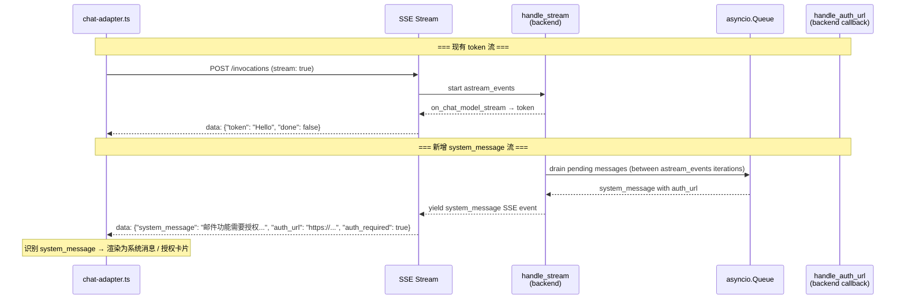
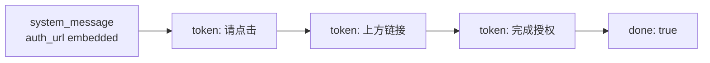
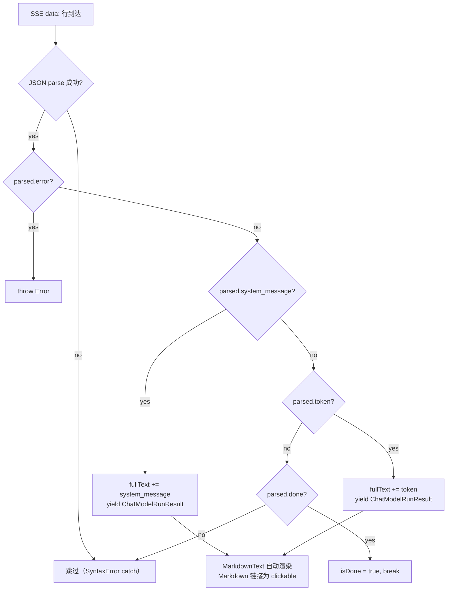
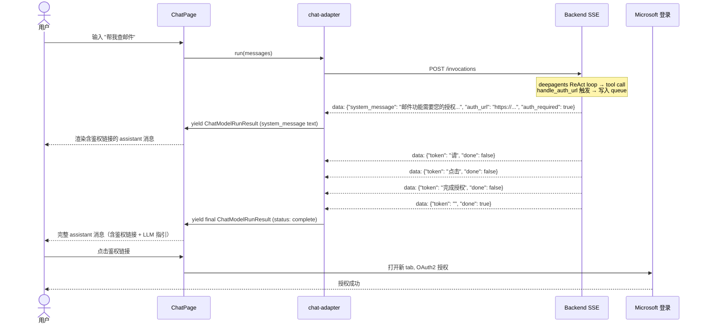

# Client Plan — refactor-email-auth-normal-control-flow

> 关联 issue: `refactor-email-auth-normal-control-flow`
> 架构参考: `frontend_architecture.md` §2.1.4, `backend_architecture.md` §5.2.1
> 目标分支: `refactor/refactor-email-auth-normal-control-flow`

---

## 1. 变更概述

本次 refactor 将 `email_tools.py` 中 OAuth2 鉴权 URL 的呈现方式从异常控制流（exception-based）改为正常控制流（normal control flow）。核心改动在后端：通过 shared `asyncio.Queue` 实现 out-of-band 消息投递，并在 SSE stream 中新增 `system_message` 事件类型。

**前端侧**需要：
1. 扩展 `SSEEvent` TypeScript 类型，新增 `system_message`、`auth_url`、`auth_required` 字段
2. 更新 `chat-adapter.ts` 解析并渲染 `system_message` SSE 事件
3. 可选新增 `SystemMessage` UI 组件，将鉴权链接渲染为可交互的授权卡片（区别于普通 LLM token）

---

## 2. 数据流变化



---

## 3. Client Tasks

### 3.1 扩展 `SSEEvent` 类型定义

**文件**: `personal-assistant-client/src/types/chat.ts`

在现有 `SSEEvent` interface 中新增三个 optional 字段：

| 字段 | 类型 | 说明 |
|------|------|------|
| `system_message` | `string` | 带外系统消息正文（如 "邮件功能需要您的授权..."） |
| `auth_url` | `string` | OAuth2 鉴权 URL（仅当 `auth_required: true` 时有效） |
| `auth_required` | `boolean` | 标记该 system_message 为 OAuth2 鉴权请求 |

变更后：

```typescript
export interface SSEEvent {
  token?: string;
  done?: boolean;
  error?: string;
  system_message?: string;    // new — out-of-band system message
  auth_url?: string;           // new — OAuth2 authorization URL
  auth_required?: boolean;     // new — marks as auth request
}
```

### 3.2 更新 `chat-adapter.ts` SSE 解析逻辑

**文件**: `personal-assistant-client/src/lib/chat-adapter.ts`

在 SSE 行解析循环中（当前 `parsed.token` 处理分支之后），新增 `system_message` 事件处理：

#### 3.2.1 system_message 处理分支

```typescript
if (typeof parsed.system_message === "string") {
  // Render system_message as a structured content part
  // If auth_required, prefix the auth_url as a clickable link
  fullText += parsed.system_message;
  yield {
    content: [{ type: "text", text: fullText }],
  };
}
```

#### 3.2.2 关键设计决策

- **鉴权 URL 的处理方式**：在当前架构中，`chat-adapter.ts` 的 `ChatModelAdapter.run()` 返回 `AsyncGenerator<ChatModelRunResult>`，其中 `ChatModelRunResult` 的 `content` 使用 `TextContentPart`（`{ type: "text", text: string }`）。由于 assistant-ui 的 `MarkdownText` 组件会自动将 Markdown 中的 URL 渲染为 clickable link，因此 `system_message` 的 `auth_url` 可以包含在 `system_message` 的 Markdown 正文中（例如 `[点此授权](https://...)`），由现有 Markdown 渲染管道自动处理。这避免了修改 assistant-ui 组件树。

- **关于 `auth_required` 标记**：`auth_required: true` 的语义是"这个消息是 OAuth2 鉴权请求"。在 Phase 1（当前 issue）中，前端读取此标记以备将来使用（如渲染专用授权卡片 UI），但在当前迭代中，可直接依赖 Markdown 渲染来生成可点击链接。后续 iteration 可将 `auth_required: true` 的消息渲染为独立 `SystemMessage` 组件（见 §3.3）。

#### 3.2.3 修改后的完整解析循环（关键路径）

```
for each SSE line starting with "data:":
  parsed = JSON.parse(raw)

  // 现有: token 处理
  if parsed.token → accumulate + yield

  // 新增: system_message 处理
  if parsed.system_message → accumulate + yield

  // 现有: done 处理
  if parsed.done → break

  // 现有: error 处理
  if parsed.error → throw
```

> **注意**：`system_message` 事件可以在 `done` 事件之前或之后出现。后端保证所有 `system_message` 在 stream 结束前 yield。前端需要处理 `system_message` 和 `token` 在同一 stream 中交错出现的场景：system_message 先出现（鉴权请求），随后 LLM 可能继续产生 token（解释下一步操作）。

#### 3.2.4 `system_message` 和 `token` 交错场景



前端处理策略：`system_message` 的正文通过 `fullText` 累加，与后续 token 形成一条连续的 assistant 消息。这意味着用户会看到一条 assistant 消息，内容包含鉴权说明和后续 LLM 输出的指引文字。

### 3.3 UI 组件变更（可选，当前 issue 不做强制要求）

**仅在以下条件下需要新增 UI 组件**：如果 Markdown 自动链接渲染不能满足 UX 需求（例如希望鉴权链接以醒目的按钮/卡片形式出现而非混在正文中），则新增 `SystemMessage` 组件。

#### 3.3.1 `SystemMessage` 组件（可选）

**文件**: `personal-assistant-client/src/components/chat/SystemMessage.tsx`

职责：渲染 `system_message` 类型的消息。当 `auth_required: true` 时，将鉴权 URL 渲染为可点击的授权按钮/卡片；否则作为普通系统消息渲染。

**Props**:

| Prop | Type | Description |
|------|------|-------------|
| `message` | `string` | 系统消息正文 |
| `authUrl` | `string \| undefined` | OAuth2 鉴权 URL（可选） |
| `authRequired` | `boolean` | 是否为鉴权请求 |

**视觉设计**（遵循 Apple Design Language）：

- 非鉴权系统消息：浅色背景（`bg-muted`）圆角卡片，内嵌 Markdown 渲染，使用 `text-sm text-muted-foreground`
- 鉴权消息：在系统消息卡片顶部增加一条醒目的 `#0066cc`（Action Blue）色的 Pill Button（`rounded-full`、`apple-primary` variant），按钮文本 "授权 Microsoft 365"，`href={authUrl}`，`target="_blank" rel="noopener noreferrer"`
- 鉴权消息卡片底部保留系统消息正文（如 "授权完成后，请再次告诉我您需要做什么"），使用 Markdown 渲染

**使用方式**：此组件不接入 assistant-ui 的 `MessagePrimitive` 树。它作为一条 **独立的视觉元素** 注入到 Thread viewport 中。有两种可行的注入方式：

1. **方式 A（推荐 — 轻量）**：在 `chat-adapter.ts` 中通过修改 `content` 结构标注消息类型，然后由 assistant-ui 的 `AssistantMessage` 组件通过 `groupPartByType` 分发到 `SystemMessage`。这需要扩展 assistant-ui 的 content part 类型 —— 但并不推荐修改 upstream 类型。

2. **方式 B（推荐 — 实际可行）**：保持不变，依赖 Markdown 自动链接渲染。`system_message` 正文以 Markdown 格式编写，包含 `[授权链接]({auth_url})` 格式的 Markdown 链接。这对于 `MarkdownText` 组件来说自动是 clickable 的。这是 **最小侵入、最可靠** 的方案，也是当前 issue 建议的首选方案。

> **结论**：当前 issue 不强制新增 `SystemMessage` 组件。Markdown 自动链接渲染即可满足需求。如果 UX 评审后认为需要醒目的授权按钮，可创建 follow-up issue。

#### 3.3.2 `ChatPage.tsx` 变更

**文件**: `personal-assistant-client/src/components/chat/ChatPage.tsx`

**如果是方式 A**：在 `ChatPage.tsx` 的 `<Thread />` 之前或 `<ThreadPrimitive.ViewportFooter>` 区域上方渲染待处理的 system messages。

**如果是方式 B（当前选择）**：`ChatPage.tsx` **无需任何变更**。

### 3.4 构建配置变更

**无变更**。Vite、Tailwind、环境变量配置均不受影响。SSE 协议扩展对现有 Vite proxy 配置无影响。

---

## 4. API Adaptations

### 4.1 TypeScript 类型更新

`SSEEvent` interface 扩展（见 §3.1），后端 OpenAPI spec 无新增 endpoint，无需 `personal-assistant-meta-client-dev` 重新生成类型。

### 4.2 fetch 调用

**无变更**。`chat-adapter.ts` 中的 `fetch()` 调用保持不变：
- 请求 endpoint: `POST {baseUrl}/invocations`，body `{ message, stream: true }`
- 响应: `text/event-stream`（SSE）
- `system_message` 作为 SSE `data:` 行的 JSON payload 传入，复用现有 SSE 解析管道

---

## 5. UI Flow

### 5.1 system_message 渲染流程



### 5.2 用户交互序列



---

## 6. Frontend Test Cases

### 6.1 `SSEEvent` 类型测试

**文件**: `personal-assistant-client/src/types/chat.ts`（类型文件，无需独立测试文件；TypeScript 编译即可验证）

验证点：
- `SSEEvent` 包含 `system_message?: string`、`auth_url?: string`、`auth_required?: boolean`
- 现有接口实现者（如 `chat-adapter.ts` 中的 `parsed: SSEEvent`）不因新增 optional 字段而报 type error

### 6.2 `chat-adapter.ts` 单元测试扩展

**文件**: `personal-assistant-client/src/lib/chat-adapter.test.ts`

新增测试场景：

#### CT-SYS-01: system_message without auth_url renders as text

```
Given: SSE stream yields data: {"system_message": "系统通知：服务将在 10 分钟后维护", "auth_required": false}
When:  chatAdapter.run() 消费 SSE stream
Then:  最终 fullText 包含 "系统通知：服务将在 10 分钟后维护"
And:  消息被作为 assistant 消息的一部分渲染
```

#### CT-SYS-02: system_message with auth_url renders auth link

```
Given: SSE stream yields data: {"system_message": "邮件功能需要您的授权", "auth_url": "https://login.microsoftonline.com/...", "auth_required": true}
When:  chatAdapter.run() 消费 SSE stream
Then:  最终 fullText 包含 "邮件功能需要您的授权"
And:  fullText 包含 auth_url（或 Markdown 链接格式）
```

#### CT-SYS-03: system_message interleaved with tokens

```
Given: SSE stream 按顺序 yield：
       1. system_message: "请授权"
       2. token: "点击"
       3. token: "上方链接"
       4. token: "完成授权"
       5. done: true
When:  chatAdapter.run() 消费 SSE stream
Then:  最终 fullText = "请授权点击上方链接完成授权"
And:  最终 status = { type: "complete", reason: "stop" }
```

#### CT-SYS-04: system_message before first token — stream continues normally

```
Given: SSE stream 先 yield system_message，再 yield token events，最后 done
When:  chatAdapter.run() 消费 SSE stream
Then:  所有 system_message 和 token 都被正确累加
And:  不因 system_message 出现而提前认为 stream 结束
```

#### CT-SYS-05: system_message after done event — stream already closed

```
Given: SSE stream yield done: true，之后继续 yield system_message（异常场景）
When:  chatAdapter.run() 消费 SSE stream
Then:  done 之后不再有新的 yield（done=true 后 break 退出循环）
And:  不 crash
```

#### CT-SYS-06: empty system_message string skipped gracefully

```
Given: SSE stream yields data: {"system_message": ""}
When:  chatAdapter.run() 消费 SSE stream
Then:  fullText 不累加空字符串
And:  不额外 yield 空 content
```

#### CT-SYS-07: auth_required without auth_url still renders system_message

```
Given: SSE stream yields data: {"system_message": "需要授权", "auth_required": true}（无 auth_url）
When:  chatAdapter.run() 消费 SSE stream
Then:  fullText 包含 "需要授权"
And:  chatAdapter 不 crash（auth_url 可选处理）
```

---

## 7. 组件层次结构（不变）

当前 issue 的前端组件层次结构保持不变：

```
App.tsx
├── AuthGuard
│   ├── LoadingState (MSAL transitioning)
│   ├── LandingPage (未认证)
│   └── ChatPage (已认证)
│       └── RuntimeProvider
│           └── Thread (assistant-ui)
│               ├── ThreadWelcome (空对话时)
│               ├── ThreadPrimitive.Messages
│               │   ├── UserMessage (用户消息)
│               │   └── AssistantMessage (LLM 回复 + system_message 文本)
│               │       └── MarkdownText (自动渲染 Markdown 链接)
│               └── Composer (输入框)
```

`system_message` 事件通过 `chat-adapter.ts` 转换为 `ChatModelRunResult`（含 `TextContentPart`），由 assistant-ui 的 `AssistantMessage` → `MarkdownText` 组件自动渲染，**无需新增组件节点**。

---

## 8. 风险与依赖

| 风险 | 影响 | 缓解措施 |
|------|------|----------|
| `system_message` 在 LLM 输出中间插入，可能导致 assistant-ui 的消息分组合并异常 | UX 体验不佳（鉴权链接后 LLM 输出继续出现在同一条消息中） | 可接受——同一条消息中的鉴权链接 + LLM 指引是合理 UX |
| Markdown 链接样式不够醒目，用户可能忽略 | 鉴权成功率降低 | 后续 follow-up issue 可升级为专用 `SystemMessage` 组件（Pill Button） |
| 后端 `system_message` SSE event 的 JSON 字段名与前端期望不一致 | 解析失败，auth URL 不显示 | 与后端 `service-plan.md` 和 `backend_architecture.md` §5.2.1 对齐字段名 |
| `system_message` SSE line 的 JSON parse 失败（`SyntaxError`） | 消息丢失 | 现有 `catch (e instanceof SyntaxError) continue` 逻辑会跳过，不会 crash——但用户看不到鉴权链接。需要在 test cases 中覆盖 malformed JSON 场景 |

---

## 9. 与 Backend 的契约

前端与后端在 SSE 协议上的契约（摘自 `frontend_architecture.md` §2.1.4 和 `backend_architecture.md` §5.2.1）：

| SSE Event JSON Field | Type | Backend 何时 yield | Frontend 如何处理 |
|----------------------|------|-------------------|-------------------|
| `token` | `string` | LLM `on_chat_model_stream` 事件 | 累加到 fullText，yield ChatModelRunResult |
| `done` | `boolean` | `astream_events` 结束后 | 设置 isDone=true，最终 yield complete status |
| `error` | `string` | 异常发生 | throw Error |
| `system_message` | `string` | `handle_stream` drain queue 时 | 累加到 fullText，yield ChatModelRunResult |
| `auth_url` | `string` | 与 system_message 同时 yield | 嵌入 fullText（Markdown 链接格式），由 MarkdownText 渲染 |
| `auth_required` | `boolean` | 与 system_message 同时 yield | 暂不特殊渲染，保留以备将来使用 |

**不可变的保证**：
- `system_message`、`auth_url`、`auth_required` 三者一起出现时，表示一条 OAuth2 鉴权请求
- `system_message` 单独出现时，表示一条普通系统消息
- 所有字段都是 optional，向后兼容现有 SSE 事件

---

## 10. Implementation Checklist

- [ ] **Task 1**: 扩展 `personal-assistant-client/src/types/chat.ts` — `SSEEvent` interface 新增 `system_message?`, `auth_url?`, `auth_required?`
- [ ] **Task 2**: 更新 `personal-assistant-client/src/lib/chat-adapter.ts` — 在 SSE 解析循环中添加 `system_message` 处理分支（介于 `parsed.token` 和 `parsed.done` 之间）
- [ ] **Task 3**: 更新 `personal-assistant-client/src/lib/chat-adapter.test.ts` — 新增 §6.2 中的 7 个 test cases（CT-SYS-01 至 CT-SYS-07）
- [ ] **Task 4**: 运行 `npm run typecheck` 和 `npm run test` 验证
- [ ] **Task 5**: （可选）如果 Markdown 自动链接不能满足 UX 要求，创建 follow-up issue 实现 `SystemMessage` 组件（带 Pill Button 的授权卡片）
