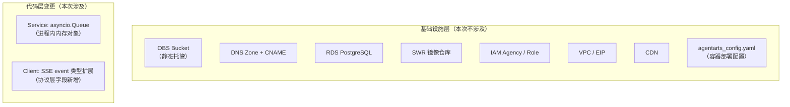
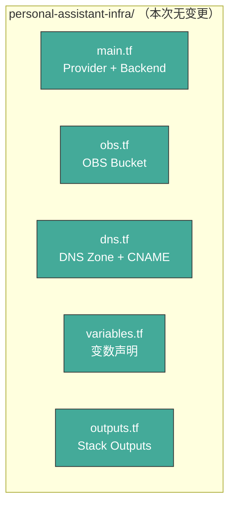
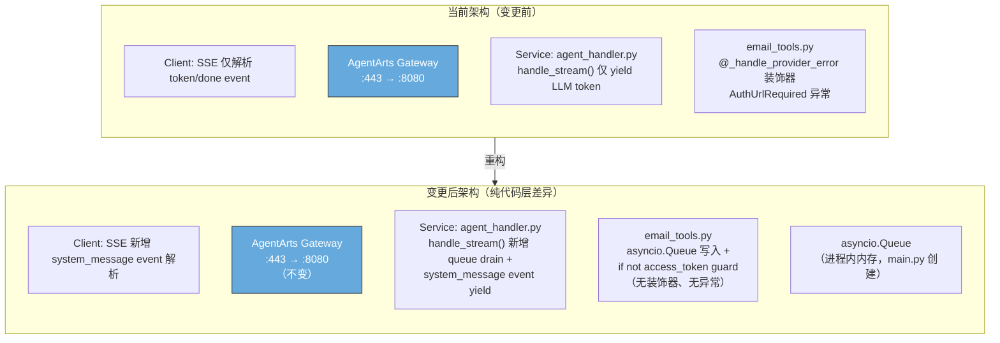

# Infra Plan: refactor-email-auth-normal-control-flow

> 版本：v1.0 | 状态：Draft | 关联文档：[issue.md](./issue.md), [backend_architecture.md](../../../architecture/backend_architecture.md)

---

## 1. 变更范围分析

### 1.1 Issue 变更摘要

本 issue 是一次 **纯代码重构**，范围限定在 service 和 client 两层：

| 层 | 文件 | 变更性质 |
|----|------|----------|
| **Service** | `email_tools.py` | 删除异常控制流（`@_handle_provider_error` 装饰器, `AuthUrlRequired` 异常类），改用 `asyncio.Queue` + `if not access_token` guard |
| **Service** | `agent_handler.py` | `handle_stream()` 扩展支持 drain `asyncio.Queue`，yield `system_message` SSE event |
| **Service** | `main.py` | 创建 `asyncio.Queue` 实例并通过 module-level setter 注入 `email_tools.py` |
| **Client** | `chat.ts`, `chat-adapter.ts` | 扩展 SSE event 类型支持 `system_message` event |

### 1.2 基础设施影响判断

**结论：本 issue 不涉及任何基础设施变更。**

原因如下：

| 检查项 | 判断 | 理由 |
|--------|------|------|
| OBS Bucket（静态托管） | ❌ 不需要 | 前端构建产物上传方式不变；`system_message` 是运行时 SSE 协议字段，无需变更 OBS 策略或 bucket 配置 |
| DNS Zone / CNAME | ❌ 不需要 | `chat.resource-governance.cloud` 域名指向不变 |
| RDS PostgreSQL | ❌ 不需要 | `asyncio.Queue` 是进程内内存对象，无持久化需求；无新增数据库 schema 或连接 |
| SWR 镜像仓库 | ❌ 不需要 | Docker 镜像构建方式不变（ARM64, `Dockerfile`）；本次变更仅修改 `.py` 源码，镜像自动包含 |
| IAM Agency / Role | ❌ 不需要 | 无新增 Outbound 认证 provider；`@require_access_token` 的 provider 配置不变 |
| VPC / EIP | ❌ 不需要 | 网络拓扑无变化 |
| CDN | ❌ 不需要 | 静态资源分发策略不变 |
| `agentarts_config.yaml` | ❌ 不需要 | Gateway 路由策略不变（仍为 `ACCURATE_MATCH` + `/invocations`）；容器端口、协议不变 |
| OpenTofu `.tf` 文件 | ❌ 不需要 | 无新增/修改/删除资源 |
| TLS / 证书 | ❌ 不需要 | HTTPS 终结点不变 |

---

## 2. IaC 变更

**无 IaC 变更。** 当前 `personal-assistant-infra/` 下的所有 `.tf` 文件保持不变：

不需要执行 `tofu validate`、`tofu plan` 或 `tofu apply` 等任何 IaC 命令。

---

## 3. 网络与安全

**无变更。** 网络边界、CORS、CDN、反向代理、IAM policy、TLS 证书均保持不变。

`asyncio.Queue` 是 Python 标准库 `asyncio` 的进程内对象（单容器单进程内通信），不产生任何跨进程/跨网络流量。SSE `system_message` event 复用已有的 `POST /invocations` 路径和 HTTP/1.1 长连接，不需要新路由或新端口。

---

## 4. 基础设施测试用例

鉴于无 IaC 变更，本计划的验证要点集中在 **确认基础设施不需要变更** 而非测试基础设施变更本身：

| # | 验证项 | 方法 | 预期结果 |
|---|--------|------|----------|
| T1 | IaC snapshot 不变 | `tofu plan` 在当前 infra 目录执行 | `No changes. Your infrastructure matches the configuration.` |
| T2 | `.agentarts_config.yaml` 不变 | `git diff personal-assistant-service/.agentarts_config.yaml` | 无差异 |
| T3 | Dockerfile 不变 | `git diff personal-assistant-service/Dockerfile` | 无差异 |
| T4 | SSE stream 新增 event type 不影响 Gateway | 部署后发送 `POST /invocations` (stream: true)，确认 `system_message` event 被客户端正确解析 | Gateway 只做反向代理转发，不校验 SSE event type；客户端能正确解析 |

> **说明**：T1–T3 在 dev phase 的 infra 控制循环中由 `personal-assistant-infra-tester` 自动执行，确认无计划外基础设施变更。T4 属于 E2E 测试范畴，由 e2e phase 覆盖。

---

## 5. 架构拓扑图（当前 vs 变更后）

**基础设施层完全无变化**：Gateway、OBS、DNS、RDS、SWR、IAM、VPC、EIP、CDN 均在图中的固定位置，不参与本次变更的数据流。

---

## 6. 总结

| 维度 | 结论 |
|------|------|
| **IaC 变更** | 无 — `personal-assistant-infra/` 所有 `.tf` 文件不变 |
| **`agentarts_config.yaml` 变更** | 无 |
| **Dockerfile 变更** | 无 |
| **网络/安全变更** | 无 |
| **新增云资源** | 无 |
| **基础设施测试** | 仅需验证 IaC snapshot 不变（`tofu plan` 零变更） |

本次 refactoring 的 `asyncio.Queue` 和 SSE `system_message` event 均在 **进程内** 和 **应用层协议** 层面实现，不需要任何基础设施支持。Infra team 在 dev phase 中无需执行任何实现工作，仅需在 infra 控制循环的 tester 阶段确认 `tofu plan` 输出 `No changes` 即可通过。
