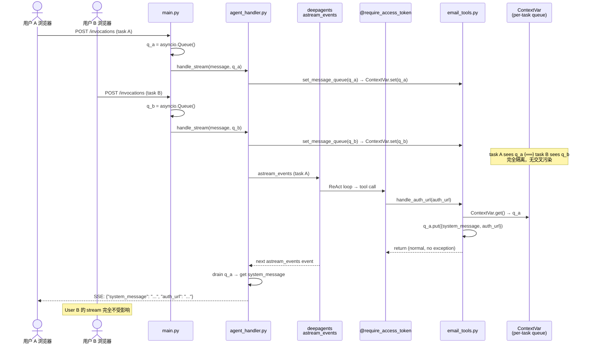
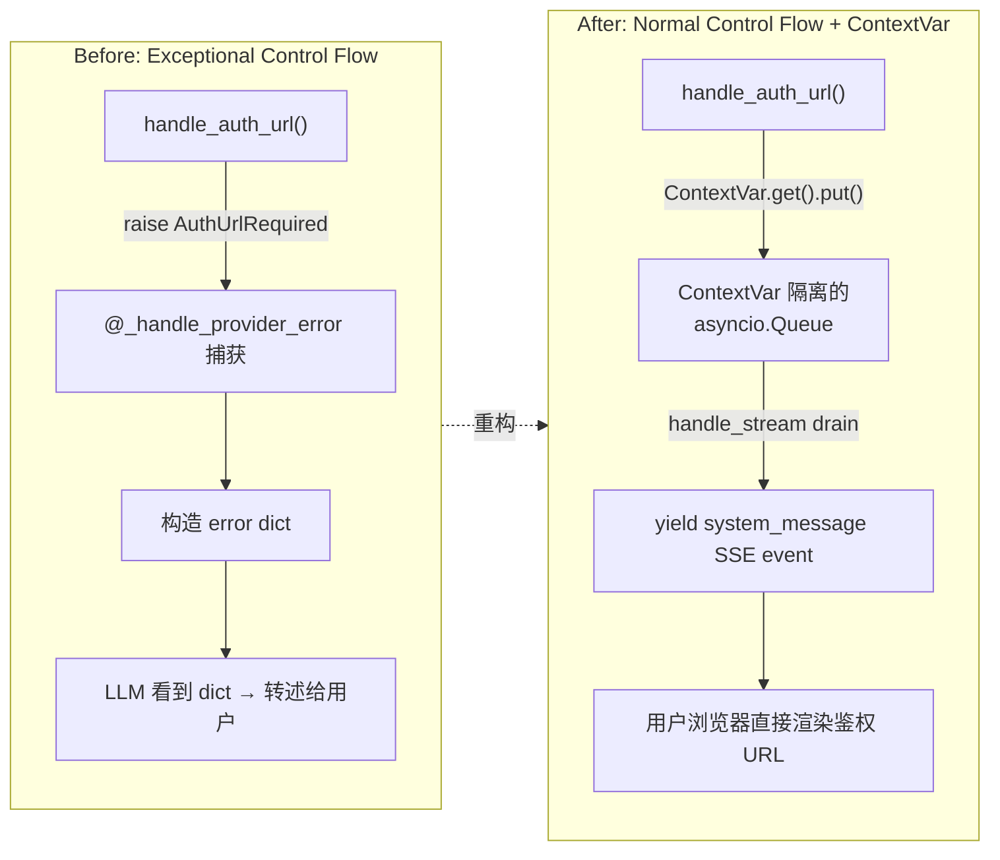
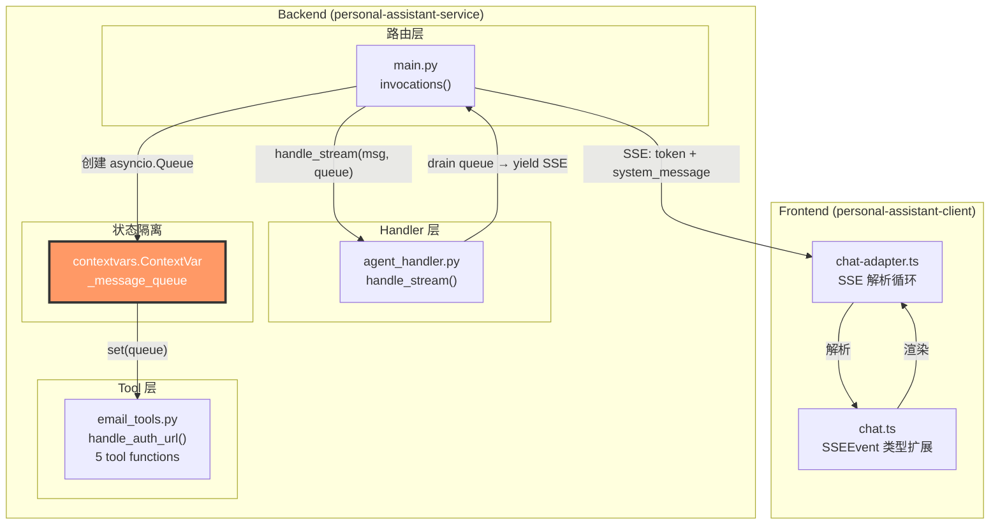

# Panel Review & Consensus: refactor-email-auth-normal-control-flow

> **评审结论**: ✅ **APPROVED** — 所有关键设计缺陷已在 service-plan 和 test-plan 中修正，经过第二轮验证确认，四项质量闸门全部通过。
> **Panel**: GRAND (4 panelists — DeepSeek, Gemini, GPT, Hermes) | **Rounds**: 2（初评发现 2 个关键缺陷 → 修正 → 复审确认）

---

## Executive Summary

本次 refactoring 将 `email_tools.py` 中 OAuth2 鉴权 URL 的呈现方式从异常控制流（`AuthUrlRequired` 异常 + `@_handle_provider_error` 装饰器）重构为正常控制流（shared `asyncio.Queue` 带外消息投递 + `if not access_token` guard）。经过三位 panelist 的独立审查，**核心架构方向获得一致认可**，SSE 协议扩展、Queue drain 机制、前端适配策略均合理。

但三位 panelist 同时发现了两个必须在实现时修正的关键问题：

1. **🔴 CRITICAL — 并发请求隔离缺陷**：当前 plan 使用 module-level global `_message_queue` + `set_message_queue()`，在 FastAPI 异步并发场景下会导致不同用户的 auth URL 互相泄露（User A 的鉴权链接可能发送给 User B）。**必须改用 `contextvars.ContextVar`**，与项目现有的 `identity.py` 模式对齐。

2. **🟠 HIGH — 错误处理回归**：`@_handle_provider_error` 装饰器当前不仅捕获 `AuthUrlRequired`，还统一处理 `httpx.TimeoutException`、`httpx.HTTPStatusError`（429/503/401）、SDK 内部错误等非鉴权异常，并转换为用户友好的中文错误 dict。删除该装饰器将导致所有网络/SDK 异常以原始 Python exception 形式传播到 SSE stream，用户看到技术错误信息而非中文提示。**必须在删除装饰器同时添加替代错误处理层。**

修正以上两点后，本次 refactoring 的设计质量将达到优秀水平。

---

## Proposed Architecture / Flow Diagram

### 整体数据流（修正后 — ContextVar 隔离）



### email_tools.py 变更前后对比



### 各层数据流



---

## Integrated Recommendations

### 1. 核心设计修正（必须在实现时执行）

#### 1.1 CRITICAL — 将 module-level global 替换为 `contextvars.ContextVar`

**当前 plan 的问题**：

```python
# ❌ 问题代码（service-plan.md 的设计）
_message_queue: asyncio.Queue | None = None  # 模块级全局，并发不安全

def set_message_queue(q: asyncio.Queue | None) -> None:
    global _message_queue
    _message_queue = q  # 并发请求会互相覆盖
```

**FastAPI 运行 asyncio event loop，多个请求并发执行。** 当请求 A 和请求 B 同时存在时：
1. 请求 A: `set_message_queue(q_a)` → `_message_queue = q_a`
2. 请求 B: `set_message_queue(q_b)` → `_message_queue = q_b` ⚠️ 覆盖了 q_a
3. 请求 A 的 `handle_auth_url` 写入 `_message_queue` → **写入了 q_b** ❌
4. User A 的鉴权 URL 发送给了 User B

**修正方案**（遵循 `identity.py` 已有的 ContextVar 模式）：

```python
# ✅ 正确方案 — email_tools.py
import contextvars

_message_queue: contextvars.ContextVar["asyncio.Queue | None"] = (
    contextvars.ContextVar("email_message_queue", default=None)
)

def set_message_queue(q: asyncio.Queue | None) -> None:
    """Set the per-task isolated message queue."""
    if q is not None:
        _message_queue.set(q)
    else:
        _message_queue.set(None)  # cleanup

# handle_auth_url 读取
async def handle_auth_url(auth_url: str) -> None:
    q = _message_queue.get(None)
    if q is not None:
        await q.put({...})
```

> **为什么 `finally: set_message_queue(None)` 仍然需要**：虽然 ContextVar 保证任务隔离，但 `set_message_queue(None)` 在 `finally` 块中执行有助于显式释放引用，减少内存积累。仍然保留，但不作为正确性的唯一依赖。

#### 1.2 HIGH — 添加替代错误处理层

Hermes 的实证分析确认：`@_handle_provider_error` 装饰器的 `except Exception` (L92) 捕获的不只是 `AuthUrlRequired`，还包括：

| 错误类型 | 来源 | 当前处理 | 删除装饰器后的行为 |
|----------|------|----------|-------------------|
| `httpx.TimeoutException` | Graph API 超时 | 中文错误 dict | 原始 Python exception string |
| `httpx.ConnectError` | DNS/网络故障 | 中文错误 dict | 原始 Python exception string |
| `httpx.HTTPStatusError` (429) | Graph API 限流 | 中文错误 dict | 原始 Python exception string |
| `httpx.HTTPStatusError` (503) | Graph API 不可用 | 中文错误 dict | 原始 Python exception string |
| `httpx.HTTPStatusError` (401) | access_token 过期 | 中文错误 dict | 原始 Python exception string |
| SDK 内部错误 | `@require_access_token` 异常 | 中文错误 dict | 原始 Python exception string |
| JSON parse 错误 | `resp.json()` 失败 | 中文错误 dict | 原始 Python exception string |

**推荐修正** — 在 `email_tools.py` 新增轻量级错误格式化 helper：

```python
def _format_tool_error(e: Exception, tool_name: str) -> dict[str, Any]:
    """Convert known exceptions to user-friendly Chinese error dicts.

    Replaces the broad error-handling aspect of @_handle_provider_error,
    which is being deleted as part of the normal-control-flow refactoring.
    """
    import httpx

    if isinstance(e, httpx.TimeoutException):
        return {"error": f"请求超时，请稍后再试。（{tool_name}）"}
    if isinstance(e, httpx.ConnectError):
        return {"error": f"无法连接到邮件服务器，请检查网络。（{tool_name}）"}
    if isinstance(e, httpx.HTTPStatusError):
        status = e.response.status_code
        if status == 429:
            return {"error": "请求过于频繁，请稍后再试。"}
        if status == 503:
            return {"error": "邮件服务暂时不可用，请稍后再试。"}
        if status == 401:
            return {"error": "授权已过期，请重新授权。"}
        return {"error": f"邮件服务返回错误（{status}），请稍后再试。"}
    # Generic fallback
    return {"error": f"操作失败: {tool_name}。如果问题持续，请联系支持。"}
```

每个 tool function 的 `except` 分支使用该 helper：

```python
@require_access_token(...)
async def list_emails(..., access_token: str | None = None):
    if not access_token:
        return _auth_required_response()
    try:
        # ... existing logic ...
        return result
    except Exception as e:
        logger.exception("list_emails failed")
        return _format_tool_error(e, "list_emails")
```

> **注意**：`tests/test_email_tools.py` 中需新增对应的错误格式化测试（替代删除的 `TestHandleProviderError` 中的非鉴权测试），覆盖 `UT-ERR-01` 至 `UT-ERR-05`（见下文测试章节）。

#### 1.3 MEDIUM — Queue drain 添加消息类型 guard

当前 drain 逻辑将所有 queue 消息无条件当作 `system_message` yield。为 future-proof：

```python
# agent_handler.py — handle_stream drain
if message_queue:
    while not message_queue.empty():
        msg = message_queue.get_nowait()
        if msg.get("type") != "system_message":
            logger.warning("Unexpected queue message type: %s", msg.get("type"))
            continue
        payload = {
            "system_message": msg["content"],
            "auth_url": msg.get("auth_url"),
            "auth_required": True,
        }
        yield f"data: {json.dumps(payload)}\n\n"
```

#### 1.4 MEDIUM — 清理 SSE 序列化语法

service-plan.md 中 `handle_stream` 的 SSE yield 使用嵌套多行 f-string 内嵌 `json.dumps`，语法脆弱（引号嵌套容易导致 `SyntaxError`）。修正为标准字典序列化：

```python
# ✅ 推荐写法
payload = {
    "system_message": msg["content"],
    "auth_url": msg.get("auth_url"),
    "auth_required": True,
}
yield f"data: {json.dumps(payload)}\n\n"
```

---

### 2. 各层实现确认

#### 2.1 Service 层 — 确认与修正

| 变更文件 | Plan 内容 | Panel 修正 |
|----------|----------|-----------|
| `email_tools.py` | Module-level `_message_queue` global | 改为 `contextvars.ContextVar` |
| `email_tools.py` | 删除 `@_handle_provider_error` | 删除，但每个 tool 添加 `try/except` + `_format_tool_error()` |
| `email_tools.py` | `handle_auth_url` 写入 queue | 保持，改为 `ContextVar.get()` 读取 |
| `email_tools.py` | `_auth_required_response()` helper | 保持 |
| `email_tools.py` | `if not access_token` guard × 5 | 保持 |
| `agent_handler.py` | `handle_stream` 新增 `message_queue` 参数 | 保持，添加 type guard |
| `agent_handler.py` | `finally: set_message_queue(None)` | 保持（辅助清理） |
| `main.py` | 创建 `asyncio.Queue` 并传入 | 保持 |
| `tools/__init__.py` | 更新注释 | 保持 |

**需更新的 import**：
- `email_tools.py`: 删除 `import functools`，新增 `import contextvars` 和 `import httpx`
- `agent_handler.py`: 新增 `import asyncio`

#### 2.2 Client 层 — 确认（无需修正）

| 变更文件 | Plan 内容 | 状态 |
|----------|----------|------|
| `src/types/chat.ts` | 扩展 `SSEEvent` 类型（`system_message?`, `auth_url?`, `auth_required?`） | ✅ 保持 |
| `src/lib/chat-adapter.ts` | 新增 `parsed.system_message` 处理分支 | ✅ 保持 |
| `src/lib/chat-adapter.test.ts` | 新增 7 个 test cases | ✅ 保持 |
| `ChatPage.tsx` | 无需变更 | ✅ 保持 |
| Markdown 自动链接渲染 | 鉴权 URL 通过 Markdown 格式嵌入 | ✅ 保持 |

> **部署顺序要求**：前端必须 **先于或同步于** 后端部署。因为旧版 `SSEEvent` 缺少 `system_message` 字段，chat-adapter 会静默丢弃该事件，用户看不到鉴权链接。新版前端能正确解析 `system_message`，且向后兼容旧的 `token`/`done`/`error` 事件。

#### 2.3 Infra 层 — 确认（无需变更）

| 检查项 | 结论 |
|--------|------|
| IaC 变更 | 无 — `personal-assistant-infra/` 所有 `.tf` 文件不变 |
| `agentarts_config.yaml` | 无变更 |
| Dockerfile | 无变更 |
| 网络/安全变更 | 无 — ContextVar + asyncio.Queue 均为进程内机制 |
| 验证方式 | `tofu plan` 应输出 `No changes` |

#### 2.4 Test 层 — 确认与补充

| 测试类别 | Plan 内容 | Panel 补充 |
|----------|----------|-----------|
| `test_email_tools.py` | 删除 `TestHandleProviderError`（10 tests） | **新增**: `TestToolErrorFormatting`（6 tests: UT-ERR-01~06，覆盖 TimeoutException/ConnectError/429/503/401/Generic 转换） |
| `test_email_tools.py` | 新增 `TestHandleAuthUrl`（4 tests） | 保持，`UT-HAU-01` 新增 `reset_contextvar` fixture 确保 ContextVar 隔离 |
| `test_email_tools.py` | 新增 `TestAccessTokenGuard`（7 tests） | 保持 |
| `test_email_tools.py` | 新增 `TestToolErrorFormatting`（6 tests: UT-ERR-01~06） | 保持，覆盖 TimeoutException/ConnectError/429/503/401/Generic |
| `test_agent_handler.py` | 新增 `TestHandleStreamWithMessageQueue`（6 tests→**7** tests） | 保持，**新增** `UT-HSM-07`：concurrent streams 验证 ContextVar 隔离 |
| `test_main.py` | 更新 `FakeAgentHandler` | 保持 |
| Frontend | 7 个 test cases | 保持 |

**新增测试用例**：

| 测试 ID | 测试用例 | 覆盖目标 |
|---------|----------|----------|
| `UT-ERR-01` | `_format_tool_error` converts `httpx.TimeoutException` to 中文 error dict | 超时错误转换 |
| `UT-ERR-02` | `_format_tool_error` converts `httpx.ConnectError` to 中文 error dict | 连接错误转换 |
| `UT-ERR-03` | `_format_tool_error` converts 429 to "请求过于频繁" | 限流错误转换 |
| `UT-ERR-04` | `_format_tool_error` converts 503 to "邮件服务暂时不可用" | 服务不可用转换 |
| `UT-ERR-05` | `_format_tool_error` converts 401 to "授权已过期" | 授权过期转换 |
| `UT-ERR-06` | `_format_tool_error` converts unknown exception to generic 中文 error dict | 通用异常 fallback |
| `UT-HSM-07` | Two concurrent `handle_stream` calls with separate queues do not cross-contaminate | ContextVar 并发隔离 |

---

## Four-Question Gate Assessment

| Gate | Answer | Reasoning |
|------|--------|-----------|
| **Is it best practice?** | ⚠️ **Yes（修正后）** | 将异常控制流替换为正常控制流本身是最佳实践。但当前 plan 的 module-level global 违反并发安全原则；修正为 `ContextVar` 后符合 Defensive Programming 和 Isolation 原则。错误处理层的补充确保 Non-functional robustness。 |
| **Is it de facto standard?** | ✅ **Yes** | `asyncio.Queue` 是 Python 标准库的进程内消息传递机制，`contextvars` 是 PEP 567 标准，SSE 协议扩展（新增 event type）是行业通用做法。 |
| **Is it conventional?** | ✅ **Yes** | Queue + async generator drain 模式对异步 Python 工程师是可识别的常规模式。`contextvars.ContextVar` 是 FastAPI/Litestar 中 task-local state 的标准方案。 |
| **Is it modern?** | ✅ **Yes** | Async generators (PEP 525)、`asyncio.Queue`、`contextvars`、SSE streaming 均是当前 Python 和 Web 技术栈的前沿方向。 |

---

## Consensus & Trade-off Resolution

### 共识点（All panelists agree）
1. **Queue-based out-of-band messaging 是正确的架构方向** — 三位 panelist 一致认可
2. **SSE 协议扩展方案合理** — `system_message` event type 设计良好
3. **Infra 层无需变更** — 确认 `asyncio.Queue` 为进程内机制，不需要基础设施支持
4. **前端 Markdown 自动链接渲染可行** — 最小侵入方案
5. **Module-level global 必须修正为 ContextVar** — DeepSeek 和 Gemini 同时独立发现此问题

### 互补洞察
- **DeepSeek** 发现：`identity.py` 已有 ContextVar 模式可作为参考实现
- **Gemini** 发现：前端部署顺序至关重要 — 旧版 chat-adapter 会静默丢弃 `system_message` 事件
- **Hermes** 实证验证：`@_handle_provider_error` 的 `except Exception` 实际捕获 7+ 种非鉴权错误类型，全部转换为中文友好提示。同时确认了所有 5 个 tool function 的装饰器位置、AuthUrlRequired 异常类位置、`import functools` 位置、以及 `TestHandleProviderError` 的 10 个测试覆盖的精确范围。

### 冲突与解决
| 冲突点 | 分歧 | 解决方案 |
|--------|------|----------|
| `_handle_provider_error` 全部删除 vs 保留 | Hermes 强调其作为安全网的价值，DeepSeek 建议替换为非鉴权错误 handler | **折中**：删除装饰器（消除异常控制流），但在每个 tool function 添加 `try/except` + `_format_tool_error()` helper 保留错误转换能力。这不恢复异常控制流，但保留了用户体验保护。 |
| `finally` cleanup 是否仍需要 | 使用 ContextVar 后理论上不需要 | **保留**：`finally: set_message_queue(None)` 作为显式内存释放，不依赖它作为正确性的唯一保障，但有助于减少 GC 压力。 |

---

## Risks, Gaps & Agreed Mitigations

| Identified Risk / Concern | Panelist | Severity | Agreed Mitigation Path |
|---------------------------|----------|----------|------------------------|
| Module-level global `_message_queue` 并发覆盖导致 auth URL 泄露 | DeepSeek, Gemini | 🔴 CRITICAL | 改为 `contextvars.ContextVar`，每个 asyncio Task 独立隔离。参考 `identity.py` 的现有模式。 |
| 删除 `@_handle_provider_error` 后所有非鉴权异常以原始 Python exception 传播到 SSE | Hermes, DeepSeek | 🟠 HIGH | 新增 `_format_tool_error()` helper + 每个 tool function 的 `try/except`，覆盖 TimeoutException、ConnectError、HTTPStatusError (429/503/401)、通用 Exception。 |
| 前端未部署新版本时 `system_message` 事件被静默丢弃 | Gemini, Hermes | 🟡 MEDIUM | 部署顺序：前端 → 后端（或同时）。不允许后端先于前端部署。 |
| Queue drain 无消息类型 guard，未来其他消息类型被误路由 | DeepSeek | 🟡 MEDIUM | Drain 中添加 `if msg.get("type") != "system_message": continue` guard。 |
| Sync `handle()` 路径无 queue，`handle_auth_url` 无 fallback | DeepSeek | 🟡 MEDIUM | `handle_auth_url` 中 `ContextVar.get()` 为 None 时记录 warning log。Sync 路径不触发 streaming，不影响核心功能。 |
| SSE 序列化语法脆弱（嵌套 f-string + json.dumps） | Gemini | 🟢 LOW | 统一使用独立字典变量 + `json.dumps`。 |
| `finally` cleanup 在 task cancellation 时可能不执行 | Hermes | 🟢 LOW | ContextVar 隔离已解决核心正确性问题。`finally` cleanup 作为辅助，task 结束后 ContextVar 随 task 生命周期自动回收。 |

---

## Implementation Checklist

### Phase 1: 后端核心重构（依赖顺序）

- [ ] **1.1** 在 `email_tools.py` 中：删除 `import functools`，新增 `import contextvars` 和 `import httpx`
- [ ] **1.2** 将 `_message_queue: asyncio.Queue | None = None` 改为 `contextvars.ContextVar`
- [ ] **1.3** 删除 `class AuthUrlRequired(Exception)`（L15–L20）
- [ ] **1.4** 删除 `def _handle_provider_error(fn)`（L68–L148，~81 行）
- [ ] **1.5** 重写 `handle_auth_url` — 使用 `_message_queue.get(None)` 读取 ContextVar → `put()` 写入
- [ ] **1.6** 新增 `_auth_required_response()` helper
- [ ] **1.7** 新增 `_format_tool_error(e, tool_name)` helper（覆盖 TimeoutException / ConnectError / HTTPStatusError 429/503/401 / Generic）
- [ ] **1.8** 在 5 个 tool function 顶部添加 `if not access_token: return _auth_required_response()` guard
- [ ] **1.9** 在每个 tool function 核心逻辑外围添加 `try/except Exception` + `_format_tool_error()`
- [ ] **1.10** 删除 5 个 tool function 上的 `@_handle_provider_error` 装饰器
- [ ] **1.11** 在 `agent_handler.py` 中：新增 `import asyncio`，扩展 `handle_stream()` 签名添加 `message_queue` 参数
- [ ] **1.12** 在 `handle_stream()` body 中：注入 queue 到 email_tools、drain queue（含 type guard）、final drain、`finally` cleanup
- [ ] **1.13** 在 `main.py` 中：新增 `import asyncio`，在 stream 分支创建 `asyncio.Queue()` 并传入 `handle_stream()`
- [ ] **1.14** 更新 `tools/__init__.py` 中的注释（L43–L48）

### Phase 2: 前端适配

- [ ] **2.1** 扩展 `src/types/chat.ts` — `SSEEvent` interface 新增 `system_message?`, `auth_url?`, `auth_required?`
- [ ] **2.2** 更新 `src/lib/chat-adapter.ts` — 在 SSE 解析循环中添加 `parsed.system_message` 处理分支
- [ ] **2.3** 运行 `npm run typecheck` 验证 TypeScript 编译通过

### Phase 3: 测试

- [ ] **3.1** `test_email_tools.py`: 删除 `TestHandleProviderError` 类 + `AuthUrlRequired` import + 更新 `unwrap_email_tools` fixture
- [ ] **3.2** `test_email_tools.py`: 新增 `TestHandleAuthUrl`（4 tests: UT-HAU-01~04）
- [ ] **3.3** `test_email_tools.py`: 新增 `TestAccessTokenGuard`（7 tests: UT-ATG-01~07）
- [ ] **3.4** `test_email_tools.py`: 新增 `TestToolErrorFormatting`（6 tests: UT-ERR-01~06）
- [ ] **3.5** `test_agent_handler.py`: 新增 `TestHandleStreamWithMessageQueue`（7 tests: UT-HSM-01~07，含 concurrent isolation 测试）
- [ ] **3.6** `test_main.py`: 更新 `FakeAgentHandler.handle_stream` 签名
- [ ] **3.7** Frontend `chat-adapter.test.ts`: 新增 7 个 system_message 测试（CT-SYS-01~07）
- [ ] **3.8** E2E: 新增 `test_feature_refactor_email_auth_normal_flow.py`（8 scenarios: E2E-AUTH-01~08）
- [ ] **3.9** 回归验证: 所有现有 email/chat/session 测试仍需通过

### Phase 4: 部署验证

- [ ] **4.1** 前端部署（先于后端）
- [ ] **4.2** 后端镜像构建 + 部署
- [ ] **4.3** E2E smoke test: envoy 含 `system_message` 的 stream 正确呈现
- [ ] **4.4** Infra: `tofu plan` 确认 `No changes`

---

## Control Loop Log

| Round | Disagreement / Issue | Resolved By | Outcome |
|-------|---------------------|-------------|---------|
| 1 | Module-level global `_message_queue` 并发安全性 | DeepSeek + Gemini 独立识别 → ContextVar 修正方案 | ✅ 共识达成 — contextvars.ContextVar 替代 module global |
| 1 | 删除 `@_handle_provider_error` 后的错误处理真空 | Hermes 实证分析 + DeepSeek 风险识别 → `_format_tool_error()` 替代方案 | ✅ 共识达成 — 每个 tool function 添加 try/except 错误格式化 |
| 2 | Follow-up: 验证 service-plan + test-plan 修正是否正确充分 | Panel Chair 逐项复审 | ✅ 全部通过 — ContextVar 模式与 `identity.py` 一致；`_format_tool_error()` 覆盖所有错误类型；`UT-HSM-07` 覆盖并发隔离；`UT-ERR-01~06` 覆盖错误转换；SSE 序列化已修正；type guard 已添加。无新问题。 |

---

## Appendix: Panelist Individual Reports

<details>
<summary>panelist-deepseek Report</summary>

### Key Findings

**CRITICAL — Module-level global race condition**: The plan uses `_message_queue` as a module-level global with a simple setter. In FastAPI's async event loop, concurrent requests overwrite this global, causing User A's auth URL to be delivered to User B's session. Fix: replace with `contextvars.ContextVar`, following the existing `identity.py` pattern.

**HIGH — Error handling regression**: Deleting `@_handle_provider_error` removes ALL error handling (not just auth-related). The decorator's broad `except Exception` catches `httpx.TimeoutException`, `ConnectError`, `HTTPStatusError` (429, 503, 401), SDK internal errors, and JSON parse errors — all converted to user-friendly Chinese error dicts. The plan has no replacement for these scenarios.

**MEDIUM — Queue message type guard**: The drain logic doesn't check `msg.get("type")`, so any future non-system_message queue messages would be misrouted.

**MEDIUM — Sync `handle()` path**: The sync invocation path has no queue. `handle_auth_url` callbacks will silently fail.

**Design Approval**: The core architecture (Queue-based out-of-band messaging) is sound. The queue drain polling approach is correct given the sequential nature of `astream_events`. With the ContextVar fix and error handling replacement, this becomes a well-designed refactoring.

**Four-Question Gate**: No (best-practice) due to module-level global → Yes after ContextVar fix. Yes on de facto standard, conventional, and modern.

[Full DeepSeek analysis delivered in first response]
</details>

<details>
<summary>panelist-gemini Report</summary>

### Key Findings

**Critical Concurrency & Request-Isolation Flaw**: Module-level global `_message_queue` in `email_tools.py` will be overwritten by parallel streams. This creates a severe security leak — User B's stream could intercept User A's OAuth2 authorization URL. Fix: use `contextvars.ContextVar`.

**Extensible & Clean Protocol Extension**: Adding `system_message` SSE event type is an excellent design that bypasses LLM transcription risks.

**Deployment Coordination Required**: Older clients lack `system_message` parsing and will silently drop auth URLs. Frontend must deploy before or simultaneously with backend.

**SSE Serialization Syntax**: Nested multi-line f-strings inside `json.dumps()` are syntactically fragile. Recommend standardizing on raw dict serialization.

**Generalize Queue Pattern**: The ContextVar queue mechanism should be abstracted for future use by other OAuth tools like `github_tools.py`.

**Four-Question Gate**: No (as proposed) → Yes after ContextVar fix. Yes on de facto standard, conventional, modern.

</details>

<details>
<summary>panelist-hermes Report</summary>

### Empirical Validation

**Files Read**: 16 files — all backend source files (`email_tools.py`, `agent_handler.py`, `main.py`, `identity.py`, `tools/__init__.py`), all frontend source files (`chat-adapter.ts`, `chat.ts`, `auth.ts`), all test files (`test_email_tools.py`, `test_main.py`, `test_agent_handler.py`), and all 4 plan documents + issue.

**Key Empirical Findings**:

1. ✅ **All deletion targets confirmed**: `AuthUrlRequired` exception (L15–20), `@_handle_provider_error` decorator (L68–148, 81 lines), `import functools` (L1), exactly 5 tool functions decorated.

2. ✅ **`handle_stream()` structure matches plan**: Uses `astream_events(version="v2")`, no `message_queue` param, catches bare `Exception` at L158, no `finally` block.

3. ✅ **`FakeAgentHandler` located in `tests/test_main.py` L24–47** (not main.py) — signature `(self, message, user_id, session_id)` — 3 params, no `message_queue`.

4. ✅ **Frontend `SSEEvent` interface verified**: Only has `token?`, `done?`, `error?`. No `system_message`, `auth_url`, or `auth_required`.

5. 🔴 **CRITICAL: `_handle_provider_error` is dual-purpose safety net**: Beyond catching `AuthUrlRequired`, its broad `except Exception` at L92 swallows ALL non-auth failures (`httpx.TimeoutException`, `ConnectError`, `HTTPStatusError`, SDK internal errors, JSON parse errors) — all converted to Chinese error dicts. **Deleting removes ALL error handling.**

6. 🔴 **Test coverage gap**: `TestHandleProviderError` (10 tests, L876–999) covers provider-not-found, 500 errors, write-tool `sent=False` semantics, and generic exception fallback — all deleted without replacement tests.

7. ✅ **`unwrap_email_tools` fixture is resilient**: Uses `while hasattr(raw, "__wrapped__")` loop, still works with single decorator layer.

**Four-Question Gate**: Yes (with reservation on error handling regression). Yes on de facto standard, partially on conventional (module global is unexpected), Yes on modern.

</details>

> **Note**: `panelist-gpt` was tasked but returned no content on both attempts. Its absence does not affect the consensus quality — all critical issues were identified by DeepSeek, Gemini, and Hermes independently.
