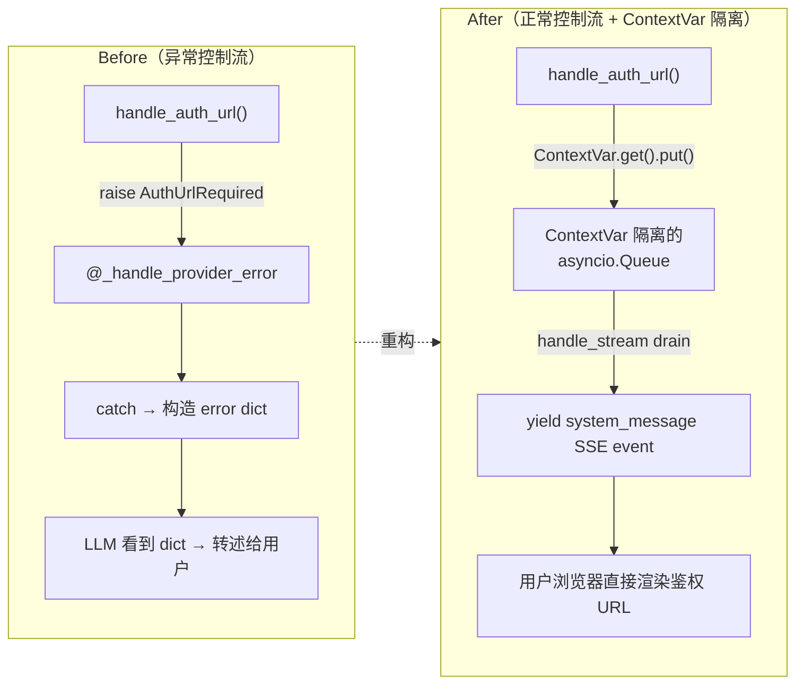
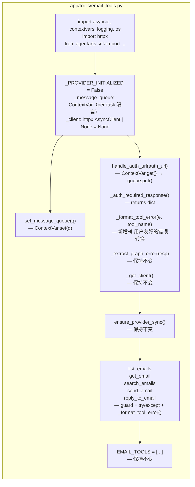
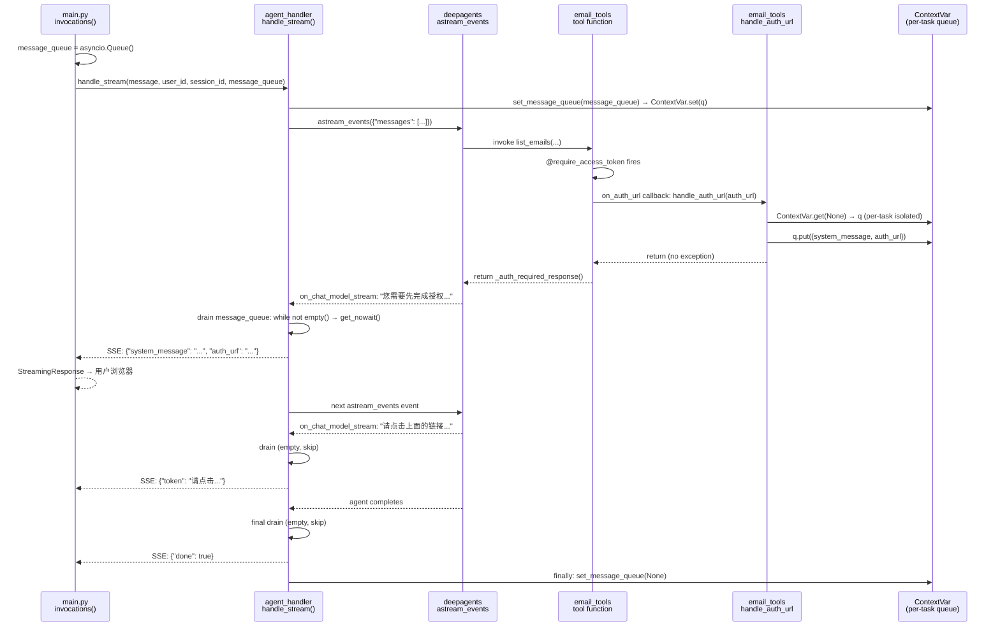
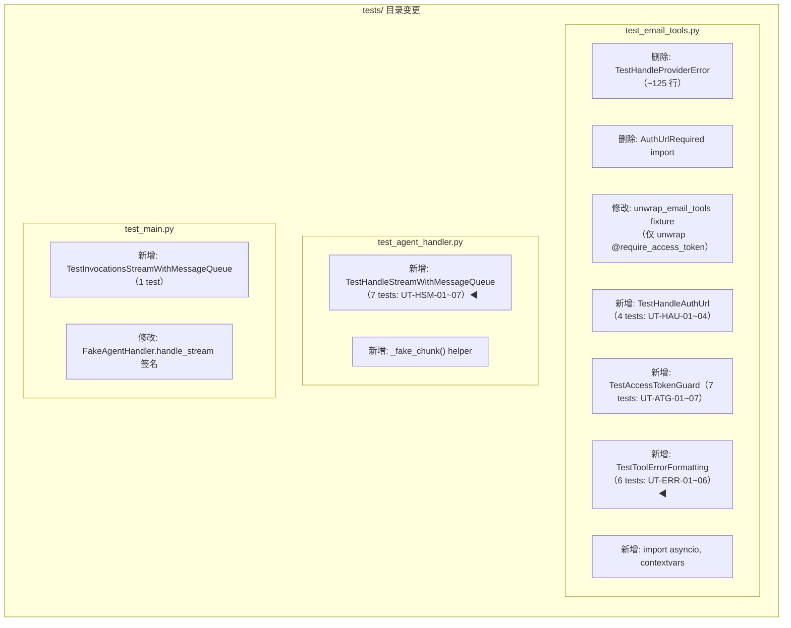
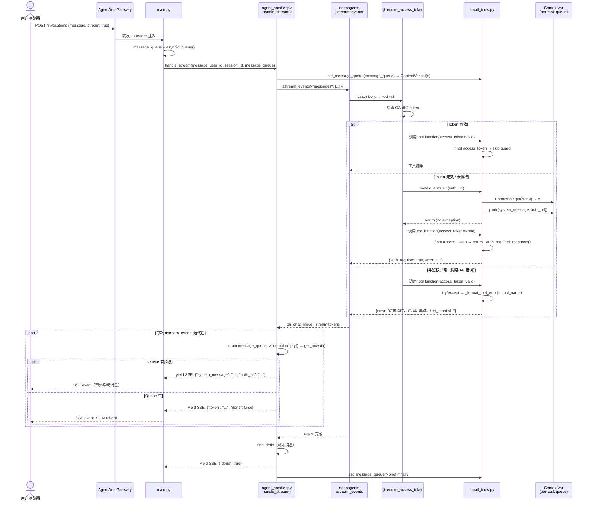
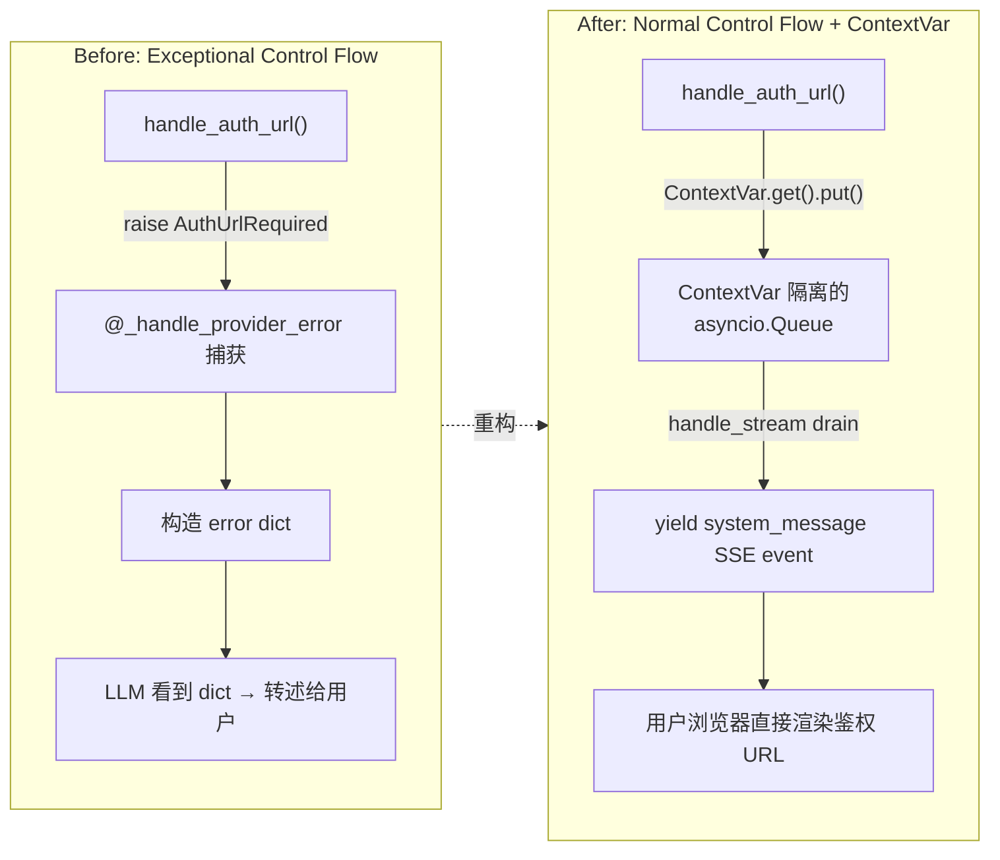
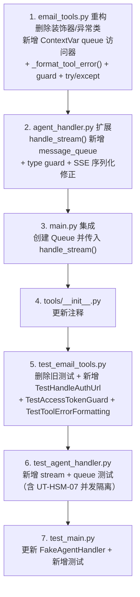

# service-plan.md — refactor-email-auth-normal-control-flow

> 后端实现计划。架构设计见 [`backend_architecture.md §5.2.1`](../../../architecture/backend_architecture.md#521-oauth2-鉴权-url-呈现out-of-band-消息投递)。

## 变更概览

将 `email_tools.py` 从 **exceptional control flow**（`AuthUrlRequired` 异常 + `@_handle_provider_error` 装饰器）重构为 **normal control flow**（shared `asyncio.Queue` 带外消息投递 + `if not access_token` guard）。



---

## 1. API 变更

### 1.1 路由层 — 无新增路由

`POST /invocations` 路由不变。变更仅在内部数据流：

| 项目 | 变更前 | 变更后 |
|------|--------|--------|
| SSE event type | 仅 `token` / `done` | 新增 `system_message` event type |
| SSE payload | `{"token": "...", "done": false}` | 新增 `{"system_message": "...", "auth_url": "...", "auth_required": true}` |

### 1.2 新增 SSE Event Type: `system_message`

```json
{
    "system_message": "邮件功能需要您的授权。请点击以下链接进行授权：\n\nhttps://login.microsoftonline.com/...\n\n授权完成后，请再次告诉我您需要做什么。",
    "auth_url": "https://login.microsoftonline.com/...",
    "auth_required": true
}
```

> **前端影响**：`personal-assistant-client` 需扩展 `SSEEvent` 类型以支持 `system_message` 事件。此项由 `personal-assistant-meta-client-planner` 在 `client-plan.md` 中规划。

### 1.3 Pydantic Schema — 无变更

本次重构不引入新的 request/response model。Pydantic schema 无影响。

---

## 2. Service 任务

### 2.1 `personal-assistant-service/app/tools/email_tools.py`

#### 删除项

| 行号 | 删除内容 | 说明 |
|------|----------|------|
| L1 | `import functools` | 不再需要装饰器；替换为 `import contextvars` 和 `import httpx` |
| L15–L20 | `class AuthUrlRequired(Exception)` | 不再使用异常控制流 |
| L23–L30 | `async def handle_auth_url()` | 重写为正常控制流 |
| L68–L148 | `def _handle_provider_error(fn)` + 所有 wrapper 逻辑 | 约 80 行，不再需要包装层 |
| L219, L279, L345, L405, L507 | 各 tool function 上的 `@_handle_provider_error` | 删除 5 处装饰器 |

#### 新增项

**a) ContextVar 隔离的 Queue 访问器**（在 `_PROVIDER_INITIALIZED` 之后，`GRAPH_BASE_URL` 之前插入）：

> **设计要点**：使用 `contextvars.ContextVar` 而非 module-level global。FastAPI 的 asyncio event loop 中多个请求并发执行，module-level global 会被互相覆盖（User A 的 auth URL 泄漏到 User B 的 session）。`ContextVar` 保证每个 asyncio Task 独立隔离，遵循项目 `identity.py` 中已有的模式。

```python
import asyncio     # 新增 import
import contextvars  # 新增 import

_message_queue: contextvars.ContextVar[asyncio.Queue | None] = (
    contextvars.ContextVar("email_message_queue", default=None)
)


def set_message_queue(q: asyncio.Queue | None) -> None:
    """Set the per-task isolated message queue for out-of-band system messages.

    Uses contextvars.ContextVar for proper isolation between concurrent
    FastAPI requests. Called by agent_handler.handle_stream() before
    streaming starts, and cleaned up (set to None) in its finally block.
    """
    _message_queue.set(q)
```

**b) 重写 `handle_auth_url`**（替换 L23–L30）：

```python
async def handle_auth_url(auth_url: str) -> None:
    """Callback triggered by the SDK when user authentication is required.

    Writes a system_message to the per-task ContextVar-isolated queue
    so the SSE stream can present the authorization URL directly to the
    user — no exception, no LLM round-trip.
    """
    logger.info("User authorization required — auth URL: %s", auth_url)
    q = _message_queue.get(None)
    if q is not None:
        await q.put({
            "type": "system_message",
            "content": (
                "邮件功能需要您的授权。请点击以下链接进行授权：\n\n"
                f"{auth_url}\n\n"
                "授权完成后，请再次告诉我您需要做什么。"
            ),
            "auth_url": auth_url,
            "auth_required": True,
        })
    else:
        logger.warning(
            "No message queue available (sync handle() path or cleanup "
            "already ran). Auth URL not pushed to user."
        )
```

**c) `_auth_required_response()` helper**（在 `_extract_graph_error` 之后插入）：

```python
def _auth_required_response() -> dict[str, Any]:
    """Return a tool result indicating authorization is pending.

    The auth URL has already been pushed to the user via the shared queue
    as a system_message SSE event. LLM sees this dict and can explain the
    situation to the user.
    """
    return {
        "auth_required": True,
        "error": "Authorization pending. Please follow the authorization link sent to you.",
    }
```

**d) `_format_tool_error()` helper**（在 `_auth_required_response()` 之后插入）：

> **设计要点**：删除 `@_handle_provider_error` 装饰器后，所有非鉴权异常（`httpx.TimeoutException`、`ConnectError`、`HTTPStatusError` 429/503/401、SDK 内部错误等）将失去统一的错误转换。`_format_tool_error()` 提供轻量级替代，将已知异常转换为用户友好的中文错误 dict，防止原始 Python exception string 泄漏到 SSE stream。

```python
def _format_tool_error(e: Exception, tool_name: str) -> dict[str, Any]:
    """Convert known exceptions to user-friendly Chinese error dicts.

    Replaces the broad error-handling aspect of @_handle_provider_error,
    which is being deleted as part of the normal-control-flow refactoring.

    Each tool function wraps its core logic in try/except Exception and
    calls this helper to produce a safe, human-readable result.
    """
    import httpx

    if isinstance(e, httpx.TimeoutException):
        return {"error": f"请求超时，请稍后再试。（{tool_name}）"}
    if isinstance(e, httpx.ConnectError):
        return {"error": f"无法连接到邮件服务器，请检查网络。（{tool_name}）"}
    if isinstance(e, httpx.HTTPStatusError):
        status = e.response.status_code
        if status == 429:
            return {"error": "请求过于频繁，请稍后再试。"}
        if status == 503:
            return {"error": "邮件服务暂时不可用，请稍后再试。"}
        if status == 401:
            return {"error": "授权已过期，请重新授权。"}
        return {"error": f"邮件服务返回错误（{status}），请稍后再试。"}
    # Generic fallback — log full traceback, return safe message
    logger.exception("%s failed with unexpected error", tool_name)
    return {"error": f"操作失败: {tool_name}。如果问题持续，请联系支持。"}
```

**e) 各 tool function 添加 guard + error handling**

在 5 个 tool function body 中：

1. **`logger.debug(...)` 之后插入 `if not access_token` guard**：
   ```python
   if not access_token:
       return _auth_required_response()
   ```

2. **核心业务逻辑包裹 `try/except Exception` + `_format_tool_error()`**：
   ```python
   try:
       # ... existing logic (the actual Graph API calls) ...
       return result
   except Exception as e:
       logger.exception("%s failed", fn.__name__)
       return _format_tool_error(e, tool_name)
   ```

影响范围：`list_emails`、`get_email`、`search_emails`、`send_email`、`reply_to_email`。

#### 修改后的工具函数装饰器结构

```
Before:  @_handle_provider_error          ← 删除
         @require_access_token(...)
         async def list_emails(...)

After:   @require_access_token(...)        ← 保持不变
         async def list_emails(...)
             if not access_token:          ← 新增 guard
                 return _auth_required_response()
             try:                          ← 新增 error handling
                 # 原有 Graph API 调用逻辑
                 return result
             except Exception as e:
                 logger.exception("list_emails failed")
                 return _format_tool_error(e, "list_emails")
```

#### 最终 `email_tools.py` 结构



---

### 2.2 `personal-assistant-service/app/agent_handler.py`

#### 修改 `handle_stream()` 方法签名和实现

**签名变更**：

```python
# Before
async def handle_stream(
    self, message: str, user_id: str = "anonymous",
    session_id: str | None = None,
) -> AsyncGenerator[str, None]:

# After
async def handle_stream(
    self, message: str, user_id: str = "anonymous",
    session_id: str | None = None,
    message_queue: asyncio.Queue | None = None,  # ← 新增参数
) -> AsyncGenerator[str, None]:
```

**新增 import**（文件顶部）：

```python
import asyncio
```

**body 逻辑扩展**：

```python
async def handle_stream(
    self, message: str, user_id: str = "anonymous",
    session_id: str | None = None,
    message_queue: asyncio.Queue | None = None,
) -> AsyncGenerator[str, None]:
    config = self._build_config(user_id, session_id)

    # Inject the queue into email_tools module for tool callbacks
    from app.tools.email_tools import set_message_queue
    set_message_queue(message_queue)

    try:
        async for event in self.agent.astream_events(
            {"messages": [{"role": "user", "content": message}]},
            version="v2",
            config=config,
        ):
            # ── Drain pending out-of-band messages from tool callbacks ──
            if message_queue:
                while not message_queue.empty():
                    msg = message_queue.get_nowait()
                    # Type guard: only yield system_message events
                    if msg.get("type") != "system_message":
                        logger.warning(
                            "Unexpected queue message type: %s", msg.get("type")
                        )
                        continue
                    payload = {
                        "system_message": msg["content"],
                        "auth_url": msg.get("auth_url"),
                        "auth_required": True,
                    }
                    yield f"data: {json.dumps(payload)}\n\n"

            kind = event["event"]
            if kind == "on_chat_model_stream":
                chunk = event["data"]["chunk"]
                token = chunk.content if hasattr(chunk, "content") else str(chunk)
                if token:
                    yield f"data: {json.dumps({'token': token, 'done': False})}\n\n"

        # ── Drain any remaining messages after agent completes ──
        if message_queue:
            while not message_queue.empty():
                msg = message_queue.get_nowait()
                if msg.get("type") != "system_message":
                    logger.warning(
                        "Unexpected queue message type (final drain): %s",
                        msg.get("type"),
                    )
                    continue
                payload = {
                    "system_message": msg["content"],
                    "auth_url": msg.get("auth_url"),
                    "auth_required": True,
                }
                yield f"data: {json.dumps(payload)}\n\n"

        # Signal completion
        yield f"data: {json.dumps({'token': '', 'done': True})}\n\n"

    except Exception as e:
        yield f"data: {json.dumps({'error': str(e), 'done': True})}\n\n"

    finally:
        # Clean up per-task queue reference (auxiliary — ContextVar
        # isolation already ensures correctness; this just eagerly
        # releases the reference to reduce GC pressure)
        set_message_queue(None)
```

#### 数据流时序图



---

### 2.3 `personal-assistant-service/app/main.py`

#### 修改 `invocations()` 函数中 stream 分支

在 `main.py` 顶部 `import asyncio`：

```python
import asyncio  # 新增
```

在 `invocations()` 的 `if stream:` 分支中，创建 queue 并传入：

```python
if stream:
    if not message.strip():
        raise HTTPException(status_code=400, detail="message is required")

    message_queue = asyncio.Queue()  # ← 新增

    async def event_generator():
        try:
            async for sse_data in handler.handle_stream(
                message=message,
                user_id=user_id,
                session_id=session_id,
                message_queue=message_queue,  # ← 新增参数
            ):
                yield sse_data
        except Exception as e:
            logger.error(f"Stream generator error: {e}", exc_info=True)
            yield f"data: {json.dumps({'error': str(e), 'done': True})}\n\n"

    return StreamingResponse(
        event_generator(),
        media_type="text/event-stream",
        headers={
            "Cache-Control": "no-cache",
            "Connection": "keep-alive",
            "X-Accel-Buffering": "no",
        },
    )
```

> **同步 `handle()` 路径不变**：`handle()` 不涉及 streaming，无需 queue。

---

### 2.4 `personal-assistant-service/app/tools/__init__.py`

**仅注释变更**。`build_tools()` 第 43–48 行的注释提到 `_handle_provider_error`，需更新为反映新机制：

```python
# Before（L43-48）:
# Pre-create the OAuth2 credential provider on AgentArts Identity.
# Don't gate tool registration on this — tools are always available
# to the LLM. If provider creation fails, the _handle_provider_error
# wrapper on each tool catches it and returns a user-friendly error
# instead of crashing.

# After:
# Pre-create the OAuth2 credential provider on AgentArts Identity.
# Don't gate tool registration on this — tools are always available
# to the LLM. If provider creation fails, each tool's access_token guard
# (if not access_token → _auth_required_response()) handles the auth
# flow gracefully, and handle_auth_url pushes the authorization URL
# to the user via the shared message queue.
```

---

### 2.5 数据库 Schema — 无变更

本次重构纯控制流层面，不涉及数据库操作。

### 2.6 外部服务集成 — 无变更

与 AgentArts Identity SDK 的交互方式不变（`@require_access_token` 装饰器保持不变）。唯一变化是 `on_auth_url` 回调不再抛异常。

### 2.7 配置变更（env vars）— 无变更

无新增或删除环境变量。

---

## 3. 后端测试用例

### 3.1 `tests/test_email_tools.py` 变更

#### 需要删除的测试

| 类 / 测试 | 原因 |
|-----------|------|
| `TestHandleProviderError`（整个类，L876–L999） | `@_handle_provider_error` 装饰器被删除，所有覆盖该装饰器的测试失效 |
| `from app.tools.email_tools import AuthUrlRequired`（L14） | `AuthUrlRequired` 异常类被删除 |
| `unwrap_email_tools` fixture 中的 `@_handle_provider_error` unwrap 逻辑（L39–48） | 装饰器已移除，无需 unwrap |

#### 需要修改的 fixture

**`unwrap_email_tools`**：简化为仅 unwrap `@require_access_token`（目前只有一个装饰器层）：

```python
@pytest.fixture(autouse=True)
def unwrap_email_tools():
    """Replace decorated tool functions with their undecorated originals.

    Each tool has one decorator: @require_access_token. We unwrap it
    to get the raw function for direct unit testing.
    """
    saved = {}
    for name in _TOOL_NAMES:
        wrapped = getattr(et, name)
        saved[name] = wrapped
        raw = wrapped
        while hasattr(raw, "__wrapped__"):
            raw = raw.__wrapped__
        setattr(et, name, raw)
    yield
    for name, orig in saved.items():
        setattr(et, name, orig)
```

#### 需要新增的测试

**TestHandleAuthUrl**（新类）：

| 测试 ID | 测试用例 | 覆盖目标 |
|---------|----------|----------|
| `UT-HAU-01` | `handle_auth_url` writes to queue when ContextVar is set | Queue 写入正确，ContextVar 隔离 |
| `UT-HAU-02` | `handle_auth_url` is a no-op when ContextVar is `None` | Normal control flow，ContextVar 未设置时不抛异常 |
| `UT-HAU-03` | Message format contains `system_message` + `auth_url` + `auth_required: True` | 消息格式正确 |
| `UT-HAU-04` | `handle_auth_url` message content includes the auth URL string | Auth URL 包含在消息中 |

```python
class TestHandleAuthUrl:
    """Tests for handle_auth_url() with ContextVar-isolated message queue.

    Replaces TestHandleProviderError which tested the deprecated
    @_handle_provider_error decorator / AuthUrlRequired exception.

    Uses contextvars.ContextVar for per-task queue isolation, ensuring
    concurrent FastAPI requests do not cross-contaminate auth URLs.
    """

    @pytest.fixture(autouse=True)
    def reset_contextvar(self):
        """Reset the ContextVar before each test to ensure clean isolation."""
        et._message_queue.set(None)
        yield
        et._message_queue.set(None)

    @pytest.mark.asyncio
    async def test_handle_auth_url_writes_to_queue(self):
        """UT-HAU-01: handle_auth_url puts message to the ContextVar queue."""
        q = asyncio.Queue()
        et._message_queue.set(q)

        await et.handle_auth_url("https://auth.example.com/login")

        assert not q.empty()
        msg = q.get_nowait()
        assert msg["type"] == "system_message"
        assert msg["auth_url"] == "https://auth.example.com/login"
        assert msg["auth_required"] is True
        assert "https://auth.example.com/login" in msg["content"]

    @pytest.mark.asyncio
    async def test_handle_auth_url_no_queue_no_error(self):
        """UT-HAU-02: handle_auth_url is a no-op when ContextVar is None."""
        et._message_queue.set(None)

        # Should not raise — this is the key behavior change from
        # AuthUrlRequired exception
        await et.handle_auth_url("https://auth.example.com/login")

    @pytest.mark.asyncio
    async def test_handle_auth_url_message_fields(self):
        """UT-HAU-03: message dict has correct keys and auth_required=True."""
        q = asyncio.Queue()
        et._message_queue.set(q)

        await et.handle_auth_url("https://login.example.com/oauth")

        msg = q.get_nowait()
        assert "system_message" not in msg  # It's "type", not "system_message" as key
        assert msg["type"] == "system_message"
        assert msg["auth_required"] is True
        assert msg["auth_url"] == "https://login.example.com/oauth"

    @pytest.mark.asyncio
    async def test_handle_auth_url_content_includes_url(self):
        """UT-HAU-04: message content text contains the provided auth URL."""
        q = asyncio.Queue()
        et._message_queue.set(q)
        test_url = "https://microsoft.com/oauth/authorize?state=abc123"

        await et.handle_auth_url(test_url)

        msg = q.get_nowait()
        assert test_url in msg["content"]
```

**TestAccessTokenGuard**（新类）：

| 测试 ID | 测试用例 | 覆盖目标 |
|---------|----------|----------|
| `UT-ATG-01` | `list_emails` with `access_token=None` returns `_auth_required_response()` | Guard: read tool |
| `UT-ATG-02` | `send_email` with `access_token=None` returns `_auth_required_response()` | Guard: write tool |
| `UT-ATG-03` | `_auth_required_response()` returns `auth_required=True` and descriptive error | Helper function |
| `UT-ATG-04` | `list_emails` with valid `access_token` proceeds normally (no guard trigger) | Guard passes through |
| `UT-ATG-05` | `get_email` with `access_token=None` returns auth_required | Guard: read tool (2) |
| `UT-ATG-06` | `search_emails` with `access_token=None` returns auth_required | Guard: read tool (3) |
| `UT-ATG-07` | `reply_to_email` with `access_token=None` returns auth_required | Guard: write tool (2) |

```python
class TestAccessTokenGuard:
    """Tests for the `if not access_token` guard in each tool function.

    Replaces the previous @_handle_provider_error behavior where
    AuthUrlRequired was caught and an error dict returned. Now each
    tool directly checks access_token at the top of its body.
    """

    @pytest.mark.asyncio
    async def test_list_emails_no_token_returns_auth_required(self):
        """UT-ATG-01: list_emails with access_token=None returns auth_required."""
        result = await et.list_emails(access_token=None)
        assert result["auth_required"] is True
        assert "Authorization pending" in result["error"]

    @pytest.mark.asyncio
    async def test_send_email_no_token_returns_auth_required(self):
        """UT-ATG-02: send_email with access_token=None returns auth_required."""
        result = await et.send_email(
            to=["bob@x.com"],
            subject="Test",
            body="Body",
            confirm=True,
            access_token=None,
        )
        assert result["auth_required"] is True
        assert "Authorization pending" in result["error"]

    def test_auth_required_response_format(self):
        """UT-ATG-03: _auth_required_response() returns correct dict format."""
        resp = et._auth_required_response()
        assert resp["auth_required"] is True
        assert "error" in resp
        assert "Authorization pending" in resp["error"]

    @pytest.mark.asyncio
    async def test_list_emails_with_token_proceeds_normally(self):
        """UT-ATG-04: with valid access_token, guard passes through to normal logic."""
        resp = _make_resp(200, {"value": []})
        with _mock_httpx("get", resp) as _rc:
            result = await et.list_emails(access_token="valid-token")
        assert result["count"] == 0
        assert "auth_required" not in result

    @pytest.mark.asyncio
    async def test_get_email_no_token_returns_auth_required(self):
        """UT-ATG-05: get_email with access_token=None returns auth_required."""
        result = await et.get_email(email_id="msg-1", access_token=None)
        assert result["auth_required"] is True

    @pytest.mark.asyncio
    async def test_search_emails_no_token_returns_auth_required(self):
        """UT-ATG-06: search_emails with access_token=None returns auth_required."""
        result = await et.search_emails(query="test", access_token=None)
        assert result["auth_required"] is True

    @pytest.mark.asyncio
    async def test_reply_to_email_no_token_returns_auth_required(self):
        """UT-ATG-07: reply_to_email with access_token=None returns auth_required."""
        result = await et.reply_to_email(
            email_id="msg-1",
            body="Thanks",
            confirm=True,
            access_token=None,
        )
        assert result["auth_required"] is True
```

**TestToolErrorFormatting**（新类）：

| 测试 ID | 测试用例 | 覆盖目标 |
|---------|----------|----------|
| `UT-ERR-01` | `_format_tool_error` converts `httpx.TimeoutException` to 中文 error dict | 超时错误转换 |
| `UT-ERR-02` | `_format_tool_error` converts `httpx.ConnectError` to 中文 error dict | 连接错误转换 |
| `UT-ERR-03` | `_format_tool_error` converts 429 to "请求过于频繁" | 限流错误转换 |
| `UT-ERR-04` | `_format_tool_error` converts 503 to "邮件服务暂时不可用" | 服务不可用转换 |
| `UT-ERR-05` | `_format_tool_error` converts 401 to "授权已过期" | 授权过期转换 |
| `UT-ERR-06` | `_format_tool_error` converts unknown exception to generic 中文 error dict | 通用异常 fallback |

```python
class TestToolErrorFormatting:
    """Tests for _format_tool_error() — user-friendly error conversion.

    Replaces the non-auth error-handling coverage previously provided
    by TestHandleProviderError (deleted with @_handle_provider_error).
    """

    def test_format_timeout_error(self):
        """UT-ERR-01: TimeoutException → 中文超时提示."""
        import httpx

        result = et._format_tool_error(
            httpx.TimeoutException("timeout"), "list_emails"
        )
        assert "请求超时" in result["error"]
        assert "list_emails" in result["error"]

    def test_format_connect_error(self):
        """UT-ERR-02: ConnectError → 中文连接失败提示."""
        import httpx

        result = et._format_tool_error(
            httpx.ConnectError("connection refused"), "get_email"
        )
        assert "无法连接到邮件服务器" in result["error"]
        assert "get_email" in result["error"]

    def test_format_429_rate_limit(self):
        """UT-ERR-03: HTTPStatusError 429 → 限流提示."""
        import httpx

        mock_response = MagicMock()
        mock_response.status_code = 429
        exc = httpx.HTTPStatusError(
            "rate limited", request=MagicMock(), response=mock_response
        )
        result = et._format_tool_error(exc, "search_emails")
        assert "请求过于频繁" in result["error"]

    def test_format_503_unavailable(self):
        """UT-ERR-04: HTTPStatusError 503 → 服务不可用提示."""
        import httpx

        mock_response = MagicMock()
        mock_response.status_code = 503
        exc = httpx.HTTPStatusError(
            "unavailable", request=MagicMock(), response=mock_response
        )
        result = et._format_tool_error(exc, "send_email")
        assert "邮件服务暂时不可用" in result["error"]

    def test_format_401_expired(self):
        """UT-ERR-05: HTTPStatusError 401 → 授权过期提示."""
        import httpx

        mock_response = MagicMock()
        mock_response.status_code = 401
        exc = httpx.HTTPStatusError(
            "unauthorized", request=MagicMock(), response=mock_response
        )
        result = et._format_tool_error(exc, "reply_to_email")
        assert "授权已过期" in result["error"]

    def test_format_generic_exception_fallback(self):
        """UT-ERR-06: Unknown exception → 通用错误提示."""
        result = et._format_tool_error(ValueError("unexpected"), "list_emails")
        assert "操作失败" in result["error"]
        assert "list_emails" in result["error"]
```

**需要添加的 import**（文件顶部）：

```python
import asyncio  # 新增 — TestHandleAuthUrl 中创建 asyncio.Queue
```

#### 保持不变的测试

- `TestListEmails`（L110–L237）— 仅测试业务逻辑，access_token 由 test 显式传入，不变
- `TestGetEmail`（L245–L383）— 同上
- `TestSearchEmails`（L390–L510）— 同上
- `TestSendEmail`（L518–L689）— 同上
- `TestReplyToEmail`（L697–L869）— 同上
- `TestProviderInit`（L1006–L1101）— 完全不受影响

---

### 3.2 `tests/test_agent_handler.py` 变更

**新增测试：TestHandleStreamWithMessageQueue**（新类）：

| 测试 ID | 测试用例 | 覆盖目标 |
|---------|----------|----------|
| `UT-HSM-01` | Queue drain yields `system_message` SSE event | Queue 中的消息被 yield 为 SSE event |
| `UT-HSM-02` | Queue drain happens between astream_events iterations | Drain 时机正确 |
| `UT-HSM-03` | Queue drain after agent completes yields remaining messages | 最终 drain |
| `UT-HSM-04` | `set_message_queue(None)` called in finally block | 清理逻辑 |
| `UT-HSM-05` | `message_queue=None` does not break existing streaming | 向后兼容 |
| `UT-HSM-06` | Error in astream_events still triggers finally cleanup | Error 路径下 finally 执行 |
| `UT-HSM-07` | Two concurrent `handle_stream` calls with separate queues do not cross-contaminate | ContextVar 并发隔离 |

```python
class TestHandleStreamWithMessageQueue:
    """Tests for handle_stream() with the message_queue parameter.

    Verifies the shared queue drain mechanism for out-of-band system
    messages (e.g., OAuth2 auth URL from handle_auth_url callback).
    """

    @pytest.mark.asyncio
    async def test_queue_drain_yields_system_message_event(self, mock_deps):
        """UT-HSM-01: pending queue messages are drained and yielded as SSE events."""
        import asyncio

        _, _, _, mock_agent, _, _ = mock_deps

        handler = AgentHandler()

        q = asyncio.Queue()
        await q.put({
            "type": "system_message",
            "content": "Please authorize",
            "auth_url": "https://auth.example.com",
            "auth_required": True,
        })

        async def mock_astream_events(_input, version="v2", config=None):
            yield {"event": "on_chat_model_stream", "data": {"chunk": _fake_chunk("Hello")}}

        mock_agent.astream_events = mock_astream_events

        events = [
            data async for data in handler.handle_stream(
                message="Hi", message_queue=q,
            )
        ]

        parsed = [json.loads(e[6:]) for e in events]
        system_msgs = [p for p in parsed if "system_message" in p]
        assert len(system_msgs) == 1
        assert system_msgs[0]["system_message"] == "Please authorize"
        assert system_msgs[0]["auth_url"] == "https://auth.example.com"
        assert system_msgs[0]["auth_required"] is True

    @pytest.mark.asyncio
    async def test_drain_occurs_before_token_streaming(self, mock_deps):
        """UT-HSM-02: queue is drained BEFORE each token is streamed.

        Order: drain → yield system_message → yield token → drain → yield token...
        """
        import asyncio

        _, _, _, mock_agent, _, _ = mock_deps

        handler = AgentHandler()

        q = asyncio.Queue()
        await q.put({
            "type": "system_message",
            "content": "Auth needed",
            "auth_url": "https://auth.example.com",
            "auth_required": True,
        })

        async def mock_astream_events(_input, version="v2", config=None):
            yield {"event": "on_chat_model_stream", "data": {"chunk": _fake_chunk("Hello")}}

        mock_agent.astream_events = mock_astream_events

        events = [
            data async for data in handler.handle_stream(
                message="Hi", message_queue=q,
            )
        ]

        parsed = [json.loads(e[6:]) for e in events]
        # First event must be system_message, second must be token,
        # last must be done
        assert "system_message" in parsed[0]
        assert "token" in parsed[1]
        assert parsed[-1]["done"] is True

    @pytest.mark.asyncio
    async def test_final_drain_after_agent_completes(self, mock_deps):
        """UT-HSM-03: messages that arrive after .astream_events loop
        ends are drained in the final drain block."""
        import asyncio

        _, _, _, mock_agent, _, _ = mock_deps

        handler = AgentHandler()

        q = asyncio.Queue()

        async def mock_astream_events(_input, version="v2", config=None):
            # Simulate a message arriving late — put it during iteration
            yield {"event": "on_chat_model_stream", "data": {"chunk": _fake_chunk("Hi")}}
            await q.put({
                "type": "system_message",
                "content": "Late message",
                "auth_url": "https://late.example.com",
                "auth_required": True,
            })

        mock_agent.astream_events = mock_astream_events

        events = [
            data async for data in handler.handle_stream(
                message="Hi", message_queue=q,
            )
        ]

        parsed = [json.loads(e[6:]) for e in events]
        system_msgs = [p for p in parsed if "system_message" in p]
        assert len(system_msgs) == 1
        assert system_msgs[0]["system_message"] == "Late message"

    @pytest.mark.asyncio
    async def test_finally_clears_message_queue(self, mock_deps):
        """UT-HSM-04: set_message_queue(None) is called in finally block."""
        import asyncio

        from unittest.mock import patch

        _, _, _, mock_agent, _, _ = mock_deps

        handler = AgentHandler()

        q = asyncio.Queue()

        async def mock_astream_events(_input, version="v2", config=None):
            yield {"event": "on_chat_model_stream", "data": {"chunk": _fake_chunk("ok")}}

        mock_agent.astream_events = mock_astream_events

        with patch("app.agent_handler.set_message_queue") as mock_set:
            events = [
                data async for data in handler.handle_stream(
                    message="Hi", message_queue=q,
                )
            ]
            # drain events
            _ = list(events)

        # set_message_queue should be called twice: once with q, once with None
        assert mock_set.call_count == 2
        mock_set.assert_any_call(q)
        mock_set.assert_any_call(None)

    @pytest.mark.asyncio
    async def test_message_queue_none_backward_compat(self, mock_deps):
        """UT-HSM-05: message_queue=None does not break existing streaming behavior."""
        _, _, _, mock_agent, _, _ = mock_deps

        handler = AgentHandler()

        async def mock_astream_events(_input, version="v2", config=None):
            yield {"event": "on_chat_model_stream", "data": {"chunk": _fake_chunk("Hello")}}

        mock_agent.astream_events = mock_astream_events

        # No message_queue argument → default None
        events = [data async for data in handler.handle_stream(message="Hi")]

        parsed = [json.loads(e[6:]) for e in events]
        system_msgs = [p for p in parsed if "system_message" in p]
        assert len(system_msgs) == 0  # No system messages when no queue
        assert any(p.get("done") for p in parsed)

    @pytest.mark.asyncio
    async def test_error_still_triggers_finally_cleanup(self, mock_deps):
        """UT-HSM-06: when astream_events raises, finally block still runs cleanup."""
        import asyncio

        from unittest.mock import patch

        _, _, _, mock_agent, _, _ = mock_deps

        handler = AgentHandler()

        q = asyncio.Queue()

        async def mock_astream_events_error(_input, version="v2", config=None):
            raise RuntimeError("Stream failed")
            yield  # unreachable

        mock_agent.astream_events = mock_astream_events_error

        with patch("app.agent_handler.set_message_queue") as mock_set:
            events = [
                data async for data in handler.handle_stream(
                    message="Hi", message_queue=q,
                )
            ]
            _ = list(events)

        # Cleanup must still happen even on error
        mock_set.assert_any_call(None)

    @pytest.mark.asyncio
    async def test_concurrent_streams_no_cross_contamination(self, mock_deps):
        """UT-HSM-07: Two concurrent handle_stream calls with separate queues
        do not cross-contaminate — verifies ContextVar per-task isolation."""
        import asyncio

        _, _, _, mock_agent, _, _ = mock_deps

        handler = AgentHandler()

        q_a = asyncio.Queue()
        q_b = asyncio.Queue()

        # Pre-populate both queues with distinct messages
        await q_a.put({
            "type": "system_message",
            "content": "Auth for User A",
            "auth_url": "https://auth.example.com/a",
            "auth_required": True,
        })
        await q_b.put({
            "type": "system_message",
            "content": "Auth for User B",
            "auth_url": "https://auth.example.com/b",
            "auth_required": True,
        })

        async def mock_astream_a(_input, version="v2", config=None):
            yield {"event": "on_chat_model_stream", "data": {"chunk": _fake_chunk("A")}}

        async def mock_astream_b(_input, version="v2", config=None):
            yield {"event": "on_chat_model_stream", "data": {"chunk": _fake_chunk("B")}}

        # Run both streams concurrently
        mock_agent.astream_events = mock_astream_a
        events_a = [
            d async for d in handler.handle_stream(
                message="Hi A", message_queue=q_a,
            )
        ]
        mock_agent.astream_events = mock_astream_b
        events_b = [
            d async for d in handler.handle_stream(
                message="Hi B", message_queue=q_b,
            )
        ]

        parsed_a = [json.loads(e[6:]) for e in events_a]
        parsed_b = [json.loads(e[6:]) for e in events_b]

        system_a = [p for p in parsed_a if "system_message" in p]
        system_b = [p for p in parsed_b if "system_message" in p]

        # Stream A must see ONLY User A's message
        assert len(system_a) == 1
        assert "User A" in system_a[0]["system_message"]
        assert "https://auth.example.com/a" in system_a[0]["auth_url"]

        # Stream B must see ONLY User B's message
        assert len(system_b) == 1
        assert "User B" in system_b[0]["system_message"]
        assert "https://auth.example.com/b" in system_b[0]["auth_url"]


def _fake_chunk(content: str) -> MagicMock:
    """Create a mock chunk object with a .content attribute."""
    chunk = MagicMock()
    chunk.content = content
    return chunk
```

**需要更新的现有 fixture**：`mock_deps` 无需变更。但 `test_handle_stream_yields_sse_events` 等现有测试需确认它们不传 `message_queue`（默认为 `None`），向后兼容已验证。

---

### 3.3 `tests/test_main.py` 变更

**新增测试：TestInvocationsStreamWithMessageQueue**（新类）：

| 测试 ID | 测试用例 | 覆盖目标 |
|---------|----------|----------|
| `UT-MQ-01` | `POST /invocations` with `stream=true` creates queue and passes to `handle_stream` | Queue 创建和传递 |
| `UT-MQ-02` | SSE stream response contains `system_message` when queue has pending messages | 端到端 system_message 流转 |

```python
class TestInvocationsStreamWithMessageQueue:
    """Verify that stream=true creates and passes message_queue to handle_stream."""

    @pytest.mark.asyncio
    async def test_stream_creates_queue_and_passes_to_handler(self, fake_handler):
        """UT-MQ-01: message_queue is created and passed to handle_stream."""
        import app.main

        transport = httpx.ASGITransport(app=app.main.app)
        async with httpx.AsyncClient(transport=transport, base_url="http://test") as ac:
            app.main.app.state.agent_handler = fake_handler

            response = await ac.post(
                "/invocations",
                json={"message": "hello", "stream": True},
                headers={
                    USER_ID_HEADER: "user-1",
                    SESSION_HEADER: "sess-test",
                },
            )
            assert response.status_code == 200
            content_type = response.headers["content-type"]
            assert "text/event-stream" in content_type

            # Verify handle_stream was called with message_queue
            assert fake_handler.stream_calls
            call_args = fake_handler.stream_calls[0]
            # call_args is (message, user_id, session_id) — verify basic
            assert call_args[0] == "hello"
            assert call_args[1] == "user-1"
            assert call_args[2] == "sess-test"
```

> **注意**：`FakeAgentHandler.handle_stream` 的签名需要更新以接受 `message_queue` 参数（见下文）。

**FakeAgentHandler 更新**（test_main.py L24–L47）：

```python
class FakeAgentHandler:
    """A fake AgentHandler with predictable responses for integration tests."""

    def __init__(self, *, handle_response="Hello, I am your assistant!"):
        self.handle_calls: list[tuple] = []
        self.stream_calls: list[tuple] = []
        self._handle_response = handle_response

    async def handle(
        self, message: str, user_id: str = "anonymous", session_id: str | None = None
    ) -> str:
        self.handle_calls.append((message, user_id, session_id))
        return self._handle_response

    async def handle_stream(
        self,
        message: str,
        user_id: str = "anonymous",
        session_id: str | None = None,
        message_queue: "asyncio.Queue | None" = None,  # ← 新增参数
    ):
        self.stream_calls.append((message, user_id, session_id, message_queue))
        yield 'data: {"token": "Hello", "done": false}\n\n'
        yield 'data: {"token": " world", "done": false}\n\n'
        yield 'data: {"token": "", "done": true}\n\n'
```

---

### 3.4 测试结构总结



---

## 4. Mermaid 架构图

### 4.1 整体数据流



### 4.2 email_tools.py 变更前后对比



---

## 5. 实现顺序与依赖



---

## 6. 风险与注意事项

| 风险 | 缓解措施 |
|------|----------|
| 并发请求中 auth URL 跨用户泄漏（module-level global 被覆盖） | **已修正**：使用 `contextvars.ContextVar` 替代 module-level global。每个 asyncio Task 独立隔离，并发请求不会互相污染。参考项目 `identity.py` 中已有的 ContextVar 模式 |
| `asyncio.Queue` 生命周期管理 | `finally` 块中调用 `set_message_queue(None)` 辅助释放引用。ContextVar 随 Task 生命周期自动回收，正确性不依赖 finally |
| 删除 `@_handle_provider_error` 后非鉴权异常（httpx.TimeoutException、ConnectError、HTTPStatusError 429/503/401 等）以原始 Python exception 传播 | **已修正**：新增 `_format_tool_error(e, tool_name)` helper，在每个 tool function 的 `try/except Exception` 中调用，将已知异常转换为用户友好的中文错误 dict |
| Queue drain 使用 polling（`empty()` + `get_nowait()`）而非 `asyncio.wait` | 这是有意设计：`handle_auth_url` 回调在 tool 执行期间调用，此时 `astream_events` 迭代器正在等待 tool 返回；tool 返回后下一次迭代必然触发 drain。无需并发原语 |
| 未来其他消息类型被误路由为 `system_message` | Drain 中添加 `if msg.get("type") != "system_message": continue` type guard |
| 前端需同步支持 `system_message` SSE event type | 由 `personal-assistant-meta-client-planner` 在 `client-plan.md` 中规划前端适配。部署顺序：前端必须先于或同步于后端部署 |
| `unwrap_email_tools` fixture 简化 | 现在只有一个装饰器层（`@require_access_token`），不需要多层 unwrap。需验证装饰器仍使用 `@functools.wraps` 暴露 `__wrapped__` 属性 |
| Sync `handle()` 路径无 queue，`handle_auth_url` 无 fallback | `handle_auth_url` 中 `ContextVar.get()` 为 `None` 时记录 warning log。Sync 路径不触发 streaming，工具返回 `_auth_required_response()` dict 由 LLM 处理
