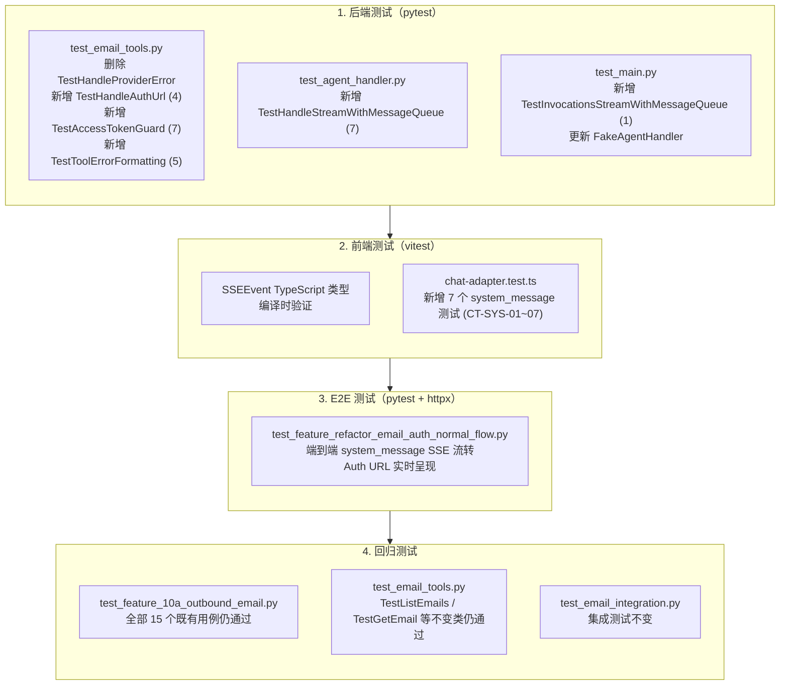
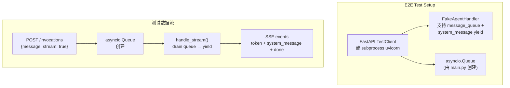
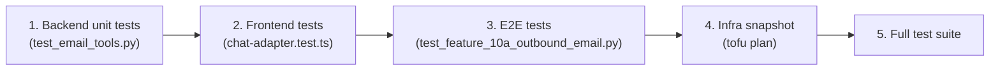
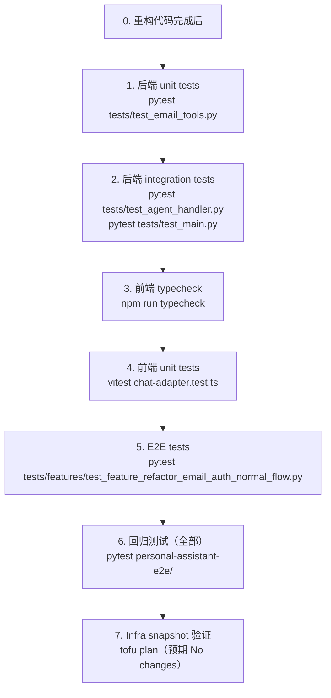

# test-plan.md — refactor-email-auth-normal-control-flow

> 关联 plans：`service-plan.md`、`client-plan.md`、`infra-plan.md`
> 目标：覆盖后端 unit/integration、前端 unit、E2E 联调、回归四个维度的测试场景

---

## 测试覆盖总览



---

## 1. 后端测试用例

> **测试框架**: pytest + pytest-asyncio
> **测试文件位置**: `personal-assistant-service/tests/`

### 1.1 `test_email_tools.py` 变更

#### 1.1.1 需要删除的测试

| # | 类 / 测试 | 原因 |
|---|-----------|------|
| D1 | `TestHandleProviderError`（整个类，L876–L999） | `@_handle_provider_error` 装饰器被删除 |
| D2 | `from app.tools.email_tools import AuthUrlRequired`（L14） | `AuthUrlRequired` 异常类被删除 |
| D3 | `unwrap_email_tools` fixture 中 `@_handle_provider_error` unwrap 逻辑（L39–L48） | 装饰器已移除，仅剩一层 `@require_access_token` |

#### 1.1.2 新增：`TestHandleAuthUrl`（4 个测试）

| 测试 ID | 测试用例 | 覆盖目标 | 断言要点 |
|---------|----------|----------|----------|
| `UT-HAU-01` | `handle_auth_url` writes to queue when `_message_queue` is set | Queue 写入正确 | `q.empty()` → `False`；`msg["type"] == "system_message"`；`msg["auth_url"]` 匹配输入；`msg["auth_required"] is True` |
| `UT-HAU-02` | `handle_auth_url` does NOT raise exception when queue is `None` | Normal control flow，无异常 | 调用不抛异常；函数正常返回 |
| `UT-HAU-03` | Message format contains `type`, `auth_url`, `auth_required: True` | 消息格式正确 | `msg` dict 包含 `type`/`content`/`auth_url`/`auth_required` 四个 key；`msg["auth_required"] is True` |
| `UT-HAU-04` | Message content text includes the auth URL string | Auth URL 包含在消息中 | `msg["content"]` 字符串包含传入的 `auth_url` |

**前置条件**：
- 需要 `import contextvars`（新增，替代原 `import functools`）
- 需要 `import asyncio`（新增，用于创建 `asyncio.Queue` 测试实例）
- 使用 `et._message_queue.set(q)`（ContextVar）注入 queue → 调用 `et.handle_auth_url(url)` → 检查 `q.get_nowait()`
- `UT-HAU-02` 中应先将 ContextVar 重置为 `None`，确保覆盖率中"queue 未设置"的路径

#### 1.1.3 新增：`TestAccessTokenGuard`（7 个测试）

| 测试 ID | 测试用例 | 覆盖目标 | 断言要点 |
|---------|----------|----------|----------|
| `UT-ATG-01` | `list_emails` with `access_token=None` returns auth_required | Guard: read tool (1) | `result["auth_required"] is True`；`"Authorization pending" in result["error"]` |
| `UT-ATG-02` | `send_email` with `access_token=None` returns auth_required | Guard: write tool (1) | `result["auth_required"] is True`；`"Authorization pending" in result["error"]` |
| `UT-ATG-03` | `_auth_required_response()` returns correct dict format | Helper function | `resp["auth_required"] is True`；`resp["error"]` 包含 `"Authorization pending"` |
| `UT-ATG-04` | `list_emails` with valid `access_token` proceeds normally | Guard 不错误拦截有效 token | `result["count"] >= 0`；`"auth_required" not in result` |
| `UT-ATG-05` | `get_email` with `access_token=None` returns auth_required | Guard: read tool (2) | `result["auth_required"] is True` |
| `UT-ATG-06` | `search_emails` with `access_token=None` returns auth_required | Guard: read tool (3) | `result["auth_required"] is True` |
| `UT-ATG-07` | `reply_to_email` with `access_token=None` returns auth_required | Guard: write tool (2) | `result["auth_required"] is True` |

**边界条件**：
- `UT-ATG-04` 需使用 mocked httpx 返回有效 Graph API response（如 `tools/helpers.py` 中的 `_make_resp` / `_mock_httpx`），确保 guard 不触发时正常业务逻辑执行

#### 1.1.4 新增：`TestToolErrorFormatting`（5 个测试）

> **背景**：`@_handle_provider_error` 装饰器被删除后，其 `except Exception` 分支原负责将 `httpx.TimeoutException`、`httpx.ConnectError`、`httpx.HTTPStatusError`（429/503/401）等非鉴权异常转换为用户友好的中文 error dict。新增 `_format_tool_error(e, tool_name)` helper 替代这一职责，每个 tool function 的 `try/except` 分支调用该 helper。以下测试验证错误转换的正确性。

| 测试 ID | 测试用例 | 覆盖目标 | 断言要点 |
|---------|----------|----------|----------|
| `UT-ERR-01` | `_format_tool_error` converts `httpx.TimeoutException` to 中文 error dict | 超时错误转换 | `result["error"]` 包含 `"请求超时"`；tool name 出现在消息中 |
| `UT-ERR-02` | `_format_tool_error` converts `httpx.ConnectError` to 中文 error dict | 连接错误转换 | `result["error"]` 包含 `"无法连接到邮件服务器"` |
| `UT-ERR-03` | `_format_tool_error` converts HTTP 429 to "请求过于频繁" | 限流错误转换 | 构造 `httpx.HTTPStatusError`（status=429）→ `result["error"]` 为 `"请求过于频繁，请稍后再试。"` |
| `UT-ERR-04` | `_format_tool_error` converts HTTP 503 to "邮件服务暂时不可用" | 服务不可用转换 | 构造 `httpx.HTTPStatusError`（status=503）→ `result["error"]` 为 `"邮件服务暂时不可用，请稍后再试。"` |
| `UT-ERR-05` | `_format_tool_error` converts HTTP 401 to "授权已过期" | 授权过期转换 | 构造 `httpx.HTTPStatusError`（status=401）→ `result["error"]` 为 `"授权已过期，请重新授权。"` |

**实现注意事项**：

- **`httpx.TimeoutException`**：`import httpx` 后直接用 `httpx.TimeoutException("timeout")` 构造
- **`httpx.ConnectError`**：`httpx.ConnectError("connection failed")` 构造
- **`httpx.HTTPStatusError`**：需要构造 mock response object：
  ```python
  import httpx
  mock_resp = MagicMock()
  mock_resp.status_code = 429  # 或 503 / 401
  exc = httpx.HTTPStatusError("message", request=MagicMock(), response=mock_resp)
  result = et._format_tool_error(exc, "list_emails")
  ```
- **额外边界测试（可选）**：验证未识别的 HTTP status（如 500）返回通用 fallback 消息；验证通用 `Exception`（非 httpx 类型）返回包含 tool name 的通用错误消息

#### 1.1.5 需修改的 fixture

**`unwrap_email_tools`**：简化为仅 unwrap 一层 `@require_access_token`：

```
Before: 双层 unwrap（@require_access_token + @_handle_provider_error）
After:  仅 unwrap @require_access_token（while hasattr(raw, "__wrapped__") 循环仍然健壮）
```

#### 1.1.6 保持不变的测试类

以下测试类应**完全不受影响**，重构后全部通过：

| 测试类 | 覆盖 |
|--------|------|
| `TestListEmails` | list_emails 业务逻辑 |
| `TestGetEmail` | get_email 业务逻辑 |
| `TestSearchEmails` | search_emails 业务逻辑 |
| `TestSendEmail` | send_email 业务逻辑 |
| `TestReplyToEmail` | reply_to_email 业务逻辑 |
| `TestProviderInit` | ensure_provider_sync 生命周期 |
| `TestToolErrorFormatting` | **新增** — _format_tool_error() 错误转换（替代被删除的 TestHandleProviderError 中的非鉴权测试） |

---

### 1.2 `test_agent_handler.py` 变更

#### 1.2.1 新增：`TestHandleStreamWithMessageQueue`（7 个测试）

| 测试 ID | 测试用例 | 覆盖目标 | 断言要点 |
|---------|----------|----------|----------|
| `UT-HSM-01` | Queue drain yields `system_message` SSE event | Queue 消息正确 yield | 收集到的 SSE events 中含 `"system_message"` key 的事件；内容匹配 |
| `UT-HSM-02` | Drain occurs BEFORE token streaming（ordering） | Drain 时机正确 | 事件顺序: `system_message` → `token` → ... → `done` |
| `UT-HSM-03` | Messages arriving during/after agent iteration are drained in final block | 最终 drain | 在 `mock_astream_events` 迭代期间 `put` 的消息在 `done` 之前被 yield |
| `UT-HSM-04` | `set_message_queue(None)` called in `finally` block | 清理逻辑 | `set_message_queue` 被调用 2 次（首次传 q，finally 传 None） |
| `UT-HSM-05` | `message_queue=None`（默认值）不破坏现有 streaming | 向后兼容 | `system_message` events 数量为 0；`token` 和 `done` 正常 |
| `UT-HSM-06` | When `astream_events` raises，finally block still runs cleanup | 异常路径清理 | `set_message_queue(None)` 仍被调用 |
| `UT-HSM-07` | Two concurrent `handle_stream()` calls with separate `ContextVar` queues do not cross-contaminate | 并发请求隔离 | User A 的 stream 不含 User B 的 auth_url；User B 的 stream 不含 User A 的 auth_url；各自仅看到自己的 system_message |

**测试实现注意事项**：

- **UT-HSM-01**：预填充 queue → mock `astream_events` 返回 token chunk → 收集 events → 解析 JSON 找 `system_message` key
- **UT-HSM-02**：验证第一个事件不含 `token`，含 `system_message`；第二个事件含 `token`
- **UT-HSM-03**：mock `astream_events` 在 yield 之间 `await q.put(...)` → 验证 "Late message" 出现在 events 中
- **UT-HSM-04**：使用 `unittest.mock.patch("app.agent_handler.set_message_queue")` 验证调用次数和参数
- **UT-HSM-05**：不传 `message_queue` 参数 → 确认无 `system_message` 事件
- **UT-HSM-06**：mock `astream_events` 抛 `RuntimeError` → 仍然验证 `set_message_queue(None)` 被调用
- **UT-HSM-07**：关键测试 — 验证 `contextvars.ContextVar` 的并发隔离。使用 `asyncio.gather()` 并发启动两个 `handle_stream()` 调用（使用不同的 queue），验证每个 stream 的 events 中仅包含各自队列的消息，不存在交叉污染。实现方式：
  ```python
  # User A 的 queue 预填充 {"type": "system_message", "content": "Auth for A", "auth_url": "https://a.example.com", "auth_required": True}
  # User B 的 queue 预填充 {"type": "system_message", "content": "Auth for B", "auth_url": "https://b.example.com", "auth_required": True}
  # asyncio.gather(collect_events(handler, q_a), collect_events(handler, q_b))
  # → stream A 不含 "https://b.example.com"，stream B 不含 "https://a.example.com"
  ```

**Helper**：需要 `_fake_chunk(content: str) -> MagicMock` — 创建含 `.content` 属性的 mock chunk 对象。

---

### 1.3 `test_main.py` 变更

#### 1.3.1 更新 `FakeAgentHandler`

`handle_stream()` 签名新增 `message_queue: asyncio.Queue | None = None` 参数：

```python
async def handle_stream(
    self, message, user_id="anonymous", session_id=None,
    message_queue=None,  # ← 新增
):
    self.stream_calls.append((message, user_id, session_id, message_queue))
    yield 'data: {"token": "Hello", "done": false}\n\n'
    yield 'data: {"token": "", "done": true}\n\n'
```

#### 1.3.2 新增：`TestInvocationsStreamWithMessageQueue`（1 个测试）

| 测试 ID | 测试用例 | 覆盖目标 | 断言要点 |
|---------|----------|----------|----------|
| `UT-MQ-01` | `POST /invocations` with `stream=true` creates queue and passes to `handle_stream` | Queue 创建和传递 | `response.status_code == 200`；`Content-Type` 含 `text/event-stream`；`fake_handler.stream_calls[0]` 包含 `message_queue` 参数 |

---

### 1.4 后端测试执行命令

```bash
# 运行 email_tools 测试
pytest personal-assistant-service/tests/test_email_tools.py -v

# 运行 agent_handler 测试
pytest personal-assistant-service/tests/test_agent_handler.py -v

# 运行 main.py 集成测试
pytest personal-assistant-service/tests/test_main.py -v

# 全部后端测试
pytest personal-assistant-service/tests/ -v
```

---

## 2. 前端测试用例

> **测试框架**: vitest
> **测试文件位置**: `personal-assistant-client/src/`

### 2.1 TypeScript 类型验证（编译时）

| 验证 ID | 验证项目 | 验证方式 |
|---------|----------|----------|
| `TYP-01` | `SSEEvent` interface 包含 `system_message?: string` | `npm run typecheck` 通过 |
| `TYP-02` | `SSEEvent` interface 包含 `auth_url?: string` | `npm run typecheck` 通过 |
| `TYP-03` | `SSEEvent` interface 包含 `auth_required?: boolean` | `npm run typecheck` 通过 |
| `TYP-04` | 现有 `chat-adapter.ts` 中 `parsed: SSEEvent` 类型标注不因新增 optional 字段报错 | `npm run typecheck` 通过 |
| `TYP-05` | `parsed.system_message` 访问无类型错误 | `npm run typecheck` 通过 |

### 2.2 `chat-adapter.test.ts` 新增测试（7 个）

> 参考现有 `SSE token parsing` describe block 的 mock stream + `collectResults` 模式。

#### 2.2.1 `CT-SYS-01`：system_message without auth_url renders as text

```
Given: SSE stream yields data: {"system_message": "系统通知：服务将在 10 分钟后维护", "auth_required": false}
When:  chatAdapter.run() 消费 SSE stream
Then:  最终 fullText 包含 "系统通知：服务将在 10 分钟后维护"
And:   消息被作为 assistant 消息的一部分渲染（即 content[0].text 包含该字符串）
```

**Mock chunks**：
```ts
[
  encoder.encode("data: " + JSON.stringify({ system_message: "系统通知：服务将在 10 分钟后维护", auth_required: false }) + "\n"),
  encoder.encode("data: " + JSON.stringify({ done: true }) + "\n"),
]
```

#### 2.2.2 `CT-SYS-02`：system_message with auth_url renders auth link

```
Given: SSE stream yields data: {"system_message": "邮件功能需要您的授权", "auth_url": "https://login.microsoftonline.com/..."", "auth_required": true}
When:  chatAdapter.run() 消费 SSE stream
Then:  最终 fullText 包含 "邮件功能需要您的授权"
And:   fullText 包含 auth_url
```

#### 2.2.3 `CT-SYS-03`：system_message interleaved with tokens

```
Given: SSE stream 按顺序 yield：
        1. system_message: "请授权"
        2. token: "点击"
        3. token: "上方链接"
        4. done: true
When:  chatAdapter.run() 消费 SSE stream
Then:  最终 fullText = "请授权点击上方链接"
And:   最终 status = { type: "complete", reason: "stop" }
```

**Mock chunks**：
```ts
[
  encoder.encode("data: " + JSON.stringify({ system_message: "请授权" }) + "\n"),
  encoder.encode("data: " + JSON.stringify({ token: "点击" }) + "\n"),
  encoder.encode("data: " + JSON.stringify({ token: "上方链接" }) + "\n"),
  encoder.encode("data: " + JSON.stringify({ done: true }) + "\n"),
]
```

#### 2.2.4 `CT-SYS-04`：system_message before first token — stream continues normally

```
Given: SSE stream 先 yield system_message，再 yield token events，最后 done
When:  chatAdapter.run() 消费 SSE stream
Then:  所有 system_message 和 token 都被正确累加（fullText 包含两者）
And:   不因 system_message 出现而提前认为 stream 结束
And:   done: true 仍被正确识别
```

#### 2.2.5 `CT-SYS-05`：system_message after done event — stream already closed

```
Given: SSE stream yield done: true，之后继续 yield system_message（异常场景）
When:  chatAdapter.run() 消费 SSE stream
Then:  done 之后不再有新的 yield（done: true 后 break 退出循环）
And:   不 crash
```

**验证方式**：mock stream 中 done 在前、system_message 在后；验证最终 fullText 不含 system_message 内容。

#### 2.2.6 `CT-SYS-06`：empty system_message string skipped gracefully

```
Given: SSE stream yields data: {"system_message": ""}
When:  chatAdapter.run() 消费 SSE stream
Then:  fullText 不累加空字符串（或累加后 total 不含多余空格）
And:   不额外 yield 空 content
```

#### 2.2.7 `CT-SYS-07`：auth_required without auth_url still renders system_message

```
Given: SSE stream yields data: {"system_message": "需要授权", "auth_required": true}（无 auth_url）
When:  chatAdapter.run() 消费 SSE stream
Then:  fullText 包含 "需要授权"
And:   chatAdapter 不 crash（auth_url 可选处理）
```

### 2.3 前端测试执行命令

```bash
# TypeScript 类型检查
npm run typecheck --prefix personal-assistant-client

# 运行 chat-adapter 测试
npx vitest run personal-assistant-client/src/lib/chat-adapter.test.ts

# 全部前端测试
npm run test --prefix personal-assistant-client
```

---

## 3. E2E 测试场景

> **测试框架**: pytest + httpx
> **测试文件**: `personal-assistant-e2e/tests/features/test_feature_refactor_email_auth_normal_flow.py`
> **Marker**: `@pytest.mark.feature`

### 3.1 测试架构



### 3.2 E2E 场景列表

#### 场景 1：完整的 OAuth2 Auth URL 呈现流程

| 测试 ID | 场景名称 | 描述 |
|---------|----------|------|
| `E2E-AUTH-01` | Stream 响应包含 `system_message` event | 模拟 `handle_auth_url` 在 tool 执行期间写入 queue → SSE stream 中 yield `system_message` event → client 端可解析 |
| `E2E-AUTH-02` | `system_message` + token 交错但顺序正确 | 验证 system_message 在 token 之前 yield（drain 在每次 astream_events 迭代开始时执行） |
| `E2E-AUTH-03` | `system_message` 字段完整（含 `auth_url`、`auth_required`） | 验证 SSE JSON 中包含所有三个字段且值正确 |
| `E2E-AUTH-04` | `done: true` 正常结束 | 验证 stream 正确结束，含最终 done event |

#### 场景 2：向后兼容验证

| 测试 ID | 场景名称 | 描述 |
|---------|----------|------|
| `E2E-AUTH-05` | 无 auth 需要的正常对话不受影响 | 不触发 `handle_auth_url` 时，SSE 仅有 token + done，无 system_message |
| `E2E-AUTH-06` | non-streaming 路径不受影响 | `POST /invocations` with `stream: false` 正常返回 JSON response |

#### 场景 3：并发与清理

| 测试 ID | 场景名称 | 描述 |
|---------|----------|------|
| `E2E-AUTH-07` | 请求结束后 queue 引用被清理 | 验证 `finally` 清理后，下一个请求使用全新的 queue（不遗留上一条消息） |
| `E2E-AUTH-08` | 异常发生时 queue 仍被清理 | 模拟 `astream_events` 异常 → 验证 error event 被 yield，且 `set_message_queue(None)` 仍被调用 |

### 3.3 E2E 测试实现指南

#### 3.3.1 Fixture 设计

```python
@pytest.fixture
def auth_flow_test_client():
    """Create a TestClient with a FakeAgentHandler that simulates the
    message_queue → system_message flow.

    The FakeAgentHandler.handle_stream() implementation mirrors the real
    handle_stream() logic: it drains from message_queue before each token
    yield, and does a final drain before done.
    """
```

**FakeAuthFlowHandler** 需要实现两个关键行为：

1. **模拟 `handle_auth_url` 写入**：在 `handle_stream` 调用开始时，向 `message_queue` 写入一条 system_message
2. **queue drain 逻辑**：在每次 yield token 之前 drain queue，在 done 之前 final drain

#### 3.3.2 `E2E-AUTH-01` 具体验证

```
POST /invocations { message: "帮我看看收件箱", stream: true }

期望行为：
1. HTTP 200，Content-Type: text/event-stream
2. SSE events 中至少包含一条含有 "system_message" key 的 JSON
3. 该 system_message event 包含 "auth_url" 和 "auth_required": true
4. 最终 event 为 done: true
```

**断言步骤**：
1. 解析所有 SSE data lines
2. 收集所有含 `system_message` 的事件
3. 验证 `len(system_msgs) >= 1`
4. 验证首个 system_message 的 `auth_url` 非空、`auth_required is True`
5. 验证最后一个 event 的 `done is True`

#### 3.3.3 `E2E-AUTH-07` 具体验证

```
场景：连续两个请求，第一个触发 auth，第二个不触发

Round 1: POST /invocations { message: "查邮件", stream: true }
  → SSE 应包含 system_message（auth URL）
Round 2: POST /invocations { message: "你好", stream: true }（同一 TestClient）
  → SSE 不应包含 system_message（queue 已被清理）

断言：
- Round 1 的 events 中包含 system_message
- Round 2 的 events 中不含 system_message
```

### 3.4 E2E 执行命令

```bash
# 运行 refactor email auth E2E 测试
pytest personal-assistant-e2e/tests/features/test_feature_refactor_email_auth_normal_flow.py -v

# 标记为 feature 的测试
pytest personal-assistant-e2e/ -m feature -v
```

---

## 4. 回归测试用例

> **目标**：验证现有 email 功能不被重构破坏。

### 4.1 必须通过的现有测试

#### 4.1.1 后端单元测试

| 测试文件 | 测试类 | 覆盖范围 |
|----------|--------|----------|
| `test_email_tools.py` | `TestListEmails` | list_emails 完整业务逻辑 |
| `test_email_tools.py` | `TestGetEmail` | get_email 完整业务逻辑 |
| `test_email_tools.py` | `TestSearchEmails` | search_emails 完整业务逻辑 |
| `test_email_tools.py` | `TestSendEmail` | send_email 完整业务逻辑 |
| `test_email_tools.py` | `TestReplyToEmail` | reply_to_email 完整业务逻辑 |
| `test_email_tools.py` | `TestProviderInit` | ensure_provider_sync 生命周期 |
| `test_email_tools.py` | `TestToolErrorFormatting` | **新增** — `_format_tool_error()` 错误格式化（替代被删除的 `TestHandleProviderError`） |
| `test_main.py` | 所有现有类 | invocations 路由、header 解析 |

#### 4.1.2 E2E 测试

| 测试文件 | 场景 | 验证点 |
|----------|------|--------|
| `test_feature_10a_outbound_email.py` | Scenario 1–5 全部 15 个测试 | 所有 email E2E 用例仍然通过 |
| `test_feature_1_1_web_chat.py` | Web Chat 基础对话 | SSE streaming 基础功能未破坏 |
| `test_feature_session_checkpoint.py` | Session checkpoint | session 管理未受影响 |

#### 4.1.3 前端测试

| 测试文件 | 覆盖范围 |
|----------|----------|
| `chat-adapter.test.ts` | 所有现有 SSE token parsing / error handling / auth header / session ID 测试 |
| 其他 `*.test.ts` | 组件渲染测试 |

### 4.2 回归检查清单

| # | 检查项 | 方法 | 预期结果 |
|---|--------|------|----------|
| R1 | email tools 业务逻辑不变 | `pytest tests/test_email_tools.py -v` | 所有保持类全部通过 |
| R2 | email E2E 端到端不变 | `pytest tests/features/test_feature_10a_outbound_email.py -v` | 15 个测试全部通过 |
| R3 | Web Chat 基础 SSE 不变 | `pytest tests/features/test_feature_1_1_web_chat.py -v` | 全部通过 |
| R4 | 前端 SSE token 解析不变 | `npx vitest run src/lib/chat-adapter.test.ts` | 全部通过 |
| R5 | TypeScript 编译无回归 | `npm run typecheck --prefix personal-assistant-client` | 零错误 |
| R6 | IaC 快照不变 | `cd personal-assistant-infra && tofu plan` | `No changes` |
| R7 | AgentArts 配置不变 | `git diff personal-assistant-service/.agentarts_config.yaml` | 无差异 |

### 4.3 回归执行顺序



---

## 5. 测试执行顺序与依赖



---

## 6. 测试环境要求

| 组件 | 要求 |
|------|------|
| Backend | Python 3.11+，`uv sync` 安装依赖，`MAAS_API_KEY` 环境变量（仅 real service 测试需要） |
| Frontend | Node.js 20+，`npm install`，无需浏览器（vitest + jsdom） |
| E2E | pytest + httpx + FastAPI TestClient（mock 模式）；`DEEPSEEK_API_KEY` 或 `MAAS_API_KEY`（仅 `@pytest.mark.slow` real service 测试） |
| Infra | OpenTofu CLI（仅验证 `tofu plan` 零变更） |

---

## 7. 风险与测试缓解

| 风险 | 测试覆盖 |
|------|----------|
| `contextvars.ContextVar` 并发请求隔离（auth URL 跨用户泄露） | `UT-HSM-07`（并发隔离：User A 的 auth URL 不出现在 User B 的 stream 中） |
| `asyncio.Queue` 生命周期管理（跨请求泄露） | `UT-HSM-04`（finally 清理）、`E2E-AUTH-07`（请求间隔离） |
| `system_message` 在 token stream 中的位置错误 | `UT-HSM-02`（顺序）、`E2E-AUTH-02`（交错顺序） |
| 删除 `@_handle_provider_error` 后非鉴权异常以原始 Python exception 传播 | `UT-ERR-01`~`UT-ERR-05`（`_format_tool_error()` 覆盖 TimeoutException / ConnectError / 429 / 503 / 401 转换） |
| 前端异常 JSON 导致 crash | `CT-SYS-07`（auth_url 缺失）、`CT-SYS-06`（空字符串） |
| 删除 `@_handle_provider_error` 后未处理的异常传播路径 | `UT-HSM-06`（异常路径 finally 清理） |
| 现有 email 功能被破坏 | 所有回归测试（§4） |
| 前端部署顺序错误导致 system_message 被静默丢弃 | 回归 R4（前端 SSE token 解析不变） + R5（TypeScript 编译无回归） |
| IaC 意外变更 | `tofu plan` 零变更验证 |
