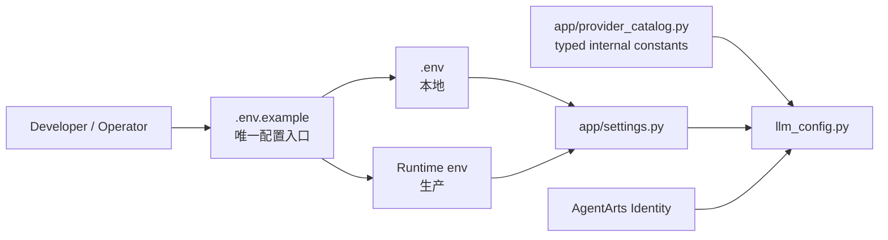

# Refactor 10 Implementation Plan

## 结论

本次采用 breaking migration，不提供 legacy alias、fallback 或 deprecation window。



不创建 YAML/TOML internal catalog。Provider metadata 数量很小，由
`app/provider_catalog.py` 的 frozen Pydantic model/typed constant 表达，避免形成
第二个“看起来可编辑”的配置文件。

## GitNexus Risk

| Symbol | Risk | Impact |
|--------|------|--------|
| `get_model()` | HIGH | 19 symbols；同步对话、SSE、Playground |
| `_resolve_provider()` | HIGH | 24 symbols；上述流程 + FastAPI lifespan |
| `AgentHandler._init_checkpointer()` | LOW | `AgentHandler.__init__` |
| `logging_config.configure()` | LOW | `main.py` import flow |
| `get_gitee_provider_name()` | LOW | Gitee tools + transitive imports |
| `lifespan()` | LOW | startup tests |

执行顺序采用 interface-first：

1. 新增 Settings 和 typed Provider catalog
2. 新增聚焦测试
3. 切换 LLM/Identity/Logging/Persistence consumers
4. 删除旧配置与 CORS
5. 更新 E2E 和 current architecture
6. 全量验证与 `gitnexus detect-changes`

## Canonical Runtime Settings

`app/settings.py` 是 application defaults 的唯一 source of truth。
`.env.example` 负责 discoverability：已有默认值的变量以注释形式展示，用户只在
需要 override 时取消注释，避免 sample file 与代码形成两份生效中的默认配置。

| Variable | Type | Default | Purpose |
|----------|------|---------|---------|
| `LOG_LEVEL` | enum | `INFO` | Application log level |
| `LLM_PROVIDER` | str | `deepseek` | Internal Provider catalog key |
| `LLM_MODEL` | str | `deepseek-v4-pro` | Model deployment/name |
| `LLM_BASE_URL` | URL or empty | empty | Optional custom compatible endpoint |
| `LLM_CREDENTIAL_PROVIDER` | str | `DEEPSEEK_API_KEY` | AgentArts Identity provider name, not a Secret value |
| `LLM_TIMEOUT_SECONDS` | positive float | `60` | Model request timeout |
| `POSTGRES_DSN` | str or empty | empty | Production Checkpointer |
| `SQLITE_DB_PATH` | path or empty | empty | Local Checkpointer |
| `GITHUB_PROVIDER_NAME` | str | `github-provider` | GitHub OAuth provider reference |
| `GITEE_PROVIDER_NAME` | str | `gitee-provider` | Gitee OAuth provider reference |
| `M365_PROVIDER_NAME` | str | `m365-provider-common` | Microsoft OAuth provider reference |
| `IAM_USERS_PROVIDER_NAME` | str | `iam-users-readonly` | IAM STS provider reference |
| `IAM_USERS_AGENCY_SESSION_NAME` | str | `personal-assistant-iam-users-readonly` | STS session name |
| `IAM_USERS_REGION` | str | `cn-southwest-2` | IAM region |
| `IAM_USERS_ENDPOINT` | URL or empty | derived from region | IAM endpoint |

Constraints:

- `POSTGRES_DSN` and `SQLITE_DB_PATH` are mutually exclusive.
- `LLM_PROVIDER` must exist in the internal catalog.
- `LLM_BASE_URL` overrides catalog endpoint only through this canonical name.
- Settings are frozen after startup.
- Runtime environment overrides `.env`; `.env` overrides defaults.
- Secret values are never Settings fields.

## Deletions

- `personal-assistant-service/config.yaml`
- direct `python-dotenv` dependency and `load_dotenv()`
- `MODEL_API_KEY`, `MODEL_NAME`, `MODEL_URL`
- `MAAS_API_KEY` / `DEEPSEEK_API_KEY` as credential value env contracts
- `CORS_ALLOWED_ORIGINS`, `CORSMiddleware`, default Origin list
- YAML parsing from `llm_config.py` and `identity.py`
- config backup/mutation E2E helpers
- tests asserting legacy fallback or CORS behavior

## Service Changes

### `app/settings.py`

- `Settings(BaseSettings)` with deterministic root `.env`
- frozen model, `extra="ignore"`, case-insensitive environment names
- validators for blank strings, URLs, log levels and Checkpointer conflict
- cached `get_settings()`

### `app/provider_catalog.py`

- frozen `ProviderMetadata`
- typed `PROVIDER_CATALOG`
- initial `deepseek` OpenAI-compatible endpoint and capabilities
- resolver that returns a clear available-provider error

### `app/llm_config.py`

- remove YAML and `os.environ`
- resolve Settings + Provider catalog
- fetch credential through `@require_api_key`
- pass canonical model parameters to `init_chat_model`
- startup validation does not fetch Secret

### Identity/tools

- provider references come from Settings
- SDK decorators are configured once at module import from immutable Settings
- credential/token values continue to come only from AgentArts Identity

### Startup/Logging/Persistence

- instantiate Settings before logging/app setup
- remove CORS middleware
- pass Settings into logging and Checkpointer
- conflicting persistence settings fail during Settings validation

## Test Changes

- add `tests/test_settings.py`
- rewrite `tests/test_llm_config.py` around Settings/catalog/Identity boundary
- rewrite Identity tests around Settings
- update Checkpointer tests to pass Settings explicitly
- replace startup “missing config.yaml” test with invalid Settings/catalog tests
- delete CORS-only tests
- add Refactor 10 E2E static/configuration checks
- retire Feature 1.3 fallback E2E scenarios and old Netlify CORS scenarios

## Documentation Changes

Update current facts in:

- Service README
- `architecture/backend_architecture.md`
- `architecture/overall_architecture.md`
- `architecture/session-state-management.md`
- `architecture/devops/local-development.md`
- `architecture/cloud-service/agentarts.md`
- ADR-011 amendment

Historical resolved issues remain historical; current documentation must contain no active guidance
for removed variables.

## Verification

```bash
cd personal-assistant-service
uv lock
uv run ruff check .
uv run ruff format --check .
uv run pytest tests/

cd ../personal-assistant-e2e
uv run pytest <refactor-10 focused tests>

cd ..
npx gitnexus detect-changes -r /Users/malu/Projects/github/personal-assistant
```

Static cleanup gates:

```bash
rg "MODEL_API_KEY|MODEL_NAME|MODEL_URL|CORS_ALLOWED_ORIGINS|CORSMiddleware" \
  personal-assistant-service personal-assistant-e2e
rg "config.yaml" personal-assistant-service personal-assistant-e2e
```

Expected result: no active code/test/deployment references.

## Four-Question Gate

| Gate | Result | Reason |
|------|:------:|--------|
| Best practice | Yes | Single Entry Point, typed immutable config, fail-fast validation, Secret separation |
| Industry standard | Yes | dotenv for local, env contract for deployment, Pydantic Settings, Identity-managed Secret |
| Conventional | Yes | `cp .env.example .env`; canonical uppercase environment variables |
| Modern | Yes | Pydantic v2, no compatibility debt, no mutable global env loading |
