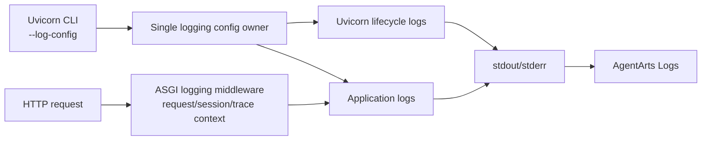

# Refactor 12: 统一 Service Structured Logging

## 动机

Service 当前由两套独立 logging 配置共同工作：

- Uvicorn 使用内置 formatter，输出 `INFO: ...`
- `app.logging_config.configure()` 在导入 `app.main` 时再次调用
  `dictConfig`，业务日志输出带时间的自定义文本

这造成启动、请求和业务日志格式不一致，也缺少稳定的 request/session/trace
关联字段，不利于 AgentArts Logs 检索与线上排障。

## 目标

- 保留标准 `uvicorn app.main:app` 启动方式
- Uvicorn 与 application logger 从进程首条日志开始使用统一配置
- 本地使用可读 console formatter，生产使用单行 JSON
- 每个 HTTP request 记录 request ID、session ID、route、status 和 duration
- 可用时关联 OpenTelemetry trace ID 与 span ID
- 不记录 token、Authorization header、用户输入和 LLM 原始响应

## 范围

- 新增 `config/logging.dev.yaml` 与 `config/logging.prod.yaml`
- 将 `app/logging_config.py` 改为 formatter、filter 和 ASGI middleware
- 删除 `app.main` import-time `dictConfig` 与 Uvicorn `PingFilter`
- 关闭 Uvicorn access logger，由 middleware 生成统一 HTTP completion event
- 更新 Dockerfile、本地运行文档和 architecture baseline
- 添加 logging config、JSON schema 和 HTTP correlation tests

## 非目标

- 不引入独立 log shipping agent
- 不直接配置 OTLP Logs exporter
- 不记录 user ID、credential、prompt 或 response content
- 不改变业务 API contract

## 验收标准

- [x] Uvicorn 启动日志和 application 日志使用统一 console 格式
- [x] Production 配置输出合法的单行 JSON
- [x] `/invocations` 日志包含 request/session correlation fields
- [x] `/ping` 不产生 access completion noise
- [x] `LOG_LEVEL` 继续控制所有 handler 的最低级别
- [x] Docker 使用 production log config
- [x] Changed Python files Ruff checks 与 Service tests 通过

## Four-Question Gate

| Question | Answer | Notes |
|----------|:------:|------|
| Is it best practice? | Yes | 单一配置 owner、structured logs、context correlation 与敏感信息最小化 |
| Is it industry standard? | Yes | Container stdout JSON 与 OpenTelemetry correlation 是主流 cloud-native pattern |
| Is it conventional? | Yes | 使用 Uvicorn 官方 `--log-config` 和 Python 标准 logging |
| Is it modern? | Yes | JSON event schema、request context 与 trace/span correlation 面向现代 observability |
