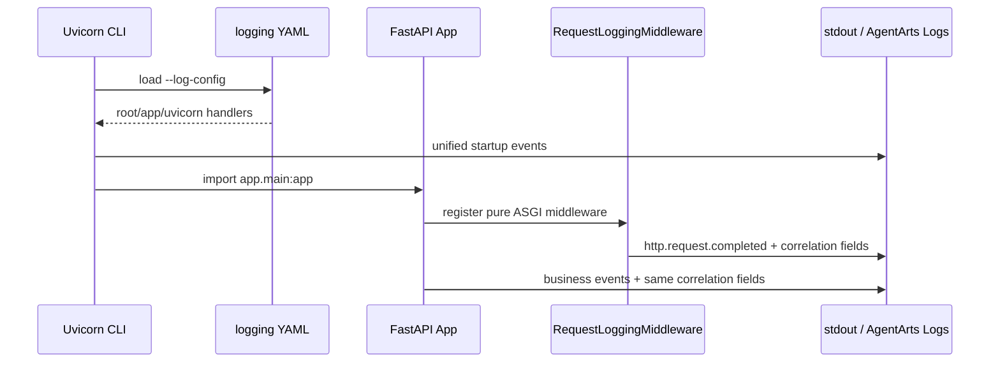

# Plan: Refactor 12 — 统一 Service Structured Logging

> 状态：Implemented | 关联 Issue：[issue.md](./issue.md) | 决策：[ADR-018](../../../architecture/ADR/ADR-018-service-structured-logging.md)

## 1. 决策摘要

由 Uvicorn CLI 的 `--log-config` 成为 process logging 的唯一配置入口。开发环境
选择 console YAML，生产环境选择 JSON YAML；application 不再在 import 时调用
`dictConfig`。



## 2. Implementation

| File | Change |
|------|--------|
| `app/logging_config.py` | UTC console/JSON formatter、runtime level filter、context filter、pure ASGI middleware |
| `app/main.py` | 删除 import-time 配置与 `PingFilter`；注册 middleware；补充 structured event fields |
| `config/logging.dev.yaml` | 统一 local console logging |
| `config/logging.prod.yaml` | 统一 production JSON logging |
| `Dockerfile` | copy config 并传入 production `--log-config` |
| `README.md` | 更新 local command 与日志说明 |
| `tests/test_logging_config.py` | formatter/filter/middleware contract tests |
| `tests/test_main.py` | request ID 与 HTTP completion integration tests |

## 3. Standard Fields

| Field | Source |
|-------|--------|
| `timestamp` | UTC RFC 3339 |
| `severity` | `LogRecord.levelname` |
| `logger` | `LogRecord.name` |
| `message` | formatted message |
| `service.name` | formatter configuration |
| `service.version` | formatter configuration |
| `deployment.environment` | dev/prod YAML |
| `event.name` | logging `extra` |
| `request.id` | accepted safe `X-Request-ID` or generated UUID |
| `session.id` | AgentArts session header |
| `trace_id`, `span_id` | current OpenTelemetry span when valid |
| `http.*` | ASGI request/response scope |
| `duration_ms`, `status` | middleware/business operation |

## 4. Risk

GitNexus impact analysis：

- `configure()`：LOW，1 个 direct caller，3 个 impacted symbols
- `PingFilter`：LOW，2 个 import consumers
- `invocations()`：LOW，无 upstream caller
- `Settings`：MEDIUM，因此不修改 Settings schema；继续复用现有 `LOG_LEVEL`

主要行为变化是关闭 Uvicorn access formatter，改由 middleware 记录等价且字段更完整的
HTTP completion event。`/ping` 明确跳过，保持 health-check 日志降噪行为。

## 5. Verification

```bash
uv run ruff check app/logging_config.py app/main.py \
  tests/test_logging_config.py tests/test_main.py
uv run pytest tests/
uv run uvicorn app.main:app --reload --log-config config/logging.dev.yaml
uv run uvicorn app.main:app --log-config config/logging.prod.yaml
```

验证首条 Uvicorn 日志格式、application startup 日志、JSON parse、request ID response
header、session correlation 与 `/ping` suppression。
