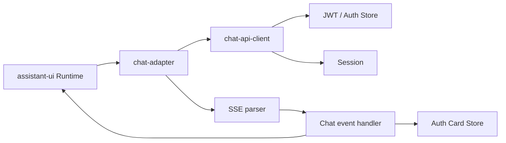

# Refactor 9: 模块化 Web Chat Adapter

`personal-assistant-client/src/lib/chat-adapter.ts` 当前同时负责 Session、JWT、
HTTP authentication retry、SSE parsing 和 UI event dispatch。随着 Auth Card 等
自定义事件增加，单个 `run()` 函数已经难以独立理解和测试。

## 目标

在不改变 Web Chat 行为和公共 API 的前提下，按职责拆分 Chat Adapter：

## 范围

| 模块 | 职责 |
|------|------|
| `chat-adapter.ts` | 提取输入、编排请求与 stream、生成 `ChatModelRunResult` |
| `chat-api-client.ts` | 构造请求、token proactive refresh、401/403 retry |
| `sse-parser.ts` | 将 `ReadableStream` 解码为 `SSEEvent` |
| `chat-event-handler.ts` | 累积 token、分发 system/auth events |
| `session.ts` | 创建、读取和重置 AgentArts Session ID |
| `jwt.ts` | JWT payload decode、user ID 和 expiration 提取 |

## 非目标

- 不修改 Service API 或 SSE schema
- 不修改 Auth Card UI
- 不改变 token refresh、Session persistence 或错误处理语义
- 不引入新的状态管理或 networking library

## 验收标准

- [x] `chatAdapter` 的公共导出与行为保持兼容
- [x] HTTP、SSE parsing、event handling 可独立阅读和测试
- [x] Auth Card、普通 system message、token streaming 行为不变
- [x] `npm run test` 通过
- [x] `npm run build` 通过

## Four-Question Gate

| Question | Answer | Notes |
|----------|:------:|------|
| Is it best practice? | Yes | 通过 Separation of Concerns 降低单函数复杂度 |
| Is it industry standard? | Yes | API client、protocol parser、event handler 分层是常见 frontend architecture |
| Is it conventional? | Yes | 使用普通 TypeScript function/module，不引入自定义 framework |
| Is it modern? | Yes | 保留 Fetch、ReadableStream、AsyncGenerator 和 Zustand |
