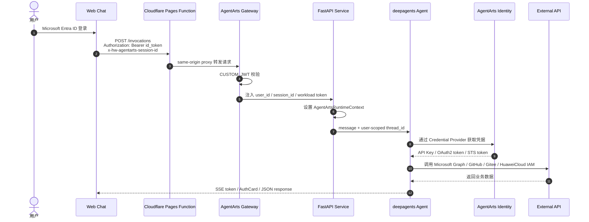

# Personal Assistant Use Case 索引

本文是 Personal Assistant Demo use case 的索引入口。Use Case 按当前后端实际注册的 tool 模块拆分，重点说明每类 tool 面向用户提供什么能力，以及这些能力使用了 Agent Identity 的哪些机制。

## Agent Identity 能力总览

| Agent Identity 能力 | Demo 中的落点 | 价值 |
|---|---|---|
| Inbound Identity | Web Chat 通过 Microsoft Entra ID 登录，AgentArts Gateway 校验 JWT 并注入 `X-HW-AgentGateway-User-Id` | 后端只信任 Gateway 注入的用户身份，避免浏览器伪造用户 ID |
| Session Identity | Gateway / Client 传递 `x-hw-agentarts-session-id`，后端用 `{user_id}:{session_id}` 作为 checkpoint thread_id | 同一用户多轮对话连续，不同用户和不同 Session 隔离 |
| Workload Identity | Gateway 注入 `X-HW-AgentGateway-Workload-Access-Token`，后端写入 `AgentArtsRuntimeContext` | Agent 容器用短期 Workload token 访问 Identity Service，不依赖本地长期凭据 |
| API Key Credential Provider | `DEEPSEEK_API_KEY` Provider 为 LLM 调用提供 DeepSeek API Key | LLM API Key 不进代码、不进 `.env`、不进镜像 |
| OAuth2 User Federation | `m365-email-provider`、`m365-calendar-provider`、`github-provider`、`gitee-provider` | Agent 以用户委托身份访问 Microsoft Graph、GitHub、Gitee |
| OAuth2 Token Vault | 用户完成授权后，第三方 access token 保存在 AgentArts Identity | 浏览器、LLM prompt、日志和业务数据库都不接触第三方 token |
| OAuth2 Auth URL Callback | 未授权时 `on_auth_url` 通过 SSE AuthCard 展示授权链接 | 授权链接带外呈现，不由 LLM 转述，减少误传和泄露 |
| OAuth2 Full Flow | Calendar callback 由 Cloudflare Pages BFF 转发到 Service，Service 调用 `complete_resource_token_auth` | 展示完整的服务端 session binding、state 校验和 replay 防护 |
| STS Credential Provider | `iam-users-readonly` 为华为云 IAM 只读查询提供临时凭证 | 云资源访问使用短期 STS，按最小权限授予 |
| Guarded Actions | 发送邮件、回复邮件、GitHub star 需要用户明确确认 | 凭据层允许访问，应用层对高风险写操作加运行态 Guard |

## 端到端身份链路

所有 tool use case 共享同一条 Agent Identity 基础链路：

这条链路体现了 Demo 的核心边界：

- Browser 只负责登录、携带 ID Token 和展示授权状态。
- Gateway 是生产环境 Inbound JWT 校验者。
- Service 只信任 Gateway 注入的身份 header。
- Agent 通过 Identity SDK 获取外部凭据。
- 第三方 access token 不暴露给浏览器、LLM、日志或业务数据库。

## 基础身份 Use Case 文档

| Use Case | 文档 | Agent Identity 能力 |
|---|---|---|
| 登录后进入 Web Chat | [Web Chat Inbound Identity](web-chat-inbound-identity.md) | Inbound Custom JWT、Gateway header injection、Workload Access Token |
| 多轮会话与用户隔离 | [Session Isolation](session-isolation.md) | Gateway User ID、Session ID、user-scoped checkpoint |

## Tool Use Case 文档

| Tool 模块 | Use Case 文档 | Agent Identity 能力 |
|---|---|---|
| `email_tools.py` | [Email Tools](email-tools.md) | OAuth2 User Federation、Token Vault、AuthCard、Guarded Action |
| `calendar_tools.py` | [Calendar Tools](calendar-tools.md) | OAuth2 User Federation、backend-owned callback、`complete_resource_token_auth`、Signed State、Replay Guard |
| `github_tools.py` | [GitHub Tools](github-tools.md) | OAuth2 User Federation、Token Vault、AuthCard、tool-level confirmation |
| `gitee_tools.py` | [Gitee Tools](gitee-tools.md) | OAuth2 User Federation、Token Vault、AuthCard |
| `iam_tools.py` | [HuaweiCloud IAM Tools](huaweicloud-iam-tools.md) | STS Credential Provider、短期云凭证、最小权限 |

## Demo 展示顺序

建议按以下顺序展示：

1. Web Chat 登录，说明 Inbound Identity 和 Gateway 注入身份。
2. Email Tools，展示 OAuth2 User Federation、邮件读取和发送前确认。
3. Calendar Tools，展示完整 OAuth2 callback 和 `complete_resource_token_auth`。
4. GitHub / Gitee Tools，展示多个 OAuth2 Provider 的统一接入方式。
5. HuaweiCloud IAM Tools，展示 STS 临时凭证和云资源只读访问。
