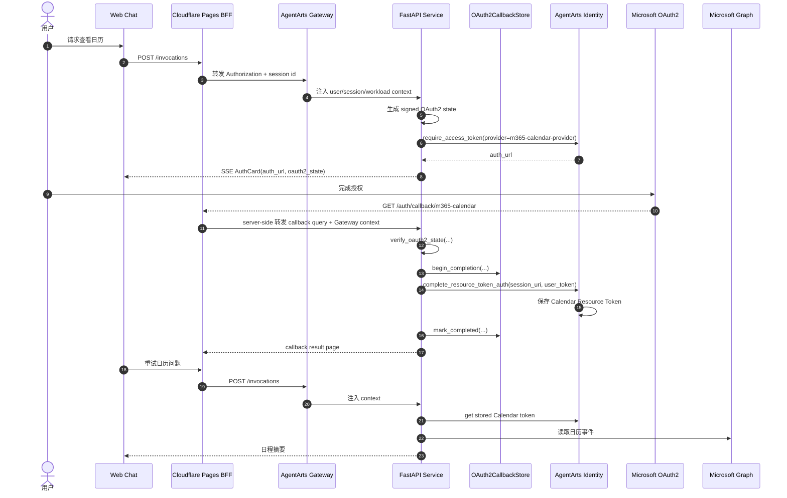

# Calendar Tools Use Case

`calendar_tools.py` 提供 Microsoft 365 Calendar 只读能力。它是项目中最完整的 AgentArts OAuth2 full flow 示例：OAuth2 callback 由 Cloudflare Pages BFF 承接，FastAPI Service 负责 signed state 校验、replay control，并调用 `complete_resource_token_auth` 完成 Resource Token Auth session binding。

## Tool 列表

| Tool | 用户意图 | 外部 API | Identity Provider |
|---|---|---|---|
| `list_calendar_events` | 查询指定时间范围内的日程 | Microsoft Graph `/me/calendarView` | `m365-calendar-provider` |
| `get_calendar_event` | 查看单个会议详情 | Microsoft Graph `/me/events/{event_id}` | `m365-calendar-provider` |
| `search_calendar_events` | 按关键词搜索会议 | Microsoft Graph `/me/events` 或时间范围内本地过滤 | `m365-calendar-provider` |

## 典型 Use Case

### UC-Calendar-01：查看今天日程

```text
用户：今天下午有哪些会议？
Agent：我需要访问你的 Microsoft 365 日历。请点击授权卡片完成授权。
用户完成授权后重试。
Agent：今天下午有 2 个会议：...
```

Agent 根据用户问题计算 `start_time` 和 `end_time`，调用 `list_calendar_events(start_time=..., end_time=...)`。

### UC-Calendar-02：查看会议详情

```text
用户：查看下午 3 点那个评审会详情。
Agent：会议主题：Demo 评审。组织者：... 参会人：... 会议链接：...
```

Agent 根据列表结果中的 `event_id` 调用 `get_calendar_event(event_id=...)`，返回主题、时间、地点、组织者、参会人、线上会议链接和正文预览。

### UC-Calendar-03：搜索会议

```text
用户：帮我找下本周和 Agent Identity 相关的会议。
Agent：本周找到 1 个相关会议：...
```

Agent 调用 `search_calendar_events(query="Agent Identity", start_time=..., end_time=...)`，按关键词筛选日历事件。

## OAuth2 Full Flow



## Agent Identity 能力映射

| 能力 | 在 Calendar Tools 中的使用 |
|---|---|
| OAuth2 User Federation | Calendar tools 通过 `@require_access_token(provider_name=CALENDAR_PROVIDER, auth_flow="USER_FEDERATION")` 以用户身份读取日历 |
| Least Privilege | Calendar 首版只读，仅使用 `https://graph.microsoft.com/Calendars.Read` |
| Callback URL | `callback_url` 指向 `/auth/callback/m365-calendar`，由 Cloudflare Pages BFF 承接 |
| Signed State | Service 为每次 `/invocations` 生成绑定 `user_id`、`session_id`、provider 的 signed state |
| Backend-owned Completion | Service 使用 `complete_resource_token_auth(session_uri, UserIdentifier(user_token=...))` 完成 binding |
| Replay Guard | `OAuth2CallbackStore` 控制 active / completed 状态，重复 callback 不会重复完成 |
| Token Vault | Calendar Resource Token 存放在 AgentArts Identity，不进入浏览器或业务数据库 |
| Workload Identity | Gateway 注入 Workload Access Token，Identity SDK 使用它与 Identity Service 通信 |

## 只读边界

Calendar Tools 当前只支持读取：

- 查看日程列表。
- 查看单个会议详情。
- 搜索日程。

以下操作不在当前 scope 内：

- 创建会议。
- 修改会议。
- 删除会议。
- 接受、拒绝或回复会议邀请。

如果用户提出写操作请求，Agent 应明确说明当前 Calendar Tool 只支持读取。

## 安全边界

- Browser 只展示授权状态，不调用 `complete_resource_token_auth`。
- Callback 请求中的 `user_id` 不可信；Service 使用 signed state 和 Gateway context 做绑定。
- `session_uri` 只在 callback completion 中使用，不写入 LLM prompt。
- Microsoft Graph access token 不出 AgentArts Identity Token Vault。
- 日历内容可能包含隐私信息，Agent 只读取并总结用户请求范围内的数据。

