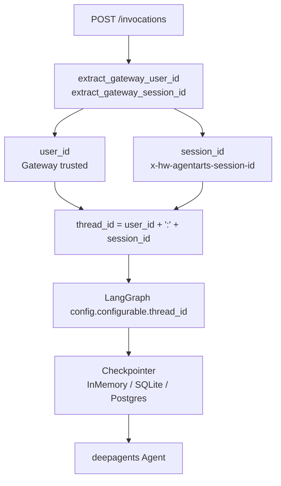

# Session Isolation Use Case

本 Use Case 对应根目录 `UseCase.md` 中的 “Use Case 9：多轮会话与用户隔离”。它不是单独的 tool，而是 Agent Identity 与 LangGraph Checkpoint 结合后的会话隔离能力。

## 用户场景

用户在同一 Session 中连续对话，Agent 能记住前面刚说过的信息；不同用户或不同 Session 之间不能串扰。

```text
用户 A / Session 1：我今天重点关注项目 A。
用户 A / Session 1：我刚才说重点关注什么？
Agent：项目 A。

用户 B / Session 1：我刚才说重点关注什么？
Agent：我没有看到你在当前会话里提供过这个信息。
```

## 身份与状态链路



## Agent Identity 能力映射

| 能力 | 说明 |
|---|---|
| Gateway User ID | 后端使用可信 `X-HW-AgentGateway-User-Id`，不接受浏览器 body 伪造用户 |
| Session ID | 后端使用 `x-hw-agentarts-session-id` 标识当前对话 Session |
| User-scoped Checkpoint | `thread_id = "{user_id}:{session_id}"`，同一 session 内恢复上下文 |
| Defense in Depth | 即使不同用户伪造相同 session id，最终 thread_id 仍不同 |
| Persistent Backend | 可通过 `POSTGRES_DSN` 或 `SQLITE_DB_PATH` 切换 checkpoint 后端 |

## 典型 Use Case

### UC-Session-01：同一用户同一 Session 多轮连续

```text
用户：我今天重点关注项目 A。
用户：我刚才说重点关注什么？
Agent：你刚才说今天重点关注项目 A。
```

同一 `user_id` 和同一 `session_id` 会映射到同一个 LangGraph checkpoint thread。

### UC-Session-02：同一用户不同 Session 隔离

```text
用户 / Session A：我今天重点关注项目 A。
用户 / Session B：我刚才说重点关注什么？
Agent：我没有看到你在当前会话里提供过这个信息。
```

同一用户的不同 session id 映射到不同 thread，短期上下文不共享。

### UC-Session-03：不同用户相同 Session ID 仍隔离

```text
用户 A / session-x：我的项目代号是 Alpha。
用户 B / session-x：我的项目代号是什么？
Agent：我没有看到你在当前会话里提供过项目代号。
```

最终 thread_id 分别是 `user-a:session-x` 和 `user-b:session-x`，避免跨用户状态泄露。

## 实现落点

| 层 | 文件 | 职责 |
|---|---|---|
| Header 提取 | `personal-assistant-service/app/auth.py` | 提取并设置 Gateway user/session context |
| Runtime route | `personal-assistant-service/app/main.py` | 将 `user_id` 和 `session_id` 传给 `AgentHandler` |
| Thread config | `personal-assistant-service/app/agent_handler.py` | `_build_config()` 构造 `{user_id}:{session_id}` |
| Checkpointer | `personal-assistant-service/app/agent_handler.py` | 初始化 InMemory / SQLite / Postgres checkpoint 后端 |
| Settings | `personal-assistant-service/app/settings.py` | `POSTGRES_DSN` 与 `SQLITE_DB_PATH` 配置互斥 |

## 安全边界

- `session_id` 不是用户身份，不能单独作为 checkpoint key。
- 用户维度必须参与 thread_id，防止跨用户复用同一 session id。
- 缺少 Gateway user header 时请求应 fail closed。
- Checkpoint 存储的是短期会话状态，不等同于长期 AgentArts Memory。

