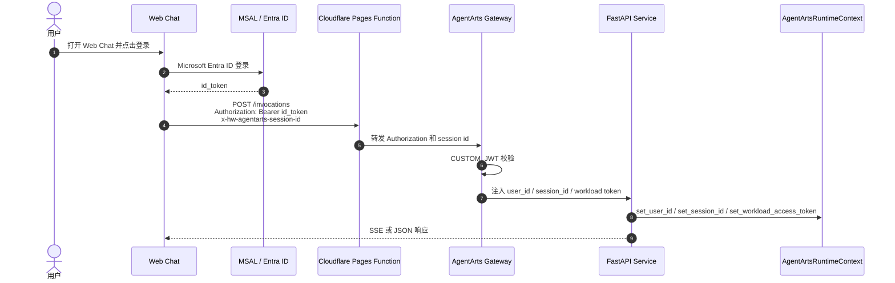

# Web Chat Inbound Identity Use Case

本 Use Case 对应根目录 `UseCase.md` 中的 “Use Case 1：登录后进入 Web Chat”。它不是单独的 tool，而是所有 tool 能安全执行的 Inbound Identity 前置能力。

## 用户场景

用户打开 Web Chat，点击登录，使用 Microsoft Entra ID 完成认证，然后开始与 Personal Assistant 对话。

```text
用户：你好，今天帮我处理一下工作事项。
Agent：可以。我可以帮你查看邮件、日历、代码仓库和部分华为云 IAM 信息。你想先处理哪一项？
```

## 身份链路



## Agent Identity 能力映射

| 能力 | 说明 |
|---|---|
| Inbound Custom JWT | Web Chat 使用 MSAL 获取 Microsoft `id_token`，请求 `/invocations` 时携带 `Authorization: Bearer <id_token>` |
| Gateway JWT Verification | AgentArts Gateway 根据 `.agentarts_config.yaml` 中的 OIDC discovery 配置校验 token |
| Gateway Header Injection | Gateway 向后端注入 `X-HW-AgentGateway-User-Id` 和 `x-hw-agentarts-session-id` |
| Workload Access Token | Gateway 注入 `X-HW-AgentGateway-Workload-Access-Token`，供后端访问 Identity Service |
| Fail Closed | Service 缺少可信 user header 时返回 401，缺少 session header 时返回 400 |

## 实现落点

| 层 | 文件 | 职责 |
|---|---|---|
| Frontend Auth | `personal-assistant-client/src/lib/auth.ts` | MSAL 配置、silent refresh、登录态清理 |
| Frontend Request | `personal-assistant-client/src/lib/chat/chat-api-client.ts` | 构造 `/invocations` 请求 header，携带 `Authorization` 和 session id |
| Cloudflare BFF | `personal-assistant-client/functions/invocations/[[path]].js` | same-origin proxy，转发到 AgentArts Gateway |
| Service Auth | `personal-assistant-service/app/auth.py` | 提取 Gateway 注入的 user/session/workload header |
| Runtime Route | `personal-assistant-service/app/main.py` | `/invocations` 入口设置 Runtime Context 并调用 Agent |
| AgentArts Config | `personal-assistant-service/.agentarts_config.yaml` | 配置 `CUSTOM_JWT` 和开发用 `key_auth` |

## 安全边界

- Browser 中的 token 只用于提交到 Gateway；Service 不自行信任浏览器 body 中的用户 ID。
- 生产环境中，可信用户 ID 只来自 Gateway 注入的 `X-HW-AgentGateway-User-Id`。
- `X-HW-AgentGateway-Workload-Access-Token` 是短期 Workload token，用于 Runtime 访问 Identity Service。
- 本地直连测试需要显式模拟 Gateway header；该路径不能代表生产身份校验边界。

