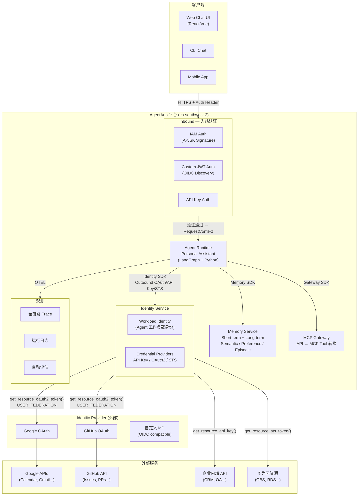
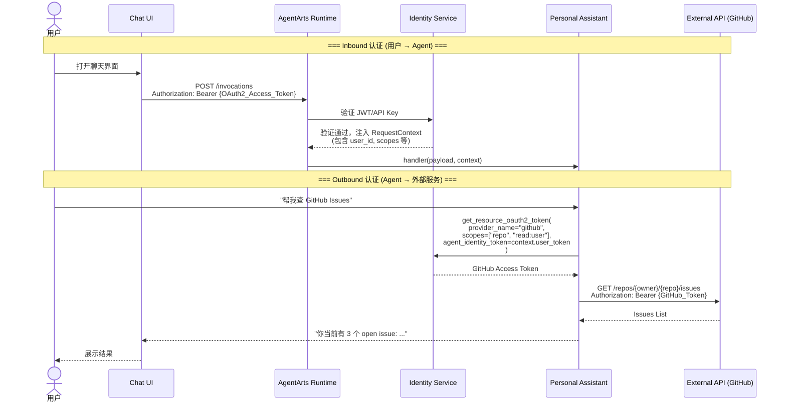
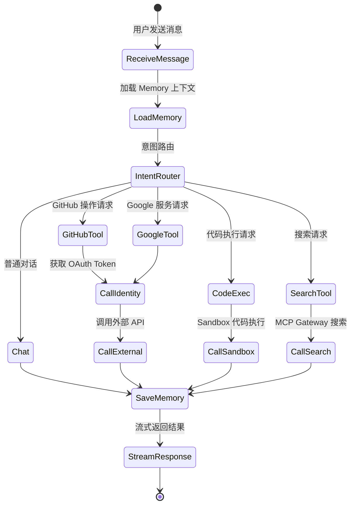

# Personal Assistant — 总体规格书

> 版本：v0.1 | 状态：Draft | 基于 AgentArts 平台开发

---

## 1. 项目概述

开发一个基于 **AgentArts** 平台的对话式 Personal Assistant Agent 应用，端到端使用 AgentArts 的 Runtime、Memory、Identity、Gateway 能力，重点验证 **Agent Identity 的 Inbound 和 Outbound 认证能力**。

### 1.1 目标

- 在 AgentArts Runtime 上部署一个可对话的 LangGraph Agent
- 用户通过 Identity Inbound 认证后访问 Agent
- Agent 通过 Identity Outbound 能力以用户身份调用外部服务（如 GitHub、Google Calendar、企业内部 API）
- Agent 具备 Memory 能力，跨 Session 记住用户偏好和历史

### 1.2 核心验证点

| 验证项 | 说明 |
|--------|------|
| **Inbound Auth** | 用户通过 OAuth 2.0 / API Key 认证后访问 Agent Runtime |
| **Outbound Auth (User Federation)** | Agent 以用户委托身份调用 GitHub/Google 等外部 API |
| **Outbound Auth (M2M)** | Agent 以自身身份调用企业内部 Service API |
| **Outbound Auth (STS)** | Agent 获取华为云 STS Token 访问云资源 |
| **Chat Loop** | 多轮对话 + 工具调用 + 流式响应 |
| **Memory** | 跨 Session 持久化用户偏好和上下文 |

---

## 2. 系统架构

### 2.1 整体架构



### 2.2 认证流详解



---

## 3. Identity 设计

### 3.1 Inbound — 用户如何认证到 Agent

AgentArts Runtime 支持三种 Inbound 认证方式，通过 `agentarts_config.yaml` 中 `runtime.identity_configuration` 配置：

```yaml
runtime:
  identity_configuration:
    authorizer_type: CUSTOM_JWT          # IAM | CUSTOM_JWT | KEY_AUTH
    authorizer_configuration:
      custom_jwt:
        discovery_url: https://accounts.google.com/.well-known/openid-configuration
        allowed_audience:
          - "personal-assistant-client-id"
        allowed_clients:
          - "personal-assistant-client-id"
        allowed_scopes:
          - "openid"
          - "profile"
          - "email"
      key_auth:
        api_keys:
          - "opencode-2026-api-key-xxxxx"       # 开发调试用
```

| 认证方式 | 适用场景 | 配置 |
|----------|----------|------|
| **IAM** | 华为云内部用户（Console / CLI） | `authorizer_type: IAM` |
| **Custom JWT** | 自有 IdP 用户登录（Google / Okta / Auth0） | `authorizer_type: CUSTOM_JWT` + `discovery_url` |
| **API Key** | 开发调试 / 机器对机器调用 | `authorizer_type: KEY_AUTH` + `api_keys[]` |

> 推荐生产环境使用 **Custom JWT** 方式，通过 Google OAuth 或自有 OIDC IdP 提供用户认证。

### 3.2 Outbound — Agent 如何代表用户调用外部服务

AgentArts Identity SDK 提供三种 Outbound 认证模式：

| 模式 | Auth Flow | 用途 | 典型场景 |
|------|-----------|------|----------|
| **User Federation** | `USER_FEDERATION` | Agent 以用户身份调用外部 API | 查 GitHub Issues、发 Gmail、读 Google Calendar |
| **M2M** | `M2M` | Agent 以自身服务身份调用 API | 调用企业内部 CRM、OA 系统 |
| **STS Token** | — | Agent 获取华为云资源访问凭证 | 操作 OBS 对象存储、访问 RDS |

#### 3.2.1 Credential Provider 配置（在 AgentArts Console 或 SDK 中创建）

```python
from agentarts.sdk.services.identity import IdentityClient

client = IdentityClient(region="cn-southwest-2")

# 1. 创建 Workload Identity（Agent 的工作负载身份）
workload = client.create_workload_identity(
    name="personal-assistant-workload",
    description="Personal Assistant Agent 工作负载身份"
)

# 2. OAuth2 Provider — GitHub（User Federation）
github_provider = client.create_oauth2_credential_provider(
    name="github-provider",
    vendor="github",
    client_id="your-github-oauth-app-client-id",
    client_secret="your-github-oauth-app-client-secret"
)

# 3. OAuth2 Provider — Google（User Federation）
google_provider = client.create_oauth2_credential_provider(
    name="google-provider",
    vendor="google",
    client_id="your-google-oauth-client-id",
    client_secret="your-google-oauth-client-secret"
)

# 4. API Key Provider — 企业内部 API（M2M）
api_key_provider = client.create_api_key_credential_provider(
    name="internal-api-provider",
    api_key="sk-internal-api-xxxxx"
)

# 5. STS Provider — 华为云资源（M2M）
sts_provider = client.create_sts_credential_provider(
    name="huaweicloud-sts-provider",
    agency_urn="urn:agency:your-agency",
    tags=[{"key": "env", "value": "prod"}]
)
```

#### 3.2.2 Agent 代码中使用凭据装饰器

```python
from agentarts.sdk import require_access_token, require_api_key, require_sts_token
from agentarts.sdk.identity.types import StsCredentials
from typing import Optional
import httpx

# === User Federation: 以用户身份调用 GitHub ===
@require_access_token(
    provider_name="github-provider",
    scopes=["repo", "read:user"],
    auth_flow="USER_FEDERATION"
)
async def get_github_issues(owner: str, repo: str, access_token: Optional[str] = None):
    async with httpx.AsyncClient() as client:
        resp = await client.get(
            f"https://api.github.com/repos/{owner}/{repo}/issues",
            headers={"Authorization": f"Bearer {access_token}"}
        )
        return resp.json()

# === User Federation: 以用户身份调用 Google Calendar ===
@require_access_token(
    provider_name="google-provider",
    scopes=["https://www.googleapis.com/auth/calendar.readonly"],
    auth_flow="USER_FEDERATION"
)
async def get_google_calendar_events(access_token: Optional[str] = None):
    async with httpx.AsyncClient() as client:
        resp = await client.get(
            "https://www.googleapis.com/calendar/v3/calendars/primary/events",
            headers={"Authorization": f"Bearer {access_token}"}
        )
        return resp.json()

# === M2M: Agent 以自身身份调用企业内部 API ===
@require_api_key(provider_name="internal-api-provider")
def call_internal_crm(query: str, api_key: Optional[str] = None):
    import requests
    resp = requests.get(
        f"https://crm.internal.example.com/api/search?q={query}",
        headers={"X-API-Key": api_key}
    )
    return resp.json()

# === STS: Agent 获取华为云资源 Token ===
@require_sts_token(
    provider_name="huaweicloud-sts-provider",
    agency_session_name="personal-assistant-session"
)
async def access_obs_file(bucket: str, key: str, sts_credentials: Optional[StsCredentials] = None):
    # 使用 STS 临时凭证访问华为云 OBS
    from obs import ObsClient
    obs_client = ObsClient(
        access_key_id=sts_credentials.access_key_id,
        secret_access_key=sts_credentials.secret_access_key,
        security_token=sts_credentials.security_token,
        server="https://obs.cn-southwest-2.myhuaweicloud.com"
    )
    return obs_client.getObject(bucket, key)
```

---

## 4. Chat Agent 设计

### 4.1 对话流程



### 4.2 Agent 代码骨架

```python
# app/personal_assistant/agent.py

import os
from typing import Dict, Any, TypedDict, Annotated, Optional
from langgraph.graph.message import add_messages
from langgraph.graph import StateGraph, END
from langgraph.prebuilt import ToolNode
from langchain_openai import ChatOpenAI
from langchain_core.messages import HumanMessage, AIMessage, ToolMessage

from agentarts.sdk import AgentArtsRuntimeApp, RequestContext

# Identity Outbound 工具
from .tools.github_tools import list_github_issues
from .tools.google_tools import get_calendar_events
from .tools.internal_tools import search_crm
from .tools.cloud_tools import read_obs_file

# Memory
from .memory import PersonalAssistantMemory

app = AgentArtsRuntimeApp()


class AgentState(TypedDict):
    messages: Annotated[list, add_messages]
    query: str
    response: str
    context: Optional[Dict[str, Any]]


class PersonalAssistant:
    def __init__(self):
        self.model_name = os.environ.get("MODEL_NAME", "deepseek-v3.2")
        self.memory = PersonalAssistantMemory()
        self._graph = None

        # 定义可用工具
        self.tools = [
            list_github_issues,
            get_calendar_events,
            search_crm,
            read_obs_file,
        ]

    def _build_graph(self):
        llm = ChatOpenAI(
            model=self.model_name,
            api_key=os.environ.get("MODEL_API_KEY"),
            base_url=os.environ.get("MODEL_URL",
                "https://api.modelarts-maas.com/openai/v1")
        )
        llm_with_tools = llm.bind_tools(self.tools)

        tool_node = ToolNode(self.tools)

        async def agent_node(state: AgentState) -> Dict[str, Any]:
            """核心 Agent 节点：决定调用工具还是直接回答"""
            # 注入 Memory 上下文
            memory_context = await self.memory.get_context(state)
            system_prompt = f"你是 Personal Assistant。\n{memory_context}"
            messages = [HumanMessage(content=system_prompt)] + state.get("messages", [])
            response = await llm_with_tools.ainvoke(messages)
            return {"messages": [response]}

        async def finalize_node(state: AgentState) -> Dict[str, Any]:
            """最终节点：保存 Memory，返回结果"""
            if state.get("messages"):
                last_msg = state["messages"][-1]
                await self.memory.save_interaction(state, last_msg)
            return {
                "response": state["messages"][-1].content if state.get("messages") else ""
            }

        workflow = StateGraph(AgentState)
        workflow.add_node("agent", agent_node)
        workflow.add_node("tools", tool_node)
        workflow.add_node("finalize", finalize_node)

        workflow.set_entry_point("agent")

        # 条件路由：如需工具调用则去 tools，否则结束
        workflow.add_conditional_edges(
            "agent",
            lambda state: "tools" if state["messages"][-1].tool_calls else "finalize",
            {"tools": "tools", "finalize": "finalize"}
        )
        workflow.add_edge("tools", "agent")     # 工具结果返回 agent 继续推理
        workflow.add_edge("finalize", END)

        return workflow.compile()

    async def run(self, query: str, context: Optional[Dict] = None) -> Dict[str, Any]:
        graph = self._graph or self._build_graph()
        self._graph = graph
        result = await graph.ainvoke({
            "messages": [HumanMessage(content=query)],
            "query": query,
            "response": "",
            "context": context or {}
        })
        return {"response": result.get("response", "")}


_assistant = PersonalAssistant()


@app.entrypoint
async def handler(
    payload: Dict[str, Any],
    context: RequestContext = None   # AgentArts 自动注入
) -> Dict[str, Any]:
    """
    AgentArts Runtime entrypoint.
    RequestContext 由平台根据 Inbound Auth 结果自动注入，包含：
      - context.user_id     : 用户身份
      - context.user_token  : 用户 Token（用于 Outbound User Federation）
      - context.session_id  : 会话 ID
    """
    query = payload.get("message", "")
    user_context = {
        "user_id": context.user_id if context else None,
        "user_token": context.user_token if context else None,
        "session_id": context.session_id if context else None,
    }
    return await _assistant.run(query, user_context)


if __name__ == "__main__":
    app.run()
```

### 4.3 Memory 集成

```python
# app/personal_assistant/memory.py

import os
from agentarts.sdk.memory import MemoryClient
from agentarts.sdk.memory.session import MemorySession
from agentarts.sdk.memory.inner.config import TextMessage, MemorySearchFilter


class PersonalAssistantMemory:
    def __init__(self):
        self.space_id = os.environ.get("MEMORY_SPACE_ID")
        self.actor_prefix = "pa-user-"
        self.assistant_id = "personal-assistant"

    async def get_context(self, state: dict) -> str:
        """获取当前 Session 的 Memory 上下文"""
        user_id = state.get("context", {}).get("user_id", "anonymous")
        if not self.space_id:
            return ""

        session = MemorySession(
            space_id=self.space_id,
            actor_id=f"{self.actor_prefix}{user_id}",
            assistant_id=self.assistant_id
        )

        # 搜索长期记忆中的用户偏好
        results = session.search_long_term_memories(
            filters=MemorySearchFilter(query="user preferences", top_k=5)
        )

        context_parts = []
        for r in results.results:
            record = r.get("record", {})
            context_parts.append(record.get("content", ""))

        return "\n".join(context_parts) if context_parts else ""

    async def save_interaction(self, state: dict, last_message) -> None:
        """保存对话到 Memory"""
        user_id = state.get("context", {}).get("user_id", "anonymous")
        if not self.space_id or not state.get("messages"):
            return

        session = MemorySession(
            space_id=self.space_id,
            actor_id=f"{self.actor_prefix}{user_id}",
            assistant_id=self.assistant_id
        )

        # 提取最后一轮用户-助手消息
        messages = state["messages"]
        # 简化：保存最后两条
        turns = []
        for msg in messages[-2:]:
            role = "user" if msg.type == "human" else "assistant"
            turns.append(TextMessage(role=role, content=str(msg.content)[:2000]))
        if turns:
            session.add_messages(turns)
```

---

## 5. 部署配置

### 5.1 `agentarts_config.yaml`

```yaml
default_agent: personal-assistant

agents:
  personal-assistant:
    base:
      name: personal-assistant
      entrypoint: agent:app
      dependency_file: requirements.txt
      platform: linux/arm64
      language: python3
      base_image: python:3.10-slim
      region: cn-southwest-2

    swr_config:
      organization: personal-assistant-org
      repository: agent_personal_assistant
      organization_auto_create: true
      repository_auto_create: true

    runtime:
      invoke_config:
        protocol: HTTP
        port: 8080

      network_config:
        network_mode: PUBLIC
        # 如需 VPC 内访问，改为 PRIVATE 并配置 vpc_config

      identity_configuration:
        # === Inbound: Custom JWT (Google OAuth) ===
        authorizer_type: CUSTOM_JWT
        authorizer_configuration:
          custom_jwt:
            discovery_url: https://accounts.google.com/.well-known/openid-configuration
            allowed_audience:
              - "<your-google-oauth-client-id>"
            allowed_clients:
              - "<your-google-oauth-client-id>"
            allowed_scopes:
              - "openid"
              - "profile"
              - "email"
          # === Inbound: API Key (开发调试) ===
          key_auth:
            api_keys:
              - "opencode-dev-api-key-2026"

      observability:
        tracing:
          enabled: true
        metrics:
          enabled: true
        logs:
          enabled: true

      artifact_source:
        url: swr.cn-southwest-2.myhuaweicloud.com/personal-assistant-org/agent_personal_assistant:latest
        commands: []

      environment_variables:
        - key: MODEL_API_KEY
          value: "<MaaS API Key>"
        - key: MODEL_NAME
          value: "deepseek-v3.2"
        - key: MODEL_URL
          value: "https://api.modelarts-maas.com/openai/v1"
        - key: MEMORY_SPACE_ID
          value: "<Memory Space ID>"

      tags:
        - key: app
          value: personal-assistant
        - key: env
          value: dev
```

### 5.2 部署命令

```bash
# 本地开发
agentarts dev

# 部署到云端
agentarts launch

# 调用（API Key 模式）
agentarts invoke '{"message": "帮我查一下我的 GitHub Issues"}'

# 调用（JWT 模式，通过 HTTPS + Bearer Token）
curl -X POST https://<runtime-domain>/invocations \
  -H "Content-Type: application/json" \
  -H "Authorization: Bearer <Google_ID_Token>" \
  -d '{"message": "查一下我的日程"}'
```

---

## 6. 项目文件结构

```
personal-assistant/
├── .agentarts_config.yaml      # AgentArts 项目配置 + Runtime Identity 配置
├── app/
│   └── personal_assistant/
│       ├── __init__.py
│       ├── agent.py            # Agent 入口 + LangGraph 编排
│       ├── memory.py           # Memory 集成
│       ├── tools/
│       │   ├── __init__.py
│       │   ├── github_tools.py # GitHub 工具 (OAuth2 User Federation)
│       │   ├── google_tools.py # Google 工具 (OAuth2 User Federation)
│       │   ├── internal_tools.py # 内部 API 工具 (API Key M2M)
│       │   └── cloud_tools.py  # 华为云资源工具 (STS M2M)
│       └── prompts/
│           └── system_prompt.txt
├── Dockerfile                  # ARM64 镜像构建
├── requirements.txt            # Python 依赖
└── README.md
```

---

## 7. Inbound / Outbound 认证矩阵

| 用户身份 | Inbound 方式 | Outbound 目标 | Outbound 方式 | Auth Flow |
|----------|-------------|---------------|---------------|-----------|
| Google 用户 | JWT (Google OAuth) | GitHub API | OAuth 2.0 | USER_FEDERATION |
| Google 用户 | JWT (Google OAuth) | Google Calendar | OAuth 2.0 | USER_FEDERATION |
| 企业员工 | JWT (Okta/Entra ID) | 内部 CRM | API Key | M2M |
| 运维人员 | JWT (Okta/Entra ID) | 华为云 OBS | STS Token | M2M |
| 开发者 | API Key | _(全部)_ | _(开发调试)_ | — |

---

## 8. 开发计划

| Phase | 内容 | 验证点 |
|-------|------|--------|
| **Phase 1** | 搭建 Agent 骨架：LangGraph chat loop + `agentarts dev` | 本地对话通 |
| **Phase 2** | 集成 Memory SDK：创建 Memory Space，保存/检索记忆 | 跨 Session 记忆 |
| **Phase 3** | 配置 Inbound Identity：JWT + API Key 认证 | 用户登录后访问 |
| **Phase 4** | 实现 Outbound OAuth2 (User Federation)：GitHub Tool | Agent 代用户查 Issues |
| **Phase 5** | 实现 Outbound API Key (M2M)：内部 API Tool | Agent 调企业内部服务 |
| **Phase 6** | 实现 Outbound STS：华为云资源 Tool | Agent 访问 OBS |
| **Phase 7** | 部署上线：`agentarts launch` + 观测 | 全链路可观测 |

---

## 9. 参考文档

| 文档 | 路径 |
|------|------|
| AgentArts 平台参考 | `../architecture/cloud-service/agentarts.md` |
| AgentCore 对比参考 | `../architecture/cloud-service/agentcore.md` |
| Identity SDK 文档 | `https://support.huaweicloud.com/highcode-agentarts/agentarts_10_044.html` |
| Runtime 部署文档 | `https://support.huaweicloud.com/highcode-agentarts/agentarts_10_028.html` |
| 认证鉴权 | `https://support.huaweicloud.com/highcode-agentarts/agentarts_10_047.html` |
| Memory SDK 文档 | `https://support.huaweicloud.com/highcode-agentarts/agentarts_10_043.html` |
| SDK 快速开始 | `https://support.huaweicloud.com/highcode-agentarts/agentarts_10_040.html` |
