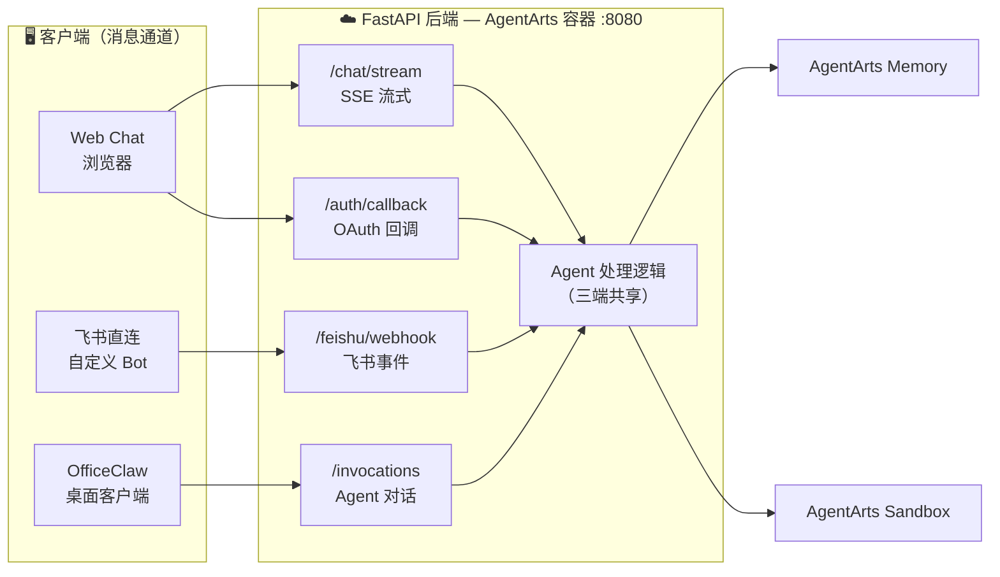
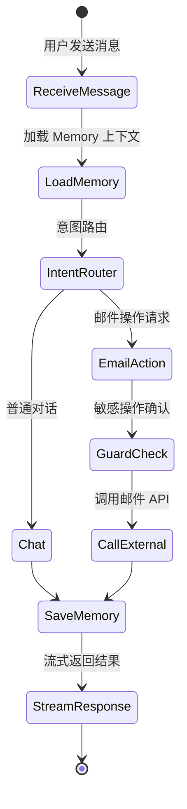

# Personal Assistant — 总体功能规格书

> 版本：v0.5 | 状态：Draft | 基于 AgentArts 平台

---

## 1. 项目概述

Personal Assistant 是一个对话式 AI 助手应用，用户通过自然语言对话管理邮件。系统具备跨 Session 的 Memory 能力，能够记住用户偏好和历史上下文，并在用户授权下以用户身份访问外部服务（如 Microsoft 365 邮件）。

### 1.1 核心价值

- **多渠道接入**：支持 Web Chat、飞书直连和 OfficeClaw 三种客户端接入方式，同一 Agent 后端同时服务多个入口
- **安全委托**：Agent 以用户委托身份调用外部服务，无需暴露个人凭证给 Agent 代码

### 1.2 目标用户

| 用户类型 | 典型场景 |
|----------|----------|
| 职场人士 | 通过对话处理邮件、查询收件箱摘要 |
| 开发者 | 通过对话管理邮件，辅助日常工作 |

---

## 2. 接入渠道

系统支持三种客户端接入方式，共享同一 FastAPI 后端和 Agent 处理逻辑：



| 渠道 | 接入方式 | 说明 | 适用场景 |
|------|----------|------|----------|
| **Web Chat** | 浏览器直连 `/chat/stream` | 独立 Web 聊天界面，支持 OAuth 登录和 SSE 流式响应，完全自定义 UI/UX | 个人桌面使用、对外 Demo |
| **飞书直连** | 飞书事件回调 `/feishu/webhook` | 自行创建飞书 Bot，处理事件回调，完全自主可控，支持飞书卡片等高级交互 | 企业内部推广、移动端触达、高级飞书交互 |
| **OfficeClaw** | AgentArts 转发 `/invocations` | 通过 OfficeClaw 桌面客户端桥接飞书/微信，无需写飞书代码，不需要公网回调 URL | 快速接入飞书/微信，不想维护飞书 Bot 代码 |

三种渠道共享同一个 Agent 处理逻辑和 Memory 空间，用户无论从哪个入口发起对话，Assistant 都能加载其偏好和历史上下文。

---

## 3. 功能模块

详细 use case 已拆分到 [`UseCase/`](UseCase/README.md)。当前功能模块分为两类：基础身份能力和已注册 tool 能力。

| 类型 | 模块 | Use Case 文档 | 当前状态 |
|---|---|---|---|
| 基础身份能力 | Web Chat Inbound Identity | [`UseCase/web-chat-inbound-identity.md`](UseCase/web-chat-inbound-identity.md) | 已实现 |
| 基础身份能力 | Session Isolation | [`UseCase/session-isolation.md`](UseCase/session-isolation.md) | 已实现 |
| Tool 能力 | Email Tools | [`UseCase/email-tools.md`](UseCase/email-tools.md) | 已实现 |
| Tool 能力 | Calendar Tools | [`UseCase/calendar-tools.md`](UseCase/calendar-tools.md) | 已实现 |
| Tool 能力 | GitHub Tools | [`UseCase/github-tools.md`](UseCase/github-tools.md) | 已实现 |
| Tool 能力 | Gitee Tools | [`UseCase/gitee-tools.md`](UseCase/gitee-tools.md) | 已实现 |
| Tool 能力 | HuaweiCloud IAM Tools | [`UseCase/huaweicloud-iam-tools.md`](UseCase/huaweicloud-iam-tools.md) | 已实现 |

### 3.1 Web Chat Inbound Identity

用户通过 Microsoft Entra ID 登录 Web Chat 后，浏览器向 `/invocations` 发送 `Authorization: Bearer <id_token>` 和 `x-hw-agentarts-session-id`。AgentArts Gateway 负责校验 JWT，并向 Service 注入可信用户、会话和 Workload token。

- **登录入口**：Web Chat + Microsoft Entra ID。
- **可信身份来源**：`X-HW-AgentGateway-User-Id`。
- **会话来源**：`x-hw-agentarts-session-id`。
- **Workload Identity**：`X-HW-AgentGateway-Workload-Access-Token` 用于 Runtime 访问 AgentArts Identity。
- **详细规格**：[`UseCase/web-chat-inbound-identity.md`](UseCase/web-chat-inbound-identity.md)。

### 3.2 Session Isolation

系统使用 Gateway 注入的可信 `user_id` 和 session id 构造 LangGraph checkpoint key：`thread_id = "{user_id}:{session_id}"`。该设计支持同一 Session 内多轮对话连续，同时避免不同用户或不同 Session 之间发生状态串扰。

- **同一 Session 连续**：Agent 能恢复当前 Session 的短期上下文。
- **不同 Session 隔离**：同一用户的不同 Session 不共享 checkpoint。
- **跨用户隔离**：即使不同用户使用相同 session id，最终 thread_id 仍不同。
- **Checkpoint 后端**：支持 in-memory、SQLite 和 PostgreSQL。
- **详细规格**：[`UseCase/session-isolation.md`](UseCase/session-isolation.md)。

### 3.3 Email Tools

Email Tools 以 User Federation 模式调用 Microsoft Graph Mail API，支持邮件列表、邮件详情、邮件搜索、发送邮件和回复邮件。

- **Provider**：`m365-email-provider`。
- **读操作**：`list_emails`、`get_email`、`search_emails`。
- **写操作**：`send_email`、`reply_to_email`。
- **Guard**：发送和回复必须先展示预览并获得用户明确确认。
- **详细规格**：[`UseCase/email-tools.md`](UseCase/email-tools.md)。

### 3.4 Calendar Tools

Calendar Tools 以 User Federation 模式只读访问 Microsoft 365 Calendar，是当前项目中 AgentArts OAuth2 full flow 的完整示范。

- **Provider**：`m365-calendar-provider`。
- **Scope**：`https://graph.microsoft.com/Calendars.Read`。
- **只读能力**：`list_calendar_events`、`get_calendar_event`、`search_calendar_events`。
- **OAuth2 Full Flow**：Service-owned callback、signed state、replay guard、`complete_resource_token_auth`。
- **详细规格**：[`UseCase/calendar-tools.md`](UseCase/calendar-tools.md)。

### 3.5 GitHub Tools

GitHub Tools 以用户身份访问 GitHub API，支持仓库列表、目录查看、文件读取、代码搜索和仓库 star。

- **Provider**：`github-provider`。
- **读操作**：`github_list_repositories`、`github_list_repo_contents`、`github_get_file_content`、`github_search_code`。
- **写操作**：`github_star_repository`。
- **Tool-level Guard**：`confirm=False` 返回预览，用户确认后 `confirm=True` 才执行 star。
- **详细规格**：[`UseCase/github-tools.md`](UseCase/github-tools.md)。

### 3.6 Gitee Tools

Gitee Tools 以用户身份访问 Gitee API，当前提供仓库列表读取能力。

- **Provider**：`gitee-provider`。
- **只读能力**：`gitee_list_repositories`。
- **授权方式**：OAuth2 User Federation + AuthCard。
- **详细规格**：[`UseCase/gitee-tools.md`](UseCase/gitee-tools.md)。

### 3.7 HuaweiCloud IAM Tools

HuaweiCloud IAM Tools 使用 AgentArts Identity STS Credential Provider 获取短期云凭证，调用 Huawei Cloud IAM API 进行只读查询。

- **Provider**：`iam-users-readonly`。
- **能力**：`huaweicloud_list_iam_users`。
- **凭据类型**：STS 临时凭证，不使用长期 AK/SK。
- **安全边界**：只读查询，不返回 AK/SK/Token。
- **详细规格**：[`UseCase/huaweicloud-iam-tools.md`](UseCase/huaweicloud-iam-tools.md)。

---

## 4. 认证与授权

### 4.1 用户登录（Inbound）

用户通过以下方式之一登录后访问 Agent：

| 认证方式 | 说明 | 适用场景 |
|----------|------|----------|
| **OAuth 2.0 (Custom JWT)** | 通过 Microsoft Entra ID、Okta、Auth0 等 OIDC IdP 登录 | 生产环境，面向终端用户 |
| **IAM** | 通过华为云 IAM 账号登录 | 华为云内部用户 |
| **API Key** | 使用预配置的 API Key 访问 | 开发调试、机器对机器调用 |

### 4.2 服务委托（Outbound）

用户可授权 Agent 以自身身份访问外部服务：

| 委托模式 | 说明 | 典型场景 |
|----------|------|----------|
| **User Federation** | Agent 以用户身份调用外部 API | 查询 Outlook 邮件、发送邮件 |

用户凭证始终由 Identity Service 管理，Agent 代码不会接触原始凭证（如密码或长期 Token）。

### 4.3 认证矩阵

| 用户身份 | Inbound 方式 | Outbound 目标 | Outbound 方式 | Auth Flow |
|----------|-------------|---------------|---------------|-----------|
| Microsoft 用户 | JWT (Microsoft Entra ID) | Outlook Mail | OAuth 2.0 | USER_FEDERATION |
| 开发者 | API Key | _(全部)_ | _(开发调试)_ | — |

---

## 5. 对话交互

### 5.1 对话流程



### 5.2 典型对话示例

**场景一：收件箱摘要**

```
用户: 帮我看看最近有什么重要邮件
Agent: 你最近有 3 封未读邮件：
      1. 张三 — "项目进度同步"（标记为重要）
      2. HR — "年中绩效评估通知"
      3. 李四 — "周五午餐"
      需要我帮你查看哪一封的详细内容？
```

**场景二：草拟回复**

```
用户: 帮张三回一封邮件，告诉他项目 demo 安排在 7 月 10 号下午
Agent: 草拟如下：

      收件人：张三
      主题：Re: 项目进度同步
      正文：Hi 张三，项目 demo 安排在 7 月 10 日下午，具体时间我再确认后同步你。
      
      需要修改或直接发送吗？
```

---

## 6. LLM Provider 管理

系统支持配置多个 LLM Provider，通过 `config.yaml` 声明式管理。默认使用华为云 MaaS，可按需切换到 DeepSeek 官方或其他 OpenAI-compatible provider。

### 6.1 Provider 切换场景

| 场景 | 推荐 Provider | 原因 |
|------|--------------|------|
| 生产环境 | MaaS | 内网直连、数据合规、华为云统一账单 |
| 无 VPN 开发 | DeepSeek 官方 | 公网可达，不受华为内网限制 |
| 低成本长尾任务 | DeepSeek 官方 | 按量付费，无平台溢价 |
| 模型能力对比 | 任一 | 切换 `llm.default` 即可 A/B 测试 |

### 6.2 配置方式

详见 [ADR-011](../architecture/ADR/ADR-011-multi-llm-provider.md) 和 [LLM Provider 配置](../architecture/overall_architecture.md#6-llm-provider-配置)。

```yaml
# config.yaml
llm:
  default: maas
  providers:
    maas:
      base_url: https://api.modelarts-maas.com/openai/v1
      api_key_env: MAAS_API_KEY
      model: deepseek-v4-pro
    deepseek:
      base_url: https://api.deepseek.com
      api_key_env: DEEPSEEK_API_KEY
      model: deepseek-chat
```

---

## 7. 核心验证点

| 验证项 | 说明 |
|--------|------|
| **Inbound Auth** | 用户通过 OAuth 2.0 / API Key 认证后访问 Agent |
| **Session Isolation** | 同一用户同一 Session 多轮连续，不同用户或不同 Session 不串扰 |
| **Outbound Auth (User Federation)** | Agent 以用户委托身份调用 Microsoft 365、GitHub、Gitee 等外部 API |
| **Calendar OAuth2 Full Flow** | Calendar 授权 callback 由 Service 完成 `complete_resource_token_auth` |
| **STS 云凭证** | Agent 使用 `iam-users-readonly` STS Provider 只读查询华为云 IAM 用户 |
| **Chat Loop** | 多轮对话 + 工具调用 + 流式响应 |
| **Guard** | 发送邮件、回复邮件、GitHub star 等写操作需用户确认 |

---

## 8. 开发计划

| Phase | 内容 | 验证点 |
|-------|------|--------|
| **Phase 1** | 搭建 Agent 骨架：LangGraph chat loop + 本地开发环境 | 本地对话通 |
| **Phase 2** | 配置 Inbound Identity：Microsoft Entra ID Custom JWT + API Key | 用户登录后访问 |
| **Phase 3** | 实现 Session Checkpoint | 同 Session 多轮连续，跨用户隔离 |
| **Phase 4** | 实现 Outbound OAuth2 User Federation Tools | 邮件、日历、GitHub、Gitee 以用户身份访问 |
| **Phase 5** | 实现 STS 云资源只读 Tool | 使用短期 STS 查询华为云 IAM 用户 |
| **Phase 6** | Web Chat 前端：Vite + React + SSE 流式对话 + OAuth 登录 | 浏览器完整对话体验 |
| **Phase 7** | 部署上线 + 全链路可观测 | 生产可用 |
| **Roadmap** | AgentArts Memory、飞书直连、OfficeClaw | 跨 Session 长期记忆与更多客户端渠道 |
