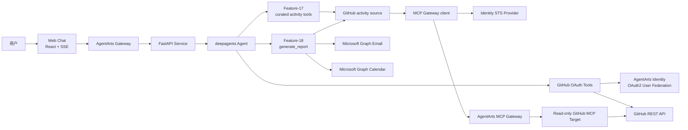
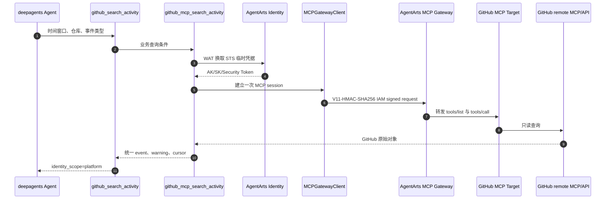
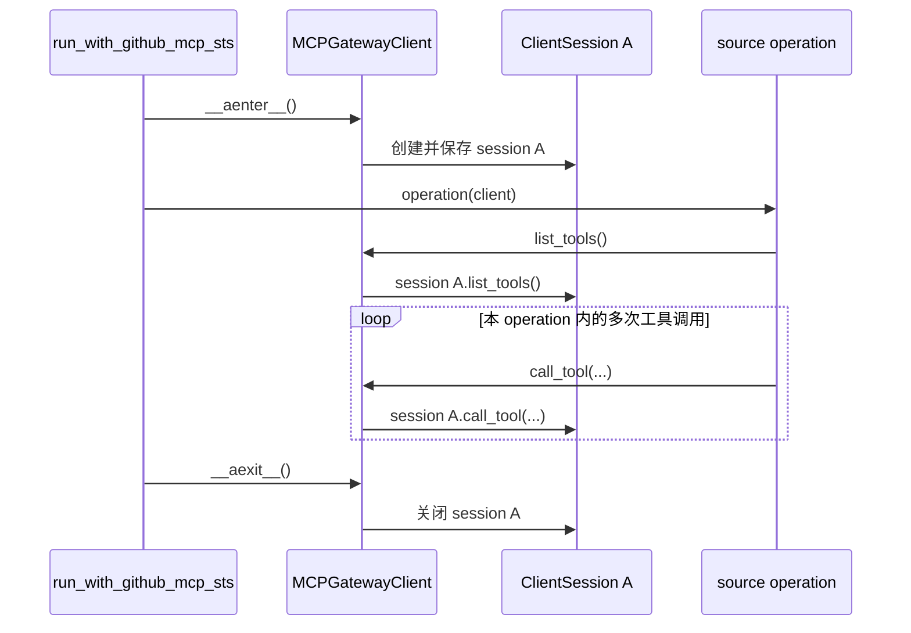
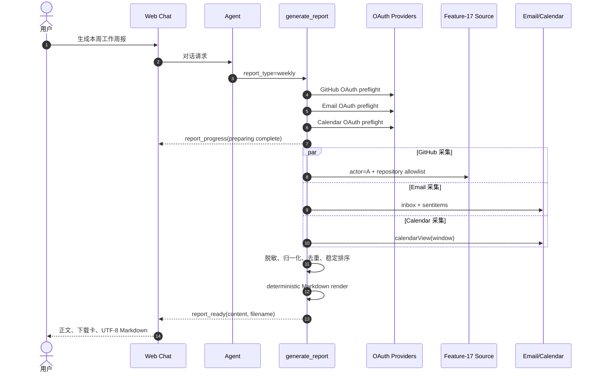
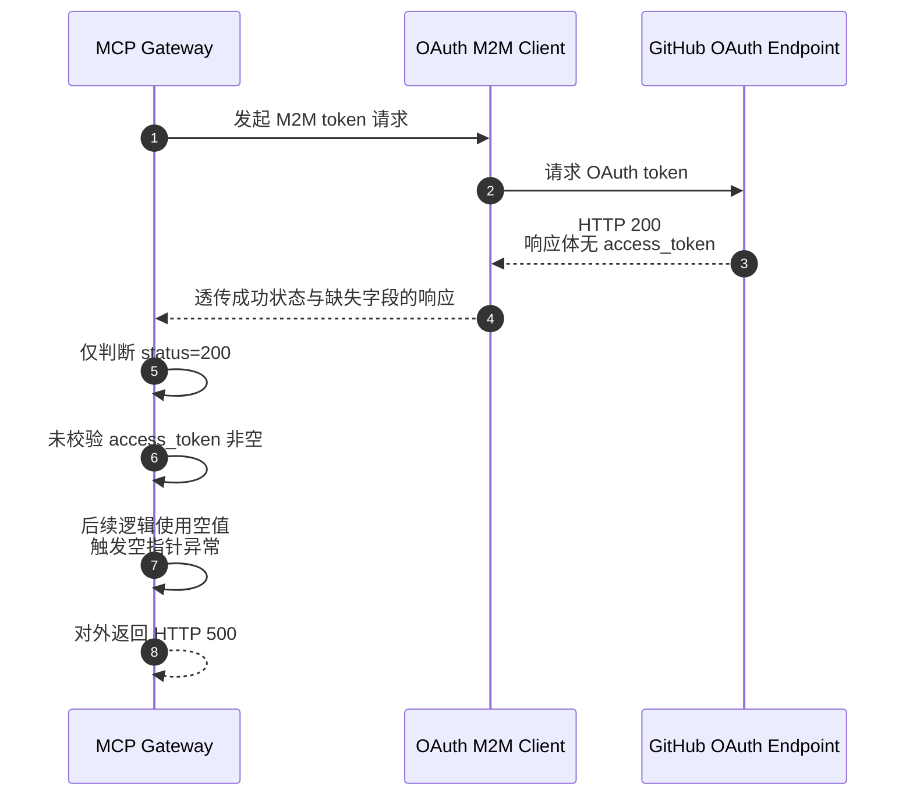

# Personal Assistant 实习功能实现 Wiki

> 本文用于说明实习期间参与的 GitHub Tools、Feature-17、Feature-18 以及现网 500 故障定位。文中的代码片段均来自当前仓库；为突出关键逻辑，部分片段省略了与主题无关的参数和异常展示代码。

## 1. 项目背景与工作范围

Personal Assistant 是运行在 AgentArts Runtime 上的对话式 AI 助手。项目以 Web Chat 为当前生产入口，通过 FastAPI、deepagents、LangGraph 和 React 实现对话，并通过 AgentArts Identity 管理 API Key、OAuth2 access token 和 STS 临时凭据。

本次实习工作主要覆盖以下四个模块：

| 模块 | 主要内容 | 关键产物 |
|---|---|---|
| GitHub Tools | 用户委托式 GitHub 仓库访问与 Use Case 文档 | `github_tools.py`、`github-tools.md` |
| Feature-17 | GitHub remote MCP 经 AgentArts MCP Gateway 的接入适配 | Gateway client、activity source、curated Agent tools |
| Feature-18 | 多数据源报表 root capability | `generate_report`、进度事件、Markdown 下载 |
| 现网问题定位 | OAuth M2M 成功响应缺少 token 导致 Gateway 500 | 根因链路与边界改进建议 |

需要特别说明：Feature-17 的准确含义是**接入已有的 GitHub remote MCP，并实现项目侧 MCP client、内部 data source 和 Agent tools**，不是从零开发一个通用 MCP Server。

### 1.1 主要实现演进

| 日期 | Commit | 代码范围 |
|---|---|---|
| 2026-06-26 | `6d69930` | 完善 GitHub OAuth 配置、授权回调和工具请求边界 |
| 2026-06-30 | `b309377` | 拆分并新增 GitHub 等 Tool Use Case 文档 |
| 2026-07-14 | `d4fead2` | Feature-17 Gateway client、GitHub MCP source 和工具初版 |
| 2026-07-17 | `3423e7b` | 完善 Feature-17 source/facade 契约及 PR activity 查询 |
| 2026-07-23 | `68e933a` | Feature-18 报表后端、前端下载和 E2E 代码 |
| 2026-08-07 | `7daeb5b` | 优化报表授权顺序、并行采集和实时进度体验 |
| 2026-08-10 | `76697d4` | 修正 Feature-18 UI 与事件时序的 Review 问题 |

## 2. 整体架构

图类型：**Component Diagram（组件图）**。用于展示本次实习功能在 Personal Assistant 中的静态边界。



这套结构包含两条不同的 GitHub 身份链路：

- GitHub Tools 通过 OAuth2 User Federation，以当前用户身份访问 GitHub REST API。
- Feature-17 通过 STS 和 IAM signing，以平台工作负载身份访问 MCP Gateway；Feature-18 再使用用户 OAuth 账号约束报告主体与仓库范围。

## 3. GitHub Tools 与 Use Case 文档

### 3.1 功能范围

GitHub Tools 面向仓库浏览和轻量操作场景：

| Tool | 功能 | 权限特征 |
|---|---|---|
| `github_list_repositories` | 列出当前用户可访问仓库 | OAuth2 用户委托，只读 |
| `github_list_repo_contents` | 查看仓库目录或文件项 | OAuth2 用户委托，只读 |
| `github_get_file_content` | 读取并解码文件内容 | OAuth2 用户委托，只读 |
| `github_search_code` | 搜索 GitHub 代码 | OAuth2 用户委托，只读 |
| `github_star_repository` | 为仓库加星 | OAuth2 用户委托，写操作需确认 |

关联文件：

- [GitHub 工具实现](personal-assistant-service/app/tools/github_tools.py)
- [GitHub Tools Use Case](personal-assistant-meta/specs/use-cases/github-tools.md)
- [Use Case 索引](personal-assistant-meta/specs/use-cases/README.md)

### 3.2 OAuth2 私有凭据边界

public tool 只接收业务参数，`access_token` 只在 `_github_request` 私有边界内由 AgentArts Identity 注入。

代码位置：[github_tools.py:184](personal-assistant-service/app/tools/github_tools.py#L184)

```python
@require_access_token(
    provider_name=get_github_provider_name(),
    scopes=get_github_scopes_list(),
    on_auth_url=_handle_auth_url,
    auth_flow="USER_FEDERATION",
)
async def _github_request(
    method: str,
    path: str,
    *,
    params: dict[str, Any] | None = None,
    access_token: str | None = None,
) -> Any:
    if not access_token:
        raise RuntimeError("access_token was not injected by require_access_token")
    _push_auth_complete()
    return await _raw_github_request(access_token, method, path, params=params)
```

该设计保证：

- LLM 不能读取或填写 GitHub token。
- 浏览器只展示授权状态，不保存第三方 token。
- 工具代码通过同一 private boundary 复用授权与 HTTP 请求逻辑。
- 缺少 token 时在靠近凭据边界的位置失败，不继续构造无效请求。

### 3.3 敏感写操作确认

`github_star_repository` 默认只返回预览，用户明确确认后才执行 `PUT` 请求。

代码位置：[github_tools.py:373](personal-assistant-service/app/tools/github_tools.py#L373)

```python
async def star_repository(
    owner: str,
    repo: str,
    confirm: bool = False,
) -> dict[str, Any]:
    """Star a GitHub repository for the current end user after confirmation."""
    owner = owner.strip()
    repo = repo.strip()
    if not owner or not repo:
        return {
            "starred": False,
            "repository": None,
            "error": "owner and repo are required",
        }

    repository = f"{owner}/{repo}"
    if not confirm:
        return {
            "starred": False,
            "repository": repository,
            "requires_confirmation": True,
            "preview": {"owner": owner, "repo": repo, "repository": repository},
            "error": "请确认是否为该 GitHub 仓库点赞。调用时设置 confirm=True。",
        }

    encoded_owner = quote(owner, safe="")
    encoded_repo = quote(repo, safe="")
    try:
        await _github_request("PUT", f"/user/starred/{encoded_owner}/{encoded_repo}")
        return {"starred": True, "repository": repository, "error": None}
    except Exception as e:
        logger.exception("star_repository failed")
        return {
            "starred": False,
            "repository": repository,
            "error": f"Request failed: {e!s}",
        }
```

### 3.4 Use Case 文档结构

GitHub Use Case 文档将代码能力整理为四类信息：

1. Tool 与用户意图、外部 API、Identity Provider 的映射。
2. 列仓库、读目录、读文件、搜代码、仓库加星等典型对话。
3. OAuth2 User Federation、Auth Card、Token Vault、Workload Identity 和 Guard 的能力映射。
4. token 不进入 LLM、浏览器 storage、日志或 public tool schema 的安全边界。

这使需求、实现和演示场景能够使用同一套术语，避免只描述接口而缺少用户视角。

## 4. Feature-17：GitHub MCP Activity Data Source

### 4.1 功能目标

Feature-17 通过 AgentArts MCP Gateway 接入只读 GitHub remote MCP，并提供：

- 四个稳定的 internal source：账号解析、仓库枚举、活动搜索、单条详情。
- 五类统一工程事件：commit、Pull Request、issue、review、comment。
- 两个 Agent-facing curated tools：活动搜索和活动详情。
- read-only capability allowlist、typed warning、cursor 分页和 partial result。
- WAT、STS、IAM signing 和 MCP session 组成的无长期密钥调用链。

### 4.2 运行时调用链

图类型：**Sequence Diagram（时序图）**。用于说明一次 Feature-17 工程活动查询的身份与调用顺序。



### 4.3 STS 临时凭据与一次 operation 内的 session 复用

这里的 `operation` 是传给 `run_with_github_mcp_sts` 的一个异步业务回调，例如“一次活动搜索”或“一批活动详情查询”。它不是单个 MCP HTTP 请求，也不代表整次报表生成或整个用户会话。

#### 4.3.1 由外层统一管理 session 生命周期

`run_with_github_mcp_sts` 先通过 `require_sts_token` 注入 STS 临时凭据，再使用 `async with` 创建一个 `MCPGatewayClient`。`operation(client)` 完成前始终使用这个 client；回调返回或抛出异常后，再由上下文管理器统一关闭 session。

代码位置：[gateway_client.py:180](personal-assistant-service/app/mcp/gateway_client.py#L180)

```python
@require_sts_token(
    provider_name=config.sts_provider_name,
    agency_session_name=config.sts_agency_session_name,
    into="sts_credentials",
)
async def _run(*, sts_credentials: StsCredentials) -> Any:
    async with MCPGatewayClient(
        config=config,
        sts_credentials=sts_credentials,
    ) as client:
        return await operation(client)

return await _run()
```

#### 4.3.2 client 保存并返回同一个 `ClientSession`

进入上下文时，`__aenter__` 只创建一次 MCP session，并将其保存在实例字段 `self._session` 中。后续代码不会重新调用 `session(...)`，而是统一通过 `_require_session()` 取回这个已打开的 session。

代码位置：[gateway_client.py:222](personal-assistant-service/app/mcp/gateway_client.py#L222)

```python
async def __aenter__(self) -> MCPGatewayClient:
    session_context = self._client().session(_GITHUB_MCP_SERVER_NAME)
    self._session_context = session_context
    self._session = await session_context.__aenter__()
    return self

def _require_session(self) -> ClientSession:
    if self._session is None:
        raise MCPGatewayError(
            "configuration_error",
            "GitHub MCP Gateway client session is not open.",
            retryable=False,
        )
    return self._session
```

`list_tools()` 和 `call_tool()` 都从 `_require_session()` 获取 session，因此一次 operation 中的能力发现和多次工具调用实际落在同一个 `ClientSession` 上。`list_tools()` 还使用 `_tools_cache` 和 `_tools_lock`，避免同一 client 内重复获取远端工具清单。

代码位置：[gateway_client.py:339](personal-assistant-service/app/mcp/gateway_client.py#L339)

```python
async def list_tools(self) -> list[MCPToolInfo]:
    if self._tools_cache is not None:
        return list(self._tools_cache)

    async with self._tools_lock:
        session = self._require_session()
        result = await session.list_tools()
        self._tools_cache = tuple(...)
        return list(self._tools_cache)

async def call_tool(self, name: str, arguments: dict[str, Any]) -> Any:
    session = self._require_session()
    result = await session.call_tool(name, arguments)
    return extract_mcp_payload(result)
```

退出上下文时，`__aexit__` 关闭进入时保存的 `session_context`，随后该 session 不再被复用。

#### 4.3.3 在 Activity Source 中的体现

`github_mcp_search_activity` 在 `_operation` 开头接收一次 client。能力发现、按需执行的平台账号解析、仓库发现和后续分页活动查询，都继续向下传递这个 client；函数末尾只调用一次 `run_with_github_mcp_sts(_operation)`。

代码位置：[github_activity_source.py:1517](personal-assistant-service/app/mcp/github_activity_source.py#L1517)

```python
async def _operation(client: MCPGatewayClient) -> GitHubActivityResult:
    tools = await _tool_index(client)

    if actor == "platform":
        identity = await _resolve_identity_with_tools(client, tools)

    if not repo_names:
        repo_names, discovery_warnings = await _discover_activity_repositories(
            client,
            tools,
            platform_login=activity_actor,
        )

    page = await _collect_activity_task(
        client,
        tools,
        task,
        # 省略时间窗口等业务参数
    )
    return GitHubActivityResult(...)

return await run_with_github_mcp_sts(_operation)
```

批量详情查询采用同样的结构：`github_mcp_get_details` 只创建一个 `_operation`，多个受并发限制的 `_fetch` 任务共享传入的 client 和工具索引。

代码位置：[github_activity_source.py:2000](personal-assistant-service/app/mcp/github_activity_source.py#L2000)

```python
async def _operation(client: MCPGatewayClient):
    tools = await _tool_index(client)
    semaphore = asyncio.Semaphore(concurrency)

    async def _fetch(event: GitHubActivityEvent):
        async with semaphore:
            return await _github_mcp_get_detail_with_tools(
                client,
                tools,
                event_type=event.event_type,
                repository=event.repository,
                external_id=event.external_id,
            )

    return list(await asyncio.gather(*(_fetch(event) for event in events)))

return await run_with_github_mcp_sts(_operation)
```



复用边界需要准确区分：

| 调用范围 | session 行为 |
|---|---|
| 一次 `github_mcp_search_activity` operation | 按需发生的账号解析、仓库发现和活动分页查询共享一个 session |
| 一次 `github_mcp_get_details` operation | 多条详情查询共享另一个 session，并受 semaphore 限制并发数 |
| 先搜索、再批量补充详情 | 属于两个 operation，因此分别创建和关闭各自的 session |
| 两次独立的 source 调用 | 不跨调用共享 session |

因此，更准确的表述是：**该实现避免了同一个 source operation 内重复创建和初始化 MCP session，并复用该 client 的工具清单缓存；底层 HTTP 连接池可以进一步复用网络连接，从而减少潜在的 TCP/TLS 建连开销，但不保证所有 HTTP 请求始终使用同一条物理 TCP 连接。**

### 4.4 AgentArts APIC IAM 签名

AgentArts MCP Gateway 使用非标准 `huaweicloud-agentarts.com` endpoint，底层 APIC 需要 V11 派生签名。代码通过华为云 SDK 切换签名算法，并指定 `apic` 服务名和区域。

代码位置：[gateway_client.py:131](personal-assistant-service/app/mcp/gateway_client.py#L131)

```python
def sign_httpx_request(
    request: httpx.Request,
    sts_credentials: StsCredentials,
) -> dict[str, str]:
    """Return IAM signed headers for an httpx request."""
    parsed = urlsplit(str(request.url))
    credentials = _credentials_to_global_credentials(sts_credentials)
    credentials.with_derived_predicate(
        GlobalCredentials.get_default_derived_predicate()
    )
    credentials._process_derived_auth_params("apic", "cn-southwest-2")

    sdk_request = SdkRequest(
        method=request.method,
        schema=parsed.scheme,
        host=_host_with_port(parsed),
        resource_path=parsed.path or "/",
        query_params=list(request.url.params.multi_items()),
        header_params=_request_headers_for_signing(request),
        body=request.content,
    )
    signed_request = credentials.sign_request(sdk_request)
    return dict(signed_request.header_params)
```

`HuaweiCloudIAMAuth` 对每一个 MCP HTTP 请求重新签名，包括无 body 的 session termination `DELETE`，避免请求在生命周期结束阶段漏签。

### 4.5 只读 capability allowlist

远端 MCP 的原子工具不会直接注册给 Agent。内部 source 先通过 `tools/list` 获取能力，再只保留工程活动读取所需的 suffix。

代码位置：[github_activity_source.py:221](personal-assistant-service/app/mcp/github_activity_source.py#L221)

```python
def is_read_only_activity_tool(tool_name: str) -> bool:
    return any(
        _matches_tool_suffix(tool_name, suffix)
        for suffix in _READ_TOOL_SUFFIXES
    )


def _build_tool_index(
    tools: list[MCPToolInfo],
) -> dict[str, MCPToolInfo]:
    return {
        tool.name: tool
        for tool in tools
        if is_read_only_activity_tool(tool.name)
    }
```

`_READ_TOOL_SUFFIXES` 只包含读取身份、仓库、commit、PR、issue、review 和 comment 的工具；create、update、delete 等写能力不会进入 source capability index。

### 4.6 统一 Activity 数据模型

代码位置：[github_activity_source.py:98](personal-assistant-service/app/mcp/github_activity_source.py#L98)

```python
@dataclass(slots=True)
class GitHubActivityEvent:
    provider: str
    event_type: GitHubActivityType
    repository: str
    external_id: str
    title: str
    parent_external_id: str | None = None
    url: str | None = None
    actor: str | None = None
    state: str | None = None
    created_at: str | None = None
    updated_at: str | None = None
    summary: str | None = None
    metrics: dict[str, Any] = field(default_factory=dict)
    details: dict[str, Any] = field(default_factory=dict)


@dataclass(slots=True)
class GitHubActivityResult:
    events: list[GitHubActivityEvent] = field(default_factory=list)
    warnings: list[GitHubMCPWarning] = field(default_factory=list)
    next_cursor: str | None = None
    identity_scope: Literal["platform"] = "platform"
```

统一模型使 Agent tool 和 Feature-18 不需要理解不同 GitHub 原子接口的返回结构，并能在部分请求失败时同时保留已取得的 events 和 typed warnings。

### 4.7 Curated Agent tools 与双开关

Agent 只看到两个业务级工具，而不是 `github_mcp_*` internal functions 或远端原子工具。

代码位置：[github_activity_tools.py:26](personal-assistant-service/app/tools/github_activity_tools.py#L26)

```python
async def github_search_activity(
    start_at: str,
    end_at: str,
    repositories: list[str] | None = None,
    event_types: list[GitHubActivityType] | None = None,
    limit: int = 30,
    timezone: str = "Asia/Shanghai",
    cursor: str | None = None,
) -> dict[str, Any]:
    """Search GitHub engineering activity visible to the platform account."""
    result = await github_mcp_search_activity(
        start_at=start_at,
        end_at=end_at,
        timezone=timezone,
        repositories=repositories,
        actor=None,
        event_types=event_types,
        limit=limit,
        cursor=cursor,
    )
    serialized = result.to_dict()
    events = serialized["events"]
    return {
        "ok": bool(result.events) or not result.warnings,
        "events": events,
        "count": len(events),
        "warnings": serialized["warnings"],
        "next_cursor": result.next_cursor,
        "identity_scope": result.identity_scope,
        "start_at": start_at,
        "end_at": end_at,
        "timezone": timezone,
    }
```

代码位置：[tools/__init__.py:110](personal-assistant-service/app/tools/__init__.py#L110)

```python
settings = get_settings()
if settings.github_mcp_enabled and settings.github_activity_tools_enabled:
    from app.tools.github_activity_tools import GITHUB_ACTIVITY_TOOLS

    tools.extend(GITHUB_ACTIVITY_TOOLS)
```

`github_mcp_enabled` 控制内部 MCP source，`github_activity_tools_enabled` 控制是否向 Agent 暴露 facade。这样 Feature-18 可以复用内部 source，而不必强制向 LLM 开放独立工程活动工具。

## 5. Feature-18：Report Root Capability

### 5.1 功能目标

Feature-18 将“生成日报、周报、月报、工作总结或研发进展总结”收敛为一个高层 `generate_report` 工具，避免让 LLM 临时串联多个低层工具。其主要能力包括：

- 支持 daily、weekly、monthly 和 custom 时间窗口。
- 默认采集 GitHub、Email 和 Calendar，支持显式选择 source。
- 先完成授权，再并行采集已授权的数据源。
- 将多源数据归一为 evidence、coverage 和 warning。
- 单个 source 失败时继续生成部分报告。
- 使用 deterministic renderer 输出 Markdown。
- 通过 `report_progress` 展示过程，通过 `report_ready` 交付原始 `.md` artifact。

### 5.2 端到端流程

图类型：**Sequence Diagram（时序图）**。用于说明一次报表生成的授权、采集、渲染与下载过程。



### 5.3 授权先于采集，并校验 token 语义

授权按 `_DEFAULT_SOURCES` 的 GitHub、Email、Calendar 固定顺序完成。某个 Provider 失败不会阻止后续 Provider 继续授权；只有全部 preflight 结束后才进入采集阶段。

代码位置：[report_tools.py:396](personal-assistant-service/app/tools/report_tools.py#L396)

```python
async def _authorize_report_sources(
    selected: tuple[ReportSource, ...],
) -> _ReportAuthorization:
    result = _ReportAuthorization()
    selected_set = set(selected)

    for source in _DEFAULT_SOURCES:
        if source not in selected_set:
            continue
        if source == "github" and not get_settings().github_mcp_enabled:
            result.failures[source] = _github_disabled_result()
            continue

        try:
            if source == "github":
                access_token = await authorize_github_report_access()
            elif source == "email":
                access_token = await authorize_email_report_access()
            else:
                access_token = await authorize_calendar_report_access()
        except Exception:
            logger.warning(
                "Report source authorization unavailable source=%s",
                source,
            )
            _push_report_auth_failed(source)
            result.failures[source] = _authorization_failure(source)
            continue

        if not isinstance(access_token, str) or not access_token:
            logger.warning(
                "Report source authorization returned no token source=%s",
                source,
            )
            _push_report_auth_failed(source)
            result.failures[source] = _authorization_failure(source)
            continue
        result.access_tokens[source] = access_token

    return result
```

这里不仅判断装饰器调用是否返回，还检查 token 是否为非空字符串，体现“协议成功不等于业务字段有效”的边界校验原则。

### 5.4 GitHub 主体与 MCP 读取通道分离

报表中的 GitHub 主体由用户 OAuth 确定。Service 先请求 `/user` 获取账号 A，再完整分页 `/user/repos` 形成 A 的 repository allowlist；随后将 `actor=A` 和 allowlist 交给 Feature-17 internal source。

代码位置：[report_tools.py:1205](personal-assistant-service/app/tools/report_tools.py#L1205)

```python
response = await github_mcp_search_activity(
    start_at=window.start_at,
    end_at=window.end_at,
    timezone=window.timezone,
    repositories=list(oauth_context.repositories),
    actor=oauth_context.login,
    limit=_GITHUB_LIMIT,
    cursor=cursor,
)
```

这一约束避免把 MCP 平台账号可见的全部活动误算为当前用户的个人工作活动。

### 5.5 多源并行采集与确定性合并

代码位置：[report_tools.py:1539](personal-assistant-service/app/tools/report_tools.py#L1539)

```python
authorization = await _authorize_report_sources(selected)
progress.emit(stage="preparing", status="complete", force=True)

source_results = dict(authorization.failures)
collection_sources: list[ReportSource] = []
collection_coroutines = []

for source in selected:
    if source in source_results:
        disabled = any(
            warning.warning_type == "github_source_disabled"
            for warning in source_results[source].warnings
        )
        progress.emit(
            source=source,
            stage=_source_progress_stage(source),
            status="skipped" if disabled else "failed",
            force=True,
        )
        continue
    access_token = authorization.access_tokens.get(source)
    if access_token is None:
        source_results[source] = _authorization_failure(source)
        progress.emit(
            source=source,
            stage=_source_progress_stage(source),
            status="failed",
            force=True,
        )
        continue
    collection_sources.append(source)
    collection_coroutines.append(
        _collect_authorized_source(source, window, access_token, progress)
    )

collected_results = await asyncio.gather(*collection_coroutines)
source_results.update(
    zip(collection_sources, collected_results, strict=True)
)
```

采集阶段使用 `asyncio.gather` 降低三源串行等待时间；合并阶段仍按照 `selected` 顺序处理，保证相同输入得到稳定结构。

### 5.6 归一化、渲染与 artifact 交付

代码位置：[report_tools.py:1586](personal-assistant-service/app/tools/report_tools.py#L1586)

```python
normalized_evidence = _deduplicate_evidence(evidence)
normalized_warnings = _deduplicate_warnings(warnings)
content = _build_markdown(
    report_type,
    window,
    audience,
    normalized_evidence,
    normalized_warnings,
    coverage,
    source_context,
)

result = ReportResult(
    report_type=report_type,
    window=window,
    content=content,
    evidence=normalized_evidence,
    warnings=normalized_warnings,
    source_coverage=coverage,
    source_context=source_context,
).to_dict()

_push_report_ready(
    content=content,
    filename=_report_filename(report_type, window),
    report_type=report_type,
    window=window,
)
return result
```

`ReportResult` 同时保留面向用户的 Markdown 和结构化 evidence，便于后续扩展其他导出方式；`report_ready` 发送的是 renderer 生成的原始 Markdown，下载内容不会依赖从聊天正文反向解析。

### 5.7 安全、单调的进度事件

代码位置：[report_tools.py:216](personal-assistant-service/app/tools/report_tools.py#L216)

```python
@dataclass(slots=True)
class _ReportProgressEmitter:
    """Emit ordered, throttled report progress without exposing source data."""

    sequence: int = 0
    _last_emitted_at: float = field(default=0.0, repr=False)
    _writer_unavailable_logged: bool = field(default=False, repr=False)

    def emit(
        self,
        *,
        stage: ReportProgressStage,
        status: ReportProgressStatus,
        source: ReportSource | None = None,
        current: int | None = None,
        total: int | None = None,
        discovered: int | None = None,
        force: bool = False,
    ) -> None:
        now = time.monotonic()
        if (
            not force
            and self._last_emitted_at
            and now - self._last_emitted_at < _PROGRESS_MIN_INTERVAL_SECONDS
        ):
            return

        self.sequence += 1
        event: dict[str, Any] = {
            "type": "report_progress",
            "report_progress": True,
            "sequence": self.sequence,
            "stage": stage,
            "status": status,
        }
        if source is not None:
            event["source"] = source
        if current is not None:
            event["current"] = max(current, 0)
        if total is not None:
            event["total"] = max(total, 0)
        if discovered is not None:
            event["discovered"] = max(discovered, 0)

        try:
            writer = get_stream_writer()
            writer(event)
            self._last_emitted_at = now
        except Exception:
            if not self._writer_unavailable_logged:
                logger.warning(
                    "get_stream_writer unavailable - report progress not streamed"
                )
                self._writer_unavailable_logged = True
```

进度事件只包含枚举状态、单调 sequence 和非负计数，不携带 token、cursor、仓库名、邮件主题或原始异常。`force=True` 用于阶段切换和终态，避免节流吞掉关键状态。

### 5.8 前端事件分流与消息隔离

前端把 Auth、Report Progress 和 Report Ready 作为结构化 custom event 处理，不将它们拼入 assistant 正文。

代码位置：[chat-event-handler.ts:95](personal-assistant-client/src/lib/chat/chat-event-handler.ts#L95)

```typescript
const progress = reportProgressPayload(event);
if (progress) {
  useReportProgressStore
    .getState()
    .setProgress(context.assistantMessageId, progress);
}

if (isReportReadyEvent) {
  useReportProgressStore
    .getState()
    .finishProgress(context.assistantMessageId, event.sequence, {
      createIfMissing: true,
    });
}

if (
  isReportReadyEvent &&
  event.report_format === "markdown" &&
  typeof event.report_content === "string" &&
  event.report_content.trim()
) {
  useReportDownloadStore.getState().setReport(context.assistantMessageId, {
    content: event.report_content,
    filename:
      typeof event.report_filename === "string" &&
      event.report_filename.trim()
        ? event.report_filename
        : "report.md",
    format: "markdown",
  });
}
```

`assistantMessageId` 是状态隔离键，避免多个会话或多条 assistant message 的授权卡、进度卡和下载卡相互覆盖。Progress Store 还使用 sequence 和 terminal tombstone 拒绝重复、倒退或迟到事件。

### 5.9 UTF-8 Markdown 保存

代码位置：[save-markdown.ts:64](personal-assistant-client/src/lib/save-markdown.ts#L64)

```typescript
export async function saveMarkdownFile(
  content: string,
  requestedFilename: string,
): Promise<SaveMarkdownResult> {
  const filename = normalizeMarkdownFilename(requestedFilename);
  const pickerWindow = window as WindowWithSaveFilePicker;

  if (pickerWindow.showSaveFilePicker) {
    try {
      const handle = await pickerWindow.showSaveFilePicker({
        suggestedName: filename,
        types: [
          {
            description: "Markdown",
            accept: { "text/markdown": [".md"] },
          },
        ],
      });
      const writable = await handle.createWritable();
      await writable.write(new Blob([content], { type: MARKDOWN_MIME_TYPE }));
      await writable.close();
      return "saved";
    } catch (error) {
      if (isAbortError(error)) return "cancelled";
      throw error;
    }
  }

  downloadWithAnchor(content, filename);
  return "saved";
}
```

支持 File System Access API 时使用原生“另存为”；不支持时回退到 Blob 与 anchor 下载。两条路径都直接保存后端生成的原始 Markdown。

## 6. 现网 500 故障定位

### 6.1 故障现象与根因链路

在配置 MCP Gateway 和开展联调测试时，调用方收到现网 500。逐层排查后确认链路如下：

图类型：**Sequence Diagram（时序图）**。用于说明 HTTP 成功响应如何在缺少业务字段时演变为 Gateway 500。



| 层级 | 表面现象 | 实际问题 |
|---|---|---|
| GitHub/OAuth 响应 | HTTP 200 | 响应体缺少必要的 `access_token` |
| Gateway 校验 | 将 200 视为 token exchange 成功 | 未校验字段存在、类型和非空值 |
| Gateway 后续处理 | 继续构造认证上下文 | 空 token 触发空指针异常 |
| 调用方 | 收到现网 500 | 上游语义错误被转换成内部异常 |

### 6.2 定位方法

本次定位采用了“从最终异常逆向还原调用链”的方法：

1. 先确认 500 发生在 Service、Gateway 还是 GitHub 上游。
2. 对照每一跳的 HTTP status、响应体结构和异常日志，而不是只看最终状态码。
3. 发现上游为 200 后，继续检查 OAuth token response 的必要字段。
4. 将“成功状态但缺少 token”作为控制变量，确认 Gateway 的语义校验缺口。
5. 把问题描述收敛为可复现链路：输入条件、上游响应、缺失校验和最终异常。

### 6.3 与项目代码的对应防御模式

Gateway 的平台内部空指针修复代码不在本仓库中，因此不能把项目代码描述成该现网问题的直接修复。但当前项目在相邻边界采用了相同的防御原则：

- `_github_request` 检查 decorator 是否注入了非空 token。
- `_authorize_report_sources` 检查返回值必须是非空字符串。
- 校验失败后转换为明确的 authorization failure，不继续进入数据采集。

平台侧建议采用的校验逻辑如下。该片段是修复原则示例，不是本仓库现有实现：

```python
payload = response.json()
access_token = payload.get("access_token")

if response.status_code != 200:
    raise OAuthTokenExchangeError("OAuth endpoint rejected the request")

if not isinstance(access_token, str) or not access_token.strip():
    raise OAuthTokenResponseError(
        "OAuth response is missing a valid access_token"
    )

return access_token.strip()
```

建议错误映射为可诊断的 4xx/502 或 typed Gateway error，并记录脱敏的 provider、request ID、status 和 schema validation 结果，不记录 token 或 client secret。

## 7. 核心文件索引

| 功能 | 文件 | 说明 |
|---|---|---|
| 项目定位 | [README.md](README.md) | Agent Identity 项目背景和总体架构 |
| GitHub OAuth 工具 | [github_tools.py](personal-assistant-service/app/tools/github_tools.py) | 仓库、文件、搜索、star、OAuth boundary |
| GitHub Use Case | [github-tools.md](personal-assistant-meta/specs/use-cases/github-tools.md) | 用户场景、Identity 映射和安全边界 |
| Feature-17 需求 | [issue.md](personal-assistant-meta/issues/features/backlog/feature-17-github-mcp-data-source/issue.md) | 功能范围与身份边界 |
| MCP Gateway client | [gateway_client.py](personal-assistant-service/app/mcp/gateway_client.py) | STS、IAM signing、session、错误映射 |
| GitHub activity source | [github_activity_source.py](personal-assistant-service/app/mcp/github_activity_source.py) | 能力发现、事件归一化、分页、详情 |
| Feature-17 Agent facade | [github_activity_tools.py](personal-assistant-service/app/tools/github_activity_tools.py) | 两个 curated Agent tools |
| Tool 注册 | [tools/__init__.py](personal-assistant-service/app/tools/__init__.py) | Feature-17 双开关和 Feature-18 root tool |
| Feature-18 需求 | [issue.md](personal-assistant-meta/issues/features/backlog/feature-18-report-root-capability/issue.md) | Report Use Case、范围和契约 |
| 报表后端 | [report_tools.py](personal-assistant-service/app/tools/report_tools.py) | 授权、采集、归一化、渲染、SSE |
| SSE 事件处理 | [chat-event-handler.ts](personal-assistant-client/src/lib/chat/chat-event-handler.ts) | Auth、Progress、Ready 事件分流 |
| 进度状态 | [report-progress-store.ts](personal-assistant-client/src/stores/report-progress-store.ts) | message scope、sequence、terminal tombstone |
| 下载状态 | [report-download-store.ts](personal-assistant-client/src/stores/report-download-store.ts) | message-scoped Markdown artifact |
| Markdown 保存 | [save-markdown.ts](personal-assistant-client/src/lib/save-markdown.ts) | UTF-8 原生保存和下载 fallback |
| 进度 UI | [ReportProgressCard.tsx](personal-assistant-client/src/components/chat/ReportProgressCard.tsx) | 多 source 进度展示 |
| 下载 UI | [ReportDownloadCard.tsx](personal-assistant-client/src/components/chat/ReportDownloadCard.tsx) | 报表下载卡状态与操作 |

## 8. 表述边界

为保证 Wiki 和实习材料准确，相关能力应按以下口径描述：

- Feature-17 是 GitHub remote MCP 的 Gateway 接入和业务适配，不是通用 MCP Server 开发。
- Feature-17 独立查询使用平台数据访问身份，结果明确标记 `identity_scope=platform`。
- Feature-18 使用用户 OAuth 确认主体 A 和仓库 allowlist，再通过 Feature-17 MCP 读取活动。
- Feature-18 是 `generate_report` root capability，不是让 LLM 临时串联 Email、Calendar 和 GitHub low-level tools。
- 现网 500 的贡献是协助测试完成根因定位；Gateway 平台内部修复不在本仓库中，不应写成已由本项目代码修复。
